## LDO

## DC-DC

### 开关电容DC-DC

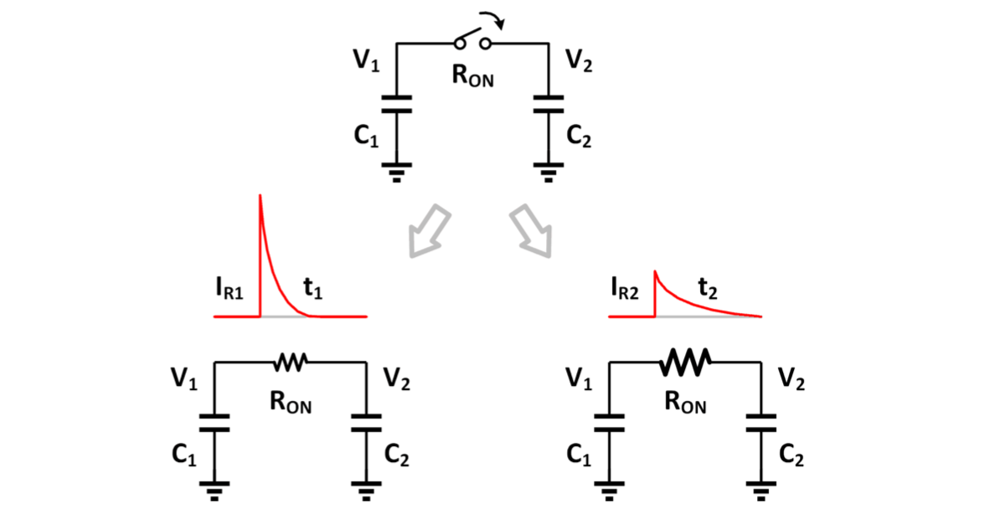

电荷转移中，导通电阻上的损失与电阻无关。

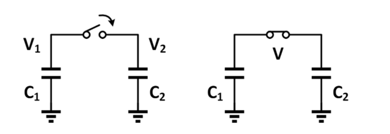

$$
C_1 V_1 + C_2 V_2 = (C_1+C_2) V\,,V=\frac{C_1V_1+C_2V_2}{C_1+C_2}
$$

$$
E_{cap}=\frac{1}{2}CV^2
$$

$$
E_{initial}=\frac{1}{2}C_1V_1^2+\frac{1}{2}C_2V_2^2
$$

$$
E_{final}=\frac{1}{2}{C_1}{C_2}V^2
$$

$$
E_{loss} = E_{initial}-E_{final}=\frac{1}{2}\left(\frac{C_1C_2}{C_1+C_2}\right)(V_1-V_2)^2
$$

#### 电压倍增器

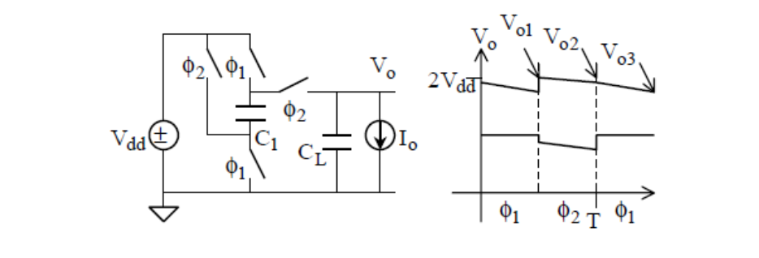

$\Phi_1$阶段给$C_1$充电，$\Phi_2$阶段$V_{dd}$把$C_2$捅上$2V_{dd}$

输出电压（考虑纹波）：

$$
\begin{aligned}
\bar V_o &= \frac{1}{2}\left(\frac{V_{o1}+V_{o2}}{2}+\frac{V_{o2}+V_{o3}}{2}\right)\\
&=2V_{dd}-\frac{I_oT}{C_1}+\frac{I_oT}{8(C_1+C_L)}-\frac{I_oT}{8C_L}
\end{aligned}
$$

$$
\Delta V = \frac{I_oT}{C_1}-\frac{I_oT}{8(C_1+C_L)}+\frac{I_oT}{8C_L}
$$

改进：加一个支路

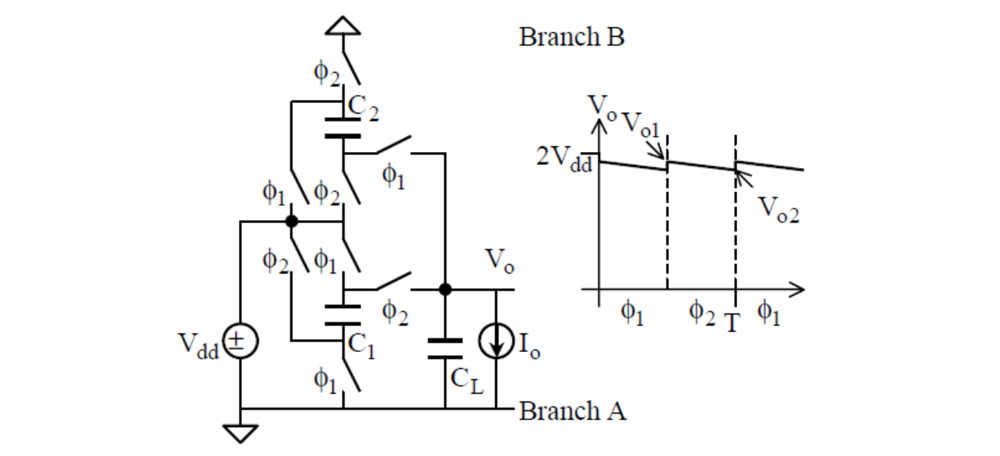

$\Phi_1$阶段：$C_2$和$V_{dd}$串联对$C_L$放电，$C_1$充电；

$\Phi_2$阶段：$C_1$​和$V_{dd}$​串联对$C_L$放电，$C_2$充电；

意义：压降大的时候比LDO高效！$\eta_{LDO}\approx\frac{V_{out}}{V_{in}}$, $\eta_{CP}\approx\frac{V_{out}}{VCR\times V_{in}}$

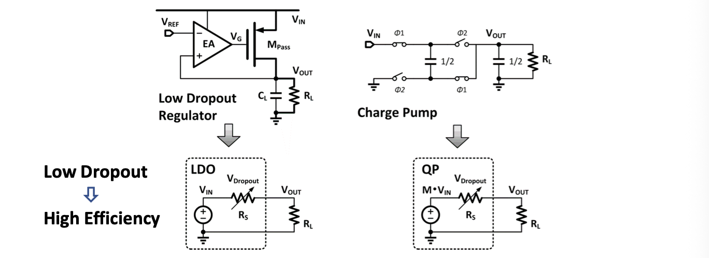

**开关电容DC-DC转换器只能处理离散VCR！**

#### 其他转换比

 1/2, 1/3, 2/3比例：可重构单元

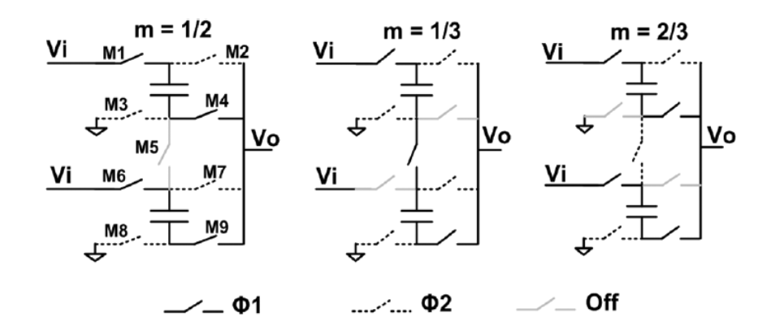

线性VCR拓扑（2，3，4，5）：Dickson/梯形/串-并联

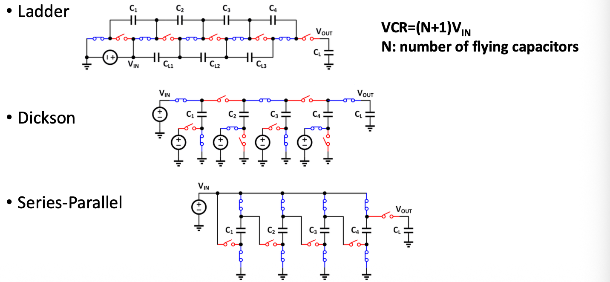

非线性VCR拓扑：

- 斐波那契比例（2，3，5，8）：

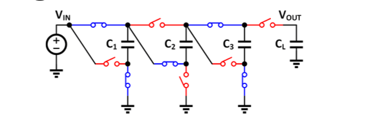

- 指数比例（2，4，8，16）：级连电压倍增器
- 多级

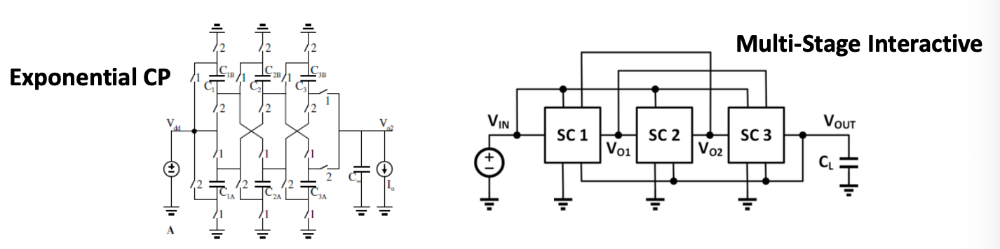

不同拓扑的对比：

1. 串联-并联结构：高效利用电容，串联阶段开关阻抗大，对电容受限场景适用（FIVR）
2. Dickson和梯型拓扑：高频更好，等效电容小
3. Fibonacci：电容利用率和开关利用率都一般

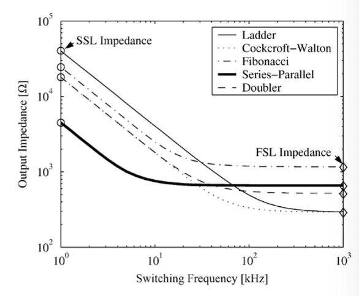

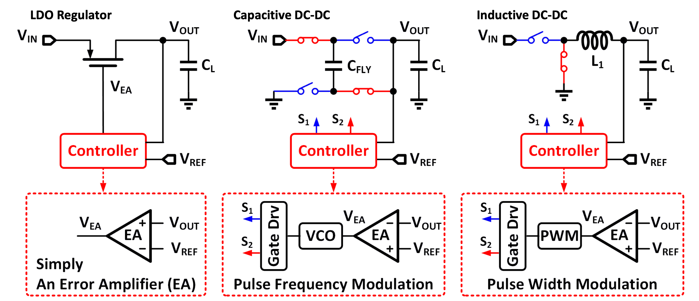