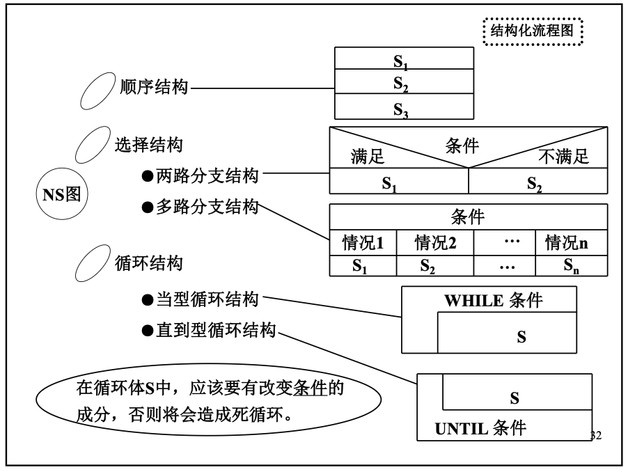

# 计算机程序设计基础

## C 部分（计算机程序设计基础（1））

这门课的主线不是记语法，而是把一个问题拆成计算机能够逐步执行的过程，再用 C 语言准确表达出来。下面按课件的 13 章整理，例子均采用标准 C 的写法；涉及编译器差异的地方另作说明。

## 1. 绪论

### 1.1 程序、算法与结构化设计

**算法**是解决一类问题的有限步骤集合。一个可执行的算法至少应满足：步骤明确、能够终止、允许输入、产生输出，并且每一步都能在有限时间内完成。

程序设计通常经过以下过程：

1. 分析问题，明确输入、输出和约束；
2. 建立数学模型，选择数据结构和算法；
3. 用流程图、NS 图或伪代码描述流程；
4. 编码、编译、链接、运行；
5. 测试并调试。

结构化程序只用三种基本控制结构：**顺序、选择、循环**。每个结构只有一个入口和一个出口，复杂程序则通过模块分解和逐步求精完成。

传统流程图用箭头表示控制流，容易出现随意跳转，也不便于表示嵌套。NS 图把每个基本结构画成一个方框，结构边界、作用域和嵌套关系更清楚。



### 1.2 测试与调试

测试的目的，是尽可能发现错误，而不是证明程序正确。测试数据至少要包括：

- 正常情况；
- 边界值，如 0、1、最大值、最小值；
- 特殊情况，如空输入、重复值、除数为 0；
- 非法输入（题目要求处理时）。

调试是定位并修正错误。常见错误可分为：

- **编译错误**：语法、类型或声明有问题；
- **链接错误**：函数只有声明却没有定义，或缺少所需库；
- **运行错误**：越界、空指针解引用、除零等；
- **逻辑错误**：程序能运行，但算法或边界处理不对。

调试时不要只盯着最终结果。先找出第一个偏离预期的中间状态，再向前追查，通常比反复改代码更快。

### 1.3 程序设计语言与 C 程序

机器语言由机器指令组成；汇编语言用助记符表示指令；高级语言更接近人的表达方式。C 源程序须经预处理、编译和链接生成可执行文件。

```c
#include <stdio.h>

int main(void)
{
    int a, b;
    scanf("%d%d", &a, &b);
    printf("%d\n", a + b);
    return 0;
}
```

- `#include <stdio.h>` 引入标准输入输出函数的声明；
- `main` 是程序入口，标准写法应明确返回 `int`；
- 花括号围成函数体或复合语句；
- C 区分大小写，一般语句以分号结束；
- 注释可写成 `/* ... */` 或 `// ...`。

## 2. C 语言的基本数据类型

### 2.1 进位计数制

一个 $r$ 进制数中，每一位的权为 $r^k$。二进制、八进制和十六进制之间可以分别按 3 位、4 位二进制直接分组转换。

- 十进制整数转 $r$ 进制：除 $r$ 取余，余数逆序排列；
- 十进制小数转 $r$ 进制：乘 $r$ 取整，整数部分顺序排列；
- $r$ 进制转十进制：各位数字乘相应位权后求和。

十进制小数在二进制中不一定能有限表示，`0.1 + 0.2` 一类计算因此可能有微小舍入误差。判断浮点数相等通常应比较误差，而不是直接使用 `==`。

### 2.2 整数在计算机中的表示

原码的最高位表示符号；负数的反码是原码符号位不变、其余位取反；负数的补码是在反码末位加 1。现代计算机通常用补码保存有符号整数，因为加减法可以使用同一套电路，并且 0 只有一种表示。

对 $n$ 位整数：

- 无符号数范围为 $0\sim 2^n-1$；
- 二进制补码有符号数范围为 $-2^{n-1}\sim 2^{n-1}-1$。

C 标准没有规定 `int` 必须是 32 位，应以当前平台的 `sizeof` 和 `<limits.h>` 为准。无符号整数运算按模 $2^n$ 回绕；有符号整数溢出则是未定义行为。

### 2.3 基本类型、常量与变量

C 的基本类型包括：

- 整型：`char`、`short`、`int`、`long`、`long long`，以及对应的 `unsigned` 类型；
- 浮点型：`float`、`double`、`long double`；
- 空类型：`void`；
- C99 还提供布尔类型 `_Bool`，可通过 `<stdbool.h>` 使用 `bool`。

常量的常见写法：

```c
42          /* 十进制整数 */
052         /* 八进制整数，等于十进制 42；08 不是合法八进制常量 */
0x2A        /* 十六进制整数 */
42U         /* unsigned int */
42L         /* long */
3.14        /* double */
3.14f       /* float */
2.5e-3      /* 科学计数法 */
'A'         /* 字符常量 */
"A"         /* 字符串，占两个 char：'A' 和 '\0' */
```

转义字符包括 `\n`（换行）、`\t`（制表）、`\\`（反斜杠）、`\'`、`\"` 和 `\0`。字符在计算中按其字符编码值参与整型运算，如 `'7' - '0'` 得到整数 `7`。

变量使用前必须先定义。未显式初始化的全局变量和静态变量初始化为 0；自动局部变量的初值不确定，读取它会产生未定义行为。

```c
const double pi = 3.141592653589793;
unsigned long count = 0UL;
char grade = 'A';
```

`const` 表示不应通过该名字修改对象；它与预处理宏不同，仍然具有类型和作用域。

### 2.4 `sizeof` 与类型转换

`sizeof(类型)` 或 `sizeof 表达式` 得到对象占用的字节数，结果类型为 `size_t`。除变长数组外，`sizeof` 的操作数通常不会被求值，因此 `sizeof(i++)` 不会令 `i` 增加。

混合运算会发生整型提升和通常算术转换，较低等级的类型转换为较高等级的类型。赋值时还会转换为左侧变量的类型：

```c
double x = 5 / 2;          /* 先做整数除法，x 为 2.0 */
double y = 5.0 / 2;        /* y 为 2.5 */
int n = (int)3.8;          /* 强制转换，截去小数部分，n 为 3 */
```

强制类型转换只改变这次表达式的计算方式，不改变原变量本身的类型。

## 3. 数据的输入与输出

C 语言本身没有输入输出语句，相关功能由标准库提供。`stdin`、`stdout` 和 `stderr` 分别表示标准输入、标准输出和标准错误流。

### 3.1 `printf`

```c
printf("格式控制字符串", 输出项1, 输出项2, ...);
```

常用格式说明如下：

| 类型 | 常用格式 | 说明 |
| --- | --- | --- |
| `int` | `%d`、`%i` | 有符号十进制 |
| `unsigned int` | `%u`、`%o`、`%x`、`%X` | 无符号十、八、十六进制 |
| `long` / `long long` | `%ld` / `%lld` | 长整型、超长整型 |
| `double` | `%f`、`%e`、`%g` | `printf` 中 `float` 会提升为 `double` |
| `char` | `%c` | 单个字符 |
| 字符串 | `%s` | 输出到 `\0` 为止 |
| 指针 | `%p` | 参数应转换为 `void *` |
| `size_t` | `%zu` | `sizeof` 的结果 |

`%8.2f` 表示总场宽至少为 8，小数点后保留 2 位；`%-8d` 左对齐；`%08d` 用 0 补足。场宽不足时不会截断数据。`printf` 的返回值是成功输出的字符数，失败时为负数。

格式说明与实参类型或数量不一致是未定义行为。一个表达式中也不要多次修改同一变量，例如 `printf("%d %d", i++, i++)` 的结果不应依赖。

### 3.2 `scanf`

```c
int a;
double x;
char word[20];
int ok = scanf("%d%lf%19s", &a, &x, word);
```

- 除数组名等本身可转换为地址的表达式外，接收变量要写地址；
- `float *` 用 `%f`，`double *` 用 `%lf`，不要与 `printf` 的规则混淆；
- `%s` 应限制最大宽度，给结尾的 `\0` 留出一个位置；
- `%c` 不跳过空白，常写成 `" %c"`，前面的空格会吃掉残留空白；
- `%*d` 表示读入一个整数但不保存；
- 返回值是成功赋值的项目数，输入结束且没有完成任何转换时返回 `EOF`。

```c
while (scanf("%d", &a) == 1) {
    /* 每次只处理一次有效输入 */
}
```

格式串中的普通字符必须与输入完全匹配。`scanf("%d,%d", &a, &b)` 要求两个数之间真的出现逗号。

### 3.3 字符与字符串输入输出

`getchar()` 读取一个字节，返回类型是 `int`，这样才能同时表示所有 `unsigned char` 值和 `EOF`。因此判断文件结束时不要先把结果存进 `char`。

```c
int ch;
while ((ch = getchar()) != EOF) {
    putchar(ch);
}
```

`puts` 输出字符串并自动换行。读取一整行应使用 `fgets`：

```c
char line[100];
if (fgets(line, sizeof line, stdin) != NULL) {
    /* 成功读入，换行符可能仍在 line 中 */
}
```

课件中出现的 `_getch`、`_getche`、`_ungetch` 来自特定编译器的 `<conio.h>`，不属于标准 C；可移植程序不要依赖它们。标准库的 `ungetc` 用于把一个字符退回输入流。

## 4. C 表达式与宏定义

### 4.1 赋值、算术、关系与逻辑运算

赋值表达式 `变量 = 表达式` 的值就是赋入后的值，结合方向从右向左，因此 `a = b = 0` 可用。`+=`、`-=`、`*=`、`/=`、`%=` 等复合赋值只对左操作数求值一次。

整数的 `/` 舍去小数部分，C99 起结果向 0 截断；余数满足 `(a / b) * b + a % b == a`，余数与被除数同号。`%` 只能用于整数。

关系运算结果为 0 或 1。不要把 `==` 误写成 `=`：

```c
if (x = 0) { ... }   /* 给 x 赋 0，条件恒假 */
if (x == 0) { ... }  /* 判断 x 是否为 0 */
```

逻辑非、与、或分别为 `!`、`&&`、`||`。C 中 0 为假，非 0 为真。`&&` 和 `||` 采用短路求值：

```c
if (p != NULL && *p > 0) { ... }  /* p 为空时不会计算 *p */
```

不要写数学式 `0 < x < 10`。它先算 `0 < x`，结果 0 或 1，再与 10 比较，几乎总为真；正确写法是 `0 < x && x < 10`。

### 4.2 其他运算符

- 前置 `++i`：先增加，再产生新值；后置 `i++`：先产生旧值，再增加；
- 条件运算：`条件 ? 表达式1 : 表达式2`，只计算其中一个分支；
- 逗号运算：从左到右计算，整个表达式的值为最后一项的值；
- 取地址与间接访问：`&x`、`*p`；
- 成员访问：`.` 与 `->`；
- 数组下标和函数调用：`[]`、`()`。

运算符优先级只决定表达式如何分组，不保证子表达式的实际求值先后。看不准时应加括号，也不要在同一个完整表达式中既修改对象又以无确定顺序读取它。

### 4.3 标准数学函数

`<math.h>` 中常用函数包括 `sqrt`、`pow`、`fabs`、`exp`、`log`、`sin`、`cos`。参数和返回值通常为 `double`。

```c
#include <math.h>
double distance = sqrt(x * x + y * y);
```

在部分 Unix 编译环境中，链接时还要加 `-lm`。

### 4.4 宏定义

```c
#define PI 3.141592653589793
#define SQUARE(x) ((x) * (x))
#define TO_STRING(x) #x
```

宏是预处理阶段的文本替换，没有类型检查。带参数宏要把每个参数和整个替换体都加括号；即使如此，`SQUARE(i++)` 仍会使 `i` 增加两次，所以有副作用的实参不要传给会重复使用参数的宏。

`#` 把实参转换成字符串；`##` 可以连接两个记号。多行宏末尾用反斜杠续行。常量优先考虑 `const` 或枚举，简单计算优先考虑函数；只有确实需要文本替换时再用宏。

## 5. 选择结构

### 5.1 语句、复合语句和作用域

表达式加分号构成表达式语句；单独一个分号是空语句；花括号中的若干声明和语句组成复合语句。复合语句在语法上等价于一条语句，并引入新的块作用域。

```c
if (condition);     /* 这个分号是空语句 */
{
    work();         /* 无论条件真假都会执行 */
}
```

### 5.2 `if` 与 `if ... else`

```c
if (score >= 60) {
    puts("pass");
} else {
    puts("fail");
}
```

没有花括号时，`else` 总与最近一个尚未配对的 `if` 结合。即使分支只有一条语句，也建议保留花括号。

多分支常写成 `if - else if - else`。区间判断要注意先后次序，例如成绩等级应先判断最高分段，否则较宽的条件会提前截住后续分支。

### 5.3 条件运算符

条件表达式适合在两个值中选一个：

```c
max = a > b ? a : b;
```

若分支要执行多条语句或具有明显副作用，`if` 通常更清楚。

### 5.4 `switch`

```c
switch (op) {
case '+':
    result = a + b;
    break;
case '-':
    result = a - b;
    break;
default:
    puts("unknown operator");
    break;
}
```

控制表达式必须是整数或枚举类型，`case` 后必须是互不相同的整型常量表达式。进入某个 `case` 后会继续向下执行，直到遇到 `break` 或 `switch` 结束；有意贯穿时应写注释说明。`default` 可放在任意位置，但通常放在最后。

## 6. 编译预处理

预处理命令以 `#` 开头，不是 C 语句，末尾通常不加分号。

### 6.1 文件包含

```c
#include <stdio.h>     /* 通常从系统头文件目录查找 */
#include "my_math.h"   /* 通常先从当前工程查找 */
```

头文件中一般放类型定义、宏、常量和函数声明，不应随意放普通函数定义或外部变量定义。用包含保护避免重复包含：

```c
#ifndef MY_MATH_H
#define MY_MATH_H

double mean(const double a[], int n);

#endif
```

### 6.2 条件编译

```c
#ifdef DEBUG
    fprintf(stderr, "x = %d\n", x);
#endif

#if VERSION >= 2
    /* 新版本代码 */
#else
    /* 兼容代码 */
#endif
```

`defined(NAME)` 可在 `#if` 中判断宏是否已定义。条件编译适合平台差异、调试输出和可选功能，不适合代替普通运行时分支。

### 6.3 `#pragma` 与 `#line`

`#pragma` 向编译器传递实现相关指令，不同编译器支持情况不同。课件重点涉及 `#pragma pack(n)`：它会影响结构体成员的最大对齐粒度，使用后应恢复原设置，否则后面的结构体布局也可能改变。

`#line 行号 "文件名"` 修改编译器此后报告的逻辑行号和文件名，常用于代码生成工具，普通程序很少直接使用。

## 7. 循环结构

### 7.1 `while`、`do ... while` 与 `for`

`while` 先判断后执行，循环体可能一次也不执行；`do ... while` 先执行后判断，至少执行一次，末尾不要漏掉分号。

```c
while (condition) {
    /* 循环体 */
}

do {
    /* 循环体 */
} while (condition);

for (初始化; 条件; 更新) {
    /* 循环体 */
}
```

设计循环时要明确四件事：循环变量的初值、继续条件、每轮工作、状态更新。边界错误常来自 `<` 与 `<=` 混淆，最好先手算第 0 次、第一次和最后一次循环。

`for` 的三个表达式均可省略。省略条件相当于真，但循环仍要通过 `break` 等方式退出。

### 7.2 嵌套、`break` 与 `continue`

循环可以嵌套。内层循环变量一般要在每次进入内层循环前重新初始化。

- `break` 只跳出它所在的最内层循环或 `switch`；
- `continue` 跳过本轮余下语句，进入下一轮；
- 在 `for` 中，`continue` 后先执行更新表达式；在 `while` 中则直接判断条件，注意不要漏掉必要的状态更新。

需要同时退出多层循环时，可以设置标志、把循环封装为函数后 `return`，或重新组织条件。

### 7.3 输入循环

把输入函数的返回值直接作为循环条件，能同时处理正常输入和文件结束：

```c
int x, sum = 0;
while (scanf("%d", &x) == 1 && x > 0) {
    sum += x;
}
```

不要使用 `while (!feof(stdin))` 预测文件结束。`feof` 只有在一次读取已经失败后才会置位，容易把上一次数据重复处理。

### 7.4 常用算法思路

- **列举法**：遍历有限候选集，逐个验证条件；
- **试探法**：按规则生成候选，失败后调整再试；
- **整数分解**：反复使用 `/` 和 `%` 取出各位或因子；
- **级数求和**：更新通项并累加，浮点终止条件应使用误差；
- **方程求根**：二分法要求区间端点函数值异号，牛顿法要注意导数为 0 和初值；
- **数值积分**：把区间分段，逐段累加矩形或梯形面积。

## 8. 模块设计（函数）

### 8.1 函数的声明、定义与调用

函数把一个完整任务分成职责明确的模块，有利于阅读、测试、修改和复用。

```c
double max(double a, double b);     /* 声明，也叫函数原型 */

double max(double a, double b)      /* 定义 */
{
    return a > b ? a : b;
}
```

调用函数前应已有声明。返回类型为 `void` 的函数不返回值；非 `void` 函数的所有正常路径都应返回与声明兼容的值。`return` 立即结束当前函数。

### 8.2 参数传递

C 的参数传递都是**值传递**：形参得到实参值的副本，修改形参不改变实参。

```c
void swap_wrong(int a, int b)
{
    int t = a;
    a = b;
    b = t;               /* 只交换了副本 */
}

void swap(int *a, int *b)
{
    int t = *a;
    *a = *b;
    *b = t;
}
```

所谓“传地址”，仍是把地址值复制给指针形参；通过该地址间接访问，才修改了调用者对象。

### 8.3 作用域、存储期与链接

- 块内定义的名字具有块作用域；函数外定义的名字具有文件作用域；
- 普通局部变量通常具有自动存储期，每次进入块时创建，离开时失效；
- `static` 局部变量具有静态存储期，只初始化一次，但作用域仍在函数内；
- 全局变量具有静态存储期，应尽量减少使用，以免模块间形成隐含依赖；
- 文件作用域的 `static` 函数或变量只在本源文件可见；
- `extern` 声明引用其他位置定义的外部对象或函数。

同名时，内层作用域会遮蔽外层名字。返回局部自动变量的地址是错误的，因为函数返回后该对象已经失效。

### 8.4 递归

递归函数直接或间接调用自身。正确的递归必须包含：

1. 明确的终止条件；
2. 每次调用都向终止条件靠近；
3. 对当前规模问题的处理，以及对子问题结果的组合。

```c
long long factorial(int n)
{
    if (n <= 1) {
        return 1;
    }
    return n * factorial(n - 1);
}
```

每次调用都有独立的形参和局部变量，保存在调用栈中。递归层数过深会导致栈溢出；能自然改写成简单循环时，循环通常更省空间。Hanoi 塔是典型的递归分解：先把 $n-1$ 个盘移到辅助柱，再移动最大盘，最后把 $n-1$ 个盘移到目标柱。

## 9. 数组与字符串

### 9.1 一维数组

数组是相同类型元素的连续集合，下标从 0 开始：

```c
int a[5] = {1, 2, 3};        /* 其余元素初始化为 0 */
int b[] = {1, 2, 3, 4};      /* 编译器推断长度为 4 */
size_t n = sizeof b / sizeof b[0];
```

合法下标为 `0` 到 `长度 - 1`。C 不做越界检查，越界读写是未定义行为。数组定义后不能整体赋值，也不能用 `==` 比较内容；应逐元素处理或调用适当库函数。

### 9.2 二维数组

```c
int matrix[2][3] = {
    {1, 2, 3},
    {4, 5, 6}
};
```

二维数组按行连续存储。`matrix[i][j]` 等价于 `*(*(matrix + i) + j)`。传给函数时，第一维长度可省略，但后续维度必须已知，这样编译器才能计算每一行的跨度：

```c
void print_matrix(int a[][3], int rows);
/* 等价参数形式：void print_matrix(int (*a)[3], int rows); */
```

### 9.3 数组作为函数参数

函数形参中的 `int a[]` 会调整为 `int *a`，函数只收到首元素地址，不知道数组长度。因此长度要另作参数传入，在函数中对该形参使用 `sizeof a` 得到的是指针大小，不是整个数组大小。

若函数只读取数组，可写：

```c
double average(const double a[], size_t n);
```

`const` 能防止函数意外修改元素，也把接口意图写得更清楚。

### 9.4 字符数组与字符串

C 字符串是以空字符 `\0` 结尾的字符序列：

```c
char s1[] = "hello";         /* 可修改数组，大小为 6 */
const char *s2 = "hello";    /* 指向字符串字面量，不应修改 */
char s3[5] = {'h', 'e', 'l', 'l', 'o'}; /* 没有 \0，不是 C 字符串 */
```

常用 `<string.h>` 函数：

| 函数 | 作用 | 注意 |
| --- | --- | --- |
| `strlen(s)` | 返回 `\0` 前的字符数 | 不含 `\0` |
| `strcpy(dst, src)` | 复制字符串 | 目标空间必须足够 |
| `strcat(dst, src)` | 追加字符串 | 目标空间必须足够 |
| `strcmp(a, b)` | 按字典序比较 | 返回负、0、正，不保证是 -1/0/1 |
| `strchr(s, c)` | 查找字符 | 返回指针或 `NULL` |
| `strstr(s, sub)` | 查找子串 | 返回首次出现位置或 `NULL` |

`scanf("%s", s)` 遇空白停止，读取整行用 `fgets`。`gets` 无法限制长度，已从 C 标准中删除，不能使用。

### 9.5 查找与排序

**顺序查找**适用于一般表，逐项比较，时间复杂度为 $O(n)$。**二分查找**只适用于有序表，每次排除一半区间，时间复杂度为 $O(\log n)$：

```c
int binary_search(const int a[], int n, int key)
{
    int left = 0, right = n - 1;
    while (left <= right) {
        int mid = left + (right - left) / 2;
        if (a[mid] == key) return mid;
        if (a[mid] < key) left = mid + 1;
        else right = mid - 1;
    }
    return -1;
}
```

课件涉及三种基础排序：

- 冒泡排序：相邻元素逆序就交换，每轮把一个极值送到末端；
- 选择排序：每轮在未排序区间选择最小值，与区间首项交换；
- 插入排序：把当前元素插入前面已经有序的部分。

三者平均时间复杂度都是 $O(n^2)$；插入排序对接近有序的小数组常较合适。写排序时要先明确内外层循环的不变量和下标范围。

## 10. 指针

### 10.1 基本概念

指针变量保存对象地址；`&` 取得地址，`*` 通过地址访问对象。

```c
int x = 3;
int *p = &x;
*p = 5;             /* x 变为 5 */
```

`int *p, q;` 中只有 `p` 是指针，`q` 是 `int`。未初始化指针不能解引用；不指向有效对象时应设为 `NULL`，但解引用 `NULL` 同样错误。

`void *` 可以保存任意对象指针，转换回原类型后再解引用。指针类型不仅说明所指对象类型，也决定解引用方式和指针算术的步长。

### 10.2 指针运算与数组

若 `p` 指向数组元素，则 `p + 1` 指向下一个元素，地址增加 `sizeof *p` 个字节。只允许在同一数组（以及尾后一个位置）范围内进行指针加减和有序比较；尾后指针可比较但不能解引用。

在多数表达式中，数组名会转换为首元素指针：

```c
int a[10];
int *p = a;          /* 与 &a[0] 相同 */
a[i] == *(a + i);    /* 两种访问等价 */
```

但 `sizeof a` 和 `&a` 是例外。`&a` 的类型是“指向整个数组的指针”，即 `int (*)[10]`，与 `int *` 不同。

### 10.3 指针数组、数组指针和二级指针

声明应从变量名向外读：

```c
int *p[10];          /* p 是数组，有 10 个 int * 元素：指针数组 */
int (*q)[10];        /* q 是指针，指向含 10 个 int 的数组：数组指针 */
int **r;             /* r 指向 int *：二级指针 */
```

二级指针常用于修改一个指针变量、处理指针数组或动态二维结构。二维数组不是 `int **`：它的各行连续，传参时应使用与列数匹配的数组指针。

### 10.4 动态内存

`<stdlib.h>` 提供：

- `malloc(bytes)`：申请指定字节数，内容未初始化；
- `calloc(count, size)`：申请元素数组，并把所有字节置 0；
- `realloc(ptr, new_size)`：调整内存块大小，地址可能改变；
- `free(ptr)`：释放动态内存，`free(NULL)` 合法。

```c
int *a = malloc(n * sizeof *a);
if (a == NULL) {
    /* 申请失败 */
}

/* 使用 a */

free(a);
a = NULL;
```

在 C 中 `void *` 可自动转换为对象指针，不必给 `malloc` 返回值强制转换；省略转换还能及时暴露漏写 `<stdlib.h>` 的问题。计算申请大小时优先写 `sizeof *a`，类型改变后不易出错。

`realloc` 失败时原内存仍有效，因此要用临时指针接收：

```c
int *tmp = realloc(a, new_n * sizeof *a);
if (tmp != NULL) {
    a = tmp;
}
```

常见内存错误有：泄漏、重复释放、释放后继续使用、越界、释放非动态内存。每一块成功申请的内存都应有清楚的所有者和唯一的释放位置。

### 10.5 字符串指针

```c
char a[] = "abc";          /* 数组内容可修改 */
const char *p = "abc";     /* 指针可改指向，字面量不可修改 */
```

数组名不能重新赋值，指针变量可以。把字符串指针作为参数时，若函数不修改内容应写 `const char *`。

### 10.6 函数指针和返回指针的函数

```c
double add(double x, double y) { return x + y; }

double (*operation)(double, double) = add;
double result = operation(2.0, 3.0);
```

函数指针可用于回调、按条件选择算法和函数表。函数指针数组写作 `double (*ops[4])(double, double)`。

返回指针的函数写作 `int *find(...)`；不能返回局部自动变量的地址，但可以返回数组元素地址、动态内存地址、静态对象地址或由调用者传入的地址。

### 10.7 `main` 的命令行参数

```c
int main(int argc, char *argv[])
{
    /* argc 是参数个数，argv[0] 通常是程序名 */
    return 0;
}
```

`argv` 是字符串指针数组，`argv[argc]` 保证为 `NULL`。命令行参数都是字符串，需要用 `strtol`、`strtod` 等函数转换并检查错误。

## 11. 结构体、联合体、枚举与链表

### 11.1 结构体

结构体把不同类型的数据组织成一个整体：

```c
struct date {
    int year;
    int month;
    int day;
};

struct date today = {2026, 7, 14};
printf("%d-%02d-%02d\n", today.year, today.month, today.day);
```

`.` 用于对象，`->` 用于结构体指针，`p->member` 等价于 `(*p).member`。同类型结构体可以整体赋值、作为函数参数和返回值，但不能直接用 `==` 比较整个结构体。

按值传递大结构体会复制全部成员；只读时常传 `const struct type *`，需要修改时传普通结构体指针。

### 11.2 对齐与结构体大小

编译器通常在成员之间和结构体末尾加入填充字节，使成员按合适边界对齐，所以 `sizeof(struct)` 不一定等于各成员大小之和。成员顺序会影响总大小。

`#pragma pack` 能改变某些编译器的对齐规则，但它是实现相关功能；读写外部二进制格式时还要同时考虑字节序、类型宽度和浮点表示，不能简单把内存中的结构体原样写出就认为可跨平台。

### 11.3 单链表

链表结点由数据域和指针域组成，结点在内存中不必连续：

```c
struct node {
    int data;
    struct node *next;
};
```

头指针为 `NULL` 表示空表。头插法建立链表：

```c
struct node *push_front(struct node *head, int value)
{
    struct node *p = malloc(sizeof *p);
    if (p == NULL) return head;
    p->data = value;
    p->next = head;
    return p;
}
```

遍历时从头指针沿 `next` 前进，直到 `NULL`。删除结点时要先保存后继并正确改链，再释放被删结点；释放整条链表时同样不能在 `free(p)` 后再读取 `p->next`。

```c
void clear(struct node **head)
{
    struct node *p = *head;
    while (p != NULL) {
        struct node *next = p->next;
        free(p);
        p = next;
    }
    *head = NULL;
}
```

数组支持 $O(1)$ 随机访问但中间插删需要搬移；链表按位置访问是 $O(n)$，已知结点位置时插删只需修改指针。选择哪一种取决于主要操作，而不是谁“更高级”。课件还以链表表示多项式：每个结点保存系数、指数和下一项指针，运算时按指数合并同类项。

### 11.4 联合体、枚举与 `typedef`

联合体的所有成员共享同一段存储空间，大小足以容纳最大的成员，并满足最严格的对齐要求：

```c
union value {
    int i;
    double d;
    char text[20];
};
```

同一时刻通常只有最后写入的成员有效。实际程序常配合一个枚举标签记录当前成员类型，形成“带标签联合体”。

```c
enum color { RED, GREEN, BLUE };
typedef struct node Node;
```

枚举常量默认从 0 开始，也可显式赋值。`typedef` 只给已有类型取别名，不创建新的、彼此不兼容的类型。

## 12. 文件

### 12.1 文本文件、二进制文件与文件指针

文本文件以字符序列保存数据，便于阅读和跨平台交换，但读写时要做格式转换。二进制文件直接保存字节序列，通常更紧凑、更快，但可能受类型大小、字节序和数据布局影响。

标准 I/O 使用 `FILE *` 表示流。打开文件后应检查是否成功，并在不再使用时关闭。

### 12.2 打开与关闭

```c
FILE *fp = fopen("data.txt", "r");
if (fp == NULL) {
    perror("data.txt");
    return 1;
}

/* 读写文件 */

if (fclose(fp) == EOF) {
    /* 关闭或刷新失败 */
}
```

常见模式：

| 模式 | 含义 |
| --- | --- |
| `r` | 只读，文件必须存在 |
| `w` | 只写；不存在则创建，存在则截断 |
| `a` | 追加；写入总在文件末尾 |
| `r+` | 读写，文件必须存在 |
| `w+` | 读写，创建或截断 |
| `a+` | 读和追加 |

加 `b` 表示二进制模式，如 `rb`、`wb`。在 Unix 系统中两种模式通常无区别，在 Windows 中会影响换行等转换。

### 12.3 文本读写

- `fprintf`、`fscanf`：格式化读写；
- `fputc`、`fgetc`：单字符读写；
- `fputs`、`fgets`：字符串或整行读写。

```c
int id;
double score;
while (fscanf(fp, "%d%lf", &id, &score) == 2) {
    printf("%d %.1f\n", id, score);
}
```

用返回值控制循环，不要用 `feof(fp)` 作为读取前提。读取结束后，可用 `feof(fp)` 区分正常到达文件末尾，用 `ferror(fp)` 判断 I/O 错误，`clearerr(fp)` 清除这两个状态标志。

### 12.4 二进制读写

```c
size_t written = fwrite(a, sizeof a[0], n, fp);
size_t read_n = fread(a, sizeof a[0], n, fp);
```

返回值是成功读写的**元素个数**，不是字节数。若返回值小于请求数，应结合 `feof` 和 `ferror` 判断原因。

### 12.5 文件定位与缓冲

- `rewind(fp)`：回到文件开头并清除错误状态；
- `fseek(fp, offset, origin)`：相对 `SEEK_SET`、`SEEK_CUR` 或 `SEEK_END` 移动；
- `ftell(fp)`：取得当前位置；
- `fflush(fp)`：把输出缓冲区送往文件。

标准 C 只规定 `fflush` 可用于输出流或最近执行输出操作的更新流；`fflush(stdin)` 不是清空键盘输入的可移植写法。文件位置和随机访问也要服从文本模式与二进制模式各自的限制。

## 13. 位运算

位运算的对象必须是整数类型。实际做掩码和移位时优先使用无符号类型，避免符号扩展和溢出规则带来的麻烦。

### 13.1 六种位运算

| 运算符 | 作用 | 常见用途 |
| --- | --- | --- |
| `&` | 按位与 | 保留选定位、清零其他位 |
| `|` | 按位或 | 把选定位设为 1 |
| `^` | 按位异或 | 翻转选定位、比较位差异 |
| `~` | 按位取反 | 所有位翻转 |
| `<<` | 左移 | 向高位移动 |
| `>>` | 右移 | 向低位移动 |

```c
unsigned flags = 0;
const unsigned READ = 1u << 0;
const unsigned WRITE = 1u << 1;

flags |= READ;             /* 置位 */
flags &= ~READ;            /* 清零 */
flags ^= WRITE;            /* 翻转 */
if ((flags & WRITE) != 0) {
    /* 测试某一位 */
}
```

对无符号数，左移相当于在可表示范围内乘 $2^k$，右移相当于除 $2^k$。移位数为负数或不小于类型位数是未定义行为；负的有符号数右移结果由实现决定，有符号数左移还可能产生未定义行为。

位运算符的优先级容易误判，例如应写 `(x & mask) == 0`，不要省略括号。

### 13.2 位段

结构体成员可指定所占位数：

```c
struct status {
    unsigned ready : 1;
    unsigned error : 1;
    unsigned mode  : 3;
};
```

位段适合在同一实现内紧凑保存标志，但成员排列次序、跨存储单元方式和对齐均可能由实现决定，不宜直接拿它描述网络协议或可移植文件格式。对需要精确布局的数据，显式使用无符号整数和掩码通常更可靠。

## 复习时应能独立完成的内容

学完本课程，至少应能不依赖模板完成这些工作：

1. 从输入、输出和边界条件出发写出顺序、分支、循环程序；
2. 看懂表达式的类型转换、短路规则和副作用，判断程序输出；
3. 用函数分解问题，解释值传递、作用域、存储期和递归过程；
4. 正确处理一维、二维数组和 C 字符串，实现查找与基础排序；
5. 画出指针、数组、动态内存之间的指向关系，避免越界和悬空指针；
6. 定义结构体并完成单链表的建立、遍历、插入、删除与释放；
7. 使用文本和二进制文件的打开、读写、定位与错误检查；
8. 用位掩码完成置位、清零、翻转和测试。

程序题写完后，最后检查一遍：数组下标是否越界、字符串是否留了 `\0`、输入函数返回值是否检查、动态内存是否成对释放、每条分支和循环是否都能在边界数据下正确结束。很多问题并不出在算法本身，而是出在这些小地方。
