## 信息论基础
- 信息：消除不确定性
- 信息论中关注随机性带来的不确定性，使用随机变量描述不确定的事物。

### 熵

$$
H(X=x_i) = -\log p_i
$$

$$
H(X)=\mathbb E[H(X=x_i)] = -\sum_ip_i\log p_i
$$

如无特别说明，本章的对数以$2$为底，熵的单位为bit。熵给出了描述离散信源时所需平均码长的极限。Huffman编码使用**前缀码**：任何码字都不是其他码字的前缀，因此拼接后的比特流可以唯一译码。前缀码也可以用二叉树表示，每个码字对应一个叶子节点，叶子深度就是码长。

设信源有$M$个符号，第$i$个符号对应的码长为$l_i$。存在这样一组二进制前缀码，当且仅当码长满足Kraft不等式

$$
\sum_{i=1}^M2^{-l_i}\le1
$$

平均码长为

$$
\overline L=\sum_{i=1}^Mp_il_i
$$

若允许实数码长，最优解为$l_i=-\log p_i$，此时$\overline L=H(X)$；实际码长必须取整数，因此最优前缀码满足

$$
H(X)\le\overline L<H(X)+1
$$

把$k$个独立同分布的信源符号合成一组再编码，有

$$
H(X)\le\frac{\overline L_k}{k}<H(X)+\frac{1}{k}
$$

所以分组长度增加时，每个信源符号的最小平均码长可以任意接近熵。

$H(X)$称信源$X$的熵，描述“典型”的信源输出序列的数量。对于长度$n$的信源符号序列，$x_i$出现的“典型”次数$\approx np_i$。个数为

$$
\#\approx\frac{n!}{(np_1)!(np_2)!\cdots}
$$

采用$nL$个bit组成的串描述$\#$个序列，则每个信源符号对应$L=\frac{1}{n}\log\#$个bit。由Stirling公式

$$
\log n!=n\log n-n\log\mathrm e+O(\log n)
$$

可得

$$
\begin{aligned}
\frac{1}{n}\log\#&=\frac{1}{n}\left[\log n!-\sum_{i=1}^M\log(np_i)!\right]\\
&=\log n-\sum_{i=1}^Mp_i\log(np_i)+o(1)\\
&=-\sum_{i=1}^Mp_i\log p_i+o(1)\\
&\to H(X),\qquad n\to\infty
\end{aligned}
$$

因此$L$趋近于$H(X)$。进而离散随机变量的最大熵为

$$
\max_{p_i}H(X)=\log|S|
$$

其中$S$为$X$的取值集合。

### 联合熵、条件熵与互信息

**联合熵**描述两个随机变量的联合不确定度，即观测两个随机事件结果带来的信息。

$$
H(XY)=-\sum_i\sum_jp_{i\,,j}\log p_{i\,,j}
$$

**条件熵**描述给定一个随机变量下，另一个随机变量*残存*的不确定度。

$$
H(X|Y)=-\sum_i \sum_j p_{i,j}\log p_{i|j}
$$

**链式法则**：两个随机变量的联合不确定性=一个的不确定性+知道这个之后剩下一个的不确定性

$$
H(XY)=H(X)+H(Y|X)=H(Y)+H(X|Y)
$$

**互信息**：观察一个随机变量带来的关于另一个随机变量的信息

$$
\begin{aligned}
I(X;Y)&=H(X)+H(Y)-H(XY)\\
&=H(X)-H(X|Y)\\
&=H(Y)-H(Y|X)
\end{aligned}
$$

若$X\,,Y$独立，则$I(X;Y)=0$, 观测一个随机变量完全无助于了解另一个随机变量，记为$X\perp Y$。此时$H(XY)=H(X)+H(Y)$。

若$X=f(Y)$, 则

$$
    p_{i|j}=\begin{cases}
    1\,, x_i=f(\alpha_j)\\
    0\,, x_i\ne f(\alpha_j)
    \end{cases}
$$

从而$H(X|Y)=0$, $H(XY)=H(Y)$。

### 连续随机变量的熵

**微分熵**为连续分布的**相对**不确定性：

$$
h(X)=-\int_{-\infty}^\infty p(x)\log p(x)\mathrm dx
$$

**微分联合熵**：

$$
h(XY)=-\int_{-\infty}^\infty\int_{-\infty}^\infty p(x,y)\log p(x,y)\mathrm dx\mathrm dy
$$

**微分条件熵**：

$$
h(Y|X)=-\int_{-\infty}^\infty\int_{-\infty}^\infty p(x,y)\log p(y|x)\mathrm dx\mathrm dy
$$

连续随机变量的互信息仍表示观测一个变量后获得的绝对信息量，不是“微分意义”下的量。其定义为

$$
\begin{aligned}
I(X;Y)&=h(X)+h(Y)-h(XY)\\
&=h(X)-h(X|Y)\\
&=h(Y)-h(Y|X)
\end{aligned}
$$

给定**峰值约束**$|X|\le A$下最大熵分布为均匀分布

$$
p(x)=\frac{1}{2A}
$$

给定**方差约束**$\int_{-\infty}^\infty p(x)x^2\mathrm dx=\sigma^2$\,则最大微分熵分布为正态分布，熵为

$$
h(X)=\frac{1}{2}\log2\pi\mathrm e\sigma^2
$$

若随机向量由映射关系

$$
\mathbf Y=f(\mathbf X)
$$

令$J=\partial\mathbf x/\partial\mathbf y$为逆映射的Jacobian矩阵，则课件中的变量变换关系写成

$$
p_\mathbf{Y}(\mathbf{y})=p_\mathbf{X}(\mathbf{x})\left|\det J\right|
$$

当Jacobian为常数时，

$$
h(\mathbf Y)=h(\mathbf X)-\log\left|\det J\right|
$$

### 信道模型

信道对于输入符号$X$施加随机扰动得到观测到的结果$Y$，本质上可以使用一组条件概率表示。信宿通过观测$Y$得到关于$X$的信息量为$I(X;Y)$。因此，通信中希望**最大化互信息**，可以通过选择$X$的概率分布决定。即优化问题

$$
p_i^\ast=\argmax_{\sum_ip_i=1\,,p_i\ge 0} I(X;Y)
$$

**信道容量**: 表示平均每个信道符号最大的信息量（即单位时间内信道传达的最大信息量）

$$
C=\max_{\sum_ip_i=1\,,p_i\ge 0} I(X;Y)
$$

优化问题的表达式为

$$
p_i^\ast=\argmax_{\sum_ip_i=1\,,p_i\ge0}\left\{-\sum_i\sum_jp_ip_{j|i}\log\frac{\sum_kp_kp_{j|k}}{p_{j|i}}\right\}
$$

#### 对称二进制信道

基本模型： 每个码字有$\varepsilon$概率出错变成另一个。

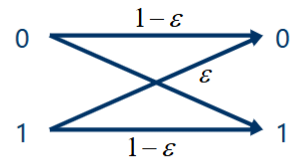

根据

$$
\begin{aligned}
I(X;Y)&=H(Y)-H(Y|X)\\
&=H(Y)-\sum_ip_i\left(-\sum_jp_{j|i}\log p_{j|i}\right)\\
&=H(Y)-\left(-\varepsilon\log\varepsilon-(1-\varepsilon)\log(1-\varepsilon)\right)
\end{aligned}
$$

注意到$\left(-\varepsilon\log\varepsilon-(1-\varepsilon)\log(1-\varepsilon)\right)$为常数，因此应当最大化$H(Y)$

$$
H(Y)\le 1\Leftrightarrow Y\sim\begin{pmatrix}
0 & 1\\
1/2 & 1/2
\end{pmatrix}\Leftrightarrow X\sim\begin{pmatrix}
0 & 1\\
1/2 & 1/2
\end{pmatrix}
$$

此时

$$
C=1+\varepsilon\log\varepsilon+(1-\varepsilon)\log(1-\varepsilon)
$$

#### 高斯信道

高斯信道为加性信道，认为观测到的结果为信源加上一个高斯噪声(由接收机热噪声引起)。

$$
Y=X+N,\quad f_N(n)=\frac{1}{\sqrt{2\pi\sigma^2}}\exp\left(-\frac{n^2}{2\sigma^2}\right)
$$

则信道的转移条件概率为

$$
f_{Y|X}(y|x)=\frac{1}{\sqrt{2\pi\sigma^2}}\exp\left(-\frac{(y-x)^2}{2\sigma^2}\right)
$$

互信息为

$$
\begin{aligned}
I(X;Y)&=h(Y)-h(Y|X)\\
&=h(Y)-h(X+N|X)\\
&=h(Y)-h(N)
\end{aligned}
$$

从而

$$
\begin{aligned}
C&=\max_{p(x)}I(X;Y)\\
&=\max_{p(x)}h(X+N)-h(N)\\
&=\max_{p(x)}h(X+N)-\frac{1}{2}\log 2\pi\mathrm e\sigma^2
\end{aligned}
$$

而

$$
\mathbb{E}(X+N)^2=\mathbb{E}X^2+\mathbb{E}N^2\le P+\sigma^2
$$

其中$P$为发射功率，认为与$X^2$的均值相关。所以

$$
\max_{p(x)}h(X+N)=\frac{1}{2}\log 2\pi\mathrm{e}(P+\sigma^2)
$$

因此高斯信道的信道容量为

$$
\begin{aligned}
C&=\max_{p(x)}h(X+N)-\frac{1}{2}\log 2\pi\mathrm e \sigma^2\\
&=\frac{1}{2}\log 2\pi\mathrm e (P+\sigma^2)-\frac{1}{2}\log 2\pi\mathrm e \sigma^2\\
&=\boxed{\frac{1}{2}\log\left(1+\frac{P}{\sigma^2}\right)}
\end{aligned}
$$

称为Shannon公式。
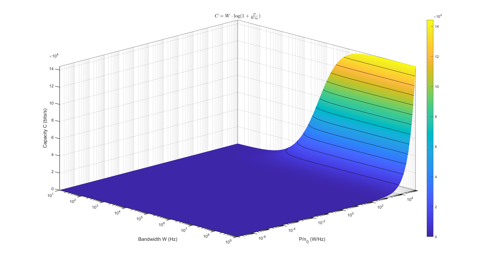
考虑带宽$W$, 加性白高斯噪声单边功率谱密度$n_0$。根据Nyquist采样定理单位时间内最多获得$2W$个独立采样。因此信道容量（单位时间最大互信息量）为

$$
\begin{aligned}
C&=\frac{1}{2}\log\left(1+\frac{P}{Wn_0}\right)\cdot2W\\
&=\boxed{W\log\left(1+\frac{P}{Wn_0}\right)}
\end{aligned}
$$

可见信道容量随着带宽$W$和信噪比$\frac{P}{n_0}$的增加而增加。在信噪比较低的情形下，根据Taylor展开

$$
\ln(1+x)=x+o(x)
$$

我们有近似

$$
C\dot=1.44\frac{P}{n_0}
$$

同样在高信噪比条件下

$$
C\dot=0.33W\mathrm{SNR}_\mathrm{dB}
$$

## 模拟信源的数字化

### 信源编码

信源编码的目的是将**时间连续、幅度连续**的**模拟信源**编码为比特串

$$
s(t)\mapsto 01\cdots 011
$$

其结构一般包括**抽样**、**量化**和**编码**三个步骤：

$$
s(t)-\boxed{\text{抽样}}\to x[k]=s(kT_s)-\boxed{\text{量化}}\to\hat x=Q(x)-\boxed{\text{编码}}\to 0\cdots10
$$

解码端则依次经过**译码**、**重建**和**内插**三个步骤，分别是**编码**、**量化**和**抽样**的逆过程。抽样和内插、编码和译码互为逆过程，具有无损性；但量化和重建是有损的。在一些实际系统（如语音的PCM（Pulse Coded Modulation））编码中，量化和编码同步完成。

$$
s(t)-\boxed{\text{抽样}}\to s(kT_s)-\boxed{\text{量化+编码}}\to 0\cdots10
$$

$$
\text{速率 }R=f_sb=\frac{1}{T_s}\,\text{Samples/s}\times b\,\text{bit/Sample}
$$

### 抽样定理

对于带限于$|f|\le W$的低通信号$s(t)$，当抽样频率$f_s\ge2W$时，可以由离散抽样无失真地恢复$s(t)$。

令$T_s=1/f_s$，理想抽样得到的冲激串为

$$
s_s(t)=s(t)\sum_{k=-\infty}^{\infty}\delta(t-kT_s)=\sum_{k=-\infty}^{\infty}s(kT_s)\delta(t-kT_s)
$$

频域上，原频谱以$f_s$为周期复制：

$$
S_s(f)=\frac{1}{T_s}\sum_{k=-\infty}^{\infty}S(f-kf_s)
$$

当$f_s\ge2W$时，相邻频谱副本不重叠，通过截止频率为$W$、通带增益为$T_s$的低通滤波器即可恢复原信号。

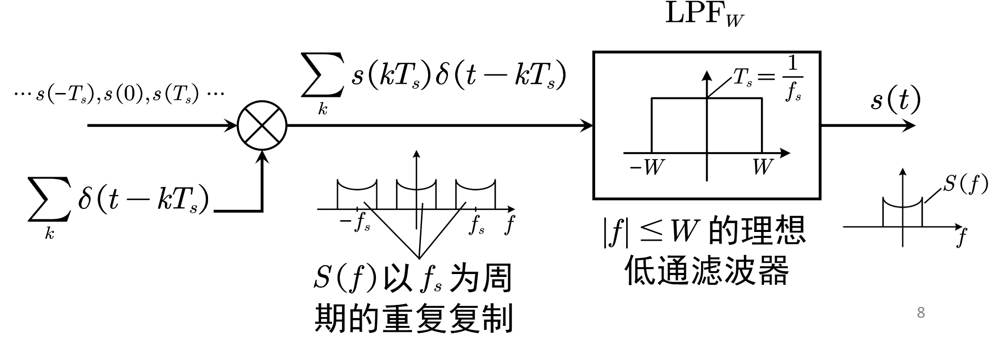

该恢复过程在时域上体现为sinc内插：

$$
s(t)=\sum_ks(kT_s)\frac{\sin 2\pi W(t-kT_s)}{\pi f_s(t-kT_s)}
$$

对于最小抽样频率$f_s^{\min}=2W$，代入内插公式得到

$$
s(t)=\sum_ks(\frac{k}{2W})\mathrm{sinc}(2Wt-k)
$$

实际采样前要先用低通滤波器限制带宽，保留信号的主要能量并防止混叠。电话语音主要位于$300\text{--}3400\,\mathrm{Hz}$，工程上以$f_s=8\,\mathrm{kHz}$采样，每个抽样量化为$8\,\mathrm{bit}$，PCM速率为$R=f_sb=64\,\mathrm{kbps}$。

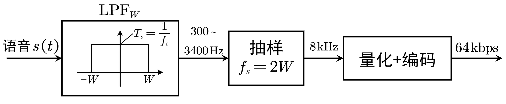

#### 带通抽样

若信号只占据$[f_L,f_H]$及其负频率镜像，直接按最高频率取$f_s\ge2f_H$会浪费样本。记带宽

$$
B=f_H-f_L
$$

抽样后要让正、负频谱的各个副本恰好错开。对某个整数$k\ge1$，无混叠条件可以写成

$$
\frac{2f_H}{k+1}\le f_s\le\frac{2f_L}{k}
$$

令

$$
N=\left\lfloor\frac{f_H}{B}\right\rfloor,qquad M=\left\{\frac{f_H}{B}\right\}
$$

其中$M$是$f_H/B$的小数部分。课件给出的最小带通抽样率为

$$
\boxed{f_s=2B\left(1+\frac{M}{N}\right)}
$$

当$f_H/B$为整数时$M=0$，最低抽样率就是$2B$；中心频率远高于带宽时，最低抽样率也接近$2B$。电话语音的$f_L=300\,\mathrm{Hz}$、$f_H=3400\,\mathrm{Hz}$，有$B=3100\,\mathrm{Hz}$、$N=1$、$M\approx0.0968$，因此带通抽样下界为$6800\,\mathrm{Hz}$。工程上仍常取$8\,\mathrm{kHz}$，便于留出滤波器过渡带。

课件还提到压缩感知：当信号在某个域内足够稀疏时，可以通过随机亚采样并结合稀疏恢复，以低于Nyquist速率的样本重建信号。它利用的是稀疏先验，不能把“低于Nyquist速率”理解成对任意带限信号都成立。

### 量化基础

量化是使用离散集合中的取值近似连续值$X$，同时确保近似误差尽可能小：

$$
Q(x)=y_i\,,\quad x_i<x\le x_{i+1}
$$

$I_i=(x_i,x_{i+1}]$表示第$i$个量化区间，$\Delta_i=x_{i+1}-x_i$为量化间隔，若$\Delta_i\equiv\Delta$则称为均匀量化，否则为非均匀量化。

量化是**多对一映射**，因而存在损失和误差。定义量化误差

$$
e(x)=x-Q(x)
$$

由于$x$是r.v., 因此$e(x)$为一个随机噪声，我们关注其统计特性。量化均方误差为（其实相当于噪声功率）

$$
\begin{aligned}
\sigma^2&=\int_{-\infty}^\infty [x-Q(x)]^2p(x)\mathrm{d}x\\
&=\sum_{i=1}^L\int_{x_i}^{x_{i+1}}(x-y_i)^2p(x)\mathrm{d}x
\end{aligned}
$$

定义量化信噪比为

$$
\mathrm{SNR}_q=\frac{\displaystyle\int_{-\infty}^\infty x^2p(x)\mathrm{d}x}{\displaystyle{\sum_{i=1}^L\int_{x_i}^{x_{i+1}}(x-y_i)^2p(x)\mathrm{d}x}}=\frac{\text{信号功率}}{\text{噪声功率}}
$$

若我们利用$Q(X)$精细设计编码器，则压缩后一个抽样的平均bit数最少为

$$
H(Q(X))=-\sum_{i=1}^{L}\int_{x_i}^{x_{i+1}}p(x)\mathrm{d}x\log\int_{x_i}^{x_{i+1}}p(x)\mathrm{d}x
$$

### 均匀量化

对于电平限制在$[x_{min}\,,x_{max}]$的抽样$x$， 使用$n$个bit进行均匀量化。则

$$
L=2^n,\qquad \Delta=\frac{x_{\max}-x_{\min}}{L}=\frac{x_{\max}-x_{\min}}{2^n}
$$

当量化间隔足够小时，可以认为每个量化区间内的概率密度近似为常数。记第$k$个区间的概率为$P_k$，并取区间中点作为重建电平，则

$$
\begin{aligned}
\sigma_q^2&=\sum_{k=1}^L\int_{x_k}^{x_{k+1}}(x-y_k)^2p_X(x)\mathrm{d}x\\
&\approx\sum_{k=1}^L\frac{P_k}{\Delta_k}\int_{x_k}^{x_{k+1}}(x-y_k)^2\mathrm{d}x\\
&=\frac{1}{12}\sum_{k=1}^LP_k\Delta_k^2
\end{aligned}
$$

均匀量化时$\Delta_k=\Delta$，又有$\sum_kP_k=1$，所以正常量化噪声为

$$
\sigma_q^2=\frac{\Delta^2}{12}=\frac{(x_{\max}-x_{\min})^2}{12\cdot2^{2n}}
$$

对于常用的对称量化范围$[-x_{\max},x_{\max}]$，上式化为

$$
\Delta=\frac{2x_{\max}}{2^n},\qquad \sigma_q^2=\frac{x_{\max}^2}{3\cdot2^{2n}}
$$

可见量化级数增加一倍，噪声方差约降为原来的四分之一。若量化后再做无损压缩，在高分辨率近似下有

$$
\begin{aligned}
H(Q(X))&\approx h(X)+\log_2\frac{1}{\Delta}\\
&=h(X)+\log_2\frac{1}{2\sqrt{3}\sigma_q}
\end{aligned}
$$

因此每个抽样的平均码长近似为

$$
\widetilde R\approx h(X)-\frac{1}{2}\log_2\sigma_q^2-1.8
$$

上面的计算只包含信号落在量化范围内时的正常量化噪声。信号超出$[-x_{\max},x_{\max}]$后，只能被判到最外侧的量化区间，由此产生过载噪声。对于对称分布，过载噪声为

$$
\begin{aligned}
\sigma_o^2={}&\int_{x_{\max}}^\infty(x-x_{\max})^2p_X(x)\mathrm{d}x+\int_{-\infty}^{-x_{\max}}(x+x_{\max})^2p_X(x)\mathrm{d}x\\
={}&2\int_{x_{\max}}^\infty(x-x_{\max})^2p_X(x)\mathrm{d}x
\end{aligned}
$$

总噪声是两者之和：

$$
\sigma^2=\sigma_q^2+\sigma_o^2
$$

若定义量化范围内的信号功率和信号的“饱满程度”为

$$
\sigma_s^2=\int_{-x_{\max}}^{x_{\max}}x^2p_X(x)\mathrm{d}x,\qquad \zeta=\frac{\sigma_s}{x_{\max}}
$$

并且$\int_{-x_{\max}}^{x_{\max}}p_X(x)\mathrm{d}x\approx1$，忽略过载噪声时

$$
\mathrm{SNR}_q\approx\frac{\sigma_s^2}{x_{\max}^2/(3\cdot2^{2n})}=3\cdot2^{2n}\zeta^2
$$

换成dB即

$$
\mathrm{SNR}_q(\mathrm{dB})=6.02n+20\log_{10}\zeta+4.77
$$

所以每增加一位量化码，量化信噪比提高约$6.02\mathrm{dB}$。不过$\zeta$不能一味增大：信号越接近量化边界，正常量化信噪比越高，但越容易出现过载。

### 最优量化

最优量化是在量化区间总数$L$给定时，同时选择分层电平$x_k$和重建电平$y_k$，使量化均方误差最小：

$$
\begin{aligned}
\min_{\{x_k,y_k\}}\quad&\sum_{k=1}^L\int_{x_k}^{x_{k+1}}(x-y_k)^2p_X(x)\mathrm{d}x\\
\text{s.t.}\quad&x_1\le y_1\le x_2\le y_2\le\cdots\le y_L\le x_{L+1}
\end{aligned}
$$

分别对分层电平和重建电平求偏导，可以得到两个必要条件：分层电平位于相邻重建电平的中点，重建电平位于所在量化区间的质心。

$$
\begin{aligned}
x_{k,\mathrm{opt}}&=\frac{y_{k-1,\mathrm{opt}}+y_{k,\mathrm{opt}}}{2},\qquad k=2,\ldots,L\\
y_{k,\mathrm{opt}}&=\frac{\displaystyle\int_{x_{k,\mathrm{opt}}}^{x_{k+1,\mathrm{opt}}}xp_X(x)\mathrm{d}x}{\displaystyle\int_{x_{k,\mathrm{opt}}}^{x_{k+1,\mathrm{opt}}}p_X(x)\mathrm{d}x}
\end{aligned}
$$

对于取值无界的随机变量，两端边界取$x_{1,\mathrm{opt}}=-\infty$和$x_{L+1,\mathrm{opt}}=+\infty$。实际计算时，可以在“由重建电平更新分层电平”和“由分层电平更新重建电平”之间反复迭代。均匀分布的质心恰好是区间中点，因此它的最优量化就是区间等分、中点重建；一般分布则没有这个性质。

最优量化得到离散随机变量$Y=Q(X)$，其中

$$
p_k=\Pr\{Y=y_k\}=\int_{x_k}^{x_{k+1}}p_X(x)\mathrm{d}x
$$

再进行无损压缩时，表示量化结果所需的最少平均比特数为

$$
H(Y)=-\sum_{k=1}^Lp_k\log_2p_k
$$

### 非均匀量化与压扩

语音幅度近似服从拉普拉斯分布，零点附近概率密度大，同时又有较长的拖尾。均匀量化若取较大的动态范围，量化间隔会变粗；若缩小动态范围，又会增加过载噪声。非均匀量化的做法是让常出现的小幅度信号使用更细的量化间隔，让不常出现的大幅度信号使用较粗的量化间隔。

压扩把非均匀量化拆成三个步骤：先用非线性函数$g(x)$压缩，在$g(x)$域内均匀量化，接收端再用$g^{-1}(x)$扩张。令$g(\pm x_{\max})=\pm x_{\max}$，压缩域的均匀量化间隔为$\Delta=2x_{\max}/L$。在第$i$个小区间内，

$$
g'(y_i)\approx\frac{g(x_{i+1})-g(x_i)}{x_{i+1}-x_i}=\frac{\Delta}{\Delta_i}
$$

所以原信号域内的量化间隔为

$$
\Delta_i=\frac{2x_{\max}}{Lg'(y_i)}
$$

代入密集分层时的噪声近似，得到

$$
\sigma_q^2\approx\frac{x_{\max}^2}{3L^2}\int_{-x_{\max}}^{x_{\max}}\frac{p_X(x)}{[g'(x)]^2}\mathrm{d}x
$$

定义量化点密度

$$
\lambda(x)=\frac{g'(x)}{2x_{\max}},\qquad \int_{-x_{\max}}^{x_{\max}}\lambda(x)\mathrm{d}x=1
$$

则

$$
\sigma_q^2=\frac{1}{12L^2}\int_{-x_{\max}}^{x_{\max}}\frac{p_X(x)}{\lambda^2(x)}\mathrm{d}x
$$

应用Hölder不等式可得

$$
\sigma_q^2\ge\frac{1}{12L^2}\left[\int_{-x_{\max}}^{x_{\max}}p_X^{1/3}(x)\mathrm{d}x\right]^3
$$

等号成立时，最优量化点密度和相应的压缩函数分别为

$$
\begin{aligned}
\lambda_{\mathrm{opt}}(x)&=\frac{p_X^{1/3}(x)}{\displaystyle\int_{-x_{\max}}^{x_{\max}}p_X^{1/3}(u)\mathrm{d}u}\\
g(x)&=2x_{\max}\int_{-x_{\max}}^x\lambda_{\mathrm{opt}}(u)\mathrm{d}u-x_{\max}
\end{aligned}
$$

这说明概率密度越大的地方，量化点应当越密。工程上还希望压扩规律对输入分布的变化不太敏感，因此课件引入近似对数压扩：

$$
g(x)=\operatorname{sgn}(x)\left[x_{\max}+\beta\ln\frac{|x|}{x_{\max}}\right],\qquad g'(x)=\frac{\beta}{|x|}
$$

忽略该近似在零点附近的不合理部分，有

$$
\sigma_q^2=\frac{x_{\max}^2}{3L^2\beta^2}\int_{-x_{\max}}^{x_{\max}}x^2p_X(x)\mathrm{d}x
$$

因此

$$
\mathrm{SNR}_q=\frac{3L^2\beta^2}{x_{\max}^2}
$$

这个结果与$p_X(x)$无关，体现了对数压扩对信号分布变化的鲁棒性。但理论对数函数在$x=0$处趋于负无穷，实际系统使用它的近似形式，即$A$律和$\mu$律。

#### $A$律与$\mu$律

$A$律由欧洲提出，我国也采用。其压缩函数为

$$
g(x)=\begin{cases}
\dfrac{A|x|}{1+\ln A}\operatorname{sgn}(x),&0\le\dfrac{|x|}{x_{\max}}<\dfrac{1}{A}\\
x_{\max}\dfrac{1+\ln\left(A|x|/x_{\max}\right)}{1+\ln A}\operatorname{sgn}(x),&\dfrac{1}{A}\le\dfrac{|x|}{x_{\max}}\le1
\end{cases}
$$

课件采用ITU G.712建议值$A=87.6$，小信号的信噪比可提高约$24\mathrm{dB}$。$\mu$律由美国提出，用一个平移后的对数函数实现：

$$
g(x)=x_{\max}\frac{\ln\left(1+\mu|x|/x_{\max}\right)}{\ln(1+\mu)}\operatorname{sgn}(x)
$$

课件采用$\mu=255$，小信号的信噪比可提高约$33.5\mathrm{dB}$。由$\mu$律求导，并仍采用密集量化近似，可得

$$
\begin{aligned}
g'(x)&=\frac{\mu}{\ln(1+\mu)\left(1+\mu|x|/x_{\max}\right)}\\
\sigma_q^2&=\frac{x_{\max}^2\ln^2(1+\mu)}{3L^2\mu^2}\int_{-x_{\max}}^{x_{\max}}\left(1+\frac{\mu|x|}{x_{\max}}\right)^2p_X(x)\mathrm{d}x
\end{aligned}
$$

在不发生过载、区间内概率近似为$1$时，积分项可以写成

$$
1+\frac{2\mu}{x_{\max}}\mathbb{E}|X|+\frac{\mu^2}{x_{\max}^2}\sigma_x^2
$$

于是

$$
\mathrm{SNR}_q=\frac{3L^2\mu^2}{\ln^2(1+\mu)}\frac{\sigma_x^2/x_{\max}^2}{1+2\mu\mathbb{E}|X|/x_{\max}+\mu^2\sigma_x^2/x_{\max}^2}
$$

当$\mu\gg1$时，分母中以$\mu^2$项为主，故

$$
\mathrm{SNR}_q\approx\frac{3L^2}{\ln^2(1+\mu)}
$$

此时量化信噪比近似与输入分布无关。

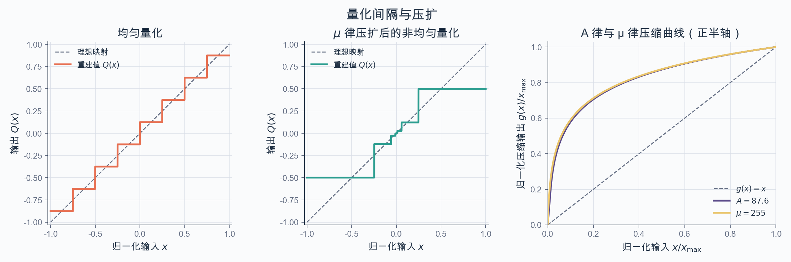

左图给出等间隔的均匀量化阶梯；中图在压缩域均匀量化后再扩张，零点附近的门限明显更密；右图则画出了课件采用的$A=87.6$与$\mu=255$压缩曲线。两条曲线在小信号区都比直线更陡，正是小幅度信号得到更细量化间隔的原因。

### 脉冲编码调制

脉冲编码调制（Pulse Code Modulation，PCM）是语音信号常用的数字化方式。电话语音先以$f_s=8000\mathrm{Hz}$抽样，再用近似对数压扩完成量化和编码，每个抽样用$8\mathrm{bit}$表示，因此输出码率为

$$
R_{\mathrm{PCM}}=f_s\times8=8000\times8=64\mathrm{kbps}
$$

工程上用$13$折线近似$A$律，用$15$折线近似$\mu$律。一个PCM码字分成三部分：$M_1$是极性码，$M_2M_3M_4$是段落码，$M_5M_6M_7M_8$是段内电平码。

对于$A$律PCM，各段的起始电平、段内权值和量化间隔如下。

| 段落号 | $M_2M_3M_4$ | 起始电平 | $M_5,M_6,M_7,M_8$的权值 | 量化间隔 |
| --- | --- | ---: | --- | ---: |
| 0 | 000 | 0 | 16，8，4，2 | 2 |
| 1 | 001 | 32 | 16，8，4，2 | 2 |
| 2 | 010 | 64 | 32，16，8，4 | 4 |
| 3 | 011 | 128 | 64，32，16，8 | 8 |
| 4 | 100 | 256 | 128，64，32，16 | 16 |
| 5 | 101 | 512 | 256，128，64，32 | 32 |
| 6 | 110 | 1024 | 512，256，128，64 | 64 |
| 7 | 111 | 2048 | 1024，512，256，128 | 128 |

例如对抽样值$1250$编码：它为正，故$M_1=1$；$1024<1250<2048$，段落码为$110$；在第6段内依次比较$512,256,128,64$四个权值，得到电平码$0011$。完整码字为$1\,110\,0011$，接收端按区间中点重建为$1024+128+64+32=1248$。

### 增量调制

PCM主要利用了抽样幅度的统计特性，而带限信号在时间上通常具有较强相关性，不会突然剧烈变化。增量调制（Delta Modulation，$\Delta M$）利用这一点，每个抽样只用$1\mathrm{bit}$表示信号相对本地重建值是增加还是减小。

编码器并不直接比较相邻两个原始抽样，而是在本地模拟接收端的译码过程。记输入抽样为$S(n)$，本地预测值为$S_l(n)=\hat S(n-1)$，则

$$
\begin{aligned}
e(n)&=S(n)-S_l(n)\\
C(n)&=\begin{cases}1,&e(n)\ge0\\0,&e(n)<0\end{cases}\\
d(n)&=\begin{cases}+\Delta,&C(n)=1\\-\Delta,&C(n)=0\end{cases}\\
\hat S(n)&=\hat S(n-1)+d(n)
\end{aligned}
$$

接收端使用同样的累加关系，重建信号便会跟踪输入信号。每个码元只表示一次增减，课件据此指出增量调制抗信道误码能力强，适合战场通信。

增量可以不断累加，因此增量调制不会因信号幅度本身很大而过载；真正的问题是信号变化过快，而每个抽样周期最多只能改变$\Delta$。发生斜率过载的条件为

$$
\max_t\left|\frac{\mathrm{d}f(t)}{\mathrm{d}t}\right|>\frac{\Delta}{T_s}
$$

对于$f(t)=A\sin\omega t$，临界条件为

$$
A\omega=\frac{\Delta}{T_s},\qquad \omega_c=\frac{\Delta}{AT_s}
$$

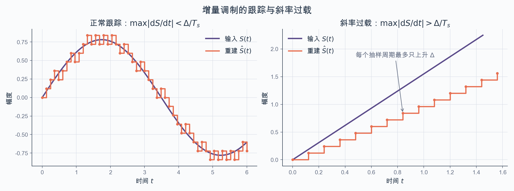

输入变化较慢时，重建阶梯会在原信号两侧来回跟踪；输入斜率超过$\Delta/T_s$后，阶梯每个抽样周期只能上升一次，误差便会持续积累。这里是否过载取决于斜率，而不是信号本身的幅度。

提高抽样率可以减小斜率过载，但会提高编码速率；增大步长$\Delta$也能减小斜率过载，却会增加量化噪声。自适应增量调制在信号变化缓慢时采用较小步长，变化剧烈时采用较大步长，不过收发两端必须同步调整步长，系统同步设计更困难。

### 差分脉冲编码调制

差分脉冲编码调制（Differential Pulse Code Modulation，DPCM）同样通过刻画信号变化来压缩。它与增量调制的主要区别是：反馈预测器可以采用一般滤波器，预测误差也不再只用$1\mathrm{bit}$，而是用多比特量化。用一般的线性预测器表示，其基本关系为

$$
\begin{aligned}
S_p(n)&=\sum_{k=1}^Pa_k\hat S(n-k)\\
e(n)&=S(n)-S_p(n)\\
\hat e(n)&=Q(e(n))\\
\hat S(n)&=S_p(n)+\hat e(n)
\end{aligned}
$$

编码端和解码端都由过去的重建样本形成同一个预测值，因此只需传输量化后的预测误差。信号相邻抽样越相关，预测误差通常越小，在相同量化精度下所需的动态范围和比特数也越少。

## 数字基带传输

数字通信系统最终要传送的是 bit，但实际信道只能接受连续时间波形。数字基带传输要完成两次转换：发送端把 bit 映射成符号，再把离散符号加载到连续波形上；接收端从带噪波形中提取抽样值，判决出符号，最后再解映射成 bit。

### 从 bit 到符号

设可用符号构成集合

$$
\mathcal A=\{a_1,a_2,\ldots,a_M\},\qquad M=|\mathcal A|
$$

若符号数是 2 的整数次幂，一个符号最多承载

$$
r=\log_2|\mathcal A|=\log_2M
$$

个 bit。这里的“符号”是 bit 串的物理承载，可以表现为不同幅度、相位或二维坐标，因此常见符号集合包括 ASK、PAM、PSK 和 QAM。

从 bit 串到符号集合的一一映射通常采用 Gray 码。Gray 映射使相邻符号所对应的 bit 串只相差一位。这样，即使噪声把一个符号推到最近的相邻符号，一次符号错误通常也只造成一位 bit 错误。

传送一个符号所需的平均时间称为符号周期，记作 $T_s$。符号速率与 bit 速率分别为

$$
R_s=\frac{1}{T_s},\qquad R_b=R_s\log_2M=\frac{\log_2M}{T_s}
$$

若系统没有引入冗余编码，每符号能量 $E_s$、每 bit 能量 $E_b$ 和平均信号功率 $P$ 满足

$$
P=\frac{E_s}{T_s}=E_sR_s=E_bR_b,\qquad E_s=E_b\log_2M
$$

### 从离散符号到连续波形

连续时间基带波形可以写成一组平移脉冲的线性组合：

$$
s(t)=\sum_{k=-\infty}^{\infty}a_kh(t-kT_s)
$$

其中 $a_k$ 是第 $k$ 个符号，$h(t)$ 是脉冲成形滤波器的冲激响应。工程上先形成加权冲激串

$$
s_\delta(t)=\sum_{k=-\infty}^{\infty}a_k\delta(t-kT_s)
$$

再令它通过传递函数为 $H(f)$ 的低通滤波器，便可实时产生 $s(t)$：

$$
s(t)=s_\delta(t)*h(t)
$$

时间平移不会改变信号带宽，带限信号的线性组合仍然带限，所以只要 $h(t)$ 带限，整个基带波形也带限。理想低通脉冲的典型形状是

$$
h(t)=\frac{\sin 2\pi Wt}{2\pi Wt}
$$

它的频谱是支撑在 $[-W,W]$ 内的矩形。比例常数可以随归一化方式调整，接下来通常令抽样主值为 1。

### 符号间串扰与眼图

先把发送、信道和接收滤波的总作用记为等效脉冲 $g(t)$。在 $t=nT_s$ 处抽样，有

$$
s(nT_s)=a_ng(0)+\sum_{\substack{k=-\infty\\k\ne n}}^{\infty}a_kg\bigl((n-k)T_s\bigr)
$$

第一项是当前符号的贡献，后面的求和是其他符号在当前抽样时刻留下的符号间串扰，即 ISI。归一化为 $g(0)=1$ 后，对任意符号序列都无 ISI 的充要条件是

$$
g(kT_s)=\begin{cases}1,&k=0,\\0,&k\ne0.\end{cases}
$$

这项条件只要求脉冲在整数倍符号周期处过零，并不要求各个脉冲在其余时刻互不重叠。

眼图把许多段接收波形按符号周期对齐并叠加，可以直观看出 ISI。眼睛张得越开，最佳抽样时刻的噪声容限越大；最佳抽样点处的斜率反映系统对定时误差的敏感程度；交叉点的模糊则反映过零抖动和定时抖动。ISI 增大时，眼睛逐渐闭合，严重时不同电平在抽样点已经无法区分。

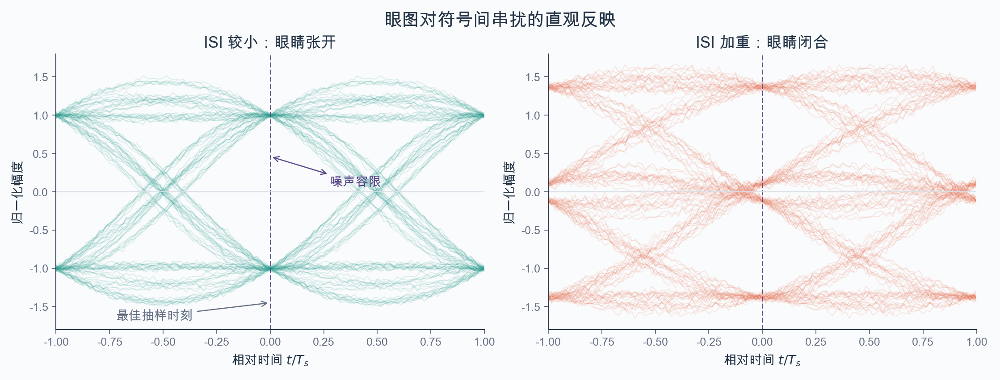

纵向虚线是最佳抽样时刻。左图在该处仍能清楚分开正、负电平；右图中前后符号的影响被带到同一抽样时刻，出现靠近判决门限的多组电平，眼睛随之闭合。

### Nyquist 无 ISI 准则

时域无 ISI 条件也可以写成

$$
g(t)\sum_{n=-\infty}^{\infty}\delta(t+nT_s)=\delta(t)
$$

对上式作傅里叶变换，利用时域相乘对应频域卷积，得到

$$
G(f)*\frac{1}{T_s}\sum_{n=-\infty}^{\infty}\delta\left(f+\frac{n}{T_s}\right)=1
$$

也就是 Nyquist 第一准则：

$$
\sum_{n=-\infty}^{\infty}G\left(f+\frac{n}{T_s}\right)=T_s
$$

它的直观含义是，把等效脉冲频谱按 $1/T_s$ 的间隔反复平移，所有频谱副本叠加后必须在任意频率处都等于同一个常数。

若低通脉冲的单边带宽为 $W$，当 $T_s<1/(2W)$ 时，相邻频谱副本之间会留下无法填平的空隙，因此不可能满足 Nyquist 准则。临界情况是

$$
T_s=\frac{1}{2W},\qquad R_s=2W
$$

此时只有理想矩形低通频谱可以达到最大符号速率。若 $T_s>1/(2W)$，相邻频谱会在过渡带重叠，只要重叠部分满足残留对称条件，叠加结果仍可保持为常数。因此

$$
R_s\le 2W
$$

结合 $R_b=R_s\log_2M$，可得

$$
R_b\le2W\log_2M
$$

带宽效率定义为单位带宽所承载的 bit 速率：

$$
\eta_b=\frac{R_b}{W}\le2\log_2M\quad\text{bit/(s·Hz)}
$$

增大符号集合可以提高带宽效率，但每个符号所包含的 bit 越多，接收端区分不同符号通常也越困难。

### 升余弦脉冲

理想矩形低通难以实现，工程上常用满足残留对称条件的升余弦滤波器。设滚降系数为 $\alpha$，其频率响应为

$$
H_{\mathrm{RC}}(f)=\begin{cases}T_s,&0\le|f|<\dfrac{1-\alpha}{2T_s},\\\dfrac{T_s}{2}\left\{1+\cos\left[\dfrac{\pi T_s}{\alpha}\left(|f|-\dfrac{1-\alpha}{2T_s}\right)\right]\right\},&\dfrac{1-\alpha}{2T_s}\le|f|\le\dfrac{1+\alpha}{2T_s},\\0,&|f|>\dfrac{1+\alpha}{2T_s}.\end{cases}
$$

对应的时域冲激响应为

$$
h_{\mathrm{RC}}(t)=\operatorname{Sa}\left(\frac{\pi t}{T_s}\right)\frac{\cos(\alpha\pi t/T_s)}{1-4(\alpha t/T_s)^2},\qquad \operatorname{Sa}(x)=\frac{\sin x}{x}
$$

滚降系数也可以从带宽关系直接读出：

$$
\alpha=2WT_s-1,\qquad 0\le\alpha\le1
$$

$\alpha=0$ 对应理想矩形低通，频谱最紧凑但实现困难；$\alpha=1$ 时没有平坦通带，过渡最平缓。课件给出的常用工程范围为 $0.3$ 到 $0.7$。升余弦滤波器的带宽与符号速率满足

$$
W=\frac{1+\alpha}{2T_s}=\frac{1+\alpha}{2}R_s,\qquad R_s=\frac{2W}{1+\alpha}
$$

所以

$$
\frac{R_s}{2}\le W\le R_s,\qquad W\le R_s\le2W
$$

其带宽效率为

$$
\eta_b=\frac{R_s\log_2M}{W}=\frac{2\log_2M}{1+\alpha}
$$

较大的 $\alpha$ 让过渡带更宽、滤波器更容易实现，代价是带宽效率下降。

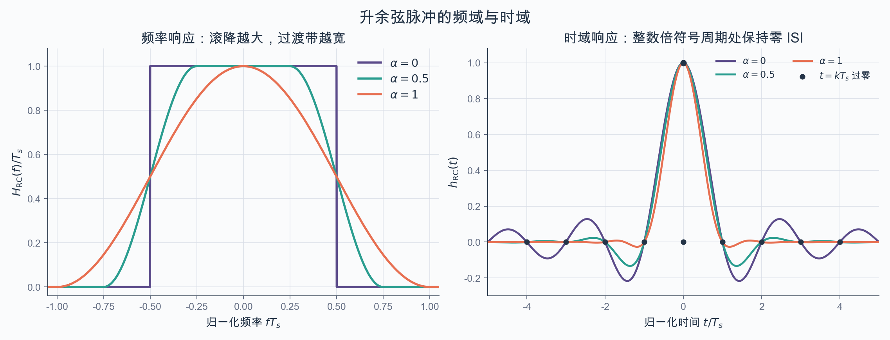

频域图把滚降系数的代价画得很直观：$\alpha$越大，占用带宽越宽，过渡却越平缓。时域波形虽然不同，但都在非零整数倍$T_s$处过零，因此抽样点仍满足无ISI条件。

### 基带波形的功率谱

通信波形

$$
s(t)=\sum_{k=-\infty}^{\infty}a_kh(t-kT_s)
$$

通常不是宽平稳过程，而是满足

$$
R_s(t_1,t_2)=R_s(t_1+kT_s,t_2+kT_s)
$$

的周期平稳过程。先对自相关函数在一个符号周期内作时间平均：

$$
\overline R_s(\tau)=\frac{1}{T_s}\int_0^{T_s}R_s(t+\tau,t)\,\mathrm dt
$$

功率谱定义为

$$
S_s(f)=\mathcal F\{\overline R_s(\tau)\}
$$

为了从符号统计量出发计算功率谱，定义离散符号序列的自相关函数

$$
R_a[n]=\mathbb E[a_i a_{i+n}]
$$

把有限长符号串截断后按功率谱定义取极限，可以得到冲激串输入的功率谱以及成形滤波后的功率谱：

$$
S_{s_\delta}(f)=\frac{1}{T_s}\sum_{n=-\infty}^{\infty}R_a[n]e^{-j2\pi fnT_s},\qquad S_s(f)=\frac{|H(f)|^2}{T_s}\sum_{n=-\infty}^{\infty}R_a[n]e^{-j2\pi fnT_s}
$$

若调制无记忆、各符号相互独立，记

$$
m_a=\mathbb E[a_i],\qquad \sigma_a^2=\mathbb E[a_i^2]-m_a^2
$$

则

$$
R_a[n]=\begin{cases}\sigma_a^2+m_a^2,&n=0,\\m_a^2,&n\ne0.\end{cases}
$$

再利用冲激串的傅里叶级数关系

$$
\sum_{n=-\infty}^{\infty}e^{-jn(2\pi T_s)f}=\frac{1}{T_s}\sum_{n=-\infty}^{\infty}\delta\left(f-\frac{n}{T_s}\right)
$$

得到

$$
\begin{aligned}S_s(f)&=\frac{|H(f)|^2}{T_s}\left\{\sigma_a^2+\frac{m_a^2}{T_s}\sum_{n=-\infty}^{\infty}\delta\left(f-\frac{n}{T_s}\right)\right\}\\&=\frac{\sigma_a^2}{T_s}|H(f)|^2+\frac{m_a^2}{T_s^2}\sum_{n=-\infty}^{\infty}\left|H\left(\frac{n}{T_s}\right)\right|^2\delta\left(f-\frac{n}{T_s}\right).\end{aligned}
$$

第一项是连续谱，第二项是在 $n/T_s$ 处出现的线谱。这一结果有两个前提：符号之间无记忆，而且不同符号都作为系数加载到同一个脉冲 $h(t)$ 上。若符号均值为零，线谱消失；非零均值则可能留下符号时钟的谐波，便于接收端恢复时钟。

例如，若 bit 1 以概率 $3/4$ 映射为 $A$，bit 0 以概率 $1/4$ 映射为 $-A$，则

$$
m_a=\frac{A}{2},\qquad \sigma_a^2=\frac{3A^2}{4}
$$

功率谱为

$$
S_s(f)=\frac{3A^2}{4T_s}|H(f)|^2+\frac{A^2}{4T_s^2}\sum_{n=-\infty}^{\infty}\left|H\left(\frac{n}{T_s}\right)\right|^2\delta\left(f-\frac{n}{T_s}\right)
$$

#### 任意波形二元调制

更一般地，两个符号可以分别映射为两个不同形状的波形。设

$$
s(t)=\sum_{k=-\infty}^{\infty}g_k(t),\qquad g_k(t)=\begin{cases}s_1(t-kT_s),&\text{概率 }p,\\s_2(t-kT_s),&\text{概率 }\overline p=1-p.\end{cases}
$$

把 $s(t)$ 分成均值分量 $v(t)=\mathbb E[s(t)]$ 和零均值随机分量 $q(t)=s(t)-v(t)$，有

$$
v(t)=\sum_{k=-\infty}^{\infty}\left[ps_1(t-kT_s)+\overline p\,s_2(t-kT_s)\right]
$$

$v(t)$ 是周期为 $T_s$ 的确定性周期信号。若 $\widehat s_1(f)$、$\widehat s_2(f)$ 分别表示 $s_1(t)$、$s_2(t)$ 的傅里叶变换，其傅里叶级数系数为

$$
D_n=\frac{1}{T_s}\left[p\widehat s_1\left(\frac{n}{T_s}\right)+\overline p\,\widehat s_2\left(\frac{n}{T_s}\right)\right]
$$

随机分量则可以写成同一差波形的线性调制：

$$
q(t)=\sum_{k=-\infty}^{\infty}a_k\left[s_1(t-kT_s)-s_2(t-kT_s)\right],\qquad a_k=\begin{cases}\overline p,&\text{概率 }p,\\-p,&\text{概率 }\overline p.\end{cases}
$$

此时 $\mathbb E[a_k^2]=p\overline p$，不同 $a_k$ 之间不相关，因此连续谱为

$$
S_q(f)=\frac{p\overline p}{T_s}\left|\widehat s_1(f)-\widehat s_2(f)\right|^2
$$

合并均值分量的线谱后，得到

$$
S_s(f)=\frac{p\overline p}{T_s}\left|\widehat s_1(f)-\widehat s_2(f)\right|^2+\frac{1}{T_s^2}\sum_{n=-\infty}^{\infty}\left|p\widehat s_1\left(\frac{n}{T_s}\right)+\overline p\,\widehat s_2\left(\frac{n}{T_s}\right)\right|^2\delta\left(f-\frac{n}{T_s}\right)
$$

前一项来自两个波形之差，后一项来自两种波形的概率加权平均。

### AWGN 波形信道

基带传输的接收波形写成

$$
y(t)=s(t)+n(t)
$$

课件假设 $n(t)$ 是零均值加性白高斯噪声。它是宽平稳随机过程，自相关函数与双边功率谱密度分别为

$$
R_n(\tau)=\mathbb E[n(t)n(t+\tau)]=\frac{n_0}{2}\delta(\tau),\qquad S_n(f)=\frac{n_0}{2}
$$

其中 $n_0$ 是单边噪声功率谱密度。若接收机只保留 $|f|\le W$ 的频率，噪声功率为

$$
N=\int_{-W}^{W}\frac{n_0}{2}\,\mathrm df=n_0W
$$

白噪声的瞬时值并不适合直接抽样，因为理想模型下

$$
\operatorname{Var}[n(t_1)]=R_n(0)=\frac{n_0}{2}\delta(0)\to\infty
$$

实际系统总会带限，所以方差不会真的无穷大，但只利用某一瞬间的脉冲峰值，抗噪性能仍然很差。

对矩形脉冲，可以先在一个符号周期内积分，再作抽样。积分后的噪声仍是高斯随机变量：

$$
n_I=\int_0^{T_s}n(t)\,\mathrm dt
$$

其方差为

$$
\begin{aligned}\sigma_I^2&=\mathbb E\left[\left|\int_0^{T_s}n(t)\,\mathrm dt\right|^2\right]\\&=\int_0^{T_s}\int_0^{T_s}\frac{n_0}{2}\delta(t_1-t_2)\,\mathrm dt_1\mathrm dt_2\\&=\frac{n_0T_s}{2}.\end{aligned}
$$

积分会使噪声中的正负起伏部分抵消，而矩形信号始终同号累积，因此明显优于直接抽样。不过，对一般形状的 $h(t)$ 平权积分未必最优，需要按脉冲形状加权。

### 相关接收与信号空间

先只考虑传送一个符号，接收波形为

$$
y(t)=a_ih(t)+n(t),\qquad 0\le t\le T_s
$$

令接收机用 $g(t)$ 作相关加权，抽样统计量为

$$
z_g=\int_0^{T_s}y(t)g^*(t)\,\mathrm dt
$$

抽样时刻的信号功率和噪声功率分别为

$$
P_S=\left|\int_0^{T_s}a_ih(t)g^*(t)\,\mathrm dt\right|^2,\qquad P_N=\frac{n_0}{2}\int_0^{T_s}|g(t)|^2\,\mathrm dt
$$

因此要解的优化问题是

$$
\max_g\frac{\left|\int_0^{T_s}a_ih(t)g^*(t)\,\mathrm dt\right|^2}{\dfrac{n_0}{2}\int_0^{T_s}|g(t)|^2\,\mathrm dt}
$$

Cauchy-Schwarz 不等式给出

$$
\left|\int_0^{T_s}h(t)g^*(t)\,\mathrm dt\right|^2\le\int_0^{T_s}|h(t)|^2\,\mathrm dt\int_0^{T_s}|g(t)|^2\,\mathrm dt
$$

等号在 $g(t)$ 与 $h(t)$ 线性相关时成立。接收机的整体比例不影响信噪比，故可以直接取 $g(t)=h(t)$。发送 $a_i$ 时，最大输出信噪比为

$$
\left(\frac{S}{N}\right)_{\max}=\frac{2|a_i|^2}{n_0}\int_0^{T_s}|h(t)|^2\,\mathrm dt
$$

这个结论也可以从信号空间理解。定义脉冲能量和单位能量基函数

$$
E_h=\int_0^{T_s}|h(t)|^2\,\mathrm dt,\qquad \phi(t)=\frac{h(t)}{\sqrt{E_h}}
$$

期望信号 $a_ih(t)$ 完全位于一维子空间 $\operatorname{span}\{\phi(t)\}$ 中。把接收波形投影到 $\phi(t)$ 上，得到

$$
z=\langle y,\phi\rangle=a_i\sqrt{E_h}+n_\phi,qquad n_\phi\sim\mathcal N\left(0,\frac{n_0}{2}\right)
$$

白噪声向任意单位能量方向投影，方差都为 $n_0/2$；而只有沿 $h(t)$ 的方向投影，才能完整保留信号分量。与该方向正交的分量只含噪声，丢弃它们不会损失判决所需的信息。因此相关器的输出就是一符号检测的充分统计量。

### 匹配滤波器

相关器也可以改写成滤波器。设接收滤波器的冲激响应为 $h_m(t)$，其输出为

$$
y_m(t)=\int_{-\infty}^{\infty}[a_ih(\tau)+n(\tau)]h_m(t-\tau)\,\mathrm d\tau
$$

要求在 $t=T_s$ 处的滤波器输出与相关器相同，可取

$$
h_m(t)=h^*(T_s-t)
$$

也就是说，匹配滤波器的冲激响应是已知信号的共轭、时间反转和延迟。实信号时共轭可以省略。

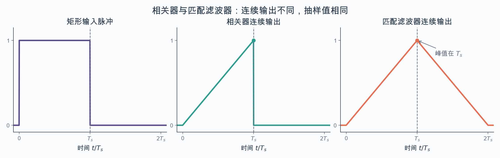

以矩形脉冲为例，相关器输出在积分区间内单调上升，匹配滤波器输出则是三角形。两条连续时间波形并不相同，但在$t=T_s$处都取得同一个判决统计量；匹配滤波器的峰值也正好落在这一抽样时刻。

其频域形式为

$$
H_m(f)=H^*(f)e^{-j2\pi fT_s}
$$

匹配滤波器的传递函数与信号频谱的复共轭成正比，线性相位项只负责把峰值移到预定抽样时刻。频域推导同样由 Cauchy-Schwarz 不等式得到：

$$
\frac{\left|\int_{-\infty}^{\infty}H(f)H_m(f)e^{j2\pi fT_s}\,\mathrm df\right|^2}{\dfrac{n_0}{2}\int_{-\infty}^{\infty}|H_m(f)|^2\,\mathrm df}\le\frac{2}{n_0}\int_{-\infty}^{\infty}|H(f)|^2\,\mathrm df
$$

匹配滤波的增益来自两点：已知脉冲在整个符号周期内相干累加，而白噪声在累加过程中部分抵消。对矩形脉冲，平权积分本来就与脉冲形状匹配；对一般脉冲，匹配滤波相对于平权积分的信噪比增益为

$$
G_{\mathrm{match}}=\frac{T_s\int_0^{T_s}|h(t)|^2\,\mathrm dt}{\left|\int_0^{T_s}h(t)\,\mathrm dt\right|^2}\ge1
$$

模拟相干解调也利用了相干性，但它通过载波相乘把一部分噪声搬到高频，再由低通滤波器去除。基带匹配滤波没有 I、Q 分解，其增益来自时间方向上的信号相干叠加和噪声自我抵消。

对整个符号集合取平均，定义

$$
E_s=\mathbb E[|a_i|^2]\int_0^{T_s}|h(t)|^2\,\mathrm dt
$$

则匹配滤波后的抽样信噪比为

$$
\left(\frac{S}{N}\right)_o=\frac{E_s}{n_0/2}=\frac{2E_s}{n_0}
$$

这一结果使用的是等效基带模型，直接体现了整个符号周期内的能量。若从实际带限波形的平均功率出发，则

$$
S=E_sR_s,\qquad N=n_0W,\qquad \frac{S}{N}=\frac{E_s}{n_0}\frac{R_s}{W}
$$

由 $R_s/W\le2$ 可知，仅作理想带限时的信噪比上限也是 $2E_s/n_0$。对滚降系数为 $\alpha$ 的升余弦系统，带限后的信噪比为

$$
\left(\frac{S}{N}\right)_i=\frac{E_s}{n_0/2}\frac{1}{1+\alpha}
$$

匹配滤波后则恢复到 $E_s/(n_0/2)$，所以剔除低通带限本身的降噪作用，纯粹由匹配带来的增益是

$$
\frac{(S/N)_o}{(S/N)_i}=1+\alpha=2WT_s
$$

带宽越宽，前级会引入更多噪声，但频域匹配的增益也相应增大，两者恰好抵消，因此最佳抽样信噪比最终只由 $E_s/n_0$ 决定。再利用 $E_s=E_b\log_2M$，有

$$
\left(\frac{S}{N}\right)_o=2\log_2M\frac{E_b}{n_0}
$$

### 符号串接收与根 Nyquist 滤波

单符号匹配只解决了噪声下如何得到最高抽样信噪比。传送一串符号时，还必须同时保证抽样点没有 ISI。设发送脉冲为 $h_T(t)$，接收端采用匹配滤波器

$$
h_R(t)=h_T^*(T_s-t)
$$

去掉噪声后，收发两端的等效脉冲为

$$
g(t)=h_T(t)*h_R(t)
$$

其频率响应为

$$
G(f)=H_T(f)H_R(f)=|H_T(f)|^2e^{-j2\pi fT_s}
$$

固定时延不影响 ISI 判断，因此要求 $|H_T(f)|^2$ 本身是一个满足 Nyquist 第一准则的频率响应 $H_{\mathrm{N-I}}(f)$。这就是根 Nyquist 条件：

$$
|H_T(f)|^2e^{-j2\pi fT_s}=H_{\mathrm{N-I}}(f)e^{-j2\pi fT_s}
$$

可以把满足 Nyquist 准则的滤波器平方根平均分给发送端和接收端：

$$
H_T(f)=\sqrt{H_{\mathrm{N-I}}(f)}e^{-j\pi fT_s},\qquad H_R(f)=\sqrt{H_{\mathrm{N-I}}^*(f)}e^{-j\pi fT_s}
$$

若 $H_{\mathrm{N-I}}(f)$ 取升余弦响应，发送端与接收端采用的就是根升余弦滤波器，二者级联后得到完整的升余弦响应。记 $h_{\sqrt{N}}(t)$ 为 $\sqrt{H_{\mathrm{N-I}}(f)}$ 的傅里叶反变换，则课件采用的时移写法为

$$
h_T(t)=h_{\sqrt{N}}\left(t-\frac{T_s}{2}\right),\qquad h_R(t)=h_{\sqrt{N}}\left(\frac{T_s}{2}-t\right)=h_T(T_s-t)
$$

经过匹配滤波并吸收固定时延后，第 $i$ 个抽样可以写成

$$
y_i=\sum_{k=-\infty}^{\infty}a_kg\bigl((i-k)T_s\bigr)+n_i
$$

根 Nyquist 条件使 $g((i-k)T_s)=0$ 对所有 $k\ne i$ 成立，因而其他符号的贡献全部消失。把匹配滤波器作单位噪声方差归一化，令

$$
\overline h=\sqrt{\int_0^{T_s}|h_T(t)|^2\,\mathrm dt}
$$

则接收符号模型可以写成

$$
y_i=\overline h\,a_i+n_i,qquad n_i\sim\mathcal N\left(0,\frac{n_0}{2}\right)
$$

再除以 $\overline h$，不会改变信噪比：

$$
y_i'=a_i+n_i',\qquad n_i'\sim\mathcal N\left(0,\frac{n_0}{2\int_0^{T_s}|h_T(t)|^2\,\mathrm dt}\right)
$$

这样，连续时间的带噪波形信道最终化成了离散的加性高斯电平信道。匹配滤波负责让抽样点信噪比最大，根 Nyquist 条件负责消除抽样点 ISI；判决器再把 $y_i'$ 归到合法符号集合 $\mathcal A$ 中。等概、等代价的实数电平在 AWGN 下采用最近邻判决，相邻电平的判决边界位于两者中点。

### 符号的最佳判决

匹配滤波器把连续波形的接收问题化成了电平信道

$$
y=a+n
$$

其中发送符号$a$取自符号集合$U$，$n\sim\mathcal N(0,\sigma^2)$。接收机观察到$y$后，需要从$U$中选出最可能的发送符号。最大后验概率（Maximum A Posteriori, MAP）判决为

$$
\hat a_{\mathrm{MAP}}=\argmax_{a\in U}p(a|y)=\argmax_{a\in U}p(y|a)p(a)
$$

这个准则直接最大化正确判决概率。通信系统通常让各符号等概出现，此时$p(a)=1/M$，MAP判决退化成最大似然（Maximum Likelihood, ML）判决：

$$
\hat a_{\mathrm{ML}}=\argmax_{a\in U}p(y|a)
$$

在加性高斯噪声下

$$
p(y|a)=\frac{1}{\sqrt{2\pi\sigma^2}}\exp\left[-\frac{(y-a)^2}{2\sigma^2}\right]
$$

指数函数随$|y-a|$增大而减小，所以ML判决又等价于最小距离判决：

$$
\boxed{\hat a=\argmin_{a\in U}|y-a|}
$$

因此，相邻两个许用电平的中点就是判决门限。以双极性二元集合$U=\{-A,A\}$为例，门限为零，$y>0$时判为$A$，$y<0$时判为$-A$。

若符号并非等概出现，先验概率会移动判决门限。对于$U=\{a_0,a_1\}$，MAP判决的门限可由

$$
p(y|a_1)p(a_1)\mathop{\gtrless}_{a_0}^{a_1}p(y|a_0)p(a_0)
$$

求出，此时不能直接套用几何中点。

### 误符号率与误比特率

高斯噪声的尾概率写成$Q$函数：

$$
Q(x)=\frac{1}{\sqrt{2\pi}}\int_x^\infty\exp\left(-\frac{t^2}{2}\right)\mathrm dt
$$

若符号到某一侧判决门限的距离为$A$，越过该门限的条件差错概率就是

$$
Q\left(\frac{A}{\sigma}\right)
$$

对于等概双极性二元符号$U=\{-A,A\}$，两个符号的差错概率相同，因此

$$
P_s=Q\left(\frac{A}{\sigma}\right)
$$

定义平均信号功率和噪声功率

$$
S=\frac{1}{M}\sum_{i=1}^M|a_i|^2,\qquad N=\sigma^2
$$

二元双极性码有$S=A^2$，于是

$$
P_s=Q\left(\sqrt{\frac{S}{N}}\right)
$$

单极性二元集合$U=\{0,2A\}$的符号间距仍为$2A$，但平均功率为$S=2A^2$，所以

$$
P_s=Q\left(\sqrt{\frac{S}{2N}}\right)
$$

相同误符号率下，单极性码需要双极性码两倍的信号功率，即损失$3\,\mathrm{dB}$。这部分功率用在了不承载信息的直流分量上。

#### $M$进制PAM

对双极性$M$进制PAM，相邻符号间距为$2A$。无论$M$为奇数还是偶数，最外侧两个符号只有一个差错方向，中间$M-2$个符号有两个差错方向，因此

$$
P_s=\frac{2(M-1)}{M}Q\left(\frac{A}{\sigma}\right)
$$

其平均功率为

$$
S=\frac{M^2-1}{3}A^2
$$

从而

$$
\boxed{P_s=\frac{2(M-1)}{M}Q\left(\sqrt{\frac{3}{M^2-1}\frac{S}{N}}\right)}
$$

对于单极性集合$U=\{0,2A,\ldots,2(M-1)A\}$，平均功率为

$$
S=\frac{2(M-1)(2M-1)}{3}A^2
$$

故误符号率为

$$
P_s=\frac{2(M-1)}{M}Q\left(\sqrt{\frac{3}{2(M-1)(2M-1)}\frac{S}{N}}\right)
$$

误比特率（Bit Error Rate, BER）统计错误比特数占总传输比特数的比例。采用Gray映射且信噪比较高时，符号通常只会错到最近邻，一个符号错误近似只造成一个比特错误，于是

$$
P_b\approx\frac{P_s}{\log_2M}
$$

这个近似对二元码严格成立；对高阶调制，若映射不是Gray码或信噪比较低，就不能直接使用。

课件采用的匹配滤波输出记号满足

$$
\frac{S}{N}=2\log_2M\frac{E_b}{n_0}
$$

例如双极性二元码有

$$
P_b=Q\left(\sqrt{\frac{2E_b}{n_0}}\right)
$$

#### MPSK

复电平信道写成

$$
y=a+n,\qquad a=a_I+\mathrm ja_Q,\qquad n=n_I+\mathrm jn_Q
$$

其中$n_I,n_Q$相互独立且均服从$\mathcal N(0,\sigma_n^2)$。$M$PSK的星座点位于半径为$A$的圆周上：

$$
a_m=A\exp(\mathrm j\phi_m),\qquad \phi_m=\frac{2\pi m}{M},\quad m=0,1,\ldots,M-1
$$

最小距离判决把复平面划成$M$个扇区。相邻星座点的中垂线就是判决边界，星座点到最近边界的垂直距离为$A\sin(\pi/M)$。

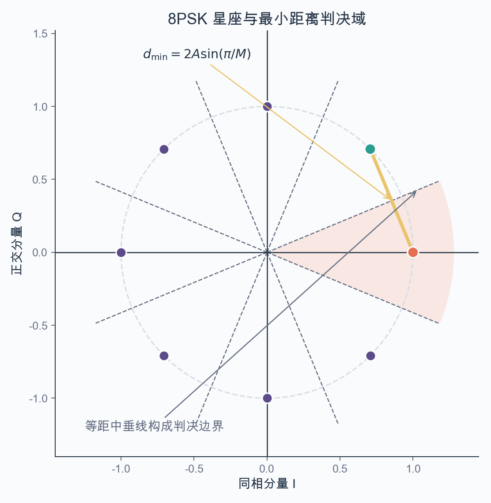

相邻星座点的中垂线构成扇形判决边界。图中的相邻点距离为$d_{\min}=2A\sin(\pi/M)$，所以星座点到最近边界的距离恰好是$d_{\min}/2$，这就是误符号率近似式中$A\sin(\pi/M)$的几何来源。

高信噪比、$M$较大时，可以把扇区两条边界局部近似成平行线，两个相邻边界的差错贡献近似相同，因此

$$
P_{s,\mathrm{MPSK}}\approx2Q\left(\sqrt{\frac{S}{N}}\sin\frac{\pi}{M}\right)
$$

换成每比特能量后

$$
P_{s,\mathrm{MPSK}}\approx2Q\left(\sqrt{2\log_2M\frac{E_b}{n_0}}\sin\frac{\pi}{M}\right)
$$

配合Gray映射，近似BER为

$$
P_{b,\mathrm{MPSK}}\approx\frac{2}{\log_2M}Q\left(\sqrt{2\log_2M\frac{E_b}{n_0}}\sin\frac{\pi}{M}\right)
$$

#### MQAM

方形$M$QAM可以看成两路相互正交的$\sqrt M$进制PAM。令相邻星座点在$I$、$Q$方向上的间距均为$2A$，则平均符号功率为

$$
S=\frac{2(M-1)}{3}A^2
$$

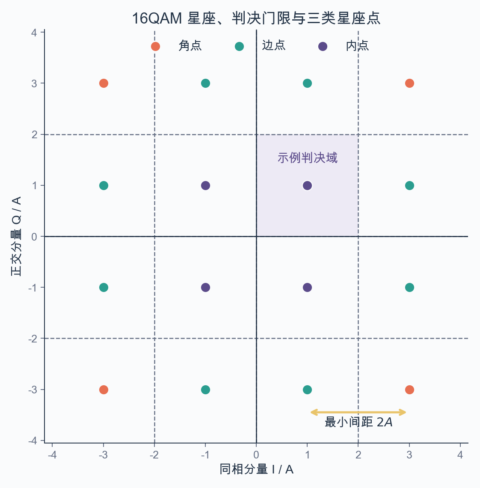

方形QAM的判决域由相邻电平的中点划开。角点、边点和内点分别面对两条、三条和四条最近判决边界，所以精确计算符号错误率时必须分开计数。

精确计算时要分别数角点、边界点和内部点；在高信噪比下忽略$Q^2(\cdot)$项，可得

$$
P_{s,\mathrm{MQAM}}\approx4\left(1-\frac{1}{\sqrt M}\right)Q\left(\sqrt{\frac{3}{2(M-1)}\frac{S}{N}}\right)
$$

进一步写成

$$
P_{s,\mathrm{MQAM}}\approx4\left(1-\frac{1}{\sqrt M}\right)Q\left(\sqrt{\frac{3\log_2M}{M-1}\frac{E_b}{n_0}}\right)
$$

采用Gray映射时

$$
P_{b,\mathrm{MQAM}}\approx\frac{4}{\log_2M}Q\left(\sqrt{\frac{3\log_2M}{M-1}\frac{E_b}{n_0}}\right)
$$

提高调制阶数$M$可以让每个符号承载更多比特，但固定平均功率时星座点会变密，误码率上升。高阶调制因此以更高的功率和接收精度换取频谱效率。

## 载波传输

基带信号的能量集中在零频附近，而无线信道通常工作在较高载频$f_c$附近。把基带频谱搬到载频，一方面可以匹配天线和信道特性，另一方面也能让不同链路占用不同频带而同时传输。

### 正交载波与IQ表示

令$I$、$Q$两路基带信号分别为$s_I(t)$和$s_Q(t)$，带通信号可以写成

$$
s(t)=s_I(t)\cos\omega_ct-s_Q(t)\sin\omega_ct
$$

定义复基带包络

$$
s_b(t)=s_I(t)+\mathrm js_Q(t)
$$

就有紧凑表示

$$
\boxed{s(t)=\operatorname{Re}\left\{s_b(t)\mathrm e^{\mathrm j\omega_ct}\right\}}
$$

$\cos\omega_ct$与$-\sin\omega_ct$彼此正交，因而同一频带内可以同时承载两路基带信号。相干接收机用同频同相的本地载波分别相乘，再经低通或匹配滤波恢复$I$、$Q$分量。以$I$路为例，

$$
2s(t)\cos\omega_ct=s_I(t)\left[1+\cos(2\omega_ct)\right]-s_Q(t)\sin(2\omega_ct)
$$

低通滤去$2\omega_c$附近的分量后只剩$s_I(t)$；乘$-2\sin\omega_ct$同理可以恢复$s_Q(t)$。本地载波的频率或相位不准会使$I$、$Q$相互串扰，因此这里隐含了载波同步要求。

### MPSK与QAM的带通信号

对$M$PSK，符号相位取

$$
\phi_n\in\left\{0,\frac{2\pi}{M},\ldots,\frac{2(M-1)\pi}{M}\right\}
$$

已调信号为

$$
s_{\mathrm{MPSK}}(t)=\sum_ng(t-nT_s)A\cos(\omega_ct+\phi_n)
$$

展开余弦可见，它对应的IQ电平为

$$
a_{I,n}=A\cos\phi_n,\qquad a_{Q,n}=A\sin\phi_n
$$

符号的幅度恒定，信息只在相位中。QAM则让$I$、$Q$两路电平都参与承载信息：

$$
s_{\mathrm{QAM}}(t)=\left[\sum_na_ng(t-nT_s)\right]\cos\omega_ct-\left[\sum_nb_ng(t-nT_s)\right]\sin\omega_ct
$$

令$c_n=a_n+\mathrm jb_n$，复基带形式为

$$
s_b(t)=\sum_nc_ng(t-nT_s)
$$

于是MPSK、QAM以及一般线性载波调制都能放在同一个IQ框架下分析。

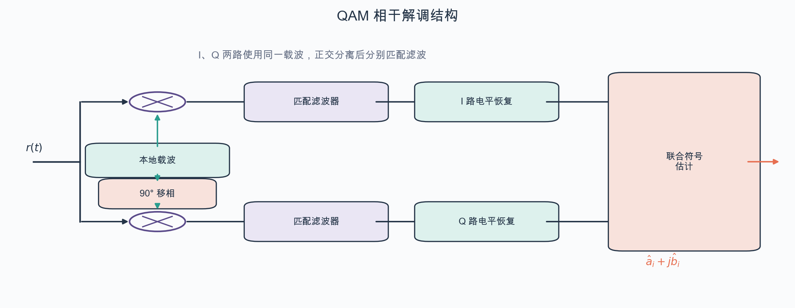

本地载波一路直接送入$I$路混频器，另一路移相$90^\circ$后送入$Q$路。两路分别匹配滤波并恢复电平，最后再合成一个复符号估计；载波同步一旦偏离，原本正交的两路就会互相串扰。

两路匹配滤波和抽样后，仍然得到

$$
\mathbf y=\mathbf a+\mathbf n
$$

其中二维高斯噪声的两个分量独立，随后按星座图上的最小欧氏距离判决即可。

### 解析信号与等效基带

若实带通信号为$s(t)$，其Hilbert变换记为$\hat s(t)$，频域关系为

$$
\mathcal F\{\hat s(t)\}=-\mathrm j\operatorname{sgn}(f)S(f)
$$

解析信号定义为

$$
s_a(t)=s(t)+\mathrm j\hat s(t)
$$

它只保留正频率部分。将解析信号下变频到零频，得到复基带等效信号

$$
s_b(t)=s_a(t)\mathrm e^{-\mathrm j2\pi f_ct}
$$

反过来，已知复基带就能恢复原带通信号：

$$
s(t)=\operatorname{Re}\left\{s_b(t)\mathrm e^{\mathrm j2\pi f_ct}\right\}
$$

等效基带保留了带通信号的幅度和相位信息，却把GHz量级的载频搬到了零频附近，因此更适合分析与数字实现。若带通信道的等效基带冲激响应为$h_b(t)$，系统可以写成

$$
y_b(t)=s_b(t)*h_b(t)+n_b(t)
$$

后续的匹配滤波、均衡和判决都可以直接在这个复基带模型上进行。

### 载波调制的带宽与频谱效率

基带波形乘载波后，原来位于零频附近的频谱会分别搬到$\pm f_c$。若基带单边带宽为$W$，实际正频带占用范围为$[f_c-W,f_c+W]$，带通信号带宽为

$$
B=2W
$$

升余弦成形的基带单边带宽为

$$
W=\frac{1+\alpha}{2T_s}
$$

所以带通占用带宽和频谱效率分别是

$$
B=\frac{1+\alpha}{T_s},\qquad \eta=\frac{R_b}{B}=\frac{\log_2M}{1+\alpha}\ \mathrm{bit/(s\cdot Hz)}
$$

滚降系数$\alpha$越小，频谱越紧凑，但滤波器时域拖尾更长、实现和定时更敏感；增大$M$可以提高$\eta$，代价则是星座距离减小、所需信噪比提高。

## 差错控制

噪声、码间串扰、多接入干扰和邻小区干扰都可能造成误码。匹配滤波和最佳判决可以减小差错概率，却不能保证差错完全消失，因此还要在传输中加入适当的冗余。差错控制有两条基本路线：

- 自动请求重传（Automatic Repeat reQuest, ARQ）：接收端先检错，发现错误后通过反馈信道要求发送端重传。
- 前向纠错（Forward Error Correction, FEC）：发送端加入有结构的冗余，接收端不依赖反馈，直接从收到的序列中纠错。

FEC不需要反馈，瞬时传输速率稳定，适合实时业务；代价是占用额外的传输资源并增加编译码复杂度。ARQ只有在出错时才增加冗余，信道较好时效率较高，但传播、反馈和重传都会带来不确定的时延。实际系统也常把两者结合起来。

### 信道编码与编码增益

信道编码通常指用于FEC的纠错编码。它可以按线性码与非线性码、分组码与卷积码、系统码与非系统码分类。实用编码只能采用有限码长，所以误码率不可能严格为零；引入代数结构，则是为了让编译码可以实现。评价一个码时，要同时看误码率和码率：前者衡量可靠性，后者衡量有效性。

若每次输入编码器的$k$个信息比特被编码为$n$个码元，码率为

$$
R_c=\frac{k}{n}
$$

若每个信息比特的平均能量为$E_b$，每个编码码元的平均能量为$E_s$，则课件采用的能量关系为

$$
E_s=E_bR_c
$$

在给定误比特率下，编码系统所需的$E_b/n_0$低于未编码系统所需的信噪比，两者以dB表示时的差称为编码增益。编码增益不是“凭空增加能量”，而是用冗余和译码复杂度换取更低的差错率。

以交叉概率为$p_e$的二进制对称信道为例，一个比特只传一次时错误概率为$p_e$。若把它重复三次并采用多数判决，至少两次传错才会误判，因此

$$
P_e=\binom{3}{2}p_e^2(1-p_e)+p_e^3\mathop{\approx}_{p_e\to0}3p_e^2
$$

差错概率的阶数从$p_e$变成了$p_e^2$，但码率也降到了$1/3$。这正体现了可靠性和有效性的交换。

### 二进制域 $\mathrm{GF}(2)$

本讲讨论的码主要定义在二元有限域$\mathrm{GF}(2)=\{0,1\}$上。加法就是异或，乘法就是普通的二进制乘法：

$$
0+0=0,\quad 0+1=1+0=1,\quad 1+1=0
$$

$$
0\cdot0=0,\quad 0\cdot1=1\cdot0=0,\quad 1\cdot1=1
$$

因而加法和减法没有区别，均可写成模2加。这一点贯穿生成矩阵、监督矩阵和校正子的全部运算。

### 分组码与汉明距离

分组码把信息序列分成长度为$k$的组，每组独立映射为一个长度为$n$的码字，记为$(n,k)$码。监督码元只由本组的信息码元决定，共有$2^k$个许用码字，码率为$k/n$。最简单的例子是奇偶监督码：在$n-1$个信息位后加入一位

$$
a_n=a_1+a_2+\cdots+a_{n-1}
$$

正确的偶校验码字满足

$$
a_1+a_2+\cdots+a_n=0
$$

它能检出任意奇数位错误，却会漏掉偶数位错误，因此只能检错，不能确定错误位置并纠错。

两个二元向量$\mathbf x,\mathbf x'$的汉明距离，是它们取值不同的位置数，也等于模2和中“1”的个数：

$$
d_H(\mathbf x,\mathbf x')=w(\mathbf x+\mathbf x')
$$

其中$w(\mathbf x)$为汉明重量，即向量中“1”的个数。一个码的最小码距定义为任意两个不同许用码字之间的最小距离：

$$
d_{\min}=\min_{\mathbf c_i\ne\mathbf c_j}d_H(\mathbf c_i,\mathbf c_j)
$$

最小码距决定了码字周围可以留出多大的判决区域。若要求纠正不超过$t$位错误，同时还能检出不超过$e$位错误，并取$t\le e$，则必须满足

$$
d_{\min}\ge t+e+1
$$

两个常用的特例是

$$
t=0:\quad d_{\min}\ge e+1
$$

$$
t=e:\quad d_{\min}\ge2t+1
$$

所以，只考虑纠错时最多可保证纠正

$$
t_{\max}=\left\lfloor\frac{d_{\min}-1}{2}\right\rfloor
$$

位错误；只考虑检错时最多可保证检出$d_{\min}-1$位错误。设计分组码的两个方向也由此得到：在可靠性上尽量增大$d_{\min}$，在有效性上则希望同一码长内保留尽可能多的许用码字。

### 线性分组码

若许用码字在$\mathrm{GF}(2)$上构成线性空间，就得到线性分组码。课件采用行向量记法：信息向量$\mathbf X$与生成矩阵$G$相乘得到码字$\mathbf A$，

$$
\mathbf A=\mathbf XG
$$

任意两个许用码字之和仍是许用码字，所以线性码的最小码距也等于非零码字的最小重量：

$$
d_{\min}=\min_{\mathbf A\in\mathcal C,\,\mathbf A\ne0}w(\mathbf A)
$$

$G$是$k\times n$矩阵，应当行满秩，且不含全零列。行满秩保证不同信息向量不会映射到同一码字；全零列始终不能携带信息，应当删去。系统线性码的典型生成矩阵为

$$
G=[I_k\ Q]
$$

此时码字的前$k$位就是原始信息位，后$r=n-k$位为监督位。相应的监督矩阵可取

$$
H=[Q^{\mathrm T}\ I_r]
$$

于是

$$
GH^{\mathrm T}=[I_k\ Q]\begin{bmatrix}Q\\I_r\end{bmatrix}=Q+Q=0
$$

所有许用码字都满足

$$
\mathbf AH^{\mathrm T}=0
$$

对一般的线性码，$G$不必含有显式的单位阵，但$H$仍可取为$G$零空间的一组基，使$GH^{\mathrm T}=0$。通过高斯消元和列置换可以把$G$化成系统形式，再按上式求$H$，最后把列顺序还原。

#### 校正子

设接收向量为

$$
\mathbf B=\mathbf A+\mathbf E
$$

其中差错图样$\mathbf E$在发生翻转的位置取1。接收端计算校正子

$$
\mathbf S=\mathbf BH^{\mathrm T}=(\mathbf A+\mathbf E)H^{\mathrm T}=\mathbf EH^{\mathrm T}
$$

校正子与发送的码字$\mathbf A$无关，只由差错图样决定。$\mathbf S=0$表示“没有检出错误”，但也可能是码字恰好错成了另一个许用码字；$\mathbf S\ne0$则一定发生了可检出的错误。

若只考虑一位错，第$v$位出错时，$\mathbf S$就是$H$第$v$列的转置。要区分“无错”和$n$种单比特错误，$r$位校正子至少要表示$n+1$种情况：

$$
2^r\ge n+1,\qquad r\ge\left\lceil\log_2(n+1)\right\rceil
$$

因此，能纠正任意一位错的监督矩阵不能含全零列，而且各列必须互不相同。

### Hamming码

当上面的界恰好取等号时，得到二进制Hamming码：

$$
n=2^r-1,\qquad k=n-r=2^r-1-r
$$

其监督矩阵的$n$列恰好遍历全部非零$r$维二元向量，所以每个非零校正子都唯一对应一个错误位置。Hamming码的基本参数为

$$
d_{\min}=3,\qquad t=1,\qquad R_c=\frac{2^r-1-r}{2^r-1}
$$

$d_{\min}=3$可以从监督矩阵看出：$H$没有零列，也没有两列相同，故重量为1或2的非零码字不存在；任意两列之和又是某个非零列，所以存在重量为3的码字。若在纠正一位错的同时讨论保证检出的额外错误，则由$d_{\min}\ge t+e+1$得$e=1$。如果不做纠错、只做检错，$d_{\min}=3$则可检出两位错。

以$r=3$的$(7,4)$Hamming码为例，课件选取

$$
Q=\begin{bmatrix}1&1&1\\1&1&0\\1&0&1\\0&1&1\end{bmatrix}
$$

从而

$$
G=\begin{bmatrix}1&0&0&0&1&1&1\\0&1&0&0&1&1&0\\0&0&1&0&1&0&1\\0&0&0&1&0&1&1\end{bmatrix}
$$

$$
H=\begin{bmatrix}1&1&1&0&1&0&0\\1&1&0&1&0&1&0\\1&0&1&1&0&0&1\end{bmatrix}
$$

$H$的七列依次为$111,110,101,011,100,010,001$，正好标识七个错误位置。例如$\mathbf X=0010$编码为$\mathbf A=0010101$。若第一位出错，收到$1010101$，校正子为$111$，接收端翻转第一位即可恢复。若第三、六位同时出错，校正子也可能等于某个单比特错误对应的列；单错译码器会按错误的位置再翻转一次，反而造成误纠正。因此普通Hamming码只能保证纠正一位错。

Hamming码还是完备码。每个码字本身和距它为1的$n$个向量恰好填满整个码字空间：

$$
2^k(1+n)=2^k2^r=2^n
$$

在交叉概率为$\varepsilon$的BSC上，$(7,4)$Hamming码只有出现至少两位错才会造成误块，故

$$
P_B=\sum_{i=2}^{7}\binom{7}{i}\varepsilon^i(1-\varepsilon)^{7-i}\mathop{\approx}_{\varepsilon\to0}21\varepsilon^2
$$

若同样用$(7,4)$的长度和码率，却简单地把三个监督位固定为0，则$d_{\min}=1$，

$$
P_B=1-(1-\varepsilon)^7\mathop{\approx}_{\varepsilon\to0}7\varepsilon
$$

两者码率相同，但误块率的阶数不同，这就是码字集合设计带来的编码增益。

### 陪集、陪集首与标准阵列

设线性码的码字集合为$\mathcal C$。对固定差错图样$\mathbf E$，集合

$$
\mathbf E+\mathcal C=\{\mathbf E+\mathbf A:\mathbf A\in\mathcal C\}
$$

称为一个陪集。陪集内所有向量具有相同的校正子，因为

$$
(\mathbf E+\mathbf A)H^{\mathrm T}=\mathbf EH^{\mathrm T}
$$

译码时通常把该陪集中重量最小的向量选作陪集首，优先解释为较少位的差错。收到$\mathbf B$后，先由校正子找到相应的陪集首$\hat{\mathbf E}$，再作

$$
\hat{\mathbf A}=\mathbf B+\hat{\mathbf E}
$$

标准阵列把这种划分完整列出：第一行是$2^k$个许用码字，第一列是$2^{n-k}$个陪集首，每一行由该陪集首分别加上全部许用码字得到。因此阵列共有$2^{n-k}$行、$2^k$列，恰好覆盖全部$2^n$个二元向量。

校正子只有$2^{n-k}$种，所以译码器只能为每种校正子指定一个首选差错图样。除全零图样外，如果非零校正子的数量大于$n$，在标识全部单比特错误后还可以标识一部分多比特错误；如果小于$n$，就连所有单比特错误也不能完全区分。Hamming码中每个非零校正子都已用于一位错，正好没有剩余。

### 交织与突发错误

分组码擅长处理分散的随机错误，但衰落等因素常使错误连续出现。交织器不增加码字本身的纠错能力，而是改变码元的发送次序，把一段突发错误在解交织后打散到多个码字中。

对宽度为$n$、深度为$m$的分组交织器，可把$m$个长度为$n$的码字逐行写入矩阵，再逐列读出；接收端执行逆置换。原来同一码字中相邻的码元在信道上被拉开，信道上的连续错误则分散到不同的行。若每个分组码字可以纠正$b$个错误，理想情况下交织后可以抵抗长度不超过$mb$的突发错误。增大交织深度能提高抗突发错误能力，但也会增加缓存和编译码时延。

例如，把五个$(7,4)$Hamming码字排成$5\times7$矩阵后交织，一段连续五位的突发错误可被分到五个码字，每个码字只留下一位错，仍可由Hamming译码器纠正。

### 卷积码

分组码的译码依赖一个完整码字。码长增大时，译码时延和复杂度也随之增大。卷积码不把输入切成彼此独立的有限分组，而是让每次输出只依赖当前输入和有限段历史输入，因此可以在序列持续到达时不断编码和译码。

课件用$(n,k,N)$描述卷积码：每次有$k$位信息进入移位寄存器，输出$n$位编码结果，寄存器级数$N$称为约束长度，码率为

$$
R_c=\frac{k}{n}
$$

若把当前输入所在的一级排除，决定后续转移的记忆状态共有$k(N-1)$位，所以状态数为

$$
M=2^{k(N-1)}
$$

以课件中的$(2,1,3)$码为例，两路生成抽头分别为$111$和$101$。若输入为$u_i$，则

$$
v_{i,1}=u_i+u_{i-1}+u_{i-2},\qquad v_{i,2}=u_i+u_{i-2}
$$

全部运算仍在$\mathrm{GF}(2)$上。寄存器从全零状态开始时，输入$1101$对应的输出为

$$
11\,01\,01\,00
$$

#### 树状图、状态图与网格图

树状图从初始状态展开所有可能输入。每个时刻有$2^k$种输入，因此每个节点产生$2^k$条分支，分支上标出本次输出。它最直观地展示了输入序列和输出序列之间的对应关系，但同一种寄存器状态会在不同分支上反复出现，树会指数增长。

状态图把相同的寄存器状态合并成一个节点，边表示一次状态转移，并标记相应的编码输出。对上述$(2,1,3)$码，令状态按$(u_{i-2},u_{i-1})$排列，有四种状态：

| 当前状态 | 输入0：下一状态/输出 | 输入1：下一状态/输出 |
| --- | --- | --- |
| $00$ | $00/00$ | $01/11$ |
| $01$ | $10/10$ | $11/01$ |
| $10$ | $00/11$ | $01/00$ |
| $11$ | $10/01$ | $11/10$ |

网格图又称Trellis图，它把状态图沿时间轴逐级展开。每一列列出当前可能的状态，相邻两列之间的边就是允许的状态转移。树状图适合枚举和观察距离，状态图适合分析状态转移与自由距，网格图则直接用于编码路径表示和Viterbi译码。

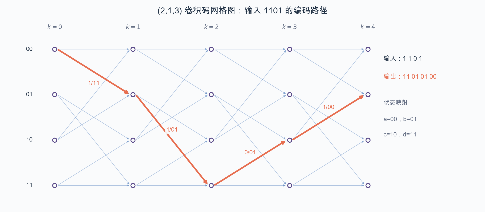

图中状态$00,01,10,11$分别对应课件里的$a,b,c,d$。红色路径从全零状态出发，依次经过$01,11,10,01$，四条分支输出为$11,01,01,00$，与前面的编码结果一致。

#### 自由距

卷积码也是线性码，所以两个编码序列之间的距离可转化为某个非零编码序列相对全零序列的重量。由于卷积码没有固定的码字边界，更有意义的距离参数是自由距：所有从全零状态出发、经过非零状态后第一次重新并入全零状态的路径中，输出汉明重量的最小值。

$$
d_{\mathrm{free}}=\min_{\substack{\text{路径离开零状态}\\\text{并重新回到零状态}}}w(\text{路径输出})
$$

对上面的$(2,1,3)$码，最短的非零回归路径输出为$11,10,11$，重量为5，因此

$$
d_{\mathrm{free}}=5
$$

自由距越大，两个可能的无限长编码序列越不容易被噪声混淆。

#### Viterbi译码

若接收序列没有错误，就能在网格图上找到一条输出与它完全一致的路径；有错误时，则选择与接收序列距离最小的路径。对硬判决输入，整条路径的代价就是各分支汉明距离之和：

$$
\Lambda(\mathcal P)=\sum_i d_H(\mathbf y_i,\mathbf v_i(\mathcal P))
$$

直接枚举所有路径的复杂度随序列长度指数增长。Viterbi算法利用动态规划：在每个时刻、对每个状态，只比较所有进入该状态的候选路径，保留累计代价最小的幸存路径；下一时刻只从这些幸存路径继续延伸。其依据是，到达某状态的非最优前缀以后不可能反超具有相同后续选择的最优前缀。待各幸存路径充分汇合后回溯，就可以逐步给出译码结果。译码器只需维护与状态数同阶的路径，而不必保存所有历史可能性。

硬判决译码器的输入已经被量化为确定的0或1，通常用汉明距离作分支度量。软判决保留接收样值对0或1的置信度，用多比特数值、概率或对数似然比表示，并按欧氏距离或负对数似然计算分支度量。软判决没有提前丢掉“这一位有多可靠”的信息，通常比硬判决性能更好，广泛用于卷积码的Viterbi译码以及迭代译码。

### 自动请求重传

ARQ是数据链路层的重要协议。设一个长度为$n$的分组经过BSC传输，单比特交叉概率为$\varepsilon$，定义

$$
P_c=(1-\varepsilon)^n
$$

为分组正确概率，$P_d$为发生错误且被检出的概率，$P_m$为发生错误却漏检的概率，则

$$
P_c+P_d+P_m=1
$$

被检出的错误会触发重传，漏检错误则会被当成正确分组交付。经过任意多次重传后，最终交付错误分组的概率为

$$
P_b=P_m+P_dP_m+P_d^2P_m+\cdots=\frac{P_m}{1-P_d}=\frac{P_m}{P_c+P_m}
$$

理想重传仍受到传播、分组传输、译码计算和ACK/NAK反馈时延的限制。若信道符号速率为$R$，每个分组含$k$个信息比特、编码后有$n$个符号，记

$$
T_m=\frac{n}{R}
$$

为分组传输时间，$T_d$为单程传播时延，$T_c$为译码计算时间，$T_a$为ACK或NAK的传输与处理时间，并令

$$
T_{dca}=2T_d+T_c+T_a
$$

下面的吞吐量$\eta$以“单位信道可传符号所承载的有效信息比特数”归一化，因此无差错、无等待时的上限就是码率$k/n$。

#### 停-等ARQ

停-等（Stop-Wait, SW）协议发送一个分组后必须等待ACK/NAK；收到ACK才发送下一个分组，收到NAK或超时则重传当前分组。一次发送和等待周期为

$$
T_D=T_m+T_{dca}
$$

即使总是一次成功，其吞吐量上限也只有

$$
\eta_{\mathrm{SW},0}=\frac{k}{T_DR}=\frac{k}{n+T_{dca}R}
$$

每次以概率$P_d$触发重传，直到不再检出错误，平均发送次数为

$$
N_R=\frac{1}{1-P_d}
$$

所以平均吞吐量为

$$
\eta_{\mathrm{SW}}=\frac{k}{T_DR}(1-P_d)=\frac{(k/n)(1-P_d)}{1+T_{dca}R/n}
$$

若检错能力完美，即所有含错分组都能检出，则$P_d=1-(1-\varepsilon)^n$，从而

$$
\eta_{\mathrm{SW}}=\frac{k/n}{1+T_{dca}R/n}(1-\varepsilon)^n
$$

停-等实现简单，但在传播往返时延较大时，发送端大部分时间都在等待。

#### 返回N ARQ

返回N（Go-Back-N, GBN）采用流水发送，不必等前一分组的反馈就继续发送后续分组。若某分组检出错误，则从这个分组开始，把已经发出的后续分组一起重传。没有重传时，流水线填满后的吞吐量上限为

$$
\eta_{\mathrm{GBN},0}=\frac{k}{n}
$$

把一次往返反馈时间折算成整数个分组传输时间，记

$$
T_{dca}'=\left\lceil\frac{T_{dca}}{T_m}\right\rceil T_m
$$

课件给出的平均吞吐量为

$$
\eta_{\mathrm{GBN}}=\frac{(k/n)(1-P_d)}{1+(RT_{dca}'/n)P_d}
$$

完美检错时

$$
\eta_{\mathrm{GBN}}=\frac{(k/n)(1-\varepsilon)^n}{1+(RT_{dca}'/n)\left[1-(1-\varepsilon)^n\right]}
$$

GBN消除了逐包等待，却可能因一个错误重传一串已经正确到达的分组。

#### 选择重传ARQ

选择重传（Selective Repeat, SR）同样连续发送，但只重传真正出错的分组。假定窗口和缓存足够、反馈机制理想，其无差错吞吐量上限与GBN相同：

$$
\eta_{\mathrm{SR},0}=\frac{k}{n}
$$

成功交付一个分组所需的平均传输时间为

$$
\overline T=T_m(1-P_d)+2T_mP_d(1-P_d)+3T_mP_d^2(1-P_d)+\cdots=\frac{T_m}{1-P_d}
$$

因此理想选择重传的平均吞吐量为

$$
\eta_{\mathrm{SR}}=\frac{k}{\overline TR}=\frac{k}{n}(1-P_d)
$$

完美检错时

$$
\eta_{\mathrm{SR}}=\frac{k}{n}(1-\varepsilon)^n
$$

三种ARQ的取舍很清楚：停-等最简单但等待开销最大；返回N能充分利用流水线，却会连带重传；选择重传最节省重传带宽，但需要更复杂的窗口管理、乱序缓存和逐包确认。

## 复用、多址与双工

点到点传输只关心一对收发机。节点变多以后，还要回答两个问题：多路信息怎样共用一条高容量链路，多个用户怎样接入同一传输媒质。前者是复用，后者是多址。

### 基本概念

**复用（Multiplexing）**在同一发送设备内把多路低速信息合成一路高速信息，接收设备再统一分接。它的目的在于填满物理介质尚未利用的传输能力，资源分配通常较固定。

**多址（Multiple Access）**让地理位置不同的用户共享同一传输媒质。各路信号是在信道中汇合的，资源还可能随用户需求动态变化。复用和多址都会把多路信号合在一起，但发生的位置和解决的问题不同。

**双工（Duplex）**讨论一对通信双方怎样共享资源来完成双向传输。单工只能单向传输；半双工允许双向传输，但发送和接收不能同时进行，需要切换方向；全双工则由系统自动把资源划成两个单向信道，无需人工切换即可双向通信。

这三类技术都可以抽象成通信资源的正交划分。设第$i$路符号为$a_i$，它对应的资源基为$\mathbf x_i$，合路后的信号向量为

$$
\mathbf x=\sum_{i=1}^N a_i\mathbf x_i
$$

理想划分要求各组资源构成单位正交基：

$$
\langle\mathbf x_i,\mathbf x_j\rangle=
\begin{cases}
1,&i=j,\\
0,&i\ne j.
\end{cases}
$$

接收端通过内积就能分离第$i$路符号：

$$
\hat a_i=\langle\mathbf x,\mathbf x_i\rangle=a_i
$$

频分、时分和码分的差别，本质上只是正交基选在了不同维度。

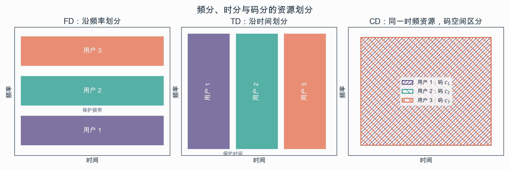

把通信资源画成“时间—频率”平面后，FD沿频率切成横条，TD沿时间切成竖条；CD中的用户占用同一块时频区域，接收端靠不同的码空间基把它们分开。

### 固定接入

#### 频分与时分

频分多址（FDMA）把总带宽切成若干互不重叠的子频带，每个用户占用一个载频。各用户可以连续发送，时钟同步要求不高，但频带之间要留保护间隔，滤波器和信道非线性也会影响相邻用户。

时分多址（TDMA）让用户轮流占用同一频带。若一帧分成$N$个用户时隙，每个用户在自己的时隙内以较高瞬时速率发送，平均下来仍得到所需业务速率。它可以直接在调制前合并比特流，但要求严格的帧同步、时钟同步和保护时间。

若每个用户的比特率为$R_b$，频率方向分成$n_F$份、每个频带内再时分$n_T$个用户，且$N=n_Fn_T$，则每个载频承载的合路速率为

$$
R_{b,\mathrm{sub}}=n_TR_b
$$

对滚降系数为$\alpha$的$M$进制升余弦载波系统，每个子频带所需带宽为

$$
B_{\mathrm{sub}}=\frac{(1+\alpha)n_TR_b}{\log_2M}
$$

FDMA与TDMA在理想条件下可以做到相同的总速率和频谱效率，但时延不同。考虑这样一种到达模型：$N$个用户的分组同时到达，且所有用户的本轮分组传完后才会有新分组到达。若每个分组有$b$ bit，合路总速率为$R_{\mathrm{sum}}$，FDMA中每个用户的速率为$R_{\mathrm{sum}}/N$，所以各用户的时延都是

$$
D_{\mathrm{FD}}=\frac{Nb}{R_{\mathrm{sum}}}
$$

TDMA让各用户依次以总速率发送，完成时刻分别为$b/R_{\mathrm{sum}},2b/R_{\mathrm{sum}},\ldots,Nb/R_{\mathrm{sum}}$，平均时延为

$$
D_{\mathrm{TD}}=\frac{N+1}{2}\frac{b}{R_{\mathrm{sum}}}=\frac{N+1}{2N}D_{\mathrm{FD}}
$$

因此，在这个到达模型下，TDMA的平均时延更小；当$N\to\infty$时，它约为FDMA的一半。

#### 码分与扩频

码分多址（CDMA）给不同用户分配不同的扩频码。设周期为$P$的双极性码序列为$x_i\in\{-1,1\}$，循环自相关为

$$
\rho_x(\tau)=\frac{1}{P}\sum_{i=1}^Px_ix_{i+\tau}
$$

两条周期同为$P$的码序列$x_i$和$y_i$的互相关为

$$
\rho_{xy}=\frac{1}{P}\sum_{i=1}^Px_iy_i
$$

理想扩频码在同步位置有尖锐自相关，不同用户码之间的互相关接近零；若码序列不同步，原有的正交性就可能被破坏。直接序列扩频（DS-SS）用高速码序列直接扩展信息带宽；跳频（FH）用码序列控制载频不断跳变；跳时（TH）则由码序列选择实际发送信号的时片。扩频把信号能量铺到更宽的频带，解扩后有用信号重新集中，而干扰信号被展宽、功率谱密度降低。它体现了Shannon公式中带宽与信噪比可以交换的关系：

$$
C=B\log_2\left(1+\frac{S}{N}\right)
$$

CDMA抗干扰、抗多径，系统容量较大，也不需要复杂的频率分配；另一方面，它会受到多址干扰和远近效应影响，码序列失去同步时性能也会明显下降。

除频、时、码之外，还可以利用定向天线或阵列把空间划成不同波束，即空分多址（SDMA）；在频谱利用率要求很高时，也可以利用正交极化进行极分。实际系统经常混合使用几种划分方式，例如GSM采用频分与时分相结合的接入方式。

### 随机接入

固定接入在业务持续、用户数稳定时简单有效，但突发业务不繁忙时会留下大量空闲资源。随机接入不预先为每个用户保留固定资源，而让有数据的用户尝试发送；冲突后再按协议重试。

#### ALOHA

纯ALOHA的规则很直接：有帧就立即发送，若发生冲突便随机等待后重传。设一帧的发送时间为$T_f$，总的发送尝试以平均速率$\lambda_t$到达，则一个帧时内的网络负载为

$$
G=\lambda_tT_f
$$

发送尝试数服从Poisson分布，$G$表示其中不论成功与否的平均尝试数。若每帧有$b$ bit、物理层信息速率为$R_b$，还应满足$b=R_bT_f$。一个帧要成功，开始发送前后各一个帧时内都不能有其他帧到达，危险区长度为$2T_f$，所以

$$
P_0=\mathrm e^{-2G}
$$

单位帧时的吞吐量为

$$
S=GP_0=G\mathrm e^{-2G}
$$

对$G$求导可知，$G=1/2$时达到最大值

$$
S_{\max}=\frac{1}{2\mathrm e}\approx0.184
$$

时隙ALOHA只允许在时隙边界发送，把危险区缩短为一个帧时。于是

$$
P_0=\mathrm e^{-G},\qquad S=G\mathrm e^{-G}
$$

其最优负载和最大吞吐量为

$$
G^*=1,\qquad S_{\max}=\frac{1}{\mathrm e}\approx0.368
$$

时隙化把最高利用率提高了一倍，代价是所有站点必须同步。一次尝试到成功所需的次数服从几何分布；在时隙ALOHA中，其均值为$\mathrm e^G$。

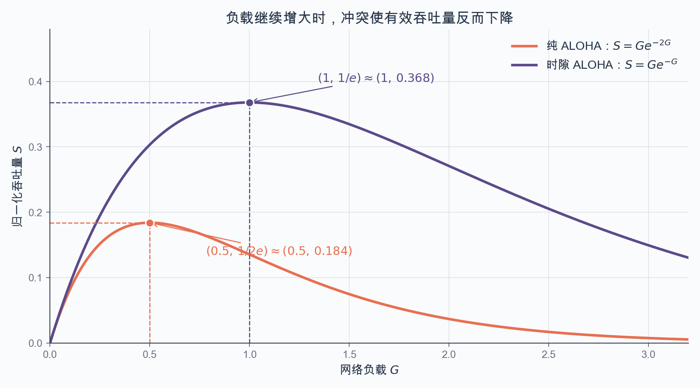

两条曲线都不是负载越大越好：超过峰值以后，新尝试带来的冲突多于成功帧，吞吐量反而下降。时隙化把危险区减半，峰值便从$(0.5,1/(2\mathrm e))$提高到$(1,1/\mathrm e)$。

#### CSMA与冲突处理

ALOHA发送前不看信道是否空闲。载波监听多路访问（CSMA）先监听再决定发送：

- 1-坚持CSMA发现空闲就立即发送，信道忙时持续监听。空闲时间少，但多个等待站容易同时发送。
- 非坚持CSMA发现忙后随机等待，再重新监听。冲突较少，代价是时延和信道空闲时间增加。
- $p$-坚持CSMA在空闲时隙以概率$p$发送，以$1-p$的概率推迟到下一时隙，折中利用率与冲突概率。

CSMA/CD在发送过程中继续监听。一旦发现冲突便立即停止，随机退避后重试。最坏情况下，站点要经过两倍端到端传播时延$2\tau$才能确认冲突。令

$$
a=\frac{\tau}{T_f}
$$

在饱和的多用户竞争模型下，一个竞争时隙长$2\tau$。若$N$个用户各以概率$q$尝试接入，该时隙恰有一个用户发送的概率为

$$
\gamma=Nq(1-q)^{N-1}
$$

当$q=1/N$时，成功概率最大，并且

$$
\gamma_{\max}=\left(1-\frac{1}{N}\right)^{N-1}\xrightarrow[N\to\infty]{}\mathrm e^{-1}
$$

竞争次数$k$服从几何分布，因而

$$
\Pr\{K=k\}=\gamma(1-\gamma)^{k-1},\qquad \mathbb E[K]=\frac{1}{\gamma}\xrightarrow[N\to\infty]{}\mathrm e
$$

传完一帧的平均耗时包括帧发送时间、传播时间和竞争时隙：

$$
\mathbb E[T]=T_f+\tau\left(1+2\mathbb E[K]\right)
$$

所以效率极限为

$$
\eta=\frac{1}{1+a(1+2\mathrm e)}\approx\frac{1}{1+6.44a}
$$

传播时延相对帧时越短，CSMA/CD越有效。这个结果是所有用户都参与竞争时的极限；实际效率还与负载$G$以及$p$-坚持协议的$p$有关。它适合能够边发边测冲突的总线式有线网络。

无线站点通常无法可靠地一边发送一边检测冲突，因此采用CSMA/CA：发送前监听，空闲后再随机退避，接收端用ACK确认；没有收到ACK便在等待后重传。它不是检测并终止冲突，而是尽量避开冲突。

随机接入之外，也可以显式管理发送权。令牌环让空令牌在各站之间循环，有数据的站点取得令牌后发送；轮询则由主站依次询问各从站。它们能控制冲突和公平性，但会引入令牌或轮询开销。

### 多路复用与双工

频分复用（FDM）先把各支路调制到不同频带，再合并整个带宽。各路不必严格同步，但模拟滤波复杂，信道非线性还会产生交调和路际串扰。

时分复用（TDM）把各支路的比特放进不同的时隙。一个完整的周期称为帧，复接器把若干码速为$f_l$的低速支路合成码速为$f_h$的高速比特流，分接器依靠帧结构和时钟恢复各支路。复接是TDM的关键环节。它便于数字处理，但对同步和时钟抖动较敏感。

全双工可用频率或时间划分实现。FDD给两个方向分配不同频带，TDD则按时隙划分两个单向信道。半双工也能双向通信，但发送和接收不能同时进行，需要切换收发方向。

## 交换与路由

多点到多点通信要解决两个不同层次的问题：交换负责节点内部从哪一个入口转到哪一个出口，追求快速；路由负责在全网拓扑中为源和目的选择路径，追求合适的路。

### 交换方式

**电路交换**在传输前先建立一条端到端专用电路。建立完成后时延小而稳定，中间节点不必存储、分析数据，能够透明传输；但呼叫建立过程较长，空闲时资源仍被独占，利用率不高，而且两端要采用相同的协议、格式和同步方式。

**报文交换**以完整报文为单位存储转发，不预先建立固定电路。链路可以被多条业务共享，也能在不同类型终端之间转换，但节点要等待整个报文到齐，缓存和时延都很大。

**分组交换**把报文切成长度较短、格式统一的分组，再逐跳存储转发。分组可以动态统计复用链路，适合突发数据，时延也比整份报文存储转发更小；代价是每个分组都带有附加信息，长报文需要合理分组，而且交换机要随时分析和处理分组。

### 交换单元

空分交换单元用空间上不同的交叉连接把输入接到输出。一个$M$入、$N$出的单级交叉开关需要$MN$个交叉点，结构直观但规模增长很快。以$MN$入、$MN$出的交换网络为例，单级实现需要$(MN)^2$个开关；若第一级使用$M$个$N\times N$单元，第二级使用$N$个$M\times M$单元，则开关数降为

$$
MN^2+NM^2=MN(M+N)
$$

多级Clos网络正是用较小的交换单元级联来降低开关数，代价是控制更复杂，而且可能因内部出线竞争而阻塞。

时分交换单元把各输入数据先写入共享存储器，再按输出次序读出，本质上利用统计时分复用。交换结构通常由线路卡、交换网络和处理器组成：数据平面完成查表和高速转发，控制平面维护路由与交换状态。

### 路由模型与目标

把网络表示为带权图$G=(V,E)$，节点是路由器，边是链路，$c(x,y)$表示链路代价。代价可以取跳数、时延、拥塞程度或管理员配置的权重。路由算法要在效率、计算复杂度、稳定性、收敛速度和多路径能力之间折中。

生成树连接全部节点且没有环，任意两点之间只有一条路径，结构简单并适合广播；但它不会充分利用所有链路。最短路径则为每个源节点建立一棵最短路径树，使路径代价和最小：

$$
d_x(y)=\min_{p:x\leadsto y}\sum_{(u,v)\in p}c(u,v)
$$

路由算法给出计算规则，路由协议则规定各节点怎样交换信息并分布式地实现算法。

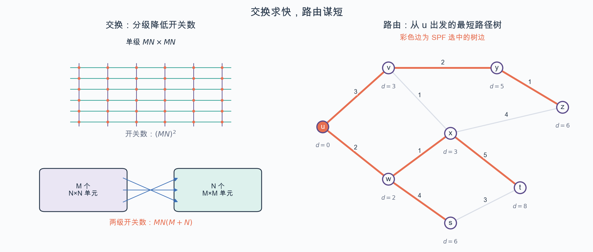

左图对比单级交叉开关和两级结构：分级后开关数由$(MN)^2$降为$MN(M+N)$，但要接受更复杂的控制和内部阻塞。右图沿用课件的带权拓扑，彩色边是从$u$出发得到的最短路径树，节点旁的$d$给出累计路径代价。

### 生成树协议

生成树包含全部节点，任意两点之间只有一条路径，因而结构简单、没有环路并且便于广播；代价是部分链路不能被利用。生成树协议先选择ID最小的节点作为根，再让各节点寻找跳数最少的到根路径。节点通告可概括成三元组

$$
(\text{根节点ID},\ \text{到根距离},\ \text{发送节点ID})
$$

节点不断向邻居广播自己认定的根和到根距离。收到更小的根ID时改认新根；根相同时，选择距离加一后更短的邻居路径。三元组的最后一项标明通告来自哪个节点。反复更新直至全网形成一棵无环生成树。

### 距离矢量路由

距离矢量算法只要求节点与邻居交换路由表。若$x$的邻居集合为$N(x)$，Bellman-Ford更新式为

$$
\boxed{d_x(y)=\min_{v\in N(x)}\left[c(x,v)+d_v(y)\right]}
$$

节点周期性广播自己到所有目的节点的距离，根据邻居通告更新最小距离和下一跳。它所需局部信息少，实现简单，但坏消息逐站传播较慢；链路失效后，邻居之间可能互相把对方当成可达路径，形成路由环和“计数到无穷”问题。

RIP是典型距离矢量协议，以跳数为度量，每30秒通过UDP向邻居发送一次完整路由表，并把最大有效距离限制为15跳；16跳视为不可达，这也限制了计数到无穷的时间和网络规模。

### 链路状态路由

链路状态方法让每个节点生成描述直连链路的链路状态分组（LSP），通过洪泛把它无修改地传播到全网。各路由器因此得到相同的拓扑图，再独立运行Dijkstra算法。

以源节点$u$为例，令$S$为已经确定最短距离的节点集合，$D(v)$为当前暂定距离。初始化时，直连邻居的暂定距离取链路代价，非邻居取无穷大：

$$
S=\{u\},\qquad
D(v)=
\begin{cases}
c(u,v),&v\text{与}u\text{直连},\\
\infty,&\text{其他}.
\end{cases}
$$

每轮选择$S$外$D(w)$最小的节点$w$加入$S$，再松弛它的相邻节点：

$$
D(v)\leftarrow\min\left[D(v),D(w)+c(w,v)\right]
$$

直到所有可达节点进入$S$，便得到以$u$为根的最短路径树和路由表。链路状态法收敛快、全局一致性好，但要存储拓扑并承担LSP洪泛和最短路计算开销。实际网络会降低不必要的刷新频率，用多播代替全网广播，并用时间戳、序列号以及分层分区来协调LSP刷新。

OSPF是典型链路状态协议。路由器把直连链路状态直接封装在IP中，而不是经TCP或UDP传送，并把变化洪泛到自治系统内的其他路由器。各路由器建立共同的拓扑数据库，再用Dijkstra算法计算转发表。OSPF还支持身份验证、多条等代价路径，以及自治系统内的分层区域结构。

距离矢量与链路状态的根本差异在于信息范围：前者只和邻居交换完整路由表，逐步学习距离；后者把链路状态变化传播到全网，各节点再本地计算。RIP算法简单、适合小规模网络，但周期刷新使收敛较慢；OSPF需要更多CPU、内存和洪泛开销，但采用触发式刷新，对拓扑变化反应更快。

## 流量管理与控制

每一对源和目的都独立选择最短路时，许多流可能同时挤到少数链路上。这个问题可以分三个层次处理：网络层通过流量工程安排路径，传输层由端系统控制发送速率，链路层在节点内管理队列。

### 流量工程

流量工程通过调整路由，让全网流量与链路容量更匹配。传统链路权重常按物理距离设置，或与链路带宽成反比；更直接的方法是测量业务需求和网络性能，根据优化目标反推链路权重，再由现有最短路协议生成新的路由表。

实现上有两条路：一是各节点根据分布式测量结果运行自适应路由协议，按负载和需求计算路径；二是集中收集拓扑、流量和性能，运行全网“what-if”模型，统一调整影响路由的静态参数。其中，集中式方法更常用。

### 拥塞与端到端控制

当进入网络的负载超过可用容量时会发生拥塞。队列先变长，时延增加；缓存装满后开始丢包；端系统若把丢包一律用重传补回，又会进一步增加负载，甚至出现发送量增加而有效吞吐量下降的恶性循环。

端系统通常从往返时延（RTT）、超时和重复ACK推断拥塞，再用拥塞窗口$cwnd$限制尚未确认的数据量。TCP还有接收窗口$rwnd$，用于防止发送端压满接收缓存。实际发送窗口取两者较小值：

$$
W_{\mathrm{send}}=\min(\mathrm{cwnd},\mathrm{rwnd})
$$

二者形式相近，目的不同：$rwnd$保护接收端，$cwnd$保护网络。

#### AIMD、慢启动与拥塞避免

拥塞控制的基本原则是加性增、乘性减（AIMD）：传输成功时逐渐增加窗口，发现拥塞时迅速减小窗口。$cwnd$实际表示允许发送的最大字节数；下面为了说明算法，用一个最大报文段MSS作为窗口单位。

连接开始时令$cwnd=1$。慢启动阶段每收到一个新报文段的ACK，$cwnd$增加$1\,\mathrm{MSS}$；一轮RTT内大约会收到$cwnd$个ACK，所以窗口每个RTT近似翻倍：

$$
\mathrm{cwnd}:1,2,4,8,\ldots
$$

当$cwnd$达到慢启动门限$ssthresh$后，进入拥塞避免阶段，每个RTT只增加约$1\,\mathrm{MSS}$，窗口近似线性增长。若$cwnd=W$时发生超时，则令

$$
\mathrm{ssthresh}\leftarrow\frac{W}{2},\qquad \mathrm{cwnd}\leftarrow1
$$

随后重新慢启动，到达新门限后再转为线性增长。这样做体现了“没有拥塞时试探性增加，发现拥塞时立即退让”。

TCP本身还提供面向连接、可靠且有序的字节流服务。连接通过三次握手建立，双方用序号、校验和、ACK和重传处理差错与乱序。正常拆除双向连接时，双方分别发送FIN并确认，形成四次握手；RST则用于直接关闭连接，不再接收余下数据。

### 队列管理

路由器线路卡要完成包转发、缓存、过滤和链路调度。缓存能吸收短时突发，却不能无限增大：缓存太小容易丢包，太大又会把排队时延推高。因此队列管理既要决定何时丢、丢哪个包，也要决定下一步发送哪个包。

最简单的方案是FIFO加队尾丢弃（Drop-Tail）：分组按到达顺序发送，队列满时丢掉新到分组。它实现容易，却要等缓存完全填满才给出拥塞信号。多个TCP连接可能同时看到丢包、同时减小窗口，之后又同时增长，形成全局同步。

提前随机丢包的思路，是在队列尚未满时就随机丢弃少量分组。丢弃概率随平均队列长度增加，队列满时取$1$。发送速率越高的连接，到达的分组越多，被提前选中的概率也越高；先让少数连接减速，可以避免等到队列溢出时让大量连接同时发现丢包。

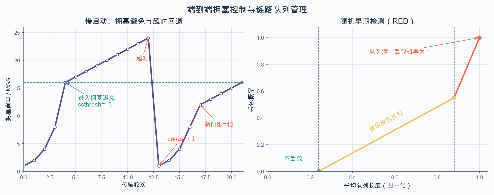

左图把课件中的窗口过程连起来：慢启动到门限后改为线性增长，超时后$cwnd$回到$1$，门限更新为原窗口的一半。右图对应随机早期检测（RED）：平均队列较短时不丢包，随后逐步提高提前丢包概率，队列满时概率达到$1$。

调度策略决定队首之后究竟服务哪一类流：

- FIFO最简单，但不能照顾实时业务的低时延需求。
- 严格优先级先服务高优先级队列，可以让高优先级业务近似使用专用链路，但会压缩低优先级业务的传输机会。
- 加权公平调度按预定比例使用各队列，在带宽份额、时延和公平性之间作更灵活的折中。

流量工程、端到端拥塞控制和队列管理不是互相替代的方案。前者从全网改变流量走向，中间层让发送端适应路径容量，最后一层处理链路上的瞬时竞争，三者共同决定吞吐量、丢包率和时延。
