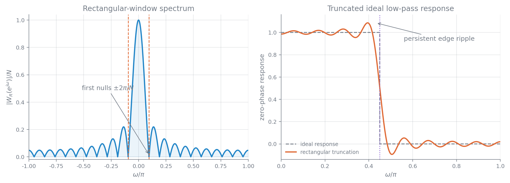
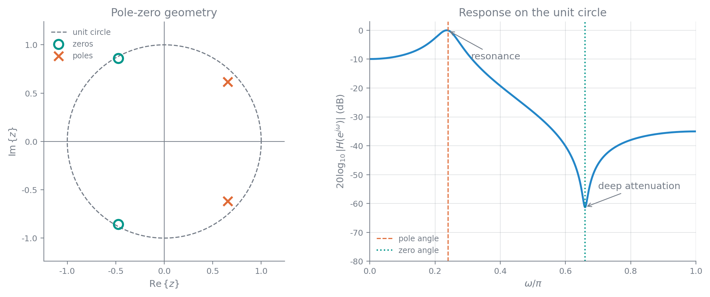

# 数字信号处理

## 从连续信号到离散序列

数字信号可能直接来自离散事件的累计，例如每小时通过路口的车辆数、逐年观测的太阳黑子数；更常见的来源是对连续信号进行采样和量化。典型处理链为模拟信号 $x_a(t)$ 经 ADC 变成数字序列 $x_q[n]$，由数字处理器处理，再经 DAC 恢复为连续信号。

### 采样、量化与时间尺度

周期采样在 $t_n=nT_s$ 处读取连续信号：

$$
x[n]=x_a(nT_s),\qquad f_s=\frac{1}{T_s},\qquad \Omega_s=2\pi f_s
$$

严格来说，采样结果是数对序列 $\{(t_n,x_a(t_n))\}$。写成标量序列 $x[n]$ 时省略了 $T_s$，相当于把时间尺度归一化。序列本身只是一串数；把离散频率、时延等量还原到实际物理量时，必须重新带上采样间隔。两个频率相差很大的连续信号，在不同 $T_s$ 下可能得到完全相同的序列。

例如

$$
x_{c1}(t)=\sin(10\pi t)+2\cos(20\pi t),\qquad T_1=\frac1{100}
$$

与

$$
x_{c2}(t)=\sin(5000\pi t)+2\cos(10000\pi t),\qquad T_2=\frac1{50000}
$$

都会产生

$$
x[n]=\sin(0.1\pi n)+2\cos(0.2\pi n)
$$

这说明脱离 $T_s$ 后，序列不能唯一说明原连续信号的物理频率。实际 ADC 可用并行比较器构成 flash 结构，在一个转换周期内同时判断样本落入的量化区间。

连续角频率 $\Omega$、连续频率 $f$ 与离散角频率 $\omega$ 的对应关系为

$$
\omega=\Omega T_s=2\pi\frac{f}{f_s},\qquad \Omega=\frac{\omega}{T_s}
$$

离散复指数关于频率以 $2\pi$ 为周期：

$$
e^{j(\omega+2\pi k)n}=e^{j\omega n},\qquad k\in\mathbb Z
$$

因此常取 $\omega\in[-\pi,\pi)$ 或 $[0,2\pi)$ 为主值区间，$|\omega|=\pi$ 对应可分辨的最高振荡频率。

混叠也可直接从样本看到。例如 $s_a(t)=\sin(0.9\pi t)$ 以 $T_s=2.4\,\mathrm{s}$ 采样后，

$$
s[n]=\sin(2.16\pi n)=\sin(0.16\pi n)
$$

样本看起来只含较低的离散频率。经过这些样点的连续曲线不止一条，单凭序列无法判断原来是哪一个连续频率。

量化把样本幅值映射到有限离散集合，常用截尾或舍入。它必然丢失信息，通常写成

$$
x_q[n]=x[n]+e[n]
$$

其中 $e[n]$ 为量化误差。量化后的有限电平还要编码为二进制字，才成为处理器中的数字数据。采样在满足带限条件时可以无损，量化则一般只能用随机过程模型分析。电话语音常用每秒 8000 个样本，这一数值对应约 $4\,\mathrm{kHz}$ 的语音带宽。

### 理想冲激采样与频谱复制

这里反复用到的连续时间傅里叶变换关系包括

$$
x(t)\delta(t-t_0)=x(t_0)\delta(t-t_0),\qquad x(t)*\delta(t-t_0)=x(t-t_0)
$$

$$
e^{j\Omega_0t}\quad\xleftrightarrow{\mathrm{FT}}\quad2\pi\delta(\Omega-\Omega_0)
$$

以及时域相乘对应频域卷积：

$$
x(t)y(t)\quad\xleftrightarrow{\mathrm{FT}}\quad\frac{1}{2\pi}X(j\Omega)*Y(j\Omega)
$$

若 $x_p(t)$ 以 $T_0$ 为周期，傅里叶级数系数与线谱为

$$
a_k=\frac{1}{T_0}\int_{T_0}x_p(t)e^{-jk\Omega_0t}\,\mathrm dt,qquad
X_p(j\Omega)=2\pi\sum_{k=-\infty}^{\infty}a_k\delta(\Omega-k\Omega_0)
$$

理想采样可分为“连续信号乘冲激串”和“加权冲激串转为序列”两步。周期单位冲激串及其傅里叶变换为

$$
s(t)=\sum_{n=-\infty}^{\infty}\delta(t-nT_s)
\quad\xleftrightarrow{\mathrm{FT}}\quad
S(j\Omega)=\frac{2\pi}{T_s}\sum_{k=-\infty}^{\infty}\delta(\Omega-k\Omega_s)
$$

其中用到了冲激筛选、冲激卷积、复指数的傅里叶变换和时域相乘对应频域卷积。加权冲激串

$$
x_s(t)=x_a(t)s(t)=\sum_{n=-\infty}^{\infty}x_a(nT_s)\delta(t-nT_s)
$$

的频谱为

$$
X_s(j\Omega)=\frac{1}{T_s}\sum_{k=-\infty}^{\infty}X_a\!\left[j(\Omega-k\Omega_s)\right]
$$

而离散序列的 DTFT 与加权冲激串的频谱满足

$$
X(e^{j\omega})=X_s(j\Omega)\bigg|_{\Omega=\omega/T_s}
=\frac{1}{T_s}\sum_{k=-\infty}^{\infty}X_a\!\left[j\left(\frac{\omega}{T_s}-k\Omega_s\right)\right]
$$

采样的本质是把连续频谱以 $\Omega_s$ 为周期复制，再把频率轴按 $T_s$ 归一化，并把幅度乘以 $1/T_s$。副本重叠就是混叠；一旦发生，通常不能由样本唯一确定原信号。

### Nyquist 采样定理与重构

若连续信号带限于 $\Omega_H$，即

$$
X_a(j\Omega)=0,\qquad |\Omega|>\Omega_H
$$

则当

$$
\Omega_s=\frac{2\pi}{T_s}\ge 2\Omega_H
$$

时，$x_a(t)$ 可由 $x[n]=x_a(nT_s)$ 唯一确定。等号只有在频谱边界不会因复制而产生歧义时才能取；实际工程还要为抗混叠滤波器和采样时钟的不理想性留余量，课件给出的经验是常取 $f_s>2.5f_H$。

定理有两种直接用法：已知 $f_H$ 时确定最低采样率；已知 $f_s$ 时，在 ADC 前用抗混叠滤波器把输入限制在 $f_s/2$ 以内。例如语音主要集中在 $4\ \mathrm{kHz}$ 以下时，采样率取到 $10\ \mathrm{kHz}$ 以上即可留出余量。

理想重构先把序列变成加权冲激串，再通过理想低通滤波器。若重构通带取 $|\Omega|\le\Omega_H$，则

$$
H_r(j\Omega)=
\begin{cases}
T_s,&|\Omega|\le\Omega_H\\
0,&|\Omega|>\Omega_H
\end{cases}
$$

其冲激响应与重构公式为

$$
h_r(t)=\frac{T_s\Omega_H}{\pi}\operatorname{Sa}(\Omega_H t)
$$

这里 $\operatorname{Sa}(x)=\sin x/x$，并约定 $\operatorname{Sa}(0)=1$。

$$
x_a(t)=\frac{T_s\Omega_H}{\pi}\sum_{n=-\infty}^{\infty}x[n]\operatorname{Sa}\!\left[\Omega_H(t-nT_s)\right]
$$

在临界采样 $\Omega_H=\pi/T_s$ 时就是 sinc 插值。理想插值不可直接实现；零阶保持使用矩形插值核，一阶保持使用三角形插值核，更高阶插值继续在失真与实现复杂度之间折中。保持电路造成的频率响应下垂可用低通补偿，其通带形状取插值核傅里叶变换的倒数。精度要求还应与链路其他环节的误差一并衡量。

### 带通采样

带通信号只在 $[\Omega_L,\Omega_H]$ 及其负频带非零，带宽 $B=f_H-f_L$，中心频率 $f_c=(f_H+f_L)/2$。利用频谱空隙可以把采样率降到 $2f_H$ 以下。令第 $m$、$m+1$ 个复制频谱恰好不重叠，需满足

$$
f_L\ge mf_s-f_L,\qquad f_H\le(m+1)f_s-f_H
$$

当 $m=0$ 时是普通低通采样范围 $f_s\geq2f_H$。对

$$
m=1,2,\ldots,\left\lfloor\frac{f_L}{B}\right\rfloor
$$

无混叠采样率范围为

$$
\frac{2f_H}{m+1}\leq f_s\leq\frac{2f_L}{m}
$$

课件中的 $f_c=20\ \mathrm{MHz}$、$B=5\ \mathrm{MHz}$ 例子有 $f_L=17.5\ \mathrm{MHz}$、$f_H=22.5\ \mathrm{MHz}$，可用区间依次为 $[45,\infty)$、$[22.5,35]$、$[15,17.5]$ 和 $[11.25,11.66]\ \mathrm{MHz}$。最低范围明显小于普通 Nyquist 采样率。

以

$$
R\triangleq\frac{f_c}{B}+\frac12=\frac{f_H}{B}
$$

和归一化采样率 $f_s/B$ 作图时，工程上取严格边界

$$
\frac{2R}{m+1}<\frac{f_s}{B}<\frac{2(R-1)}m
$$

可选区域是一系列楔形尖角。实际频点不能贴着边界选择：模拟抗混叠滤波器的截止误差、保护频带以及采样时钟容差都会压缩可用区间。课件的窄带例取 $B=25\ \mathrm{kHz}$、$f_L=10702.5\ \mathrm{kHz}$，理论最低值为 $50.0117\ \mathrm{kHz}$；两侧各留 $2.5\ \mathrm{kHz}$ 保护带后，有效带宽增至 $30\ \mathrm{kHz}$，可接受范围缩为

$$
60.1120\ \mathrm{kHz}\leq f_s\leq60.1124\ \mathrm{kHz}
$$

若掌握更强先验信息，还可继续采用压缩感知等低于传统采样界的方案。

### 连续系统与离散系统的等效关系

考虑连续输入经过理想 A/D、离散系统 $H(e^{j\omega})$ 和理想 D/A 的链路。输入严格满足采样定理时，等效连续系统为

$$
H_{\mathrm{eff}}(j\Omega)=
\begin{cases}
H(e^{j\Omega T_s}),&|\Omega|<\pi/T_s\\
0,&\text{其他}
\end{cases}
$$

反过来，若希望实现带限模拟响应 $H_a(j\Omega)$，离散系统在主值区间应取

$$
H(e^{j\omega})=H_a\!\left(j\frac{\omega}{T_s}\right),\qquad |\omega|<\pi
$$

将它延拓到整个频率轴可写为

$$
H(e^{j\omega})=\sum_{k=-\infty}^{\infty}H_a\!\left[j\left(\frac{\omega}{T_s}-\frac{2\pi k}{T_s}\right)\right]
$$

对应的单位冲激响应满足冲激响应不变关系

$$
h[n]=T_s h_a(nT_s)
$$

## 离散信号与系统的表示

### 表示方式与基本序列

信号有三类常用表示：时域表示刻画随时间的变化，可用图形、表达式或数据给出；变换域表示把信号分解为基本元素，通常与时域一一对应；均值、相关函数、功率谱等特征量便于概括性质，但一般不能反推全部样本。时频联合表示适合描述频率随时间变化的信号。离散信号只在整数序号上定义，非整数序号没有默认含义。

常用基本序列为

$$
\delta[n]=
\begin{cases}
1,&n=0\\
0,&n\ne0
\end{cases},\qquad
u[n]=
\begin{cases}
1,&n\ge0\\
0,&n<0
\end{cases}
$$

$$
u[n]=\sum_{k=-\infty}^{n}\delta[k],\qquad
\delta[n]=u[n]-u[n-1]
$$

长度为 $N$、支撑在 $0\le n\le N-1$ 的矩形窗记为

$$
R_N[n]=u[n]-u[n-N]=\sum_{k=0}^{N-1}\delta[n-k]
$$

实正弦和复指数序列分别为 $A\cos(\omega_0n+\phi)$ 与 $Az^n$；当 $z=e^{j\omega_0}$ 时为简谐序列。

### 能量、功率、周期与对称性

离散信号的能量和平均功率定义为

$$
E_x=\sum_{n=-\infty}^{\infty}|x[n]|^2
$$

$$
P_x=\lim_{N\to\infty}\frac{1}{2N+1}\sum_{n=-N}^{N}|x[n]|^2
$$

$0\leq E_x<\infty$ 时为能量信号，此时 $P_x=0$；除去恒为零的序列，通常把条件写成 $0<E_x<\infty$。$E_x=\infty$ 且 $0<P_x<\infty$ 时为功率信号。单位阶跃和单位模复指数属于功率信号，单位斜坡既不是有限能量信号也不是有限功率信号。

周期序列满足

$$
x[n+N]=x[n],\qquad N\in\mathbb Z_+
$$

对 $e^{j\omega_0n}$，存在周期的充要条件是 $\omega_0/(2\pi)$ 为有理数；若写成最简分数 $\omega_0/(2\pi)=p/q$，基本周期为 $q$。连续周期信号采样后不一定成为周期序列，只有连续周期与 $T_s$ 的比值为有理数时才有离散周期。周期为 $N$ 的序列最多包含 $N$ 个可分辨频率 $\omega_k=2\pi k/N$。

例如 $\cos(10\pi n/60)$ 的基本周期为 12，$\cos(11\pi n/60)$ 的基本周期为 120；$\cos(n/2)$ 要求 $N=4\pi k$ 为整数，无法满足，所以不是周期序列。

因果序列满足 $x[n]=0$（$n<0$）。绝对可和 $\sum_n|x[n]|<\infty$ 是后续 DTFT 一致收敛的重要条件。

通常意义的收敛到 $a$ 指：对任意 $\varepsilon>0$，都存在 $N$，使 $n>N$ 时 $|x[n]-a|<\varepsilon$。

共轭对称、共轭反对称分量为

$$
x_e[n]=\frac{x[n]+x^*[-n]}{2},\qquad
x_o[n]=\frac{x[n]-x^*[-n]}{2}
$$

且 $x[n]=x_e[n]+x_o[n]$。对实序列，它们退化为偶、奇分量。实因果序列可由偶分量恢复：

$$
x[n]=2x_e[n]u[n]-x_e[0]\delta[n]
$$

若只给奇分量，还缺少 $x[0]$，恢复式为

$$
x[n]=2x_o[n]u[n]+x[0]\delta[n]
$$

### 离散系统及其性质

离散系统是把输入序列映射为输出序列的算子 $\mathcal T\{\cdot\}$。同一输入输出关系可有不同框图实现。例如长度为 $N$ 的滑动平均

$$
y[n]=\frac{1}{N}\sum_{m=0}^{N-1}x[n-m]
$$

也可递推为

$$
y[n]-y[n-1]=\frac{x[n]-x[n-N]}{N}
$$

最基本的系统包括恒等系统 $y[n]=x[n]$、延时系统 $y[n]=x[n-n_0]$ 和一阶差分系统 $y[n]=x[n]-x[n-1]$。

系统的基本性质包括：

- 线性：$\mathcal T\{a x_1+b x_2\}=a\mathcal T\{x_1\}+b\mathcal T\{x_2\}$。
- 时不变：若 $y[n]=\mathcal T\{x[n]\}$，则 $\mathcal T\{x[n-n_0]\}=y[n-n_0]$。
- 因果：$y[n_0]$ 只依赖 $n\le n_0$ 的输入。有限预知的非因果系统可整体延时后实现。
- BIBO 稳定：任意有界输入产生有界输出。累加器对单位阶跃产生斜坡，因而不稳定。
- 无记忆：$y[n]$ 只依赖同一时刻的 $x[n]$。

性质必须逐项判断。$y[n]=nx[n]$ 和 $y[n]=x[n^2]$ 都是线性的，但前者时变，后者一般非因果；$y[n]=x^2[n]$ 是非线性的，仿射关系 $y[n]=Ax[n]+B$ 只有在 $B=0$ 时才线性。$y[n]=e^{x[n]}$ 是时不变的非线性无记忆系统，$y[n]=e^nx[n]$ 则时变。离散下标恒为整数，所以 $x[\lfloor n\rfloor]=x[n]$ 是因果恒等系统；$y[n]=x[n]-x[n^2-n]$ 会在某些 $n$ 依赖未来输入，因而非因果。

LTI 系统兼具线性与时不变性，复杂输入可按基本序列分解。真实系统常可精确建模为 LTI；非线性系统可在工作点附近线性化，时变系统也常在有限观察窗内近似为时不变。

### 正交展开、单位抽样响应与卷积

内积空间中的正交由内积为零定义。常见内积为

$$
\langle\mathbf x,\mathbf y\rangle=\sum_i x_i y_i^*,\qquad
\langle x,y\rangle_{L_2}=\int_a^b x(t)y^*(t)\,\mathrm dt,
\qquad
\langle x,y\rangle_{\ell_2}=\sum_{n=-\infty}^{\infty}x[n]y^*[n]
$$

内积满足加法性、共轭对称性、齐次性和正定性，并诱导范数、距离与夹角。完备正交基不仅彼此正交，而且能线性表示空间中的任意元素。

若 $x=\sum_kc_k\phi_k$ 且 $\{\phi_k\}$ 为完备正交基，则

$$
c_k=\frac{\langle x,\phi_k\rangle}{\langle\phi_k,\phi_k\rangle}
$$

移位单位抽样 $\{\delta[n-k]\}$ 构成离散序列空间的一组完备正交基：

$$
x[n]=\sum_{k=-\infty}^{\infty}x[k]\delta[n-k]
$$

若 $h[n]=\mathcal T\{\delta[n]\}$，LTI 性质给出

$$
y[n]=\sum_{k=-\infty}^{\infty}x[k]h[n-k]
=x[n]*h[n]
$$

卷积满足交换律、结合律和分配律。$h[n]$ 有限长时为 FIR 系统，卷积是有限项求和；$h[n]$ 无限长时为 IIR 系统，通常用差分方程递推实现。LTI 系统因果的充要条件为 $h[n]=0$（$n<0$），BIBO 稳定的充要条件为

$$
\sum_{n=-\infty}^{\infty}|h[n]|<\infty
$$

充分性来自 $|y[n]|\le\|x\|_\infty\sum_m|h[m]|$；必要性可取 $x[n]=h^*[-n]/|h[-n]|$（分母非零时），使各项相位共轭配准，从而令 $y[0]=\sum_m|h[m]|$。

### 特征函数、差分方程与状态空间

若 $\mathcal T\{s[n]\}=\lambda s[n]$，则 $s[n]$ 是特征函数，$\lambda$ 是特征值。LTI 系统的复指数特征函数满足

$$
\mathcal T\{z^n\}=H(z)z^n,
\qquad
H(z)=\sum_{m=-\infty}^{\infty}h[m]z^{-m}
$$

单位圆上的 $z=e^{j\omega}$ 给出简谐特征函数和频率响应 $H(e^{j\omega})$。若输入由特征函数线性组合而成，输出仍是同一组特征函数，只改变各分量系数。

大量离散 LTI 系统可写为线性常系数差分方程（LCCDE）：

$$
\sum_{k=0}^{N}a_k y[n-k]=\sum_{m=0}^{M}b_m x[n-m]
$$

初始状态必须明确。相同方程若有非零初始状态，整体输入输出映射未必线性或时不变；初始松弛时才对应因果 LTI 系统。累加器满足 $y[n]-y[n-1]=x[n]$。

若 $H(z)$ 为有限阶有理式，差分方程可直接由分母、分子系数读出：

$$
H(z)=\frac{Y(z)}{X(z)}
=\frac{\sum_{m=0}^{M}b_mz^{-m}}{\sum_{k=0}^{N}a_kz^{-k}}
$$

状态空间表示取延迟单元输出为状态：

$$
\boldsymbol\lambda[n+1]=\mathbf A\boldsymbol\lambda[n]+\mathbf Bx[n],
\qquad
y[n]=\mathbf C\boldsymbol\lambda[n]+\mathbf Dx[n]
$$

一般地，$\boldsymbol\lambda[n]\in\mathbb C^q$，若输入、输出维数分别为 $r,m$，则 $\mathbf A\in\mathbb C^{q\times q}$、$\mathbf B\in\mathbb C^{q\times r}$、$\mathbf C\in\mathbb C^{m\times q}$、$\mathbf D\in\mathbb C^{m\times r}$；SISO 情形为 $m=r=1$。$\mathbf A$ 为状态矩阵，$\mathbf B$、$\mathbf C$、$\mathbf D$ 分别为输入、输出和直接传输矩阵。

差分方程还可用中间序列写成一般形式

$$
W(z)=\frac{X(z)}{A(z)}=\frac{Y(z)}{B(z)}
$$

$$
x[n]=\sum_{k=0}^{N}a_kw[n-k],\qquad y[n]=\sum_{m=0}^{M}b_mw[n-m]
$$

对二阶系统

$$
y[n]+a_1y[n-1]+a_2y[n-2]=b_0x[n]+b_1x[n-1]+b_2x[n-2]
$$

定义中间变量 $w[n]$ 使

$$
x[n]=w[n]+a_1w[n-1]+a_2w[n-2],
\qquad
y[n]=b_0w[n]+b_1w[n-1]+b_2w[n-2]
$$

取 $\boldsymbol\lambda[n]=[w[n-1],w[n-2]]^\mathsf T$，可得

$$
\mathbf A=\begin{bmatrix}-a_1&-a_2\\1&0\end{bmatrix},\quad
\mathbf B=\begin{bmatrix}1\\0\end{bmatrix},\quad
\mathbf C=\begin{bmatrix}b_1-b_0a_1&b_2-b_0a_2\end{bmatrix},\quad
\mathbf D=b_0
$$

## 离散时间傅里叶变换

### 三种视角与变换对

DTFT 可以同时看作函数的正交展开、频率合成与分解，以及连续频谱在采样后的周期复制。变换对为

$$
X(e^{j\omega})=\sum_{n=-\infty}^{\infty}x[n]e^{-j\omega n}
$$

$$
x[n]=\frac{1}{2\pi}\int_{-\pi}^{\pi}X(e^{j\omega})e^{j\omega n}\,\mathrm d\omega
$$

在 $L_2[0,2\pi)$ 中，$e^{-j\omega n}$ 是关于 $\omega$ 的可数完备正交基，$x[n]$ 是 $X(e^{j\omega})$ 的展开系数；在 $\ell_2$ 的广义意义下，$e^{j\omega n}$ 又是关于 $n$ 的连续频率基，$X(e^{j\omega})$ 是 $x[n]$ 在该基上的系数。核心恒等式为

$$
\sum_{n=-\infty}^{\infty}e^{j(\omega-\omega_0)n}
=2\pi\sum_{k=-\infty}^{\infty}\delta(\omega-\omega_0+2\pi k)
$$

它可由傅里叶级数、Poisson 求和公式或单位周期冲激串的傅里叶变换得到。

从物理上看，$X(e^{j\omega_0})$ 表示频率分量 $e^{j\omega_0n}$ 在序列中的复权重。LTI 系统只改变已有频率分量的幅度和相位：

$$
Y(e^{j\omega})=H(e^{j\omega})X(e^{j\omega})
$$

若 $x[n]$ 来自连续信号采样，DTFT 就是连续频谱经周期复制、尺度变换后的结果。全 $1$ 序列的 DTFT 也可据此理解为 $2\pi$ 周期冲激串。

### 收敛性与典型变换

绝对可和

$$
\sum_{n=-\infty}^{\infty}|x[n]|<\infty
$$

是 DTFT 有限且一致收敛的充分条件。因此稳定 LTI 系统具有有限连续的频率响应，FIR 系统必稳定且频率响应连续。平方可和但不绝对可和时，令

$$
X_M(e^{j\omega})=\sum_{n=-M}^{M}x[n]e^{-j\omega n}
$$

则 DTFT 可按均方意义收敛：

$$
\lim_{M\to\infty}\int_{-\pi}^{\pi}\left|X(e^{j\omega})-X_M(e^{j\omega})\right|^2\,\mathrm d\omega=0
$$

截断误差能量趋于零不意味着每一点的绝对误差都趋于零。

理想低通频率响应

$$
X(e^{j\omega})=
\begin{cases}
1,&|\omega|\le\omega_c\\
0,&\omega_c<|\omega|\le\pi
\end{cases}
$$

对应

$$
x[n]=
\begin{cases}
\dfrac{\omega_c}{\pi},&n=0\\[4pt]
\dfrac{\sin(\omega_cn)}{\pi n},&n\ne0
\end{cases}
$$

该序列无限长、非因果、平方可和但不绝对可和。有限截断在跳变附近产生 Gibbs 现象；阶数增大时振荡区域收窄，但峰值误差仍约为跳变量的 $9\%$。

右边指数序列与矩形窗的常用变换为

$$
a^nu[n]\quad\xleftrightarrow{\mathrm{DTFT}}\quad\frac{1}{1-ae^{-j\omega}},\qquad |a|<1
$$

其幅度为

$$
\left|X(e^{j\omega})\right|=\frac{1}{\sqrt{1-2a\cos\omega+a^2}}
$$

例如 $a=0.5$ 时峰值在 $\omega=0$，$a=-0.5$ 时峰值移到 $\omega=\pm\pi$。

$$
R_N[n]\quad\xleftrightarrow{\mathrm{DTFT}}\quad
e^{-j\omega(N-1)/2}\frac{\sin(N\omega/2)}{\sin(\omega/2)}
$$

矩形窗频谱的第一对零点位于 $\omega=\pm2\pi/N$，主瓣零点间宽度为 $4\pi/N$；归一化后它也是 $N$ 点滑动平均滤波器的频率响应。

滑动平均不仅用于降噪，金融时间序列中也常用 50 日和 200 日均线概括短、长期趋势；它们的频率响应正是不同长度的归一化矩形窗。

### DTFT 的性质

设 $x[n]\leftrightarrow X(e^{j\omega})$、$y[n]\leftrightarrow Y(e^{j\omega})$，则：

| 时域操作 | 频域结果 |
|---|---|
| $ax[n]+by[n]$ | $aX(e^{j\omega})+bY(e^{j\omega})$ |
| $x[n-n_0]$ | $e^{-j\omega n_0}X(e^{j\omega})$ |
| $x[-n]$ | $X(e^{-j\omega})$ |
| $e^{j\omega_0n}x[n]$ | $X(e^{j(\omega-\omega_0)})$ |
| $x[n]\cos(\omega_0n)$ | $\frac12[X(e^{j(\omega-\omega_0)})+X(e^{j(\omega+\omega_0)})]$ |
| $nx[n]$ | $j\dfrac{\mathrm dX(e^{j\omega})}{\mathrm d\omega}$ |
| $x[n]*y[n]$ | $X(e^{j\omega})Y(e^{j\omega})$ |
| $x[n]y[n]$ | $\dfrac{1}{2\pi}\int_{-\pi}^{\pi}X(e^{j\theta})Y(e^{j(\omega-\theta)})\,\mathrm d\theta$ |

频域卷积是 $2\pi$ 周期卷积，积分区间可取任意长度为 $2\pi$ 的区间。相关序列

$$
r_{xy}[m]=\sum_n x[n+m]y^*[n]
$$

满足

$$
r_{xy}[m]\quad\xleftrightarrow{\mathrm{DTFT}}\quad X(e^{j\omega})Y^*(e^{j\omega})
$$

自相关对应功率谱密度，即 Wiener-Khinchin 关系。Parseval 等式为

$$
\sum_{n=-\infty}^{\infty}x[n]y^*[n]
=\frac{1}{2\pi}\int_{-\pi}^{\pi}X(e^{j\omega})Y^*(e^{j\omega})\,\mathrm d\omega
$$

特别地，两边分别给出信号能量的时域与频域表示。

抽取的频谱关系也可由 DTFT 直接得到。取 $y[n]=x[2n]$，把偶数样本筛出后有

$$
Y(e^{j\omega})=\frac12\left[X(e^{j\omega/2})+X\left(e^{j(\omega/2+\pi)}\right)\right]
$$

右端两份压缩频谱相加，已经显出抽取混叠的来源。

### 对称性与周期序列

一般复序列可按实部、虚部和共轭对称、共轭反对称分量拆分。主要对应关系为：

- 实序列的 DTFT 共轭对称，$X(e^{-j\omega})=X^*(e^{j\omega})$；幅度为偶函数，连续相位为奇函数。
- 纯虚序列的 DTFT 共轭反对称。
- 实偶序列具有实偶频谱；实奇序列具有纯虚奇频谱。
- 时域实偶、实奇、虚偶、虚奇四个分量分别映射为频域实偶、纯虚奇、纯虚偶、实奇分量。

几个特殊周期序列的 DTFT 为

$$
1\quad\xleftrightarrow{\mathrm{DTFT}}\quad2\pi\sum_{k=-\infty}^{\infty}\delta(\omega-2\pi k)
$$

$$
e^{j\omega_0n}\quad\xleftrightarrow{\mathrm{DTFT}}\quad
2\pi\sum_{k=-\infty}^{\infty}\delta(\omega-\omega_0-2\pi k)
$$

$$
\cos(\omega_0n+\phi)\quad\xleftrightarrow{\mathrm{DTFT}}\quad\pi\sum_{k=-\infty}^{\infty}\left[e^{j\phi}\delta(\omega-\omega_0-2\pi k)+e^{-j\phi}\delta(\omega+\omega_0-2\pi k)\right]
$$

$$
p_N[n]=\sum_{r=-\infty}^{\infty}\delta[n-rN]
\quad\xleftrightarrow{\mathrm{DTFT}}\quad
\frac{2\pi}{N}\sum_{k=-\infty}^{\infty}\delta\!\left(\omega-\frac{2\pi k}{N}\right)
$$

若 $\widetilde x[n]$ 是长度 $N$ 的一周期主值，周期延拓可写为

$$
x[n]=\widetilde x[n]*p_N[n]
=\sum_{r=-\infty}^{\infty}\widetilde x[n-rN]
$$

于是周期离散信号的 DTFT 是线谱：

$$
X(e^{j\omega})=\frac{2\pi}{N}\sum_{k=-\infty}^{\infty}
\widetilde X[k]\delta\!\left(\omega-\frac{2\pi k}{N}\right)
$$

其中 $\widetilde X[k]=\sum_{n=0}^{N-1}\widetilde x[n]e^{-j2\pi kn/N}$。时域离散导致频域周期，时域周期导致频域离散；与冲激串卷积产生周期延拓，与冲激串相乘产生采样。连续非周期信号具有非周期连续谱，离散非周期信号具有周期连续谱，离散周期信号则具有离散且周期的频谱。

## 离散傅里叶变换

### 从 DTFT 采样到 DFT

实际序列往往只得到有限记录，DTFT 未必有便于计算的解析式，而连续频率函数也不能逐点存储。DFT 用有限个频率样本表示有限个时域样本，因而能直接交给数字计算机处理。

对 DTFT 在一周期内等间隔采样，采样点为 $\omega_k=2\pi k/N$：

$$
X[k]=X(e^{j\omega})\big|_{\omega=2\pi k/N}=\sum_{n=-\infty}^{\infty}x[n]e^{-j2\pi kn/N}
$$

频域采样会在时域产生周期延拓。令

$$
\widehat x[n]=\sum_{r=-\infty}^{\infty}x[n-rN]
$$

若把周期序列写成 $\widehat x[n]=\sum_{k=0}^{N-1}a_ke^{j2\pi kn/N}$，则 $a_k=X[k]/N$；$X[k]$ 是采用 DFT 归一化约定的频域序列。若原序列只在某个连续的 $N$ 点区间内非零，周期延拓之间不重叠，可由 $N$ 个频域样本无失真恢复这段序列；否则不同周期相加，产生时域混叠。这里的条件与连续时间采样定理互为对偶：连续时间采样要求频域无混叠，频域采样要求时域无混叠。

从线性方程看，$N$ 个频域样本只能给出 $N$ 条独立约束。若待恢复记录有 $L\leq N$ 个未知样本，可把它视为在 $N$ 维傅里叶基上的投影并补零求逆；若 $L>N$，方程欠定，能确定的只是相隔 $N$ 点样本的周期和，这正是时域混叠。

把一个周期的主值记为 $x[0],\ldots,x[N-1]$，定义

$$
W_N=e^{-j2\pi/N}
$$

则 $N$ 点 DFT 与 IDFT 为

$$
X[k]=\sum_{n=0}^{N-1}x[n]W_N^{nk},\qquad 0\leq k\leq N-1
$$

$$
x[n]=\frac{1}{N}\sum_{k=0}^{N-1}X[k]W_N^{-nk},\qquad 0\leq n\leq N-1
$$

$x[n]$ 和 $X[k]$ 在运算中都按 $N$ 周期理解。因而 DFT 同时有三种含义：有限长序列 DTFT 的等间隔采样、周期序列的离散傅里叶级数，以及 $N$ 维复向量在一组正交复指数基上的坐标变换。

变换矩阵写成

$$
\boldsymbol X=\boldsymbol W_N\boldsymbol x,\qquad [\boldsymbol W_N]_{k,n}=W_N^{kn}
$$

其列向量彼此正交，满足

$$
\boldsymbol W_N^{H}\boldsymbol W_N=N\boldsymbol I,\qquad \boldsymbol W_N^{-1}=\frac{1}{N}\boldsymbol W_N^{H}
$$

这也说明 IDFT 只是在 DFT 矩阵上取共轭并乘 $1/N$。

### 频域样本之间的插值

若 $x[n]$ 在 $0\leq n<N$ 之外为零，完整 DTFT 可由 DFT 样本恢复：

$$
X(e^{j\omega})=\sum_{k=0}^{N-1}X[k]\,\Phi_N\!\left(\omega-\frac{2\pi k}{N}\right)
$$

其中

$$
\Phi_N(\theta)=\frac{1}{N}e^{-j(N-1)\theta/2}\frac{\sin(N\theta/2)}{\sin(\theta/2)}
$$

$\Phi_N$ 是周期的 Dirichlet 插值核，在本采样点取 1，在其余 DFT 采样点取 0。零填充并没有增加原序列所含的信息；它只是更密地采样同一条 DTFT，相当于在已有 DFT 样本之间作精确的带限周期插值。

例如长度 $L=10$ 的全 1 序列在 $N=10$ 时只有直流 DFT 样本非零；补零到 $N=50$ 或 100 后，会在同一个 Dirichlet 幅度包络上取得越来越密的样本。包络、主瓣宽度和原有信息都没有改变。

常用的基本变换对包括

$$
\delta[((n-n_0))_N]\quad\xleftrightarrow{\mathrm{DFT}}\quad W_N^{kn_0}
$$

$$
1\quad\xleftrightarrow{\mathrm{DFT}}\quad N\delta[((k))_N]
$$

$$
W_N^{-k_0n}\quad\xleftrightarrow{\mathrm{DFT}}\quad N\delta[((k-k_0))_N]
$$

其中 $((n))_N$ 表示以 $N$ 为模的下标。

### 循环移位、卷积与相关

设 $x[n]\xleftrightarrow{N}X[k]$、$y[n]\xleftrightarrow{N}Y[k]$，主要性质为：

| 时域操作 | 频域结果 |
|---|---|
| $ax[n]+by[n]$ | $aX[k]+bY[k]$ |
| $x[((n-m))_N]$ | $W_N^{km}X[k]$ |
| $W_N^{-ln}x[n]$ | $X[((k-l))_N]$ |
| $x[((-n))_N]$ | $X[((-k))_N]$ |
| $x^*[n]$ | $X^*[((-k))_N]$ |
| $x[n]\circledast_N y[n]$ | $X[k]Y[k]$ |
| $x[n]y[n]$ | $\frac1N X[k]\circledast_NY[k]$ |

表中的移位都是循环移位。若需要有限记录的普通移位，可先补足零样本，使移出的非零部分不会绕回，再在扩展长度上作循环移位。

长度 $N$ 的循环卷积定义为

$$
(x\circledast_Ny)[n]=\sum_{m=0}^{N-1}x[m]y[((n-m))_N]
$$

它等于线性卷积的 $N$ 周期混叠：

$$
x\circledast_Ny=\sum_{r=-\infty}^{\infty}(x*y)[n-rN]
$$

若 $x[n]$、$y[n]$ 的有限长度分别为 $L$、$P$，先补零到

$$
N\geq L+P-1
$$

则周期之间不再重叠，$N$ 点循环卷积与线性卷积完全相同。这是用 DFT 实现线性卷积时必须补零的原因。

循环互相关定义为

$$
r_{xy}^{(N)}[m]=\sum_{n=0}^{N-1}x[((n+m))_N]y^*[n]
$$

并满足

$$
r_{xy}^{(N)}[m]\quad\xleftrightarrow{N}\quad X[k]Y^*[k]
$$

要得到有限长序列的线性相关，同样需要补足避免循环折叠。DFT 的 Parseval 等式为

$$
\sum_{n=0}^{N-1}x[n]y^*[n]=\frac1N\sum_{k=0}^{N-1}X[k]Y^*[k]
$$

取 $x=y$ 时，两端分别是时域能量和缩放后的频域能量。

DFT 还具有对偶性：

$$
x[n]\xleftrightarrow{N}X[k]\quad\Longrightarrow\quad X[n]\xleftrightarrow{N}N x[((-k))_N]
$$

实序列的 DFT 共轭对称，即 $X[N-k]=X^*[k]$。当 $N$ 为偶数时，$X[0]$ 与 $X[N/2]$ 必为实数，只需保存或计算略多于半个频谱。实偶、实奇、虚偶、虚奇分量仍分别对应实偶、纯虚奇、纯虚偶、实奇的频谱分量。

一般复序列也可按模 $N$ 的共轭对称性拆成

$$
x_e[n]=\frac12\left\{x[n]+x^*[((-n))_N]\right\},\qquad
x_o[n]=\frac12\left\{x[n]-x^*[((-n))_N]\right\}
$$

其中 $x_e$ 的 DFT 为 $\operatorname{Re}\{X[k]\}$，$x_o$ 的 DFT 为 $j\operatorname{Im}\{X[k]\}$。

离散时域和离散频域之间的对偶关系可概括为：一侧采样会使另一侧周期化，一侧周期化会使另一侧采样；一侧相乘会在另一侧形成循环卷积，一侧循环移位会在另一侧附加线性相位。

## DFT 的快速计算

### 旋转因子与基 2 分解

直接计算 $N$ 点 DFT 约需 $N^2$ 次复乘和 $N(N-1)$ 次复加。FFT 并不是另一种变换，而是利用旋转因子的周期性和对称性减少重复计算：

若一律把复乘拆成四次实乘、两次实加，直接法共约需 $4N^2$ 次实乘和 $4N^2-2N$ 次实加；$N=1024$ 时实乘已超过 400 万次。DFT 系数也可写为向量内积 $X[k]=\langle x[n],W_N^{-kn}\rangle$，其幅度受 Cauchy–Schwarz 上界约束，表示输入与第 $k$ 个简谐基的相似程度。

$$
W_N^{k+N}=W_N^k,\qquad W_N^{k+N/2}=-W_N^k,\qquad W_N^{2k}=W_{N/2}^k
$$

几个直接可用的特值和共轭关系为

$$
W_N^0=W_N^{kN}=1,\qquad W_N^{N/2}=-1,\qquad W_N^{N/4}=-j,\qquad W_N^{3N/4}=j,qquad (W_N^k)^*=W_N^{-k}
$$

当 $N=2^m$ 时，按时间下标奇偶拆分可得基 2 时间抽取形式：

$$
X[k]=E[k]+W_N^kO[k]
$$

$$
X[k+N/2]=E[k]-W_N^kO[k],\qquad 0\leq k<N/2
$$

$E[k]$、$O[k]$ 分别是偶下标和奇下标子序列的 $N/2$ 点 DFT。不断二分直到 2 点变换，形成蝶形运算

$$
(a,b)\longmapsto(a+Wb,\ a-Wb)
$$

最末级的 2 点 DFT 就是

$$
X[0]=x[0]+x[1],\qquad X[1]=x[0]-x[1]
$$

它不需要乘法，只需两次复加减。

时间抽取的原位迭代实现通常以位倒序输入、自然顺序输出。若 $n$ 的 $m$ 位二进制表示为 $b_{m-1}\cdots b_1b_0$，位倒序下标就是 $b_0b_1\cdots b_{m-1}$。

$N=8$ 时自然序 $0,1,2,3,4,5,6,7$ 的位倒序为 $0,4,2,6,1,5,3,7$；$N=16$ 时为 $0,8,4,12,2,10,6,14,1,9,5,13,3,11,7,15$。

按频率下标奇偶拆分则得到基 2 频率抽取：

$$
X[2r]=\sum_{n=0}^{N/2-1}\bigl(x[n]+x[n+N/2]\bigr)W_{N/2}^{nr}
$$

$$
X[2r+1]=\sum_{n=0}^{N/2-1}\bigl(x[n]-x[n+N/2]\bigr)W_N^nW_{N/2}^{nr}
$$

频率抽取通常自然顺序输入、位倒序输出。时间抽取和频率抽取的信号流图互为转置，计算量相同。原位计算要求每个蝶形的两个输出能安全覆盖其两个输入，并且旧值此后不再使用；按这种数据依赖排列只需 $N$ 个存储单元，交叉依赖的等价流图则可能需要至少 $2N$，并非任意画法都可直接同址覆盖。

基 2 FFT 有 $m=\log_2N$ 层，每层 $N/2$ 个蝶形，因此复乘量约为

$$
\frac{N}{2}\log_2N
$$

复加量为

$$
N\log_2N
$$

实际实现中 $W=1,-1,\pm j$ 的乘法可化为符号和实虚部交换，运算数还会进一步减少。

例如 $N=1024$ 时，粗略复乘数由直接法的 $1{,}048{,}576$ 降到 5120，约提高 204.8 倍。

### 混合基数、基 4 与分裂基

$N$ 不必是 2 的整数次幂。若 $N=r_1r_2$，可令

$$
n=r_2n_1+n_0,\qquad k=r_1k_1+k_0
$$

先做 $r_2$ 个 $r_1$ 点 DFT，乘连接两级的 $W_N^{n_0k_0}$，再做 $r_1$ 个 $r_2$ 点 DFT并按 $k$ 整序。继续因式分解便得到混合基 FFT；相应的数据重排是混合基数的数字倒序，而不再只是二进制位倒序。以 $N=3\times5$ 为例，数字和基数都要反转：$(11)_{3\times5}=6$ 变成 $(11)_{5\times3}=4$，$(02)_{3\times5}=2$ 变成 $(20)_{5\times3}=6$。

一般地，若 $N=r_1r_2\cdots r_s$，混合基数字可写为

$$
n=d_1r_2r_3\cdots r_s+d_2r_3\cdots r_s+\cdots+d_{s-1}r_s+d_s,\qquad 0\leq d_i<r_i
$$

数字倒序同时反转数字次序和基数次序，不能只把通常的二进制位串翻转。

若两个质因子仍直接计算，粗略复乘和复加数分别为

$$
N(r_1+r_2+1),\qquad N(r_1+r_2-2)
$$

$N=5\times7=35$ 时，相对直接 DFT 的复乘、复加加速约为 2.7 和 3.4 倍。若 $N$ 含有较大的素因子，直接处理该因子会降低效率，因此工程库通常会根据长度选择分解策略。

基 4 一次把序列拆为四组，可用 $W_N^{4k}=W_{N/4}^k$ 合并更多层。经过简化，复乘量约为

$$
\frac{3}{8}N\log_2N
$$

复加量可保持在约 $N\log_2N$；未经优化的基 4 蝶形加法量则约为 $\frac32N\log_2N$。单个基 4 蝶形的直接组织需要 3 次非平凡复乘和 12 次复加，复用两两和、差后可降到 8 次复加；相较两层基 2 分解，复乘数约减少 $25\%$。

分裂基 FFT 同时使用基 2 与基 4 分解，复乘量进一步接近

$$
\frac13N\log_2N
$$

加法量仍约为 $N\log_2N$。分裂基把输入拆为一个 $N/2$ 点偶序列和两个 $N/4$ 点奇序列：

$$
x_1[r]=x[2r],\qquad x_2[l]=x[4l+1],\qquad x_3[l]=x[4l+3]
$$

令相应变换为 $X_1,X_2,X_3$，$0\leq k<N/4$ 时四个输出由

$$
X[k]=X_1[k]+W_N^kX_2[k]+W_N^{3k}X_3[k]
$$

$$
X[k+N/2]=X_1[k]-W_N^kX_2[k]-W_N^{3k}X_3[k]
$$

$$
X[k+N/4]=X_1[k+N/4]-j[W_N^kX_2[k]-W_N^{3k}X_3[k]]
$$

$$
X[k+3N/4]=X_1[k+N/4]+j[W_N^kX_2[k]-W_N^{3k}X_3[k]]
$$

组合。其 DIT 与 DIF 流图仍可由转置得到。最低算术次数并不一定带来最快程序，缓存访问、旋转因子存储、乘加指令、位倒序寻址、向量化和 VLSI 规整度同样重要。FFTW 一类库会按机器的缓存、内存与寄存器条件自动选择合适分解。

### 线性调频 Z 变换

DFT 只在单位圆上等间隔取样。线性调频 Z 变换（CZT）沿复平面上的螺旋轨迹

$$
z_k=AW^{-k},\qquad 0\leq k<M
$$

取 $Z$ 变换样本：

$$
X_{\mathrm{CZT}}[k]=\sum_{n=0}^{N-1}x[n]z_k^{-n}=\sum_{n=0}^{N-1}x[n]A^{-n}W^{nk}
$$

$A=A_0e^{j\theta_0}$ 决定起点，$W=W_0e^{-j\phi_0}$ 的模决定半径逐点变化，辐角决定采样角间隔。$W_0>1$ 时 $|z_k|=A_0W_0^{-k}$ 向内螺旋，$W_0<1$ 时向外螺旋；取 $|A|=|W|=1$ 时，轨迹是单位圆上的任意起点、任意角间隔的一段弧，因此适合放大观察窄频带。

利用

$$
nk=\frac{n^2+k^2-(k-n)^2}{2}
$$

可将 CZT 化为卷积：

$$
f[n]=x[n]A^{-n}W^{n^2/2},\quad 0\leq n<N
$$

$$
h[n]=W^{-n^2/2},\quad -(N-1)\leq n\leq M-1
$$

$$
X_{\mathrm{CZT}}[k]=W^{k^2/2}(f*h)[k]
$$

卷积补零到 $L\geq N+M-1$ 后即可用 FFT 计算。构造 $L$ 点 FFT 数组时，$h[n]$ 的负下标部分周期搬到数组尾端，中间未使用位置补零。粗略复乘量为

$$
m_{\mathrm{CZT}}=L(\log_2L+1)+M+N
$$

课件中的例子取 $N=150$，从 $\pi/4$ 起按 $2\pi/2048$ 的步长分析 $M=128$ 点，末点略低于 $3\pi/8$。若先做 2048 点 FFT 约需 11264 次复乘；CZT 的线性卷积最短为 277，取 $L=512$ 后约需 5398 次，窄带分辨率相同但无需计算无关频段。

## DFT 的应用

### 用 FFT 完成长序列滤波

长度为 $L$ 的数据与长度为 $M$ 的 FIR 滤波器直接卷积，需要约 $LM$ 次乘法。把两者补零到

$$
N\geq L+M-1
$$

后，可用一次 FFT、一次逐点相乘和一次 IFFT 得到同样的线性卷积。对实数据粗略计数，FFT 方法的运算量约为

$$
4N(\log_2N+1)
$$

整体信号流安排得当时，前向 FFT 的位倒序输出可直接接后续逐点乘法和相应次序的 IFFT，数据重排可相互抵消。

小规模时直接卷积更省，序列或滤波器较长后 FFT 才占优。几个对比数据如下：

| $L$ | $M$ | FFT 长度 $N$ | 直接卷积 | FFT 卷积 |
|---:|---:|---:|---:|---:|
| 80 | 33 | 128 | 2640 | 4096 |
| 180 | 49 | 256 | 8820 | 9216 |
| 450 | 61 | 512 | 27450 | 20480 |
| 850 | 149 | 1024 | 126650 | 45056 |

FFT 长度还影响缓存、存储和等待整块数据的延迟，不能只按乘法次数选择。

对于无限长或很长的数据流，整段补零并不现实。重叠相加法把输入分成互不重叠的 $L$ 点块，每块与滤波器分别补零到 $N\geq L+M-1$，做循环卷积后，相邻输出块在 $M-1$ 点重叠区相加。设第 $r$ 块为 $x_r[n]$，则

$$
y[n]=\sum_r(x_r*h)[n-rL]
$$

重叠保留法则每次取 $N$ 点输入，相邻块重叠 $M-1$ 点。每块做 $N$ 点循环卷积后，前 $M-1$ 点受到上一周期折叠污染，直接丢弃；余下 $N-M+1$ 点就是连续的有效线性卷积输出。第一块缺少的历史样本补零。重叠相加法在输出端处理重叠，重叠保留法在输入端保留重叠，两者本质上都在控制循环卷积的时域混叠。

### 用 DFT 观察连续信号频谱

实际频谱分析链路通常包含模拟抗混叠滤波、采样与量化、截取有限记录、加窗、补零、FFT，以及把归一化频率换回物理频率。典型应用包括语音合成与识别、雷达定位、机械故障诊断和地质勘探。DTMF 电话按键把一个行频率与一个列频率叠加：行频为 $697,770,852,941\,\mathrm{Hz}$，列频为 $1209,1336,1477,1633\,\mathrm{Hz}$，同时检出一行一列即可确定按键。简单语音识别也可比较 “yes” 与 “no” 的功率谱特征，但仅凭全局谱无法描述发音的时间顺序。

若有限记录写成

$$
x_M[n]=x[n]w[n],\qquad 0\leq n<M
$$

补零到 $N$ 点后，DFT 采样对应的模拟角频率为

$$
\Omega_k=\frac{2\pi k}{NT_s}
$$

在无混叠且采用理想冲激采样的条件下，主值频带内还有幅度关系

$$
X_a(j\Omega_k)=T_sX[k]
$$

对 $k>N/2$ 的频点，应按负频率 $k-N$ 解释。只画单边幅度谱时，除直流和 Nyquist 点外，正频率幅度通常还要合并负频率一侧，具体缩放取决于所用 DFT 归一化。

例如 $f_s=10\,\mathrm{kHz}$、$N=1000$ 时，$X[57]$ 和 $X[943]$ 都对应 $\pm570\,\mathrm{Hz}$；即便两点幅度同为 432，有限记录和非栅格频率仍可能使峰值位置、峰高偏离真实正弦参数。

有限记录等于时域乘窗，所以频域是原谱与窗频谱的周期卷积。矩形窗

$$
w_R[n]=R_M[n]
$$

的频响为

$$
W_R(e^{j\omega})=e^{-j(M-1)\omega/2}\frac{\sin(M\omega/2)}{\sin(\omega/2)}
$$

主瓣两侧第一零点在 $\pm2\pi/M$，零点间宽度为 $4\pi/M$。有限窗把理想线谱展宽为窗频谱形状，旁瓣又把强分量泄漏到远处，称为频谱泄漏。信号频率未落在 DFT 栅格上时，最大谱线可能落在两个频点之间，造成栅栏效应和幅度偏低；补零把频点间隔从 $2\pi/M$ 降为 $2\pi/N$，最大频率读数误差约降到 $\pi/N$，但主瓣宽度仍由 $M$ 决定，因此不会提高真正的分辨能力。

对长度 $N$ 的单频余弦，若 $\omega_0=2\pi k_0/N$，DFT 只有 $k_0$ 与 $N-k_0$ 两条谱线：

$$
X[k]=\frac N2\delta[k-k_0]+\frac N2\delta[k-N+k_0]
$$

非栅格频率时则为两个移位 Dirichlet 核之和：

$$
\begin{aligned}
X[k]={}&\frac12e^{-j\frac{N-1}{2}(\frac{2\pi k}{N}-\omega_0)}\frac{\sin(\pi k-N\omega_0/2)}{\sin(\pi k/N-\omega_0/2)}\\
&+\frac12e^{-j\frac{N-1}{2}(\frac{2\pi k}{N}+\omega_0)}\frac{\sin(\pi k+N\omega_0/2)}{\sin(\pi k/N+\omega_0/2)}
\end{aligned}
$$

这说明“能量扩散到全部 DFT 点”完全来自有限窗与采样栅格，并不是信号真的产生了新频率。

常用窗的典型零点间主瓣宽度和最高旁瓣为：

| 窗 | 主瓣宽度 | 最高旁瓣 |
|---|---:|---:|
| 矩形窗 | $4\pi/M$ | $-13\,\mathrm{dB}$ |
| Bartlett 窗 | $8\pi/M$ | $-25\,\mathrm{dB}$ |
| Hann 窗 | $8\pi/M$ | $-31\,\mathrm{dB}$ |
| Hamming 窗 | $8\pi/M$ | $-41\,\mathrm{dB}$ |
| Blackman 窗 | $12\pi/M$ | $-57\,\mathrm{dB}$ |

主瓣窄有利于分开相邻谱线，旁瓣低有利于从强分量旁边看见弱分量，两者不能同时任意改善。实际所需记录长度常按

$$
\Delta\omega_{\mathrm{res}}\approx\frac{2\pi}{M}
$$

估算，再按窗的主瓣宽度和安全余量加长。

若最高分析频率为 $500\,\mathrm{kHz}$，按 $1\,\mathrm{MHz}$ 采样并要求约 $0.5\,\mathrm{kHz}$ 分辨率，需要 $M=2000$，即观察 $2\,\mathrm{ms}$。另一个补零例中，$f_s=1\,\mathrm{Hz}$、实际数据只有 400 点，补到 512 或 2048 点后真实分辨率仍为 $1/400\,\mathrm{Hz}$，但直接取最大点的频率误差分别可降到 $0.5/512\,\mathrm{Hz}$ 和 $0.5/2048\,\mathrm{Hz}$。

雷达示例的采样率为 $0.25\,\mathrm{MHz}$，记录 $4\,\mathrm{ms}$，所以 $M=1000$。三个多普勒分量位于 $20$、$20.47$ 和 $21.33\,\mathrm{kHz}$，第三个比主分量低 $23\,\mathrm{dB}$。矩形窗主瓣较窄，前两个分量更容易分开，但高旁瓣可能埋住第三个弱分量；Hamming 窗显著压低旁瓣，在约第 85 个频点、即 $21.25\,\mathrm{kHz}$ 附近能显出弱目标，却可能因主瓣变宽而合并前两个近邻分量。窗的选择取决于“近邻分辨”和“大动态范围检出”哪一个更重要。

### DFT 滤波器组与短时傅里叶变换

把加窗 DFT 展开为

$$
X[k]=\sum_nx[n]w[n]e^{-j2\pi kn/N}
$$

若连续信号表示为

$$
s(t)=\frac1{2\pi}\int_{-\infty}^{\infty}S(j\Omega)e^{j\Omega t}\,\mathrm d\Omega
$$

对其截取 $M$ 点并补到 $N$ 点，定义

$$
\theta_k=\Omega T_s-\frac{2\pi k}{N}=T_s(\Omega-\Omega_k)
$$

$$
\varphi_M(\theta)=\sum_{n=0}^{M-1}e^{j\theta n}=e^{j(M-1)\theta/2}\frac{\sin(M\theta/2)}{\sin(\theta/2)}
$$

则

$$
X[k]=\frac1{2\pi}\int_{-\infty}^{\infty}S(j\Omega)\varphi_M(\theta_k)\,\mathrm d\Omega
$$

因此每个 DFT 样本都等价于一个以 $\Omega_k=2\pi k/(NT_s)$ 为中心、响应形状由窗决定的带通分析滤波器输出，而不只是对一条曲线的读数。若数据窗长为 $M$、DFT 长度为 $N$，滤波器中心间隔为

$$
\frac{2\pi}{NT_s}
$$

而矩形窗分析滤波器的主瓣宽度约为

$$
\frac{4\pi}{MT_s}
$$

通常 $M\leq N$，相邻通道必有一定重叠。增大 $N$ 只是加密通道中心；增大 $M$ 才真正缩窄每个分析滤波器。

这也是经典周期图方法的固有限制。若需要突破短记录的主瓣分辨率，可利用 AR 参数模型或子空间法等现代谱估计，但它们引入了额外模型假设。

非平稳信号不能只用一张全局频谱描述。连续形式的短时傅里叶变换为

$$
X(t,j\Omega)=\int_{-\infty}^{\infty}x(\tau)w^*(\tau-t)e^{-j\Omega\tau}\,\mathrm d\tau
$$

离散实现通常写成

$$
X[m,k]=\sum_nx[n]w[n-mR]e^{-j2\pi kn/N}
$$

$R$ 是相邻帧的步长。$|X[m,k]|$ 或其对数值随时间、频率排列后得到谱图。

分段正弦示例在 $0$–$300\,\mathrm{ms}$、$300$–$600\,\mathrm{ms}$、$600$–$800\,\mathrm{ms}$、$800$–$1000\,\mathrm{ms}$ 依次为 75、50、25、10 Hz。窗长从 256 增到 512、1024、2048 时，频率线逐渐变细，但切换时刻越来越模糊。两个极端也很直观：$w(t)=1$ 时 STFT 退化为全局 FT；$w(t)=\delta(t)$ 时只剩 $x(t')e^{-j\Omega t'}$，时间位置精确，却没有局部频率分辨率。

课件中的离散 chirp 例为

$$
x[n]=\cos\!\left[\frac{2\pi}{80000}(n+1000)^2\right],\qquad 0\leq n<16000
$$

在开始、中间和结束位置各取 128 点局部 FFT，便能看到瞬时频率逐段升高。

短窗定位时间变化更准，但分析滤波器主瓣较宽；长窗频率分辨率更高，却把时刻变化平均在较长区间内。两者受时频不确定关系限制：

$$
\Delta t\,\Delta\Omega\geq\frac12
$$

音乐分析的例子中，采样率为 $8\,\mathrm{kHz}$。从 C 到 B 的一组音高约为 262、277、294、311、330、349、370、392、415、440、466、494 Hz，相邻最小间隔只有约 $15\,\mathrm{Hz}$。长度 256 的 Hamming 窗频率尺度约为 $62.5\,\mathrm{Hz}$，长度 1024 时约为 $15.6\,\mathrm{Hz}$；前者能更清楚地看到音符起止，后者更容易分辨音高。课件以 Jimi Hendrix 的《Hey Joe》片段作例，相应地采用约 200 点或 1000 点重叠，使帧间变化保持连续。[ScoreCloud](http://scorecloud.com/) 与 [Music Piano Roll Spectrograph](http://www.hotpaw.com/rhn/hotpaw/) 一类工具，本质上也在时频分析结果上继续做音高与节拍估计；前者的参考页署名为 Royal College of Music Stockholm 的 Dr. Sven Ahlback。

## 离散余弦变换

### 对称延拓与 DCT-II

DFT 默认有限序列按周期首尾相接。若端点不连续，周期边界会产生较强高频分量。DCT 先把有限序列作偶对称延拓，再对延拓序列作 DFT，并去掉由半采样平移产生的已知线性相位，留下实余弦系数；延拓边界通常也更平滑。

按照对称中心落在样点上还是样点之间，以及端点采用何种对称方式，可得到四类离散余弦变换。课件的延拓图分别标为 DCT-I 周期 $2N-2$、DCT-II 周期 $2N$、DCT-III 周期 $4N$、DCT-IV 周期 $4N-1$；不同资料对端点是否重复的编号约定不完全相同，周期应和所采用的延拓图一起理解。DCT-I 的两端样点不重复，DCT-II 在半样点处对称，DCT-III 是 DCT-II 的逆向形式，DCT-IV 两端都采用半样点对称。图像与音频压缩最常用的是 DCT-II。

DCT-II 的 $2N$ 点延拓明确写成

$$
s[n]=\begin{cases}x[n],&0\leq n<N\\x[2N-n-1],&N\leq n<2N\end{cases}
$$

它关于半采样点而非整数样点对称。对 $s[n]$ 作 $2N$ 点 DFT 可得

$$
S[k]=2W_{2N}^{-k/2}\sum_{n=0}^{N-1}x[n]\cos\!\left[\frac\pi N\left(n+\frac12\right)k\right]
$$

余弦和本身为实数，$S[k]$ 的复相位只来自半采样平移。未归一化 DCT-II 若记为

$$
C[k]=2\sum_{n=0}^{N-1}x[n]\cos\!\left[\frac\pi N\left(n+\frac12\right)k\right]
$$

则逆式为

$$
x[n]=\frac1N\left\{\frac{C[0]}2+\sum_{k=1}^{N-1}C[k]\cos\!\left[\frac\pi N\left(n+\frac12\right)k\right]\right\}
$$

正交归一的 $N$ 点 DCT-II 定义为

$$
X[k]=\alpha_k\sum_{n=0}^{N-1}x[n]\cos\!\left[\frac{\pi}{N}\left(n+\frac12\right)k\right],\qquad 0\leq k<N
$$

其中

$$
\alpha_k=\begin{cases}\sqrt{1/N},&k=0\\\sqrt{2/N},&1\leq k<N\end{cases}
$$

逆变换为

$$
x[n]=\sum_{k=0}^{N-1}\alpha_kX[k]\cos\!\left[\frac{\pi}{N}\left(n+\frac12\right)k\right]
$$

余弦基彼此正交，变换矩阵为实正交矩阵，故能量保持：

$$
\sum_{n=0}^{N-1}|x[n]|^2=\sum_{k=0}^{N-1}|X[k]|^2
$$

因此 DCT-II 可借助 FFT 快速计算。

### 能量集中与二维 DCT

Karhunen–Loève 变换以信号协方差矩阵的特征向量为基，在已知统计模型时具有最优能量集中能力，但基向量依赖数据统计，计算和存储代价较高。自然图像相邻像素高度相关，DCT-II 的固定余弦基与其 KLT 基很接近，又避免了周期延拓的突变，因而大部分能量往往集中在少量低频系数上。

对 $N=32$、$x[n]=\cos(2\pi\cdot5n/N)$，DFT 在一对共轭频点集中，而 DCT 因基频率与边界条件不同，能量主要落在约第 10、11 个系数。对

$$
x[n]=(0.9)^n\cos(0.1\pi n),\qquad0\leq n\leq31
$$

若以

$$
E[m]=\sum_n|x[n]-\widetilde x_m[n]|^2
$$

衡量把 $m$ 个系数置零、只保留 $N-m$ 个系数后的重构，图中 $m\approx25$，即 DCT 约保留 7 个系数已能很好恢复；DFT 在相同截断量下误差更大。原因不是正交变换改变了总能量，而是 DCT 偶延拓的边界更平滑，把能量集中到了较少低频基上。

二维 DCT 可分离计算：先沿每一行做一维 DCT，再沿每一列做一维 DCT，或次序相反。对 $N\times N$ 图像块，

$$
X[k,l]=\alpha_k\alpha_l\sum_{m=0}^{N-1}\sum_{n=0}^{N-1}x[m,n]\cos\!\left[\frac{\pi}{N}\left(m+\frac12\right)k\right]\cos\!\left[\frac{\pi}{N}\left(n+\frac12\right)l\right]
$$

JPEG 的基本流程把图像分成 $8\times8$ 块，作二维 DCT 后按视觉敏感度量化各系数。左上角是块均值对应的直流系数，越向右下频率越高；高频系数通常较小且可用更粗步长量化，再按由低到高的次序扫描和熵编码。课件的三张示意图文件量约为 36 KB、5.7 KB 和 1.7 KB；压缩越强，细节损失越明显。块独立处理使计算简单，但压缩过强时会出现可见的 $8\times8$ 方块边界。

## LTI 系统的频域与复频域分析

### 幅度、相位与群延迟

稳定 LTI 系统的频率响应是冲激响应的 DTFT：

$$
H(e^{j\omega})=\sum_{n=-\infty}^{\infty}h[n]e^{-j\omega n}
$$

输入输出频谱满足

$$
Y(e^{j\omega})=H(e^{j\omega})X(e^{j\omega})
$$

LTI 系统只能改变输入中已有频率分量的幅度和相位，不能凭空生成新频率。按幅频响应保留的频段，可分为低通、高通、带通和带阻；所有离散时间频率响应都以 $2\pi$ 为周期。

把频率响应写成

$$
H(e^{j\omega})=|H(e^{j\omega})|e^{j\phi(\omega)}
$$

$\phi(\omega)$ 的连续分支称为连续相位，限制在 $(-\pi,\pi]$ 的主值称为卷绕相位。卷绕相位的 $2\pi$ 跳变不是系统的真实突变，求导或判断线性相位前需要先解卷绕。

理想延迟 $y[n]=x[n-n_d]$ 有

$$
h[n]=\delta[n-n_d],\qquad H(e^{j\omega})=e^{-j\omega n_d}
$$

其幅度恒为 1，延迟完全包含在相位中。一般系统的相延迟和群延迟分别定义为

$$
\tau_p(\omega)=-\frac{\phi(\omega)}{\omega},\qquad \tau_g(\omega)=-\frac{\mathrm d\phi(\omega)}{\mathrm d\omega}
$$

对窄带信号

$$
x[n]=s[n]\cos(\omega_0n)
$$

若 $s[n]$ 的频谱只集中在相对于 $\omega_0$ 很窄的范围内，系统在该带内的幅度可近似为常数，相位可作一阶展开：

$$
\phi(\omega)\approx\phi(\omega_0)-(\omega-\omega_0)\tau_g(\omega_0)
$$

于是

$$
y[n]\approx|H(e^{j\omega_0})|s[n-\tau_g(\omega_0)]\cos[\omega_0n+\phi(\omega_0)]
$$

群延迟控制包络位置，相延迟 $-\phi(\omega_0)/\omega_0$ 控制载波相位。常群延迟意味着相位随频率线性变化；若通带内群延迟起伏明显，宽带波形的不同频率分量会产生不同延迟，形成相位失真。

### 双边 Z 变换与收敛域

双边 Z 变换及其反变换为

$$
X(z)=\sum_{n=-\infty}^{\infty}x[n]z^{-n}
$$

$$
x[n]=\frac{1}{2\pi j}\oint_CX(z)z^{n-1}\,\mathrm dz
$$

$C$ 是收敛域内绕原点逆时针一周的闭合曲线。令 $z=re^{j\omega}$，则

$$
X(re^{j\omega})=\sum_n\bigl(x[n]r^{-n}\bigr)e^{-j\omega n}
$$

所以 Z 变换是指数加权序列 $x[n]r^{-n}$ 的 DTFT；当收敛域包含单位圆时，$X(e^{j\omega})$ 才是绝对收敛的 DTFT。

收敛域由

$$
\sum_n|x[n]|r^{-n}<\infty
$$

确定。仅有代数表达式而没有收敛域，通常不能唯一确定原序列。例如

$$
\frac{z}{z-a}
$$

在 $|z|>|a|$ 时对应 $a^nu[n]$，在 $|z|<|a|$ 时对应 $-a^nu[-n-1]$。

常用变换对还包括：

| 序列 | $X(z)$ | ROC |
|---|---|---|
| $\delta[n]$ | $1$ | 全平面 |
| $u[n]$ | $1/(1-z^{-1})$ | $|z|>1$ |
| $-u[-n-1]$ | $1/(1-z^{-1})$ | $|z|<1$ |
| $na^nu[n]$ | $az^{-1}/(1-az^{-1})^2$ | $|z|>|a|$ |
| $-na^nu[-n-1]$ | $az^{-1}/(1-az^{-1})^2$ | $|z|<|a|$ |
| $r^n\cos(\omega_0n)u[n]$ | $\dfrac{1-r\cos\omega_0z^{-1}}{1-2r\cos\omega_0z^{-1}+r^2z^{-2}}$ | $|z|>r$ |
| $r^n\sin(\omega_0n)u[n]$ | $\dfrac{r\sin\omega_0z^{-1}}{1-2r\cos\omega_0z^{-1}+r^2z^{-2}}$ | $|z|>r$ |
| $a^nR_N[n]$ | $\dfrac{1-a^Nz^{-N}}{1-az^{-1}}$ | $|z|>0$ |

ROC 的主要规律为：

- ROC 不含极点，并且是以原点为中心的圆环。
- 有限长序列的 ROC 是整个平面，但若含正下标项则排除 $z=0$，若含负下标项则排除 $z=\infty$。
- 有理右边序列的 ROC 在最外层极点之外；若序列还含负下标项，则不含无穷远点。
- 有理左边序列的 ROC 在最内层极点之内；若序列还含正下标项，则不含原点。
- 双边序列的 ROC 夹在两圈极点之间。若右边部分要求 $|z|>r_+$、左边部分要求 $|z|<r_-$，只有 $r_+<r_-$ 时 ROC 才存在。
- DTFT 存在的充要条件是 ROC 包含单位圆。

### 逆 Z 变换

围线积分法直接用留数求解：

$$
x[n]=\sum_{z_m\text{ 在 }C\text{ 内}}\operatorname{Res}\bigl[X(z)z^{n-1},z_m\bigr]
$$

需要找的是 $X(z)z^{n-1}$ 的极点，而不只是 $X(z)$ 的极点。

有理函数更常用部分分式展开。若分子次数不低于分母，先做长除法，把多项式部分借助

$$
z^{-m}\quad\xleftrightarrow{\mathcal Z}\quad\delta[n-m]
$$

直接还原，剩余真分式再按极点拆开。单极点项使用

$$
C_i=\left.\frac{X(z)}{z}(z-p_i)\right|_{z=p_i}
$$

计算系数。若 $p_l$ 是 $r_l$ 重极点，各阶项的系数为

$$
K_{lj}=\left.\frac{1}{(r_l-j)!}\frac{\mathrm d^{\,r_l-j}}{\mathrm dz^{\,r_l-j}}
\left[\frac{X(z)}{z}(z-p_l)^{r_l}\right]\right|_{z=p_l},\qquad 1\leq j\leq r_l
$$

对应的基本变换对为

$$
\frac{z}{z-p}\quad\xleftrightarrow{\mathcal Z}\quad\begin{cases}p^nu[n],&|z|>|p|\\-p^nu[-n-1],&|z|<|p|\end{cases}
$$

若有 $m$ 重极点，则

$$
\frac{z}{(z-p)^m}\quad\xleftrightarrow{\mathcal Z}\quad\begin{cases}\dfrac{n(n-1)\cdots(n-m+2)}{(m-1)!}p^{n-m+1}u[n],&|z|>|p|\\-\dfrac{n(n-1)\cdots(n-m+2)}{(m-1)!}p^{n-m+1}u[-n-1],&|z|<|p|\end{cases}
$$

每一项取右边还是左边形式必须由总 ROC 决定。例如

$$
X(z)=\frac{z^3-z^2+z}{(z-\frac12)(z-2)(z-1)}=\frac{z}{z-\frac12}+\frac{2z}{z-2}-\frac{2z}{z-1}
$$

在 $1<|z|<2$ 时对应

$$
x[n]=\left(\frac12\right)^nu[n]-2\cdot2^nu[-n-1]-2u[n]
$$

幂级数法直接把 $X(z)$ 展开为 $z^{-n}$ 的级数，系数就是 $x[n]$。展开正幂还是负幂仍由 ROC 决定。例如

$$
\ln(1+az^{-1})=\sum_{n=1}^{\infty}\frac{(-1)^{n-1}a^n}{n}z^{-n},\qquad |z|>|a|
$$

故

$$
x[n]=\frac{(-1)^{n-1}a^n}{n}u[n-1]
$$

长除法也可直接得到单边序列：外侧 ROC 时展开成 $z^{-1}$ 的幂级数，内侧 ROC 时展开成 $z$ 的幂级数。它操作简单，但只适用于单边序列，而且往往只能得到若干项而没有闭式表达。

同一个有理式

$$
X(z)=\frac{2z+1}{z-1/2}
$$

在 $|z|>1/2$ 时展开为

$$
X(z)=2+2z^{-1}+z^{-2}+\frac12z^{-3}+\cdots
$$

对应

$$
x[n]=2\delta[n]+2\delta[n-1]+\delta[n-2]+\frac12\delta[n-3]+\cdots
$$

在 $|z|<1/2$ 时展开为

$$
X(z)=-2-8z-16z^2-32z^3-\cdots
$$

对应

$$
x[n]=-2\delta[n]-8\delta[n+1]-16\delta[n+2]-32\delta[n+3]-\cdots
$$

这直观体现了 ROC 对幂级数方向的决定作用。

### Z 变换的性质

设 $x[n]\xleftrightarrow{\mathcal Z}X(z)$，常用性质如下：

| 时域操作 | Z 域结果 | ROC 说明 |
|---|---|---|
| $ax[n]+by[n]$ | $aX(z)+bY(z)$ | 至少含原 ROC 交集，消去极点时可扩大 |
| $x[n-m]$ | $z^{-m}X(z)$ | 除原点或无穷远点外通常不变 |
| $x[-n]$ | $X(z^{-1})$ | 半径区间取倒数 |
| $a^nx[n]$ | $X(z/a)$ | ROC 按 $|a|$ 缩放并按相角旋转 |
| $x^*[n]$ | $X^*(z^*)$ | 不变 |
| $x[n]*y[n]$ | $X(z)Y(z)$ | 至少含原 ROC 交集，零极点相消时可扩大 |
| $nx[n]$ | $-z\dfrac{\mathrm dX(z)}{\mathrm dz}$ | 不变 |

若 $x[n]$ 为实序列，则 $X(z)=X^*(z^*)$，非实零点和极点必成共轭对。时移、相加和相乘都可能改变原点、无穷远点或因相消而改变 ROC，不能只操作代数式后沿用原 ROC。

### 有理系统函数、零极点与系统性质

在初始松弛条件下，线性常系数差分方程

$$
\sum_{k=0}^{N}a_ky[n-k]=\sum_{m=0}^{M}b_mx[n-m]
$$

表示 LTI 系统，并给出

$$
H(z)=\frac{Y(z)}{X(z)}=\frac{\sum_{m=0}^{M}b_mz^{-m}}{\sum_{k=0}^{N}a_kz^{-k}}=\frac{b_0}{a_0}\frac{\prod_{m=1}^{M}(1-c_mz^{-1})}{\prod_{k=1}^{N}(1-d_kz^{-1})}
$$

非零初始状态会额外产生零输入响应，差分方程本身不再描述一个线性、时不变的输入输出映射。例如 $y[n]=ay[n-1]+x[n]$ 若固定 $y[-1]=1$，叠加与移位都不成立；令初始状态为零后才恢复因果 LTI 系统。

对有理系统函数：

- 因果系统的 ROC 在最外层极点之外，并且把 $H(z)$ 写成 $z$ 的多项式之比时分子次数不能高于分母次数。
- 稳定系统的 ROC 必须包含单位圆。
- 因果且稳定时，所有有限极点都在单位圆内。
- 逆系统满足 $H(z)H_{\mathrm{inv}}(z)=1$，其极点和零点互换；逆系统的 ROC 还必须与原系统 ROC 有交集，才能使卷积真正等于 $\delta[n]$。

判断因果可逆性时还要计入 $z=\infty$ 的零极点。有些系统在有限平面内的零点都允许稳定逆，但逆系统在无穷远处有极点，仍然不能因果实现。计入无穷远点后，有理函数的总零点数和总极点数相等。

例如

$$
H(z)=\frac{1-0.5z^{-1}}{1-0.9z^{-1}},\qquad |z|>0.9
$$

的逆系统只能取 $|z|>0.5$ 才与原 ROC 相交，因此逆系统既因果又稳定。若

$$
H(z)=\frac{z^{-1}-0.5}{1-0.9z^{-1}}
$$

则

$$
H_{\mathrm{inv}}(z)=\frac{-2+1.8z^{-1}}{1-2z^{-1}}
$$

取 $|z|<2$ 时稳定但非因果，取 $|z|>2$ 时因果但不稳定。

稳定系统的频率响应就是系统函数在单位圆上的取值。几何上，幅度等于单位圆点 $e^{j\omega}$ 到各零点距离之积除以到各极点距离之积，再乘常数；相位等于零点向量角度之和减去极点向量角度之和。零点靠近单位圆的某个角度会在该频率附近形成深衰减，极点靠近单位圆则形成尖锐峰值。

对一阶零点 $c=re^{j\theta}$，

$$
H(z)=1-cz^{-1}
$$

其增益为

$$
20\log_{10}|H(e^{j\omega})|=10\log_{10}\bigl[1+r^2-2r\cos(\omega-\theta)\bigr]
$$

相位主值可写为

$$
\operatorname{ARG}H(e^{j\omega})=\arctan\!\frac{r\sin(\omega-\theta)}{1-r\cos(\omega-\theta)}
$$

相应群延迟为

$$
\tau_g(\omega)=\frac{r^2-r\cos(\omega-\theta)}{1+r^2-2r\cos(\omega-\theta)}
$$

当 $r$ 接近 1 时，$\omega=\theta$ 附近的幅度凹口和负群延迟峰都会变得尖锐。

### 全通与最小相位系统

若 $z_0=re^{j\theta}$，则其关于单位圆的镜像点为 $1/z_0^*=r^{-1}e^{j\theta}$。单位圆上任一点到这两个点的距离比恒为 $r$，由此可成对构造幅度恒定的全通系统。一阶全通节为

$$
H_{\mathrm{ap}}(z)=\frac{z^{-1}-a^*}{1-az^{-1}}
$$

在 $|a|<1$ 且取因果 ROC 时稳定，并满足

$$
|H_{\mathrm{ap}}(e^{j\omega})|=1
$$

实系数高阶全通系统可由实一阶节和共轭二阶节级联，亦可写成

$$
H_{\mathrm{ap}}(z)=Kz^{-N}\frac{A(z^{-1})}{A(z)},\qquad |K|=1
$$

因果全通系统的群延迟恒为正。一阶节 $a=re^{j\theta}$ 的群延迟为

$$
\tau_g(\omega)=\frac{1-r^2}{1-2r\cos(\omega-\theta)+r^2}>0
$$

高阶系统的群延迟是各节之和。若把 $\omega=0$ 处相位取为 0，则 $0\leq\omega\leq\pi$ 内连续相位非正。全通节可把单位圆外的不稳定极点镜像到单位圆内而保持幅度，也可作相位均衡器，或参与非最小相位系统的补偿。

因果稳定系统若所有零点也在单位圆内，称为最小相位系统；零点全在单位圆外的对应形式称为最大相位系统。最小相位系统的逆系统仍然因果稳定。

任意稳定因果有理系统都可分解为

$$
H(z)=H_{\min}(z)H_{\mathrm{ap}}(z)
$$

做法是把每个单位圆外零点改写为单位圆内镜像零点与相应全通因子的乘积；全通因子只保留相位差异，单位圆上的幅度不变。对单个外零点 $c_r$，可写为

$$
H_1(z)(1-c_rz^{-1})=\underbrace{H_1(z)(z^{-1}-c_r^*)}_{H_{\min}(z)}\underbrace{\frac{1-c_rz^{-1}}{z^{-1}-c_r^*}}_{H_{\mathrm{ap}}(z)}
$$

若失真系统 $H_d(z)$ 非最小相位，直接取逆未必稳定因果；写成 $H_d=H_{d,\min}H_{\mathrm{ap}}$ 后，可用

$$
H_c(z)=\frac{1}{H_{d,\min}(z)}
$$

使总响应只剩全通部分，幅度得到完全补偿，相位则保留因果实现所必需的改变。

在所有具有相同幅频响应的稳定因果系统中，最小相位系统具有最小群延迟、最小总相位变化和最小能量延迟。能量延迟的含义是对任意 $m$，

$$
\sum_{n=0}^{m-1}|h_{\min}[n]|^2\geq\sum_{n=0}^{m-1}|h[n]|^2
$$

令 $H=H_{\min}H_{\mathrm{ap}}$，取截断窗 $w_m[n]=1$（$n<m$）而其余为 0，并令

$$
g[n]=(h_{\min}[n]w_m[n])*h_{\mathrm{ap}}[n]
$$

因全通保持能量，$\sum_n|g[n]|^2=\sum_{n=0}^{m-1}|h_{\min}[n]|^2$；又因系统因果，$n<m$ 时 $g[n]=h[n]$，所以上式两边之差就是 $\sum_{n=m}^{\infty}|g[n]|^2\geq0$。这说明总能量相同的前提下，最小相位冲激响应把更多能量集中在较早的样点。

相位变化可由辐角原理计数。若分子、分母阶数为 $M,N$，单位圆内零点、极点数为 $m_i,p_i$，则 $\omega$ 绕单位圆一周时

$$
\Delta\arg H(e^{j\omega})=2\pi(N-M)+2\pi m_i-2\pi p_i
$$

因果稳定系统有 $p_i=N$；最小相位时 $m_i=M$，总相位变化为 0，而零点全在单位圆外的最大相位形式为 $-2\pi M$。

## LTI 滤波器设计

### 可实现性、逼近准则与设计流程

滤波器对输入的不同频率分量施加不同权重，“频率”也可推广为空间频率等其他分解维度。只用过去和当前数据估计当前输出的是严格意义上的滤波器；同时使用未来数据的是平滑器，只用已有数据估计未来输出的是预测器。这里讨论的数字滤波器限定为因果 LTI 系统。

实际可实现的滤波器至少应当稳定、有限阶，并且冲激响应至少是左端有界的右边序列，才能用有限延时移成因果序列。有限阶系统函数写成

$$
H(z)=\frac{\sum_{k=0}^{M}b_kz^{-k}}{1-\sum_{k=1}^{N}a_kz^{-k}}
$$

$N=0$ 时为 FIR，否则通常为 IIR。

对有限能量因果冲激响应，课件采用的 Paley–Wiener 条件为

$$
\int_{-\pi}^{\pi}\left|\ln|H(e^{j\omega})|\right|\,\mathrm d\omega<\infty
$$

因此因果稳定滤波器不能在一段非零宽度的频带上严格为零。课件还把相应结论表述为“不能在一个有限区间内恒为常数”；这里针对的是非平凡选择性响应，不包括全频带本来就恒幅的全通系统。对有限阶选择性滤波器，某段频带精确恒定、另一段又突然变为严格零的理想砖墙特性不可实现；理想低通、高通、带通和带阻都只能由因果稳定系统近似。

给定期望响应 $H_d(e^{j\omega})$ 后，常见逼近准则有：

$$
E_2=\left[\frac{1}{2\pi}\int_{\mathcal B}|H_d(e^{j\omega})-H(e^{j\omega})|^2\,\mathrm d\omega\right]^{1/2}
$$

$$
E_\infty=\max_{\omega\in\mathcal B}|H_d(e^{j\omega})-H(e^{j\omega})|
$$

最大平坦准则则令 $H$ 与 $H_d$ 在指定频率点的若干阶导数相同。均方准则控制总体误差，最大误差准则控制最坏点，最大平坦准则把精度集中在某些关键频率附近。

设计流程包括：先给出通、阻带边缘、允许纹波和相位要求；再选择 FIR 或 IIR 形式并完成系数设计；随后作理想算术仿真；根据处理器、乘法量、存储量和有限字长效应选择实现结构；最后在实际结构和字长下重新验证。

例如模拟低通指标为 $F_p=200\,\mathrm{kHz}$、$F_s=250\,\mathrm{kHz}$，采样率 $1\,\mathrm{MHz}$，则数字边缘为

$$
\omega_p=0.4\pi,\qquad \omega_s=0.5\pi
$$

通带峰值纹波 $0.02$ 对应

$$
20\log_{10}(1+0.02)\approx0.172\,\mathrm{dB},\qquad 20\log_{10}(1-0.02)\approx-0.176\,\mathrm{dB}
$$

阻带峰值 $0.01$ 对应 $-40\,\mathrm{dB}$。

FIR 可严格实现广义线性相位，且稳定、便于 FFT 加速，但达到同一幅度指标时阶数通常较高。IIR 常以较少参数获得更窄过渡带，但相位一般非线性，反馈也使其对系数量化和舍入更敏感。最终选择还取决于现有设计工具、成本、时延和处理平台。

### 广义线性相位 FIR

广义线性相位响应写成

$$
H(e^{j\omega})=A(\omega)e^{-j(\omega\alpha-\beta)}
$$

其中 $A(\omega)$ 为可正可负的实函数，群延迟恒为 $\alpha$。由 $A(\omega)=A^*(\omega)$ 有

$$
H(e^{j\omega})=H^*(e^{j\omega})e^{j(2\beta-2\alpha\omega)}
$$

比较 DTFT 系数得到

$$
h[n]=h[2\alpha-n]e^{j2\beta}
$$

对实 $h[n]$，$\beta=0$ 或 $\pi$ 时为对称，$\beta=\pi/2$ 或 $3\pi/2$ 时为反对称。因而实 FIR 满足广义线性相位的常用充分条件是长度为 $M+1$，并满足

$$
h[n]=h[M-n]
$$

或

$$
h[n]=-h[M-n]
$$

此时 $\alpha=M/2$。注意 $M$ 是阶数，比长度少 1。

四类实系数线性相位 FIR 为：

| 类型 | 对称性 | $M$ 奇偶 | 必然零点 | 不能实现 |
|---|---|---|---|---|
| I | 对称 | 偶 | 无固定端点零点 | 无额外限制 |
| II | 对称 | 奇 | $z=-1$ | 高通 |
| III | 反对称 | 偶 | $z=1,-1$ | 低通、高通 |
| IV | 反对称 | 奇 | $z=1$ | 低通 |

I 类的频率响应可写为

$$
H(e^{j\omega})=e^{-j\omega M/2}\sum_{k=0}^{M/2}a[k]\cos(k\omega)
$$

其中 $a[0]=h[M/2]$，$a[k]=2h[M/2-k]$。

II 类为

$$
H(e^{j\omega})=e^{-j\omega M/2}\sum_{k=1}^{(M+1)/2}b[k]\cos\!\left[\left(k-\frac12\right)\omega\right]
$$

其中 $b[k]=2h[(M+1)/2-k]$。

III、IV 类把余弦换为正弦并多一个 $j$：

$$
H_{\mathrm{III}}(e^{j\omega})=je^{-j\omega M/2}\sum_{k=1}^{M/2}c[k]\sin(k\omega)
$$

$$
H_{\mathrm{IV}}(e^{j\omega})=je^{-j\omega M/2}\sum_{k=1}^{(M+1)/2}d[k]\sin\!\left[\left(k-\frac12\right)\omega\right]
$$

III 类有 $c[k]=2h[M/2-k]$，IV 类有 $d[k]=2h[(M+1)/2-k]$。

对称或反对称关系给出

$$
H(z)=\pm z^{-M}H(z^{-1})
$$

实系数又给出共轭对称。因此一般复零点 $z_k$ 会与 $z_k^*$、$z_k^{-1}$、$(z_k^*)^{-1}$ 四点成组；位于单位圆或实轴时会退化为两点组，$z=\pm1$ 则单独出现。这些固定零点决定了四类结构对低通、高通及 Hilbert 变换器的适用范围。

### 窗函数法

给定理想响应 $H_d(e^{j\omega})$，先取 IDTFT 得无限长 $h_d[n]$，再平移并加窗得到因果有限长 $h[n]$。在 $h[n]$ 只允许 $0\leq n\leq M$ 非零时，Parseval 等式表明

$$
h[n]=h_d[n]R_{M+1}[n]
$$

使未加权频域均方误差最小。对截止频率 $\omega_c$、群延迟 $\alpha$ 的理想低通，

$$
H_d(e^{j\omega})=\begin{cases}e^{-j\omega\alpha},&|\omega|\leq\omega_c\\0,&\omega_c<|\omega|\leq\pi\end{cases}
$$

$$
h_d[n]=\frac{\sin[\omega_c(n-\alpha)]}{\pi(n-\alpha)}
$$

取 $\alpha=M/2$ 并截到 $0\leq n\leq M$，即可得到线性相位 FIR。

时域加窗对应频域周期卷积：

$$
H(e^{j\omega})=\frac{1}{2\pi}\int_{-\pi}^{\pi}H_d(e^{j\theta})W(e^{j(\omega-\theta)})\,\mathrm d\theta
$$

窗的主瓣把理想跳变展宽成过渡带，旁瓣造成通、阻带波纹。矩形窗的 Gibbs 峰值几乎不随长度下降，$\delta_p\approx\delta_s\approx0.0895$，最大阻带只有约 $-21\,\mathrm{dB}$；增大长度主要缩窄过渡带。其经验关系为

$$
\Delta\omega\approx\frac{0.89\cdot2\pi}{M+1},\qquad \omega_c=\frac{\omega_p+\omega_s}{2}
$$

长度为 $M+1$ 的常用窗可写为：

$$
w_R[n]=1
$$

$$
w_B[n]=1-\frac{2|n-M/2|}{M}
$$

$$
w_H[n]=0.5-0.5\cos\frac{2\pi n}{M}
$$

$$
w_{Hm}[n]=0.54-0.46\cos\frac{2\pi n}{M}
$$

$$
w_{Bl}[n]=0.42-0.5\cos\frac{2\pi n}{M}+0.08\cos\frac{4\pi n}{M}
$$

它们在滤波器设计中的典型过渡宽度和最小阻带衰减为：

| 窗 | 等效 Kaiser $\beta$ | 等效过渡宽度 | 最小阻带衰减 |
|---|---:|---:|---:|
| 矩形 | 0 | $1.81\pi/M$ | $21\,\mathrm{dB}$ |
| Bartlett | 1.33 | $2.37\pi/M$ | $25\,\mathrm{dB}$ |
| Hann | 3.86 | $5.01\pi/M$ | $44\,\mathrm{dB}$ |
| Hamming | 4.86 | $6.27\pi/M$ | $53\,\mathrm{dB}$ |
| Blackman | 7.04 | $9.19\pi/M$ | $74\,\mathrm{dB}$ |

这些设计指标与频谱分析表中的主瓣零点宽度、最高旁瓣是不同口径，不能混用。窗频谱还常用远端旁瓣的滚降速度 $D\,\mathrm{dB/oct}$ 描述；它与峰值旁瓣电平分别反映近端泄漏和远端泄漏，不能互相替代。

Kaiser 窗用一个额外形状参数连续调节主瓣和旁瓣：

$$
w_K[n]=\frac{I_0\!\left(\beta\sqrt{1-[(n-\alpha)/\alpha]^2}\right)}{I_0(\beta)},\qquad 0\leq n\leq M,\quad \alpha=\frac M2
$$

设目标衰减 $A=-20\log_{10}\delta$，经验参数为

$$
\beta=\begin{cases}0.1102(A-8.7),&A>50\\0.5842(A-21)^{0.4}+0.07886(A-21),&21\leq A\leq50\\0,&A<21\end{cases}
$$

$$
M\approx\frac{A-8}{2.285\Delta\omega}
$$

阶数应向上取整，并按所需 FIR 类型调整奇偶性。若 $\delta_p=0.02$、$\delta_s=0.01$、$\omega_p=0.35\pi$、$\omega_s=0.45\pi$，窗法取较严的 $\delta=0.01$，得到 $A=40\,\mathrm{dB}$、$\beta\approx3.395$、$M\approx45$、$\alpha=22.5$。经验式不保证一次就严格达标，仍需计算实际纹波；若高通结构类型不合适或过渡带略超限，可把长度增加 2 后重算。

### 频率采样与等纹波思路

频率采样法直接在 $\omega_k=2\pi k/N$ 指定

$$
H[k]=H_d(e^{j2\pi k/N})
$$

再作 IDFT 得到 $h[n]$。完整频率响应由这些样本通过 Dirichlet 核插值，因此在采样点与期望值完全相等，点间误差却未直接受控。期望样本满足线性相位的相应对称条件时，得到的 FIR 也具有线性相位。理想响应突变附近的点间纹波较大，可在过渡带设置一两个经过优化的中间样本减小峰值误差。

窗法对应未加权均方逼近，频率采样法对应插值逼近；等纹波设计则求加权最大误差最小的最佳一致逼近，使各个极值点近似等高交替，通常能在同一阶数下更充分地利用允许纹波。

### IIR 的模拟原型变换

模拟低通原型已有成熟的闭式或表格化设计：Butterworth 为最大平坦幅度，Chebyshev I 型在通带等纹波，Chebyshev II 型在阻带等纹波，椭圆滤波器在通、阻带都等纹波。由模拟原型设计数字 IIR 时，映射应把 $s$ 平面虚轴映到 $z$ 平面单位圆，并把左半平面的稳定极点映到单位圆内。

冲激响应不变法直接抽样模拟冲激响应：

$$
h[n]=T_dh_c(nT_d)
$$

若

$$
H_c(s)=\sum_{k=1}^{N}\frac{A_k}{s-s_k}
$$

则

$$
H(z)=\sum_{k=1}^{N}\frac{T_dA_k}{1-e^{s_kT_d}z^{-1}}
$$

左半平面极点满足 $|e^{s_kT_d}|<1$，稳定性得以保持；频率映射 $\omega=\Omega T_d$ 是线性的。但模拟频谱会按采样频率折叠：

$$
H(e^{j\omega})=\sum_{r=-\infty}^{\infty}H_c\!\left[j\left(\frac{\omega}{T_d}-\frac{2\pi r}{T_d}\right)\right]
$$

因此它只适合高频衰减足够快的模拟原型，通常用于低通和带通，不适合高通或带阻。几何上，$z=e^{sT_d}$ 把 $s$ 平面每相差 $j2\pi/T_d$ 的点映到同一个 $z$，这种多值映射就是混叠的复平面解释。

双线性变换为

$$
s=\frac{2}{T_d}\frac{1-z^{-1}}{1+z^{-1}},\qquad z=\frac{1+(T_d/2)s}{1-(T_d/2)s}
$$

它把整条虚轴一一映到单位圆，把左半平面映到单位圆内，不产生频率混叠。

若 $s=\sigma+j\Omega$ 且 $\sigma<0$，则

$$
|z|^2=\frac{(2/T_d+\sigma)^2+\Omega^2}{(2/T_d-\sigma)^2+\Omega^2}<1
$$

所以稳定模拟极点一定映到单位圆内。模拟与数字频率满足

$$
\omega=2\arctan\frac{\Omega T_d}{2},\qquad \Omega=\frac{2}{T_d}\tan\frac{\omega}{2}
$$

关系非线性，设计前需对每个关键边缘预畸变：

$$
\Omega_p=\frac{2}{T_d}\tan\frac{\omega_p}{2},\qquad \Omega_s=\frac{2}{T_d}\tan\frac{\omega_s}{2}
$$

双线性变换避免了混叠，但模拟域和数字域的通带、过渡带比例不再相同。模拟低通先变为模拟高通、带通或带阻再作双线性映射，与先得到数字低通原型再作相应数字频率变换的结果一致；冲激响应不变法一般没有这种可交换性。

### 数字频率变换与直接优化

给定数字低通原型 $H_L(z)$，把其中每个 $z^{-1}$ 替换为稳定全通映射 $G(Z^{-1})$，可得

$$
H_d(Z)=H_L(z)\big|_{z^{-1}=G(Z^{-1})}
$$

映射需把单位圆映到单位圆、把单位圆内外关系保持不变，并且是便于实现的有理函数。一般形式可写为

$$
G(Z^{-1})=\pm\prod_{k=1}^{K}\frac{Z^{-1}-\alpha_k}{1-\alpha_kZ^{-1}},\qquad |\alpha_k|<1
$$

若改用课件的正幂变量记号，并令 $D(Z)=\prod_k(Z-\alpha_k)$，同一关系可写为

$$
G(Z)=\pm\frac{D(Z)}{Z^KD(Z^{-1})}
$$

分子、分母系数互为反序，显式呈现全通结构。

一阶低通到低通变换为

$$
G(Z^{-1})=\frac{Z^{-1}-\alpha_1}{1-\alpha_1Z^{-1}},\qquad \alpha_1=\frac{\sin[(\theta_p-\omega_p)/2]}{\sin[(\theta_p+\omega_p)/2]}
$$

$\theta_p$ 是原型边缘，$\omega_p$ 是目标边缘。低通到高通变换为

$$
G(Z^{-1})=-\frac{Z^{-1}+\alpha_2}{1+\alpha_2Z^{-1}},\qquad \alpha_2=-\frac{\cos[(\theta_p+\omega_p)/2]}{\cos[(\theta_p-\omega_p)/2]}
$$

更高阶全通映射可生成带通、带阻、多通带和多阻带响应。

对不规则幅频指标，也可直接把系统写成二阶节级联

$$
H(z)=A\prod_{k=1}^{K}\frac{1+a_kz^{-1}+b_kz^{-2}}{1+c_kz^{-1}+d_kz^{-2}}=A\,G(z)
$$

在一组频率 $\omega_i$ 上最小化幅度误差平方和：

$$
E=\sum_{i=1}^{P}\left[A|G(e^{j\omega_i})|-|H_d(e^{j\omega_i})|\right]^2
$$

固定各二阶节参数后，最优总增益为

$$
A_{\mathrm{opt}}=\frac{\sum_i|G(e^{j\omega_i})|\,|H_d(e^{j\omega_i})|}{\sum_i|G(e^{j\omega_i})|^2}
$$

其余 $4K$ 个参数满足一组非线性方程，需要迭代求解。优化结果不自动保证极点在单位圆内；可把单位圆外极点镜像入内，并乘相应全通因子保持幅度。这类方法适合没有标准原型的不规则响应。

### 实现结构

信号流图由加法、常数乘法和单位延迟组成。对单输入单输出流图，反转所有支路方向、保持支路系数不变并交换输入与输出，所得转置流图具有相同系统函数。转置形式常把一个多输入加法器改成多个两输入加法器，也会改变内部节点动态范围和有限字长误差。

IIR 直接 I 型把分子 FIR 和分母递归部分分别实现，需要约 $M+N$ 个延迟；交换两部分次序不影响总响应。直接 II 型合并两组延迟，内部变量满足

$$
w[n]=x[n]+\sum_{k=1}^{N}a_kw[n-k]
$$

$$
y[n]=\sum_{k=0}^{M}b_kw[n-k]
$$

只需 $\max(M,N)$ 个延迟，是规范型实现，但内部状态的动态范围与噪声增益可能更大。

把实系数有理函数分成一、二阶节可得级联形式：

$$
H(z)=\prod_{k=1}^{N_s}\frac{b_{0k}+b_{1k}z^{-1}+b_{2k}z^{-2}}{1-a_{1k}z^{-1}-a_{2k}z^{-2}}
$$

它便于独立调整零极点、模块化实现，并可通过零极点配对和节次排序控制溢出与舍入噪声。部分分式展开得到并联形式，各支路是一、二阶节；支路误差不再沿后续节级联放大，也便于并行和模块化实现。

FIR 直接型就是抽头延迟线：

$$
y[n]=\sum_{k=0}^{M}h[k]x[n-k]
$$

转置型由流图转置得到。若 $h[M-n]=\pm h[n]$，先把对称位置的输入相加或相减，再乘一次共同系数，可把乘法器数约减半。FIR 也可按零点分为标准线性相位节：

$$
H_1(z)=1\pm z^{-1}
$$

$$
H_2(z)=1-2\cos\theta\,z^{-1}+z^{-2}
$$

$$
H_3(z)=1-\left(r+\frac1r\right)z^{-1}+z^{-2}
$$

以及由共轭镜像四点组形成的四阶回文节

$$
H_4(z)=1+bz^{-1}+cz^{-2}+bz^{-3}+z^{-4}
$$

其中

$$
b=-2\left(r+\frac1r\right)\cos\theta,\qquad c=r^2+r^{-2}+4\cos^2\theta
$$

频率采样结构从 $H[k]=\operatorname{DFT}\{h[n]\}$ 出发：

$$
H(z)=\frac{1-z^{-N}}{N}\sum_{k=0}^{N-1}\frac{H[k]}{1-W_N^{-k}z^{-1}}
$$

窄带滤波器只有少量 $H[k]$ 非零时，所需支路很少，且各系数直接对应频率样本，适合模块化和时分复用。但该表达式含单位圆上的递归极点，理论上由前置零点精确相消，有限字长下相消可能失配；可把半径改为略小于 1 的 $r$：

$$
H(z)=\frac{1-r^Nz^{-N}}{N}\sum_{k=0}^{N-1}\frac{H[k]}{1-W_N^{-k}rz^{-1}}
$$

以保证递归支路稳定。结构选择不能只看输入输出传函；延迟数、并行能力、系数量化灵敏度、节点动态范围、舍入噪声和极限环都可能不同。

## 离散 Hilbert 变换

### 因果实序列的实部—虚部约束

实因果序列可由偶部和 $x[0]$ 完全恢复：

$$
x[n]=2x_e[n]u[n]-x_e[0]\delta[n]
$$

也可由奇部和单独给出的 $x[0]$ 恢复：

$$
x[n]=2x_o[n]u[n]+x[0]\delta[n]
$$

单位阶跃的 DTFT 需按广义函数理解：

$$
U(e^{j\omega})=\pi\sum_{k=-\infty}^{\infty}\delta(\omega-2\pi k)+\frac{1}{1-e^{-j\omega}}
$$

离开奇点时，

$$
\frac{1}{1-e^{-j\omega}}=\frac12-\frac j2\cot\frac\omega2
$$

设稳定实因果序列的 DTFT 为

$$
X(e^{j\omega})=X_R(e^{j\omega})+jX_I(e^{j\omega})
$$

则实部和虚部组成离散 Hilbert 变换对：

$$
X_I(e^{j\omega})=-\frac{1}{2\pi}\operatorname{PV}\int_{-\pi}^{\pi}X_R(e^{j\theta})\cot\!\left(\frac{\omega-\theta}{2}\right)\,\mathrm d\theta
$$

$$
X_R(e^{j\omega})=x[0]+\frac{1}{2\pi}\operatorname{PV}\int_{-\pi}^{\pi}X_I(e^{j\theta})\cot\!\left(\frac{\omega-\theta}{2}\right)\,\mathrm d\theta
$$

$\theta=\omega$ 处的核有奇异点，积分必须取 Cauchy 主值。稳定实因果系统的频率响应因此不能任意指定实部和虚部：实部已知时整个响应唯一，虚部已知时还需给出 $h[0]$。

### 解析信号与理想 Hilbert 变换器

令复序列

$$
z[n]=x[n]+j\widehat x[n]
$$

的频谱在 $-\pi\leq\omega<0$ 为零。一般复序列 $z[n]=x_r[n]+jx_i[n]$ 的实、虚部分量在频域满足

$$
X_r(e^{j\omega})=\frac12\left[Z(e^{j\omega})+Z^*(e^{-j\omega})\right]
$$

$$
jX_i(e^{j\omega})=\frac12\left[Z(e^{j\omega})-Z^*(e^{-j\omega})\right]
$$

若 $Z(e^{j\omega})$ 在负频率为零，则正频率处有

$$
Z(e^{j\omega})=2X_r(e^{j\omega})=2jX_i(e^{j\omega}),\qquad 0<\omega<\pi
$$

由此可得

$$
X_{\widehat x}(e^{j\omega})=H_{\mathcal H}(e^{j\omega})X(e^{j\omega})
$$

其中理想 Hilbert 变换器为

$$
H_{\mathcal H}(e^{j\omega})=\begin{cases}-j,&0<\omega<\pi\\j,&-\pi\leq\omega<0\end{cases}
$$

它保持幅度，对正频率移相 $-90^\circ$，对负频率移相 $+90^\circ$。冲激响应为

$$
h_{\mathcal H}[n]=\begin{cases}\dfrac{2\sin^2(\pi n/2)}{\pi n},&n\neq0\\0,&n=0\end{cases}
$$

即偶数下标为 0，奇数下标为 $2/(\pi n)$。Hilbert 变换定义为

$$
\widehat x[n]=x[n]*h_{\mathcal H}[n]
$$

解析信号频谱满足

$$
Z(e^{j\omega})=\begin{cases}2X(e^{j\omega}),&0<\omega<\pi\\0,&-\pi<\omega<0\end{cases}
$$

直流和 Nyquist 点需按原值单独处理。理想冲激响应无限长、非因果且关于 0 奇对称。把它延迟 $M/2$ 后加窗，可用 III 或 IV 类线性相位 FIR 逼近：

$$
h[n]=w[n]\frac{2\sin^2[\pi(n-M/2)/2]}{\pi(n-M/2)}
$$

上式在 $n=M/2$ 处按奇对称中心取 $h[M/2]=0$。

通带相位为

$$
\phi(\omega)=-\frac\pi2-\frac M2\omega,\qquad 0<\omega<\pi
$$

$M=18$ 时为 III 类，群延迟 9，在 $\omega=0,\pi$ 都有固定零点，实际是带通 Hilbert 变换器；$M=17$ 时为 IV 类，群延迟 8.5，只在 $\omega=0$ 有固定零点，可覆盖到高频端。

### 复包络、正交调制与频谱搬移

实带通信号

$$
s[n]=A[n]\cos\bigl(\omega_cn+\varphi[n]\bigr)
$$

的 Hilbert 变换为

$$
\widehat s[n]=A[n]\sin\bigl(\omega_cn+\varphi[n]\bigr)
$$

解析信号和复包络分别为

$$
z[n]=s[n]+j\widehat s[n]=A[n]e^{j\varphi[n]}e^{j\omega_cn}
$$

$$
x[n]=A[n]e^{j\varphi[n]}
$$

复包络保留幅度和相位信息，却移除了载波；原实信号由

$$
s[n]=\operatorname{Re}\{x[n]e^{j\omega_cn}\}
$$

恢复。

若 $x[n]=x_r[n]+jx_i[n]$，同相和正交调制为

$$
s[n]=x_r[n]\cos(\omega_cn)-x_i[n]\sin(\omega_cn)
$$

其中

$$
A[n]=\sqrt{x_r^2[n]+x_i^2[n]},\qquad \varphi[n]=\arctan\frac{x_i[n]}{x_r[n]}
$$

解调时先构造解析信号并下变频：

$$
x[n]=(s[n]+j\widehat s[n])e^{-j\omega_cn}
$$

于是

$$
x_r[n]=s[n]\cos(\omega_cn)+\widehat s[n]\sin(\omega_cn)
$$

$$
x_i[n]=-s[n]\sin(\omega_cn)+\widehat s[n]\cos(\omega_cn)
$$

解析信号只有单边频谱，乘复指数后不会像实余弦调制那样同时产生上下两个镜像，因此频谱搬移不再依赖很窄的镜像选择滤波器。若把中心 $25\,\mathrm{kHz}$ 的实带通信号移到 $20\,\mathrm{kHz}$，按图示目标应作

$$
z'(t)=z(t)e^{-j2\pi5000t},\qquad s'(t)=\operatorname{Re}\{z'(t)\}
$$

原课件此页同时写了“$0.5\,\mathrm{kHz}$ 余弦”、指数正号和左移到 $20\,\mathrm{kHz}$，三者互相不一致；$25\to20\,\mathrm{kHz}$ 对应的是 $5\,\mathrm{kHz}$ 负频移。

## 有限字长效应

### 数的表示与补码运算

理想离散系统与实际数字系统的主要差别是量化：输入输出数据、滤波器系数和乘法中间结果都只有有限位。误差来源包括 A/D 量化、系数量化、乘积截尾或舍入、为防止加法溢出而作的缩放，以及反馈中非线性引起的极限环。分析方法分为精确的非线性确定性模型和把误差等效为随机噪声的线性化统计模型。

$L$ 位无符号整数表示为

$$
[n_{L-1}\cdots n_0]_2=\sum_{i=0}^{L-1}n_i2^i
$$

例如 $(101101)_2=45$。定点数的小数点位置固定，硬件简单、动态范围有限；浮点数把符号、阶码和尾数分开，动态范围大但运算复杂、分辨率随量级改变。IEEE 754 单精度由 1 位符号、8 位阶码和 23 位小数组成，普通规格化数写成

$$
x=(-1)^S2^{c-127}(1.f)_2
$$

以下主要采用定点纯小数补码。

对一个符号位和 $B$ 个小数位、满幅尺度 $V_m$ 的实数，三种常见编码为：

$$
x_{\mathrm{SM}}=V_m(-1)^{b_0}\sum_{i=1}^{B}b_i2^{-i}
$$

原码直观，乘除方便，但加减前要判断符号，并有正零和负零。反码为

$$
x_{\mathrm{OC}}=V_m\left[-b_0(1-2^{-B})+\sum_{i=1}^{B}b_i2^{-i}\right]
$$

负数由正幅值逐位取反，进位需回卷到最低位，也有两个零。补码为

$$
x_{\mathrm{TC}}=V_m\left[-b_0+\sum_{i=1}^{B}b_i2^{-i}\right]
$$

负数由幅值逐位取反再加 1，加减统一为模加法，零只有一种，因而使用最广。以 6 位为例，$+0.8125$ 的原码为 $011010$，$-0.8125$ 的原码、反码、补码分别为 $111010$、$100101$、$100110$。

纯小数补码可先理解为模 2 编码：

$$
[x]_{\mathrm{补}}=\begin{cases}|x|,&0\leq x<1\\2-|x|,&-1\leq x<0\end{cases}
$$

无限位串 $(b_0\triangle b_1b_2\cdots)$ 对应实际数值

$$
x=-b_0+\sum_{i=1}^{\infty}b_i2^{-i}
$$

保留 $B$ 个小数位时，量化间隔为

$$
q=2^{-B}
$$

可表示范围是 $-1\leq x\leq1-q$。

补码加法由符号位一起参加，最高进位丢弃，本质是模 2 运算。例如 $0\triangle111+0\triangle001=1\triangle000$，即 $7/8+1/8$ 环绕为 $-1$。若最终结果在范围内，采用正常环绕溢出时，中间部分和即使暂时溢出，最终模结果仍正确：

$$
f(\cdots f(f(x_1)+x_2)\cdots+x_N)=f(x_1+\cdots+x_N)
$$

补码乘法先按符号确定结果，负数绝对值用逐位取反加 1 获得。两个 $B$ 位小数相乘产生约双倍字长，缩回单字长要截尾或舍入。截尾误差具有非零均值，可能引入直流和频谱偏差，通常更偏向舍入。例如

$$
\left(-\frac58\right)\left(-\frac38\right)=\frac{15}{64}\longrightarrow\frac28
$$

舍入误差为 $1/64$；而

$$
\left(-\frac68\right)\left(\frac28\right)=-\frac{12}{64}\longrightarrow-\frac18
$$

误差为 $1/16$。

### 随机过程与噪声通过 LTI 系统

离散随机信号是一族按随机试验索引的离散序列。完整统计描述需要所有时刻的单个和联合概率密度；实际分析多使用一、二阶矩：

$$
\mu_x[n]=\operatorname E\{x[n]\}
$$

$$
\sigma_x^2[n]=\operatorname E\{|x[n]-\mu_x[n]|^2\}=\operatorname E\{|x[n]|^2\}-|\mu_x[n]|^2
$$

$$
\phi_{xx}[n,m]=\operatorname E\{x[n]x^*[m]\}
$$

$$
\gamma_{xx}[n,m]=\operatorname E\{(x[n]-\mu_x[n])(x[m]-\mu_x[m])^*\}=\phi_{xx}[n,m]-\mu_x[n]\mu_x^*[m]
$$

严平稳要求任意阶联合分布对时间平移不变。宽平稳只要求均值为常数、方差为常数，相关只依赖时差：

$$
\phi_{xx}[n+m,n]=\phi_{xx}[m]
$$

均方有限的严平稳过程一定宽平稳，反向不一定成立。各态历经过程可用一条足够长的记录估计总体统计量，例如

$$
\widehat\mu_x=\frac1L\sum_{n=0}^{L-1}x[n]
$$

$$
\widehat\sigma_x^2=\frac1L\sum_{n=0}^{L-1}|x[n]-\widehat\mu_x|^2
$$

$$
\widehat\phi_{xx}[m]=\frac1L\sum_nx[n+m]x^*[n]
$$

宽平稳相关具有

$$
\gamma_{xx}[m]=\phi_{xx}[m]-|\mu_x|^2,\qquad \phi_{xx}[-m]=\phi_{xx}^*[m]
$$

并满足

$$
|\phi_{xx}[m]|\leq\phi_{xx}[0],\qquad |\gamma_{xx}[m]|\leq\gamma_{xx}[0]
$$

相关函数的 DTFT 是功率谱密度：

$$
\Phi_{xx}(e^{j\omega})=\sum_m\phi_{xx}[m]e^{-j\omega m}
$$

自协方差谱相应定义为

$$
\Gamma_{xx}(e^{j\omega})=\sum_m\gamma_{xx}[m]e^{-j\omega m}
$$

由于自相关和自协方差具有共轭对称性，$\Phi_{xx}$ 与 $\Gamma_{xx}$ 都是实函数；作为功率谱，它们还应非负。

零均值白噪声在不同时刻不相关：

$$
\phi_{xx}[m]=\gamma_{xx}[m]=\sigma_x^2\delta[m],\qquad \Phi_{xx}(e^{j\omega})=\sigma_x^2
$$

宽平稳输入经过稳定 LTI 系统后仍宽平稳，并有

$$
\phi_{yy}[m]=h[m]*h^*[-m]*\phi_{xx}[m]
$$

$$
\Phi_{yy}(e^{j\omega})=|H(e^{j\omega})|^2\Phi_{xx}(e^{j\omega})
$$

协方差的 Z 域形式为

$$
\Gamma_{yy}(z)=H(z)H^*(1/z^*)\Gamma_{xx}(z)
$$

对白噪声输入，输出噪声方差为系统的噪声功率增益：

$$
\sigma_y^2=\sigma_x^2\sum_n|h[n]|^2=\frac{\sigma_x^2}{2\pi}\int_{-\pi}^{\pi}|H(e^{j\omega})|^2\,\mathrm d\omega
$$

若稳定因果严格真有理系统为

$$
H(z)=A\frac{\prod_{m=1}^{M}(1-c_mz^{-1})}{\prod_{k=1}^{N}(1-d_kz^{-1})},\qquad \max_k|d_k|<1
$$

并取 $M<N$，便可直接按极点作下面的部分分式展开；$M\geq N$ 时还要先分离直接项。

白噪声输出协方差变换为

$$
\Gamma_{yy}(z)=\sigma_x^2H(z)H^*(1/z^*)
$$

其 ROC 是

$$
\max_k|d_k|<|z|<\min_k\frac1{|d_k|}
$$

将它按单位圆内、外极点配对作部分分式展开，可从 $\gamma_{yy}[0]$ 直接得到方差。

若极点均单重，令

$$
A_k=\left[H(z)H^*(1/z^*)(1-d_kz^{-1})\right]_{z=d_k}
$$

则

$$
\Gamma_{yy}(z)=\sigma_x^2\sum_{k=1}^{N}\left[\frac{A_k}{1-d_kz^{-1}}-\frac{A_k^*}{1-(d_k^*)^{-1}z^{-1}}\right]
$$

$$
\gamma_{yy}[n]=\sigma_x^2\sum_{k=1}^{N}\left[A_kd_k^nu[n]+A_k^*(d_k^*)^{-n}u[-n-1]\right]
$$

因而 $\sigma_y^2=\gamma_{yy}[0]=\sigma_x^2\sum_kA_k$。对二阶系统

$$
H(z)=\frac{1}{(1-re^{j\theta}z^{-1})(1-re^{-j\theta}z^{-1})}
$$

对白噪声的输出方差为

$$
\sigma_y^2=\sigma_x^2\frac{1+r^2}{(1-r^2)[1-2r^2\cos(2\theta)+r^4]}
$$

这种 Z 域做法比直接对 $h^2[n]$ 求和或对 $|H|^2$ 积分更容易得到闭式。

若系统内有相互不相关的误差源 $e_i[n]$，从第 $i$ 个误差点到输出的传函为 $G_i(z)$，则总方差可直接相加：

$$
\sigma_y^2=\sum_i\sigma_{e_i}^2\sum_n|g_i[n]|^2
$$

这是一套统一的有限字长噪声分析方法。

### A/D 量化噪声

一个符号位和 $B$ 个小数位、满幅 $X_m$ 的补码量化器输出为

$$
\widehat x=Q_B(x)=X_m\left(-b_0+\sum_{i=1}^{B}b_i2^{-i}\right)
$$

量化步长和范围为

$$
\Delta=X_m2^{-B},\qquad -X_m\leq\widehat x<X_m
$$

舍入时误差 $e=\widehat x-x$ 满足

$$
-\frac\Delta2<e\leq\frac\Delta2
$$

课件的数值例取

$$
x[n]=0.99\cos\frac n{10}
$$

分别作 3 bit 和 8 bit 量化。字长增加 5 位后，台阶和误差幅度都会显著缩小。

线性噪声模型写成 $\widehat x[n]=x[n]+e[n]$。当输入变化足够复杂、位数足够高且没有过载时，通常近似认为 $e[n]$ 是与输入不相关的平稳白噪声，在 $[-\Delta/2,\Delta/2]$ 上均匀分布。量化误差与输入并非严格独立，这一模型也不适用于小幅周期输入、过载或极限环。

模型给出

$$
\mu_e=0,\qquad \sigma_e^2=\frac{\Delta^2}{12}=\frac{2^{-2B}X_m^2}{12}
$$

一般输入的信噪比为

$$
\operatorname{SNR}=10\log_{10}\frac{\sigma_x^2}{\sigma_e^2}=6.02B+10.79-20\log_{10}\frac{X_m}{\sigma_x}\quad\mathrm{dB}
$$

每增加 1 位约提高 $6\,\mathrm{dB}$。对 $x=A\sin(2\pi ft)$，$\sigma_x=A/\sqrt2$，

$$
\operatorname{SNR}_{\sin}=6.02B+7.78-20\log_{10}\frac{X_m}{A}\quad\mathrm{dB}
$$

不发生过载时，提高输入幅度可改善 SNR。量化误差再通过滤波器后，若 $f=e*h$，则

$$
\mu_f=\mu_e\sum_nh[n],\qquad \sigma_f^2=\sigma_e^2\sum_n|h[n]|^2
$$

输出 SNR 应按滤波后的信号功率和这项噪声功率重新计算。

### 乘法舍入噪声与结构相关性

归一化为一个符号位和 $B$ 个小数位时，每次实乘后的舍入误差近似为独立均匀白噪声：

$$
\sigma_e^2=\frac{2^{-2B}}{12}
$$

$M$ 阶 FIR 直接型有 $M+1$ 个乘法支路，各误差直接进入输出，因此

$$
\sigma_y^2=(M+1)\sigma_e^2
$$

线性相位对称实现把共用系数的样本先相加，再作一次乘法，乘法器和舍入噪声源都约减半。

令 IIR 分母为

$$
A(z)=1-\sum_{k=1}^{N}a_kz^{-k}
$$

直接 I 型中 $N+M+1$ 个乘法误差在输出加法点汇合，并经反馈系统 $1/A(z)$ 传播：

$$
\sigma_y^2=(N+M+1)\sigma_e^2\sum_n\left|\mathcal Z^{-1}\left\{\frac1{A(z)}\right\}[n]\right|^2
$$

直接 II 型中，分母侧 $N$ 个误差经完整系统 $H(z)$，分子侧 $M+1$ 个误差直接到输出：

$$
\sigma_y^2=N\sigma_e^2\sum_n|h[n]|^2+(M+1)\sigma_e^2
$$

同一传函的不同结构因误差注入位置不同，输出噪声并不相同。课件的二阶直接 II 例在 A 点有两个误差源，其输出响应能量为 $3/7$；B 点两个误差源直接输出，响应能量为 1，故

$$
\sigma_y^2=2\sigma_e^2\frac37+2\sigma_e^2=\frac{20}{7}\sigma_e^2=\frac5{21}2^{-2B}
$$

并联 $K$ 个子系统时，设每支路滤波前、后误差方差为 $\sigma_{A_i}^2$、$\sigma_{C_i}^2$，则

$$
\sigma_f^2=\sum_{i=1}^{K}\left[\sigma_{A_i}^2\sum_n|h_i[n]|^2+\sigma_{C_i}^2\right]
$$

级联 $K$ 节时，前级误差要通过后续所有节。若第 $m$ 节为 $H_m$，则

$$
\begin{aligned}
\sigma_f^2={}&\sigma_{A_1}^2\frac1{2\pi}\int_{-\pi}^{\pi}\prod_{i=1}^{K}|H_i|^2\,\mathrm d\omega+\sigma_{C_K}^2\\
&+\sum_{m=2}^{K}(\sigma_{A_m}^2+\sigma_{C_{m-1}}^2)\frac1{2\pi}\int_{-\pi}^{\pi}\prod_{i=m}^{K}|H_i|^2\,\mathrm d\omega
\end{aligned}
$$

靠近单位圆的极点会放大舍入噪声，邻近零点可抑制它，所以级联时通常把相近零极点配成同一节。把功率增益最大的节放在前面可减少后续噪声的相对影响，却更容易使内部节点溢出，节次排序需同时考虑噪声和动态范围。

### 系数量化与零极点灵敏度

设实现系数有误差

$$
\widehat a_k=a_k+\Delta a_k,\qquad \widehat b_k=b_k+\Delta b_k
$$

把 $H=B/A$ 代入可得

$$
\widehat H=\frac{B+\Delta B}{A+\Delta A}\approx H+\frac{\Delta B}{A}-H\frac{\Delta A}{A}
$$

因此系数量化等价于在理想系统旁并联一个小误差系统，会改变频率响应；对 IIR 更重要的是极点可能移动到单位圆外。课件的 12 阶 IIR 带通在直接型系数只保留 16 位后便出现极点越过单位圆、系统失稳，说明“系数位数看起来很多”并不保证高阶直接型安全。

若

$$
A(z)=1-\sum_{n=1}^{N}a_nz^{-n}=\prod_{k=1}^{N}(1-p_kz^{-1})
$$

第 $j$ 个极点的一阶扰动为

$$
\Delta p_j=\sum_{n=1}^{N}\frac{p_j^{N-n}}{\prod_{k\neq j}(p_j-p_k)}\Delta a_n
$$

极点越密集，分母越小，灵敏度越高。高阶直接型把所有极点放在一个多项式中，级联或并联的一、二阶节能显著降低局部密度。对共轭二阶节

$$
H(z)=\frac1{1-2r\cos\theta\,z^{-1}+r^2z^{-2}}
$$

课件用 4 bit 系数量化画出可实现极点网格。系数均匀量化映射到极点平面后，实轴附近的可实现网格较稀、虚轴附近较密，因此低通和高通极点通常比带通极点敏感。改用二阶对偶等结构可形成更接近直角坐标的极点网格，说明可实现零极点集合不仅取决于字长，也取决于结构。

### 溢出、缩放与极限环

补码加法溢出有两种常见处理：正常溢出按模数环绕，饱和运算则把结果夹在最大或最小可表示值。环绕会产生很大的符号翻转，饱和不会翻转但仍是非线性；反馈系统中两者都可能造成错误或不稳定。

若内部节点

$$
w[n]=f[n]*x[n]
$$

且 $|x[n]|\leq x_{\max}$，则

$$
|w[n]|\leq x_{\max}\sum_m|f[m]|
$$

保证峰值不溢出的尺度由

$$
\beta_1=\|f\|_1=\sum_m|f[m]|
$$

给出。若只知道输入能量不超过 1，Cauchy–Schwarz 给出较宽松的

$$
\beta_2=\|f\|_2=\sqrt{\sum_m|f[m]|^2}=\sqrt{\frac1{2\pi}\int_{-\pi}^{\pi}|F(e^{j\omega})|^2\,\mathrm d\omega}
$$

且 $\beta_2\leq\beta_1$。实际信号常按 $5\beta_2$ 留峰均比余量。只需检查加法节点和增益可能大于 1 的关键节点；在正常环绕运算下，若最终加法结果不溢出，部分和节点可以暂时环绕而不影响模结果。

集中式缩放在系统输入乘 $1/\beta_{\max}$，输出再乘 $\beta_{\max}$，其中 $\beta_{\max}$ 是所有关键节点所需因子的最大值。它简单，却会让大多数节点被过度衰减，输出恢复时又放大内部噪声。分布式缩放在进入每个节点的支路乘相应 $1/\beta_i$，离开时补乘 $\beta_i$；总传函不变，信噪比通常更好，但系数和结构更复杂。相邻缩放系数可以合并，例如某支路原有系数与 $\beta_i/\beta_j$ 相乘后恰为 1，可直接消去乘法器。

课件的二阶结构例按 $5\|f\|_2$ 估计两个关键节点，得到

$$
\beta_A\approx8.53,\qquad \beta_C\approx10.92
$$

不缩放时输出噪声约为

$$
\sigma_f^2\approx0.48\cdot2^{-2B}
$$

集中式按 $\beta_C$ 缩放后，输入衰减和输出恢复使噪声上升到

$$
\sigma_f^2\approx106.3\cdot2^{-2B}
$$

分布式缩放约为

$$
\sigma_f^2\approx77.8\cdot2^{-2B}
$$

分布式优于集中式，但两者都以避免溢出为代价显著降低了信噪比。总结页另一组缩放例给出 $\beta_1=5\sqrt{15/14}$、$\beta_2=2\beta_1$、$\beta_3=5\sqrt{12/7}$，并通过合并 $2\beta_1/\beta_2=1$ 消掉一个乘法，说明缩放后的结构还应继续作系数化简。

稳定 IIR 在无限精度且输入最终为零时，输出应衰减到零。有限精度反馈中的舍入和溢出可能让系统停留在非零周期轨道，形成零输入极限环；FIR 没有反馈，不会出现这类极限环。它是确定性的非线性现象，不能用白噪声线性模型解释。对策包括采用 FIR、选择无极限环结构，或增加数据和计算字长。

### DFT 与 FFT 的有限字长

设 $N=2^m$，数据为一个符号位加 $B$ 个小数位。一次复乘含四次实乘，复乘舍入噪声方差为

$$
\sigma_B^2=4\sigma_e^2=\frac{2^{-2B}}3
$$

直接 DFT 的每个输出累加 $N$ 次复乘，故

$$
\sigma_{\mathrm{DFT}}^2=N\sigma_B^2=\frac{2^m2^{-2B}}3
$$

又因

$$
|X[k]|\leq\sum_{n=0}^{N-1}|x[n]|
$$

要保证输出不溢出，最保守的做法是在输入一次缩放 $1/N$。

FFT 每个输出所关联的蝶形误差源总数为

$$
1+2+\cdots+2^{m-1}=N-1\approx N
$$

未逐级缩放时，

$$
\sigma_{\mathrm{FFT}}^2\approx N\sigma_B^2
$$

所以 FFT 减少的是计算量，不会自动降低输出舍入噪声。蝶形输出幅度满足

$$
\max(|a|,|b|)\leq\max(|a+Wb|,|a-Wb|)\leq2\max(|a|,|b|)
$$

可在输入一次乘 $1/N$，也可在每一级蝶形前乘 $1/2$。逐级缩放时，一个蝶形含两条缩放舍入和一次复乘，误差方差为

$$
\sigma_{BI}^2=2\sigma_e^2+4\sigma_e^2=\frac{2^{-2B}}2
$$

早一级误差通过下一次 $1/2$ 缩放后方差乘 $1/4$，同时误差源数乘 2，于是

$$
\sigma_{\mathrm{FFT}}^2=\sigma_{BI}^2\sum_{r=0}^{m-1}\left(\frac12\right)^r=\left[2-\left(\frac12\right)^{m-1}\right]\sigma_{BI}^2\approx2^{-2B}
$$

它与 $N$ 近似无关；相对输入一次缩放的 DFT 或 FFT，输出 SNR 约提高 $N/3$ 倍。

## 多采样率信号处理

### 抽取与内插

多采样率系统在处理过程中改变采样率，用于融合不同采样源、放松模拟抗混叠与重构滤波器、实现高效滤波器组，以及用过采样和噪声成型提高 A/D、D/A 的有效精度。基本操作包括整数倍降采样、整数倍升采样和 $L/M$ 有理倍转换。虽然也能先还原模拟信号再按新频率采样，直接在数字域完成通常更准确、高效。

$M$ 倍抽取保留每 $M$ 个样本中的一个：

$$
y[n]=x[Mn]
$$

在抽取前把保留位置表示为冲激串相乘：

$$
x'[n]=x[n]\sum_m\delta[n-Mm]=\frac1M\sum_{k=0}^{M-1}x[n]e^{j2\pi kn/M}
$$

因此输出频谱为

$$
Y(e^{j\omega})=\frac1M\sum_{k=0}^{M-1}X\!\left(e^{j(\omega-2\pi k)/M}\right)
$$

相同关系在 Z 域写为

$$
Y(z)=\frac1M\sum_{k=0}^{M-1}X\!\left(e^{-j2\pi k/M}z^{1/M}\right)
$$

$z^{1/M}$ 的各分支正好对应这 $M$ 个谱副本。

原谱沿频率轴扩展 $M$ 倍，$M$ 个移位副本在一个 $2\pi$ 周期内叠加，幅度乘 $1/M$。若原谱不限制在 $|\omega|\leq\pi/M$，副本相交而产生不可逆混叠；抽取前需用截止约为 $\pi/M$ 的低通滤波器。

抽取是线性的，但一般不是时不变的：输入移一位后被保留的样本集合改变，输出不等于简单移位；只有与 $M$ 对齐的移位才有特殊等价关系。

$L$ 倍内插先在相邻输入样本之间插入 $L-1$ 个零：

$$
x_L[n]=\begin{cases}x[n/L],&n=Lk\\0,&\text{其他}
\end{cases}
$$

其频谱为

$$
X_L(e^{j\omega})=X(e^{jL\omega})
$$

原谱压缩 $L$ 倍，并在 $[-\pi,\pi]$ 内出现 $L$ 个镜像。随后使用增益为 $L$、截止为 $\pi/L$ 的低通插值滤波器抑制镜像：

$$
X_i(z)=H(z)X(z^L)
$$

$$
x_i[n]=\sum_kh[n-kL]x[k]
$$

简单线性插值满足

$$
y[Lk]=x[k]
$$

$$
y[Lk+m]=\frac{L-m}{L}x[k]+\frac mLx[k+1],\qquad 1\leq m<L
$$

等效冲激响应是非因果对称三角序列

$$
h_{\mathrm{lin}}[m]=\begin{cases}1-|m|/L,&|m|<L\\0,&\text{其他}
\end{cases}
$$

频响近似为 $\operatorname{sinc}^2$，在 $2\pi/L$ 的整数倍处有零点，但镜像抑制远不如近似理想低通，不适合高精度转换。

### 过采样 D/A 与有理倍转换

传统 CD 播放链路把 $44.1\,\mathrm{kHz}$ 数据直接送入 D/A 和零阶保持，再用模拟低通重构。对双边带宽约 $40\,\mathrm{kHz}$ 的音频，模拟滤波器需在 $20$ 到 $22.05\,\mathrm{kHz}$ 的极窄过渡带内快速衰减，在约 $24\,\mathrm{kHz}$ 外达到 $80\,\mathrm{dB}$ 抑制，还要补偿零阶保持的 sinc 下垂、保持低群延迟并控制成本，实现困难。

先作 4 倍数字内插到 $176.4\,\mathrm{kHz}$，用数字低通去除镜像，再 D/A，可把零阶保持主瓣拓宽 4 倍。模拟滤波器的过渡范围约可放宽为 $44.1\,\mathrm{kHz}$ 到 $176.4\,\mathrm{kHz}$，不再承担陡峭选择和明显的通带反 sinc 补偿，硬件要求大幅降低。

$L/M$ 有理倍转换应先升采样 $L$ 倍，再滤波，最后降采样 $M$ 倍。内插和抗混叠低通可合并为

$$
H(e^{j\omega})=\begin{cases}L,&|\omega|\leq\min(\pi/L,\pi/M)\\0,&\text{其他}
\end{cases}
$$

升、降采样都是线性时变操作，不能任意交换。以 $3/2$ 转换且输入谱铺满 $[-\pi,\pi]$ 为例，先 $\uparrow3$、滤到 $\pi/3$、再 $\downarrow2$，最终谱可到 $2\pi/3$；若先 $\downarrow2$，为防混叠必须先滤到 $\pi/2$，随后再升采样，最终只到 $\pi/3$，两条链路丢失的信息不同。

### 交换恒等式、多级与多相实现

延迟与变采样满足

$$
z^{-M}\longrightarrow\downarrow M\quad\equiv\quad\downarrow M\longrightarrow z^{-1}
$$

$$
\uparrow L\longrightarrow z^{-L}\quad\equiv\quad z^{-1}\longrightarrow\uparrow L
$$

由此得到 Noble 恒等式：

$$
H(z^M)\longrightarrow\downarrow M\quad\equiv\quad\downarrow M\longrightarrow H(z)
$$

$$
H(z)\longrightarrow\uparrow L\quad\equiv\quad\uparrow L\longrightarrow H(z^L)
$$

它们把昂贵滤波搬到低采样率一侧。

若总抽取率分解为

$$
M=M_1M_2\cdots M_K
$$

多级结构 $G_1\to\downarrow M_1\to G_2\to\cdots\to G_K\to\downarrow M_K$ 的等效滤波器为

$$
H(z)=G_1(z)G_2(z^{M_1})G_3(z^{M_1M_2})\cdots G_K(z^{M_1\cdots M_{K-1}})
$$

因后级在低速下运行，每一级的相对过渡带通常也更宽。把 $8\,\mathrm{kHz}$ 降为 $800\,\mathrm{Hz}$ 的例子中，单级按 $\omega_p=0.9\pi/10$、$\omega_s=\pi/10$、$\delta_p=0.004$、$\delta_s=0.002$ 设计 Kaiser FIR，需要约 641 阶；分为 $5\times2$ 后，第二级自身过渡为 $0.9\pi/2$ 到 $\pi/2$，第一级可放宽为 $0.9\pi/10$ 到 $3\pi/10$，总计算量明显下降。

任意序列可按模 $M$ 的下标分成 $M$ 个相位。定义

$$
e_m[n]=x[nM+m],\qquad 0\leq m<M
$$

则

$$
X(z)=\sum_{m=0}^{M-1}z^{-m}E_m(z^M)
$$

滤波器同样可分解为

$$
H(z)=\sum_{m=0}^{M-1}z^{-m}H_m(z^M)
$$

课件相应页面把分解因子一处写成 $L$、框图和前后文写成 $M$，这里统一按实际抽取因子 $M$。

在抽取器中，先把 $H$ 分成 $M$ 个相位，再用 Noble 恒等式把每个子滤波器移到抽取后，便得到低速率多相结构。若原 FIR 长度为 $N$、输入速率为 $R$，直接滤波约需 $NR$ 次乘法每秒；多相结构有 $M$ 个约 $N/M$ 长的子滤波器，每个以 $R/M$ 的速率处理，总量约为

$$
\frac{NR}{M}
$$

整数倍内插也可按同样方式在低速侧计算各个相位，只生成实际需要的非零输出，而不对插入的零作无用乘法。

### 过采样量化与噪声成型

设模拟信号带宽只占过采样后 Nyquist 带宽的 $1/M$。量化后先用截止 $\pi/M$ 的数字低通，再抽取 $M$ 倍。对宽平稳信号，采样和无混叠降采样只重新标定 PSD 的频率和幅度，不改变其面积，因而信号功率保持不变。

连续宽平稳过程采样后有

$$
\phi_{xx}[m]=\phi_{x_ax_a}(mT_s),\qquad \operatorname E\{|x[n]|^2\}=\operatorname E\{|x_a(t)|^2\}
$$

无混叠抽取前后的功率也可由 PSD 面积直接比较：

$$
\frac{1}{2\pi}\int_{-\pi}^{\pi}\Phi_{yy}(e^{j\omega})\,\mathrm d\omega
=\frac{1}{2\pi}\int_{-\pi}^{\pi}\Phi_{xx}(e^{j\omega})\,\mathrm d\omega
$$

白量化噪声的 PSD 在 $[-\pi,\pi]$ 为常数 $\sigma_e^2$。低通只保留其中 $1/M$ 的频带，所以输出噪声功率为

$$
\sigma_{e,\mathrm{out}}^2=\frac1{2\pi}\int_{-\pi/M}^{\pi/M}\sigma_e^2\,\mathrm d\omega=\frac{\sigma_e^2}{M}=\frac1{12M}\left(\frac{X_m}{2^B}\right)^2
$$

信号功率不变而噪声降为 $1/M$，SNR 提高 $10\log_{10}M\,\mathrm{dB}$。过采样率每增加 4 倍约等效增加 1 位；仅靠过采样把 16 位量化器降为 12 位，需要 $M=4^4=256$，代价很高。

一阶 $\Delta$–$\Sigma$ 结构用累加器、量化器和一拍反馈构成。在线性化模型中，信号传函和量化噪声传函分别为

$$
H_{xy}(z)=1,\qquad H_{ey}(z)=1-z^{-1}
$$

信号全通，量化噪声则被高通整形：

$$
\Phi_{\widehat e\widehat e}(e^{j\omega})=\sigma_e^2|1-e^{-j\omega}|^2=4\sigma_e^2\sin^2\frac\omega2
$$

低频信号带中的噪声被推向高频，再由抽取前低通滤除。降采样后的带内噪声谱写成

$$
\Phi_{e_de_d}(e^{j\omega})=\frac{4\sigma_e^2}{M}\sin^2\frac{\omega}{2M}
$$

课件原式在 $|H_{ey}|$ 外漏了平方，但右侧 $4\sin^2(\omega/2)$ 与标准推导都表明应为模平方。相对于 $M=1$，简单过采样与一阶噪声成型的等效位数提升为：

| $M$ | 4 | 8 | 16 | 32 | 64 |
|---:|---:|---:|---:|---:|---:|
| 简单过采样 | 1 | 1.5 | 2 | 2.5 | 3 |
| 一阶噪声成型 | 2.2 | 3.7 | 5.1 | 6.6 | 8.1 |

噪声成型依赖反馈量化器的非线性稳定性，线性白噪声模型只解释其基本频谱机制。

## 贯穿各部分的关系

数字信号处理中的很多结果都来自几组互相对偶的操作：采样对应另一域的周期延拓，截断对应频域卷积，卷积可化为变换域乘法，复杂系统可拆成并行或级联的低阶环节。选用时域、频域还是复频域，不是改变问题本身，而是把约束换到更容易处理的位置。

连续非周期信号用 FT，连续周期信号用 FS，离散非周期信号用 DTFT，离散周期信号用 DFS；DFT 则把一个有限主值按周期序列处理。Z 变换和 Laplace 变换再引入径向或实部收敛参数，把单位圆或虚轴上的频率分析扩展到复平面。它们之间的转换并非总是可逆：采样会丢失副本重叠的信息，只有另一域受限时才能唯一插值；周期延拓会把相隔整周期的样本相加，只有主值支撑长度受限时才可逆。反方向的理想插值，以及从一个周期截取主值，在相应约束下是单值的。

常见处理路径可以归为建模、分解、化归、近似与妥协。化归把新问题变成已有算法能处理的形式，例如用补零把线性卷积化为循环卷积、用模拟原型得到数字 IIR、用多相分解把高速滤波移到低速侧；结果还要映回原来的物理频率、幅度和采样率。

实际系统始终在时间、能量或费用、信息或知识之间权衡。Spreng 三角把这三者放在同一框架中：更多先验信息和更合适的模型，往往能换取更少的运算时间与能耗；若信息不足，则只能付出更高采样率、更长记录、更高阶滤波器或更多位数。DSP 的发展并不只是追求更多运算，而是利用结构和先验让处理更快、更节能、更便宜。
