# 数据与算法

## 基础数据结构

### 二元关系与抽象数据类型

二元关系是描述数据之间关系的数学工具。它利用集合论中的符号体系，将各种数据集中数据元素之间的关系用集合的语言精确描述出来。

**集合的笛卡尔积**：给定两个集合 A 和 B，它们的笛卡尔积记作 A × B，定义为所有有序对 (a, b) 的集合，其中 a ∈ A 且 b ∈ B。形式化表示为：

$$
A \times B = \{(a, b) \mid a \in A, b \in B\}
$$

**二元关系**：在集合 $A$ 和 $B$ 上的二元关系 $R$ 是 $A \times B$ 的子集。换句话说，$R$ 是由 $A$ 和 $B$ 中元素组成的有序对的集合。

**二元关系的性质**：假设 $R$ 是定义在集合 $M$ 上的二元关系，$R \subseteq A \times A$。二元关系可以具有以下性质：

1. 自反性：对于$\forall a \in A$，如果 $(a, a) \in R$，则 $R$ 是自反的。
2. 对称性：对于$\forall a, b \in A$，如果 $(a, b) \in R$，则 $(b, a) \in R$，则 $R$ 是对称的。
3. 传递性：对于$\forall a, b, c \in A$，如果 $(a, b) \in R$ 且 $(b, c) \in R$，则 $(a, c) \in R$，则 $R$ 是传递的。
4. 反对称性：对于$\forall a, b \in A$，如果 $(a, b) \in R$ 且 $(b, a) \in R$，则 $a = b$，则 $R$ 是反对称的。

**等价关系**：满足自反性、对称性和传递性($=$)

**偏序关系**：满足自反性、反对称性和传递性($\leq$)

**拟序关系**：满足反自反性、反对称性和传递性($<$)

**全序关系**：$R$是偏序关系，且$\forall a,b\in M\,,aRb$ 或$bRa$

### 数据的存储结构

数据与算法都不依赖计算机存在，计算机的出现为数据的处理和算法的实现提供了目前为止最好的平台和工具。数据的存储结构是指数据在计算机中的组织方式。

**顺序存储**：数据元素在存储器中的相对位置表示元素间的逻辑关系；数据元素的存储相对位置和元素间的逻辑关系是一致的。

**链式存储**：通过元素存储地址的附加指针来表示元素之间的逻辑关系。数据元素的存储相对位置和元素间的逻辑关系没有必然联系，数据元素之间的逻辑关系靠附加指针来维护

不同的数据逻辑结构，在计算机中都可以采用顺序存储或者链式存储，这两种存储方式对数据结构的设计和程序的实现会带来很大的影响，各有优缺点。

### 数据类型

数据类型是一个元素的集合和定义在此集合上的一组操作的总称。一种封装好的数据结构，实现了信息的封装和隐藏。

**抽象数据类型（ADT）**：是指一个数学模型以及定义在此数学模型上的一组操作。 ==数据抽象== 描述实体的本质，功能及外部的用户接口； ==数据封装== 将实体的外部特性和内部实现细节分离，隐藏内部实现细节，使用和实现分离。

**抽象数据类型的基本操作**包括：

1. 构造型操作
1. 销毁型操作
1. 引用型操作
1. 加工型操作
1. 遍历

### 线性表

一种“有序”结构，即在数据元素的非空有限集合中存在唯一的“第一个”和“最后一个”元素，分别没有前驱和后继。除此之外，每个元素都只有一个直接前驱和直接后继。

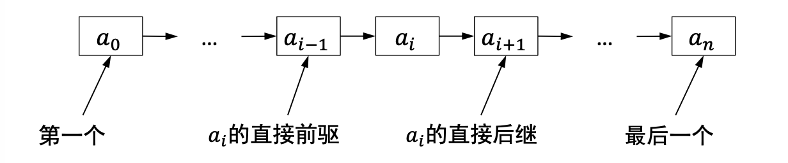

线性表中元素的个数为线性表的长度。

线性表中的元素可以是各种各样的，如整形，浮点型，字符型，也可以是用户自己定义的数据类型，但同一线性表中的元素必定具有相同特性。

线性表可以{==随机访问和存取元素==}。但插入和删除需要进行大量元素移动。

### 链表

链表是线性表的链式存储。逻辑上相邻的数据元素在**存储地址**上不必相邻，依托附加指针连接起来。每个数据元素包含数据和指针。

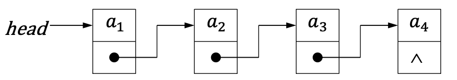

#### 单向链表

=== "链表节点定义"

    ```cpp linenums="1"
    typedef struct node {
        int data;
        struct node *next;
    }NODE；
    ```

=== "ADT实现"

    ```cpp linenums="1"
    class LinkList{
        private:
            NODE *head; //单向链表的头指针
        public:
            LinkList() {head = NULL;} //构造单向链表
            ~LinkList(); //销毁单向链表
            bool clearSqList(); //清空单向链表
            bool IsEmpty() {return head == NULL;} //判断单向链表表长是否为0
            int Length(); //求单向链表的表长
            bool GetElem(int i, int *e) ; //取单向链表的元素
            int LocateElem(int e); //定位链表中的元素位置
            bool PriorElem(int cur_e, int *pre_e); //取上一个元素
            bool NextElem(int cur_e, int *next_e); //取下一个元素
            bool Insert(int i, int e); //向单向链表中插入元素
            bool Delete(int i, int *e); //删除单向链表中的元素
            bool Traverse(bool (*visit)(int e)); //遍历单向链表
    };
    ```

**插入操作**

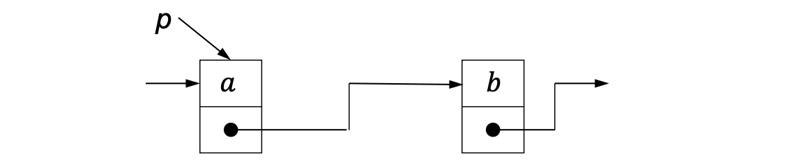

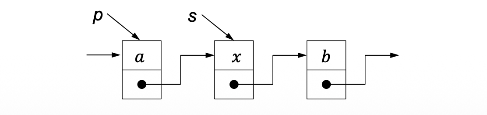

=== "核心部分"
    ```cpp
    s->next = p->next;
    p->next = s;
    ```

=== "完整实现"
    ```cpp linenums="1" hl_lines="3 4 5 6 7 8 9"
    bool LinkList::Insert(int i, int e){
        NODE *p = head, *s; int j = 0;
        if(i == 0) { //空表和头结点的插入
            s = (NODE *)new NODE[1]; //为新结点分配内存
            s->data = e; //给新结点赋值
            s->next = p; //插入结点
            head = s;
            return TRUE;
        }
        while(p && j < i - 1){
            p = p->next; 
            j++;
        } //判断不是空表并定位插入位置
        if(!p ) return FALSE; //找不到位置，返回错误
        s = (NODE *)new NODE[1]; //为新结点分配内存
        s->data = e; //插入值赋给新元素
        s->next = p->next; p->next = s; //插入结点
        return TRUE;
    }
    ```
**删除节点**

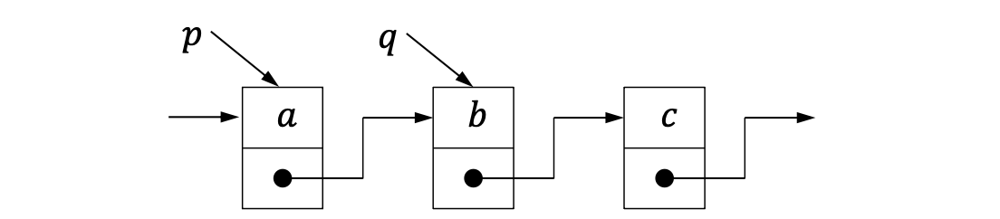

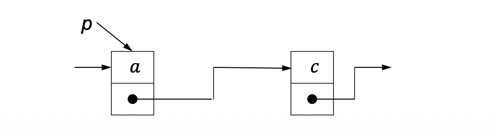

=== "核心代码"
    ```cpp
    p->next = q->next;
    delete q; //注意销毁
    ```

=== "完整实现"
    ```cpp linenums="1"
    bool LinkList::Delete(int i, int &e){
        NODE *p = head, *q; int j = 0;
        if(!p) return FALSE; //空表不能删除
        if(i == 0){ //当前头结点删除
            head = head->next; //新的头结点
            e = p->data; delete p; p = NULL; //取出元素，并删除结点
            return TRUE;
        }
        while(p->next && j < i - 1){p = p->next; j++;} //定位删除位置
        if(!(p->next) || j > i-1) return FALSE; //未找到位置，返回错误
        q = p->next; //取出带删除结点
        p->next = q->next; //删除
        e = q->data; delete q; q = NULL; //取出元素，并销毁结点
        return TRUE;
    } 
    ```

判断是否为头结点增加了操作逻辑和代码实现的复杂度。因此使用头结点代替头指针，该结点始终存在（空表也有一个结点），其中元素并非集合中的元素。该方法方便统一处理链表各个位置的插入和删除。

| 基本操作 | 功能 | 顺序表 | 单链表 |
|---|---|---|---|
| `InitList(&L);` | 构造 | $O(1)$ | $O(1)$ |
| `DestroyList(&L);` | 销毁 | $O(1)$ | $O(n)$ |
| `IsEmpty(L);` | 判空 | $O(1)$ | $O(1)$ |
| `ListLength(L);` | 求长度 | $O(1)$ | $O(n)$ |
| `GetElem(L,i,&e);` | 按位序取元素 | $O(1)$ | $O(n)$ |
| `LocateElem(L,e,compare());` | 定位元素 | $O(n)$ | $O(n)$ |
| `PriorElem(L,cur_e,&pre_e);` | 求前驱 | $O(n)$ | $O(n)$ |
| `NextElem(L,cur_e,&next_e);` | 求后继 | $O(n)$ | $O(n)$ |
| `ListInsert(&L,i,e)` | 按位序插入 | $O(n)$ | $O(n)$ |
| `ListDelete(&L,i,&e)` | 按位序删除 | $O(n)$ | $O(n)$ |
| `ClearList(&L);` | 清空 | $O(1)$ | $O(n)$ |
| `ListTraverse(L,visit());` | 遍历 | $O(n)$ | $O(n)$ |

单向链表的特点：

- 总是从前驱结点指向后继结点，访问后继结点容易，前驱结点难
- 获取表尾指针需要遍历整个链表，获得表长信息也是
- 插入或者删除元素时，需要在链表中依序寻找操作位置
- 元素的“位序”概念淡化，结点的“位置”概念强化

改进方法：

- 增加“表长”、“表尾指针”和“当前位置的指针”三个数据域

#### 双向循环链表

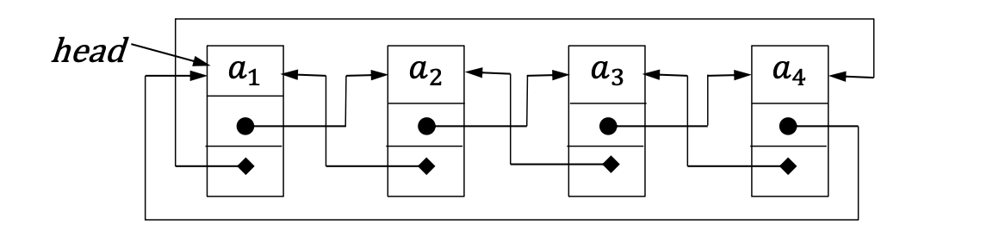


```cpp linenums="1"
typedef struct node {
    int data;
    struct node *next;
    struct node *prev;
}NODE；
```

=== "插入操作"
    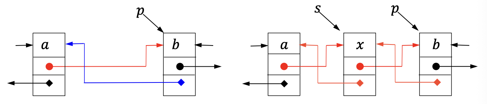

    ```cpp
    s->prev = p->prev;
    p->prev->next = s;
    s->next = p;
    p->prev = s;
    ```

=== "删除操作"

    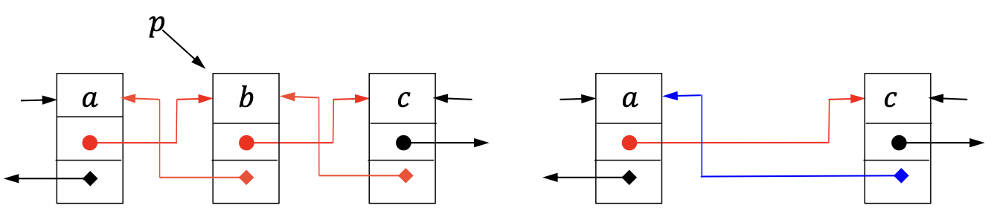

    ```cpp
    p->prev->next = p->next;
    p->next->prev = p->prev;
    delete p;
    ```

### 栈和队列

#### 栈

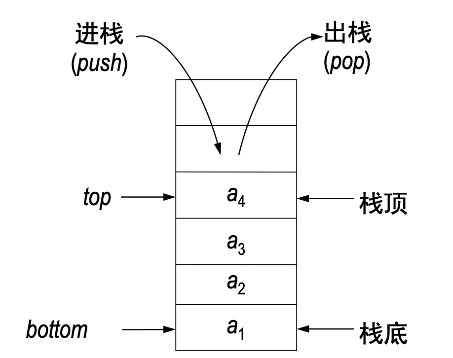

栈是一种线性结构，只允许在一端进行插入
和删除操作，数据元素的个数就是栈
的长度。

入栈序列和出栈序列互为逆序

- 先进后出(FILO): First In Last Out
- 后进先出(LIFO): Last In First Out

**顺序栈**：基于顺序存储实现

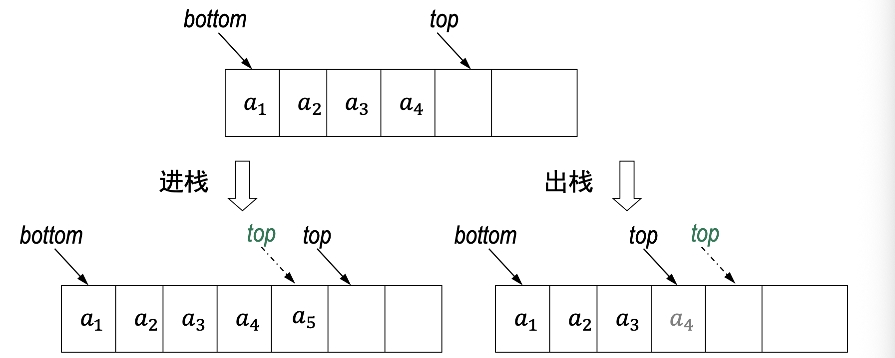

```cpp
class STACK{
    private:
        Item *m_arStack;
        int m_iDepth;
    public:
        STACK(int maxLen) { m_arStack = new Item[maxLen]; m_iDepth = 0; }
        int IsEmpty() const { return m_iDepth = = 0; }
        void ClearStack() { m_iDepth = 0; }
        int StackLen() const { return m_iDepth; }
        void push(Item e) { m_arStack[m_iDepth] = e; m_iDepth ++; }
        Item pop() { m_iDepth --; return m_arStack[m_iDepth]; }
        Item getTop() const { return m_arStack[m_iDepth - 1]; }
}; 
```

- 进栈和出栈的时间复杂度都是O(1)
- 如果栈元素是简单数据类型，则构造和销毁函数也是O(1)时间的
- {==空间利用效率低==}

**链式栈**：基于链表存储。

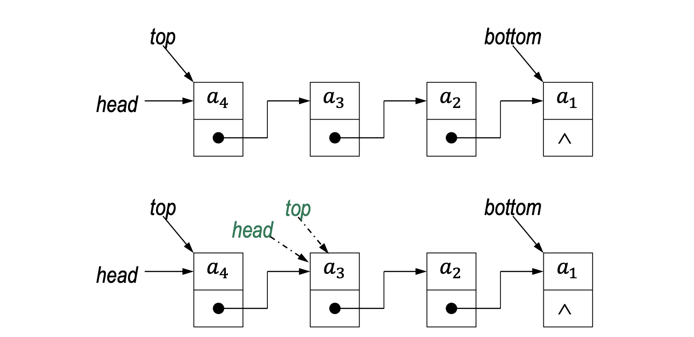

链式栈一般选择链表头为栈顶，链表底为栈底
。
=== "节点实现"
    ```cpp
    struct node{
        Item item;
        node* next;
        node(Item x, node* t) {item = x; next = t; }
    };
    typedef struct node* link;
    ```

=== "数据类实现"
    ```cpp
    class STACK{
        private:
            link m_head;
        public:
            STACK() { m_head = NULL; }
            int IsEmpty() const { return m_head == NULL; }
            void push(Item e) { m_head = new node(e,m_head); }
            Item pop() { Item v = m_head->item;
            link t = m_head->next;
            delete m_head;
            m_head = t; return v; }
            Item getTop() const { return m_head->item; }
            void ClearStack( ) { while(!IsEmpty( )) pop(); }
            StackLength( )；
    };
    ```

|  | 顺序栈 | 链式栈 |
|---|---|---|
| 物理存储方式 | 地址连续 | 地址任意 |
| 栈的规模 | 初始化栈时确定 | 不需要事先确定 |
| 栈溢出 | 存在溢出可能（要处理） | 一般不会溢出 |
| 操作时间复杂度 | 进栈/出栈：$O(1)$<br>清空栈：$O(1)$ | 进栈/出栈：$O(1)$<br>销毁和清空栈：$O(n)$ |
| 栈占用空间 | 初始化栈确定的栈的规模，空间利用效率较低 | 栈中实际元素的数目，空间利用效率很高 |

**栈的应用**

- 括号匹配，表达式求值，迷宫求解（回溯法）
- Graham扫描法：计算点集的凸包
- 浏览器中的“前进”和“后退”
- 函数调用，递归
- 系统栈，内存管理

??? tip "Graham扫描法"

    Graham 扫描法是一种用于求解二维平面点集凸包的经典算法。所谓凸包，可以理解为用一根橡皮筋把所有点围起来后形成的最外层边界，边界上的点就是凸包上的顶点。Graham 扫描法的基本思路是，先选出一个确定的起点，通常选择纵坐标最小、若相同则横坐标最小的点作为基准点；然后将其余点按照相对于基准点的极角从小到大排序，使得点集可以按照一个大致“绕圈”的顺序被访问。

    在扫描过程中，算法使用一个栈来维护当前已经形成的凸包边界。每加入一个新点时，都检查栈顶的两个点与新点构成的转向关系。如果这三个点形成的是右转，说明中间那个点会使边界向内凹，不可能出现在最终凸包上，因此需要将其从栈中弹出；如果形成的是左转，则说明当前边界仍然保持凸性，可以继续加入新点。经过这样的不断调整，栈中最终保留下来的点就是整个点集的凸包。

    判断转向通常依靠向量叉积。对于三个点 $A,B,C$，可以计算：

    $$
    (B-A)\times(C-A)
    =
    (x_B-x_A)(y_C-y_A)-(y_B-y_A)(x_C-x_A)
    $$

    若结果大于 $0$，表示从 $A$ 到 $B$ 再到 $C$ 是左转；若结果小于 $0$，表示右转；若结果等于 $0$，表示三点共线。Graham 扫描法的主要时间开销来自极角排序，因此整体时间复杂度为 $O(n\log n)$。

    伪代码如下：

    ```text
    GrahamScan(points):
        p0 = 选取纵坐标最小的点
        若纵坐标相同，则选取横坐标最小的点

        将其余点按照相对于 p0 的极角从小到大排序

        stack = 空栈
        stack.push(p0)
        stack.push(points[1])

        for p in points[2:]:
            while stack 中至少有两个点
                  且 栈顶两个点与 p 构成右转:
                stack.pop()

            stack.push(p)

        return stack
    ```

**括号匹配**：逢左括弧进栈，逢右括弧，将对应的左括弧出栈；若无对应的左括弧，则为语法错误，字符串结束，检查栈是否为空，得到括号配对检查结果。

**算术表达式**：包括中缀、前缀、后缀。栈用于后缀表达式求值（逆波兰式）。自左向右扫描后缀表达式，然后：

- 遇到操作数进栈
- 遇到操作符，两个操作数出栈进行计算，结果进栈
- 栈顶元素就是后缀表达式求值的结果

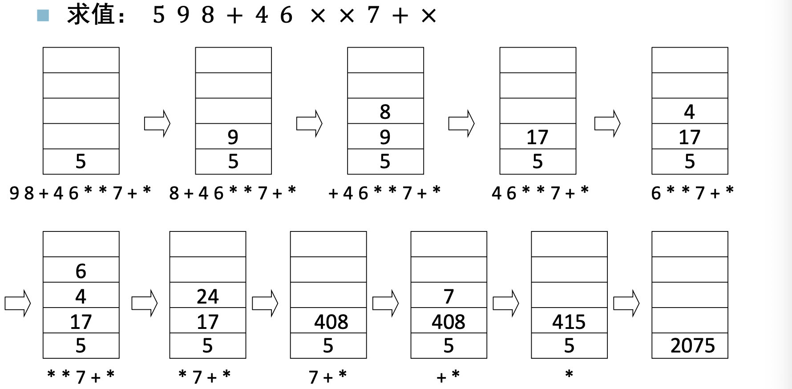

#### 队列

队列是限定在表的一端进行插入，而在另一端进行删除的**线性结构**

在队列中，允许插入的一端称为队尾(rear)，允许删除的一端称为队头(front)，插入操作称为入队(enqueuer)，删除操作称为出队(dequeuer)

循环队列的判空判满：

1. 设置一个空位
1. 设置一个标志(出队还是入队造成`front==rear`)
1. 设置队列长度变量

队列的应用：构建缓冲区，处理不同设备之间的速度差异。

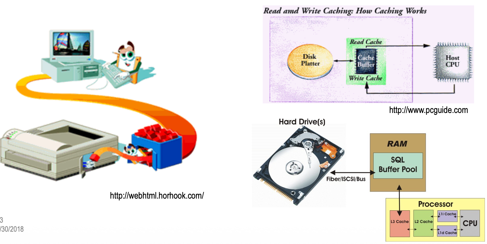

### 串


## 基础非数值算法
### 递归

若一个对象部分地包含它自己, 或用它自己给自己定义, 称这个对象是递归的；若一个过程直接地或间接地调用自己, 则称这个过程是递归的。

递归求解的两个条件：

1. 找到了规模较大的问题和规模较小的同样问题之间的联系
1. 有终止条件


#### 递归的消除

递归可能导致较高的时间复杂度和空间复杂度。

**尾递归**：在递归程序中，递归语句只有一个，且处在函数的最后。对于尾递归形式的递归算法，可以很方便的利用循环结构来替代。

=== "尾递归函数"
    ```cpp
    int fractorial( int n ) {
        if(n = = 0) return 1;
        else return n * factorial(n - 1);
    }
    ```

=== "非递归函数"
    ```cpp
    int fractorial( int n ) {
        int a = 1;
        while(n > 0) { a = a* n; n--;}
        return a;
    }
    ```

**单向递归**：递归算法中有多处递归调用，但各递归调用语句的参数之间没有关系，并且这些递归调用语句都处在递归算法的最后。

=== "单向递归函数"
    复杂度为$O(t^n)$
    ```cpp
    long Fib( long n ) {
        if ( n <= 1 ) return n;
        else return Fib(n-1) + Fib(n-2);
    }
    ```
    

=== "非递归函数"
    复杂度为$O(n)$
    ```cpp hl_lines="6 7 8"
    int fractorial( int n ) {
        long Fib_Iter ( long n ) {
        if ( n <= 1 ) return n;
        long twoback = 0, oneback = 1, Current; //定义存储变量
        for ( int i = 2; i <= n; i++ ) {
            Current = twoback + oneback; //迭代公式
            twoback = oneback; //更新
            oneback = Current;
        }
        return Current;
        }
    }
    ```
    
本质：存储了有用的中间变量

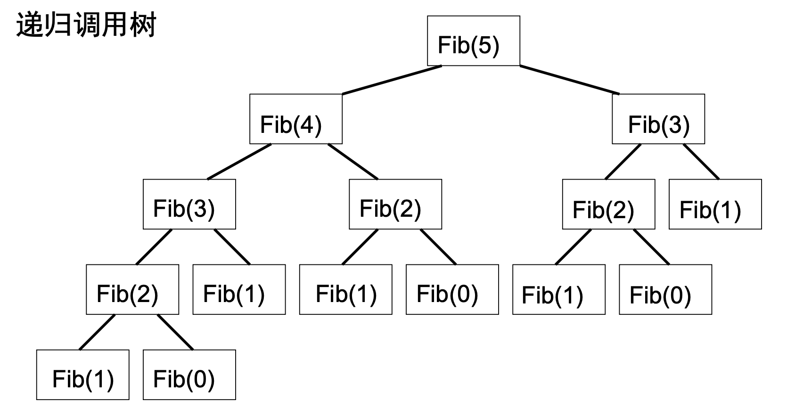

消除递归的目的是提高效率，包括时间和空间效率。递归的消除没有统一的解决方案。

一部分递归可直接用循环实现。尾部的递归调用需要额外开销，却没有用它们进行什么有用的计算。消除尾部递归可以显著地改善递归函数的效率。

一部分递归可用递推实现其非递归过程。很多情形必须借助显式的栈来实现非递归过程！

递归程序在运行时是利用系统的调用栈(call stack)实现的。

