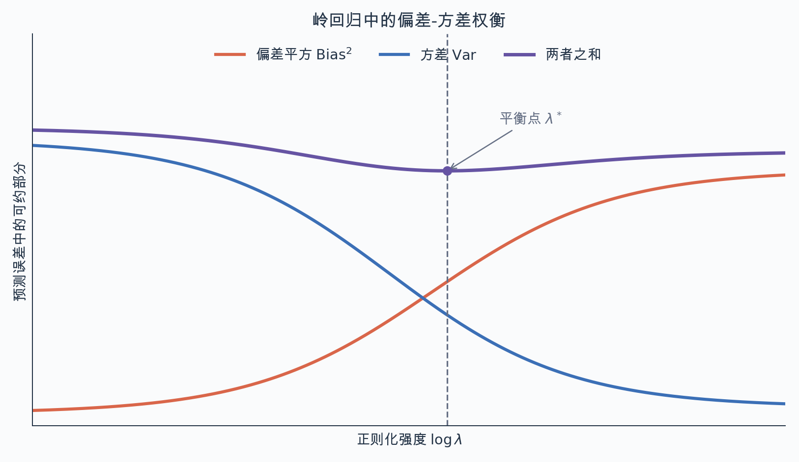
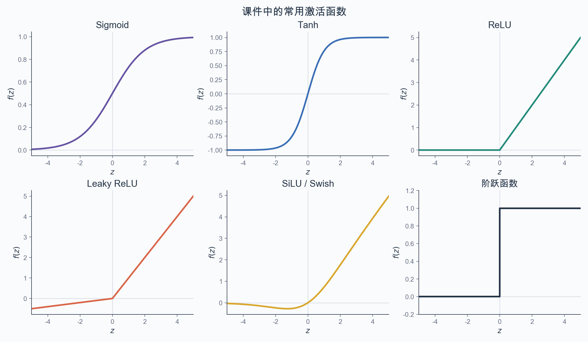
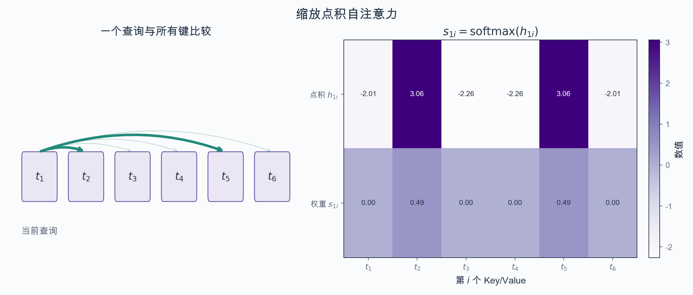
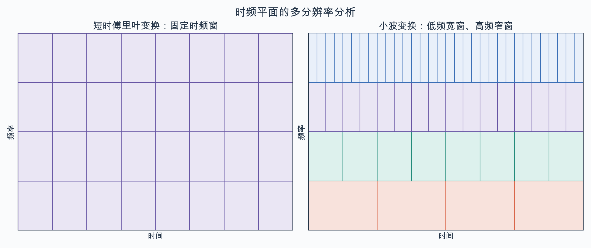
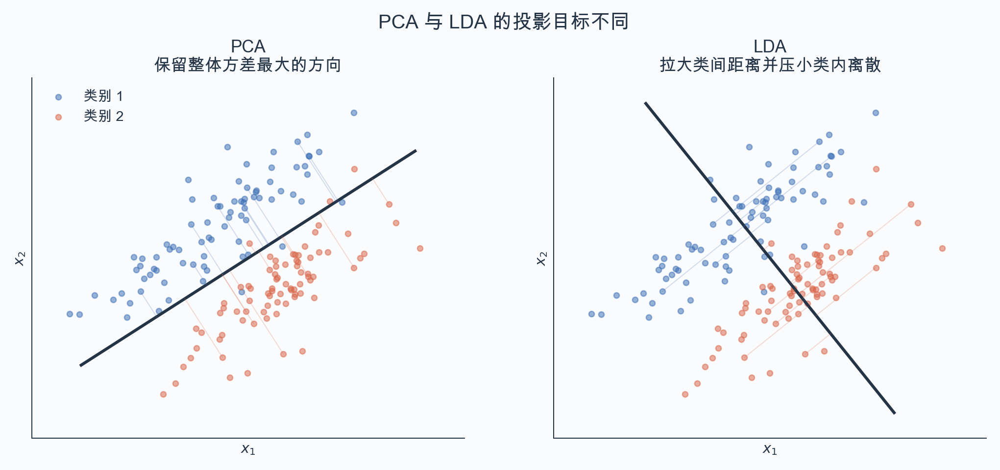
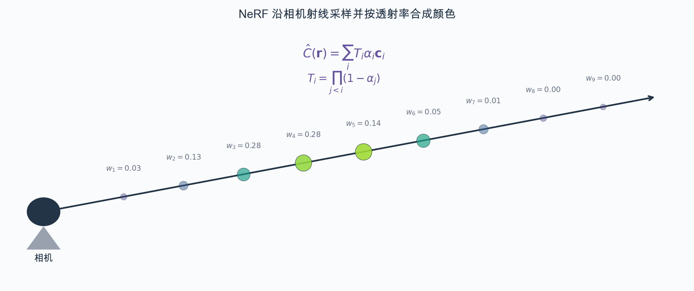

## 1

```pyodide
print("Hello Markdown!")
```

[TOC]

## 第1讲 媒体与认知概述

### 媒体与认知

#### 媒体、信息及其载体

媒体是信息的载体。印刷品、电子文档、电话、电视、互联网，以及新闻、微博等传播方式都属于媒体。载体本身又有层次：文字承载语义内容，电子文本承载文字，网络传输时的数据包又承载电子文本。

媒体技术的创新是人类社会发展的重要标志。语言和文字使交流与文化传承成为可能；文字的载体也从岩石、甲骨、竹简等自然物，发展到纸张、造纸术和活字印刷术，再发展到电子出版、移动通信等信息设备。

青蒿素的发现说明，旧媒体中保存的信息仍可能直接推动新的认知。20世纪60年代，氯喹抗疟逐渐失效；屠呦呦于1969年担任中药抗疟组组长。1971年，东晋葛洪《肘后备急方》中“青蒿一握，以水二升渍，绞取汁，尽服之”的记载使她注意到“绞取汁”不同于中药常见的煎熬法，因而改用低沸点乙醚提取青蒿素。她于2015年10月获诺贝尔生理学或医学奖，并获2016年度国家最高科学技术奖。

人的感知和认知能力都有边界，媒体技术可以：

- 用传感器扩展声波、光波频率与强度的感知范围，例如获取红外图像；
- 通过大数据关联分析发现规律，提升认知能力；
- 代替重复性脑力劳动；
- 辅助决策，例如具有增强现实与实时翻译功能的眼镜。

媒体的表现形式会影响信息感知，同一信息也可以在不同形式之间转换。各类信息都能转换成电学形式，其载体是电荷、电磁场或光子；人类视听系统最终感知的则是光波、声波等模拟信号。典型的信息处理链是“声光等模拟信号—数字信号—数字媒体—以人可感知的形式呈现”。

数字媒体有三个主要特征：

- **数字化**：数字信号多次中继不易累积失真，便于信道编码、计算机处理和加密；代价是数据量大、数码率高，知识产权保护也更困难。
- **集成化**：把多种数字媒体信息以及相应硬件、软件组织到一起。
- **交互式**：通过人机接口形成双向交互。

数字媒体可分为视觉类与听觉类，常见形式包括文本、图像、视频、图形、动画和声音。文字本身也有多种表示：

- 文字图像；
- 文本代码，例如字符“A”的 ASCII 单字节编码为 0x41，汉字“啊”的 GB 双字节编码为 0xB0A1，汉字“一”的 Unicode 编码为 0x4E00；Unicode 的传输编码包括 UTF-16、UTF-8；
- TrueType 字体所描述的图形；
- 联机手写笔迹的坐标序列。

早期计算机并不支持中文等多文种文字。中文信息处理的基础工作包括 GB 2312-80 等字符编码标准、五笔字型等输入法、汉字字体与北大方正激光照排，以及汉字识别。汉字识别可看成激光照排的逆过程，清华电子系曾研制 TH-OCR 文字识别与车牌识别软件。

文字识别把扫描或拍摄的文档图像、联机手写笔迹转换为文本代码。其处理环节和方法包括：

| 环节 | 传统方法 | 深度学习方法 |
|---|---|---|
| 版面分析 | 自顶向下投影法、自底向上连通域分析法等 | 基于 FCN、Faster R-CNN、DETR 等方法，与下两行共用 |
| 文字检测 | 最大稳定极值区域 MSER、笔画宽度变换 SWT 等 | 同上 |
| 字符切分 | 投影分析、连通域分析、字符轮廓分析、笔画分析等 | 同上 |
| 字符识别，如大字符集古籍汉字识别 | 特征工程，包括特征提取、特征降维，以及统计模式识别 | 卷积神经网络 |
| 文本行识别 | 基于字符切分和识别的方法；基于序列建模的隐含马尔可夫模型 | 循环神经网络、Transformer |

从流程看，输入图像先经过版面分析或文字检测，再做文字识别；识别结果还要经过后处理，最后输出文本代码。课件把 FCN、Faster R-CNN、DETR 的深度学习单元纵向跨在版面分析、文字检测和字符切分三行，因此这里保留为三项技术共用，不能只放在其中一行。

利用人工智能实现媒体形式转换，本质是信息的提取与转化。例如中文文本经机器翻译变成英文文本，中文文本图像经文字识别变成中文文本，中文文本又可经图像合成形成文本图像。

本课程把信息定义为：物质相互作用中反映出的事物状态与属性；这里的“事物”既包括客观世界的物质现象，也包括主观世界的意识现象。香农在1948年用信息计算公式把信息描述为“熵的减少”，也就是消除不确定性的内容。若离散随机变量 $X$ 取 $x_i$ 的概率为 $p(x_i)$，其信息熵为

$$
H(X)=-\sum_{i=1}^{n}p(x_i)\log p(x_i).
$$

通信系统由信源、发送器、信道、接收器和信宿组成，噪声作用于信道。信息还要与信号、数据和知识区分：

- **信号**是信息在物理层次的载体。
- **数据**是客观事物运动状态经感觉器官或观测仪器感知后形成的数字、文本、图像等原始记录；对数据加工、建立数据之间的联系，才能提取信息。
- **知识**是人在改造世界的实践中形成的认识和经验，不是数据和信息的简单堆积，而是能够指导实践的信息。

#### 认知与人工智能

认知是个体认识客观世界的信息加工过程。人的感官在长期进化中逐步与媒体相适应，并形成大脑等中枢神经系统；大脑加工视觉、听觉等感官输入并形成理解。认知过程包括感知、注意、记忆、学习、思维、意识和情绪等。若把认知系统类比为信息系统，可以对应为传感器输入、运算器和记忆器处理与存储、通信网络传输，以及控制器输出并作用于环境。

媒体技术也用于研究人的认知规律，例如心理学实验中的脑电图、计算机辅助脑成像、眼动分析仪和核磁共振成像 MRI。

卡尼曼在《思考，快与慢》中把人的思维分成两个系统：

- 快思考（系统1）依赖直觉，在无意识状态下快速完成；
- 慢思考（系统2）需要主动控制，是有意识的思考。

二者应合理分工：快思考提供洞察与直觉，集体讨论等方式则能促进慢思考和理性决策。

图灵测试给出一种判断机器是否具有智能的操作性准则：如果机器通过电传设备与人对话，而人无法辨别对方的机器身份，就称机器表现出智能。课件以2022年11月推出、基于 GPT-3 并经监督学习和强化学习后训练的 ChatGPT 为例，说明“能够完成问答、翻译和文本生成”不等于已经具有人类式的理解、感知和思考能力。

Searle 在20世纪80年代初提出“中文房间”思想实验：一个不懂中文、母语为英语的人只按英文手册处理房外传入的中文问题，也能给出中文回答。房外的人相当于程序员，房内的人相当于计算机，手册相当于程序；房内的人能够执行符号规则却不理解中文，由此质疑“执行程序本身就产生理解力”的观点。

人工智能作为研究方向起源于1956年8月的达特茅斯夏季人工智能研究计划，John McCarthy 等人提出研究七个领域：可编程的自动计算机、让计算机使用语言、神经网络、计算规模理论、自我改进即机器学习、抽象、随机性与创造性。

人工智能发展史上，多位图灵奖获得者的工作与该领域直接相关：Marvin Minsky（1969）推动人工智能领域形成与发展；John McCarthy（1971）研究人工智能；Herbert Simon 与 Allen Newell（1975）贡献于人工智能、人类认知心理学和表处理；Edward Feigenbaum 与 Raj Reddy（1994）开创大规模人工智能系统；Leslie Valiant（2010）提出 PAC 学习等计算理论；Judea Pearl（2011）发展概率与因果推理。Yoshua Bengio、Geoffrey Hinton、Yann LeCun 因使深度神经网络成为计算关键组成部分而获2018年图灵奖。2024年，Hinton 与 Hopfield 因人工神经网络和机器学习工作获诺贝尔物理学奖；David Baker、Demis Hassabis、John Jumper 因蛋白质结构设计与预测相关成果获诺贝尔化学奖。

按能力范围，人工智能可分为三个阶段：

- 狭义人工智能 ANI，也称弱人工智能，只执行特定任务，如 Siri、AlphaGo；
- 通用人工智能 AGI，也称强人工智能，目标是具有类似人的思考和决策能力；
- 超级人工智能 ASI，设想其计算能力超过人类。

人工智能还有三条典型技术路线：

1. **符号主义**：以符号为认知基元，通过符号操作实现智能。Robinson 的归结原理、Lisp、Prolog 是代表；重点研究启发式搜索与推理，在自动定理证明、专家系统中取得成功。吴文俊于1977年提出平面几何问题的机械化证明理论“吴方法”。
2. **连接主义**：以神经元及其连接为思维基元，把智能看成神经元竞争与协作的结果。代表包括 Hopfield 网络和用误差反向传播训练的神经网络；研究重点是神经元特征、网络拓扑、学习规则、非线性动力学与自适应协同行为。大数据和并行计算推动了深度学习与大语言模型的发展。
3. **行为主义**：以 Rodney Brooks 为代表，把反馈看作控制论基石，强调智能系统从环境中感知信息，再以行为影响环境；智能体现在系统与环境的持续交互中。

### 机器学习基础

#### 基本概念与流程

监督学习用有标签样本建模输入输出关系。回归的输出是随输入标量或向量连续变化的数值，如由降水量预测水果产量；分类或模式识别的输出是类别标签，如由水果图像判断类别。非监督学习不使用人工标签，聚类把样本划分为若干属性相近的子集；自监督学习从数据自身构造监督信号，例如大语言模型用“预测下一个单词”进行预训练。强化学习中，智能体在与环境的交互中根据行动回报决定下一步行为。

数据集通常分为训练集、验证集和测试集。训练阶段由训练样本经过预处理与学习得到模型参数；验证集用于训练期间比较模型和决定何时停止；测试阶段只对新样本预处理并预测，用测试集评价最终性能。

机器学习有三个基本要素：

1. **模型**：给定训练集 $D=\{(x_i,y_i)\mid i=1,\ldots,N\}$，模型给出映射 $y=f(x)$；线性情形也可写成 $Y=A^TX$。
2. **策略**：用目标函数衡量预测 $f(x)$ 与真值 $y=g(x)$ 的差异，目标函数也称损失函数或代价函数。
3. **算法**：优化模型参数 $\theta$，即

$$
\theta^\ast=\arg\min_{\theta}L(f(x;\theta),y).
$$

常见机器学习方法包括：监督学习中的线性模型、支持向量机、贝叶斯分类器、隐含马尔可夫模型、决策树、K近邻，以及 MLP、CNN、RNN、Transformer 等神经网络；非监督学习中的 K 均值、PCA、t-SNE 与自监督学习；强化学习中的 Q-learning、DQN、PPO。

#### 线性回归

回归用于描述一个或多个自变量与因变量的关系。一元线性回归的输入是标量，例如学习成绩与投入时间；多元线性回归的输入是向量，例如房价与工资、贷款利率。线性回归假设因变量是自变量各元素的加权和，并假设观测噪声服从正态分布：

$$
y=w^Tx+b+\epsilon,\qquad \epsilon\sim\mathcal N(0,\sigma^2).
$$

给定 $m$ 个样本 $(x_i,y_i)$，其中 $x_i=(x_{i1},\ldots,x_{id})^T$，参数为 $w=(w_1,\ldots,w_d)^T$ 和 $b$。把 $x_{i0}=1$ 加入增广向量，并令 $w_0=b$，可写成

$$
X=
\begin{bmatrix}
1&x_{11}&\cdots&x_{1d}\\
1&x_{21}&\cdots&x_{2d}\\
\vdots&\vdots&\ddots&\vdots\\
1&x_{m1}&\cdots&x_{md}
\end{bmatrix},
\qquad
w=(w_0,w_1,\ldots,w_d)^T,
\qquad
y=Xw.
$$

最小二乘法寻找使均方误差最小的超平面：

$$
L(X,y,w)=\frac{1}{m}\|Xw-y\|_2^2 =\frac{1}{m}(Xw-y)^T(Xw-y).
$$

其梯度与闭式解分别是

$$
\frac{\partial L}{\partial w}=\frac{2}{m}X^T(Xw-y), \qquad \hat w^\ast=(X^TX)^{-1}X^Ty.
$$

这一写法要求 $X^TX$ 可逆，也就是 $X$ 满列秩；若条件不满足，应使用 Moore--Penrose 伪逆写成 $\hat w^\ast=X^+y$。

线性回归还有一个直接的几何解释。一元情形中，无噪声目标满足 $t=wx+b$，观测为

$$
y=t+\epsilon,
$$

其中 $\epsilon$ 是观测噪声，模型给出预测 $\hat y$。课件左图的横、纵轴是输入 $x$ 和输出 $y$：红线表示真实关系 $t$，紫色样本相对红线的竖直偏移是 $\epsilon$，绿色直线及其上的点表示拟合模型和预测值 $\hat y$。把两个样本的输出写成二维向量后，$t,y,\hat y$ 都可看作从原点出发的向量，并有

$$
y-\hat y=(t-\hat y)+\epsilon.
$$

因此预测误差由模型相对无噪声目标的偏差和观测噪声共同构成。右图坐标轴是 $y_1,y_2$，表示输出空间中的两个分量，不是左图的 $x,y$。

无法或不宜直接求闭式解时，可用梯度下降：

$$
\theta_{t+1}=\theta_t-\eta\frac{\partial L}{\partial\theta}, \qquad \theta=\{w,b\}.
$$

线性回归可以看成无激活函数的单层单节点网络。训练时每次选取 $m$ 个样本：$m=1$ 是原始随机梯度下降，梯度波动较大；$m=N$ 每步使用全部数据，不适合大数据；实际常取 $32$ 等 $2$ 的幂，每轮约迭代 $\lceil N/m\rceil$ 次。完整流程是：

1. 初始化参数 $\theta$；
2. 每轮先随机打乱训练集；
3. 依次取小批量样本，前向计算预测与损失；
4. 反向传播求 $\partial L/\partial\theta$；
5. 按梯度下降更新参数；
6. 重复到验证集误差不再下降，输出参数。

课件的水果产量例题使用如下数据：

| 地区 | 平均气温/℉ | 降雨量/mm | 湿度/% | 苹果产量/(吨/公顷) | 橙子产量/(吨/公顷) |
|---:|---:|---:|---:|---:|---:|
| 1 | 73 | 67 | 43 | 56 | 70 |
| 2 | 91 | 88 | 64 | 81 | 101 |
| 3 | 87 | 134 | 58 | 119 | 133 |
| 4 | 102 | 43 | 37 | 22 | 37 |
| 5 | 69 | 96 | 70 | 103 | 119 |

先只考虑降雨量 $x$ 与苹果产量 $y$ 的一元线性关系。初始化 $w=1.0,b=2.0$，预测为

$$
\hat y=(69.0,90.0,136.0,45.0,98.0).
$$

均方误差是

$$
\begin{aligned}
L&=\frac15\sum_{i=1}^{5}(\hat y_i-y_i)^2\\
&=\frac15\left(13^2+9^2+17^2+23^2+(-5)^2\right)=218.6.
\end{aligned}
$$

由链式法则，

$$
\frac{\partial L}{\partial w} =\frac25\sum_i(\hat y_i-y_i)x_i=1780.0, \qquad \frac{\partial L}{\partial b} =\frac25\sum_i(\hat y_i-y_i)=22.8.
$$

学习率取 $\eta=10^{-4}$，一次更新得到

$$
w_{\mathrm{new}}=1-10^{-4}\times1780=0.822, \qquad b_{\mathrm{new}}=2-10^{-4}\times22.8=1.99772.
$$

之后继续迭代，直到达到迭代次数或收敛条件。

线性回归可以通过基函数增加非线性描述能力：

$$
y=w^T\phi(x)+b.
$$

也可以在目标函数中加入正则项。岭回归使用参数的 $L_2$ 范数平方，LASSO 使用 $L_1$ 范数：

$$
L_{\mathrm{ridge}}=(Xw-y)^T(Xw-y)+\lambda\|w\|_2^2, \qquad \|w\|_2^2=\sum_{i=0}^{d}w_i^2,
$$

$$
L_{\mathrm{LASSO}}=(Xw-y)^T(Xw-y)+\lambda\|w\|_1, \qquad \|w\|_1=\sum_{i=0}^{d}|w_i|.
$$

$\lambda\ge 0$。正则化能减轻过拟合，却也可能降低模型灵活性。不能把 $\lambda$ 与普通模型参数一起学习，否则模型会倾向于令其为零；应在训练集上分别训练不同 $\lambda$ 的模型，再由验证集比较，选择偏差与方差较平衡的取值。

偏差—方差分解用于分析预测误差。设真实模型为 $y=t+\epsilon$，其中 $t=Xw$、$\epsilon\sim\mathcal N(0,\sigma^2)$；对训练集的一次抽样 $D$ 得到模型 $\hat y_D$，多次抽样的期望预测为 $\bar{\hat y}=E_D[\hat y_D]$。则

$$
\hat y_D-y=(\hat y_D-\bar{\hat y})+(\bar{\hat y}-t)+(t-y),
$$

从而，对训练集抽样和观测噪声同时取期望，

$$
E_{D,\epsilon}[(\hat y_D-y)^2] =\underbrace{E_D[(\hat y_D-\bar{\hat y})^2]}_{\text{方差}} +\underbrace{(\bar{\hat y}-t)^2}_{\text{偏差平方}} +\underbrace{\sigma^2}_{\text{噪声方差}}.
$$

课件把左端简写成 $E_D$；严格地说，出现 $\sigma^2$ 时还对独立噪声 $\epsilon$ 取了期望。方差反映训练数据变化对预测的影响，偏差反映期望预测与真实值的偏离，噪声方差是问题本身造成的误差下界。偏差与方差往往冲突，这就是偏差—方差窘境。

课件的岭回归实验采用真实关系

$$
y(x)=1.075x-15.585+\epsilon,
$$

生成 $L=100$ 组数据，每组 $N=25$ 个点。对每组拟合 $\hat y_l(x)$，并定义

$$
\bar{\hat y}(x)=\frac1L\sum_{l=1}^{L}\hat y_l(x),
$$

$$
\operatorname{bias}^2 =\frac1N\sum_{n=1}^{N}\left[\bar{\hat y}(x_n)-t(x_n)\right]^2,
$$

$$
\operatorname{variance} =\frac1N\sum_{n=1}^{N}\frac1L\sum_{l=1}^{L} \left[\hat y_l(x_n)-\bar{\hat y}(x_n)\right]^2.
$$

偏差平方与方差之和最小时对应最优正则化系数 $\lambda^\ast$。



水果例题的多元闭式解给出

$$
W=
\begin{bmatrix}
-0.3876&-0.2852\\
0.8478&0.7940\\
0.6982&0.9250
\end{bmatrix},
\qquad
b=(-1.6377,-2.2178).
$$

对新观测 $(75,63,44)$，闭式解预测苹果和橙子产量为 $(53.4227,67.1172)$。PyTorch 的两种迭代实现分别得到 $(50.8773,67.4407)$ 和 $(54.5475,68.4272)$。

#### 思考与探究

1. 若线性回归观测噪声服从 $p(\epsilon)=\frac12e^{-|\epsilon|}$，目标函数应如何调整？课件称它为“指数分布”，但这个关于 0 对称的密度实际是 Laplace 分布；最大似然对应最小化绝对误差，即 $L_1$ 损失。
2. 若 $x$ 与 $y$ 的关系为 $y=ae^{bx}$，其中 $a>0,b\ne0$，应怎样变换为线性回归问题？

## 第2讲 机器学习（一）

### 线性分类

#### 逻辑回归

广义线性模型把输出经连接函数 $g$ 变成输入的线性函数：

$$
g(y)=w^Tx+b,\qquad y=g^{-1}(w^Tx+b).
$$

$g$ 应单调、可微且存在逆函数。对数线性回归取 $g(y)=\ln y$，于是 $y=e^{w^Tx+b}$；对数几率回归取

$$
g(y)=\ln\frac{y}{1-y},
$$

就是逻辑回归。Logistic 函数也称 Sigmoid 函数：

$$
\sigma(x)=\frac{1}{1+e^{-x}}.
$$

它最早用于19世纪资源受限的人口增长研究，后来用于二分类和神经网络激活函数。若事件发生概率为 $p=\sigma(x)$，其胜算为 $p/(1-p)$，对数胜算恰为

$$
\operatorname{logit}(p)=\ln\frac{p}{1-p}=x.
$$

Sigmoid 单调递增，是关于 $(0,0.5)$ 中心对称的平滑 S 形曲线；$x\to+\infty$ 时趋于 $1$，$x\to-\infty$ 时趋于 $0$。其导数可直接由函数值表示：

$$
\sigma'(x)=\sigma(x)\bigl(1-\sigma(x)\bigr).
$$

逻辑回归先计算

$$
z=w^Tx+b,\qquad q=\sigma(z),
$$

其中 $q$ 是属于正类的预测概率。还可引入位置和斜率参数：

$$
f(x)=\frac{1}{1+e^{-k(x-\mu)}},
$$

$\mu$ 决定曲线中心，$k$ 控制中心附近的斜率。

二分类交叉熵是逻辑回归的目标函数。真值 $p\in\{0,1\}$、正类预测概率为 $q$ 时，

$$
L_{\mathrm{BCE}}=-p\log q-(1-p)\log(1-q).
$$

当 $p=1$ 时，$q=1,0.5,0$ 对应损失 $0,\log 2,+\infty$；当 $p=0$ 时，$q=1,0.5,0$ 对应损失 $+\infty,\log 2,0$。它是一般交叉熵

$$
H(P,Q)=-\sum_{x_i\in X}p(x_i)\log q(x_i)
$$

在二分类、真值为退化概率分布时的特例。

逻辑回归训练采用梯度下降：初始化 $w_0,b_0$，每轮计算损失及 $\partial L/\partial w,\partial L/\partial b$，再更新

$$
w_t=w_{t-1}-\eta\frac{\partial L}{\partial w}, \qquad b_t=b_{t-1}-\eta\frac{\partial L}{\partial b}.
$$

课件用学生复习时长预测是否通过考试。20个时长为

$$
\begin{aligned}
x={}&(0.50,0.75,1.00,1.25,1.50,1.75,1.75,2.00,2.25,2.50,\\
&2.75,3.00,3.25,3.50,4.00,4.25,4.50,4.75,5.00,5.50),
\end{aligned}
$$

对应标签

$$
y=(0,0,0,0,0,0,1,0,1,0,1,0,1,0,1,1,1,1,1,1).
$$

拟合模型

$$
q(x)=\frac{1}{1+e^{-(x-\mu)/s}}
$$

并最小化全部样本的 BCE，数值解为 $\mu\approx2.7,s\approx0.67$。分类决策面是 $w^Tx+b=0$，$w$ 是决策面的法向量，$b$ 是偏置。

#### 感知机

Rosenblatt 于1957年提出感知机。给定 $D=\{(x_i,y_i)\}_{i=1}^{N}$，其中 $x_i\in\mathbb R^d,y_i\in\{1,-1\}$，模型为

$$
\hat y=\operatorname{sign}(w^Tx+b),
\qquad
\operatorname{sign}(z)=
\begin{cases}
1,&z>0,\\
-1,&z\le0.
\end{cases}
$$

感知机和逻辑回归都是直接拟合分类面的鉴别式模型。误分类点满足 $y(w^Tx+b)<0$。单纯统计误分类点个数不可导，因此把误分类点到分类面的等效距离相加：

$$
L(w,b)=\sum_{x\in D}\max\left(0,-y(w^Tx+b)\right).
$$

对误分类点，

$$
\frac{\partial L}{\partial w}=-yx,\qquad \frac{\partial L}{\partial b}=-y,
$$

故随机梯度更新为

$$
w\leftarrow w+\eta yx,\qquad b\leftarrow b+\eta y.
$$

三种线性模型可归纳为：

| 模型 | 任务 | 映射 | 目标函数 |
|---|---|---|---|
| 线性回归 | 回归 | $w^Tx+b$ | MSE 或误差平方和 |
| 逻辑回归 | 分类 | $\sigma(w^Tx+b)$ | 二分类交叉熵 |
| 感知机 | 分类 | $\operatorname{sign}(w^Tx+b)$ | 误分类点到分类面的等效距离 |

感知机能够学习 AND：四个输入 $(0,0),(0,1),(1,0),(1,1)$ 的标签依次为 $0,0,0,1$，它们线性可分。异或数据在这四个输入上的标签依次为 $0,1,1,0$，二维平面中不存在一条直线把两类完全分开，所以单个感知机或逻辑回归模型不能解决 XOR。增加一个不使用偏置、采用 ReLU 的隐含层，就能手工构造出

$$
h_1=\operatorname{ReLU}(x_1-x_2),\qquad h_2=\operatorname{ReLU}(-x_1+x_2),\qquad y=\frac12(h_1+h_2).
$$

| $x_1$ | $x_2$ | $h_1$ | $h_2$ | $y$ |
|---:|---:|---:|---:|---:|
| 0 | 0 | 0 | 0 | 0 |
| 0 | 1 | 0 | 1 | 0.5 |
| 1 | 0 | 1 | 0 | 0.5 |
| 1 | 1 | 0 | 0 | 0 |

这里正类输出为 $0.5$ 而不是真值 1，但取合适阈值即可完成 XOR 判决。

### 神经网络

#### 从生物神经元到人工神经元

人脑包含100亿个以上神经元和1000亿个以上神经胶质细胞。神经元接收、处理和传送信息：神经元内部主要是电传导，神经元之间通过突触形成神经回路，主要是化学传导；神经回路是脑内信息处理的基本单位。

McCulloch 与 Pitts 于1943年提出人工神经元数学模型，抽象了神经元的兴奋、抑制、空间整合、阈值与固定时滞。“全或无”法则是：低于刺激阈值不响应，高于阈值后，不论刺激强弱都产生相同幅值的神经脉冲。

人工神经元先线性加权，再非线性激活：

$$
z=w^Tx+b,\qquad \hat y=f(z).
$$

若令 $x_0=1,w_0=b$，则 $z=w^Tx$。课件把 $b=-\rho$ 与生物神经元的响应阈值 $\rho$ 对应。

神经网络发展中的几个节点是：1957年的感知机使用阶跃激活；Minsky 与 Papert 在1969年指出单层感知机不能处理 XOR 等线性不可分问题；Werbos（1974）以及 Rumelhart、Hinton、Williams、LeCun（1986）推动误差反向传播算法，它利用链式法则计算模型参数的梯度。

常用激活函数如下：

| 函数 | 定义与导数 | 特点 |
|---|---|---|
| 阈值函数 | $f(z)=1$（$z>0$），否则为 $0$ | 输出 $[0,1]$ |
| 符号函数 | $f(z)=1$（$z>0$），否则为 $-1$ | 输出 $[-1,1]$ |
| Sigmoid | $\sigma(z)=1/(1+e^{-z})$，$\sigma'=\sigma(1-\sigma)$ | 非零中心；饱和区梯度消失 |
| Tanh | $\tanh z=(e^z-e^{-z})/(e^z+e^{-z})$，$f'=1-\tanh^2z$ | 零中心；饱和区梯度消失；常用于 RNN |
| ReLU | $f(z)=\max(0,z)$ | 正半轴梯度有效，缓解梯度消失；非零中心；负半轴截断可能产生“死亡神经元” |
| Leaky ReLU/PReLU | $f(z)=z$（$z>0$），否则为 $\alpha z$ | 保留部分负值信息 |

SiLU 又称 Swish，由 Google Brain 于2017年引入：

$$
\operatorname{SiLU}(x)=x\,\sigma(x).
$$



#### 多层感知机及表示能力

多层感知机在输入层与输出层之间增加一个或多个隐含层。每个节点与前层所有节点连接的层称全连接层、线性层或密集层，非线性激活紧随线性变换。它是前馈神经网络 FFN。

输入维数为 $d$、隐含层有 $n$ 个节点、输出层有 $m$ 个节点时，参数量为

$$
(d+1)n+(n+1)m.
$$

大模型中的单个专家也可用 FFN 实现。DeepSeek-V3 总参数量为 671B，Transformer 共61层，前3层采用普通 FFN，后58层采用混合专家 MoE；单次推理只激活 37B 参数。每个 MoE 层的单个专家包含三个线性层，特征维数依次为 $2048\to10944\to2048\to10944$。三个线性层含偏置的参数量分别为

$$
2048\times10944+10944=22424256,
$$

$$
10944\times2048+2048=22415360,
$$

$$
2048\times10944+10944=22424256,
$$

合计 $67263872$。MoE 的动态路由由线性层与 Softmax 组成多路门控。

神经网络的非线性表示能力体现在三方面：

- 一个隐含层、节点数可任意增加、使用阈值激活的网络，可以实现任意二值逻辑函数。
- 万能近似定理指出，一个隐含层、节点数可任意增加、使用 S 形非线性激活的网络，可以一致逼近紧集上的连续函数，或按范数逼近紧集上的平方可积函数。
- 二分类中，一个隐含层可模拟二维特征空间中的任意凸多边形决策面，多层网络还能表示更复杂的边界。

没有非线性激活时，多层线性变换仍等价于一次线性变换。以两个隐含节点为例，

$$
a_1=w_1x+b_1,\qquad a_2=w_2x+b_2,
$$

$$
\hat y=w_3a_1+w_4a_2+b_3 =(w_1w_3+w_2w_4)x+(w_3b_1+w_4b_2+b_3).
$$

只有把 $a_1,a_2$ 改为 $\sigma(w_ix+b_i)$，网络才获得非线性。

课件给出一个训练后的 XOR 网络。批量增广输入为

$$
X=
\begin{bmatrix}
1&1&1&1\\
0&0&1&1\\
0&1&0&1
\end{bmatrix},
$$

隐含层权重和输出层权重为

$$
W^{(1)}=
\begin{bmatrix}
-0.78&0.78&0.78\\
0.52&0.42&0.48
\end{bmatrix},
\qquad
w^{(2)}=(0.23,-1.03,0.51)^T.
$$

隐含层输出的四列分别对应四个输入：

$$
H=\begin{bmatrix}0&0&0&0.78\\0.52&1.00&0.94&1.42\end{bmatrix}.
$$

经 ReLU 后，输出层线性结果为

$$
z=(0.4952,0.74,0.7094,0.1508).
$$

取阈值 $0.5$，判决为 $(0,1,1,0)$。隐含层把原本线性不可分的数据变换成线性可分的表示。

增加隐含节点可以更好地拟合正弦波和复杂曲线；增加层数和节点数可进一步提升拟合能力。分类问题中，线性层和非线性激活相当于改变数据表示，例如把直角坐标中的问题变换到类似极坐标的表示，使三分类决策面更易分开。

从模板匹配看，一个分类神经元计算图像向量 $x$ 与模板 $w$ 的内积

$$
\operatorname{net}=w_1x_1+\cdots+w_dx_d.
$$

像素较少的“1”和像素较多的“8”会造成内积尺度差异，因此还要加入偏置和激活函数。横向增加输出节点可以增加模式类别；纵向增加层次可以先提取局部模式，再把局部模式组合成更复杂的整体。

#### 回归与分类目标函数

回归任务可选：

$$
L_2=\frac12\sum_i(y_i-\hat y_i)^2, \qquad L_1=\sum_i|y_i-\hat y_i|,
$$

以及 Smooth $L_1$：

$$
L=\sum_iL_i,\qquad
L_i=
\begin{cases}
\frac12(y_i-\hat y_i)^2,&|y_i-\hat y_i|<1,\\
|y_i-\hat y_i|-\frac12,&\text{其他}.
\end{cases}
$$

二分类使用 BCE；多分类通常使用 Softmax 加交叉熵。对 logits $z=(z_1,\ldots,z_C)^T$，

$$
q_i=\operatorname{softmax}(z_i) =\frac{e^{z_i}}{\sum_{j=1}^{C}e^{z_j}}.
$$

例如

$$
\operatorname{softmax}(1,2,3)^T=(0.090,0.245,0.665)^T.
$$

当 $C=2$ 时，Softmax 可化成对两个 logits 之差使用 Sigmoid，因此是逻辑回归的推广。其导数为

$$
\frac{\partial q_i}{\partial z_j}
=q_i\bigl(\delta_{ij}-q_j\bigr)
=
\begin{cases}
q_i(1-q_i),&i=j,\\
-q_iq_j,&i\ne j.
\end{cases}
$$

若真值类别为 $i$，one-hot 向量 $y^\ast$ 只有第 $i$ 项为 $1$，则交叉熵为

$$
L=-\sum_{j=1}^{C}y_j^\ast\log q_j=-\log q_i.
$$

手写数字识别有 $C=10$ 类。数字9的 one-hot 真值是 $(0,0,0,0,0,0,0,0,0,1)^T$。初始输出若为均匀分布，损失

$$
L=-\log 0.1=\log 10=2.3026.
$$

训练后若输出为 $(0.02,0,0,0,0,0,0.03,0,0,0.95)^T$，损失为

$$
L=-\log0.95=0.0513.
$$

Softmax 与交叉熵合并后，对 logits 的梯度特别简单：

$$
\frac{\partial L}{\partial z}=q-y^\ast.
$$

当 $C=2$ 且 $y_1=1-y_0,q_1=1-q_0$ 时，

$$
L=-y_0\log q_0-(1-y_0)\log(1-q_0),
$$

正好回到 BCE。PyTorch 的 CrossEntropyLoss 已同时包含 Softmax 和交叉熵，真值可用类别序号或 one-hot 形式表示。

#### 误差反向传播与样本选取

多层感知机训练的基本步骤是：初始化参数并设定批量大小、学习率等超参数；前向计算各层线性变换、激活值、预测与损失；再沿计算图反向应用链式法则，求损失对输出层、隐含层和全部参数的导数；最后用梯度下降更新参数，重复到满足终止条件。

按每次计算梯度使用的样本数量，可分为三种方法：

- 批量梯度下降 BGD 使用全部样本，速度慢，数据量大时还会占用过多内存：

$$
\theta\leftarrow\theta-\eta\nabla_\theta L(\theta).
$$

- 原始随机梯度下降 SGD 每次随机选一个样本，梯度方差大，损失震荡明显：

$$
\theta\leftarrow\theta-\eta\nabla_\theta L(\theta,x_i,y_i).
$$

- Mini-batch SGD 每次随机选 $N_b$ 个样本，在效率和稳定性之间折中：

$$
\theta\leftarrow\theta-\eta\frac1{N_b} \sum_{i=1}^{N_b}\nabla_\theta L(\theta,x_i,y_i).
$$

一个含单隐层的分类网络，前向计算可写成“输入—线性层—Sigmoid—线性层—Softmax—交叉熵”；反向传播则从交叉熵开始，依次求对预测、logits、输出层权重、隐含层输出、隐含层激活前状态和第一层参数的导数。

#### 非线性回归的完整计算例

继续使用苹果产量与降雨量数据。先标准化降雨量与苹果产量：

$$
x=(67,88,134,43,96),\quad \operatorname{mean}(x)=85.60,\quad \operatorname{std}(x)=33.98,
$$

$$
x'=(-0.55,0.07,1.42,-1.25,0.31),
$$

$$
y=(56,81,119,22,103),\quad \operatorname{mean}(y)=76.20,\quad \operatorname{std}(y)=38.47,
$$

$$
y'=(-0.53,0.12,1.11,-1.41,0.70).
$$

网络有两个 Sigmoid 隐含节点：

$$
a_1=\sigma(w_1x+b_1),\qquad a_2=\sigma(w_2x+b_2),
$$

$$
\hat y=w_3a_1+w_4a_2+b_3.
$$

课件展示的一组训练后参数为

$$
w_1=2.46,\ b_1=-0.05,\quad w_2=-1.82,\ b_2=-1.53,\quad w_3=1.30,\ w_4=-1.98,\ b_3=-0.10.
$$

$w_2<0$ 会把第二个 Sigmoid 的方向反转；两个经伸缩、平移的 S 形曲线叠加后形成非线性拟合。

为了展示一次参数更新，取 batch size 为1，使用第一个标准化样本 $x=-0.55,y=-0.53$，并随机初始化

$$
w_1=0.76,\ b_1=-0.23,\quad w_2=0.83,\ b_2=0.92,\quad w_3=-0.15,\ w_4=0.14,\ b_3=-0.34.
$$

前向计算得到

$$
a_1=0.34,\qquad a_2=0.61,\qquad \hat y=-0.31,
$$

$$
L=(\hat y-y)^2=(-0.31+0.53)^2\approx0.05.
$$

课件保留两位小数后给出的局部导数为

$$
\frac{\partial L}{\partial\hat y}=0.43,\quad \frac{\partial\hat y}{\partial b_3}=1,\quad \frac{\partial\hat y}{\partial w_3}=0.34,\quad \frac{\partial\hat y}{\partial w_4}=0.61,
$$

$$
\frac{\partial\hat y}{\partial a_1}=-0.15,\qquad \frac{\partial\hat y}{\partial a_2}=0.14,
$$

$$
\frac{\partial a_1}{\partial w_1}=-0.12,\quad \frac{\partial a_1}{\partial b_1}=0.22,\quad \frac{\partial a_1}{\partial x}=0.17,
$$

$$
\frac{\partial a_2}{\partial w_2}=-0.13,\quad \frac{\partial a_2}{\partial b_2}=0.24,\quad \frac{\partial a_2}{\partial x}=0.20.
$$

沿两条路径应用链式法则，得到

$$
\begin{aligned}
\frac{\partial L}{\partial w_1}&=0.01,&
\frac{\partial L}{\partial b_1}&=-0.01,&
\frac{\partial L}{\partial w_2}&=-0.01,\\
\frac{\partial L}{\partial b_2}&=0.01,&
\frac{\partial L}{\partial w_3}&=0.15,&
\frac{\partial L}{\partial w_4}&=0.26,&
\frac{\partial L}{\partial b_3}&=0.43.
\end{aligned}
$$

为了便于手算，课件暂取 $\eta=1$，实际常取 $10^{-4}$ 到 $0.01$。一次更新为

$$
\begin{aligned}
w_1&:0.76\to0.75,& b_1&:-0.23\to-0.22,\\
w_2&:0.83\to0.84,& b_2&:0.92\to0.91,\\
w_3&:-0.15\to-0.30,& w_4&:0.14\to-0.12,\\
b_3&:-0.34\to-0.77.
\end{aligned}
$$

不同随机初始化会得到不同曲线；模型容量过大时可能把少量训练点逐个“记住”而过拟合；换用 ReLU 后，拟合形状也会随激活函数改变。

#### 批量矩阵计算与矩阵求导

设一个分类 MLP 有两个 ReLU 隐含层，宽度分别为 $d_1,d_2$，输出类别数为 $C$。输入一个含 $m$ 个 $d$ 维样本的批量 $X\in\mathbb R^{m\times d}$：

$$
H_1=\operatorname{ReLU}\left(X(W^{(1)})^T+b_1\right) \in\mathbb R^{m\times d_1},
$$

$$
H_2=\operatorname{ReLU}\left(H_1(W^{(2)})^T+b_2\right) \in\mathbb R^{m\times d_2},
$$

$$
Z=H_2W^T+b\in\mathbb R^{m\times C}, \qquad Y=\operatorname{softmax}(Z).
$$

反向传播时必须保持矩阵维度和乘法顺序正确。例如

$$
\frac{\partial L}{\partial H_2} =\frac{\partial L}{\partial Z}W, \qquad \frac{\partial L}{\partial W} =\left(\frac{\partial L}{\partial Z}\right)^TH_2.
$$

课件采用如下求导约定。标量 $y$ 对列向量 $x=(x_1,\ldots,x_n)^T$ 的导数仍为列向量：

$$
\frac{\partial y}{\partial x} =\left(\frac{\partial y}{\partial x_1},\ldots, \frac{\partial y}{\partial x_n}\right)^T.
$$

因此，若 $y=a^Tx$，则

$$
\frac{\partial y}{\partial x}=a.
$$

若 $y=x^TAx$，则

$$
\frac{\partial y}{\partial x}=(A+A^T)x.
$$

标量对矩阵的导数与原矩阵同形。若 $y=a^TXb$，则

$$
\frac{\partial y}{\partial X}=ab^T.
$$

若 $y=\operatorname{tr}(X)$，则

$$
\frac{\partial y}{\partial X}=I.
$$

向量 $y=(y_1,\ldots,y_m)^T$ 对向量 $x=(x_1,\ldots,x_n)^T$ 的导数按课件约定排成 $n\times m$ 矩阵：

$$
\left(\frac{\partial y}{\partial x}\right)^T
=
\begin{bmatrix}
\frac{\partial y_1}{\partial x_1}&\cdots&\frac{\partial y_m}{\partial x_1}\\
\vdots&\ddots&\vdots\\
\frac{\partial y_1}{\partial x_n}&\cdots&\frac{\partial y_m}{\partial x_n}
\end{bmatrix}.
$$

对 $y=W^Tx$，有

$$
\left(\frac{\partial y}{\partial x}\right)^T=W.
$$

#### 非线性分类与泛化

字符与背景的两分类样本在原特征空间中线性不可分。逻辑回归训练100轮或1000轮仍不能完全分开；MLP 则可使用一层8节点 ReLU、一层32节点 ReLU、两层各8节点 ReLU，或两层各8节点 Tanh 得到非线性边界。层数、宽度和激活函数都会改变决策面。

训练损失更低不保证模型更好。课件比较了损失 $0.125$ 与 $0.000$ 的两个模型，后者的边界更曲折、未必有更好的泛化能力。防止过拟合的方法包括在目标函数中加入模型复杂度惩罚，以及当验证集误差不再下降时提前停止。

#### PyTorch 极简流程

课件附录把 PyTorch 训练流程压缩为六步：

1. **张量**：torch.tensor 可由标量、向量、矩阵和高维列表建立0维、1维、2维和3维张量；dim 查看维数，shape 查看各维大小。形状为 $(2,3)$ 的张量可 reshape 为 $(3,2)$，shape[0]、shape[1] 分别给出相应维度。
2. **自动求导**：令 $x=2$ 且 requires_grad=True，

$$
y=x^3+2x+1=13,\qquad \frac{\mathrm dy}{\mathrm dx}=3x^2+2=14.
$$

调用 backward 后可从 x.grad 取得梯度。
3. **构建数据集**：示例生成 $X\in\mathbb R^{100\times10}$ 和100个二分类标签，按 $0.8$ 比例划分为80个训练样本、20个测试样本。
4. **搭建网络**：自定义模块可设置 $10\to5$ 的线性层、ReLU 和 $5\to2$ 的线性层，并在 forward 中规定数据流；也可用 Sequential 按顺序组合模块，无须另写 forward。
5. **损失与优化**：用 CrossEntropyLoss 和 SGD；训练循环依次执行清梯度、前向计算、计算损失、loss.backward 和 optimizer.step。PyTorch 默认累加梯度，因此通常每步先 zero_grad；梯度累加也可在内存有限时用多个小批量模拟大批量，或在多任务学习中汇总多个损失的梯度。
6. **测试**：在 no_grad 环境下前向计算，按 argmax 得到类别，并统计正确率；课件示例测试张量形状为 $(20,2)$，准确率为 $60.00\%$。

PyTorch 官方入门教程还依次涵盖 Quickstart、Tensors、Datasets and DataLoaders、Transforms、Build Model、Automatic Differentiation、Optimization Loop，以及 Save/Load/Use Model。

#### 思考与探究

1. Sigmoid 导数的最大值是多少？
2. 怎样扩展感知机，使其可以解决 XOR？
3. 多层感知机的非线性表示能力由哪些因素决定？
4. 初始化多层感知机时，能否把全部参数设为0？
5. 定义

$$
\operatorname{RealSoftMax}(a,b)=\log(e^a+e^b).
$$

证明 $\operatorname{RealSoftMax}(a,b)>\max(a,b)$；证明对 $\lambda>0$，

$$
\lambda^{-1}\operatorname{RealSoftMax}(\lambda a,\lambda b)>\max(a,b),
$$

并证明 $\lambda\to\infty$ 时左式趋于 $\max(a,b)$；把定义推广到两个以上的数，并给出 SoftMin 的定义。

## 第3讲 机器学习（二）

### 支持向量机

#### 最大间隔线性分类

支持向量机 SVM 是 Vapnik 在小样本统计学习理论基础上提出的方法。其三要素是：

- 策略上引入最大分类间隔；
- 模型上用核函数实现非线性建模；
- 算法上用带不等式约束的拉格朗日乘子法，可用 SMO 求解对偶问题，也可用神经网络架构和 Hinge Loss 优化。

SVM 直接拟合 $P(Y\mid X)$ 对应的分类界面，是鉴别式模型；生成式模型则估计 $P(X,Y)$。

给定训练样本 $(x_i,y_i)$，$y_i\in\{+1,-1\}$，线性分类面为

$$
w^Tx+b=0.
$$

同一分类面可由成比例的 $w,b$ 表示，因此可调整尺度，使两类离分类面最近的样本满足

$$
y_i(w^Tx_i+b)\ge1.
$$

落在两侧边界上的样本 $x^+,x^-$ 是支持向量：

$$
w^Tx^++b=1,\qquad w^Tx^-+b=-1.
$$

两条边界之间的间隔为

$$
M=(x^+-x^-)^T\frac{w}{\|w\|} =\frac{2}{\|w\|}.
$$

最大化间隔等价于硬间隔二次规划

$$
\min_{w,b}\frac12\|w\|^2 \quad \text{s.t.}\quad y_i(w^Tx_i+b)-1\ge0,\ i=1,\ldots,n.
$$

$y(w^Tx+b)-1$ 描述样本相对间隔边界的位置：等于0的点位于边界，大于0的点在正确一侧并留有安全距离，小于0则侵入间隔或被误分。与感知机只惩罚 $y(w^Tx+b)<0$ 的误分类点不同，SVM 的 Hinge Loss 为

$$
L_{\mathrm{hinge}}=\max\bigl(0,1-y(w^Tx+b)\bigr),
$$

既惩罚误分类点，也惩罚已分对但落入间隔内的点。用神经网络形式训练 SVM 时，目标函数可取权重的 $L_2$ 范数与带正则化系数的 Hinge Loss 之和。

#### 拉格朗日对偶与 SMO

硬间隔问题的拉格朗日函数为

$$
\mathcal L(w,b,\alpha) =\frac12w^Tw +\sum_{i=1}^{n}\alpha_i\left[1-y_i(w^Tx_i+b)\right], \qquad \alpha_i\ge0.
$$

KKT 条件包括：

$$
y_i(w^Tx_i+b)\ge1,\qquad \alpha_i\ge0,
$$

$$
\alpha_i\left[y_i(w^Tx_i+b)-1\right]=0,
$$

以及驻点条件

$$
\frac{\partial\mathcal L}{\partial w} =w-\sum_i\alpha_iy_ix_i=0, \qquad \frac{\partial\mathcal L}{\partial b} =-\sum_i\alpha_iy_i=0.
$$

因此

$$
w=\sum_{i=1}^{n}\alpha_iy_ix_i, \qquad \sum_{i=1}^{n}\alpha_iy_i=0.
$$

这里第二式来自 $\partial\mathcal L/\partial b=0$。课件第 12 页红框把它排成了 $b=\sum_i\alpha_i y_i$，应按上面的 KKT 等式理解。

把它们代回拉格朗日函数，得到对偶问题

$$
\max_{\alpha} \left[ \sum_{i=1}^{n}\alpha_i -\frac12\sum_{i=1}^{n}\sum_{j=1}^{n} \alpha_i\alpha_jy_iy_jx_i^Tx_j \right], \quad \alpha_i\ge0,\quad \sum_i\alpha_iy_i=0.
$$

Platt 于1998年提出序列最小优化 SMO，每次选择两个拉格朗日乘子迭代优化。只有 $\alpha_i>0$ 的样本进入最终权重，它们构成支持向量集合 $SV$：

$$
w=\sum_{j\in SV}\alpha_jy_jx_j.
$$

任选一个支持向量代入 $y_i(w^Tx_i+b)=1$ 可求 $b$。未知样本的判别函数为

$$
f(x)=\sum_{j\in SV}\alpha_jy_jx_j^Tx+b.
$$

带不等式约束的凸优化可这样理解：若无约束极小值位于可行域内，答案与无约束问题相同；若它落在可行域外，最优点会落到约束边界上，此时可把活跃不等式看成等式约束。

#### 软间隔

噪声和异常值会使数据只能近似线性可分。为每个样本引入松弛变量 $\xi_i\ge0$：

$$
y_i(w^Tx_i+b)\ge1-\xi_i.
$$

软间隔问题为

$$
\min_{w,b,\xi} \frac12\|w\|^2+C\sum_{i=1}^{n}\xi_i,
$$

$$
\text{s.t.}\quad 1-\xi_i-y_i(w^Tx_i+b)\le0,\qquad -\xi_i\le0.
$$

其拉格朗日函数为

$$
\mathcal L =\frac12w^Tw +\sum_i\alpha_i[1-\xi_i-y_i(w^Tx_i+b)] -\sum_i\gamma_i\xi_i,
$$

其中 $\alpha_i,\gamma_i\ge0$。驻点条件给出

$$
w=\sum_i\alpha_iy_ix_i,\qquad \sum_i\alpha_iy_i=0,\qquad C-\alpha_i-\gamma_i=0,
$$

所以对偶变量满足 $0\le\alpha_i\le C$，对偶目标仍为

$$
\max_{\alpha} \left[ \sum_i\alpha_i -\frac12\sum_i\sum_j\alpha_i\alpha_jy_iy_jx_i^Tx_j \right].
$$

$C$ 控制模型对误差的容忍度。$C$ 越大，越不容许样本进入间隔，容易过拟合；$C$ 越小，容许的误差越大，进入间隔的样本更多，容易欠拟合。

#### 核函数与核技巧

非线性分类可以先用基函数 $\phi(x)$ 把样本映射到高维空间，再在该空间线性分类。核函数直接计算映射后的内积：

$$
K(x_i,x_j)=\phi(x_i)^T\phi(x_j).
$$

Mercer 定理给出有效核函数的充要条件：核矩阵

$$
\boldsymbol K_{ij}=K(x_i,x_j)
$$

必须对称半正定，即 $K(x_i,x_j)=K(x_j,x_i)$，且任意非零向量 $a$ 都满足 $a^T\boldsymbol Ka\ge0$。

常用核函数有：

$$
K_{\mathrm{linear}}(x_i,x_j)=x_i^Tx_j,
$$

$$
K_{\mathrm{poly}}(x_i,x_j)=\left(1+x_i^Tx_j\right)^p,
$$

$$
K_{\mathrm{Gaussian}}(x_i,x_j) =\exp\left(-\gamma\|x_i-x_j\|^2\right), \qquad \gamma=\frac{1}{2\sigma^2},
$$

$$
K_{\tanh}(x_i,x_j)=\tanh(\beta_0x_i^Tx_j+\beta_1).
$$

引入核函数后，对偶问题成为

$$
\max_{\alpha} \left[ \sum_i\alpha_i -\frac12\sum_i\sum_j \alpha_i\alpha_jy_iy_jK(x_i,x_j) \right], \quad 0\le\alpha_i\le C,
$$

判别函数为

$$
f(x)=\sum_{j\in SV}\alpha_jy_jK(x,x_j)+b.
$$

这就是核技巧：只需核函数，不必显式写出可能维度很高的 $\phi(x)$ 或 $w$。

#### 非线性 SVM 求解 XOR

四个样本为

| 样本 | $x_i$ | $y_i$ |
|---|---|---:|
| $x_1$ | $(-1,-1)^T$ | $-1$ |
| $x_2$ | $(-1,1)^T$ | $1$ |
| $x_3$ | $(1,-1)^T$ | $1$ |
| $x_4$ | $(1,1)^T$ | $-1$ |

取二次多项式核

$$
K(x_i,x_j)=\left(1+x_i^Tx_j\right)^2.
$$

核矩阵为

$$
\boldsymbol K=
\begin{bmatrix}
9&1&1&1\\
1&9&1&1\\
1&1&9&1\\
1&1&1&9
\end{bmatrix}.
$$

该核可对应到六维基函数

$$
\phi(x)= \left(1,x_1^2,\sqrt2x_1x_2,x_2^2,\sqrt2x_1,\sqrt2x_2\right)^T.
$$

四个样本映射为

$$
\begin{aligned}
\phi(x_1)&=(1,1,\sqrt2,1,-\sqrt2,-\sqrt2)^T,\\
\phi(x_2)&=(1,1,-\sqrt2,1,-\sqrt2,\sqrt2)^T,\\
\phi(x_3)&=(1,1,-\sqrt2,1,\sqrt2,-\sqrt2)^T,\\
\phi(x_4)&=(1,1,\sqrt2,1,\sqrt2,\sqrt2)^T.
\end{aligned}
$$

把样本代入对偶目标并令各偏导为0，得到

$$
\begin{aligned}
9\alpha_1-\alpha_2-\alpha_3+\alpha_4&=1,\\
-\alpha_1+9\alpha_2+\alpha_3-\alpha_4&=1,\\
-\alpha_1+\alpha_2+9\alpha_3-\alpha_4&=1,\\
\alpha_1-\alpha_2-\alpha_3+9\alpha_4&=1.
\end{aligned}
$$

解为

$$
\alpha_1=\alpha_2=\alpha_3=\alpha_4=\frac18,
$$

所以四个样本全是支持向量。权重和偏置为

$$
w=\sum_i\alpha_iy_i\phi(x_i) =\left(0,0,-\frac{\sqrt2}{2},0,0,0\right)^T, \qquad b=0.
$$

高维超平面 $w^T\phi(x)+b=0$ 在原二维空间对应

$$
x_1x_2=0,
$$

即两条坐标轴，正好把 XOR 四点分开。

高斯核的基函数也存在，但维数无穷。标量情形下，

$$
\begin{aligned}
K(x_i,x_j)
&=\exp\left[-\frac{(x_i-x_j)^2}{2\sigma^2}\right]\\
&=\exp\left(-\frac{x_i^2+x_j^2}{2\sigma^2}\right)
\exp\left(\frac{x_ix_j}{\sigma^2}\right)\\
&=\exp\left(-\frac{x_i^2+x_j^2}{2\sigma^2}\right)
\sum_{n=0}^{\infty}\frac{x_i^nx_j^n}{n!\sigma^{2n}},
\end{aligned}
$$

因此可构造无穷维 $\phi(x)$，满足 $K(x_i,x_j)=\phi(x_i)^T\phi(x_j)$。

具体地，可以取

$$
\phi(x)=\exp\left(-\frac{x^2}{2\sigma^2}\right)\left[1,\frac{x}{\sigma},\frac{1}{\sqrt{2!}}\frac{x^2}{\sigma^2},\ldots,\frac{1}{\sqrt{n!}}\frac{x^n}{\sigma^n},\ldots\right]^T.
$$

这也直接说明高斯核对应的基函数确实存在，而且维数无穷。

#### 应用

SVM 可用于分类和回归。多分类可拆成多个“一对多”分类器，也可拆成两两“一对一”分类器，再用投票汇总。课件的深度图像手势识别流程为去背景、检测手部区域、识别数字1至5，150个样本中正确142个，识别率为 $94.7\%$。

### 模型选择与评估

#### 模型容量、过拟合与欠拟合

模型容量描述其拟合能力，常与参数量、网络层数和节点数有关。容量大的模型通常需要更多训练样本，也更容易过拟合；限制过强则会欠拟合。

模型预测与真值的差异称误差。训练集上的误差叫训练误差或经验误差，测试集上的误差叫测试误差或泛化误差；训练期间还可观察验证集损失决定是否停止。理想模型从训练集学到适用于潜在样本的规律。过拟合表现为训练误差小、测试误差大；欠拟合则连训练规律也未掌握，训练误差大，测试误差通常更大。

#### 评价指标

$N$ 个样本中有 $N_{\mathrm{error}}$ 个分类错误时，

$$
\mathrm{ER}=\frac{N_{\mathrm{error}}}{N}, \qquad \mathrm{AR}=1-\frac{N_{\mathrm{error}}}{N}.
$$

语音和文本识别常按编辑距离计算识别率：

$$
\mathrm{AR}=1-\frac{D_e+S_e+I_e}{N},
$$

其中 $D_e,S_e,I_e$ 分别是把识别结果改成真值所需的删除、替换、插入次数。

多分类混淆矩阵大小为 $C\times C$，行表示真值类别，列表示预测类别；所有元素之和是样本数，主对角线之和是正确数。石头、剪子、布分类例的矩阵为

$$
\begin{bmatrix}
99&0&1\\
4&94&2\\
1&1&98
\end{bmatrix},
$$

准确率为

$$
\frac{99+94+98}{300}=97\%.
$$

二分类混淆矩阵含真正类 TP、假负类 FN、假正类 FP、真负类 TN。常用指标为

$$
\operatorname{Recall}=\frac{TP}{TP+FN}, \qquad \operatorname{Precision}=\frac{TP}{TP+FP},
$$

$$
F_1=\frac{2PR}{P+R}, \qquad F_\beta=\frac{(\beta^2+1)PR}{\beta^2P+R},
$$

$$
\operatorname{TPR}=\operatorname{Recall}, \qquad \operatorname{FPR}=\frac{FP}{TN+FP}.
$$

若 $TP=7,FN=3,FP=1,TN=9$，则 Recall 为 $70\%$，Precision 为 $87.5\%$。

PR 曲线以 Recall 为横轴、Precision 为纵轴，曲线下面积 AP 越大越好。ROC 曲线以 FPR 为横轴、TPR 为纵轴，曲线下面积 AUC 越大越好。等错误率 EER 满足

$$
\operatorname{FPR}=\operatorname{FNR}=1-\operatorname{TPR},
$$

对应 ROC 与对角线 $\operatorname{FPR}=1-\operatorname{TPR}$ 的交点，越接近 $(0,1)$ 越好。

课件还以 MNIST 比较线性分类器、SVM 和 CNN。每幅图像为 $28\times28=784$ 像素，训练集60000张、测试集10000张，比较指标是测试集识别错误率。

#### 交叉验证

K 折交叉验证把数据近似均分为 $K$ 组，轮流以一组作测试集、其余 $K-1$ 组作训练集，共训练 $K$ 个模型，再对指标取平均；常取 $K=10$。样本很少时可用留一法：每次以一个样本作测试集，其他 $N-1$ 个样本训练。

#### 思考与探究

1. SVM 的约束 $y(w^Tx+b)-1$ 有什么几何意义？它与感知机的损失有何区别与联系？
2. Softmax 输出可解释为后验概率并用作置信度；SVM 如何给出识别结果的置信度？
3. 高斯核 SVM 欠拟合时，应怎样调整 $\gamma$ 与正则化参数 $C$？

## 第4讲 深度学习（一）

### 一、引言

#### 课程内容回顾

神经元先对输入作线性加权求和，再经过非线性激活函数。对一个神经网络，要同时说明三件事：模型决定网络的非线性表示能力；策略决定目标函数；算法决定怎样训练模型。分类任务的输出节点数通常等于类别数，输出层用 Softmax，目标函数用交叉熵；回归任务的输出层通常为线性层，目标函数用均方误差或误差平方和。训练过程包括模型初始化、前向计算、误差反向传播和基于梯度下降的参数更新。

#### 人类认知机制的启发

人的认知既有感性认识，也有理性认识。感觉、知觉与注意属于感性认识，思维属于理性认识；学习与记忆、动机与情绪又贯穿其间。媒体与认知的相互作用，为研究人的认知机理提供了入口。

感觉是人脑对事物个别属性的认识，提供内外环境的信息，是全部心理现象的基础。每种感觉在大脑中有相应的专门处理区域，不同感觉信息还会进入联合区，形成整体的感知反应。知觉则把感觉信息组织成有意义的对象，并在已有知识和经验参与下理解当前刺激。知觉加工有三种方式：

1. 自下而上加工，又称数据驱动加工，从外部刺激出发，先分析较小的知觉单元，再逐层过渡到较大单元，最终解释感觉刺激。
2. 自上而下加工，又称概念驱动加工，从关于对象的一般知识出发，形成期望或假设，调整特征觉察器并引导对细节的注意。
3. 把两种加工结合起来。

#### 视觉感知与视觉皮层

视觉的生理机制包括折光机制、感觉机制、传导机制和中枢机制。视觉传导从视网膜感受器产生电信号开始，沿视神经传到大脑，主要经过三级神经元：视网膜双极细胞具有侧抑制作用；视神经节细胞的神经纤维经过视交叉，到达丘脑外侧膝状体；第三级神经元从外侧膝状体发出，终止于大脑枕叶的纹状皮层。

光停止作用后，由于视神经的反应速度，视觉仍会保留约 $0.1\sim0.4$ 秒，这就是视觉暂留。电影正是利用视觉暂留形成连续运动感。

视觉皮层包括初级视皮层 V1，也称纹状皮层，以及 V2、V3、V4、V5 等纹外皮层。视觉皮层双通路假说把信息处理分为腹侧通路和背侧通路：腹侧通路回答“是什么”，背侧通路回答“在哪里”。两条通路并非彼此隔离，一方面有相互连接的神经元，另一方面前额叶皮层等更高层视觉区域会借助注意分配和工作记忆整合信息，再向两条通路发送反馈信号。LGN 是外侧膝状体，MT/V5 是中颞叶区，IT 是下颞叶皮层。

视觉信息从 V1 开始，经 V2 进入腹侧和背侧通路，最后由高级视觉皮层整合，用于物体识别、空间感知和运动识别。沿处理层次向上，感受野和所能表达的特征复杂度逐渐增大，空间分辨率逐渐降低，同时存在复杂的前馈和反馈回路。

#### 感受野

感受野是感觉系统中视网膜、皮肤等感受器阵列上的特定区域。该区域的感受器直接或间接连接到后续某个神经细胞，受到适宜刺激时会改变该细胞的活动模式。对视觉神经细胞而言，视网膜上能激活它的区域就是它的感受野。V1 神经细胞主要有同心圆感受野、简单感受野和复杂感受野三类。

同心圆感受野又称中心—周边感受野。中心受光时兴奋、周边受光时抑制的是 on-center；中心抑制、周边兴奋的是 off-center。Rodieck 在 1965 年用两个高斯函数之差 DoG 建模：

$$
\operatorname{DoG}(r)=A\exp\left(-\frac{r^2}{\sigma_A^2}\right)-B\exp\left(-\frac{r^2}{\sigma_B^2}\right),
$$

其中 $r$ 是感受野中一点到中心的距离，$\sigma$ 表示标准差。当 $A>B$ 且 $\sigma_A<\sigma_B$ 时，对应中心兴奋；条件反过来则对应中心抑制。

简单感受野偏爱具有特定方向或朝向的条纹，对刺激的位置和空间频率也有选择性。Hubel 和 Wiesel 从 1962 年起研究视皮层细胞对光刺激的反应，并于 1981 年获得诺贝尔生理学或医学奖。他们发现，视皮层细胞对大面积弥散光往往没有反应，却会强烈响应某一朝向的条纹；条纹偏离最优方向后，反应会骤减甚至停止。因此简单感受野可以检测明暗对比形成的边缘，并选择边缘的位置和方向。

Gabor 滤波器是一种加窗傅里叶变换，其响应与视觉皮层简单细胞相似：

$$
f(x,y)=\exp\left[-\pi\left((x-x_0)^2\alpha^2+(y-y_0)^2\beta^2\right)\right]\exp\left[-2\pi i\left(u_0(x-x_0)+v_0(y-y_0)\right)\right].
$$

排成一条线的同心圆感受野可以聚合成简单感受野，使其对特定位置、特定朝向的条形物敏感；若干朝向相同但位置不同的简单感受野又可聚合成复杂感受野，使它对不同位置上的同一朝向条形物都有响应。这个层次关系体现了从局部、精细到抽象、位置更稳定的视觉表征过程。

#### 马尔的视觉计算理论

计算机视觉可分为物体视觉和空间视觉。物体视觉负责对物体作精细分类和鉴别；空间视觉负责确定物体的位置与形状，并进一步为动作提供参照。David Marr 在 1982 年的专著《视觉》中提出三个计算层次：

1. 从图像提取基元，形成原始要素图。基元包括高斯拉普拉斯滤波图像中的过零点、短线段和端点等，并记录它们的拓扑关系。
2. 通过立体视觉等模块，把基元提升为观测者坐标系下的 $2.5$ 维表达。
3. 进一步得到物体坐标系下的三维表达。

#### 深度学习的发展

传统机器学习常用感知机、支持向量机等浅层结构。深度学习用多个非线性变换层逐级提取特征，通常把含五层以上隐藏层的网络称为深层网络。随着层次增加，特征从像素等低层表示逐渐转为边缘、形状、部件和语义概念；大规模数据和计算能力使这种端到端学习成为可能。

深度学习中的几类代表模型是：

- 卷积神经网络：LeCun 在 1989 年提出相应思想，并在 1998 年用 LeNet 实现手写数字识别。局部感受野和权值共享使其特别适合处理图像。
- 循环神经网络：网络中存在反馈连接，可利用序列的历史状态。
- 长短期记忆网络：1997 年提出，用门控机制缓解普通循环网络中的梯度消失问题。
- Transformer：2017 年提出，以自注意力建模全局依赖，后来成为大语言模型、多模态模型和 AIGC 的重要基础。

大语言模型在海量文本上学习语言结构与知识，通过上下文生成、理解和推理；多模态模型还把文本、图像、音频等媒体放入统一表示空间。

课件还用一条 2019—2024 年的时间线展示大语言模型的快速演进，浅黄色底表示“公开可获得”。下表用 † 保留这一标记：

| 时间 | 代表模型 |
|---|---|
| 2019 年 | T5† |
| 2020 年 | GPT-3、GShard、mT5† |
| 2021 年 1—4 月 | PanGu-$\alpha$†、PLUG† |
| 2021 年 5—8 月 | CPM-2†、Codex、Ernie 3.0、Jurassic-1 |
| 2021 年 9—10 月 | T0†、HyperCLOVA、FLAN、Yuan 1.0 |
| 2021 年 11—12 月 | Anthropic、WebGPT、Ernie 3.0 Titan、Gopher、GLaM |
| 2022 年 1—3 月 | LaMDA、MT-NLG、AlphaCode、InstructGPT、Chinchilla、CodeGen† |
| 2022 年 4—6 月 | GPT-NeoX-20B†、Tk-Instruct†、UL2†、OPT†、PaLM、YaLM†、Cohere |
| 2022 年 7—10 月 | NLLB†、AlexaTM、Sparrow、WeLM、CodeGeeX†、Luminous、GLM†、Flan-T5†、Flan-PaLM |
| 2022 年 11—12 月 | BLOOM†、mT0†、BLOOMZ†、Galactica†、OPT-IML†、ChatGPT |
| 2023 年 1—6 月 | GPT-4、LLaMA†、Pythia†、Vicuna†、PanGu-$\Sigma$、Bard、YuLan-Chat†、StarCoder†、CodeGen2†、ChatGLM†、Falcon†、PaLM2、InternLM† |
| 2023 年 7—12 月 | LLaMA2†、Qwen†、Mistral†、DeepSeek†、Mixtral† |
| 2024 年 1—6 月 | Qwen2†、DeepSeek-V2†、LLaMA3†、MiniCPM†、Gemma† |

课件把 `Galactica` 写成了 `Galatica`，并把 2023 年的 `DeepSeek` 写成 `Deepseek`；上表按正式拼写作了统一。

### 二、卷积神经网络

#### 基本架构

卷积神经网络通常交替使用卷积层和池化层提取空间特征，再把特征图展平后送入全连接层完成分类或回归。以 VGG 式结构为例，前部卷积逐渐增加通道数、减小空间尺寸，后部全连接层把抽取到的特征映射到输出。

课件给出的 LeNet-5 风格 PyTorch 网络依次为：输入三通道图像；$5\times5$ 卷积把通道数从 3 变为 6；$2\times2$ 最大池化；第二个 $5\times5$ 卷积把通道数从 6 变为 16；再次池化；把 $16\times5\times5$ 个特征展开后，依次通过 $120$、$84$、$10$ 个节点的全连接层。

#### 一维与二维卷积

一维离散卷积把核翻转后滑动：

$$
z_i=\sum_j w_jx_{i-j}.
$$

互相关不翻转卷积核：

$$
z_i=\sum_j w_jx_{i+j}.
$$

深度学习框架中名为“卷积”的运算通常实际采用互相关，因为卷积核本来就是学习得到的，是否预先翻转不会影响模型的表示能力。二维情形可写成

$$
z_{ij}=\sum_{u,v}w_{uv}x_{i+u,j+v}.
$$

卷积可以完成边缘检测、锐化和模糊等处理。两个 Sobel 核分别突出竖直和水平灰度变化：

$$
W_1=\begin{bmatrix}-1&0&1\\-2&0&2\\-1&0&1\end{bmatrix},
\qquad
W_2=\begin{bmatrix}-1&-2&-1\\0&0&0\\1&2&1\end{bmatrix}.
$$

全连接层让每个输出连接全部输入，卷积层只连接局部区域并在不同位置共享同一组权值。若输入为 $5\times5$、输出为 $3\times3$，全连接映射含

$$
25\times9+9=234
$$

个参数，而一个 $3\times3$ 卷积核加偏置只有

$$
3\times3+1=10
$$

个参数。局部连接利用了图像的局部相关性，权值共享又使同一特征可以在不同位置被检测。例如

$$
\begin{bmatrix}1&1&1\\0&0&0\\-1&-1&-1\end{bmatrix}
$$

可检测水平边缘。

课件的数值例把输入

$$
X=\begin{bmatrix}2&1&0&2&3\\9&5&4&2&0\\2&3&4&5&6\\1&2&3&1&0\\0&4&4&2&8\end{bmatrix}
$$

与卷积核

$$
W=\begin{bmatrix}-1&0&1\\-1&0&1\\-1&0&1\end{bmatrix}
$$

作步幅为 1、无填充的互相关，得到

$$
Z=\begin{bmatrix}-5&0&1\\-1&-2&-5\\8&-1&3\end{bmatrix}.
$$

#### 卷积层的结构参数

二维卷积由核高 $H_K$、核宽 $W_K$、填充 $P$、步幅 $S$、输入通道数 $C_{\mathrm{in}}$、输出通道数 $C_{\mathrm{out}}$、膨胀率 $D$ 和分组数 $G$ 等参数决定。小卷积核关注精细局部结构，大卷积核看到更粗的上下文；多个小核叠加也能扩大感受野。两个步幅为 1 的 $3\times3$ 卷积具有 $5\times5$ 感受野。

当步幅为 1 且希望输入、输出空间尺寸相同，奇数大小卷积核通常取

$$
P=\frac{K-1}{2}.
$$

奇数卷积核还有明确的中心锚点。多通道卷积中，每个卷积核的深度必须等于输入通道数；一个输出通道把该卷积核在各输入通道上的结果相加，卷积核组数决定输出通道数。例如 $32\times32\times3$ 输入与 6 个 $5\times5\times3$ 卷积核作无填充、步幅为 1 的卷积，输出为 $28\times28\times6$。

课件用一个单输入通道、两个卷积核的完整例子说明“一个核对应一个输出通道”：

$$
\begin{aligned}
X&=\begin{bmatrix}0&0&0&0&0&0&0\\0&2&1&0&2&3&0\\0&9&5&4&2&0&0\\0&2&3&4&5&6&0\\0&1&2&3&1&0&0\\0&0&4&4&2&8&0\\0&0&0&0&0&0&0\end{bmatrix},\\
K_1&=\begin{bmatrix}1&0&-1\\-1&0&1\\1&0&-1\end{bmatrix},\qquad K_2=\begin{bmatrix}-1&0&1\\-1&0&1\\-1&0&1\end{bmatrix}.
\end{aligned}
$$

两张输出特征图是

$$
Y^{(1)}=\begin{bmatrix}-4&3&4&7&0\\1&-5&-6&-9&5\\-4&5&6&9&-2\\-5&-4&-1&-9&6\\2&2&-1&7&-1\end{bmatrix},\qquad Y^{(2)}=\begin{bmatrix}6&-7&-2&-1&-4\\9&-5&0&1&-9\\10&-1&-2&-5&-8\\9&8&-1&3&-8\\6&6&-3&1&-3\end{bmatrix}.
$$

以左上角为例，两个核在同一个 $3\times3$ 区域上分别得到

$$
\begin{aligned}
Y^{(1)}_{1,1}&=1\times0+0\times0-1\times0-1\times0+0\times2+1\times1+1\times0+0\times9-1\times5=-4,\\
Y^{(2)}_{1,1}&=-1\times0+0\times0+1\times0-1\times0+0\times2+1\times1-1\times0+0\times9+1\times5=6.
\end{aligned}
$$

增加输出通道可以提取更多信息，也会同时增加参数量和计算复杂度。

$1\times1$ 卷积不混合相邻像素，但会在每个空间位置对全部输入通道作同一个全连接变换，因此可调整通道数，并在 GoogLeNet 等网络中用于降维或升维。

膨胀卷积在卷积核元素之间插入间隔。核大小为 $K$、膨胀率为 $D$ 时，有效核大小为

$$
K_{\mathrm{eff}}=D(K-1)+1.
$$

例如 $K=3,D=2$ 时，有效感受范围为 $5\times5$；$D=1,2,4$ 可在不显著增加参数量的情况下逐级扩大感受野。

分组卷积把输入和输出通道分成 $G$ 组，每组独立卷积。深度可分离卷积是其特殊形式：先对每个通道分别作深度卷积，再用 $1\times1$ 逐点卷积混合通道，因而显著减少计算量。可变形卷积则由另一个卷积层预测每个采样点的水平、竖直偏移，使采样位置随物体几何形态变化。

#### 参数量、输出尺寸与计算实现

普通二维卷积不计偏置时的参数量是

$$
H_KW_KC_{\mathrm{in}}C_{\mathrm{out}},
$$

计入每个输出通道的一个偏置后为

$$
\left(H_KW_KC_{\mathrm{in}}+1\right)C_{\mathrm{out}}.
$$

不考虑膨胀时，输入宽度为 $W_{\mathrm{in}}$，则输出宽度为

$$
W_{\mathrm{out}}=\left\lfloor\frac{W_{\mathrm{in}}-W_K+2P}{S}\right\rfloor+1,
$$

高度同理。考虑膨胀时，把 $W_K$ 换成 $D(W_K-1)+1$。

若所有层输入、输出通道数均为 $C$，两个 $3\times3$ 卷积的感受野等于一个 $5\times5$ 卷积，但前者参数量为 $18C^2$，小于后者的 $25C^2$，且中间多一次非线性变换。一个从 $M$ 通道到 $N$ 通道的 $3\times3$ 卷积含 $9MN$ 个权值，计偏置后为 $9MN+N$。输入为 $3\times32\times32$，使用 64 个 $5\times5$ 卷积核，步幅为 1、填充为 2，输出为 $64\times32\times32$。

高效实现常用 im2col 或 unfold，把输入张量

$$
(B,C_{\mathrm{in}},H_{\mathrm{in}},W_{\mathrm{in}})
$$

转换为

$$
(B,C_{\mathrm{in}}H_KW_K,H_{\mathrm{out}}W_{\mathrm{out}}),
$$

再把卷积写成矩阵乘法；fold 可把列形式重新组合回空间张量。

#### 卷积层的反向传播

设前向计算为 $Z=W*X$，上游误差为

$$
\delta Z=\frac{\partial L}{\partial Z}.
$$

以深度学习中实际使用的互相关记法，无填充、步幅为 1 时，输入和卷积核的梯度可写成

$$
\frac{\partial L}{\partial x_{pq}}=\sum_{i,j}\delta z_{ij}w_{p-i,q-j},
$$

$$
\frac{\partial L}{\partial w_{uv}}=\sum_{i,j}\delta z_{ij}x_{i+u,j+v}.
$$

因此，求输入梯度时要先按需要填充 $\delta Z$，再与旋转 $180^\circ$ 的卷积核作卷积；求卷积核梯度时，则让 $\delta Z$ 在原输入上滑动并累加各位置贡献。若前向步幅为 2，应先在 $\delta Z$ 相邻行、列之间各插入一个 0，把问题还原为步幅为 1 的计算，再完成旋转卷积或相关运算。偏置在所有空间位置共享，所以它的梯度是对应输出通道全部误差的和：

$$
\frac{\partial L}{\partial b_c}=\sum_{i,j}\delta z_{cij}.
$$

同一卷积核在不同位置反复使用，反向传播时每次使用对该参数产生的梯度都必须相加，这正是权值共享在求导中的体现。

#### 池化层

池化对局部区域作汇聚，常见形式有最大池化、平均池化和最小池化。它可以降低空间尺寸和计算量，并使特征对小范围位置变化更稳定。池化层没有可学习参数，只有窗口大小、步幅、填充等超参数。

对输入

$$
X=\begin{bmatrix}8&1&6&2\\3&4&3&1\\3&2&5&4\\4&1&2&5\end{bmatrix},
$$

使用 $2\times2$ 窗口、步幅为 2 的最大池化和平均池化，分别得到

$$
Z_{\max}=\begin{bmatrix}8&6\\4&5\end{bmatrix},
\qquad
Z_{\mathrm{avg}}=\begin{bmatrix}4&3\\2.5&4\end{bmatrix}.
$$

课件另一组浮点数最大池化例的输出是

$$
\begin{bmatrix}0.79&0.37\\0.53&0.37\end{bmatrix}.
$$

反向传播时，最大池化只把上游梯度传给前向窗口中的最大值位置，其他位置梯度为 0；平均池化把梯度平均分到窗口内各元素，例如 $2\times2$ 池化把梯度各分为四分之一。

#### 卷积网络中的归一化

一个常见卷积模块依次执行卷积、加偏置、归一化、非线性激活和池化，最后接线性层。PyTorch 中相应模块包括 Conv1d、Conv2d、MaxPool2d 和 BatchNorm2d 等。

归一化的一般形式是

$$
\hat{x}=\frac{x-\mu}{\sqrt{\sigma^2+\varepsilon}}, \qquad y=\gamma\hat{x}+\beta,
$$

其中 $\gamma$ 和 $\beta$ 是可学习的缩放、平移参数。归一化可稳定各层输入分布，缓解梯度消失或爆炸，加快收敛，并带来一定正则化效果。课件指出，批归一化可使训练速度提高约 $5\sim20$ 倍。

批归一化 BN 对一个通道在批次和空间位置上的数据计算均值与方差。训练时使用当前小批量统计量，测试时使用训练阶段累计的总体或滑动统计量；BN 通常放在激活函数之前。批量太小时，统计量可能不稳定。

不同归一化方法的统计范围不同：

- BN 在同一通道上跨样本统计，适合大批量训练，但小批量时容易波动。
- 层归一化 LN 对单个样本的全部特征统计，不依赖批量大小，适合变长序列和动态结构；但它可能弱化通道间差异，对局部结构不够敏感。
- 实例归一化 IN 对单个样本的单个通道统计，能保留每个样本的独特风格，但忽略通道关系，通常不利于分类。
- 组归一化 GN 把通道分组后统计，在通道与空间信息之间折中，小批量下也稳定；效果会受到分组数的影响。

低质量视频车牌识别使用 SACNN 特征提取器。输入先经过一层 Conv；其中的 CNN Block 按 GroupNorm—Swish—Conv—GroupNorm—Swish—Dropout—Conv 计算，再把块输入经跳连加到输出，该块在图中标为重复 2 次。随后是带残差连接的 Self-attention Block，CNN Block 与 Attention Block 的组合又标为重复 4 次。末端依次经过 Conv、GroupNorm、Swish 和 Conv，输出特征图。

车牌识别实验同时报告字符识别率 CRR 和整牌准确率 Acc。编辑距离为 $D_e+S_e+I_e$ 时，

$$
\operatorname{CRR}=1-\frac{D_e+S_e+I_e}{N},
$$

整牌准确率为

$$
\operatorname{Acc}=\frac{N_{\mathrm{correct}}}{N_{\mathrm{total}}}.
$$

实验中 BN 的 CRR 为 $92.94\%$、Acc 为 $73.58\%$；LN 为 $92.92\%$、$73.85\%$；IN 只有 $65.77\%$、$32.29\%$；GN 最好，达到 $93.00\%$、$74.86\%$。

三组特征图可视化还列出了均值、标准差和逐牌预测：

| 样例真值 | 原图 mean/std | BN mean/std，预测 | LN mean/std，预测 | IN mean/std，预测 | GN mean/std，预测 |
|---|---|---|---|---|---|
| 陕A-M28Y0 | 92.79/36.66 | 0.82/0.18，陕A-M28T0 | 2.32/0.40，陕A-M28T0 | 0.85/0.23，陕A-Y28Y0 | 2.63/0.67，陕A-M28Y0 |
| 陕A-Y889Z | 69.25/29.29 | 0.77/0.23，陕A-T8892 | 2.23/0.41，陕A-T889Z | 0.98/0.25，陕A-X888V | 2.45/0.70，陕A-Y889Z |
| 陕A-W6M07 | 92.73/37.46 | 0.89/0.22，陕A-W6M01 | 2.53/0.54，陕A-W6M01 | 0.88/0.19，陕A-W6M01 | 2.66/0.62，陕A-W6M07 |

三例中 GN 都保留了正确识别，BN、LN、IN 则出现不同的字符混淆，与前页 GN 整牌准确率最高的结果相呼应。

#### 一次卷积网络前向计算

卷积网络的前向计算可按“卷积—偏置—激活—池化—展平—线性分类”逐步进行。课件先给出一幅 $6\times6$ 的 `X` 形图像

$$
X=\begin{bmatrix}1&0&0&0&0&1\\0&1&0&0&1&0\\0&0&1&1&0&0\\0&0&1&1&0&0\\0&1&0&0&1&0\\1&0&0&0&0&1\end{bmatrix},
$$

再用卷积核

$$
W=\begin{bmatrix}0.83&0.66&-0.46\\0.08&0.50&0.53\\-0.85&0.20&0.94\end{bmatrix}
$$

作无填充卷积，得到

$$
Z=\begin{bmatrix}2.28&1.23&-0.11&-0.81\\2.14&3.03&-0.52&-0.10\\0.28&0.39&3.03&1.12\\-0.81&0.28&2.03&2.28\end{bmatrix}.
$$

加偏置 $b=0.21$ 后为

$$
Z+b=\begin{bmatrix}2.50&1.44&0.10&-0.59\\2.36&3.24&-0.31&0.10\\0.49&0.60&3.24&1.33\\-0.59&0.49&2.24&2.50\end{bmatrix}.
$$

ReLU 把负数置 0，再用 $2\times2$ 最大池化，得到

$$
H=\begin{bmatrix}3.24&0.10\\0.60&3.24\end{bmatrix}.
$$

展平后的向量为

$$
h=(3.24,0.10,0.60,3.24)^T.
$$

线性输出层参数为

$$
W_f=\begin{bmatrix}-0.19&0.72&1.04&-0.43\\0.87&-0.70&-0.29&0.57\end{bmatrix},\qquad b_f=\begin{bmatrix}0.19\\-0.29\end{bmatrix}.
$$

用未截断的池化值计算，字母 O、X 的得分分别为 $-1.17$ 和 $4.17$，故预测为 X；对另一幅 O 形图像，输出得分为 $2.88$ 和 $-0.83$，故预测为 O。课件所有中间数值只截取小数点后两位，并不四舍五入，例如 $0.9471\to0.94$、$-0.0027\to-0.00$；因此，直接用页面显示值继续手算会出现截断误差。

张量展平可用 view、reshape 或 flatten。view 不复制数据，但要求张量在内存中连续；可先用 is_contiguous 检查，必要时用 contiguous 转为连续布局。reshape 会在可能时共享存储，否则创建副本；flatten 直接指定要合并的维度。

#### 一次完整的前向与反向传播

卷积核在多个空间位置共享。若暂把第 $t$ 次使用的核记为 $W_t$，约束仍是 $W_t=W$，各位置产生的梯度必须累加：

$$
\frac{\partial L}{\partial W}=\sum_{t=1}^{T}\frac{\partial L}{\partial W_t}.
$$

课件用一幅样本演示卷积核和全连接层的完整更新。随机初始化的卷积核及偏置为

$$
W_c=\begin{bmatrix}0.25&0.27&-0.07\\0.30&-0.07&0.06\\-0.16&0.19&0.29\end{bmatrix},
\qquad
b_c=-0.24.
$$

两类全连接层参数为

$$
w_1=(0.43,0.09,0.36,0.06), \qquad b_1=-0.23,
$$

$$
w_2=(0.24,-0.07,0.38,0.07), \qquad b_2=0.12.
$$

卷积的原始输出为

$$
\begin{bmatrix}0.47&0.79&0.10&-0.31\\0.63&0.73&0.18&0.42\\0.18&0.03&1.05&0.75\\-0.31&0.50&0.59&0.47\end{bmatrix},
$$

加偏置后为

$$
\begin{bmatrix}0.23&0.55&-0.14&-0.55\\0.39&0.49&-0.05&0.17\\-0.05&-0.21&0.81&0.51\\-0.55&0.26&0.35&0.23\end{bmatrix}.
$$

经过 ReLU 和最大池化，得到

$$
h=(0.55,0.17,0.26,0.81)^T.
$$

全连接层的两个得分为 $0.17$ 和 $0.40$，Softmax 概率约为 $(0.44,0.55)$。真值是第二类，即 $y=(0,1)$，交叉熵损失约为 $0.58$。若不先使用合并结论，交叉熵对概率的梯度和 Softmax Jacobian 分别为

$$
\frac{\partial L}{\partial\hat y}=\left(0,-\frac{1}{0.55}\right)\approx(0,-1.79),
$$

$$
\frac{\partial\hat y_i}{\partial o_j}=\begin{cases}\hat y_i(1-\hat y_i),&i=j,\\-\hat y_i\hat y_j,&i\ne j.\end{cases}
$$

由 $\partial L/\partial o_j=\sum_i(\partial L/\partial\hat y_i)(\partial\hat y_i/\partial o_j)$，也就是把 Softmax 与交叉熵合并求导，得分梯度为

$$
\frac{\partial L}{\partial o}=(0.44,-0.44).
$$

第一类权值和偏置的梯度为

$$
\frac{\partial L}{\partial w_1}=(0.24,0.07,0.11,0.35), \qquad \frac{\partial L}{\partial b_1}=0.44,
$$

第二类的梯度恰好取相反数，偏置梯度为 $-0.44$。继续向前传，池化输出梯度约为

$$
\frac{\partial L}{\partial h}=(0.08,0.07,-0.00,-0.00).
$$

这里用到的链式关系是

$$
\frac{\partial o_c}{\partial w_{cj}}=h_j,\qquad \frac{\partial o_c}{\partial b_c}=1,\qquad \frac{\partial L}{\partial h_j}=\sum_{c=1}^{2}\frac{\partial L}{\partial o_c}w_{cj}.
$$

代入两行权值，$\partial L/\partial h=0.44(w_1-w_2)$。四个池化窗口的最大值 $0.55,0.17,0.26,0.81$ 分别来自 $4\times4$ 特征图的 $(1,2),(2,4),(4,2),(3,3)$，所以最大池化回传为

$$
\frac{\partial L}{\partial A}=\begin{bmatrix}0&0.08&0&0\\0&0&0&0.07\\0&0&-0.00&0\\0&-0.00&0&0\end{bmatrix}.
$$

这些位置在 ReLU 前都大于 0，导数为 1；其余位置没有接收到池化梯度。按 $h_1,h_2,h_3,h_4$ 的顺序，四个有效感受野对共享卷积核的局部导数是

$$
\frac{\partial h_1}{\partial W_c}=\begin{bmatrix}0&0&0\\1&0&0\\0&1&1\end{bmatrix},\quad \frac{\partial h_2}{\partial W_c}=\begin{bmatrix}0&1&0\\1&0&0\\1&0&0\end{bmatrix},
$$

$$
\frac{\partial h_3}{\partial W_c}=\begin{bmatrix}0&1&1\\1&0&0\\0&1&1\end{bmatrix},\quad \frac{\partial h_4}{\partial W_c}=\begin{bmatrix}1&1&0\\1&1&0\\0&0&1\end{bmatrix}.
$$

每个 $\partial h_r/\partial b_c=1$，因此

$$
\frac{\partial L}{\partial W_c}=\sum_{r=1}^{4}\frac{\partial L}{\partial h_r}\frac{\partial h_r}{\partial W_c},\qquad \frac{\partial L}{\partial b_c}=\sum_{r=1}^{4}\frac{\partial L}{\partial h_r}.
$$

例如 $\partial L/\partial k_{11}=0.08\times0+0.07\times0+(-0.00)\times0+(-0.00)\times1=-0.00$。把全部位置累加，得到

$$
\frac{\partial L}{\partial W_c}=\begin{bmatrix}-0.00&0.06&-0.00\\0.14&-0.00&0.00\\0.07&0.08&0.08\end{bmatrix},
\qquad
\frac{\partial L}{\partial b_c}=0.14.
$$

学习率取 $\eta=0.01$，按 $\theta\leftarrow\theta-\eta\nabla_\theta L$ 更新。保留课件显示精度后，全连接层变为

$$
w_1=(0.43,0.09,0.36,0.06), \qquad b_1=-0.23,
$$

$$
w_2=(0.24,-0.06,0.38,0.07), \qquad b_2=0.13.
$$

卷积核在两位小数下大多看不出变化，卷积偏置仍显示为 $-0.24$。这一例也说明，数值显示精度可能掩盖一次很小的参数更新。

#### 卷积神经网络中的信息熵

确定性变换 $Y=A^TX$ 的输出信息不可能凭空超过变换和输入共同携带的信息，课件写作

$$
H(Y)\leq H(A)+H(X).
$$

原始像素与高层语义之间存在“语义鸿沟”：相同的像素排列规律未必直接说明图像是字母 A，而语义类别也不能唯一还原每个像素。卷积网络通过逐层特征变换压缩与任务无关的变化，并保留有助于分类的信息。

熵的单位由对数底决定：以 2 为底是 bit，以 $e$ 为底是 nat，以 10 为底是 hart；换底只改变一个常数比例。对灰度图像，令灰度 $i$ 的像素数为 $m_i$，图像高、宽为 $H,W$，则

$$
p_i=\frac{m_i}{HW}, \qquad H_{\mathrm{img}}=-\sum_{i=0}^{255}p_i\log p_i.
$$

对中间特征图，可把每个通道的数值划分到若干直方图区间，分别计算熵后再在 $C$ 个通道上平均。分箱数会影响估计结果，若分为 $B$ 个箱，离散熵的上界是 $\log B$。对类别标签，若第 $i$ 类有 $n_i$ 个样本、总数为 $N$，则

$$
p_i=\frac{n_i}{N}, \qquad H(Y)=-\sum_{i=1}^{C}p_i\log p_i.
$$

模型输出的 Softmax 概率也可直接计算预测熵：

$$
H(\hat{Y}\mid x)=-\sum_{i=1}^{C}\hat{p}_i(x)\log\hat{p}_i(x).
$$

预测分布越集中，熵越低，通常代表模型越有把握；但高置信度不保证预测一定正确。

课件训练了一个 26 类英文字母识别网络，结构如下：输入 $1\times32\times32$；$3\times3$、步幅 1、填充 1 的卷积得到 $8\times32\times32$；$2\times2$、步幅 2 的最大池化得到 $8\times16\times16$；第二次卷积得到 $16\times16\times16$；池化得到 $16\times8\times8$；第三次卷积得到 $32\times8\times8$；$8\times8$ 平均池化得到 $32\times1\times1$；最后接 26 类全连接层。训练集 1200 个样本，验证集和测试集各 400 个；Adam 学习率为 $0.01$，训练 30 轮，小批量大小为 8。验证准确率为 $66.5\%$，测试准确率为 $68.8\%$。

三个样本的熵展示了逐层变化：

- 正确识别的 A，置信度 $1.00$，图像熵 $4.19$，三层特征熵依次为 $1.62,0.70,0.32$，预测熵 $0.01$。
- 正确识别的 S，置信度 $0.90$，图像熵 $3.40$，特征熵为 $1.32,1.11,0.26$，预测熵 $0.48$。
- 被误识别的 R，置信度 $0.57$，图像熵 $4.17$，特征熵为 $1.81,0.71,0.34$，预测熵 $0.87$。

测试集平均图像熵为 $4.07$，三层平均特征熵为 $1.69,0.77,0.34$，计算时使用 256 个直方图区间。26 类完全均匀随机变量的熵为

$$
\ln 26=3.26,
$$

训练集标签先验熵为 $2.93$，测试集平均预测熵为 $0.48$。逐层特征熵下降，说明网络逐步把高维、冗余的像素表示压缩为较集中的类别信息。若把像素假设成彼此独立再把单像素熵相加，会忽略图像的空间约束和像素相关性，因而高估真实图像熵。

#### 思考与探究

1. 卷积带来的平移不变性有什么优点，又可能在哪些任务中造成问题？
2. 卷积核移动到图像边界时，填充方式会怎样影响输出特征？
3. 为什么 $1\times1$ 卷积等价于在每个像素位置使用同一个全连接层？请从输入、输出通道的线性组合说明。
4. CNN 直接处理文本时有哪些不足？它与序列模型、注意力模型的差别在哪里？
5. 用直方图估计特征熵时，分箱数与熵估计值有什么关系？给定分箱数时熵的上界是多少？

## 第5讲 深度学习（二）

### 一、深度学习中的优化方法

深度学习的优化不仅取决于梯度公式，还取决于参数怎样初始化、选择什么优化器，以及网络结构、学习率、小批量大小和正则化系数等超参数怎样设置。

#### 模型参数初始化

若多层网络的所有权值都初始化为同一个固定值，同层神经元会产生相同输出并得到相同梯度，训练后仍保持相同，无法学出不同特征。偏置不承担这种打破对称性的任务，一般可统一初始化为 0。采用 ReLU 时，也可把偏置设成 $0.01$ 之类的小正数，使神经元在训练初期更容易激活并得到反向梯度。

最常见的随机初始化来自正态分布 $N(\mu,\sigma^2)$ 或均匀分布。随机变量在 $[a,b]$ 上均匀分布时，方差为

$$
\operatorname{Var}(x)=\frac{(b-a)^2}{12}.
$$

因此在 $[-r,r]$ 上均匀分布时，

$$
\operatorname{Var}(x)=\frac{r^2}{3}.
$$

初始化尺度不能随意选。对

$$
y=\sum_{i=1}^{d}w_ix_i+b,
$$

若各变量独立、均值为 0 且 $b=0$，则

$$
\sigma_y^2=d\sigma_w^2\sigma_x^2.
$$

若希望前向传播前后方差保持不变，应令 $d\sigma_w^2=1$，即

$$
\sigma_w^2=\frac{1}{d}.
$$

相应地，权值可初始化为

$$
w\sim N\left(0,\frac{1}{d}\right)
$$

或

$$
w\sim U\left(-\sqrt{\frac{3}{d}},\sqrt{\frac{3}{d}}\right).
$$

Xavier 初始化适合关于原点对称的激活函数，如 tanh。第 $l-1$ 层和第 $l$ 层的节点数分别为 $d_{l-1}$ 和 $d_l$ 时，前向方差守恒希望 $\sigma_w^2=1/d_{l-1}$，反向梯度方差守恒希望 $\sigma_w^2=1/d_l$，折中取

$$
\sigma_w^2=\frac{2}{d_{l-1}+d_l}.
$$

于是可用

$$
w\sim N\left(0,\frac{2}{d_{l-1}+d_l}\right)
$$

或

$$
w\sim U\left(-\sqrt{\frac{6}{d_{l-1}+d_l}},\sqrt{\frac{6}{d_{l-1}+d_l}}\right).
$$

He 初始化适合 ReLU。由于约有一半神经元不被激活，输出方差近似为

$$
\sigma_y^2=\frac{d}{2}\sigma_w^2\sigma_x^2,
$$

故应取

$$
\sigma_w^2=\frac{2}{d}.
$$

权值可初始化为

$$
w\sim N\left(0,\frac{2}{d}\right)
$$

或

$$
w\sim U\left(-\sqrt{\frac{6}{d}},\sqrt{\frac{6}{d}}\right).
$$

预训练初始化有两种思路。早期做法是把大模型拆成小网络，分别预训练后再组合；现在更常见的是直接用大规模数据训练好的模型参数初始化当前任务。

#### 随机梯度下降与学习率

随机梯度下降 SGD 的参数更新为

$$
\theta_t=\theta_{t-1}-\eta\nabla_\theta L_t(\theta).
$$

令 $g_t=\nabla_\theta L_t(\theta)$，则

$$
\Delta\theta_t=\theta_t-\theta_{t-1}=-\eta g_t.
$$

学习率决定每一步走多远。课件用一层隐藏层、32 个节点、ReLU 的网络比较 SGD：训练 1000 轮时，学习率 $0.3$ 的损失为 $0.158$，学习率 $0.05$ 的损失为 $0.258$。固定学习率 $0.01$ 时，1000 轮损失为 $0.281$，增加到 5000 轮后降至 $0.166$。学习率和训练轮数需要配合，过小的学习率可能只是收敛得更慢。

#### 动量法

动量法利用上一次参数调整量，使更新方向更稳定：

$$
\Delta\theta_t=\rho\Delta\theta_{t-1}-\eta g_t.
$$

展开后可看作历次负梯度的指数加权和：

$$
\Delta\theta_t=-\eta\sum_{\tau=1}^{t}\rho^{t-\tau}g_\tau.
$$

$\rho$ 是动量因子，通常取 $0.9$。它会削弱相互抵消的摆动方向，并在梯度方向持续一致时积累速度。

#### RMSProp

RMSProp 用指数衰减累计梯度平方，并据此自适应调整各参数的有效学习率：

$$
h_t\leftarrow\alpha h_{t-1}+(1-\alpha)g_t\odot g_t,
$$

$$
W_t\leftarrow W_{t-1}-\eta\frac{g_t}{\sqrt{h_t}}.
$$

梯度较小时，$1/\sqrt{h_t}$ 较大，可适当放大更新；梯度较大时，该因子较小，可约束更新幅度。

#### Adam

Adam 把动量和自适应学习率结合起来。它先估计梯度的一阶矩和二阶矩：

$$
m_t=\beta_1m_{t-1}+(1-\beta_1)g_t,
$$

$$
v_t=\beta_2v_{t-1}+(1-\beta_2)g_t^2,
$$

其中 $m_0=v_0=0$。为修正初始阶段向 0 偏移的问题，作偏差校正：

$$
\hat{m}_t=\frac{m_t}{1-\beta_1^t}, \qquad \hat{v}_t=\frac{v_t}{1-\beta_2^t}.
$$

参数更新为

$$
\theta_t=\theta_{t-1}-\eta\frac{\hat{m}_t}{\sqrt{\hat{v}_t}+\varepsilon}.
$$

常用默认值是 $\eta=0.001$、$\beta_1=0.9$、$\beta_2=0.999$、$\varepsilon=10^{-8}$，其中 $\varepsilon$ 防止分母为 0。

课件第 16 页把更新式排成 $\sqrt{\hat v_t+\varepsilon}$，即把 $\varepsilon$ 放在根号内；标准 Adam 公式如上，把它放在根号外。两者数值上都用于稳定分母，但实现时应以所用优化器的定义为准。

在同一个一层 32 节点 ReLU 网络上，分段调整 SGD 学习率：第 1 至 500 轮取 $0.3$，第 501 至 900 轮取 $0.05$，第 901 至 1000 轮取 $0.01$，最终损失为 $0.053$；Adam 以学习率 $0.03$ 训练 1000 轮，损失为 $0.000$。这说明优化器和学习率共同决定训练轨迹，不能脱离具体任务简单比较。

#### 超参数与学习率调整

常见超参数分三类：网络结构参数，包括连接关系、层数、每层节点数和激活函数；优化参数，包括优化方法、学习率和 batch size；正则化参数，包括各类正则化系数。

学习率可采用衰减、预热或周期性调整。逐渐预热设预热迭代数为 $T'$、目标初始学习率为 $\eta_0$，在预热阶段取

$$
\eta_t=\frac{t}{T'}\eta_0, \qquad 1\leq t\leq T'.
$$

预热结束后再选一种衰减方法逐渐降低学习率；周期性策略则让学习率在给定范围内往复变化。

### 二、深度学习中的正则化方法

过拟合时，模型把训练样本的偶然细节也拟合进去，训练误差很小但泛化较差。正则化的两条主线是控制模型复杂度和改进数据利用方式。前者包括 $L_1/L_2$ 范数约束、权值衰减和 Dropout；后者包括提前停止和数据增强。

#### 范数约束

以多项式

$$
f(x)=w_0+w_1x+w_2x^2+\cdots+w_nx^n
$$

为例，若高次项系数 $w_3,w_4,w_5$ 等都很小，高次模型就近似退化为低次模型。因此限制参数大小能够降低有效复杂度。加入正则项后的目标函数为

$$
\operatorname{Loss}'(\theta)=\operatorname{Loss}(\theta)+\lambda L'(\theta),
$$

其中 $\lambda$ 是正则化系数，$L'(\theta)$ 可取 $L_2$ 范数平方或 $L_1$ 范数。

对 $n$ 维向量 $x$，$p$ 范数定义为

$$
\lVert x\rVert_p=\left(\sum_{i=1}^{n}|x_i|^p\right)^{1/p}.
$$

几个常用特例是

$$
\lVert x\rVert_1=\sum_{i=1}^{n}|x_i|, \qquad \lVert x\rVert_2=\sqrt{\sum_{i=1}^{n}x_i^2},
$$

$$
\lVert x\rVert_\infty=\max_i|x_i|, \qquad \lVert x\rVert_0=\#\{i:x_i\neq0\}.
$$

$L_2$ 等值线平滑，倾向于让参数整体变小；$L_1$ 约束域有尖角，目标函数等高线与它相切时更容易落在坐标轴上，因此会使部分参数恰好为 0。

课件仍用一层隐藏层、32 个 ReLU 节点、Adam 学习率 $0.03$、训练 1000 轮比较 $L_2$ 系数。系数为 0 时损失为 $0.000$；$10^{-4}$ 时为 $0.012$；$10^{-3}$ 时为 $0.107$；$5\times10^{-3}$ 时为 $0.276$。约束过强会限制模型对训练数据的拟合。

#### 权值衰减

权值衰减在每次更新时直接缩小旧参数：

$$
\theta_t=(1-\lambda)\theta_{t-1}-\eta g_t.
$$

它也可写成

$$
\theta_t=\theta_{t-1}-\left(\eta g_t+\lambda\theta_{t-1}\right).
$$

在标准 SGD 中，适当对应系数后，权值衰减与 $L_2$ 约束效果相同；在 Adam 等更复杂的自适应优化器中，两者并不等价。

#### Dropout

Dropout 在训练的每次迭代中，以给定概率把各层节点的激活值随机置 0。不同子网络轮流参与训练，能减弱神经元之间的过度依赖。

在相同的一层 32 节点 ReLU 网络上，Dropout 概率为 0 时损失为 $0.000$；概率为 $0.1$ 时为 $0.028$；概率为 $0.5$ 时为 $0.210$；概率为 $0.9$ 时为 $0.602$。丢弃概率太大时，可用的网络容量明显不足。

#### 提前停止

提前停止在训练过程中持续用验证集检查模型。如果验证错误或验证损失不再下降，就停止迭代并保留验证性能最好的参数。

场景英文字符识别例使用一层 32 节点隐藏层、ReLU、Adam 学习率 $0.03$，原计划训练 1000 轮，并在“字符”和“背景”两类中各加入两幅验证图像。不使用提前停止时，训练 1000 轮后训练损失为 $0.000$，验证损失却为 $1.420$，且发生分类错误；验证损失在第 194 轮达到最小。若在第 194 轮停止，训练损失为 $0.259$，验证损失只有 $0.040$。训练集上的拟合不再继续改善，却换来了更好的泛化。

#### 数据增强

图像数据增强通过变换已有图像增加数据多样性，包括随机旋转、水平或竖直翻转、放大或缩小、水平或竖直平移，以及加入随机噪声。增强方式应保留任务标签所代表的语义。

### 三、典型卷积神经网络架构

#### 架构演进

卷积网络的发展延续了视觉系统的层级处理思想。Fukushima 在 1980 年提出 Neocognitron，依据 Hubel 和 Wiesel 对视觉皮层功能的划分设计简单、复杂和超复杂神经元，用多层结构学习特征。LeCun 等人在 1989 至 1998 年间提出 LeNet，用深度卷积网络识别手写数字。2012 年 AlexNet 结合 GPU、ImageNet 百万量级数据和深层网络，带来图像分类突破。2014 年 VGGNet 用连续 $3\times3$ 卷积代替 $5\times5$、$7\times7$ 大卷积核。2015 年 GoogLeNet 引入 Inception 并用 $1\times1$ 卷积降维。2016 年 ResNet 用残差连接缓解深层网络的信息传递问题，获 CVPR 最佳论文。2017 年 DenseNet 让前层输出在后续层中重用，也获 CVPR 最佳论文。

后续网络进一步引入注意力和自适应结构。SENet 在 2018 年引入通道注意力；SKNet 在 2019 年通过类似通道选择的机制，自适应调节每层感受野；Non-local Network 在 2018 年、GCNet 在 2019 年用自注意力方式聚合远距离或全局上下文。

#### LeNet

课件中的经典 LeNet 结构为：C1 使用 $5\times5$ 卷积，输出 $6\times28\times28$；S2 下采样到 $6\times14\times14$；C3 采用局部组合，输出 $16\times10\times10$；S4 下采样得到 16 个 $5\times5$ 特征图；C5 用 120 个 $5\times5$ 卷积核把 $16\times5\times5$ 映射为 $120\times1\times1$；F6 为全连接层。课件第 42 页把 C5 标成“$1\times1$ 卷积”，这是把输出空间尺寸误当成了核尺寸。输出层由径向基函数 RBF 单元组成，每个单元计算输入向量与自身参数向量的欧氏距离，距离越大，RBF 单元的输出越大。

#### AlexNet

AlexNet 有五个卷积层和三个全连接层，采用 ReLU、局部响应归一化、数据增强和 Dropout，并以双 GPU 并行训练 ImageNet 百万量级数据。输入 RGB 图像归一化为 $227\times227\times3$，简化后的逐层结构是：

| 层 | 输出尺寸 | 配置 |
| --- | --- | --- |
| Conv1 | $55\times55\times96$ | 96 个 $11\times11$ 核，步幅 4，填充 0 |
| Pool1 | $27\times27\times96$ | $3\times3$ 最大池化，步幅 2 |
| Norm1 | $27\times27\times96$ | 局部响应归一化 |
| Conv2 | $27\times27\times256$ | 256 个 $5\times5$ 核，步幅 1，填充 2 |
| Pool2 | $13\times13\times256$ | $3\times3$ 最大池化，步幅 2 |
| Norm2 | $13\times13\times256$ | 局部响应归一化 |
| Conv3 | $13\times13\times384$ | 384 个 $3\times3$ 核，步幅 1，填充 1 |
| Conv4 | $13\times13\times384$ | 384 个 $3\times3$ 核，步幅 1，填充 1 |
| Conv5 | $13\times13\times256$ | 256 个 $3\times3$ 核，步幅 1，填充 1 |
| Pool3 | $6\times6\times256$ | $3\times3$ 最大池化，步幅 2 |
| FC6、FC7、FC8 | $4096,4096,1000$ | 前两层用 ReLU，最后输出 1000 类 |

第一层输出边长的计算为

$$
\frac{227-11}{4}+1=55,
$$

其权值参数量为

$$
(11\times11\times3)\times96\approx35\text{K}.
$$

第一个池化层的输出边长为

$$
\frac{55-3}{2}+1=27.
$$

原始双 GPU 设计把第二层写成 $256=128\times2$ 个 $5\times5\times48$ 核，第三层为 $384=192\times2$ 个 $3\times3\times256$ 核，第四层为 $384=192\times2$ 个 $3\times3\times192$ 核，第五层为 $256=128\times2$ 个 $3\times3\times192$ 核。第三、四、五个卷积层之间不再插入局部归一化和池化层。

各层量级也说明了计算和存储分别集中在哪里。五个卷积层参数量约为 $35$K、$307$K、$884$K、$1.3$M、$442$K，对应计算量约为 $105$M、$223$M、$149$M、$112$M、$74$M FLOPs；三个全连接层参数量约为 $37$M、$16$M、$4$M。卷积层计算量大，全连接层则占去大量参数。课件还可视化了第一层卷积核系数和第四层部分特征图，说明学习到的滤波器与中间响应都可以直接观察；PyTorch 的 torchvision 也提供了 AlexNet 模型定义。

这里还存在分组口径差异。按原始双 GPU 的 Conv4，每个 GPU 有 192 个 $3\times3\times192$ 核，总参数量约为

$$
2\times192\times3\times3\times192\approx664\text{K}.
$$

课件汇总表中的约 $1.3$M 则相当于不分组、让 384 个输出通道都连接 384 个输入通道，即 $384\times3\times3\times384$。两项不能在同一口径下同时成立，应把它们分别理解为分组版与非分组版。

#### VGGNet

VGGNet 把卷积核固定为 $3\times3$，通过连续堆叠模拟大感受野。两个 $3\times3$ 卷积等效感受野为 $5\times5$，三个则为 $7\times7$。若输入、输出通道均为 $C$，三个 $3\times3$ 卷积需要 $27C^2$ 个权值，小于一个 $7\times7$ 卷积的 $49C^2$，而且多了两次非线性变换。

典型版本是 VGG16 和 VGG19。两者都用卷积块逐步增加通道数，并在块间最大池化，末端都有三层全连接。VGG16 的主要尺寸与参数为：

| 阶段 | 输出尺寸 | 单层权值参数量 |
| --- | --- | --- |
| 输入 | $224\times224\times3$ | 0 |
| Conv3-64，2 层 | $224\times224\times64$ | 1728；36864 |
| Pool2 | $112\times112\times64$ | 0 |
| Conv3-128，2 层 | $112\times112\times128$ | 73728；147456 |
| Pool2 | $56\times56\times128$ | 0 |
| Conv3-256，3 层 | $56\times56\times256$ | 294912；589824；589824 |
| Pool2 | $28\times28\times256$ | 0 |
| Conv3-512，3 层 | $28\times28\times512$ | 1179648；2359296；2359296 |
| Pool2 | $14\times14\times512$ | 0 |
| Conv3-512，3 层 | $14\times14\times512$ | 每层 2359296 |
| Pool2 | $7\times7\times512$ | 0 |
| FC-4096 | 4096 | 102760448 |
| FC-4096 | 4096 | 16777216 |
| FC-1000 | 1000 | 4096000 |

全网约有 $138$M 参数。首层输入含约 $150$K 个数据，首个 64 通道特征图已有约 $3.2$M 个数据；随着池化继续，空间数据量下降，而后部全连接层成为参数主体。

#### GoogLeNet 与 Inception

Inception 模块并行使用 $1\times1$、$3\times3$、$5\times5$ 卷积和 $3\times3$ 池化，再沿通道维合并各分支输出。它同时观察多个尺度，拓宽了网络并提高尺度适应性。

若输入为 $28\times28\times256$，四条直接分支分别输出 128、192、96 和 256 个通道，合并后为

$$
28\times28\times(128+192+96+256)=28\times28\times672.
$$

不计池化分支，三个卷积分支的乘法量为

$$
\begin{aligned}
N_{1\times1}&=28\times28\times128\times1\times1\times256,\\
N_{3\times3}&=28\times28\times192\times3\times3\times256,\\
N_{5\times5}&=28\times28\times96\times5\times5\times256,
\end{aligned}
$$

合计 $854{,}196{,}224\approx854\text{M}$。为降低计算量，可在 $3\times3$、$5\times5$ 卷积前增加 $1\times1$ 降维卷积，并在最大池化后增加 $1\times1$ 卷积。课件示例中，两条大核分支先各降到 64 通道，直接 $1\times1$ 分支输出 128 通道，池化投影输出 64 通道，最终合并为

$$
28\times28\times(128+192+96+64)=28\times28\times480,
$$

课件列出的六项运算量为

$$
\begin{aligned}
&28\times28\times64\times1\times1\times256\quad(\text{两次}),\\
&28\times28\times128\times1\times1\times256,\\
&28\times28\times192\times3\times3\times64,\\
&28\times28\times96\times5\times5\times64,\\
&28\times28\times64\times1\times1\times256.
\end{aligned}
$$

课件页末标为 $358$M，但把上面六项实际相加得到 $271{,}351{,}808\approx271$M；这是课件数值的不一致。无论采用哪一数值，都能看出 $1\times1$ 卷积显著降低了大核卷积的计算量，它既可降维，也可升维。

Inception-V2 加入 BN，并用两个 $3\times3$ 卷积代替 $5\times5$ 卷积以减少参数；Inception-V3 通过卷积分解增加非线性；Inception-V4 融合残差网络的设计思想。GoogLeNet 还使用辅助损失层，帮助中间层得到训练信号，缓解梯度消失。

#### ResNet

普通网络加深后可能出现信息传递受阻。ResNet 加入快捷连接，把输入作为参照，只让权值层学习残差：

$$
H(x)=F(x)+x.
$$

残差函数通常比直接学习完整映射更容易优化，因此网络可以加得更深。跨越多层时，课件写作

$$
x_L=x_l+\sum_{i=l}^{L-1}F(x_i).
$$

相应梯度为

$$
\frac{\partial E}{\partial x_l}=\frac{\partial E}{\partial x_L}\left(1+\frac{\partial}{\partial x_l}\sum_{i=l}^{L-1}F(x_i)\right).
$$

其中恒等通路贡献的 1 让梯度可以直接向浅层传播。典型网络有 ResNet-34、ResNet-50、ResNet-101 和 ResNet-152。

#### DenseNet

DenseNet 让每一层接收前面所有层的输出。若网络有 $L$ 层，连接总数为

$$
\frac{L(L+1)}{2}.
$$

稠密连接尽量缩短前层与后层之间的信息路径，最大化信息流动，缓解梯度消失，强化特征传播和特征重用，并可减少参数量。

#### 轻量网络与架构搜索

MobileNet 的基本单元是深度可分离卷积：先用 depthwise convolution 对不同输入通道分别卷积，再用 pointwise convolution，也就是 $1\times1$ 卷积，汇聚通道信息。

ShuffleNet 使用分组卷积降低计算，但普通分组会使某些输出通道只依赖固定的一组输入通道。channel shuffle 在组间重排通道，让信息跨组流动，改善全局信息不畅和表达能力不足的问题。

神经网络架构搜索 NAS 自动寻找网络结构。课件中的 NASNet 用强化学习搜索可迁移的 Normal Cell 和 Reduction Cell，再把搜索到的单元扩展到大规模图像识别网络。

### 四、卷积神经网络的应用

#### 媒体内容分析任务

计算机视觉任务可按“物体是什么”和“物体在哪里”来区分。图像分类给出整幅图像的类别，没有空间位置信息；语义分割给每个像素分类，但不区分同类物体的不同实例；图像生成依据指定类别或条件产生图像；目标检测同时给出多个物体的类别和位置框；实例分割还要为每个物体实例给出像素级区域。自动驾驶场景理解往往同时需要图像分割、目标检测、识别和跟踪。

#### 图像分类的挑战与流程

开放环境中的图像分类面对光照、视角、尺度和前景变化，以及背景干扰、遮挡等问题，需要学习对这些变化较稳定的不变特征。机器学习通常假设训练集与测试集来自相同统计分布，但实际环境可能偏离这一假设，因此还要提升模型的泛化能力。

改进图像分类有三条路径：网络结构上使用更深的 ResNet，或更复杂的 Spatial Transformer Network、SENet；目标函数上使用对比学习，如 Triplet Loss；训练策略上采用数据增强和迁移学习。

CIFAR-10 编程例的十类是 plane、car、bird、cat、deer、dog、frog、horse、ship、truck。PyTorch 实现分五步：

1. 准备训练集和测试集。
2. 设计由卷积层、池化层、全连接层和激活函数组成的 CNN。
3. 确定损失函数和优化方法。
4. 在训练集上作 mini-batch 训练，学习网络参数。
5. 在测试集上推断并统计准确率。

课件使用的关键配置如下，训练集随机打乱，测试集不打乱：

```python
transform = transforms.Compose([
    transforms.ToTensor(),
    transforms.Normalize((0.5, 0.5, 0.5), (0.5, 0.5, 0.5)),
])
trainset = torchvision.datasets.CIFAR10(root='./data', train=True, download=True, transform=transform)
trainloader = torch.utils.data.DataLoader(trainset, batch_size=4, shuffle=True, num_workers=2)
testset = torchvision.datasets.CIFAR10(root='./data', train=False, download=True, transform=transform)
testloader = torch.utils.data.DataLoader(testset, batch_size=4, shuffle=False, num_workers=2)

class Net(nn.Module):
    def __init__(self):
        super(Net, self).__init__()
        self.conv1 = nn.Conv2d(3, 6, 5)
        self.pool = nn.MaxPool2d(2, 2)
        self.conv2 = nn.Conv2d(6, 16, 5)
        self.fc1 = nn.Linear(16 * 5 * 5, 120)
        self.fc2 = nn.Linear(120, 84)
        self.fc3 = nn.Linear(84, 10)

    def forward(self, x):
        x = self.pool(F.relu(self.conv1(x)))
        x = self.pool(F.relu(self.conv2(x)))
        x = x.view(-1, 16 * 5 * 5)
        x = F.relu(self.fc1(x))
        x = F.relu(self.fc2(x))
        return self.fc3(x)

net = Net()
criterion = nn.CrossEntropyLoss()
optimizer = optim.SGD(net.parameters(), lr=0.001, momentum=0.9)
```

训练两轮，每批依次执行 `zero_grad`、前向计算、交叉熵、`backward` 和 `step`，每 2000 个 mini-batch 打印一次平均损失。课件记录的第 1 轮损失为 $2.191,1.863,1.664,1.581,1.520,1.493$，第 2 轮为 $1.433,1.406,1.373,1.340,1.308,1.314$，分别对应 2000 至 12000 批。测试示例的四个预测依次是 `cat`、`ship`、`ship`、`ship`；教程入口是 `https://pytorch.org/tutorials/beginner/blitz/cifar10_tutorial.html`。

#### ResNet 的不同配置

ResNet-18 和 ResNet-34 使用 Basic Block，每个块含两个 $3\times3$ 卷积；ResNet-50、101、152 使用 Bottleneck Block，以 $1\times1$ 降维、$3\times3$ 处理、$1\times1$ 升维。各配置先经过 $7\times7$、64 通道、步幅 2 的卷积，输出 $112\times112$，再经 $3\times3$、步幅 2 的最大池化。随后结构为：

| 阶段与输出尺寸 | ResNet-18 | ResNet-34 | ResNet-50 | ResNet-101 | ResNet-152 |
| --- | --- | --- | --- | --- | --- |
| conv2_x，$56\times56$ | $[3\times3,64;3\times3,64]\times2$ | 同左 $\times3$ | $[1\times1,64;3\times3,64;1\times1,256]\times3$ | 同左 $\times3$ | 同左 $\times3$ |
| conv3_x，$28\times28$ | $[3\times3,128;3\times3,128]\times2$ | 同左 $\times4$ | $[1\times1,128;3\times3,128;1\times1,512]\times4$ | 同左 $\times4$ | 同左 $\times8$ |
| conv4_x，$14\times14$ | $[3\times3,256;3\times3,256]\times2$ | 同左 $\times6$ | $[1\times1,256;3\times3,256;1\times1,1024]\times6$ | 同左 $\times23$ | 同左 $\times36$ |
| conv5_x，$7\times7$ | $[3\times3,512;3\times3,512]\times2$ | 同左 $\times3$ | $[1\times1,512;3\times3,512;1\times1,2048]\times3$ | 同左 $\times3$ | 同左 $\times3$ |

最后使用全局平均池化、1000 类全连接层和 Softmax。五种网络的计算量约为 $1.8$、$3.6$、$3.8$、$7.6$、$11.3$ billion FLOPs。

#### 通道注意力 SENet

SENet 为每个特征通道学习一个权系数。SE Block 先通过全局平均池化把每个通道压缩为一个数，即 squeeze；再经两层全连接、中间 ReLU 和末端 Sigmoid 得到通道权值，即 excitation；最后把权值乘回原特征图。把 SE Block 嵌入残差块即可得到 SE-ResNet Block。

#### Triplet Loss

三元组由锚点样本 $x_i^a$、同类正样本 $x_i^p$ 和异类负样本 $x_i^n$ 组成。目标是让锚点与正样本的距离比锚点与负样本的距离至少小一个间隔 $\alpha$：

$$
\left\lVert f(x_i^a)-f(x_i^p)\right\rVert_2^2+\alpha<\left\lVert f(x_i^a)-f(x_i^n)\right\rVert_2^2.
$$

对应损失为

$$
L=\sum_i\left[\left\lVert f(x_i^a)-f(x_i^p)\right\rVert_2^2-\left\lVert f(x_i^a)-f(x_i^n)\right\rVert_2^2+\alpha\right]_+.
$$

它直接约束嵌入空间中的相对距离，可用于人脸识别与聚类等对比学习任务。

#### 迁移学习

迁移学习先在标记样本充足的源域预训练，再把模型迁移到标记样本较少的目标域。预训练模型可以从随机初始化开始，在 ImageNet 等大数据集上从头训练。迁移到目标任务时，用预训练参数初始化网络，并按目标类别数重设最后一个全连接层。训练有两种方式：对整个卷积网络作 fine-tune；或把卷积层当作固定特征提取器，只训练新全连接层。

课件的两类分类代码以预训练 ResNet-18 为例：把原网络全部参数的 requires_grad 设为 False，冻结卷积层；将最后一层替换为两输出的线性层；使用交叉熵，只把新全连接层参数交给 SGD，学习率 $0.001$、动量 $0.9$；学习率调度器每 7 轮乘 $0.1$。

#### 图像语义分割与全卷积网络

传统图像分割依据颜色、纹理等把图像划成同质区域；语义分割则依据语义单元，为人、车等类别产生像素级区域。全卷积网络 FCN 用卷积替代固定尺寸的全连接层，先下采样提取高层特征，再逐步上采样恢复到输入分辨率。课件图中，$3\times H\times W$ 输入经编码器得到 $D_1\times H/2\times W/2$、$D_2\times H/4\times W/4$、$D_3\times H/8\times W/8$ 特征，再在解码过程中恢复并融合相应尺度信息，最终输出 $H\times W$ 的预测。

U-Net 采用对称的编码器—解码器：左侧卷积与下采样提取语义，右侧上采样恢复空间尺寸，并通过跳跃连接把编码端同尺度的高分辨率特征送到解码端。这样可同时利用定位细节和深层语义，最初用于生物医学图像分割。

#### 上采样与转置卷积

增大卷积步幅或增加池化层可以下采样。恢复空间尺寸有几种方法：最近邻上采样直接重复元素，例如把 $2\times2$ 复制为 $4\times4$；“bed of nails”把原元素放到稀疏位置，其余位置补 0；最大反池化保存前向最大池化时每个最大值的位置，上采样时把数值放回这些位置，其他位置置 0。

对 $A=\begin{bmatrix}1&2\\3&4\end{bmatrix}$，前两种固定上采样分别得到

$$
A_{\mathrm{nn}}=\begin{bmatrix}1&1&2&2\\1&1&2&2\\3&3&4&4\\3&3&4&4\end{bmatrix},\qquad A_{\mathrm{bon}}=\begin{bmatrix}1&0&2&0\\0&0&0&0\\3&0&4&0\\0&0&0&0\end{bmatrix}.
$$

最大反池化例中，输入

$$
\begin{bmatrix}1&2&6&3\\3&5&2&1\\1&2&2&1\\7&3&4&8\end{bmatrix}
$$

经 $2\times2$ 最大池化得到

$$
\begin{bmatrix}5&6\\7&8\end{bmatrix},
$$

保存最大值位置后，反池化恢复为

$$
\begin{bmatrix}0&0&6&0\\0&5&0&0\\0&0&0&0\\7&0&0&8\end{bmatrix}.
$$

这些固定方法没有可学习参数。转置卷积则能学习上采样核。若普通卷积展开成矩阵乘法

$$
w*x=Wx,
$$

转置卷积使用同一连接关系的转置矩阵：

$$
w^T*x=W^Tx.
$$

转置卷积不是普通卷积的数值逆运算，而是普通卷积对应线性变换的转置，也与反向传播中对卷积输入求梯度的运算相同。卷积矩阵中会重复利用卷积核系数；若换一种展开方式，也可看见图像数据在滑动窗口中被重复利用。

一维卷积的矩阵形式为

$$
\begin{bmatrix}w_1&w_2&w_3&0&0&0\\0&0&w_1&w_2&w_3&0\end{bmatrix}\begin{bmatrix}0\\x_1\\x_2\\x_3\\x_4\\0\end{bmatrix}=\begin{bmatrix}w_2x_1+w_3x_2\\w_1x_2+w_2x_3+w_3x_4\end{bmatrix}.
$$

相应的转置线性变换为

$$
\begin{bmatrix}w_1&0\\w_2&0\\w_3&w_1\\0&w_2\\0&w_3\\0&0\end{bmatrix}\begin{bmatrix}x_1\\x_2\end{bmatrix}=\begin{bmatrix}w_1x_1\\w_2x_1\\w_3x_1+w_1x_2\\w_2x_2\\w_3x_2\\0\end{bmatrix}.
$$

二维例中，$4\times4$ 输入与 $2\times2$ 卷积核作步幅为 2 的卷积，输出 $2\times2$。展开后普通卷积矩阵大小为 $4\times16$，而转置卷积使用 $16\times4$ 的转置矩阵，把四个输入位置的贡献分配回 16 个输出位置。计算步幅大于 1 的转置卷积时，可在输入相邻行、列间插入 $S-1$ 个 0，再用步幅 1 卷积。

把 $2\times2$ 核写成 $\begin{bmatrix}w_1&w_2\\w_3&w_4\end{bmatrix}$，按行展开输入时，步幅 2 的普通卷积矩阵为

$$
W_c=\begin{bmatrix}w_1&w_2&0&0&w_3&w_4&0&0&0&0&0&0&0&0&0&0\\0&0&w_1&w_2&0&0&w_3&w_4&0&0&0&0&0&0&0&0\\0&0&0&0&0&0&0&0&w_1&w_2&0&0&w_3&w_4&0&0\\0&0&0&0&0&0&0&0&0&0&w_1&w_2&0&0&w_3&w_4\end{bmatrix}_{4\times16}.
$$

普通卷积是 $z=W_cx$，转置卷积则用 $x'=W_c^Tz$。等价的图像操作是：在 $2\times2$ 的 $Z$ 周围及相邻元素间补零形成 $5\times5$，把核旋转 $180^\circ$，把步幅改成 1 后再卷积。

转置卷积的输出高度为

$$
H_{\mathrm{out}}=(H_{\mathrm{in}}-1)S-2P+D(K-1)+\operatorname{output\_padding}+1.
$$

课件的二维数值流程使用 $3\times3$ 输入、$3\times3$ 核、步幅 2、填充 1。先在相邻行列间各插入一个 0，边长由 3 变为

$$
3+(3-1)(2-1)=5.
$$

按转置卷积的边界补齐后，计算图边长为 7；再以步幅 1 做 $3\times3$ 卷积，输出边长为

$$
\frac{7-3}{1}+1=5.
$$

因此转置卷积实现了参数可学习的特征图上采样。

#### 思考与探究

1. 编程比较 Dropout 和权值衰减。如果同时使用，两者的收益会简单累加、减弱，还是彼此抵消？
2. 如果把 Dropout 施加在隐藏层节点的权值参数上，而不是节点激活值上，会发生什么？
3. 不同深度 ResNet 的部分结构含 $1\times1$ 卷积，这一设计的主要目的是什么？
4. 按课件所示把卷积展开成完整矩阵乘法，是否是高效实现？为什么？

## 第6讲 深度学习（三）

### 一、目标检测

#### 1.1 基础知识

目标检测是基础的计算机视觉任务，文字检测、人脸检测、行人检测和车辆检测都属于这一范畴。输入是一幅图像 $I$，输出是图中每个物体的外接框及类别号；前景类别记为 $1,\ldots,C$，背景类别为 0。边界框可以写成 `(left, top, right, bottom)`，也可以写成 `(left, top, width, height)`。

这项任务的困难来自两个方面：前景物体的位置、大小、视角、姿态和表观变化很多，背景中又有光照、遮挡与噪声等复杂因素。基本研究思路是：面对过多的可能检测框，在有限候选集合中优选；把尚未定义的判别问题与分类任务联合训练；把冗余输出整理为按物体实例输出；面对前景、背景样本数目不平衡，则采用合理采样、目标函数设计和多尺度处理。

锚框方法先在特征图上给定锚点，再围绕每个锚点生成具有不同尺度和宽高比的锚框。网络先判断锚框中是否有物体；若有，再预测锚框到真实边界框的偏移量，锚框加偏移量得到预测框。训练时用预测偏移量与由真值计算出的真实偏移量之间的误差监督检测分支。

交并比（intersection-over-union, IoU）用来衡量两个框的相似程度。给定区域 $A,B$，其 Jaccard 系数为

$$
J(A,B)=\operatorname{IoU}(A,B)=\frac{|A\cap B|}{|A\cup B|}.
$$

IoU 为 0 表示不相交，为 1 表示完全相同。

COCO（Common Objects in Context）数据集的目标检测标注包含 `id`、`image_id`、`category_id`、`segmentation`（RLE 或 polygon）、`area`、`bbox: [x,y,width,height]` 和 `iscrowd: 0 or 1`。COCO 的主要检测指标是平均精确率 AP，并在 IoU 从 0.50 到 0.95、步长为 0.05 的多个阈值上统计。

评价多类别检测算法时，要先给定预测框与真值框的 IoU 阈值，例如 0.5。若预测框与真值框的 IoU 大于阈值且类别一致，该预测为真阳性 TP；每个真值框只允许一个预测框成为 TP，其余不满足条件的预测框均为假阳性 FP。漏检是真实为正而预测为负的假阴性 FN，真阴性为 TN。召回率和精确率分别为

$$
\operatorname{Recall}=\frac{TP}{TP+FN},\qquad \operatorname{Precision}=\frac{TP}{TP+FP}.
$$

改变类别判定阈值、预测框与真值框的 IoU 阈值等设置，可以得到不同的召回率和精确率。单个类别在不同召回率或 IoU 下对应精确率的平均是 AP，多个类别 AP 的均值是 mAP。除准确性外，还要用每秒处理帧数 FPS 衡量运行速度。

目标检测是多任务学习。定位损失衡量预测框与真实框的差异，均方误差可写为

$$
L=\frac{1}{N}\sum_{i=1}^{N}L_i=\frac{1}{N}\sum_{i=1}^{N}(\hat y_i-y_i)^2.
$$

平滑 $L_1$ 损失为

$$
L_i=\begin{cases}\frac{1}{2}(\hat y_i-y_i)^2,&|\hat y_i-y_i|<1,\\|\hat y_i-y_i|-\frac{1}{2},&|\hat y_i-y_i|\geq 1.\end{cases}
$$

IoU 类损失直接利用框间几何关系。例如完整 IoU（CIoU）损失写为

$$
L_{\mathrm{CIoU}}=1-\operatorname{IoU}+\frac{\rho^2(b,\hat b)}{c^2}+\alpha v,
$$

其中 $b$、$\hat b$ 分别为预测框和真实框，$\rho$ 是两框中心的距离，$c$ 是包住两框的最小边界框对角线长度，$\alpha v$ 衡量两框宽、高的相对差异。分类分支采用交叉熵损失。

同一物体通常会得到多个重叠预测框。非极大值抑制（non-maximum suppression, NMS）先选得分最高的框，再删除所有与它的 IoU 超过阈值的其他框，重复这一过程得到最终输出。

基于深度学习的检测方法分成两类。单阶段法让图像经过网络一次便预测所有边界框，速度较快，适合移动平台，代表方法有 SSD 和 YOLO。两阶段法先生成可能包含物体的候选区域，再逐一分类并修正位置，代表方法是 Faster R-CNN。

#### 1.2 单阶段法：SSD 与 YOLO

SSD（Single Shot MultiBox Detector）在多尺度特征图上预测每个锚框的类别和边界框。对每个均匀指定的位置，以它为中心组合 $n$ 个尺度 $s_1,\ldots,s_n$ 与 $m$ 个宽高比 $r_1,\ldots,r_m$，生成多个锚框。

YOLO（You Only Look Once）把归一化输入图像均匀分成 $S\times S$ 个网格，例如 $7\times7$；每个网格预测 $B$ 个边界框，例如 $B=2$。每个框输出中心坐标 $x,y$，它们是框中心相对网格边界的位置；输出宽、高 $w,h$，它们是框宽、高相对整幅图像宽、高的比例；还输出置信度，即预测框与真值框的 IoU 和分类置信度的乘积。

#### 1.3 两阶段法：R-CNN 系列

R-CNN 把 CNN 引入传统检测流程。传统流程先用不同大小、不同长宽比的滑动窗口遍历图像选区，再用 HOG 等方法提取特征，最后用 SVM 等分类器判别。R-CNN 改为先用候选区域方法产生约 2000 个 RoI，把每个区域变形到 $224\times224$，分别送入经 ImageNet 预训练的卷积网络提取特征；随后用类别 SVM 分类，并回归四个边界框修正量 $(d_x,d_y,d_w,d_h)$。它的主要代价是每个候选区域都要单独经过 CNN。

Fast R-CNN 先让整幅图像经过 AlexNet、VGG、ResNet 等主干网络得到特征图，再在特征图上提取候选区域，裁剪并调整为固定大小，最后由区域网络同时输出经 softmax 得到的物体类别和线性层得到的边界框偏移。这样整幅图只需进行一次卷积特征提取。

Faster R-CNN 进一步用基于 CNN 的区域生成网络 RPN 代替传统候选区域方法。其流程为：

1. `conv + ReLU + pooling` 得到共享特征图，供 RPN 和后续全连接层使用；
2. RPN 遍历特征图像素作为锚点，每点生成 $K$ 个不同大小、宽高比的锚框，用 softmax 判断锚框属于物体还是背景，并回归候选框位置；例如输入为 $3\times640\times480$、特征图为 $512\times20\times15$ 时，输出 $K\times20\times15$ 个 objectness 分数和 $4K\times20\times15$ 个框变换量，排序后取约 300 个候选框；
3. RoI Pooling 根据共享特征图和候选框截取固定尺寸的 RoI 特征；
4. 分类分支判别类别并再次精细回归框的位置，最后经 NMS 得到检测结果。

Mask R-CNN 在 Faster R-CNN 的类别预测和边界框回归之外，增加目标前景掩膜分支，把目标检测与实例分割结合起来。它等价于在每个 RoI 上增加一个全卷积网络 FCN，预测 $28\times28$ 的二值掩膜，目标函数中也增加图像分割的二分类交叉熵。

Fast R-CNN 的 RoI Pooling 会把投影到特征图上的候选区域坐标对齐到离散网格，再近似均分成若干子区域并分别最大池化；例如可以得到 $512\times2\times2$，实际常用 $512\times7\times7$ 的固定尺寸特征。坐标取整会造成偏差。Mask R-CNN 改用 RoI Align，通过双线性插值计算 RoI 内规则采样点的特征，再在各子区域中池化，避免粗糙的网格对齐。

检测器的主干网络可以采用 ResNet，并在其上增加特征金字塔网络 FPN。FPN 提取多尺度特征图，以适应目标大小变化。Mask R-CNN 在 COCO 上给出了物体检测与实例掩膜结果，也能处理彼此断开的同一物体区域。

### 二、图像生成

图像生成可用于视频、图像风格转换。课件依次介绍自编码器、变分自编码器、生成对抗网络以及未配对图像到图像转换的 CycleGAN。

#### 2.1 自编码器

自编码器（AutoEncoder）由编码器和解码器组成，可用于特征提取和去噪。输入 $x$ 经编码函数 $f$ 得到内部表示 $h$，再经解码函数 $g$ 得到重建值 $r$：

$$
h=f(x),\qquad r=g(f(x)).
$$

以带激活函数 $\sigma$ 的两层映射为例，

$$
h=\sigma(W_xx+b_x),\qquad r=\sigma(W_hh+b_h),\qquad L(r,x)=\|r-x\|^2.
$$

课件展示的示例 Autoencoder 由三个全连接层组成，用中间层作为 code，再由后续全连接层重建输入。

稀疏自编码器在重构误差之外增加隐藏表示的稀疏约束：

$$
L(r,x)=\|r-x\|^2+\lambda\sum_j h_j.
$$

它让输入图像块经过滤波器得到特征，再形成稀疏编码。多个稀疏自编码器可以逐层堆叠为 Stack AutoEncoder。

课件接着提出问题：若随机生成一个向量作为 code，只经训练好的解码器会得到什么图像？普通自编码器没有显式规定 code 的整体分布，随机向量未必落在训练数据形成的编码区域，所以输出未必可控。变分自编码器（VAE）不直接给出一个确定编码，而是由编码器预测分布参数 $\mu$ 与 $\sigma$，从该分布采样 $z$ 后再解码；这样模型学习的是数据概率分布，可以从分布中采样来生成图像。

从概率生成角度看，生成网络 $G$ 把较低维先验分布中的随机变量 $z$ 映射到较高维样本空间，使模型分布 $P_G(x;\theta)$ 逼近真实数据分布 $P_{\mathrm{data}}(x)$。

#### 2.2 生成对抗网络

生成对抗网络（Generative Adversarial Network, GAN）由 Ian Goodfellow 于 2014 年提出，由相互博弈的生成器和鉴别器组成。生成器 $G$ 把高斯随机噪声 $z$ 变成合成图像 $G(z)$，目标是让它看起来像训练集中的真实图像；鉴别器 $D$ 接收真实图像或合成图像，输出其为真实样本（1）还是伪造样本（0）的判断。训练中二者交替改进。

课件给出的 DCGAN 式生成器以转置卷积逐级上采样：$z$ 先经 `ConvTranspose2d(nz, 8ngf, 4, 1, 0)` 得到 $8ngf\times4\times4$，再依次得到 $4ngf\times8\times8$、$2ngf\times16\times16$、$ngf\times32\times32$，最后输出 $nc\times64\times64$。中间各层使用 BatchNorm 和 ReLU，末层用 Tanh。

鉴别器按相反方向下采样：输入为 $nc\times64\times64$，经核大小 4、步长 2、填充 1 的卷积依次变成 $ndf\times32\times32$、$2ndf\times16\times16$、$4ndf\times8\times8$、$8ndf\times4\times4$，最后用 `Conv2d(8ndf, 1, 4, 1, 0)` 输出一个判断。中间层用 BatchNorm 和斜率为 0.2 的 LeakyReLU，原始实现末层用 Sigmoid。课件展示了训练过程中生成器输出由模糊逐渐变得清晰的合成图像。

原始 GAN 使用交叉熵，并以 Jensen-Shannon 散度衡量真实与合成样本分布的差异。KL 散度为

$$
D_{\mathrm{KL}}(p\|q)=\int p(x)\log\frac{p(x)}{q(x)}\,\mathrm dx.
$$

令 $m=(p+q)/2$，Jensen-Shannon 散度为

$$
D_{\mathrm{JS}}(p\|q)=\frac{1}{2}D_{\mathrm{KL}}(p\|m)+\frac{1}{2}D_{\mathrm{KL}}(q\|m).
$$

LSGAN 用最小二乘损失取代原始 GAN 的交叉熵。WGAN 则用 Wasserstein 距离，也称推土机距离或 Earth Mover's Distance，衡量真实与合成分布：

$$
W_2(X,Y)=\inf\left(\mathbb E\|X-Y\|_2^2\right)^{1/2}.
$$

WGAN 的实现改动包括：鉴别器末层去掉 Sigmoid；生成器和鉴别器的损失不再使用对数；每次梯度更新后把权重强制截断到 $[-0.01,0.01]$；优化器采用 RMSprop。

古籍汉字样本生成案例在 GAN 中加入基于字符边缘、骨架的像素级加权图像重构损失，生成器采用 U-Net。合成样本随后与真实样本按不同组合训练 GoogLeNet、ResNet34 和 DenseNet169，识别率如下：

| 训练样本 | GoogLeNet | ResNet34 | DenseNet169 |
| --- | ---: | ---: | ---: |
| 真实样本 | 72.68% | 76.92% | 77.34% |
| 合成样本 | 18.54% | 7.88% | 23.58% |
| 合成样本（像素级加权损失） | 22.29% | 6.16% | 22.13% |
| 真实样本与合成样本 | 79.73% | 84.95% | 84.29% |
| 真实样本与合成样本（像素级加权损失） | 78.01% | 83.84% | 84.91% |

结果说明，单独使用合成样本效果较差，而把真实与合成样本结合能明显提高识别率。课件还以 CycleGAN 作为未配对图像到图像转换方法的代表。

### 本讲要求与思考

本讲应掌握基于多任务学习的目标检测、目标检测所用目标函数和图像生成方法，并完成网络学堂“课程文件→编程实践”中的第 6 讲编程教程。

1. 画出 IoU 为 0.5 的两个检测框，分析它们的重叠方式。
2. NMS 是贪心算法：先保留得分最高的框 $M$，再把与 $M$ 重叠超过阈值的框分数置 0。思考哪些情况下被抑制的框其实应当保留，并查阅 Soft-NMS 如何改进这一处理。
3. 深层网络通常随层数增加学到更高层次的抽象表示。思考 FPN 的不同尺度特征是否对应不同抽象层次，以及原因。

## 第7讲 深度学习（四）

### 一、人类记忆机制的启发

#### 1.1 记忆机制

记忆是在头脑中积累和保存个体经验的心理过程。用信息加工的术语说，记忆是人脑对外界输入信息进行编码、存储和提取的过程，也是一种主动的信息处理机制：人会把输入编码为大脑可以接受的形式，对外界信息有所选择；新信息只有以某种形式汇入已有知识结构，才便于记忆；信息能否提取，又与编码程度和信息的组织结构密切相关。

不同脑区与不同记忆过程有关：前额叶参与短时记忆；额叶参与语义记忆和情节记忆；颞叶参与长时语义、情节记忆的整合与存储，也参与短时记忆中新材料的加工；海马整合新的长时语义和情节记忆；杏仁核整合新的情绪记忆信息；皮层运动区和小脑与程序性记忆有关。

#### 1.2 记忆系统及其加工过程

记忆是由感觉记忆、短时记忆和长时记忆组成的结构性信息加工系统。它包含三个基本过程：编码，即把外界信息转换形式；存储，即把编码结果以一定形式保留在大脑中；提取，即从记忆中查找已有信息，包括再认和回忆。

感觉记忆也称瞬时记忆，信息只保存毫秒或数秒。心理学家假设每种感觉通道都有自己的感觉记忆，能在进一步加工前短暂登记刺激物理特征的精确表征。Sperling 于 1960 年用全部报告法研究图像记忆：向被试呈现一张含 9 个字母的卡片 50 ms，卡片内容为 `C F X / P L A / N T S`，要求立即报告全部字母，结果一般只能报告 4～5 个。

感觉记忆有如下特点：图像记忆持续几百毫秒，声像记忆最长可达 4 s；加工只是初步的，但可以进行信息整合；编码基本依照刺激的物理特征，是外界刺激的真实复本；容量较大，图像记忆约容纳 9～20 个项目，声像记忆容量小于图像记忆，但只有一部分信息会进入短时记忆；整个过程无意识、自动化，不能由人主动控制。

短时记忆的保持时间在 1 min 以内，通常约 15～30 s，因此也称“电话号码式记忆”。它负责对刺激信息进行加工、编码和短暂保持，容量有限。课件给出的测试要求在 1 min 内读完任选的一行 12 组两位数，平均每 5 s 一组，随后写出记住的组，组内位置允许颠倒：

- `73 49 64 83 41 27 62 29 38 93 74 97`
- `57 29 32 47 94 86 14 67 75 28 49 35`
- `36 45 73 29 87 28 43 62 75 59 93 67`

短时记忆一般可同时容纳 5～9 组内容。正确记住 12 组为“特优”，8～9 组为“优”，4～7 组为“一般”，少于 4 组则有待改进。其容量通常概括为 $7\pm2$ 个组块，组块可以是词或习惯用语；从短时记忆向长时记忆存入一项内容约需 5～10 s。记忆的组织呈等级结构，类似计算机内存与外存的组织。

短时记忆编码是把信息转换成适合记忆系统的形式，编码后的具体信息形式称为代码（code）。短时记忆内容在 15～30 s 内会随时间逐渐减少，受干扰作业难度和材料熟悉程度影响。痕迹衰退说认为记忆痕迹随时间消退，干扰说则认为遗忘来自已有信息的干扰。

长时记忆指信息保持 1 min 以上，可以持续数年乃至终生。其变化不只有量的减少：存储数量会随时间下降；在知识与经验影响下，内容本身也可能发生质的变化，出现记忆扭曲和记忆错觉。

三种子系统按时间相连：容量不小于 9、仅保持数秒的感觉记忆，经注意进入容量为 $7\pm2$ 组块、保持不超过 1 min 的短时记忆；短时内容经复述进入容量巨大的长时记忆，长时内容又可提取回短时记忆。感觉和短时阶段都可能发生遗忘。

### 二、循环神经网络

#### 2.1 序列建模问题

媒体数据中的序列任务包括手写文字识别、语音识别、视频分析、机器翻译等自然语言处理任务，以及基因识别等生物信息计算。按输入与输出的对应形式，可以有多对多、多对一和一对多等关系：图像分类是图像特征到类别，视频帧分类是视频帧序列到类别序列或类别，图像描述是图像到句子，文本分类是文档到类别，机器翻译是句子到句子。

深度学习序列建模方法包括 RNN 配合 CTC 解码、RNN Encoder-Decoder，以及基于自注意力的 Transformer Encoder-Decoder。RNN 的发展脉络包括 1982 年 Hopfield nets、1986 年 Jordan Network、1990 年 Elman Network 与 BPTT、1997 年 LSTM、双向 RNN、2014 年 GRU、2015 年 Stack RNN 与 Neural Turing Machine。早期核心思想是重新利用信息，1990—2010 年间 LSTM 引入门控机制，2010 年以后 RNN 广泛用于语音、手写识别、自然语言处理和视频分析，并由 PyTorch、TensorFlow、MxNet、Caffe 等工具支持。

#### 2.2 传统循环神经网络与 BPTT

反馈通过让输出影响输入来改善系统运行和控制效果。电子电路把一部分或全部输出电压、电流经一定电路形式作用到输入回路；生物神经网络中也存在后一个神经元的反馈支路作用于前一个神经元的结构。前馈网络的计算图是有向无环图，隐层可写为 $h=f(Wx)$；循环网络引入带时延的反馈环路：

$$
h_t=f(Wx_t+Uh_{t-1}).
$$

Elman 网络把上一时刻隐状态反馈到当前隐层，Jordan 网络则把上一时刻网络输出反馈到隐层。传统 RNN 的参数为 $W,U,V$，计算为

$$
h_t=\phi(Wx_t+Uh_{t-1}),\qquad y_t=\operatorname{softmax}(Vh_t).
$$

$x_t$ 是时刻 $t$ 的输入，$h_t$ 由 $x_t$ 和 $h_{t-1}$ 共同决定，$y_t$ 由当前 $h_t$ 决定，因而间接受 $x_t,h_{t-1}$ 影响。常用隐层激活是双曲正切：

$$
\phi(x)=\tanh x=\frac{e^x-e^{-x}}{e^x+e^{-x}}=1-\frac{2e^{-2x}}{1+e^{-2x}},\qquad \phi'(x)=1-\phi^2(x).
$$

Softmax 第 $k$ 维及其导数为

$$
q_k=\frac{e^{x_k}}{\sum_{j=1}^{C}e^{x_j}},\qquad \frac{\partial q_k}{\partial x_j}=q_k(\delta_{kj}-q_j),
$$

其中 $j=k$ 时 $\delta_{kj}=1$，否则为 0。

时序分类中，$y_t$ 的第 $k$ 维是属于第 $k$ 类的概率。若时刻 $t$ 的真值类别序号 $g_t=i$，交叉熵为

$$
L_t=-\log (y_t)_i,
$$

整个序列的损失为

$$
L=\sum_{t=1}^{T}L_t.
$$

RNN 沿时间展开后共享参数：

$$
W_t=W,\qquad U_t=U,\qquad V_t=V,\qquad t=1,\ldots,T,
$$

初始隐状态 $h_0$ 一般设为 0。前向计算按 $x_1,x_2,\ldots,x_T$ 依次更新隐状态与输出。

误差随时间反向传播（back-propagation through time, BPTT）与普通 BP 都用链式法则求损失对权重的偏导，再按梯度下降更新，直到收敛或达到预设迭代次数；区别是 BPTT 必须处理时间展开后的权值共享。以 $U_t=U$ 为例，把 $L$ 看成具有 $T$ 个中间变量的函数，有

$$
\frac{\partial L}{\partial U}=\sum_{t=1}^{T}\frac{\partial L}{\partial U_t}\frac{\partial U_t}{\partial U}=\sum_{t=1}^{T}\frac{\partial L}{\partial U_t}.
$$

远距离梯度需连续相乘：

$$
\frac{\partial L_T}{\partial h_t}=\frac{\partial h_{t+1}}{\partial h_t}\cdots\frac{\partial h_{i+1}}{\partial h_i}\cdots\frac{\partial h_T}{\partial h_{T-1}}\frac{\partial L_T}{\partial h_T}.
$$

若各步 $|\partial h_{i+1}/\partial h_i|<1$，连乘后常出现梯度消失；若大于 1，则可能梯度爆炸，后者可用梯度截断缓解。前馈网络也会有梯度消失，尤其使用 Sigmoid 时；课件指出前馈网络各层权值矩阵不同，因而没有 RNN 这种权值反复相乘所致的梯度爆炸。循环网络的解决思路是在反馈回路中引入门控机制。

#### 2.3 LSTM 与 GRU

门用 Sigmoid 输出控制数据流动，一般形式为

$$
\operatorname{gate}_t=\sigma(w_x^Tx_t+w_h^Th_{t-1}+b).
$$

门控能缓解梯度消失，并帮助学习长距离上下文。Hochreiter 等人在 1997 年提出长短时记忆单元 LSTM，引入输入门、遗忘门和输出门控制输入、记忆与输出通道，并用 cell 保存信息：

$$
\begin{aligned}g_t&=\phi(W_{xg}x_t+W_{hg}h_{t-1}+b_g),\\i_t&=\sigma(W_{xi}x_t+W_{hi}h_{t-1}+b_i),\\f_t&=\sigma(W_{xf}x_t+W_{hf}h_{t-1}+b_f),\\o_t&=\sigma(W_{xo}x_t+W_{ho}h_{t-1}+b_o),\\c_t&=i_t\odot g_t+f_t\odot c_{t-1},\\h_t&=o_t\odot\phi(c_t).
\end{aligned}
$$

其中 $\sigma$ 为 Sigmoid，$\phi$ 为 Tanh，$\odot$ 表示张量对应元素相乘。遗忘门关闭可阻断旧记忆，输出门关闭可阻断 cell 向外输出，输入门打开则允许新候选信息进入。参数仍通过把这些复合运算沿时间展开后应用链式法则求导。

Cho 等人在 2014 年提出 GRU。它比 LSTM 精简，只保留更新门 $z_t$ 和重置门 $r_t$：

$$
\begin{aligned}\tilde h_t&=\phi(W_{xh}x_t+W_{hh}(r_t\odot h_{t-1})+b_h),\\h_t&=z_t\odot h_{t-1}+(1-z_t)\odot\tilde h_t,\\z_t&=\sigma(W_{xz}x_t+W_{hz}h_{t-1}+b_z),\\r_t&=\sigma(W_{xr}x_t+W_{hr}h_{t-1}+b_r).
\end{aligned}
$$

#### 2.4 双向 RNN 与 CTC

普通 RNN、LSTM 或 GRU 单元都可取代神经元；同类单元组成一层，多层再堆叠为网络。双向 RNN 把输入序列按时间正向和反向分别送入两个循环层，再把两层在对应时刻的输出拼接，因而同时利用前后文。

语音识别、手写文本识别等时序分类任务同时面对三个问题：输入 $X=[x_1,\ldots,x_T]$ 与输出 $Y=[y_1,\ldots,y_L]$ 的长度都不固定；二者长度比例不固定；训练数据没有输入帧与输出字符间的精确对齐，例如不知道哪段语音波形对应字符 `j`。

CTC（Connectionist Temporal Classification）为给定 $X$ 建模所有可能输出序列 $Y$ 的分布，可输出概率最大的序列，也可计算指定序列的概率。它在字符集之外增加空白符号 blank（记作 `-`），用来处理输入输出对齐以及连续出现的相同类别。

模型逐帧预测的符号串称为解码路径，多条路径可映射到同一输出。例如 `-R-O-O-M-` 和 `RRO--OOM-` 都可对应 `ROOM`。解码先合并相邻重复字符，如 `RRO-OOM-` 变为 `RO-OM-`，再删去空白符，得到 `ROOM`。注意只有相邻重复先合并，空白可将两个相同字符隔开。训练时最大化所有解码后恰为真值序列的路径概率之和。

完整 CTC 流程为：输入 $X=[x_1,\ldots,x_T]$ 经过 RNN 等神经网络，得到逐帧概率分布 $P=[p_1,\ldots,p_T]$；若字符集合为 $C$，则 $p_t\in\mathbb R^{|C|+1}$，额外一维对应 blank，$p_{tk}$ 是第 $t$ 帧属于类别 $k$ 的概率；最后合并重复字符、删除 blank，或者使用 beam search，输出 $Y=[y_1,\ldots,y_L]$。

BiLSTM+CTC 连写文字识别案例的流水线是：图像归一化、二值化；用滑动窗把图像变成序列；双向 LSTM 建模；Dropout 防止过拟合；Softmax 逐帧分类；CTC 解码。手写阿拉伯文训练集含 26,459 幅图像，训练 51 轮，第 1 轮 batch size 为 1，后 50 轮为 50。不同层数结果如下：

| 层数 | 各层 LSTM 单元数 | 测试集字符错误率 |
| ---: | --- | ---: |
| 1 | 50 | 33.01% |
| 2 | 50, 100 | 21.89% |
| 3 | 50, 100, 200 | 17.87% |
| 4 | 50, 100, 200, 200 | 14.48% |
| 5 | 50, 100, 200, 200, 200 | 14.70% |
| 6 | 50, 100, 200, 200, 200, 200 | 20.87% |

四层模型在该实验中最低，继续加深并未继续改善。

PyTorch 提供 `LSTMCell`、`LSTM`、`GRUCell`、`GRU`、`RNNCell` 和 `RNN`。以 `torch.nn.RNN(input_size, hidden_size, num_layers=1, nonlinearity='tanh', bias=True, batch_first=False, dropout=0.0, bidirectional=False, ...)` 为例：`input_size` 是输入特征数，`hidden_size` 是隐状态特征数，`num_layers` 指堆叠层数，激活可为 Tanh 或 ReLU；`bias=False` 时不使用输入—隐层和隐层—隐层偏置；`batch_first=True` 令输入输出采用 `(batch, seq, feature)`；非零 `dropout` 作用于除最后一层外各层输出；`bidirectional=True` 构成双向 RNN。

课件第 45 页列出的完整构造签名为：

```text
torch.nn.LSTMCell(input_size, hidden_size, bias=True, device=None, dtype=None)
torch.nn.LSTM(input_size, hidden_size, num_layers=1, bias=True, batch_first=False, dropout=0.0, bidirectional=False, proj_size=0, device=None, dtype=None)
torch.nn.GRUCell(input_size, hidden_size, bias=True, device=None, dtype=None)
torch.nn.GRU(input_size, hidden_size, num_layers=1, bias=True, batch_first=False, dropout=0.0, bidirectional=False, device=None, dtype=None)
torch.nn.RNNCell(input_size, hidden_size, bias=True, nonlinearity='tanh', device=None, dtype=None)
torch.nn.RNN(input_size, hidden_size, num_layers=1, nonlinearity='tanh', bias=True, batch_first=False, dropout=0.0, bidirectional=False, device=None, dtype=None)
```

其中 LSTM 的 `proj_size=0` 表示默认不使用投影层。

记序列长度为 $L$、batch 大小为 $N$、输入维数为 $H_{in}$、输出隐状态维数为 $H_{out}$，方向数为 $D$。无 batch 时输入形状为 $(L,H_{in})$；`batch_first=False` 时为 $(L,N,H_{in})$，为真时为 $(N,L,H_{in})$。初始隐状态 `hx` 的形状无 batch 时为 $(D\cdot\text{num_layers},H_{out})$，有 batch 时为 $(D\cdot\text{num_layers},N,H_{out})$。输出 `output` 无 batch 时为 $(L,DH_{out})$，其余两种分别为 $(L,N,DH_{out})$ 和 $(N,L,DH_{out})$；最终隐状态 `h_n` 与 `hx` 形状相同。

#### 2.5 基于 RNN 的语言模型

词是能独立使用的最小音义结合体。中文词之间没有天然分隔符，分词（tokenization 或 word segmentation）要把文本切成 token 序列，且可能有歧义，例如“南京市长江大桥”既可切成“南京市/长江大桥”，也可切成“南京市长/江大桥”。

传统 one-hot 词表示高维、离散、稀疏，不能表示语义相似性。改进办法包括增加词性等额外特征，利用 WordNet、HowNet 等语义词典的上位信息，但要处理一词多义、词表不全和更新慢；还可采用 Brown Clustering，把语料中的词组织成聚类二叉树。

基于语料库的自监督预训练包括：Word2vec 用一层线性变换等神经网络把 one-hot 变成分布式词向量，即词嵌入；ELMo 用语言模型产生动态词向量；更大规模的预训练模型包括单向语言模型 GPT 和双向语言模型 BERT。它们依据分布语义假设：一个词的含义可以由上下文词的分布表示。课件用 `moon` 在 `shinning, bright, trees, dark, look` 上的共现计数 `38, 45, 2, 27, 12` 示意分布向量，再用向量相似度比较 `moon`、`star` 与 `cucumber`。普通语料预训练得到的通常是静态词向量，使用时不随上下文改变。

语言模型描述一段自然语言的概率，或给定上文时下一个词的条件概率：

$$
P(w_1,\ldots,w_l),\qquad P(w_{l+1}\mid w_1,\ldots,w_l).
$$

两种定义由概率链式法则联系。语言模型能在机器翻译中给出 $P(\text{the cat is small})>P(\text{small the is cat})$，也能在语音识别中给出 $P(\text{there are four cats})>P(\text{there are for cats})$。

前馈神经网络语言模型 FF-NNLM 根据前 $n-1$ 个词预测当前词，即采用马尔可夫假设；通过查找表取得词嵌入，再用前馈网络预测。缺点是历史长度固定，无法灵活处理“他 喜欢 吃 苹果”和“他 感冒 了，于是 下班 后 去 了 医院”这样长短不同的上下文。

Word2vec 有两种架构：CBOW 把周围词向量求平均，用上下文预测中间词；Skip-Gram 用中间词分别预测周围词。词和上下文使用不同参数矩阵，目标词经 Softmax 预测并优化分类损失。大词表下完整归一化效率低，因此可用负采样：把“词—上下文”是否共现变成二分类，真实共现为 1，通过人为替换词构造不共现的负例 0。词向量既可作为文本分类等下游任务的输入，也可在下游训练中继续精调，并支持词类比计算。

ELMo 是动态词表示方法。它先在维基百科等大规模文本上无监督预训练，再用目标任务数据微调。ELMo 基于双向 LSTM，不只取最后一层，而把所有层输出线性组合为词表示；一个含 $L$ 层的双向语言模型对每个词产生 $2L+1$ 个表示。

课件的简化 PyTorch 实现使用 `torch`、`Dataset/DataLoader`、`Counter` 和 `jieba`。`jieba` 有精确、全模式和搜索引擎三种主要模式；对“我来到北京清华大学”，结果分别为“我/来到/北京/清华大学”，“我/来到/北京/清华/清华大学/华大/大学”和“我/来到/北京/清华/华大/大学/清华大学”。数据准备过程用 `jieba.cut` 分词，以 `Counter.most_common()` 建立词到序号的词表，并由 `TextDataset` 返回词及其编号。

示例模型包含 `nn.Embedding(vocab_size, embedding_size)`、`nn.LSTM(embedding_size, hidden_size, num_layers, bidirectional=True)` 和 `nn.Linear(2*hidden_size, vocab_size)`；预测时将句子分词、转编号、增加 batch 维，经模型后取 `argmax`。输入语料为“我在学习自然语言处理，自然语言处理是人工智能的核心技术。”，设置 `embedding_dim=100`、`hidden_dim=128`、`num_layers=2`、batch size 为 2；用交叉熵、Adam（学习率 0.001）训练 20 轮。得到词表 `{'自然语言':0,'处理':1,'我':2,'在':3,'学习':4,'，':5,'是':6,'人工智能':7,'的':8,'核心技术':9,'。':10}`。对“我 在 学习 核心技术”，示例输出为 `['自然语言','处理','学习','人工智能']`。

#### 2.6 RNN Encoder-Decoder 与注意力

机器翻译要处理不同语言和文字间复杂的上下文对应关系。课件以秦始皇统一文字、《中庸》“今天下车同轨，书同文，行同伦”、巴别塔故事和文言倒装“关山度若飞”说明语言沟通与翻译的困难。预处理包括分词和 Word2vec 向量化，核心是序列建模。

Encoder-Decoder 架构把输入序列 $x=(x_1,\ldots,x_T)$ 编码为隐含表示 $z=(z_1,\ldots,z_n)$；Decoder 接收 $z$，每次生成一个符号，直到得到 $y=(y_1,\ldots,y_m)$。解码是自回归的，即生成下一符号时把已经生成的符号作为附加输入。

普通 RNN Encoder-Decoder 只用编码器最后状态概括整个输入，例如把“深 度 学 习”压缩到 $h_4$，再逐步生成 `deep learning <eos>`，对局部上下文依赖关系的描述不足。加入注意力后，第 $t$ 步上下文向量为

$$
c_t=\sum_{j=1}^{T}\alpha_{tj}h_j,
$$

其中 $\alpha_{tj}$ 是解码器第 $t$ 步与编码器第 $j$ 步的对齐权重，即注意力系数。解码状态和输出写为

$$
s_t=\operatorname{Recurrency}(s_{t-1},y_{t-1},c_t),\qquad y_t=\operatorname{Generate}(s_t,y_{t-1},c_t).
$$

这样每个输出时刻都能按需汇集所有编码时刻的信息，而不再只依赖一个固定的末状态。

### 本讲要求与思考

本讲应掌握人类记忆机制、传统 RNN、门控 RNN、BiRNN+CTC 和 RNN Encoder-Decoder，理解多自变量、多中间变量复合函数的求导，并完成网络学堂“课程文件→编程实践”中的第 7 讲编程教程。

1. Swish 是自门控激活函数 $\operatorname{swish}(x)=x\sigma(\beta x)$，推导其导数。
2. 思考循环神经网络引入门控机制后如何对参数求导。
3. LSTM 的 Input Node 已用 Tanh 把数值限制在 $(-1,1)$，思考输出 cell 时为何还要再使用一次 Tanh。

## 第8讲 深度学习（五）

### 一、注意的认知理论

#### 1.1 注意及其生理机制

人的认知由环境作用于人开始，经感觉、知觉与注意形成感性认识，再通过思维形成理性认识；学习与记忆、动机与情绪也参与其中。注意机制在整个认知过程中具有重要作用。注意是人的心理活动对一定对象的指向和集中，其功能包括信号检测、选择性注意和分配性注意，特征包括选择性、持续性和注意转移。

注意的最初生理机制是朝向反射：情景的新异性会引发复杂而特殊的反射。脑干网状结构的激活使大脑保持觉醒，并与边缘系统、大脑皮层相连；边缘系统中的注意神经元会对环境中的新异刺激反应，大脑皮层则是产生注意的最高部位。

注意的选择性包含指向性和集中性。指向性指人在每一瞬间选择某一对象而忽略其他对象；集中性指心理活动指向对象后在其上聚集。鸡尾酒会效应说明，即使一个人在嘈杂环境中专注于音乐或某段谈话、忽略其他声响，别处一旦有人提到他的名字，他仍可能立即反应。

注意理论分为注意选择与认知资源分配两组。选择理论包括过滤器理论、衰减理论和后期的反应选择理论；资源分配理论包括认知资源理论和双加工理论。

#### 1.2 注意的选择理论

双耳分听实验让被试戴立体声耳机，两耳接收不同信息，要求追随一只耳朵的输入并尽快复述。被试能很好地再现追随耳内容，却对非追随耳所知很少。另一个选择性注意实验要求观看传球并统计穿白衣者的传球次数，用来展示任务目标会使人忽略显眼但无关的信息。

Broadbent 于 1958 年提出过滤器理论：外界信息很多，而神经系统高级中枢的加工能力有限，会出现瓶颈。系统为避免过载，在早期设置过滤器，只选少量信息进入高级分析并被识别、存储，其余信息完全不能通过。流程是“大量刺激→感觉登记（瞬时记忆，是刺激的精确表象）→选择性过滤→知觉分析→短时记忆→反应”。

双耳同时分听实验以每秒 2 个数字的速度呈现 `右耳 4,9,3` 与 `左耳 6,2,7`。若先完整复述右耳 `493`，再复述左耳 `627`，正确率为 65%；若按时间顺序成对复述 `4,6; 9,2; 3,7`，正确率只有 20%。未预先规定复述方式时，多数被试采用第一种方式。这支持人按通道选择信息的观点。

Treisman 的衰减理论也承认高级分析容量有限，需要过滤器调节，但未追随通道不是完全关闭，只是信号被衰减，因而其中一部分信息仍可能进入高级加工。两种理论的差异是：过滤器理论认为选择建立在对刺激物理属性的粗略分析上，过滤是“全或无”的；衰减理论认为前注意分析可以更复杂，甚至包含语义加工，未选择通道只是被关小或抑制。二者的共同点是都从高级通道容量有限出发，过滤器都位于初级分析与高级意义分析之间，都选择一部分信息进入高级知觉分析，因此统称知觉选择模型。

反应选择理论认为，各输入通道的信息都能进入高级分析并完成知觉加工，注意选择的不是刺激，而是对刺激的反应。输出按重要性排列，这种安排受长期倾向、上下文和指导语影响。Hardwick 于 1969 年设计双耳分听靶词实验，靶词随机、等量地出现在左右耳，要求无论从哪只耳朵听到都分别反应。左右耳靶词反应率均达到 59%～68%，且很接近，支持选择发生在反应阶段。知觉选择模型与反应选择模型的核心区别，就是选择机制位于“觉察与识别”之前还是位于知觉加工之后、反应择定之前。

#### 1.3 注意与认知资源分配

认知资源理论认为，人通过灵活的注意机制分配有限认知资源，协调不同任务。双加工理论则区分自动化加工和意识控制加工。自动化加工不受人控制，也不受认知资源和固定容量限制，无需注意，一旦形成便很难改变；意识控制加工受意识和认知资源限制，需要注意，容量有限，但能灵活适应变化环境。意识控制加工经过大量练习，可能转变为自动化加工。

### 二、深度学习中的注意力机制

#### 2.1 从局部关系到 Key-Value 注意力

媒体信息处理使用全连接前馈网络、CNN、RNN、基于自注意力的 Transformer 和图神经网络。提高模型非线性描述能力的途径包括增加层数和节点数、增加非线性激活、在 RNN 中引入反馈、在 LSTM 中引入门控，以及引入注意力。注意力既可以是 CNN 的通道或空间注意力，也可以用于 RNN Encoder-Decoder 和 Transformer；Transformer 已用于自然语言处理（如 ChatGPT）、图像处理与识别、语音识别等序列任务。

卷积网络具有局部感受野，对变长序列输入会产生相应变长的输出序列，主要建模局部时序依赖。CNN 的通道注意力把特征图在空间维压缩成一个长度等于通道数的系数向量，Squeeze-and-Excitation Network 是代表。空间注意力包括：Hard Attention 直接选取合适图像子区域；Soft Attention 用空间掩膜加权；也可以把通道维压成 1，产生单通道空间注意力图。

RNN Encoder-Decoder 的注意力把编码状态按对齐系数汇聚：

$$
c_t=\sum_{j=1}^{T}\alpha_{tj}h_j,\qquad s_t=\operatorname{Recurrency}(s_{t-1},y_{t-1},c_t),\qquad y_t=\operatorname{Generate}(s_t,y_{t-1},c_t).
$$

固定连接的全连接层不能适应变长输入；注意力则动态生成连接权重 $\alpha_{ij}$，可以建立非局部依赖。其思想与图像非局部平均类似：高斯模糊等局部算法只在局部模板内卷积，非局部平均则比较当前像素 $p$ 与所有像素 $q$ 的邻域图像块 $B(p),B(q)$，按相似度对所有像素加权：

$$
NL[u](p)=\frac{1}{C(p)}\int f\!\left(d(B(p),B(q))\right)u(q)\,\mathrm dq,
$$

其中 $C(p)$ 是归一化系数，$d$ 是两邻域块的欧氏距离，$u(q)$ 是 $q$ 点像素值。这种动态权重可获得较清晰的去噪结果。课件用“所有黑色扑克牌的数字之和是多少”说明，查询目标会让注意聚焦到与“黑色”和“数字”相关的牌。

Key-Value 注意力把数据组织为键值对：key 类似数据库字段名，如“年龄”；value 是某条记录在该字段下的取值。给定查询 $q$、键 $k_j$ 和值 $v_j$，注意力汇聚为

$$
f(q,k,v)=\sum_{j=1}^{T}\alpha_jv_j.
$$

评分函数先把 $q,k_j$ 映射成能量标量 $e_j=\operatorname{Score}(q,k_j)$，再经 Softmax 得到

$$
\alpha_j=\frac{\exp(e_j)}{\sum_{k=1}^{T}\exp(e_k)}=\operatorname{softmax}(e)_j.
$$

若 $q,k_j$ 都是 $d$ 维列向量，常用评分包括加性、点积和缩放点积：

$$
s(q,k_j)=u^T\tanh(W_qq+W_kk_j),\qquad s(q,k_j)=q^Tk_j,
$$

$$
s(q,k_j)=\frac{q^Tk_j}{\sqrt d}.
$$

高维点积方差较大，数值过大会使后续 Softmax 饱和并造成梯度消失。若 $q,k_j$ 各元素相互独立、均值为 0、方差为 1，则内积均值为 0、方差为 $d$；除以 $\sqrt d$ 后方差变为 1。例：$q=(0.9,0.9,0.2,0.2)^T$，$k_j=(0.1,0.1,0.2,0.2)^T$，$d=4$，则

$$
s(q,k_j)=\frac{0.09+0.09+0.04+0.04}{2}=0.13.
$$

机器翻译可将注意系数画成源词与目标词之间的对齐图。PyTorch 中，`torch.mm()` 只处理二维矩阵，在一些情形下比 `matmul` 更快；`torch.bmm()` 对三维张量执行批量矩阵乘法；`torch.einsum()` 使用爱因斯坦求和约定，可灵活表达更复杂的张量运算。

#### 2.2 自注意力的计算

自注意力是缩放点积注意力的特例：

$$
\operatorname{Attention}(Q,K,V)=\operatorname{softmax}\!\left(\frac{QK^T}{\sqrt d}\right)V.
$$

$Q,K,V$ 都由同一输入 $X$ 线性变换得到，因此称“自”注意力。

课件的第一个数值例把三个输入排成

$$
X=\begin{bmatrix}1&0&1&0\\0&2&0&2\\1&1&1&1\end{bmatrix},
$$

并设置

$$
W_Q=\begin{bmatrix}1&0&1\\1&0&0\\0&0&1\\0&1&1\end{bmatrix},\quad W_K=\begin{bmatrix}0&0&1\\1&1&0\\0&1&0\\1&1&0\end{bmatrix},\quad W_V=\begin{bmatrix}0&2&0\\0&3&0\\1&0&3\\1&1&0\end{bmatrix}.
$$

线性变换结果为

$$
Q=XW_Q=\begin{bmatrix}1&0&2\\2&2&2\\2&1&3\end{bmatrix},\quad K=XW_K=\begin{bmatrix}0&1&1\\4&4&0\\2&3&1\end{bmatrix},\quad V=XW_V=\begin{bmatrix}1&2&3\\2&8&0\\2&6&3\end{bmatrix}.
$$

该例为方便手算，评分直接用点积：

$$
QK^T=\begin{bmatrix}2&4&4\\4&16&12\\4&12&10\end{bmatrix}.
$$

精确 Softmax 行分别约为 $(0.063379,0.46831,0.46831)$、$(0.000006,0.98201,0.017986)$、$(0.000295,0.88054,0.11917)$。课件保留一位近似成

$$
A\approx\begin{bmatrix}0&0.5&0.5\\0&1&0\\0&0.9&0.1\end{bmatrix},
$$

因此

$$
AV=\begin{bmatrix}2.0&7.0&1.5\\2.0&8.0&0.0\\2.0&7.8&0.3\end{bmatrix}.
$$

这个三 token 例把 token 放在 $X$ 的行中，所以写成 $Q=XW_Q$。下面的图像例把每个 token 写成列向量 $t_i$，约定随之改成 $q_i=W_Qt_i$、$k_i=W_Kt_i$、$v_i=W_Vt_i$；两种写法只是数据排布不同，不能把转置混用。

第二个例题问能否不用 CNN、直接用自注意力识别 $6\times6$ 的 `O` 和 `X`。两幅图并排写成

$$
\begin{bmatrix}0&0&1&1&0&0&1&0&0&0&0&1\\0&1&0&0&1&0&0&1&0&0&1&0\\1&0&0&0&0&1&0&0&1&1&0&0\\1&0&0&0&0&1&0&0&1&1&0&0\\0&1&0&0&1&0&0&1&0&0&1&0\\0&0&1&1&0&0&1&0&0&0&0&1\end{bmatrix}.
$$

把每一列看作一个 6 维 token，一幅图共有 6 个 token。以第一个 token $t_1$ 为例，训练后参数为

$$
W_Q=\begin{bmatrix}0.74&0.34&-0.54&-0.07&-0.09&0.51\\0.25&0.24&-0.11&-0.77&0.35&0.52\\-0.14&0.06&0.67&0.42&0.31&-0.38\\0.24&0.10&-0.64&-0.50&-0.17&0.70\\-0.75&-0.19&0.34&0.21&0.04&-0.84\\0.80&-0.35&-0.13&-0.38&-0.13&0.68\end{bmatrix},
$$

$$
W_K=\begin{bmatrix}-0.38&0.77&-0.38&-0.56&0.55&-0.56\\-0.13&0.66&-0.04&-0.46&0.53&-0.23\\0.48&-0.52&-0.14&0.10&-0.58&0.60\\-0.34&0.61&-0.29&-0.43&0.76&-0.75\\0.46&-0.71&0.55&0.28&-0.31&0.35\\-0.10&0.19&-0.67&-0.67&0.80&-0.31\end{bmatrix},
$$

$$
W_V=\begin{bmatrix}0.89&-0.69&0.04&0.13&-0.63&0.66\\-0.25&0.84&-0.65&-0.72&0.72&-0.56\\0.62&-0.60&0.67&0.12&-0.71&0.50\\0.46&-0.60&0.67&0.70&-0.79&0.15\\0.75&-0.64&0.30&0.05&-0.74&0.48\\-0.44&0.26&-0.49&-0.78&0.21&-0.61\end{bmatrix}.
$$

保留两位小数，$t_1$ 变换得到

$$
q_1=(1.25,0.77,-0.51,0.93,-1.59,1.48)^T,
$$

$$
k_1=(-0.94,-0.36,1.08,-1.08,0.82,-0.41)^T,\qquad v_1=(1.56,-0.80,1.12,0.61,1.23,-1.05)^T.
$$

同样可得其余 $q_i,k_i,v_i$。第一个查询与六个键的点积为

$$
h_{1,:}=(-2.01,3.06,-2.26,-2.26,3.06,-2.01),
$$

Softmax 后近似为

$$
s_{1,:}=(0,0.49,0,0,0.49,0).
$$



将六个 value 加权后，第一个 token 的新表示是

$$
a_1=(-1.29,1.54,-1.28,-1.36,-1.36,0.45)^T.
$$

线性分类器对 `O` 使用权重 $(0.15,-0.76,0.85,0.58,0.53,-0.71)$ 和偏置 $0.29$，对 `X` 使用权重 $(-0.77,0.37,-0.38,-0.87,-0.58,0.08)$ 和偏置 $-0.44$。两类得分分别为 $-3.99$ 和 $3.61$，因为 $3.61>-3.99$，所以判为 `X`。

#### 2.3 自注意力的一次梯度更新

课件用同一个 6 维 token 分类任务完整展开一次训练。第一步随机初始化：

$$
W_Q=\begin{bmatrix}0.31&0.34&-0.10&0.38&-0.09&0.08\\-0.20&0.24&0.36&-0.30&0.35&0.08\\0.30&0.06&0.20&-0.06&0.31&0.06\\-0.19&0.10&-0.19&-0.05&-0.17&0.27\\-0.32&-0.19&-0.12&-0.25&0.04&-0.40\\0.37&-0.35&0.32&0.07&-0.13&0.25\end{bmatrix},
$$

$$
W_K=\begin{bmatrix}0.06&0.33&0.04&-0.13&0.11&-0.11\\0.17&0.36&0.24&-0.18&0.24&0.07\\0.21&-0.25&-0.40&-0.16&-0.31&0.33\\0.12&0.17&0.13&-0.01&0.32&-0.29\\0.03&-0.28&0.13&-0.14&0.13&-0.09\\0.34&-0.24&-0.24&-0.24&0.37&0.14\end{bmatrix},
$$

$$
W_V=\begin{bmatrix}0.39&-0.34&-0.40&-0.32&-0.27&0.17\\0.15&0.34&-0.21&-0.28&0.22&-0.17\\0.25&-0.10&0.23&-0.32&-0.21&0.12\\0.09&-0.10&0.24&0.28&-0.30&-0.22\\0.37&-0.14&-0.14&-0.40&-0.23&0.10\\-0.05&-0.30&0.01&-0.28&-0.35&-0.22\end{bmatrix}.
$$

线性层初值为

$$
W_C=\begin{bmatrix}-0.36&-0.26&0.41&0.08&0.13&-0.38\\-0.27&-0.14&0.06&-0.36&-0.18&-0.24\end{bmatrix},\qquad b_C=(0.00,-0.15)^T.
$$

用初值预测时，第一 token 得到

$$
q_1=(0.39,-0.12,0.36,0.08,-0.73,0.62)^T,
$$

$$
k_1=(-0.05,0.24,0.54,-0.17,-0.06,0.47)^T,\qquad v_1=(0.56,-0.02,0.37,-0.13,0.48,-0.28)^T.
$$

它与六个键的评分、Softmax 系数和聚合结果分别是

$$
h_{1,:}=(0.19,0.05,-0.21,-0.21,0.05,0.19),
$$

$$
s_{1,:}=(0.20,0.17,0.13,0.13,0.17,0.20),\qquad a_1=(-0.18,0.05,0.02,-0.05,-0.08,-0.40)^T.
$$

线性层输出 logits $(0.20,0.02)$，Softmax 概率为 $(0.54,0.46)$。真值是 `X`，即 $y=(0,1)$，所以

$$
L=-\sum_i y_i\log\hat y_i=-\log0.46=0.79.
$$

反向传播先从交叉熵开始：

$$
\frac{\partial L}{\partial\hat y_1}=0,\qquad \frac{\partial L}{\partial\hat y_2}=-\frac{1}{0.46}=-2.19.
$$

Softmax 的 Jacobian 为

$$
\frac{\partial\hat y_i}{\partial \hat O_j}=\begin{cases}\hat y_i(1-\hat y_i),&i=j,\\-\hat y_i\hat y_j,&i\ne j,\end{cases}
$$

由链式法则得到 $\partial L/\partial\hat O_1=0.54$、$\partial L/\partial\hat O_2=-0.54$。线性层中 $\partial\hat O_c/\partial w_{cj}=a_{1j}$、$\partial\hat O_c/\partial b_c=1$，于是可继续求 $W_C,b_C$ 以及输入 $a_1$ 的梯度。课件给出的

$$
\frac{\partial L}{\partial a_1}=(-0.05,-0.07,0.19,0.24,0.16,-0.07)^T.
$$

注意力汇聚满足 $a_1=\sum_{j=1}^{6}s_{1j}v_j$，所以

$$
\frac{\partial a_1}{\partial v_j}=s_{1j}I,\qquad \frac{\partial a_1}{\partial s_{1j}}=v_j.
$$

课件列出的六个 value 梯度依次为

$$
\begin{aligned}\frac{\partial L}{\partial v_1}&=(-0.01,-0.01,0.04,0.05,0.03,-0.01)^T,\\\frac{\partial L}{\partial v_2}&=(-0.01,-0.01,0.03,0.04,0.03,-0.01)^T,\\\frac{\partial L}{\partial v_3}&=(-0.01,-0.01,0.02,0.03,0.02,-0.01)^T,\\\frac{\partial L}{\partial v_4}&=(-0.01,-0.01,0.02,0.03,0.02,-0.01)^T,\\\frac{\partial L}{\partial v_5}&=(-0.01,-0.01,0.03,0.04,0.03,-0.01)^T,\\\frac{\partial L}{\partial v_6}&=(-0.01,-0.01,0.04,0.05,0.03,-0.01)^T.
\end{aligned}
$$

由于 $v_i=W_Vt_i$，每个 $v_{ij}$ 对 $W_V$ 的导数只在对应输出行出现 $t_i^T$，故

$$
\frac{\partial L}{\partial W_V}=\sum_{i,j=1}^{6}\frac{\partial L}{\partial v_{ij}}\frac{\partial v_{ij}}{\partial W_V}.
$$

对注意力权重求导得到

$$
\frac{\partial L}{\partial s_{1,:}}=(0.11,-0.17,0.11,0.11,-0.17,0.11).
$$

Softmax 注意力的 Jacobian 同样满足

$$
\frac{\partial s_{1i}}{\partial h_{1j}}=\begin{cases}s_{1i}(1-s_{1i}),&i=j,\\-s_{1i}s_{1j},&i\ne j,
\end{cases}
$$

因而

$$
\frac{\partial L}{\partial h_{1,:}}=(0.02,-0.03,0.01,0.01,-0.03,0.02).
$$

评分 $h_{1i}=q_1^Tk_i$ 有

$$
\frac{\partial h_{1i}}{\partial q_1}=k_i,\qquad \frac{\partial h_{1i}}{\partial k_i}=q_1.
$$

再结合 $q_i=W_Qt_i$、$k_i=W_Kt_i$，其矩阵导数与 $W_V$ 情形相同，可分别按链式法则求出 $\partial L/\partial W_Q$ 和 $\partial L/\partial W_K$。最后以学习率 $\eta=0.01$ 更新任一参数：

$$
\theta^{\mathrm{new}}=\theta-\eta\frac{\partial L}{\partial\theta}.
$$

保留两位小数时，大部分参数变化被舍入；课件列出的更新结果中，$W_Q$ 与初值显示相同，$W_V$ 的第二行末项为 $-0.16$、第五行第三项为 $-0.15$，$W_K$ 的第五行后两项为 $0.12,-0.08$。线性层更新后为

$$
W_C^{\mathrm{new}}=\begin{bmatrix}-0.36&-0.26&0.41&0.08&0.13&-0.38\\-0.27&-0.14&0.06&-0.36&-0.18&-0.25\end{bmatrix},\qquad b_C^{\mathrm{new}}=(-0.00,-0.15)^T.
$$

课件第 74、82、85 页把几乎等于初值的这些矩阵放在 $\partial L/\partial W_V$、$\partial L/\partial W_Q$、$\partial L/\partial W_K$ 等号右边，但数值实际对应保留两位小数后的更新参数，不可能是按前述链式法则得到的梯度。这里按“更新后参数”保留其数值，并把该处视为动画标注错误。

#### 2.4 多头注意力与 Transformer

多头注意力把模型维度 $d_{model}$ 均分成 $h$ 份，每份单独计算注意力，再拼接并线性变换：

$$
\operatorname{head}_i=\operatorname{Attention}(QW_i^Q,KW_i^K,VW_i^V),
$$

$$
\operatorname{MultiHead}(Q,K,V)=\operatorname{Concat}(\operatorname{head}_1,\ldots,\operatorname{head}_h)W^O.
$$

每个头类似分组卷积的一个 group，可以关注输入的不同部分。

Transformer 整体采用 Encoder-Decoder：编码器把输入序列映射到特征空间，每层含一个多头注意力层和前馈层；解码器把特征转换为输出序列，每层含两个多头注意力层和一个前馈层；二者输入都加入位置编码。

第一步是词嵌入。若词表大小为 $m$、嵌入维度为 $d$ 且 $d\ll m$，一个 $m\times d$ 的线性映射即可把 one-hot 转成实向量，PyTorch 可用 `nn.Embedding`。

第二步是位置编码。纯点积自注意力不直接区分词序，而“`I like cats because they don't bark.`”与“`I don't like cats because they bark.`”词序不同、语义也不同，因此要把位置向量显式加到词嵌入上。Transformer 使用正弦、余弦编码：

$$
PE(pos,2i)=\sin\left(\frac{pos}{10000^{2i/d}}\right),\qquad PE(pos,2i+1)=\cos\left(\frac{pos}{10000^{2i/d}}\right).
$$

两个位置越接近，其位置编码点积通常越大。

第三步是编码器。输入 $X$ 为词嵌入与位置编码之和，多头自注意力输出

$$
Y=\operatorname{MultiHead}(X,X,X).
$$

随后做残差连接 $Z=X+Y$ 和层归一化。Layer Normalization 在网络中间层，对当前时刻、单个样本的特征计算均值和标准差后标准化。前馈层由两个全连接层组成：

$$
H=\phi(ZW_1+b_1)W_2+b_2.
$$

若共有 $N$ 层，第 $l$ 层输出 $H^l$ 是第 $l+1$ 层输入，$H^N$ 再送往解码器；编码器输出长度与输入序列长度相同。

第四步是解码器。以“我喜欢猫”翻译成 `I like cats` 为例，解码从 `<sos>` 预测 `I`，再以 `<sos> I` 预测 `like`，以 `<sos> I like` 预测 `cats`，最后以 `<sos> I like cats` 预测 `<eos>`。训练时使用 Teacher Forcing，把已知真值文本全部输入，通过掩码并行计算多个解码时刻；测试时没有后文真值，只能利用已解码文本逐步迭代。

为防止第 $t$ 步看到未来 token，解码器第一层使用因果掩码。若 $X=[x_1,\ldots,x_n]$，$y_1$ 只能依赖 $x_1$，$y_2$ 只能依赖 $x_1,x_2$，依此类推。把严格上三角位置设为 $-\infty$，其余为 0：

$$
\operatorname{Attention}(Q,K,V)=\operatorname{softmax}\!\left(\frac{QK^T}{\sqrt d}+M\right)V.
$$

Softmax 后，被掩码的未来位置权重为 0，每一行只在当前及此前位置归一化。

课件用一个 $4\times4$ 数值例具体展示掩码前后的变化。设缩放后的评分为

$$
\frac{QK^T}{\sqrt d}=\begin{bmatrix}12&4&6&8\\6&8&2&5\\3&7&10&4\\5&6&9&4\end{bmatrix}.
$$

不加掩码时，逐行 Softmax 得

$$
\begin{bmatrix}9.7931\times10^{-1}&3.2852\times10^{-4}&2.4275\times10^{-3}&1.7937\times10^{-2}\\1.1396\times10^{-1}&8.4203\times10^{-1}&2.0872\times10^{-3}&4.1992\times10^{-2}\\8.6584\times10^{-4}&4.7273\times10^{-2}&9.4951\times10^{-1}&2.3536\times10^{-3}\\1.7040\times10^{-2}&4.6320\times10^{-2}&9.3037\times10^{-1}&6.2688\times10^{-3}\end{bmatrix}.
$$

把严格上三角位置填为 $-\infty$ 后，评分矩阵和 Softmax 结果分别为

$$
\begin{bmatrix}12&-\infty&-\infty&-\infty\\6&8&-\infty&-\infty\\3&7&10&-\infty\\5&6&9&4\end{bmatrix},
$$

$$
\begin{bmatrix}1&0&0&0\\1.1920\times10^{-1}&8.8080\times10^{-1}&0&0\\8.6788\times10^{-4}&4.7385\times10^{-2}&9.5175\times10^{-1}&0\\1.7040\times10^{-2}&4.6320\times10^{-2}&9.3037\times10^{-1}&6.2688\times10^{-3}\end{bmatrix}.
$$

被屏蔽的未来位置权重都变成 0；最后一行没有未来位置，所以与未掩码结果相同。

解码器第二个注意力层是 Encoder-Decoder Cross Attention：掩码多头自注意力的输出作为 query，编码器输出同时作为 key 和 value。$Q$ 的长度可以不同于 $K,V$，输出长度等于 $Q$，从而建立输入序列与输出序列的对应关系。解码器还使用与编码器相同的前馈层、残差连接和层归一化。若有 $N$ 层解码器，第 $l$ 层文本部分输出送入第 $l+1$ 层，编码器输出保持不变；第 $N$ 层输出经线性层和 Softmax 得到每个词的概率。

因此 Transformer 的完整过程是：词嵌入与位置编码；编码端的多头注意力、前馈、残差与层归一化；解码端的掩码多头注意力、交叉注意力、前馈、残差与层归一化；最后线性映射和 Softmax。

### 三、预训练语言模型

#### 3.1 自回归语言模型 GPT

GPT（Generative Pre-Training）提出“生成式预训练+判别式精调”：先在大规模文本上训练高容量语言模型，学习丰富上下文；再把预训练模型适配到下游任务，用有标注数据学习判别任务。这一框架开启了自然语言处理“预训练+精调”的阶段。

GPT 用多层 Transformer 作为基本结构，在无监督预训练中从左到右建模文本，并对给定序列做最大似然估计。有监督精调使用下游任务标注数据，利用 GPT 最后一层表示完成预测；某些任务再加入额外预训练损失可进一步提高性能。不同下游任务按任务特点设置不同输入、输出形式。

无监督预训练从左到右最大化文本序列的对数似然：

$$
\mathcal L^{\mathrm{PT}}(x)=\sum_i\log P(x_i\mid x_{i-k},\ldots,x_{i-1};\theta).
$$

输入词向量与位置向量相加后，依次经过 $L$ 个 Transformer block，并用词嵌入矩阵作输出映射：

$$
h^{[0]}=e_xW^e+W^p,
$$

$$
h^{[l]}=\operatorname{Transformer\text{-}Block}(h^{[l-1]}),\qquad l\in\{1,2,\ldots,L\},
$$

$$
P(x)=\operatorname{Softmax}(h^{[L]}W^{eT}).
$$

有监督精调用最后一层表示预测下游标签：

$$
P(y\mid x_1,\ldots,x_n)=\operatorname{Softmax}(h^{[L]}W^y),
$$

$$
\mathcal L^{\mathrm{FT}}(C)=\sum_{(x,y)}\log P(y\mid x_1,\ldots,x_n).
$$

某些任务同时保留预训练目标：

$$
\mathcal L(C)=\mathcal L^{\mathrm{FT}}(C)+\lambda\mathcal L^{\mathrm{PT}}(C).
$$

课件把这些 $\mathcal L$ 定义成要最大化的对数似然；若统一把 loss 定义成要最小化的量，就要给整个式子加负号。

GPT-3 的论文题为 *Language Models are Few-Shot Learners*，参数量扩展到 175B，展示超大模型的小样本学习能力，标志预训练模型进入超大规模阶段。传统模型直接在下游数据上精调，GPT-3 类模型则可做 zero-shot、one-shot 和 few-shot；例如可在提示中给少量翻译示例，再询问 `cheese` 的法语翻译。

#### 3.2 掩码语言模型 BERT

BERT（Bidirectional Encoder Representations from Transformers）采用 Transformer Encoder。BERT-base 有 12 层、110M 参数，BERT-large 有 24 层、330M 参数。它使用两个无监督预训练任务：掩码语言模型 MLM 和下一个句子预测 NSP。`[CLS]` 标记输入起始，`[SEP]` 分隔句子。

BERT 输入表示是三部分相加：词向量把 token 映射为实值向量；块向量表示当前 token 属于哪个句子块；位置向量编码绝对位置。

MLM 从输入中选择 15% 的 token 让模型还原。其中 80% 替换成 `[MASK]`，10% 替换成词表中的随机词，10% 保持原词不变。处理流程是输入层、BERT 编码层和输出层。

课件把 MLM 的计算链写成

$$
X=[\mathrm{CLS}]\,x'_1x'_2\cdots x'_n\,[\mathrm{SEP}],\qquad v=\operatorname{InputRepresentation}(X),
$$

$$
h=\operatorname{Transformer}(v),
$$

$$
P_i=\operatorname{Softmax}(h_i^mW^{tT}+b^o),
$$

其中 $h_i^m$ 是第 $i$ 个被选中位置的编码表示。

NSP 学习两段文本的上下文关系，判断 Sentence B 是否紧接 Sentence A。正样本取文本中相邻的 A、B，负样本把 B 换成语料库任意句子；同样经过输入、BERT 编码和输出层完成二分类。

两段文本先连接为

$$
X=[\mathrm{CLS}]\,x_1^{(1)}\cdots x_n^{(1)}\,[\mathrm{SEP}]\,x_1^{(2)}\cdots x_m^{(2)}\,[\mathrm{SEP}],
$$

$$
v=\operatorname{InputRepresentation}(X),\qquad h=\operatorname{Transformer}(v),
$$

再用 `[CLS]` 对应的 $h_0$ 做二分类：

$$
P=\operatorname{Softmax}(h_0W^p+b^o).
$$

预训练模型可用于特征提取或模型精调。特征提取只用 BERT 生成上下文语义表示，BERT 参数不参与目标任务训练；精调则以 BERT 为下游模型基底，在目标任务学习过程中同步更新其参数。自注意力可视化还能帮助分析 BERT 对关系特征的学习能力。课件最后展示了预训练模型参数量持续增大的趋势。

### 本讲要求与思考

本讲应掌握注意选择理论、CNN 注意力和基于自注意力的 Encoder-Decoder，理解向量相似度计算。编程实践包括网络学堂第 8 讲的 Transformer 机器翻译、Transformer 场景文本识别，以及与课件数值例对应的自注意力训练、推理与反向传播教程。

1. 只使用矩阵乘法，能否为维度不同的查询和键设计新的评分函数？
2. 输入序列过长时 Transformer 会遇到什么挑战？有哪些方法可以缓解？

## 第9讲 深度学习（六）

### 一、基于 Transformer 的图像识别

#### 1.1 Vision Transformer

序列模型能否用于视觉任务，要先看到 NLP 与 CV 的差别：NLP 文本语义密集，CV 图像冗余度高；NLP 重建通常预测离散文本，CV 重建预测像素；骨干网络也分别以 Transformer 和 CNN 为代表。把 Transformer 用于图像，关键是把二维图像转成序列，并在序列中保留二维空间位置。

一种办法是先用 CNN 提取特征图，再把特征图展平成序列；ViT 则直接把图像分块，每个图像子块经线性映射后送入 Transformer。这样的“分块+线性映射”也可以用卷积实现。

Vision Transformer（ViT）把图像子块序列输入类似 BERT 的 Transformer Encoder，并添加 `[CLS]` token；`[CLS]` 对应输出再经全连接分类头完成图像分类。具体流程如下：

1. 把输入图像分成固定大小的 patch，如 $16\times16$ 或 $32\times32$。一幅 $224\times224$、3 通道 RGB 图像按 $16\times16$ 分块，共有 $(224/16)^2=196$ 块。
2. 每个 patch 展平并线性映射成 token，再在开头加入 `[CLS]`。例中序列长度为 197，每个 token 维度为 768。
3. 给 token 序列加可学习位置编码，可以采用一维或二维方案。
4. 将序列送入标准 Transformer Encoder。
5. 用 `[CLS]` 对应分类头输出结果。

ViT 论文中的典型网络规模为：ViT-Base 含 12 层、隐藏维 768、MLP 维 3072、12 个头、约 86M 参数；ViT-Large 含 24 层、隐藏维 1024、MLP 维 4096、16 个头、约 307M 参数；ViT-Huge 含 32 层、隐藏维 1280、MLP 维 5120、16 个头、约 632M 参数。

课件给出的迁移结果和训练资源如下：

| 数据集或资源 | Ours-JFT，ViT-H/14 | Ours-JFT，ViT-L/16 | Ours-I21k，ViT-L/16 | BiT-L，ResNet152x4 | Noisy Student，EfficientNet-L2 |
|---|---:|---:|---:|---:|---:|
| ImageNet | $88.55\pm0.04$ | $87.76\pm0.03$ | $85.30\pm0.02$ | $87.54\pm0.02$ | 88.4/88.5* |
| ImageNet ReaL | $90.72\pm0.05$ | $90.54\pm0.03$ | $88.62\pm0.05$ | 90.54 | 90.55 |
| CIFAR-10 | $99.50\pm0.06$ | $99.42\pm0.03$ | $99.15\pm0.03$ | $99.37\pm0.06$ | — |
| CIFAR-100 | $94.55\pm0.04$ | $93.90\pm0.05$ | $93.25\pm0.05$ | $93.51\pm0.08$ | — |
| Oxford-IIIT Pets | $97.56\pm0.03$ | $97.32\pm0.11$ | $94.67\pm0.15$ | $96.62\pm0.23$ | — |
| Oxford Flowers-102 | $99.68\pm0.02$ | $99.74\pm0.00$ | $99.61\pm0.02$ | $99.63\pm0.03$ | — |
| VTAB，19 tasks | $77.63\pm0.23$ | $76.28\pm0.46$ | $72.72\pm0.21$ | $76.29\pm1.70$ | — |
| TPUv3 core-days | 2.5k | 0.68k | 0.23k | 9.9k | 12.3k |

这张表同时比较准确率和训练资源；ViT-H/14 的多项迁移结果最高，而相较 BiT-L 和 Noisy Student，其 TPUv3 core-days 明显更少。课件没有展开星号注释，因此表中原样保留 `88.4/88.5*`。

课件给出的 `patchify` 实现接收 `(N,3,H,W)`，令 patch 边长为 $p$、$h=w=H/p$，先变形为 `(N,3,h,p,w,p)`，再用 `torch.einsum('nchpwq->nhwpqc', x)` 调整维度，最后变成 `(N,h*w,p**2*3)`。`[CLS]` 与位置编码可定义为：

```python
self.cls_token = nn.Parameter(torch.zeros(1, 1, embed_dim))
self.pos_embed = nn.Parameter(
    torch.zeros(1, num_patches + 1, embed_dim),
    requires_grad=True,
)
```

实验使用 ImageNet（1000 类、1.3M 图像）和用于预训练的 JFT（18k 类、303M 图像），计算量以 TPU v3 core-days 衡量。初始 RGB 线性嵌入权重的可视化很像 CNN 底层卷积核，能感知边缘与颜色；学习到的位置编码能有效区分 patch 位置，其余位置与某个 patch 的余弦相似度也呈现二维邻近结构。随着层数加深，一部分注意力头的平均注意距离扩大，另一部分仍保持局部关注，说明 ViT 能同时利用局部和全局信息。

ViT 有明显的数据规模效应：预训练数据越大，大模型越占优势。在小数据集上预训练时，ViT 对数据量更敏感，大型 ViT 甚至不如 BiT ResNet；在大数据集预训练时，ViT 的优势变得明显，并超过采用大规模预训练的 BiT ResNet。

#### 1.2 掩码自编码器 MAE

MAE（Masked Autoencoder）以 ViT 为基础，在随机舍弃 75% 图像 patch 的条件下做自监督预训练。课件流程为：

1. 图像分块，经线性层和位置编码得到 image tokens；
2. 随机打乱 token，按 masking ratio 丢弃后半部分；
3. 只把未掩码 token 送入 Encoder，获得隐含表示；
4. 将 Encoder 输出与可学习的 masked tokens、被掩码 patch 的位置编码组合，经 unshuffle 恢复原顺序；
5. 把完整顺序送入轻量 Decoder，重建原图；
6. 在 ImageNet-1K 上完成自监督预训练后，只取编码器，通过下游任务监督学习得到最终模型。

重建示例表明，即使随机遮掉 75% patch，模型仍可恢复图像主体；这种预训练迫使编码器学习图像的空间上下文依赖。

#### 1.3 Swin Transformer

Swin Transformer 采用层次化结构和窗口局部注意力。相邻层的窗口发生位移，使不同窗口间也能交换信息；每层还使用可学习的窗口内相对位置编码，而 ViT 只在输入处加入可学习位置编码。它可用于图像分类、目标检测和语义分割等多种视觉任务。

以 Swin-T 为例，初始通道数 $C=96$，四阶段层数为 $\{2,2,6,2\}$，相邻 Transformer block 交替使用普通窗口与 shifted window。课件列出的变体为：

| 模型 | $C$ | 四阶段层数 |
| --- | ---: | --- |
| Swin-T | 96 | $\{2,2,6,2\}$ |
| Swin-S | 96 | $\{2,2,18,2\}$ |
| Swin-B | 128 | $\{2,2,18,2\}$ |
| Swin-L | 192 | $\{2,2,18,2\}$ |

实验在 ImageNet-1K 上比较这些分类变体，并用 Swin-T 做消融，覆盖 ImageNet 分类、COCO 目标检测与实例分割、ADE20K 语义分割。

ImageNet-22K 预训练模型的比较为：

| 方法 | 图像尺寸 | 参数量 | FLOPs | 吞吐量，image/s | ImageNet top-1 |
|---|---:|---:|---:|---:|---:|
| R-101x3 | $384^2$ | 388M | 204.6G | — | 84.4 |
| R-152x4 | $480^2$ | 937M | 840.5G | — | 85.4 |
| ViT-B/16 | $384^2$ | 86M | 55.4G | 85.9 | 84.0 |
| ViT-L/16 | $384^2$ | 307M | 190.7G | 27.3 | 85.2 |
| Swin-B | $224^2$ | 88M | 15.4G | 278.1 | 85.2 |
| Swin-B | $384^2$ | 88M | 47.0G | 84.7 | 86.4 |
| Swin-L | $384^2$ | 197M | 103.9G | 42.1 | 87.3 |

Swin-T 的消融结果是：

| 设置 | ImageNet top-1 | ImageNet top-5 | COCO $AP^{box}$ | COCO $AP^{mask}$ | ADE20K mIoU |
|---|---:|---:|---:|---:|---:|
| w/o shifting | 80.2 | 95.1 | 47.7 | 41.5 | 43.3 |
| shifted windows | 81.3 | 95.6 | 50.5 | 43.7 | 46.1 |
| no pos. | 80.1 | 94.9 | 49.2 | 42.6 | 43.8 |
| abs. pos. | 80.5 | 95.2 | 49.0 | 42.4 | 43.2 |
| abs.+rel. pos. | 81.3 | 95.6 | 50.2 | 43.4 | 44.0 |
| rel. pos. w/o app. | 79.3 | 94.7 | 48.2 | 41.9 | 44.1 |
| rel. pos. | 81.3 | 95.6 | 50.5 | 43.7 | 46.1 |

shifted windows 在三类任务上都优于不移位窗口；完整的相对位置编码配置在分类、检测、实例分割和语义分割上取得这组消融中的最好或并列最好结果。

#### 1.4 基于视觉提示学习的手写文字识别

手写文字风格多变，模型既要关注字符局部笔画，也要利用全局结构。课件借鉴大语言模型提示学习以及图像分类中的 CoCoOp（Conditional Context Optimization），采用可学习向量作为视觉提示，使文字表征能随风格自适应。

编码器用视觉提示聚合手写文本行的局部与全局上下文，并加入几何结构约束，使提示关注文字几何结构；解码器则由字符视觉特征引导，以更好地对齐文本表示和视觉表示。

实验数据集 SCUT-HCCDoc 含 93,254 幅训练文本行和 23,484 幅测试文本行。若真值字符总数为 $N_t$，识别结果相对真值的删除、替换、插入数分别为 $D_e,S_e,I_e$，字符识别率为

$$
AR=\frac{N_t-D_e-S_e-I_e}{N_t}.
$$

对比结果如下：

| 方法 | 字符识别率 |
| --- | ---: |
| Peng et al. | 90.71% |
| Li et al. | 92.72% |
| 基线方法 | 91.29% |
| 本方法 | 92.78% |
| 本方法（额外训练数据） | 93.18% |

可视化显示，编码器视觉提示的注意系数突出笔画边缘。解码器末层注意力也更准确：基线把“丹心照夙昔，鬓发日已改。”中的“夙”误成“凤”，本方法能正确识别“夙”。主要错误仍包括相似字错误，如把“宽阔之处是生活的至高境界”识成“主高境界”；以及连写字错误，如把“可能我自己都描述不出来”识成“可能我自己都牺述不妹”。对相似字混淆，可以在解码阶段引入基于 GPT 的语言模型纠错，把“主高境界”修正为“至高境界”。

### 二、基于 Transformer 的图像分割

#### 2.1 SegFormer

SegFormer 是面向语义分割的 Transformer，由层次化 Transformer 编码器和轻量级 All-MLP 解码器组成。编码器先用 Overlap Patch Embeddings 生成第一层特征，每个 Transformer block 内依次使用 Efficient Self-Attention 和 Mix-FFN，block 之间通过 Overlap Patch Merging 逐级降低空间分辨率、提高通道数。四个阶段的输出尺寸依次为

$$
\frac H4\times\frac W4\times C_1,\qquad \frac H8\times\frac W8\times C_2,\qquad \frac H{16}\times\frac W{16}\times C_3,\qquad \frac H{32}\times\frac W{32}\times C_4.
$$

对第 $i$ 级特征，解码器先用 MLP 把通道统一为 $C$，再上采样到 $H/4\times W/4$。四级特征拼接后得到

$$
\frac H4\times\frac W4\times4C,
$$

最后经一个 MLP 输出

$$
\frac H4\times\frac W4\times N_{cls}
$$

的语义分割结果。这个结构直接融合粗粒度语义和细粒度空间信息，课件将其概括为“hierarchical Transformer encoder + lightweight All-MLP decoder”，论文标题是 *Simple and Efficient Design for Semantic Segmentation with Transformers*。

#### 2.2 Segment Anything Model

SAM（Segment Anything Model）由 Meta AI 于 2023 年 4 月 5 日发布。它接受点、物体外接框等多种分割提示，用 1100 万幅图像和超过 10 亿个实例掩膜训练。数据标注分三阶段：程序交互辅助人工标注、半自动标注、利用规则网格点提示自动标注；自动阶段平均约产生 100 个 mask/图像。SAM 能以 zero-shot 方式适应具有不同图像分布、不同任务要求的下游分割，并可输出高质量语义/实例区域。

### 三、基于 Transformer 的目标检测

#### 3.1 DETR

DETR（End-to-End Object Detection with Transformers）先用 CNN 提取图像特征并加入位置编码。Transformer Decoder 并行解码：object queries 是待预测物体的可学习表示，图像特征作为 keys 和 values。它的优点是端到端检测和并行处理；缺点是计算复杂度高、object query 数量固定、输入特征分辨率较低。

#### 3.2 Deformable DETR

Deformable DETR 引入可变形注意力：每个参考点只关注邻域内少量采样点，不再对全局所有位置计算注意力；同时使用多层次特征融合、迭代边界框校正和两阶段检测模式，以改进 DETR。

### 本讲要求

本讲应掌握自监督预训练，以及基于 Transformer 的图像识别、语义分割和目标检测。编程实践为网络学堂第 9 讲的“基于 Vision Transformer 的 Masked Autoencoders”。

## 第10讲 概率模型（一）

### 一、媒体数据特征表示

#### 1.1 概述

媒体数据既可用深度学习处理，也可采用“特征工程+概率模型”的传统路线。后者先做标准化、归一化等预处理，再从时域、频域或时频域提取特征，通过特征选择、线性或非线性方法降维，最后使用贝叶斯分类器、隐含马尔可夫模型等概率模型。

特征可以按多个角度设计：时域、频域及时频联合方法包括 FFT、DCT、Gabor 滤波器组和小波；统计、结构及混合方法包括直方图和属性—关系图；按语义层次可分为颜色、形状、纹理等底层特征，梯度等中层特征和语义等高层特征；根据信号模型还可设计自回归 AR、线性预测系数 LPC 和梅尔倒谱系数 MFCC。课件以 Gabor 滤波器组的人脸特征提取说明“输入图像→滤波响应→图像特征”的传统流程。

Gabor 滤波器是加窗傅里叶变换，其响应与视觉皮层简单细胞相似。二维函数写为

$$
f(x,y)=\exp\!\left[-\pi\left(\alpha^2(x-x_0)^2+\beta^2(y-y_0)^2\right)\right]\exp\!\left[-2\pi i\bigl(u_0(x-x_0)+v_0(y-y_0)\bigr)\right].
$$

课件并列展示简单细胞响应和 Gabor 滤波响应，也指出二者仍有差异。

#### 1.2 基于时频分析的特征提取

连续时间傅里叶变换及逆变换为

$$
F(\omega)=\int_{-\infty}^{+\infty}f(t)e^{-j\omega t}\,\mathrm dt,
$$

$$
f(t)=\frac{1}{2\pi}\int_{-\infty}^{+\infty}F(\omega)e^{j\omega t}\,\mathrm d\omega.
$$

它把信号分解为不同频率、幅值和相位的正弦波。短时傅里叶变换 STFT 也称加窗傅里叶变换或 Gabor 变换：

$$
\operatorname{STFT}(\tau,\omega)=\int_{-\infty}^{+\infty}f(t)g(t-\tau)e^{-j\omega t}\,\mathrm dt,
$$

其中 $f(t)$ 为信号，$g(t-\tau)$ 为平移到 $\tau$ 的窗。若 $g(t)$ 的傅里叶变换为 $G(\omega)$，尺度变换满足

$$
g(at)\longleftrightarrow \frac{1}{a}G\!\left(\frac{\omega}{a}\right).
$$

小波是在有限时间范围内变化且平均值为零的函数。函数表示方法经历了 Fourier、Gabor 到 wavelet transform 的发展。对平方可积函数 $\psi(t)$，若其傅里叶变换 $\Psi(\omega)$ 满足容许条件

$$
C_\psi=\int_0^{\infty}\frac{|\Psi(\omega)|^2}{\omega}\,\mathrm d\omega<\infty,
$$

则课件定义的连续小波函数族和变换为

$$
\psi_{a,b}(t)=\frac{1}{a}\psi\!\left(\frac{t-b}{a}\right),\qquad a>0,
$$

$$
W_s(a,b)=\frac{1}{a}\int_{-\infty}^{+\infty}s(t)\overline{\psi\!\left(\frac{t-b}{a}\right)}\,\mathrm dt.
$$

$a$ 是尺度因子，$b$ 是可正可负的位移因子；横线表示复共轭。信号和小波都可以是复函数，复内积的第二项取共轭才能满足内积定义。例如

$$
(a+bi)\overline{(a+bi)}=(a+bi)(a-bi)=a^2+b^2.
$$

连续小波变换的计算过程是：先让 $\psi(t)$ 与 $f(t)$ 起始部分比较，计算相似系数 $C$，$C$ 越高表示越相似；再把小波右移 $k$ 成 $\psi(t-k)$，重复比较直到信号末端；随后扩展尺度，如得到 $\psi(t/2)$，重新执行平移与比较，继续遍历其他尺度。

STFT 的窗宽固定，时间与频率局部化不能同时满足不同信号片段的需求。小波可以随尺度改变窗宽，对突变信号灵敏，适合非平稳信号，但要针对任务选择合适的小波函数。

若 $g(t)$ 是时域窗，时窗中心与半径定义为

$$
t^*=\frac{\int_{\mathbb R}t|g(t)|^2\,\mathrm dt}{\int_{\mathbb R}|g(t)|^2\,\mathrm dt},
$$

$$
\Delta t=\left[\frac{\int_{\mathbb R}(t-t^*)^2|g(t)|^2\,\mathrm dt}{\int_{\mathbb R}|g(t)|^2\,\mathrm dt}\right]^{1/2}.
$$

其傅里叶变换 $G(\omega)$ 是频域窗，频窗中心与半径为

$$
\omega^*=\frac{\int_{\mathbb R}\omega|G(\omega)|^2\,\mathrm d\omega}{\int_{\mathbb R}|G(\omega)|^2\,\mathrm d\omega},
$$

$$
\Delta\omega=\left[\frac{\int_{\mathbb R}(\omega-\omega^*)^2|G(\omega)|^2\,\mathrm d\omega}{\int_{\mathbb R}|G(\omega)|^2\,\mathrm d\omega}\right]^{1/2}.
$$

课件通过时频图示意不同窗在时间、频率上的定位。多分辨率分析则用尺度函数 $\phi_{j,k}(t)$ 构造低通滤波器，提取粗略信息，用小波函数 $\psi_{j,k}(t)$ 构造高通滤波器，提取精细信息；对 $x(t)$ 递归使用低通、高通滤波器，把信号逐层分解成低频和高频分量。



二维 Gabor 小波中的 $(x_0,y_0)$ 是指定像素位置，$(\alpha,\beta)$ 决定二维窗的有效宽、高，$(u_0,v_0)$ 是频率调制参数。中心空间频率和方向为

$$
\omega_0=\sqrt{u_0^2+v_0^2},\qquad \theta_0=\tan^{-1}\!\left(\frac{v_0}{u_0}\right).
$$

其二维傅里叶变换为

$$
F(u,v)=\exp\!\left[-\pi\left(\frac{(u-u_0)^2}{\alpha^2}+\frac{(v-v_0)^2}{\beta^2}\right)\right]\exp\!\left[-2\pi i\bigl(x_0(u-u_0)+y_0(v-v_0)\bigr)\right].
$$

当中心为原点、窗宽高比为 1 时，课件展示了 Gabor 实部及其二维频谱，并以 CPD（cycle per degree）表示空间频率。滤波器组可覆盖 5 个尺度、8 个方向。另一个特征提取例使用 16 个滤波器：先把图像归一化为 $32\times32$，每幅滤波响应经 $4\times4$ Average Pooling 变成 $8\times8$，最终拼成 $8\times8\times16=1024$ 维特征。

#### 1.3 主成分分析 PCA

高维机器学习面临“维数灾难”：训练所需样本数随特征维数指数增长。降维可以克服这一问题、获取本质特征、节省存储、去除无用噪声并帮助大数据可视化。三维工程制图投影到三视图是线性降维，地图和毕加索画作则说明非线性降维。

给定 $n$ 个 $p$ 维样本组成 $X=[x_1,\ldots,x_n]$，降维映射 $f_{dr}$ 产生 $Z=[z_1,\ldots,z_n]$，其中 $z_i$ 为 $k$ 维且 $k<p$。有效特征应保持同类不变性、异类鉴别性和对噪声的鲁棒性。特征选择从原始特征中直接挑选子集，特征变换则生成新坐标。

特征变换在优化判据 $J$ 下把高维映到低维。PCA 在最小均方误差准则下尽量保留原数据；LDA 最大化类间散度、最小化类内散度。线性方法有 PCA、LDA；非线性方法包括 Kernel PCA、Kernel LDA、LLE、ISOMAP、LPP、AutoEncoder、t-SNE 和 UMAP。直观上，PCA 找方差最大的方向，它未必利于分类；LDA 找有利于类别分离的方向。



PCA 对协方差矩阵作特征分解，构造正交变换，把可能相关的变量变成线性不相关的主成分。对随机向量 $x=(x_1,\ldots,x_d)^T$，均值为 $\mu$，协方差矩阵为 $\Sigma=[\sigma_{ij}]$，其中

$$
\sigma_{ij}=\mathbb E[(x_i-\mu_i)(x_j-\mu_j)].
$$

为了推导最优正交变换，令

$$
T=\begin{bmatrix}\Phi_0^T\\\Phi_1^T\\\vdots\\\Phi_{N-1}^T\end{bmatrix},\qquad \Phi_i^T\Phi_j=\delta_{ij},\qquad TT^T=I.
$$

输入 $X$ 变为 $Y=TX$，协方差变为

$$
\Sigma_Y=T\Sigma_XT^T,
$$

并可重构为

$$
X=T^TY=\sum_{i=0}^{N-1}y_i\Phi_i.
$$

若只保留前 $M$ 个分量，其余用常数 $b_i$ 近似，

$$
X^{(M)}=\sum_{i=0}^{M-1}y_i\Phi_i+\sum_{i=M}^{N-1}b_i\Phi_i.
$$

均方误差为

$$
\epsilon(M)=\mathbb E\left[\sum_{i=M}^{N-1}(y_i-b_i)^2\Phi_i^T\Phi_i\right].
$$

令误差对 $b_i$ 的导数为 0，得 $b_i=\mathbb E[y_i]$。代回后，每个方向的误差项是

$$
\Phi_i^T\Sigma_X\Phi_i,
$$

约束为 $\Phi_i^T\Phi_i=1$。用拉格朗日乘子 $\beta_i$，目标写为

$$
\epsilon(M)=\sum_{i=M}^{N-1}\left\{\Phi_i^T\Sigma_X\Phi_i-\beta_i(\Phi_i^T\Phi_i-1)\right\}.
$$

利用

$$
\nabla_{\Phi_i}(\Phi_i^T\Sigma_X\Phi_i)=2\Sigma_X\Phi_i,\qquad \nabla_{\Phi_i}(\Phi_i^T\Phi_i)=2\Phi_i,
$$

驻点满足

$$
\Sigma_X\Phi_i=\beta_i\Phi_i.
$$

因此最优正交基是协方差矩阵的特征向量，变换后

$$
\Sigma_Y=T\Sigma_XT^T=\Lambda=\operatorname{diag}(\lambda_0,\ldots,\lambda_{N-1}).
$$

保留最大特征值对应方向，等价于保留最大方差并让舍弃部分的重构误差最小。

若 $\Sigma x=\lambda x$，则 $\lambda$、$x$ 是特征值和特征向量，特征值由

$$
\det(\Sigma-\lambda I)=0
$$

求得。实对称 $n$ 阶矩阵有 $n$ 个线性无关特征向量，可写成

$$
\Sigma=U\Lambda U^T.
$$

所有特征值还满足

$$
\sum_{i=1}^{n}\lambda_i=\operatorname{tr}(\Sigma),\qquad \prod_{i=1}^{n}\lambda_i=\det(\Sigma).
$$

任意 $m\times n$ 矩阵的奇异值分解为

$$
X=UDV^T,
$$

其中 $U$ 是 $m\times m$ 正交矩阵，$D$ 是 $m\times n$ 非负对角矩阵，$V$ 是 $n\times n$ 正交矩阵。若 $\sigma^2$ 是 $XX^T$ 的特征值，则 $\sigma$ 是 $X$ 的奇异值，并且

$$
XX^T=UDV^T(UDV^T)^T=UDD^TU^T=U\Lambda U^T.
$$

实际 PCA 对 $D\times D$ 样本协方差矩阵作特征分解，将特征值降序排列，取前 $d$ 个归一化特征向量组成

$$
W=[w_1,w_2,\ldots,w_d],
$$

再把 $D$ 维输入投影为

$$
Z=W^TX.
$$

数值例中，两类二维样本为

$$
\omega_1=\{(2,2),(2,3),(3,3)\},\qquad \omega_2=\{(-2,-2),(-2,-3),(-3,-3)\}.
$$

总体均值 $\mu=0$，最大似然协方差近似为

$$
\Sigma=\frac{1}{6}\sum_{j=1}^{6}(X_j-\mu)(X_j-\mu)^T=\begin{bmatrix}5.7&6.3\\6.3&7.3\end{bmatrix}.
$$

其特征值按降序为 $\lambda_1=12.85,\lambda_2=0.15$，取最大特征值对应方向

$$
W=w_1=(0.66,0.75)^T.
$$

六个样本的一维投影为

$$
2.82,\ 3.57,\ 4.23,\ -2.82,\ -3.57,\ -4.23.
$$

在人脸识别中，先对每幅训练图像 $X_i$ 减均值 $m$，计算协方差 $\Sigma_{xx'}$；求其归一化特征向量，取最大 $d$ 个作为子空间基；再对所有图像做 PCA。课件展示 7 个“特征脸”基，一幅人脸在新坐标中的开头为

$$
X'=[0.9569,-0.1945,0.0461,0.0573,\ldots].
$$

PCA 的优点是基向量与样本统计特性完全匹配，在最小均方误差准则下是最优线性变换；缺点是变换矩阵随数据而异，没有快速算法。几何上，样本形成椭球状云团，散度/协方差矩阵特征向量是椭球主轴，PCA 保留散度最大的主轴。但最大散度方向不一定最利于区分类别，例如字符 `Q` 与 `O` 的鉴别，因此分类任务可利用标签选择最大类间、最小类内散度的空间。

#### 1.4 线性判别分析 LDA

设有 $n$ 个 $p$ 维样本 $x_1,\ldots,x_n$，标签为 $y_1,\ldots,y_n$，类别为 $\omega_j,j=1,\ldots,C$。第 $j$ 类有 $N_j$ 个样本、均值 $\mu_j$，总体均值为 $\mu$。LDA 寻找投影 $z=w^Tx$，使类别区分度最大；Fisher 于 1936 年首先研究两类线性判别。

按课件的归一化定义，类内、类间与总散度矩阵为

$$
S_w=\sum_{i=1}^{C}\frac{N_i}{N}\left[\frac{1}{N_i}\sum_{k=1}^{N_i}(x_k^{(i)}-\mu_i)(x_k^{(i)}-\mu_i)^T\right],
$$

$$
S_b=\sum_{i=1}^{C}\frac{N_i}{N}(\mu_i-\mu)(\mu_i-\mu)^T,
$$

$$
S_T=S_w+S_b=\frac{1}{N}\sum_{i=1}^{N}(x_i-\mu)(x_i-\mu)^T.
$$

LDA 最大化 Fisher 准则

$$
J(W)=\frac{\operatorname{tr}(W^TS_bW)}{\operatorname{tr}(W^TS_wW)}.
$$

利用迹的导数

$$
\frac{\mathrm d}{\mathrm dA}\operatorname{tr}(A^TRA)=(R+R^T)A,
$$

把分母约束为常数。只求一条投影轴时可用标量拉格朗日乘子；同时求多列 $W$ 时应使用矩阵乘子 $\Lambda$：

$$
\max_W\left\{\operatorname{tr}(W^TS_bW)-\operatorname{tr}\left[\Lambda(W^TS_wW-I)\right]\right\}.
$$

令导数为 0，由 $S_b,S_w$ 对称可得

$$
S_bW=S_wW\Lambda.
$$

最优 $W$ 可由广义特征值分解，即 QZ 分解求得。

数值例给出

$$
\omega_1=\{(4,1),(2,4),(2,3),(3,6),(4,4)\},
$$

$$
\omega_2=\{(9,10),(6,8),(9,5),(8,7),(10,8)\}.
$$

两类协方差、类别均值和总体均值为

$$
S_1=\begin{bmatrix}0.80&-0.40\\-0.40&2.64\end{bmatrix},\quad S_2=\begin{bmatrix}1.84&-0.04\\-0.04&2.64\end{bmatrix},
$$

$$
\mu_1=(3.00,3.60),\qquad \mu_2=(8.40,7.60),\qquad \mu=(5.70,5.60).
$$

由此

$$
S_b=\begin{bmatrix}7.29&5.40\\5.40&4.00\end{bmatrix},\qquad S_w=\begin{bmatrix}1.32&-0.22\\-0.22&2.64\end{bmatrix}.
$$

广义特征问题化成

$$
S_w^{-1}S_b=\begin{bmatrix}5.9462&4.4046\\2.5410&1.8822\end{bmatrix},
$$

最大特征值为 $7.8284$，对应归一化方向

$$
w_{LDA}=(0.9196,0.3930)^T.
$$

投影后两类分别为

$$
\omega_1:\{4.0714,3.4112,3.0182,5.1168,5.2504\},
$$

$$
\omega_2:\{12.2064,8.6616,10.2414,10.1078,12.3400\}.
$$

对于类内协方差相同的三类问题，可把 LDA 理解成三步线性变换：旋转使类内分布对角化，放缩将类内分布白化，再旋转使类间分布对角化。LDA 的有效投影维数最多是 $C-1$，且 $S_w$ 必须非奇异。PCA 与 LDA 都是降维和特征分解方法，并涉及高斯假设；PCA 无监督，取投影方差最大的方向，LDA 有监督、可直接用于分类，取分类性能最好的方向。人脸任务中二者分别形成 Eigen Faces 和 Fisher Faces。课件还把 1024 维字符特征用 PCA、LDA 降至二维，显示 `A、B、C` 在 LDA 空间中分离得更清楚。

#### 1.5 非线性降维与软件工具

自编码器通过重构任务学习非线性低维表示：

$$
h=f(x)=\sigma(W_xx+b_x),\qquad r=g(f(x))=\sigma(W_hh+b_h),\qquad L(r,x)=\|r-x\|^2.
$$

可以比较无激活、Sigmoid 和 ReLU 等配置；线性自编码器的编码部分等价于 PCA。

t-SNE 把当前点到邻居的距离转成概率：原空间相似性用高斯概率度量，低维嵌入空间用 Student-$t$ 分布度量，再最小化两个概率分布的 KL 散度：

$$
KL(P\|Q)=\sum_i\sum_{j\ne i}p_{ij}\log\frac{p_{ij}}{q_{ij}},
$$

通过梯度下降求低维坐标 $y_i$。课件第 54 页的式子把对数项排成了 $\log(q_{ij}/p_{ij})$；这恰好是上式的相反数，应视作排版错误，否则“最小化”会把两个分布推远。课件列出的 Scikit-learn 接口默认参数包括 `n_components=2, perplexity=30.0, early_exaggeration=12.0, learning_rate=200.0, n_iter=1000, n_iter_without_progress=300, min_grad_norm=1e-7, metric='euclidean', init='random', method='barnes_hut', angle=0.5`。UMAP（Uniform Manifold Approximation and Projection）与 t-SNE 类似，是快速的非线性降维方法。

Python 工具中，Gabor 对应 `skimage.filters.gabor_kernel`，主要参数为 `frequency`、方向弧度 `theta=0`、`bandwidth=1`、`sigma_x/sigma_y`、核范围 `n_stds=3` 和相位偏移 `offset=0`。固定 bandwidth 时，频率增大使 $\sigma_x,\sigma_y$ 减小；若显式设置二者则忽略 bandwidth；$\theta=\pi/2$ 时核旋转 $90^\circ$，$\sigma_x$ 控制竖直方向。

`sklearn.decomposition.PCA` 示例使用

```python
X = np.array([[-1, -1], [-2, -1], [-3, -2],
              [ 1,  1], [ 2,  1], [ 3,  2]])
pca = PCA(n_components=2).fit(X)
```

输出解释方差比约为 `[0.9924, 0.0075]`，奇异值约为 `[6.30061, 0.54980]`。

`sklearn.decomposition.TruncatedSVD` 示例构造 $100\times100$ 随机矩阵，把所有偶数列置 0 后转成稀疏矩阵，设置 `n_components=5, n_iter=7, random_state=42`。解释方差比为 `[0.0157,0.0512,0.0499,0.0479,0.0453]`，总和约 `0.2102`，奇异值约 `[35.2410,4.5981,4.5420,4.4486,4.3288]`。

`sklearn.discriminant_analysis.LinearDiscriminantAnalysis` 的主要参数包括 `solver='svd', shrinkage=None, priors=None, n_components=None, store_covariance=False, tol=0.0001`。对上述六点，标签设为 `[1,1,1,2,2,2]`，训练后预测 `[-0.8,-1]` 得类别 `[1]`。

### 二、基于贝叶斯决策的模式分类

#### 2.1 贝叶斯决策

对事件 $A,B$，条件概率、联合概率和全概率公式为

$$
P(A\mid B)=\frac{P(A,B)}{P(B)},
$$

$$
P(A,B)=P(A\mid B)P(B)=P(B\mid A)P(A),
$$

$$
P(A)=\sum_iP(A\mid B_i)P(B_i).
$$

模式识别中，特征向量为 $X=(x_1,\ldots,x_N)^T$，类别为 $\omega_i,i=1,\ldots,C$。Bayes 公式为

$$
p(\omega_i\mid x)=\frac{p(\omega_i)p(x\mid\omega_i)}{p(x)}=\frac{p(\omega_i)p(x\mid\omega_i)}{\sum_jp(\omega_j)p(x\mid\omega_j)}.
$$

$p(\omega_i)$ 是先验概率，$p(x\mid\omega_i)$ 是类条件概率密度，$p(\omega_i\mid x)$ 是后验概率，$p(x)$ 是样本出现概率。已知先验和类条件密度时，最大后验分类为

$$
\omega(x)=\arg\max_{i=1,\ldots,C}p(\omega_i\mid x)=\arg\max_{i=1,\ldots,C}p(x\mid\omega_i)p(\omega_i),
$$

它实现最小错误率判决。可定义判别函数

$$
g_i(x)=p(\omega_i)p(x\mid\omega_i).
$$

若 $g_i(x)>g_j(x)$ 对所有 $j\ne i$ 成立，就归入 $\omega_i$。两类时令 $g(x)=g_1(x)-g_2(x)$，$g(x)>0$ 判为 $\omega_1$，$g(x)<0$ 判为 $\omega_2$，决策面满足 $g(x)=0$。

比较类别时，可删去与 $i$ 无关的 $p(x)$；在对数域中，乘法变加法：

$$
\arg\max_i p(\omega_i\mid x)=\arg\max_i p(x\mid\omega_i)p(\omega_i),
$$

$$
\ln[p(x\mid\omega_i)p(\omega_i)]=\ln p(x\mid\omega_i)+\ln p(\omega_i).
$$

对一维两类问题，若阈值为 $t$，错误概率为

$$
P(e)=\int_{-\infty}^{t}P(\omega_2\mid x)p(x)\,\mathrm dx+\int_t^{\infty}P(\omega_1\mid x)p(x)\,\mathrm dx,
$$

也可写成

$$
P(e)=p(\omega_2)P_2(e)+p(\omega_1)P_1(e).
$$

最大后验规则选择每一点错误概率较小的一侧，因此具有最小总错误率。

实际困难在于 $P(x\mid\omega_i)$ 是所有特征上的联合概率。朴素贝叶斯采用属性条件独立假设，把它分解为

$$
P(x\mid\omega_i)=\prod_{j=1}^{d}P(x_j\mid\omega_i).
$$

#### 2.2 正态分布下的贝叶斯决策

$d$ 维正态类条件密度为

$$
p(x\mid\omega_i)=\frac{1}{(2\pi)^{d/2}|\Sigma_i|^{1/2}}\exp\left[-\frac{1}{2}(x-\mu_i)^T\Sigma_i^{-1}(x-\mu_i)\right].
$$

给定样本，最大似然对数目标和参数估计为

$$
l(\theta)=\sum_{k=1}^{n}\ln p(x_k\mid\theta),\qquad \hat\theta=\arg\max_\theta l(\theta),
$$

$$
\hat\mu=\frac{1}{n}\sum_{k=1}^{n}x_k,\qquad \hat\Sigma=\frac{1}{n}\sum_{k=1}^{n}(x_k-\hat\mu)(x_k-\hat\mu)^T.
$$

协方差的无偏估计把分母换成 $n-1$：

$$
\hat\Sigma_{\mathrm{unbiased}}=\frac{1}{n-1}\sum_{k=1}^{n}(x_k-\hat\mu)(x_k-\hat\mu)^T.
$$

正态分布的 Bayes 判别函数 $G_i(x)=p(x\mid\omega_i)p(\omega_i)$。取对数得到

$$
g_i(x)=-\frac{1}{2}(x-\mu_i)^T\Sigma_i^{-1}(x-\mu_i)-\frac{d}{2}\ln(2\pi)-\frac{1}{2}\ln|\Sigma_i|+\ln p(\omega_i).
$$

下面按协方差讨论三种典型情况。为保留一般性，前两式仍写出 $\ln p(\omega_i)$；若先验相等，它对所有类别都是公共项，可以直接删去。

第一种是 $\Sigma_i=\sigma^2I$。删去类别无关项后

$$
g_i(x)=-\frac{\|x-\mu_i\|^2}{2\sigma^2}+\ln p(\omega_i).
$$

这就是最小欧氏距离分类器，两类决策超平面垂直于两个均值的连线，一维、二维情形都如此。

第二种是所有类共享 $\Sigma_i=\Sigma_0$。马氏距离定义为

$$
d_M(x,\mu)=(x-\mu)^T\Sigma_0^{-1}(x-\mu).
$$

删除公共项后得到最小马氏距离判决：

$$
g_i(x)=-\frac{1}{2}(x-\mu_i)^T\Sigma_0^{-1}(x-\mu_i)+\ln p(\omega_i).
$$

若先验也相等，展开后是线性判别函数

$$
g_{LDF}(x)=A_i^Tx+b_i,\qquad A_i=\Sigma_0^{-1}\mu_i,\qquad b_i=-\frac{1}{2}\mu_i^T\Sigma_0^{-1}\mu_i.
$$

决策超平面不一定垂直于类别中心连线。课件把这种 LDF 与逻辑回归在线性边界上的结果作了对比。

第三种是各类协方差任意且 $\Sigma_i\ne\Sigma_j$。去掉公共项后

$$
g_i(x)=-\frac{1}{2}(x-\mu_i)^T\Sigma_i^{-1}(x-\mu_i)-\frac{1}{2}\ln|\Sigma_i|+\ln p(\omega_i),
$$

形成二次决策边界。在先验相等的情形下，令 $\mu_M,\Sigma_M$ 为某类均值和协方差的最大似然估计，把需要最小化的代价函数写成

$$
g'_{QDF}(x)=-2g_{QDF}(x)=(x-\mu_M)^T\Sigma_M^{-1}(x-\mu_M)+\ln|\Sigma_M|.
$$

若

$$
\Sigma_M=\sum_{i=1}^{n}\lambda_i\phi_i\phi_i^T,
$$

特征值按降序排列，则

$$
g'_{QDF}(x)=\sum_{i=1}^{n}\frac{[\phi_i^T(x-\mu_M)]^2}{\lambda_i}+\ln\prod_{i=1}^{n}\lambda_i.
$$

较小特征值出现在分母中，因此其估计误差对 QDF 结果影响更大。

第一类修正二次判别函数 MQDF 在协方差对角线上加小常量 $h^2$，保证满秩：

$$
\Sigma_P=\Sigma_M+h^2I,
$$

$$
g'_{MQDF1}(x)=\sum_{i=1}^{n}\frac{[\phi_i^T(x-\mu_M)]^2}{\lambda_i+h^2}+\ln\prod_{i=1}^{n}(\lambda_i+h^2).
$$

第二类 MQDF 保留前 $k$ 个主子空间特征值，用 $h^2$ 代替 $i=k+1,\ldots,n$ 的较小特征值：

$$
g'_{MQDF2}(x)=\sum_{i=1}^{k}\frac{[\phi_i^T(x-\mu_M)]^2}{\lambda_i}+\sum_{i=k+1}^{n}\frac{[\phi_i^T(x-\mu_M)]^2}{h^2}+\ln\left(h^{2(n-k)}\prod_{i=1}^{k}\lambda_i\right).
$$

$h^2$ 可以取所有被替换小特征值的平均。这里 $g'_{QDF},g'_{MQDF1},g'_{MQDF2}$ 都是由原判别函数乘以负常数得到的代价，分类时取值最小的类别；若改回未加撇号的 $g$，则应取最大值。

英文字母分类实验先用 PCA 把特征降到 25 维（类别数为 26），再用 LDA 继续降到 2～25 维，并比较不同分类器。LDF、QDF、MQDF 的两组曲线峰值依次报告为 `73.0%/67.8%`、`79.2%/74.2%` 和 `82.2%/78.5%`，MQDF 性能最好。对 MQDF 改变主子空间维数 $k$ 时，准确率随 $k$ 先升后降，$k$ 在总特征维度约一半处表现较好。

### 本讲要求与思考

本讲应掌握 Gabor 滤波器组特征、PCA/LDA 线性降维，以及以最大后验实现最小错误率的贝叶斯决策和正态分布判别；数学上掌握小波、特征值与奇异值分解、Bayes 公式和正态密度。网络学堂第 10 讲编程实践 `tutorial-10.zip` 比较手写数字识别的两条路线：`tutorial-10-1.ipynb` 使用 MLP、CNN，`tutorial-10-2.ipynb` 使用 Gabor+PCA/LDA 和 LDF/QDF/MQDF。

1. 比较 Gabor 滤波器组与 CNN 的特征提取。
2. PCA 前若某一特征数量级显著更大，会发生什么？课件房价表示例为 `(面积,卧室,层数,年龄,价格)`：`(2104,5,1,45,460)`、`(1416,3,2,40,232)`、`(1534,3,2,30,315)`、`(852,2,1,36,178)`。思考降维前应如何处理不同量纲。
3. 当数据在线性空间不可分时，应如何处理后再应用 LDA？
4. 某城市红色出租车占 85%，蓝色占 15%。目击者在现场正确辨色概率为 80%、错误率为 20%，且称肇事车为蓝色。求肇事车实际为蓝色的概率。

## 第11讲 概率模型（二）

### 监督学习方法与 K 近邻法

监督学习中的经典思路包括模板匹配、结构模式识别、统计模式识别和神经网络。结构模式识别不是直接比较整幅样本，而是对基元及其关系建模。文字识别的发展能很好地说明这些路线的演变：1929 年，奥地利工程师 Gustav Tauschek 发明了利用机械、光电装置和模板凹槽比对输入字符的“阅读机”；1968 年出现了第一个专为机器识别设计的 OCR-A 字体，它刻意拉开数字 1 与字母 l 等相似字符的形状差异。1974 年 Raymond Kurzweil 推出第一个商业化多字体 OCR 产品，1976 年的 Kurzweil Reading Machine 又把印刷文本识别与语音合成结合起来，为视障人士提供阅读帮助。1989 年，清华大学电子工程系率先在国内推出主要采用统计模式识别方法的中文 TH-OCR 软件。

K 近邻法（K-nearest neighbor，KNN）是一种监督学习方法。它把样本看成 $d$ 维空间中的点，归纳偏好是“相近的点具有相似性”。对待识别样本 $x$，先找出训练集中距离最近的 $k$ 个样本，再用近邻中的多数标签给 $x$ 赋值。若 $k$ 为偶数，可能出现票数相同，因此实际通常结合验证集选择 $k$，并优先取奇数。

KNN 方法简捷而有效，在复杂分类边界上也可能取得较好结果。其误识率 $R$ 与贝叶斯决策的最小错误率 $R^*$ 满足 Cover–Hart 界，课件参考 Cover 与 Hart 发表在 IEEE Transactions on Information Theory 1967 年第 13 卷第 1 期、21–27 页的 “Nearest neighbor pattern classification”：

$$
0\leq R^*\leq R\leq 2R^*(1-R^*)\leq \frac12.
$$

$k$ 太小时，判决容易被个别样本和噪声左右，表现为过拟合；$k$ 适中时通常效果较好；$k$ 太大时，局部结构被整体多数类淹没，容易欠拟合。因此应观察验证集性能随 $k$ 的变化来优选参数。

KNN 还隐含了两项较强假设：近处样本相似，而且所有特征维度作用相同。若不同维度的量纲或尺度相差很大，距离会被数值较大的维度支配。常见改进是逐维标准化，例如把每一维处理为均值 0、标准差 1。

### 非监督学习：K 均值

本讲讨论的非监督学习方法包括用 K 均值（K-Means）完成聚类，以及用高斯混合模型和期望最大化算法估计概率密度。K 均值按照误差平方和准则，把样本分成 $k$ 个子集 $C_i$。若第 $i$ 类有 $n_i$ 个样本，其中心为

$$
m_i=\frac{1}{n_i}\sum_{x\in C_i}x,
$$

相应的类内误差平方和为

$$
J_e=\sum_{i=1}^{k}\sum_{x\in C_i}\lVert x-m_i\rVert^2.
$$

输入是聚类数 $k$ 和 $n$ 个样本，输出是使 $J_e$ 尽可能小的 $k$ 个聚类中心。算法过程如下：

1. 为每一类指定一个初始中心，得到 $k$ 个初始聚类中心。
2. 按最小距离原则，把每个样本分配给最近的中心。
3. 用每类样本的均值更新该类中心。
4. 重复分配和更新，直到聚类中心不再变化。
5. 输出最终的 $k$ 个中心。

课件中的二维例子共有 20 个样本，取 $K=2$：

| 样本 | $x_1$ | $x_2$ | 样本 | $x_1$ | $x_2$ |
| --- | ---: | ---: | --- | ---: | ---: |
| $x_1$ | 0 | 0 | $x_{11}$ | 8 | 6 |
| $x_2$ | 1 | 0 | $x_{12}$ | 6 | 7 |
| $x_3$ | 0 | 1 | $x_{13}$ | 7 | 7 |
| $x_4$ | 1 | 1 | $x_{14}$ | 8 | 7 |
| $x_5$ | 2 | 1 | $x_{15}$ | 9 | 7 |
| $x_6$ | 1 | 2 | $x_{16}$ | 7 | 8 |
| $x_7$ | 2 | 2 | $x_{17}$ | 8 | 8 |
| $x_8$ | 3 | 2 | $x_{18}$ | 9 | 8 |
| $x_9$ | 6 | 6 | $x_{19}$ | 8 | 9 |
| $x_{10}$ | 7 | 6 | $x_{20}$ | 9 | 9 |

初始中心选为

$$
Z_1^{(1)}=x_1=(0,0)^T,\qquad Z_2^{(1)}=x_2=(1,0)^T.
$$

第一次按最近中心分配后，第二类包含 18 个样本，中心更新为

$$
Z_2^{(2)}=\frac1{18}(x_2+x_4+x_5+\cdots+x_{20})=(5.67,5.33)^T.
$$

继续迭代，两个稳定聚类中心为 $(1.25,1.13)^T$ 和 $(7.67,7.33)^T$，分别对应左下角和右上角的紧致样本簇。

K 均值简单、快速，对类内紧致且类间分离明显的数据效果较好；但它只适用于“均值”有定义的属性，不适合直接处理符号属性；必须事先给定 $K$；结果依赖初始中心；并且对噪声和孤立点敏感。为减轻初始化依赖，可以尝试多组初值后比较结果，但会增加时间和资源开销。若类别数 $K$ 不确定，可采用 ISODATA（Iterative Self-Organizing Data Analysis Technique），通过类别的自动分裂和合并得到较合理的类别数。

### 高斯混合模型与 EM 算法

混合分布密度估计考虑如下不完全信息：样本来自已知的 $K$ 个类别；各类先验 $P(\omega_j)$ 未知；类条件分布 $p(x\mid\omega_j,\theta_j)$ 的数学形式已知而参数 $\theta_j$ 未知；样本的类别标记缺失。总体密度为

$$
p(x\mid\theta)=\sum_{j=1}^{K}p(x\mid\omega_j,\theta_j)P(\omega_j).
$$

单高斯未必能描述真实字符特征。MNIST 含 60,000 个训练样本和 10,000 个测试样本，图像统一为 $28\times28$；把数字 0–9 的特征投影到前两个主成分平面后，可以看到分布明显不是简单的单峰高斯。高斯混合模型（Gaussian mixture model，GMM）用多个高斯分量提高描述能力：

$$
p(x\mid\omega)=\sum_{k=1}^{K}\pi_k\mathcal N(x\mid\mu_k,\Sigma_k),\qquad \sum_{k=1}^{K}\pi_k=1.
$$

GMM 比单高斯表达力强，但参数量也成倍增加，因此实际常约束协方差结构，可选一般的无约束协方差、每个分量各自的对角协方差，或所有分量共享对角协方差。

若每个观测 $x$ 属于哪个高斯分量已知，可直接作最大似然估计。对第 $k$ 类，记样本数为 $N_k$，则

$$
\mu_k=\frac1{N_k}\sum_{n:z_n=k}x_n,
$$

$$
\Sigma_k=\frac1{N_k}\sum_{n:z_n=k}(x_n-\mu_k)(x_n-\mu_k)^T,
$$

$$
\pi_k=\frac{N_k}{N}.
$$

无监督情形下，分量归属是隐藏变量，采用期望最大化（Expectation-Maximization，EM）算法。先初始化 $K$ 组 $\mu_k,\Sigma_k$ 和满足 $\sum_k\pi_k=1$ 的混合系数。E 步根据当前参数计算样本 $x_n$ 属于第 $k$ 个分量的责任度：

$$
\gamma(Z_{nk})=\frac{\pi_k\mathcal N(x_n\mid\mu_k,\Sigma_k)}{\sum_{j=1}^{K}\pi_j\mathcal N(x_n\mid\mu_j,\Sigma_j)}.
$$

M 步先计算每个分量的有效样本数，再重新估计参数：

$$
\begin{aligned}
N_k&=\sum_{n=1}^{N}\gamma(Z_{nk}),\\
\mu_k^{\mathrm{new}}&=\frac1{N_k}\sum_{n=1}^{N}\gamma(Z_{nk})x_n,\\
\Sigma_k^{\mathrm{new}}&=\frac1{N_k}\sum_{n=1}^{N}\gamma(Z_{nk})(x_n-\mu_k^{\mathrm{new}})(x_n-\mu_k^{\mathrm{new}})^T,\\
\pi_k^{\mathrm{new}}&=\frac{N_k}{N}.
\end{aligned}
$$

交替执行 E、M 两步，直到参数满足收敛条件或停止条件。课件用二维混合分布的迭代图示说明：E 步给出软归属，M 步据此移动均值、调整协方差和混合权重。

高斯混合模型也用于计算成像问题。事件视界望远镜（EHT）项目利用甚长基线干涉（VLBI）协调世界各地射电望远镜，形成口径等效于地球直径的虚拟望远镜，把角分辨率提升到可观测事件视界尺度结构的程度。2019 年 4 月 10 日，EHT 发布了人类历史上第一张黑洞图像。对应的计算问题是根据观测值推测图像像素；课件列出了 Katherine L. Bouman 等人在 CVPR 2016 发表的 “Computational Imaging for VLBI Image Reconstruction”。

EM 与 K 均值的关键差别是软、硬判决。设 GMM 各分量协方差均为 $\alpha I$，则

$$
\gamma(Z_{nk})=\frac{\pi_k\exp\!\left(-\frac{\lVert x_n-\mu_k\rVert^2}{2\alpha}\right)}{\sum_{j=1}^{K}\pi_j\exp\!\left(-\frac{\lVert x_n-\mu_j\rVert^2}{2\alpha}\right)}.
$$

当 $\alpha\to0$ 时，离 $x_n$ 最近的均值对应责任度趋于 1，其余趋于 0，于是 EM 的软分配退化为 K 均值的硬分配。此时最大化 EM 的似然等价于最小化 K 均值的失真：

$$
\mathbb E_Z[\ln p(X,Z\mid\mu,\Sigma,\pi)]\longrightarrow -\frac12\sum_{n=1}^{N}\sum_{k=1}^{K}\gamma(Z_{nk})\lVert x_n-\mu_k\rVert^2+\mathrm{const}.
$$

相关实现可使用 [scikit-learn](http://scikit-learn.org/stable/index.html)：[neighbors](https://scikit-learn.org/stable/modules/neighbors.html) 对应 KNN，[sklearn.cluster.KMeans](https://scikit-learn.org/stable/modules/generated/sklearn.cluster.KMeans.html) 对应 K 均值，[sklearn.mixture](https://scikit-learn.org/stable/modules/mixture.html) 对应高斯混合与 EM。

### 马尔可夫过程与隐含马尔可夫模型

隐含马尔可夫模型（hidden Markov model，HMM）把可观测序列与不可直接观测的状态序列联系起来，隐状态序列用马尔可夫过程建模。经典参考是 Rabiner 的 “A tutorial on hidden Markov models and selected applications in speech recognition”，发表于 Proceedings of the IEEE 1989 年第 77 卷第 2 期，257–286 页。

马尔可夫过程是无后效性的随机过程：已知“现在”后，“将来”的条件分布不再依赖“过去”。设随机过程为 $\{X(t),t\in T\}$，状态空间为 $S$，当 $t_1<t_2<\cdots<t_n$ 时，马尔可夫性写成

$$
\begin{aligned}
&P(X(t_n)\leq x_n\mid X(t_1)=x_1,\ldots,X(t_{n-1})=x_{n-1})\\
&=P(X(t_n)\leq x_n\mid X(t_{n-1})=x_{n-1}).
\end{aligned}
$$

参数集与状态空间都离散的马尔可夫过程称为马尔可夫链。对 $T=\{0,1,2,\ldots\}$，可记为 $\{X_n,n\geq0\}$，此时

$$
P(X_n=i_n\mid X_0=i_0,\ldots,X_{n-1}=i_{n-1})=P(X_n=i_n\mid X_{n-1}=i_{n-1}).
$$

天气例子用三个状态 $S_1$（雨）、$S_2$（多云）、$S_3$（晴）描述状态转移，课件给出的转移矩阵为

$$
A=[a_{ij}]=\begin{bmatrix}0.4&0.3&0.3\\0.2&0.6&0.2\\0.1&0.1&0.8\end{bmatrix}.
$$

HMM 是一个双重随机过程：第一层是隐状态的马尔可夫链，由状态转移矩阵描述；第二层是每个状态产生观测的随机过程。观测可以是离散的，用发射概率矩阵表示；也可以是连续的，用各状态下的概率密度表示，例如正态分布。模型写成三元组 $\lambda=(\pi,A,B)$：$\pi=(p_1,\ldots,p_N)$ 是初始状态分布，$A=[a_{ij}]$ 是与时刻无关的状态转移矩阵，$B$ 是给定状态下的观测分布。

HMM 的三个基本假设是：

1. 状态序列满足一阶马尔可夫性，即 $P(q_{t+1}\mid q_t,\ldots,q_1)=P(q_{t+1}\mid q_t)$。
2. 状态转移具有齐次性，对任意 $s,t$，$P(q_{t+1}=j\mid q_t=i)=P(q_{s+1}=j\mid q_s=i)$。
3. 给定状态序列后，各时刻观测条件独立：

$$
P(O_1,\ldots,O_T\mid q_1,\ldots,q_T)=\prod_{t=1}^{T}P(O_t\mid q_t).
$$

“按转移概率选择罐子，再按罐内比例抽取彩球”是对双重随机过程的直观类比。围绕 HMM 有三个基本问题：给定 $\lambda$ 和观测 $O=(o_1,\ldots,o_T)$，计算 $P(O\mid\lambda)$ 的评估问题；求最优隐状态序列 $Q^*$ 的解码问题；给定训练观测，估计 $\lambda=(A,B,\pi)$ 的学习问题。

### 评估问题：前向、后向与前向—后向算法

直接枚举所有状态路径时，观测序列概率为

$$
P(O\mid\lambda)=\sum_{q_1,\ldots,q_T}\pi_{q_1}b_{q_1}(O_1)a_{q_1q_2}b_{q_2}(O_2)\cdots a_{q_{T-1}q_T}b_{q_T}(O_T),
$$

其复杂度为 $O(TN^T)$。引入前向变量与后向变量后，复杂度降为 $O(TN^2)$：

$$
\alpha_t(i)=P(O_1\cdots O_t,q_t=S_i\mid\lambda),
$$

$$
\beta_t(i)=P(O_{t+1},\ldots,O_T\mid q_t=S_i,\lambda).
$$

前向算法先初始化，再递推，最后对终点状态求和：

$$
\begin{aligned}
\alpha_1(i)&=\pi_i b_i(O_1),\\
\alpha_{t+1}(j)&=\left[\sum_{i=1}^{N}\alpha_t(i)a_{ij}\right]b_j(O_{t+1}),\\
P(O\mid\lambda)&=\sum_{i=1}^{N}\alpha_T(i).
\end{aligned}
$$

课件中的三状态例子令 $\pi_1=1$，三个状态产生 $x,y$ 的概率分别为 $(0.7,0.3)$、$(0.4,0.6)$、$(0.8,0.2)$。对 $O=\{xyxy\}$，各时刻前向量的数值为：

| 状态 | $t=1$，$x$ | $t=2$，$y$ | $t=3$，$x$ | $t=4$，$y$ |
| --- | ---: | ---: | ---: | ---: |
| $S_1$ | 0.7 | 0.084 | 0.02352 | 0.0028224 |
| $S_2$ | 0 | 0.252 | 0.1008 | 0.0568512 |
| $S_3$ | 0 | 0 | 0.04032 | 0.012096 |

因此

$$
P(O\mid\lambda)=0.0028224+0.0568512+0.012096=0.0717696.
$$

后向算法从末时刻向前递推：

$$
\begin{aligned}
\beta_T(i)&=1,\\
\beta_t(i)&=\sum_{j=1}^{N}a_{ij}b_j(O_{t+1})\beta_{t+1}(j),\\
P(O\mid\lambda)&=\sum_{i=1}^{N}\beta_1(i)\pi_i b_i(O_1).
\end{aligned}
$$

前向和后向变量还可在任意时刻合并：

$$
P(O,q_t=S_i\mid\lambda)=\alpha_t(i)\beta_t(i),\qquad P(O\mid\lambda)=\sum_{i=1}^{N}\alpha_t(i)\beta_t(i).
$$

### 解码问题：Viterbi 算法

Viterbi 算法用动态规划求最可能的隐状态路径，定义

$$
\delta_t(i)=\max_{q_1,\ldots,q_{t-1}}P(q_1,\ldots,q_t=i,o_1,\ldots,o_t\mid\lambda).
$$

它与前向算法的区别在于：前向算法累加所有路径的概率，Viterbi 只保留到达当前状态的最优路径。完整递推为

$$
\begin{aligned}
\delta_1(i)&=\pi_i b_i(O_1),&\varphi_1(i)&=0,\\
\delta_t(j)&=\max_{1\leq i\leq N}[\delta_{t-1}(i)a_{ij}]b_j(O_t),&
\varphi_t(j)&=\arg\max_{1\leq i\leq N}[\delta_{t-1}(i)a_{ij}],\\
P^*&=\max_{1\leq i\leq N}\delta_T(i),&q_T^*&=\arg\max_{1\leq i\leq N}\delta_T(i),\\
q_t^*&=\varphi_{t+1}(q_{t+1}^*),&&t=T-1,\ldots,1.
\end{aligned}
$$

DNA 例子包含碱基 A、C、G、T 和两个隐状态。转移概率为 $P(S_1\mid S_1)=0.7$、$P(S_2\mid S_1)=0.3$、$P(S_1\mid S_2)=0.2$、$P(S_2\mid S_2)=0.8$；初始概率均为 0.5。发射概率如下：

| 状态 | A | C | G | T |
| --- | ---: | ---: | ---: | ---: |
| $S_1$ | 0.4 | 0.1 | 0.4 | 0.1 |
| $S_2$ | 0.1 | 0.4 | 0.1 | 0.4 |

对观测 $x=ACT$，前向递推得到

$$
\begin{aligned}
\alpha_1(1)&=0.5\times0.4=0.2,&\alpha_1(2)&=0.5\times0.1=0.05,\\
\alpha_2(1)&=(0.2\times0.7+0.05\times0.2)\times0.1=0.015,&
\alpha_2(2)&=(0.2\times0.3+0.05\times0.8)\times0.4=0.04,\\
\alpha_3(1)&=(0.015\times0.7+0.04\times0.2)\times0.1=0.00185,&
\alpha_3(2)&=(0.015\times0.3+0.04\times0.8)\times0.4=0.0146.
\end{aligned}
$$

所以 $P(x\mid\lambda)=0.00185+0.0146=0.01645$。Viterbi 计算则为

$$
\begin{aligned}
\delta_1(1)&=0.2,&\delta_1(2)&=0.05,\\
\delta_2(1)&=\max(0.2\times0.7,0.05\times0.2)\times0.1=0.014,&
\delta_2(2)&=\max(0.2\times0.3,0.05\times0.8)\times0.4=0.024,\\
\delta_3(1)&=\max(0.014\times0.7,0.024\times0.2)\times0.1=0.00098,&
\delta_3(2)&=\max(0.014\times0.3,0.024\times0.8)\times0.4=0.00768.
\end{aligned}
$$

对应回溯指针为 $\varphi_2(1)=\varphi_2(2)=1$、$\varphi_3(1)=1$、$\varphi_3(2)=2$，故 $P^*=0.00768$，最优状态序列是 $(S_1,S_2,S_2)$。

### 学习问题：Baum–Welch 算法

Baum–Welch 是用于 HMM 参数估计的 EM 算法。样本特征序列与隐状态序列的对齐关系未知，因此先选择初始参数 $\lambda_0$；E 步用当前模型求状态对齐和中间变量；M 步作最大似然估计并更新 $A,B,\pi$；反复迭代，直到

$$
\log P(O\mid\lambda_t)-\log P(O\mid\lambda_{t-1})<d,
$$

其中 $d$ 是预设阈值。定义 $\xi_t(i,j)$ 为时刻 $t$ 在 $S_i$、时刻 $t+1$ 在 $S_j$ 的后验概率，$\gamma_t(i)$ 为时刻 $t$ 在 $S_i$ 的后验概率：

$$
\xi_t(i,j)=\frac{\alpha_t(i)a_{ij}b_j(O_{t+1})\beta_{t+1}(j)}{\sum_{i=1}^{N}\sum_{j=1}^{N}\alpha_t(i)a_{ij}b_j(O_{t+1})\beta_{t+1}(j)},
$$

$$
\gamma_t(i)=\sum_{j=1}^{N}\xi_t(i,j).
$$

根据齐次性重新估计模型参数：

$$
\hat a_{ij}=\frac{\sum_t\xi_t(i,j)}{\sum_t\sum_j\xi_t(i,j)},
$$

$$
\hat b_j(k)=\frac{\sum_{t:O_t=k}\gamma_t(j)}{\sum_t\gamma_t(j)},\qquad \hat\pi_i=\gamma_1(i).
$$

### 基于 HMM 的语音识别

语音是典型的非平稳信号，但通常认为 10–30 ms 内近似平稳。语音识别常用帧长为 20–30 ms、帧移为 10 ms，并在短时分析中加汉明窗：

$$
s_w(n)=s(n)w(n).
$$

若窗口中心随帧位置 $\tau$ 移动，可写成 $s_\tau(n)=s(n)w(n-\tau)$。课件把这里写成 $\sum_m s(m)w(n-m)$，那是信号与窗函数的卷积，不是通常所说的逐点加窗，应视为公式误排。

$$
w(n)=\begin{cases}0.54-0.46\cos\dfrac{2\pi n}{N-1},&0\leq n\leq N-1,\\0,&n<0\text{ 或 }n>N-1.\end{cases}
$$

梅尔频率倒谱系数（MFCC）是语音识别中应用广泛的声学特征。梅尔频率与实际频率近似为对数关系，对低频比对高频敏感：

$$
\operatorname{Mel}(f)=2595\lg\left(1+\frac{f}{700}\right).
$$

倒谱用于把声音激励与声道系统解卷积。时域卷积在频域变为乘法，取对数后乘法变成加法，再对 $\log|X(\omega)|$ 作低通或高通“倒频谱滤波”即可分离成分：

$$
\hat x[n]=\frac1{2\pi}\int_{-\pi}^{\pi}\log|X(\omega)|e^{j\omega n}\,d\omega.
$$

MFCC 的提取流程是：先去直流分量 $s(n)\leftarrow s(n)-\bar s$；再预加重高频，$s(n)\leftarrow s(n)-0.95s(n-1)$，其作用类似外耳道；按 20–30 ms 分帧、10 ms 帧移加汉明窗，在时域与频域分辨率之间折中；作 FFT 并求能量谱；用通常含 26–40 个通带的 Mel 带通滤波器滤波，对每个通带内能量求和、取对数；对全部通带输出作 DCT 得到倒谱系数；最后保留前 12–16 维。课件示例取 13 维，并加上一阶差分与二阶差分，形成 39 维 MFCC。

语音 HMM 的拓扑与任务有关：无跨越的从左到右模型用于一般语音识别；允许跨越的从左到右模型可处理连读、吞音；全连接模型可用于说话人识别。课件把数字“9”表示成三个发音状态 $s_1,s_2,s_3$，分别对应 j、i、u；自环概率依次为 0.7、0.8、1.0，向下一状态的概率为 0.3、0.2。$A(i,j)$ 表示从状态 $i$ 跳到状态 $j$ 的概率，$B(i,j)$ 表示第 $i$ 帧属于状态 $j$ 的概率。

以中文数字识别为例，分别建立 0–9 的语音 HMM。对输入语句，用 Viterbi 解码计算它与各模型的相似度，取相似度最高者作为识别结果。其核心是在路径约束下把各帧分配到状态，使总概率最大。采用对数概率时，动态规划递推为

$$
D(i,j)=B(O(i),j)+\max\left\{D(i-1,j)+A(j,j),\ D(i-1,j-1)+A(j-1,j)\right\}.
$$

训练时，一种左到右路径只估计 $A(i,i)$ 与 $A(i,i+1)$，其余转移为 0。课件示例统计得到 $A(1,1)=3/4$、$A(1,2)=1/4$，$A(2,2)=4/5$、$A(2,3)=1/5$，$A(3,3)=1$。同一路径上的发射统计为：状态 1 中 $B(1,1)=1/4$、$B(2,1)=1/4$、$B(3,1)=2/4$；状态 2 中 $B(1,2)=3/5$、$B(2,2)=2/5$；状态 3 中 $B(2,3)=2/6$、$B(4,3)=4/6$。若第 $i$ 帧对应符号 $k=O(i)$，则该帧属于状态 $j$ 的概率记为 $B(k,j)=B(O(i),j)$。

HMM 实现中还要处理初始模型选择和概率连乘导致的数据下溢，可加入比例因子或转到对数域。语言模型中的 N 元语法（N-Gram）同样采用马尔可夫假设，认为当前字或词只与前面 $N-1$ 个字或词有关；参数估计常有数据稀疏问题，需要平滑。

[hmmlearn](https://github.com/hmmlearn/hmmlearn) 原先属于 scikit-learn，后来成为独立 Python 包，[官方教程](https://hmmlearn.readthedocs.io/en/latest/tutorial.html)给出了用法，可用 pip install --upgrade --user hmmlearn 安装。课件示例设置初始概率 $(0.6,0.3,0.1)$，转移矩阵 $[[0.7,0.2,0.1],[0.3,0.5,0.2],[0.3,0.3,0.4]]$，均值 $[[0,0],[3,-3],[5,10]]$，三个二维单位协方差，建立 full-covariance GaussianHMM 并采样 100 个点；再用 n_components=3、covariance_type=full、n_iter=100 的模型调用 fit 训练、predict 预测隐状态。

本讲应掌握 KNN，K 均值和 GMM–EM，以及 HMM 这个适合序列建模的双重随机过程；能够说清 $\pi,A,B$、前向与后向评估、Viterbi 解码、Baum–Welch 学习，并理解马尔可夫链和状态转移矩阵。编程实践对应第 11 讲的 hmm.ipynb 与 baum-welch.ipynb。

**思考与讨论**

1. K 均值可能因初始中心不同得到不同结果，如何设计一种优于随机选择的初始化策略？
2. EM 是处理不完全数据的重要迭代参数估计方法，它是否收敛，迭代是否可能让效果越来越差？课件指定参考邱锡鹏《神经网络与深度学习》第 11.2.2.1 节“EM 算法”。
3. 为什么语音识别需要 HMM 来建模语音信号，它的优势在哪里？

## 第12讲 认知与计算（一）

### 大语言模型基础

大语言模型（Large Language Model，LLM）是利用海量数据训练、学习语言的结构、规则和语义，从而生成自然语言风格文本或回答自然语言问题的模型。常见例子包括 ChatGPT、DeepSeek、Qwen、Gemini、文心一言和 Kimi。

语言模型的目标始终是对人类语言的内在规律建模，其发展大致经历四个阶段。20 世纪 90 年代的统计语言模型以 N-Gram 为代表，具备一定生成能力并能辅助解决部分任务，但受数据稀疏影响严重；2013 年前后的神经语言模型以 RNN-LM、word2vec 为代表，缓解了稀疏问题并通过无监督学习获得语义特征，但知识不足、迁移性较差；2018 年前后的预训练语言模型以 ELMo、BERT、GPT-1/2 为代表，能捕捉上下文语义，任务迁移能力显著提高，但仍需要监督数据微调；2022 年前后进入大语言模型阶段，GPT-3/4、ChatGPT、Claude 等通过规模扩展显著提升性能，形成通用任务求解路径，不过学习成本高、适配灵活性仍有不足。

课件把通用人工智能（Artificial General Intelligence，AGI）定义为：具有高效学习和泛化能力，能根据复杂动态环境自主产生并完成任务的通用智能体；它具备自主感知、认知、决策、学习、执行和社会协作能力，并符合人类情感、伦理与道德观念。LLM 相比传统机器学习模型已有质的飞跃：能用统一形式解决多种下游任务，拥有较丰富的世界知识、较强的通用任务求解和复杂推理能力，也更能遵循人类指令。

这种变化影响了多个领域：在自然语言处理中，同一 LLM 可借助不同提示解决多类任务并取得领先效果；在信息检索中，形成了 LLM 增强的搜索引擎；在计算机视觉中，视觉—语言联合对话模型支持图文多模态输入；在科学研究中，LLM 已用于数学、化学、物理和生物等领域。

LLM 通常基于 Transformer，参数规模可达千亿以上，构建过程包括大规模预训练、指令微调和人类对齐。预训练使用与下游任务无关的海量无标注文本，为参数找到较好的“初值点”；模型能力基础主要来自预训练数据，所以数据收集和清洗十分关键。指令微调使用任务输入—输出配对数据，让模型掌握以问答形式求解任务的能力。它主要激发已有能力，很难教会模型在预训练阶段没有学到的知识与能力，所需数据规模也远小于预训练。

LLM 成功的关键之一是规模扩展。其网络结构和预训练方法与小型预训练语言模型相似，仍以基于注意力的 Transformer 为主，但通过同时扩展参数量、数据量和算力，性能提升往往显著超过单独改进架构或算法。模型达到一定规模后，一些任务性能会突然跃升并远超随机水平，这称为涌现能力。

从零研发或复现 LLM 会同时面对算力、数据和技术挑战，因此社区持续开放数据集、模型和 API。预训练数据按内容可分为网页、书籍、维基百科、代码和混合数据；适应性微调又分指令微调与对齐微调，前者可使用 NLP 任务、日常对话和合成数据，后者围绕有用、诚实、无害三项目标。常用代码资源包括 Hugging Face 开源社区、微软用于大规模分布式训练加速的 DeepSpeed，以及 NVIDIA 面向显存限制、计算效率和多种并行策略开发的 Megatron-LM。

### 预训练：数据、架构与任务

预训练是研发 LLM 的第一个阶段，也是最重要的阶段。数据按来源可分为网页、书籍、对话等通用文本，以及多语文本、科学文本、代码等专用文本。为了保证质量和效用，需要依次进行质量过滤、敏感内容过滤、去重和词元化：去掉低质量语料，过滤有毒内容与隐私信息，删除重复模式以避免过度学习，再把原始文本切分成模型能够识别和建模的词元序列。

常见词元化方法有三类：

- BPE 从字母等基本符号出发，反复寻找共现频率最高的相邻词元对并合并，直到词表达到预定大小。
- WordPiece 与 BPE 相似，但先训练语言模型，为候选词元对打分，每次选择使训练数据似然增加最多的合并。
- Unigram 从足够大的初始词元集合出发，反复删除词元，依据删除后训练语料似然的变化选择，直到得到目标词表大小。

Transformer 的输入编码把词元 $u_t$ 映射为可学习的 $H$ 维词向量 $v_t$，再叠加位置编码 $p_t$：

$$
u_t\mapsto v_t\in\mathbb R^H,\qquad x_t=v_t+p_t,\qquad X=[x_1,\ldots,x_T].
$$

编码后的序列经过多头自注意力模块与前馈网络层。标准 Transformer 的计算和存储复杂度随序列长度平方增长，长文本代价较高；基于状态空间模型（State Space Model，SSM）的改进在保持序列建模能力的同时，可显著提高长文本建模效率。

大规模预训练需要自监督目标。课件列出语言建模（LM）、去噪自编码（DAE）和混合去噪器（MoD）三类任务。LM 给定词元序列 $u=(u_1,\ldots,u_T)$，根据当前位置之前的 $u_{<t}$ 自回归预测当前或下一词元；DAE 对输入作随机替换或删除，再要求模型恢复被破坏的词元片段。MoD 把语言建模和去噪自编码统一成不同类型的去噪任务，并用句首特殊词元选择目标：S 去噪器等价于前缀语言建模；R 去噪器随机屏蔽约 15% 的词元，每个遮挡片段含 3–5 个词元；X 去噪器使用至少 12 个词元的长片段，或把损坏比例提高到约 50%，要求模型更强地还原原始信息；输入分别以 [S]、[R]、[X] 开头。

### 指令微调与参数高效微调

指令微调是用自然语言格式的数据微调预训练后的 LLM。一个格式化实例包含任务描述（指令）、任务输入、任务输出和可选示例，数据可由现有 NLP 数据集转换、人工构建日常对话，或由模型合成。它能改善整体任务性能、增强任务求解能力，并使模型适配专业领域。

全参数微调算力开销很大，参数高效微调只训练少量参数，同时力求达到与全量微调相近的效果。低秩适配（Low-Rank Adaptation，LoRA）的出发点是：模型适配特定任务时，参数更新往往存在较低的内在秩。给定原始矩阵 $W_0$，用两个低秩矩阵近似更新量：

$$
W=W_0+\Delta W,\qquad \Delta W=AB^T,\qquad A,B\in\mathbb R^{H\times R},\quad R\ll H.
$$

微调期间冻结 $W_0$，只训练 $A,B$，前向计算改为

$$
h=W_0x+AB^Tx.
$$

训练后可把低秩更新合并回 $W=W_0+AB^T$，因此解码阶段不增加额外开销。原始 LoRA 给各矩阵使用固定且相同的秩；AdaLoRA 在微调中按参数矩阵的重要性动态分配秩，重要矩阵获得更高的秩；QLoRA 把原始矩阵量化为 4 bit，而低秩参数仍用 16 bit 训练，以节省内存。LoRA 已广泛用于 LLaMA、BLOOM 等开源模型。

Adapter Tuning 在 Transformer 每层插入小型适配器，先把 $H$ 维特征压缩到 $R$ 维，作非线性变换后恢复到 $H$ 维，原模型参数保持不变：

$$
h\leftarrow h+\sigma(hW_d)W_u,\qquad W_d\in\mathbb R^{H\times R},\quad W_u\in\mathbb R^{R\times H},\quad R\ll H.
$$

前缀微调在每个多头注意力层加入一组可训练前缀参数，可看成虚拟词元的嵌入；提示微调只在输入嵌入层加入可训练提示向量，这是二者的主要区别。

### 人类对齐、RLHF 与 PPO

预训练和有监督指令微调使模型具备通用能力与指令遵循能力，但模型仍可能生成偏见、冒犯或事实错误的内容。人类对齐要求模型行为与人类价值观、真实意图和社会伦理一致，通常从三方面衡量：有用性要求提供有用信息并简洁、高效地协助任务；诚实性要求真实、客观，并适当表达不确定性；无害性要求避免潜在危害并拒绝危险行为。这些标准难以直接形式化，于是产生了基于人类反馈的强化学习（RLHF）。

RLHF 包含三个阶段：先作指令微调；再让语言模型为指令生成多个候选，由标注员给出偏好，用偏好数据训练奖励模型；最后把语言模型对齐转化为强化学习问题进行微调。在强化学习中，智能体依据环境状态选择动作并获得奖励，目标是最大化累积奖励。对语言模型而言，策略模型接收提示并返回文本，动作空间是词表中的全部词元，状态是当前已经生成的词元序列，奖励模型根据当前输出给出分数。

设参数为 $\theta$ 的策略产生轨迹 $\tau$ 的概率为 $P_\theta(\tau)$，最终累计奖励为 $R(\tau)$，课件将优化目标写为

$$
\mathcal J(\theta)=\mathbb E_{\tau\sim P_\theta}[R(\tau)]=\sum_\tau R(\tau)P_\theta(\tau),\qquad \theta^*=\arg\max_\theta\mathcal J(\theta).
$$

课件把 $\mathcal J(\theta)$ 本身写成了 $\arg\max$ 的结果，混淆了目标函数与最优参数；上式把二者分开。

策略梯度利用对数导数技巧，并用采样轨迹均值近似全体轨迹的期望：

$$
\begin{aligned}
\nabla\mathcal J(\theta)&=\sum_\tau R(\tau)\nabla P_\theta(\tau)\\
&=\sum_\tau P_\theta(\tau)R(\tau)\nabla\log P_\theta(\tau)\\
&\approx\frac1N\sum_{\tau\sim\mathcal T}R(\tau)\nabla\log P_\theta(\tau),\\
\theta&\leftarrow\theta+\eta\nabla\mathcal J(\theta).
\end{aligned}
$$

普通策略梯度每次更新参数后都要重新采样，数据利用率和鲁棒性较低。优势函数用状态价值作平均水平基线：

$$
\hat A_t=Q(s_t,a_t)-V(s_t).
$$

$Q(s_t,a_t)$ 是在状态 $s_t$ 选择动作 $a_t$ 的奖励，$V(s_t)$ 是从 $s_t$ 出发所有决策奖励的期望。课件举例说明：若三个动作都得到正奖励但采中的动作低于平均水平，直接用正奖励会错误地提高该动作概率；减去 $V(s_t)$ 后，优势为负，才能给出正确方向。

近端策略优化（Proximal Policy Optimization，PPO）在一次更新周期内固定负责采样的旧策略，同一批轨迹可供学习策略做若干轮更新，从而提高数据利用率。课件把这一点称为“离线策略”，但标准 PPO 通常仍归为 on-policy 算法；重复利用当前 rollout 不等于可以长期使用任意旧策略数据。重要性采样用分布 $p$ 的样本估计分布 $q$ 下的期望：

$$
\mathbb E_{x\sim q}[f(x)]=\mathbb E_{x\sim p}\left[\frac{q(x)}{p(x)}f(x)\right].
$$

令旧策略采样，策略比率为

$$
r_t(\theta)=\frac{\pi_\theta(a_t\mid s_t)}{\pi_{\theta_{\mathrm{old}}}(a_t\mid s_t)},
$$

则替代目标是 $\mathcal J(\theta)=\hat{\mathbb E}_t[r_t(\theta)\hat A_t]$。为限制更新幅度，PPO 可使用梯度裁剪目标

$$
\mathcal J_{\mathrm{CLIP}}(\theta)=\hat{\mathbb E}_t\left[\min\left(r_t(\theta)\hat A_t,\operatorname{clip}(r_t(\theta),1-\epsilon,1+\epsilon)\hat A_t\right)\right],
$$

也可使用 KL 散度惩罚：

$$
\mathcal J_{\mathrm{KLPEN}}(\theta)=\hat{\mathbb E}_t\left[r_t(\theta)\hat A_t-\beta\operatorname{KL}\bigl(\pi_{\theta_{\mathrm{old}}}(\cdot\mid s_t),\pi_\theta(\cdot\mid s_t)\bigr)\right].
$$

### 非强化学习对齐与 DPO

RLHF 需要维护、更新多个模型，内存占用大、算法复杂，PPO 的稳定性也不够理想。非强化学习方法改用高质量对齐数据和监督算法，让模型直接区分对齐与未对齐样本，关键在于构造高质量数据集和设计监督对齐目标。数据可由奖励模型给候选输出打分后筛选，也可编写符合对齐标准的指令和示例，让 LLM 自我评价、检查并迭代修正有害内容。

直接偏好优化（Direct Preference Optimization，DPO）不需要显式强化学习。它从带 KL 正则的 PPO 目标出发，把奖励函数改写为策略与参考策略的比值，从而绕开奖励模型。其目标为

$$
\max_\pi\ \mathbb E_{x\sim\mathcal D,y\sim\pi(\cdot\mid x)}[r(x,y)]-\beta\operatorname{KL}[\pi(y\mid x),\pi_{\mathrm{ref}}(y\mid x)].
$$

对固定 $x$，归一化项与待优化策略无关，最优策略为

$$
Z(x)=\sum_y\pi_{\mathrm{ref}}(y\mid x)\exp\left(\frac{r(x,y)}{\beta}\right),\qquad \pi^*(y\mid x)=\frac{1}{Z(x)}\pi_{\mathrm{ref}}(y\mid x)\exp\left(\frac{r(x,y)}{\beta}\right).
$$

因此奖励可写成

$$
r(x,y)=\beta\log\frac{\pi^*(y\mid x)}{\pi_{\mathrm{ref}}(y\mid x)}+\beta\log Z(x).
$$

奖励建模使用 Bradley–Terry 形式。对偏好输出 $y^+$ 与非偏好输出 $y^-$，有

$$
P(y^+\succ y^-\mid x)=\frac{e^{r(x,y^+)}}{e^{r(x,y^+)}+e^{r(x,y^-)}}=\sigma(r(x,y^+)-r(x,y^-)).
$$

代入策略—奖励关系后，$Z(x)$ 抵消，得到 DPO 损失：

$$
\mathcal L_{\mathrm{DPO}}(\theta)=-\mathbb E_{(x,y^+,y^-)\sim\mathcal D}\log\sigma\left(\beta\log\frac{\pi_\theta(y^+\mid x)}{\pi_{\mathrm{ref}}(y^+\mid x)}-\beta\log\frac{\pi_\theta(y^-\mid x)}{\pi_{\mathrm{ref}}(y^-\mid x)}\right).
$$

其他监督对齐算法仍以从输入 $x$ 生成正例 $y^+$ 的序列交叉熵为主，再加入使用正负例的辅助目标：

$$
\mathcal L_{\mathrm{total}}=-\mathbb E_{(x,y^+)\sim\mathcal D}\sum_{t=1}^{T}\log p(y_t^+\mid x,y_{<t}^+)+\mathcal L_{\mathrm{aux}}(y^+,y^-,x).
$$

基于质量提示的做法给正、负例附加不同前缀，或在输出前加入“5 分奖励的回复：”“排名第二的回复：”一类奖励标记；基于质量对比的做法从同一输入的多个输出中采样多组 $(y^+,y^-,x)$，采用对比式或排序式目标教模型分辨好坏输出。

### 解码、压缩与低资源部署

LLM 生成本质上是概率采样。自回归解码时，模型 $M$ 根据上下文 $u=[u_1,\ldots,u_t]$ 给出下一词元分布，用某种策略选择 $u'$，把它接回上下文继续生成，遇到结束词元或长度上限时停止。

贪心搜索每步都取最高概率词元，$u_i=\arg\max_uP(u\mid u_{<i})$；概率采样则按 $u_i\sim P(u\mid u_{<i})$ 选择，使 coffee 之外的 water、tea 等词仍有机会被取到，从而增加多样性。贪心搜索可能因局部最优错过整体概率更高的句子。束搜索每步保留概率最高的前 $n$ 个候选，最终选整体最优；$n=1$ 时退化为贪心搜索。由于每生成一个词都会乘一个小于 1 的概率，束搜索偏爱短句，可把句子概率除以长度的 $\alpha$ 次幂作长度惩罚；还可施加 n 元重复惩罚，禁止连续重复的 $n$ 个词元。

直接在整个词表中随机采样可能选到不相干词元。温度采样调整 softmax 的尖锐程度：

$$
P(u_j)=\frac{\exp(l_j/t)}{\sum_k\exp(l_k/t)},
$$

其中 $l_j$ 是候选词元 logit，降低温度 $t$ 会提高高概率词元被选中的机会。Top-k 只在概率最高的 $k$ 个词元中采样；Top-p 选择累积概率达到阈值 $p$ 的最小词元集合，再在集合内采样。课件比较了贪心、贪心加重复惩罚和 Top-p 的生成差异。

自回归逐词生成具有串行瓶颈。推测解码利用“小模型较容易预测已有部分答案后的后续词元”来并行提出候选，再由大模型验证；非自回归解码根据输入一次并行生成所有词元；早退机制在满足判断条件时提前结束后续网络层计算，直接生成词元。

大模型部署显存和计算代价高，资源受限时常用三类压缩。量化把浮点权重或激活映射为整数，常见为 8 bit；量化向量由缩放因子 $S$ 和零点 $Z$ 控制，逐层权重量化可最小化重构损失：

$$
\hat W=\arg\min_{\hat W}\lVert XW-X\hat W\rVert_2^2.
$$

蒸馏用教师模型输出来训练更简单的学生模型，增加蒸馏损失使学生输出接近教师；剪枝在尽量不损伤性能的前提下减少参数。结构化剪枝可删除神经元、通道甚至中间层；非结构化剪枝不改变网络结构，而用 0/1 掩码与权重相乘，把被剪位置存成 0。

### 提示学习

提示是包含任务信息的人工输入或可学习特征向量，用来引导模型提取当前任务所需的信息。提示学习通过选择或生成合适提示，让同一模型适应不同输入和下游任务，不必为每项任务分别训练完整模型。由于 LLM 微调代价高，而提示质量会显著影响表现，Prompt Engineering 需要同时考虑四项要素：任务描述、输入数据、上下文信息和提示策略。

任务描述应清晰具体地说明目标，必要时详细规定输入、输出格式，并用关键词或特殊符号强调重要约束。输入通常可用自然语言表示；知识图谱、表格等结构化数据则可线性化成文本，也可用程序数据结构存储，以便外部执行器准确读取。上下文可加入搜索引擎检索的参考文档，并应合理格式化；上下文示例还能让模型归纳任务目标、输出格式以及输入—输出映射。提示策略可在前后添加引导语，例如“让我们一步一步地思考”激发逐步推理，“你是这项任务的专家”提高特定任务表现，也可以把复杂任务拆成多个子提示，以多轮对话逐步输入。

### 检索增强生成 RAG

检索增强生成（Retrieval-Augmented Generation，RAG）的流程是：接收问题，在知识库中检索相关知识，把结果作为上下文增强提示，再交给 LLM 生成答案。向量数据库与传统数据库不同：传统数据库存结构化表格，依靠精确匹配和 SQL；向量数据库存高维非结构化表示，依靠向量相似性和近似最近邻搜索。向量能捕捉语义，克服关键词匹配局限，可直接表示文本、图像、音频，并支持大规模数据的毫秒级检索，课件以十亿级向量库为例说明其扩展性。

数据向量化可从稀疏词袋表示或稠密 embedding 出发。句子级表示可采用平均词向量、TF-IDF 或 SIF 加权平均、Sentence-BERT（SBERT）和 Universal Sentence Encoder。查询和文档映射到同一嵌入空间后即可作相似性搜索。索引（Indexing）是为高维向量设计的特殊结构，用于近似最近邻（ANN），它跳过无关数据、直接定位候选，并优化排序与分组以减少开销。常见索引包括 HNSW、IVF-PQ、Flat 暴力搜索和 PQ。检索出的一个或多个片段被放进 Prompt 的 Context，原问题放进 Question，再由 LLM 生成。

RAG 针对 LLM 的四项局限：训练知识不能实时更新，静态知识会过时，缺少事实支撑时会幻觉，输入窗口不能一次容纳超长文档。它能接入实时可靠知识、减少无依据生成、检索长文档任意片段，并让回答附带 URL 或文献来源，提升可追溯性。不过，RAG 高度依赖召回质量；文档预处理、索引、检索与上下文拼接使系统更复杂；存储和查询成本增加；拼接过多片段会浪费 token 并引入干扰；有限召回不保证信息充分；查询与文档库语言不兼容时，嵌入空间差异也会降低多语检索效果。

RAG 可用于依据公司文档回答问题的智能客服、论文检索与总结、医学文献检索辅助诊断、法规检索与法律咨询。课件给出的实践资源是 [rag-from-scratch](https://github.com/langchain-ai/rag-from-scratch)、[rag-intro-chat-with-docs](https://github.com/pdichone/rag-intro-chat-with-docs) 和 [advanced-rag-techniques](https://github.com/pdichone/advanced-rag-techniques)。

### LLM 的其他应用

LLM 的通用性带来丰富场景：研究中可作代码生成与分析、信息提取和摘要，生活中可用于医疗辅助诊断、股票趋势预测等。传统 NLP 的三类经典任务是序列标注、关系抽取和文本生成：LLM 可通过上下文学习或特殊提示完成序列标注，利用推理能力作关系抽取，并通过交互提高文本生成质量。

LLM 与信息检索互补：检索从外部高效获得信息，LLM 负责语言理解、推理和生成；它还可充当标注者，为传统检索模型补充高质量训练数据；可改写查询以帮助检索模型理解需求，也可解释、扩充查询后与原查询拼接，获得更全面的结果。传统推荐系统缺少通用知识，难处理冷启动和领域迁移；LLM 可直接提供推荐，也可增强推荐数据、语义表示和用户偏好表示，还可构造推荐模拟器，仿真用户与系统的真实交互。

本讲要求了解 LLM 的预训练、微调与对齐，提示学习和 RAG；编程实践对应网络学堂的第 12 讲教程。

## 第13讲 认知与计算（二）

### AIGC 与隐变量模型

人工智能内容生成（artificial intelligence generated content，AIGC）是根据用户提示生成文本、图像、视频、音频或软件代码等媒体数据的人工智能技术。其基本假设是数据来自真实分布 $p^*(x_0)$，再定义一个便于处理的生成分布 $p_\theta(x_0)$，令 $x_0\sim p_\theta(x_0)$；学习目标是找到参数 $\theta$，使模型分布尽量接近真实分布。

隐变量模型通过引入不可直接观测的潜变量来描述复杂数据分布。潜变量可以捕捉数据中的潜在结构或未观测因素，从而解释生成过程或降低模型复杂度。图像生成的常见路线包括 GAN、VAE、Flow 和 Diffusion Model。

### 从自编码器到变分自编码器

自编码器（Autoencoder，AE）是一种无监督神经网络，由编码器 $f_E(x)$ 和解码器 $f_G(z)$ 组成。编码器把输入映射到潜空间得到 $z$，解码器由 $z$ 重建原始数据；训练时最小化重建结果与原输入的误差，使 $z$ 尽量保留关键信息。AE 可用于降维、特征提取和去噪。

变分自编码器（Variational Autoencoder，VAE）是 AE 的生成式扩展。编码器输出的是潜变量 $z$ 的概率分布，通常假设为高斯；从该分布采样 $z$ 后交给解码器重建。除重建损失外，还要约束潜变量分布。

| 对比项 | AE | VAE |
| --- | --- | --- |
| 编码器输出 | 固定潜变量 | 潜变量的概率分布 |
| 生成能力 | 不能直接生成新样本 | 可从潜变量分布采样生成 |
| 损失 | 重构损失 | 重构损失与 KL 散度损失 |
| 应用 | 降维、去噪 | 生成、潜空间插值 |

给定训练集 $D=\{x_1,\ldots,x_N\}$，VAE 希望极大化数据对数似然：

$$
\max_\theta l(\theta;D)=\max_\theta\sum_{i=1}^{N}\log p_\theta(x_i)=\max_\theta\sum_{i=1}^{N}\log\int p_\theta(x_i\mid z)p(z)\,dz.
$$

由于 $p_\theta(x\mid z)$ 对应的积分难以直接求解，引入容易优化、能逼近对数似然的证据下界（evidence lower bound，ELBO）。Evidence 指观测数据分布 $p(x)$。课件给出的 Jensen 形式为 $g(\mathbb E[x])\geq\mathbb E[g(x)]$，并据此推得

$$
\begin{aligned}
\log p(x)&=\log\int p(x,z)\,dz\\
&=\log\int q_\phi(z\mid x)\frac{p(x,z)}{q_\phi(z\mid x)}\,dz\\
&=\log\mathbb E_{z\sim q_\phi}\left[\frac{p(x,z)}{q_\phi(z\mid x)}\right]\\
&\geq\mathbb E_{z\sim q_\phi}\left[\log\frac{p(x,z)}{q_\phi(z\mid x)}\right]\equiv\operatorname{ELBO}.
\end{aligned}
$$

采用通常的非负 KL 散度定义

$$
D_{\mathrm{KL}}(q\|p)=\mathbb E_q\log\frac{q}{p}\geq0,
$$

第一种分解应写成

$$
\log p(x)=\operatorname{ELBO}+D_{\mathrm{KL}}\bigl(q_\phi(z\mid x)\Vert p(z\mid x)\bigr),
$$

也就是

$$
\operatorname{ELBO}=\log p(x)-D_{\mathrm{KL}}\bigl(q_\phi(z\mid x)\Vert p(z\mid x)\bigr).
$$

课件第 13 页把 $\int q\log(p/q)$ 标作 KL，所以版面上出现了“$\log p(x)+KL$”；该积分实际等于 $-D_{\mathrm{KL}}(q\|p)$。当近似后验 $q_\phi(z\mid x)$ 与真实后验 $p(z\mid x)$ 相等时，ELBO 等于对数似然。真实后验难以获取，因此用参数化的 $q_\phi(z\mid x)$ 近似它，这就是“变分”的含义。第二种分解把目标拆成重建项和正则项：

$$
\operatorname{ELBO}=\mathbb E_{z\sim q_\phi}\log p_\theta(x\mid z)-\operatorname{KL}\bigl(q_\phi(z\mid x)\Vert p(z)\bigr).
$$

其中 $p_\theta(x\mid z)$ 相当于解码器，$q_\phi(z\mid x)$ 相当于编码器，先验通常取 $p(z)\sim\mathcal N(0,I)$。因此最小化负 ELBO 时，采用通常的 KL 定义应写成

$$
\mathcal L(\theta,\phi;x^{(i)})=-\mathbb E_{z\sim q_\phi(z\mid x^{(i)})}[\log p_\theta(x^{(i)}\mid z)]+D_{\mathrm{KL}}[q_\phi(z\mid x^{(i)})\Vert p(z)].
$$

课件第 14 页把 KL 项前的符号排成了负号；若 $D_{\mathrm{KL}}$ 采用上面的非负定义，此处应为正号。

直接从编码器输出分布采样不可导，无法反向传播。VAE 用正态分布建模后验并作重参数化：

$$
z\sim\mathcal N(\mu(x),\sigma^2(x))\quad\Longrightarrow\quad z=\mu(x)+\epsilon\sigma(x),\qquad \epsilon\sim\mathcal N(0,I).
$$

随机性被移到与网络参数无关的 $\epsilon$，$\mu(x)$ 和 $\sigma(x)$ 可由两个神经网络估计，并用反向传播与梯度下降训练。

### 扩散模型的正向与反向过程

扩散模型可看成 VAE 的多阶段扩展。VAE 只执行一次编码和解码；若把它扩展为长度 $T$ 的双向马尔可夫链，从左到右逐步编码、从右到左逐步解码，就得到分层结构。扩散模型不再区分 $x$ 与 $z$，所有节点都记作 $x_t$ 且尺寸相同；这与 VAE 中潜变量通常小于输入不同。

正向过程逐步加入高斯噪声，最终得到近似纯噪声。若 $x_0\sim q(x_0)$，则

$$
q(x_{1:T}\mid x_0)=\prod_{t=1}^{T}q(x_t\mid x_{t-1}).
$$

反向过程从纯噪声出发，用神经网络逐步去噪并恢复图像：

$$
p_\theta(x_{0:T})=p(x_T)\prod_{t=1}^{T}p_\theta(x_{t-1}\mid x_t).
$$

正向转移核取高斯条件分布：

$$
q(x_t\mid x_{t-1})=\mathcal N\bigl(x_t;\sqrt{1-\beta_t}\,x_{t-1},\beta_tI\bigr).
$$

定义 $\alpha_t=1-\beta_t$，$\bar\alpha_t=\prod_{s=1}^{t}\alpha_s$，递推展开可由 $x_0$ 直接采样任意时刻：

$$
q(x_t\mid x_0)=\mathcal N\bigl(x_t;\sqrt{\bar\alpha_t}\,x_0,(1-\bar\alpha_t)I\bigr),
$$

$$
x_t=\sqrt{\bar\alpha_t}\,x_0+\sqrt{1-\bar\alpha_t}\,\epsilon,\qquad \epsilon\sim\mathcal N(0,I).
$$

这个闭式解避免按顺序模拟整条加噪链。理想反向后验由贝叶斯公式得到：

$$
q(x_{t-1}\mid x_t,x_0)=\frac{q(x_t\mid x_{t-1},x_0)q(x_{t-1}\mid x_0)}{q(x_t\mid x_0)}=\mathcal N(x_{t-1};\tilde\mu_t,\tilde\beta_tI),
$$

其中

$$
\tilde\mu_t(x_t,x_0)=\frac{\sqrt{\bar\alpha_{t-1}}\beta_t}{1-\bar\alpha_t}x_0+\frac{\sqrt{\alpha_t}(1-\bar\alpha_{t-1})}{1-\bar\alpha_t}x_t,
$$

$$
\tilde\beta_t=\frac{1-\bar\alpha_{t-1}}{1-\bar\alpha_t}\beta_t.
$$

实际去噪时无法直接获得 $x_0$，因此训练 $\epsilon_\theta(x_t,t)$ 预测噪声，间接估计原图：

$$
\hat x_0=\frac{x_t-\sqrt{1-\bar\alpha_t}\,\epsilon_\theta(x_t,t)}{\sqrt{\bar\alpha_t}}.
$$

把它代入后验均值，可得模型使用的均值参数：

$$
\mu_\theta(x_t,t)=\frac1{\sqrt{\alpha_t}}\left(x_t-\frac{\beta_t}{\sqrt{1-\bar\alpha_t}}\epsilon_\theta(x_t,t)\right).
$$

正向过程的 $\alpha_{0:T}$ 是设定的超参数，没有未知参数，不需要学习；逆向过程不能解析得到，必须由模型学习。训练阶段同时计算正向加噪和反向去噪；推理阶段只执行反向过程，从随机高斯噪声开始反复采样 $p_\theta(x_{t-1}\mid x_t)$，最终生成图像。

学习到的反向分布写成

$$
p_\theta(x_{t-1}\mid x_t)=\mathcal N(\mu_\theta(x_t,t),\Sigma_\theta(x_t,t)),\qquad \Sigma_\theta(x_t,t)=\tilde\beta_tI.
$$

均值有三种参数化思路：直接让 U-Net 预测 $\mu_\theta(x_t,t)$；预测原图 $x_0$ 后代入后验均值；或预测正向噪声 $\epsilon$ 后还原 $x_0$。课件指出经验与实验上第三种最好，因此训练网络估计从 $x_0$ 到 $x_t$ 的噪声，再据此逐步生成图片。

### 条件控制扩散与 Stable Diffusion

无条件扩散每次都从随机噪声生成，图像多样性好但内容不可控。额外条件 $y$ 可以是文本、图像或类别标签。引入 $y$ 后，正向加噪过程不变，希望反向过程变成

$$
p(x_{0:T}\mid y)=p(x_T)\prod_{t=1}^{T}p_\theta(x_{t-1}\mid x_t,y).
$$

直接预测 $x_0$、预测噪声和预测得分三种方案都可加入 $y$。以得分为例，贝叶斯公式给出

$$
\nabla_{x_t}\log p(x_t\mid y)=\nabla_{x_t}\log p(x_t)+\nabla_{x_t}\log p(y\mid x_t).
$$

第一项是无条件扩散得分，第二项是分类器的对抗梯度。分类器输入不是干净图像 $x_0$，而是带噪的 $x_t$，所以必须在条件扩散模型之前独立训练噪声分类器 $p(y\mid x_t)$。实际采样时，先得到无条件预测 $\hat s_\theta(x_t,t)$；再把 $x_t$ 输入噪声分类器，计算 $\nabla_{x_t}\log p(y\mid x_t)$；组合为

$$
\hat s_\theta(x_t,t,y)=\hat s_\theta(x_t,t)+\nabla_{x_t}\log p(y\mid x_t),
$$

然后继续原去噪步骤。该梯度把采样推向类别 $y$，例如 $y$ 为“汽车”时会向汽车图像方向生成。它提高逼真度和类别一致性，但会降低多样性，因此可用超参数调节权重。分类器引导的两项缺陷是：需要额外分类器，增加训练和采样成本；分类器类别是有限集合，对未覆盖标签不友好。

普通扩散在与目标图像同尺寸的 $x_t$ 上运算，高分辨率时计算与显存开销很大。潜在扩散模型（Latent Diffusion Model，LDM）先用 VAE 等自编码器把原图压缩成低维 $z_0$，整个扩散和去噪都在潜空间进行；条件 $y$ 通过 U-Net 中的 Attention 融合，采样出的 $z_0$ 最后经解码器还原成图像。Stability AI 参与联合研究并开放的 Stable Diffusion 就是预训练 LDM，由于开源而成为图像生成领域的主流开源模型。

### ControlNet 与 DreamBooth

纯文本难以精确控制图像结构。ControlNet 在预训练 Stable Diffusion 上增加额外图像条件，如姿态图、线稿或草图。Stable Diffusion 的去噪网络可记为

$$
\epsilon_\theta(z_t,t,\tau_\theta(y)),
$$

其中输入包括时间步、加噪潜空间图像和由文本编码器取得的条件信息。ControlNet 直接复用 Stable Diffusion 的 U-Net 作为图像编码器，思路类似 LoRA：增加的并行网络是原 U-Net 编码侧的镜像，去掉解码器，并在原有 block 的连接处加入参数初始化为 0 的 $1\times1$ 卷积。课件比较了不同卷积设置和提示词的结果，也给出代码节选；在生成示例中，只输入首行图像作为控制条件，文本提示为空，后三行仍能生成与控制图结构相符的不同结果。

DreamBooth 的目标不是按结构图控制，而是用少量样本让模型记住特定主体并生成该主体的多种新图像。步骤是：输入同一对象的 3–5 张图片及类别，类别也可由识别模型推断；微调预训练 Stable Diffusion，为该对象学习特殊标识符 [V]；生成时把 [V] 放入文本提示。微调时从词表中选低频词作 [V]，在 3–5 张对象图上计算重建损失；同时输入对象类别，把原始 Stable Diffusion 的类别生成结果与微调模型结果用于计算类别先验保持损失，避免模型丢掉原有类别知识。

### 几何结构引导的文字图像生成

原有扩散字体生成没有显式利用字体几何。课件的方法在图像编码器、解码器中引入可控模块：可变形内容聚合层用可变形注意力捕捉局部几何变化，自适应选择并加权内容特征，弥补直接拼接内容模板与编码器特征时忽略风格差异的问题；内容几何结构控制层把模板边缘和风格参考信息通过交叉注意力送入编码器与解码器，同时稳定整体字形和风格，模板边缘可视为视觉提示。

边缘和角点对字形结构尤其重要，因此训练时用 Canny 边缘与 Harris 角点对重建损失加权：

$$
\mathcal L=\omega(x_0)\mathcal L_{\mathrm{recon}},
$$

$$
\omega(x_0)=\lambda_{\mathrm{corner}}\operatorname{Harris}(x_0)+\lambda_{\mathrm{edge}}\operatorname{Canny}(x_0)+\lambda_{\mathrm{all}},
$$

其中三项系数分别控制角点、边缘和其他位置的权重。

实验用 CASIA-HWDB 1.0/1.1 作训练集，ICDAR 2013 作测试集。评价包括感知相似性 FID、LPIPS 和结构相似性 SSIM：

$$
\operatorname{SSIM}(x,y)=\frac{(2\mu_x\mu_y+C_1)(2\sigma_{xy}+C_2)}{(\mu_x^2+\mu_y^2+C_1)(\sigma_x^2+\sigma_y^2+C_2)},
$$

其中 $\mu$、$\sigma$ 分别表示像素均值和方差，$C_1,C_2$ 为常数。与 FontDiffuser（AAAI 2024）基线的消融结果如下，A 是可变形内容聚合层，B 是内容几何结构控制层，C 是几何信息加权重建损失：

| 方法 | 训练 FID↓ | 训练 LPIPS↓ | 训练 SSIM↑ | 测试 FID↓ | 测试 LPIPS↓ | 测试 SSIM↑ |
| --- | ---: | ---: | ---: | ---: | ---: | ---: |
| 基线 | 1.006 | 0.226 | 0.255 | 0.550 | 0.219 | 0.263 |
| A | 1.235 | 0.219 | 0.280 | 0.381 | 0.217 | 0.267 |
| A+B | 0.267 | 0.218 | 0.268 | 0.127 | 0.222 | 0.277 |
| A+B+C | 0.073 | 0.212 | 0.269 | 0.045 | 0.214 | 0.279 |

逐项加入模块后，生成字体对连写和字形结构的控制更好。局限是严重连写手写字的风格控制仍较差，且扩散模型依赖多步迭代去噪，生成较慢。

### 多模态提示聚合的文本行生成

课件进一步把单字生成扩展到文本行：把字符风格和文本行布局风格解耦，分成单字生成、文本行布局生成两阶段。为解决扩散多步去噪慢的问题，提出轻量模型并引入部件级对齐的多模态提示，提取结构化风格；为改善少样本布局生成的泛化，则结合 LLM 与提示工程，用不同任务提示实现有条件和无条件布局生成。整体模型结合扩散与 VQGAN（vector quantized GAN），在保持质量的同时实现单步生成；改变任务提示即可选择随机风格生成或风格模仿。

多模态提示不再只作像素级风格融合，而是提升到部件层次。文本提示把汉字部件序列送入 Transformer，得到部件级文本特征；池化视觉提示对特征图作平均池化，提取空间上相邻的局部结构；聚类视觉提示对特征图聚类，得到特征空间中相近的局部特征。三类提示拼接时用可学习 token 分隔，顺序为“&lt;pool token&gt; 池化视觉提示 &lt;cluster token&gt; 聚类视觉提示 &lt;radical token&gt; 部件序列提示”。聚合后的提示作为 Query，通过交叉注意力从风格参考图中提取多层次风格。

不同模态的对齐通过对比预训练完成。普通对比损失忽略汉字结构相似性，因此用共有部件比例给样本对加权：

$$
w_{ij}=\frac{2\mathcal N(i,j)}{\mathcal N(i)+\mathcal N(j)},
$$

其中 $\mathcal N(i),\mathcal N(j)$ 是字符部件数，$\mathcal N(i,j)$ 是共有部件数。总对比损失由图像—图像、图像—文本和文本—图像三项组成：

$$
\mathcal L=\mathcal L_{\mathrm{img-img}}+\mathcal L_{\mathrm{img-txt}}+\mathcal L_{\mathrm{txt-img}},
$$

$$
\mathcal L_{p-q}=-\sum_{i=0}^{N-1}\sum_{\substack{j=0\\j\ne i}}^{N-1}w_{ij}\log\frac{\exp(\operatorname{sim}(f_i^p,f_j^q))}{\sum_{\substack{k=0\\k\ne i}}^{N-1}\exp(\operatorname{sim}(f_i^p,f_k^q))},
$$

$$
\operatorname{sim}(a,b)=\frac{a^Tb}{\lVert a\rVert\lVert b\rVert}.
$$

传统布局生成或从训练集统计字符框大小、位置并拟合均匀或高斯分布，没有考虑布局与文本内容的关系；或从头训练 LSTM、Transformer 预测边界框，对 few-shot、zero-shot 字符泛化不足。新方法利用预训练 LLM 的先验，并用 LoRA 微调。条件任务提示要求“根据参考文本中字符边界框的变化风格”生成目标文本的边界框；无条件任务提示直接要求生成目标文本中每个字符的边界框；两者都规定图像高度 64、宽度不超过 2048。

ICDAR 2013 单字生成结果如下：

| 方法 | FID↓ | LPIPS↓ | SSIM↑ | 速度（fps） |
| --- | ---: | ---: | ---: | ---: |
| VQ-Font（AAAI 2024） | 0.630 | 0.235 | 0.269 | 33 |
| FontDiffuser（AAAI 2024） | 0.550 | 0.219 | 0.263 | 0.4 |
| 几何信息引导扩散模型 | 0.045 | 0.214 | 0.279 | 0.32 |
| 本方法 | 0.108 | 0.168 | 0.363 | 35 |

以“不预训练、只用池化视觉提示”为基线，加入多模态对齐预训练和多模态提示聚合后的结果为：

| 方法 | FID↓ | LPIPS↓ | SSIM↑ |
| --- | ---: | ---: | ---: |
| 基线 | 1.035 | 0.189 | 0.333 |
| + 多模态对齐预训练 | 0.177 | 0.182 | 0.352 |
| + 多模态提示聚合 | 0.108 | 0.168 | 0.363 |

生成示例还与 GPT-4o、VQ-Font、FontDiffuser 和几何引导扩散模型比较，所提方法更关注字符局部结构。文本行布局用字符框水平、竖直中心距离 $\delta_x,\delta_y$，上、下、左、右边界距离 $\delta_t,\delta_b,\delta_l,\delta_r$，以及平均宽高 $w,h$ 评价：

| 方法 | $\delta_x$↓ | $\delta_y$↓ | $\delta_t$↓ | $\delta_b$↓ | $\delta_l$↓ | $\delta_r$↓ | $w$↓ | $h$↓ | 平均↓ |
| --- | ---: | ---: | ---: | ---: | ---: | ---: | ---: | ---: | ---: |
| 无条件 | 8.2 | 3.0 | 8.5 | 4.1 | 8.7 | 3.7 | 5.1 | 5.7 | 5.825 |
| 有条件 | 6.0 | 2.7 | 6.5 | 3.6 | 6.4 | 3.7 | 3.7 | 3.0 | 4.45 |

用 ICDAR 2013 中 1% 的无标注样本生成 3000 张文本行图像，再微调识别模型，准确率（AR）由不使用生成数据时的 94.55% 提升到 94.65%；色彩变换增强为 93.69%，伪标签文本行微调为 93.96%。

本讲要求了解 VAE 和扩散模型；编程实践对应网络学堂的第 13 讲教程。

## 第14讲 认知与计算（三）

### 三维视觉与三维表示

三维空间中的媒体既可以是剪刀、椅子、树等单个物体，也可以是完整室内场景；人的双目从不同视角接收光线，视差提供深度线索。很多学科都会处理和分析三维视觉数据：计算机图形学从三维世界模型出发渲染二维图像，计算机视觉从图像反推三维信息，形状处理则直接在三维模型上操作。课件展示的应用包括自动驾驶激光雷达感知、电商商品 360° 展示、增强现实或虚拟现实、虚拟手部交互和室内全景漫游。

常见三维表示可概括如下：

| 表示 | 优点 | 缺点 |
| --- | --- | --- |
| 体素 | 可用稀疏卷积处理 | 效率较低，难以实现 |
| 多视图图像 | 便于采集和处理 | 效率较低 |
| 点云 | 便于获取、处理，存储小 | 难表达三维细节 |
| 网格 | 便于应用，表达简洁 | 难处理和生成 |
| 隐式表示 | 描述简洁 | 难处理，不便直接应用 |

显式方法直接存储几何信息。点云是一组三维点，每点包含坐标，还可附加颜色、法线；可由深度相机或 LiDAR 采集，获取方便、应用广，但缺少表面和拓扑信息，复杂物体难表示。网格由顶点、边以及三角形或四边形面组成，是图形学中最常用的表面表示，适于渲染、纹理贴图、仿真和变换，但结构不规则，不易处理。体素类似三维像素，是离散立方体单元，保存占据概率、密度等体积属性，便于卷积和体渲染，但存储、计算代价大。多视图图像能直接表达颜色、纹理且易采集处理，但达到高精度需要大量视图，计算和存储开销高。课件列出的网格与三维数据资源包括 ShapeNet、3D Warehouse、Yobi3D、SceneNN、Redwood Dataset、ScanNet、KITTI 3D 和 Dynamic MPI-FAUST。

Ball-Pivoting 是把点云重建成网格的经典算法。设一个半径为 $r$ 的球同时接触三个点且内部不含其他点，这三点即可构成三角形；从初始三角形出发，让球沿三角形边滚动，寻找新的接触点并扩展网格。它直观、易实现，只依赖局部点云，适合大规模数据，调整球半径还能适应不同采样密度。缺点是噪声和离群点会产生错误三角形，稀疏区域可能出现网格缺口，对尖锐特征、薄壁和复杂拓扑也不易处理。

隐式方法用函数把空间点映射为标量，再以零等值面表示形状。符号距离函数（Signed Distance Function，SDF）在物体内部为负、外部为正、表面为 0；占用函数只输出 0 或 1，表示点是否在物体内部。一般隐式场写成

$$
f:\mathbb R^3\to\mathbb R,
$$

满足 $f(x)<0$ 的点在内部，$f(x)=0$ 在表面，$f(x)>0$ 在外部；所有 $f(x)=0$ 的点构成零等值面。

Marching Cubes 从隐式场提取网格。先把三维标量场划分成规则的 $1\times1\times1$ 立方体，每个单元有 8 个顶点；比较顶点值与阈值 $\sigma$，大于阈值记正点、低于阈值记负点；按顺时针顶点顺序编码成 8 位二进制索引，因此共有 $2^8=256$ 种状态；最后查预定义表，得到等值面与立方体边的交点以及连接交点的三角形拓扑。

神经网络可以近似隐式场：一种方式为每个形状单独训练网络；另一种给形状分配潜在编码，使同一网络表示多个形状。显式方法直观、可解释，直接存顶点、边、体素，但高分辨率计算复杂，复杂拓扑也难生成；隐式方法用数学函数或网络表达，支持复杂拓扑、无需显式存储且生成过程高效，但不直观。

### 刚体运动与相机模型

三维点由三个坐标确定，刚体除位置外还有姿态；相机也可看成刚体，其姿态就是朝向。两个坐标系之间的旋转和平移构成刚体运动。若向量 $a$ 在坐标系 1、2 中的坐标为 $a_1,a_2$，则

$$
a_1=R_{12}a_2+t_{12},
$$

其中 $R_{12}$ 把坐标系 2 旋转到坐标系 1，$t_{12}$ 是从坐标系 1 原点指向坐标系 2 原点的向量在坐标系 1 中的坐标。连续两次变换满足

$$
b=R_1a+t_1,\qquad c=R_2b+t_2=R_2(R_1a+t_1)+t_2.
$$

直接展开多次变换会很繁琐。给三维向量补一个值为 1 的维度，使用齐次坐标，就能把旋转和平移合成矩阵乘法：

$$
\begin{bmatrix}a'\\1\end{bmatrix}=\begin{bmatrix}R&t\\0^T&1\end{bmatrix}\begin{bmatrix}a\\1\end{bmatrix}\equiv T\begin{bmatrix}a\\1\end{bmatrix}.
$$

于是 $\tilde b=T_1\tilde a$、$\tilde c=T_2\tilde b=T_2T_1\tilde a$，多个变换可直接连乘。

相机模型把以米为单位的三维世界坐标映射为以像素为单位的二维坐标。针孔模型描述光线穿过针孔并在后方成像；为便于计算，可把真实成像面对称移到相机前方，并可再归一化到焦距 1 的平面。若相机坐标为 $P_c=(x_c,y_c,z_c)^T$，成像平面点为 $P'=(x,y,f)^T$，相似三角形给出

$$
\frac{z_c}{f}=\frac{x_c}{x}=\frac{y_c}{y},
$$

因此

$$
\begin{bmatrix}x\\y\\1\end{bmatrix}=\frac1{z_c}\begin{bmatrix}f&0&0&0\\0&f&0&0\\0&0&1&0\end{bmatrix}\begin{bmatrix}x_c\\y_c\\z_c\\1\end{bmatrix}.
$$

由成像平面到像素坐标还要考虑主点偏移 $(c_x,c_y)^T$ 与像素物理尺寸 $d_x,d_y$。令 $\alpha=f/d_x$、$\beta=f/d_y$，则

$$
u=\frac{x}{d_x}+c_x=\alpha\frac{x_c}{z_c}+c_x,\qquad v=\frac{y}{d_y}+c_y=\beta\frac{y_c}{z_c}+c_y,
$$

写成相机内参矩阵即

$$
\begin{bmatrix}u\\v\\1\end{bmatrix}=\frac1{z_c}\begin{bmatrix}\alpha&0&c_x\\0&\beta&c_y\\0&0&1\end{bmatrix}\begin{bmatrix}x_c\\y_c\\z_c\end{bmatrix}.
$$

### NeRF 与体渲染

神经辐射场（Neural Radiance Field，NeRF）用 MLP 隐式保存三维场景。网格、体素、点云给出明确的 $x,y,z$ 几何；NeRF 不直接存这些显式结构，而是在给定观察角度时输出对应二维图像。

体渲染最初用于云、烟、果冻等非刚体：把物质视为粒子群，光子在传播中会被吸收，粒子也会放射光。NeRF 输入 5D 量，包括位置 $x=(x,y,z)$ 与方向 $d=(\theta,\phi)$，输出位置—方向相关的 RGB 颜色 $c(x,d)=(r,g,b)$ 和仅与位置相关的密度 $\sigma(x)$。

从相机到射线上距离 $s$ 处仍未被吸收的透射率为

$$
T(s)=\exp\left(-\int_0^s\sigma(t)\,dt\right).
$$

它可由局部关系 $T(s+ds)=T(s)[1-\sigma(s)ds]$ 推得，因为

$$
\frac{dT(s)}{T(s)}=-\sigma(s)ds\quad\Longrightarrow\quad \ln T(t)-\ln T(0)=-\int_0^t\sigma(s)ds.
$$

沿射线的连续颜色积分为

$$
\hat C(r)=\int_0^{\infty}T(s)\sigma(s)C(s)\,ds.
$$

将光线离散为 $N$ 个区间，令 $\delta_i=t_{i+1}-t_i$，则

$$
T_i=\exp\left(-\sum_{j=0}^{i-1}\sigma_j\delta_j\right),
$$

$$
\hat C(r)=\sum_{i=1}^{N}T_i\left(1-e^{-\sigma_i\delta_i}\right)c_i.
$$

定义采样点不透明度 $\alpha_i=1-e^{-\sigma_i\delta_i}$，便有 $\hat C(r)=\sum_iT_i\alpha_ic_i$。课件给出的实现参考是 [yenchenlin/nerf-pytorch](https://github.com/yenchenlin/nerf-pytorch)。



数据预处理要由像素坐标、相机内参和外参恢复世界坐标系中的射线方向。内外参可通过运动恢复结构取得，常用软件是 [COLMAP](https://colmap.github.io/)。为表达高频几何和纹理，NeRF 对输入作正弦位置编码：

$$
\gamma(p)=\bigl(\sin(2^0\pi p),\cos(2^0\pi p),\ldots,\sin(2^{L-1}\pi p),\cos(2^{L-1}\pi p)\bigr).
$$

位置输入取 $L=10$，方向输入取 $L=4$，对应图中的 60 维位置编码和 24 维方向编码。消融图显示：去掉视角依赖会损失反光等外观变化，去掉位置编码会明显模糊高频细节。课件网络以多层宽度 256 的 MLP 处理位置编码，中间再次拼接位置编码；一路输出密度 $\sigma$ 和特征，特征再与方向编码结合，经 128 维分支输出 RGB。

直接在光线上密集采样效率低，因为空白与遮挡区域对最终像素没有贡献。NeRF 用结构化的层次采样联合优化结构相同的粗、细两个网络：粗模型沿射线均匀采样；把粗模型各点的颜色贡献归一化为概率密度，再用逆变换采样产生第二批点，让细模型集中到有效区域。若目标 PDF 为 $p(x)$，先求

$$
F(x)=\int_{-\infty}^{x}p(t)\,dt,
$$

再采 $u\sim U[0,1]$ 并令 $x=F^{-1}(u)$，即可得到服从 $p(x)$ 的样本。

训练输入包括场景 RGB 图像及相机位姿、内参。每次从所有像素中随机抽取一批相机光线，粗细网络同时监督：

$$
\mathcal L=\sum_{r\in\mathcal R}\left[\lVert\hat C_c(r)-C(r)\rVert_2^2+\lVert\hat C_f(r)-C(r)\rVert_2^2\right].
$$

课件设置每批 4096 条光线，每条光线粗网络采 64 点、细网络采 128 点。推理时为图像每个像素生成射线，作层次采样，并用各采样点颜色、密度体渲染。

重建评价包括 LPIPS、PSNR 和 SSIM：

$$
\operatorname{LPIPS}(I,R)=\sum_l\frac1{H_lW_l}\sum_{h,w}\left\lVert w_l\odot\left(y^l_{I,h,w}-y^l_{R,h,w}\right)\right\rVert^2,
$$

$$
\operatorname{PSNR}(I,R)=10\log_{10}\frac{255^2}{\operatorname{MSE}(I,R)},
$$

$$
\operatorname{SSIM}(I,R)=\frac{2\mu_I\mu_R+C_1}{\mu_I^2+\mu_R^2+C_1}\cdot\frac{2\sigma_{IR}+C_2}{\sigma_I^2+\sigma_R^2+C_2}.
$$

### 3DGS 三维高斯泼溅

NeRF 基于体渲染逐射线采样，速度较慢。三维高斯泼溅（3D Gaussian Splatting，3DGS）受点渲染启发，用三维高斯椭球稀疏参数化辐射场，减少存储和计算，并利用 GPU 并行光栅化实现实时渲染。每个高斯点由均值 $p\in\mathbb R^3$、协方差 $V\in\mathbb R^{3\times3}$、用球谐函数表示的颜色 $c$ 和体密度 $\sigma$ 定义。

光栅化把物体坐标系中的椭球高斯核变换到射线坐标系。物体坐标系是每个高斯点的局部坐标系，原点在核中心，坐标轴沿椭球主方向；相机坐标系以光心为原点；射线坐标由图像平面二维投影位置和沿光线距离组成，通常用方向和深度表示。物体到相机是刚体视图变换：

$$
p'=Wp+t,\qquad V'=WVW^T,\qquad x'=Wx+t.
$$

坐标变换后高斯仍为高斯。相机到射线坐标使用投影

$$
x''=g(x')=\begin{bmatrix}x'_1/x'_3\\x'_2/x'_3\\\lVert x'\rVert\end{bmatrix}.
$$

投影不是仿射变换，因此在高斯中心 $p'$ 附近作一阶泰勒展开。Jacobian 为

$$
J(x')=\begin{bmatrix}
1/x'_3&0&-x'_1/(x'_3)^2\\
0&1/x'_3&-x'_2/(x'_3)^2\\
x'_1/\lVert x'\rVert&x'_2/\lVert x'\rVert&x'_3/\lVert x'\rVert
\end{bmatrix},
$$

$$
g(x')\approx g(p')+J(p')(x'-p')=Jx'+t'.
$$

于是物体坐标下的高斯近似变换为

$$
p''\approx J(Wp+t)+t',\qquad V''\approx J(WVW^T)J^T.
$$

对应密度在变量替换下满足

$$
G^3(x'';p'',V'')=\frac1{|J|}G^3(x';p',V')=\frac1{|J||W|}G^3(x;p,V).
$$

由于用一阶仿射变换近似投影，射线坐标中的核仍保持高斯形式。

渲染时，对每条光线收集相交的三维高斯点，按深度排序，在射线坐标中计算高斯核，再作前向体渲染。透明度沿整条光线计算，但第 $i$ 个点只受它前面的点影响。把三维核沿深度积分，得到二维足迹

$$
q_i(x'')=\int_0^{t_{\max}}G^3(x''_1,x''_2,t;p'',V'')\,dt=G^2\left(\begin{bmatrix}x''_1\\x''_2\end{bmatrix};\begin{bmatrix}p''_1\\p''_2\end{bmatrix},V''_{12}\right).
$$

最终颜色为

$$
C(r)=\sum_{i=1}^{N}c_i\sigma_iq_i(x'')\prod_{j=1}^{i-1}\left(1-\sigma_jq_j(x'')\right).
$$

训练时先用运动恢复结构（SfM）的稀疏点云初始化高斯均值，协方差设为单位矩阵；用 $L_1+\operatorname{SSIM}$ 损失和梯度下降更新参数；在重建不足处增加高斯点，在过度重建处合并高斯点。课件随后展示了实时重建效果。

### 三维生成模型

三维生成是用生成式 AI 创建三维模型，把文本描述或图像转换为复杂三维结构，主要任务包括 Text-to-3D、Image-to-3D 和 3D Shape Completion。应用包括快速生成制造和 3D 打印原型、自动生成游戏场景与角色、把二维建筑设计转换成三维模型，以及生成分子三维结构辅助药物设计和筛选。课件将方法分为 3D GAN、3D Diffusion Models、无三维训练数据的三维生成和基于部件的三维生成。

3D GAN 让生成器与判别器对抗：生成器根据潜在向量产生三维形状，判别器判断其是否真实。课件目标为

$$
L_{\mathrm{GAN}}(G,D)=\mathbb E_y[\log D(y)]+\mathbb E_{x,z}[\log(1-D(G(x,z)))].
$$

训练完成后只用生成器从随机潜在向量生成形状。与易发生模式崩溃的 GAN 相比，扩散模型训练更稳定；3D 扩散把逐步加噪、反向去噪扩展到点云、网格等三维数据。Point Cloud Diffusion 逐步破坏点云，再通过逆过程恢复。

在没有三维训练数据时，可先学习三维结果的二维投影表达 $f_\theta$，训练中把生成的三维结果降维成二维后交给判别器，因而只需二维监督。不同观察点会得到不同投影，需加入观察视点先验以提高准确性。

基于部件的方法把复杂对象拆成有意义的部件，分别生成后再组合。理想部件应有细致几何、清晰结构、分明边界和语义标签。它不是编码整个形状，而是分别编码部件，可用 VAE 编解码潜向量，再配合 GAN 或扩散生成。其优势包括：用户可用文本或图像定制部件属性，灵活生成个性化内容；即使部分不可见或被遮挡，也可借助多视图恢复完整结构；部件语义明确，便于后续三维理解和应用。

### Text3D 数据集与文本感知重建

Text3D 是带文本区域语义标注的三维文本感知数据集，包含 139 个数字原生模型、412 个扫描仪获取模型和 30 个多视图重建模型。每个物体从随机视角渲染 100 张二维 RGBA 图，同时保存对应的深度图、法线图和相机参数。

标注同时覆盖三维与二维。三维形式包括 Mesh 物体上的 OCR 区域，以及渲染视图与对应相机参数；二维形式是在各渲染视图上标注 OCR 区域。课件给出了三维物品及文字真值标注示例。

文本语义区域感知重建从两处改进普通三维重建。重要性采样根据采样点与文本区域的相关性调节密度，使模型在文字区域投入更多采样；边缘损失先在每个采样点估计边缘概率，再用体渲染权重加权求和，汇成图像平面的预测边缘图。实验对比了基线、加入文本区域敏感重要性采样（IS）以及边缘真值与预测，引入 IS 和 Edge Loss 后更能保留文字边缘。

本讲要求掌握三维重建与三维生成的基本原理，相关代码资源为 [threestudio-project/threestudio](https://github.com/threestudio-project/threestudio)。

**思考**：NeRF 和 3DGS 对物体几何结构信息的表示有何不足？
