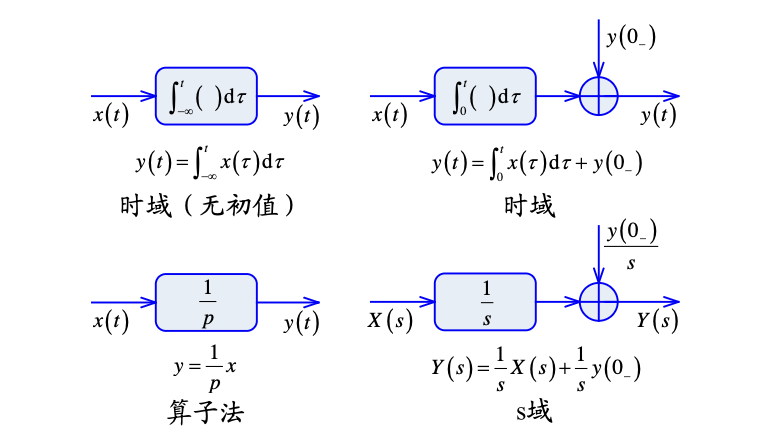
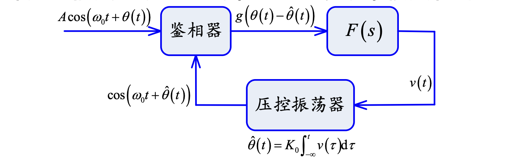
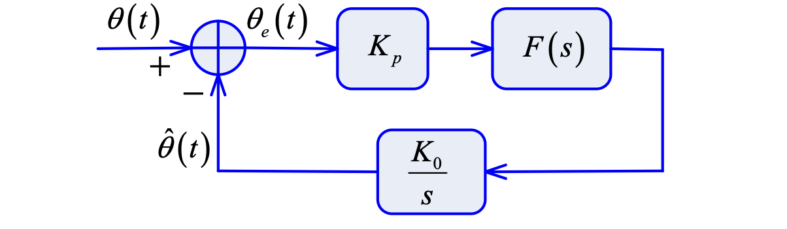
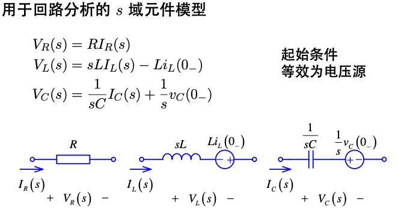
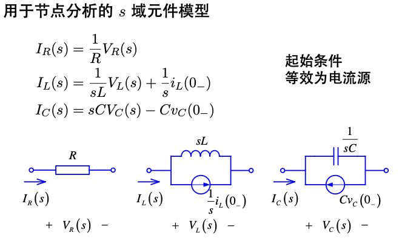
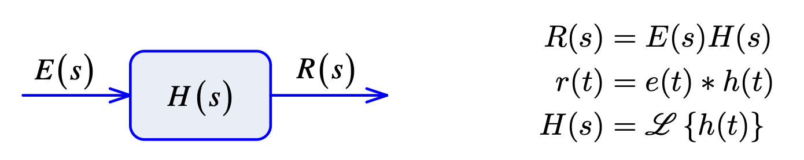
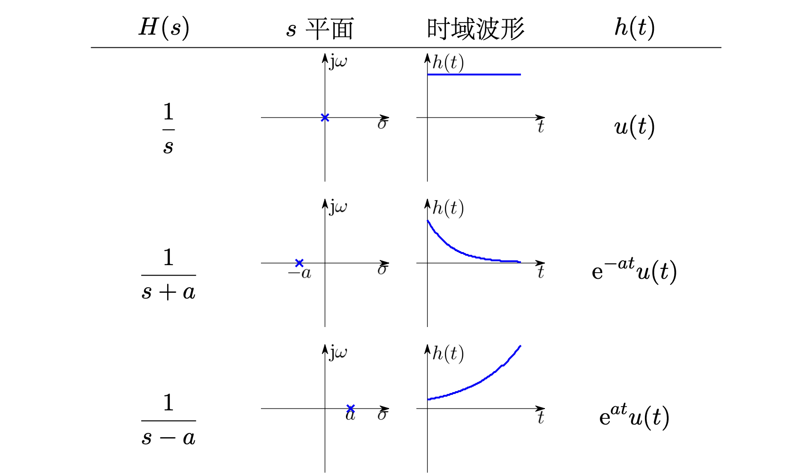
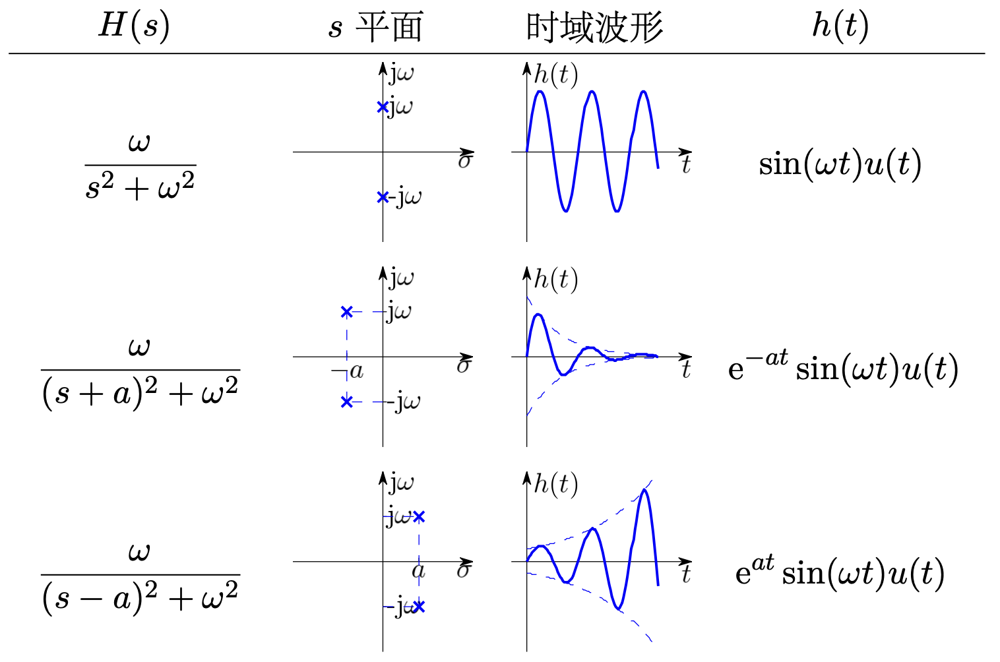
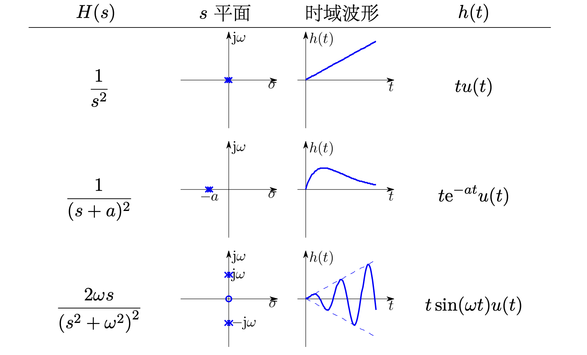
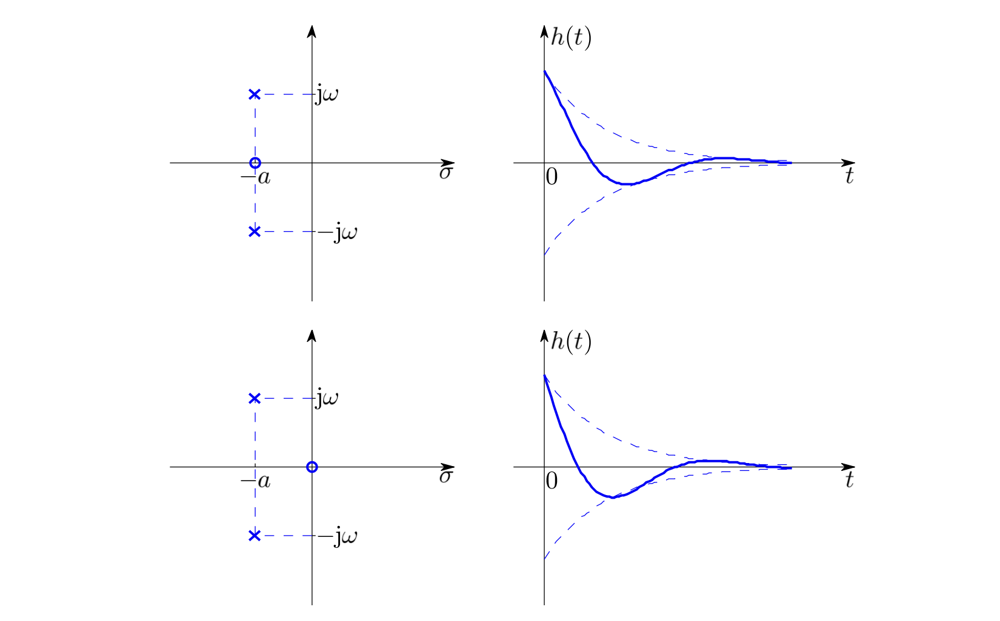

!!! info  "说明"
    先开个坑（）

## 常用表格
### Laplace变换表

| 时域信号 $f(t)$                      | 拉普拉斯变换 $F(s)$                                 | 收敛域 (ROC)          |
|--------------------------------------|-----------------------------------------------------|-----------------------|
| $\delta(t)$                          | $1$                                                 | 全平面                |
| $u(t)$                               | $\frac{1}{s}$                                       | $\Re(s) > 0$          |
| $e^{-at}u(t)$                        | $\frac{1}{s+a}$                                     | $\Re(s) > -a$         |
| $t \cdot u(t)$                       | $\frac{1}{s^2}$                                     | $\Re(s) > 0$          |
| $\frac{t^n}{n!} u(t)$                | $\frac{1}{s^{n+1}}$                                 | $\Re(s) > 0$          |
| $\cos(\omega t)u(t)$                 | $\frac{s}{s^2 + \omega^2}$                          | $\Re(s) > 0$          |
| $\sin(\omega t)u(t)$                 | $\frac{\omega}{s^2 + \omega^2}$                     | $\Re(s) > 0$          |
| $e^{-at}\cos(\omega t)u(t)$          | $\frac{s+a}{(s+a)^2 + \omega^2}$                    | $\Re(s) > -a$         |
| $e^{-at}\sin(\omega t)u(t)$          | $\frac{\omega}{(s+a)^2 + \omega^2}$                 | $\Re(s) > -a$         |

### Z变换表
| 时域序列 $x[n]$                      | Z 变换 $X(z)$                                       | 收敛域 (ROC)          |
|--------------------------------------|-----------------------------------------------------|-----------------------|
| $\delta[n]$                          | $1$                                                 | 全平面                |
| $u[n]$                               | $\frac{1}{1 - z^{-1}}$                              | $\|z\| > 1$             |
| $a^n u[n]$                           | $\frac{1}{1 - a z^{-1}}$                            | $\|z\| > \|a\|$           |
| $n u[n]$                             | $\frac{z^{-1}}{(1 - z^{-1})^2}$                     | $\|z\| > 1$             |
| $n a^n u[n]$                         | $\frac{a z^{-1}}{(1 - a z^{-1})^2}$                 | $\|z\| > \|a\|$           |
| $\cos(\omega n)u[n]$                 | $\frac{1 - \cos\omega \, z^{-1}}{1 - 2\cos\omega \, z^{-1} + z^{-2}}$ | $\|z\| > 1$ |
| $\sin(\omega n)u[n]$                 | $\frac{\sin\omega \, z^{-1}}{1 - 2\cos\omega \, z^{-1} + z^{-2}}$     | $\|z\| > 1$ |
| $a^n \cos(\omega n)u[n]$             | $\frac{1 - a\cos\omega \, z^{-1}}{1 - 2a\cos\omega \, z^{-1} + a^2 z^{-2}}$ | $\|z\| > \|a\|$ |
| $a^n \sin(\omega n)u[n]$             | $\frac{a\sin\omega \, z^{-1}}{1 - 2a\cos\omega \, z^{-1} + a^2 z^{-2}}$     | $\|z\| > \|a\|$ |

## 基本概念

信号指一切运动或状态的变化，可抽象为函数$f(t)$。系统指由若干相互作用相互依赖的事物组合而成的、具有特定功能的整体。

通信系统的结构：

**复指数信号**：定义为

$$
f(t) = Ke^{st}=Ke^{\sigma t}\cos(\omega t)+jKe^{\sigma t}\sin(\omega t)
$$ 

**Sa信号（抽样信号）**定义为：

$$
\mathrm{Sa}(t)=\frac{\sin t}{t}\,,\mathrm{sinc}(t)=\frac{\sin(\pi t)}{\pi t}=\mathrm{Sa}(\pi t)
$$

性质：

$$
\mathrm{Sa}(0)=1\,,\mathrm{Sa}(n\pi)=0\,,\int_0^\infty\mathrm{Sa}(t)dt=\frac{\pi}{2}
$$

系统的分类：

- 线性系统-非线性系统
- 时变系统-时不变系统
- 因果系统-非因果系统
- 稳定系统-不稳定系统
- 连续时间系统-离散时间系统

**稳定系统**：常用BIBO判别，对于任意有界输入$e(t)$，输出$r(t)$也是有界的。

**线性系统**：满足叠加性（输入相加则响应相加）和齐次性（输入数乘则输出数乘）。

**时不变性**：系统的特性不随时间改变，即输入信号的时间平移会导致输出信号同样的时间平移。

**因果性**：若系统在$\forall t_0$时刻的输出仅与输入在$t\leq t_0$时刻的值有关，则称系统是因果的。==可以通过延时将非因果系统转化为因果系统==。

## LTI系统的时域分析
时域方法通过直接求解微分（积分）方程，利用时间作为变量进行分析。

### 系统的数学模型在时域的表示
**端口描述**：系统的输入输出关系可以用端口描述，即输入信号$e(t)$和输出信号$r(t)$之间的关系。

$$
\sum_{i=0}^nC_i\frac{\mathrm d}{\mathrm dt^i}r(t)=\sum_{j=0}^mE_j\frac{\mathrm d}{\mathrm dt^j}e(t)
$$

**状态方程描述**：引入状态向量$\mathbf s(t)$，描述系统的内部状态变化

$$
\begin{cases}
\dfrac{\mathrm{d}}{\mathrm{d}t}\mathbf s(t)=\mathbf A\mathbf s(t)+\mathbf Be(t)\\
r(t)=\mathbf C\mathbf s(t)+\mathbf D e(t)
\end{cases}
$$

**算子符号**p：定义为$\mathrm p=\frac{\mathrm d}{\mathrm dt}$，则系统的输入输出关系可以表示为：

$$
\frac{C_n\mathrm p^n+C_{n-1}\mathrm p^{n-1}+\cdots+C_0}{E_m\mathrm p^m+E_{m-1}\mathrm p^{m-1}+\cdots+E_0}r(t)=e(t)
$$

### 时域经典法求解微分方程

==略==

### 冲激响应和阶跃响应

信号可分解为冲激 (阶跃) 信号之和，根据 LTI 系统的特点，可以将冲激 (阶跃) 响应组合后得到原信号的零状态响应。

冲激信号$\delta(t)$在$t\geq 0_+$为0，因此冲激响应为齐次解

$$
h(t)=A_1e^{\alpha_1t}+A_2e^{\alpha_2t}+\cdots+A_ne^{\alpha_nt}\,,t\geq 0_+
$$

也可能出现冲激项及其各阶导数

$$
h(t)=A_1e^{\alpha_1t}+A_2e^{\alpha_2t}+\cdots+A_ne^{\alpha_nt}+D_0\delta(t)+D_1\delta'(t)+\cdots+D_{k}\delta^{(k)}(t)
$$

一般情况下$k=0$,即没有高阶导数。

**零状态响应是激励信号和冲激响应的卷积**，即

$$
r(t)=e(t)\ast h(t)=\int_{-\infty}^\infty e(\tau)h(t-\tau)\mathrm d\tau
$$

**卷积的步骤：**

1. **反褶**：将$h(\tau)$反转得到$h(-\tau)$,$\tau$为变量
1. **平移**：将$h(-\tau)$右移$t$得到$h(t-\tau)$,$t$为常量
1. **乘积**：将$e(\tau)$和$h(t-\tau)$相乘得到$e(\tau)h(t-\tau)$
1. **积分**：对**乘积**在$\tau\in(-\infty,\infty)$积分得到卷积结果$r(t)$,改变$t$的值可以取遍感兴趣的区间

若以$e^{st}$为输入，输出为

$$
\begin{aligned}
r(t)&=e^{st}\ast h(t)=\int_{-\infty}^\infty e^{s\tau}h(t-\tau)\mathrm d\tau\\
&=e^{st}\int_{-\infty}^\infty e^{-s(t-\tau)}h(t-\tau)\mathrm d\tau\\
&=e^{st}\int_{-\infty}^\infty e^{-s\tau}h(\tau)\mathrm d\tau\\
&=e^{st}H(s)\\
\text{其中}H(s)&=\int_{-\infty}^\infty e^{-s\tau}h(\tau)\mathrm d\tau
\end{aligned}
$$

可见$e^{st}$是系统的**特征函数**，对应的输出为$H(s)e^{st}$，其中$H(s)$是系统的**特征值**。

### 卷积性质

$$
f_1(t)\ast f_2(t)=\int_{-\infty}^\infty f_1(\tau)f_2(t-\tau)\mathrm d\tau
$$

**代数性质**：

1. **交换律：**$f_1\ast f_2=f_2\ast f_1$
1. **结合律**：$(f_1\ast f_2)\ast f_3=f_1\ast(f_2\ast f_3)$
1. **分配律**：

$$
f_1\ast(f_2+f_3)=f_1\ast f_2+f_1\ast f_3
$$

**拓扑性质**

1. **微分性质**：$\dfrac{\mathrm d}{\mathrm dt}(f_1(t)\ast f_2(t))=\dfrac{\mathrm df_1(t)}{\mathrm dt}\ast f_2(t)$
1. **积分性质**：$\displaystyle\int_{-\infty}^t f_1(\tau)\ast f_2(\tau)\mathrm d\tau=\int_{-\infty}^t f_1(\tau)\mathrm d\tau\ast f_2(t)$

**位移性质**：若$f_1(t)\ast f_2(t)=c(t)$，则

$$
f_1(t-T_1)\ast f_2(t-T_2)=c(t-T_1-T_2)
$$

**筛选特性**：$f(t)\ast\delta(t-t_0)=f(t-t_0)$  

## Fourier 变换
当代通信系统和信号处理技术的发展处处伴随着傅里叶变换的精心应用。作为一种变换方法，傅里叶变换启发引领了一系列变换方法的产生：陆续出现了短时傅里叶变换、Gabor 展开、Wigner-Wille 分布、小波变换、子带编码等众多研究课题。

### 傅立叶级数
周期信号可以表示为一系列三角函数的叠加，即傅立叶级数：

$$
f(t)=a_0+\sum_{n=1}^\infty\left[a_n\cos\left(\frac{2\pi nt}{T}\right)+b_n\sin\left(\frac{2\pi nt}{T}\right)\right]
$$

其中系数

$$
\begin{aligned}
a_0&=\frac{1}{T}\int_{t_0}^{t_0+T}f(t)\mathrm dt\\
a_n&=\frac{2}{T}\int_{t_0}^{t_0+T}f(t)\cos\left(\frac{2\pi nt}{T}\right)\mathrm dt\\
b_n&=\frac{2}{T}\int_{t_0}^{t_0+T}f(t)\sin\left(\frac{2\pi nt}{T}\right)\mathrm dt
\end{aligned}
$$

傅立叶级数展开有 ==充分不必要条件== *Dirichlet条件*，即在一个周期内

1. 间断点有限
1. 极值点有限
1. 绝对可积，即 $\displaystyle \int_{t_0}^{t_0+T}|f(t)|\mathrm dt<\infty$

傅立叶级数的另一种形式：

$$
f(t)=\sum_{n=1}^\infty c_n \cos\left(\frac{2\pi nt}{T}+\varphi_n\right)+c_0
$$

其中$c_0=a_0$，$c_n=\sqrt{a_n^2+b_n^2}$，$\tan\varphi_n=\dfrac{b_n}{a_n}$。

复指数形式：

$$
f(t)=\sum_{n=-\infty}^\infty F_n e^{j\frac{2\pi nt}{T}}
$$

其中

$$
F_n=\frac{1}{T}\int_{t_0}^{t_0+T}f(t)e^{-j\frac{2\pi nt}{T}}\mathrm dt
$$

#### 对称性与傅立叶系数的关系

| 信号的对称性 | $a_n$ | $b_n$ |
|--------------|-------|-------|
| 偶对称 $f(t)=f(-t)$ | 非零  | 零    |
| 奇对称 $f(t)=-f(-t)$ | 零    | 非零  |
| 奇谐对称 $f(t)=-f(t\pm\frac{T_1}{2})$ | $a_{2n}=0$ | $b_{2n}=0$ |

#### 周期矩形脉冲信号

对应傅立叶级数

$$
F_n=\frac{E\tau}{T_1}\mathrm{Sa}\left(\frac{n\pi\tau}{T_1}\right)
$$

其谱线密度和$T_1$成反比

包络形状和$\tau$有关：

**频谱的性质**

1. 周期信号的频谱**离散**，谱线间隔$\omega_1=\dfrac{2\pi}{T_1}$。周期越大，谱线越密**变成非周期信号则谱线连续**。
1. 直流分量、基波分量和各个谐波分量的大小正比于脉幅$E$，反比于周期$T_1$。
1. 有无穷多个谱线，主要集中于第一零点以内$\omega<\dfrac{2\pi}{\tau}$。定义为频带宽度$B_\omega=\dfrac{2\pi}{\tau}$，或者$B_f=\dfrac{1}{\tau}$。

#### 方波信号

方波的波形如下：

1. 偶对称，因此只有正弦项，即只有奇次谐波分量。
1. 正负交替，没有直流分量
1. 奇谐对称，没有偶谐分量

其傅立叶级数相当于周期矩形波去掉偶次谐波分量和直流分量。

### 傅立叶变换

傅立叶变换定义为

$$
\mathscr{F}\{f(t)\}=F(\omega)=\int_{-\infty}^\infty f(t)e^{-j\omega t}\mathrm dt
$$

逆变换为

$$
\mathscr{F}^{-1}\{F(\omega)\}=f(t)=\frac{1}{2\pi}\int_{-\infty}^\infty F(\omega)e^{j\omega t}\mathrm d\omega
$$

$F(\omega)$是$f(t)$的频域表示，称为$f(t)$的频谱。$|F(\omega)|$称为幅度谱，$\varphi(\omega)=\arg F(\omega)$称为相位谱。

非周期信号包含了所有从零到无限高连续的频谱分量；各分量的幅度趋于无限小，只能用密度函数表示。周期信号的能量集中于某些频点 (谐波分量)，是离散频谱。

**傅立叶变换存在的充分非必要条件是Dirichlet条件**，即$f(t)$在全空间绝对可积。

借助奇异函数，周期信号、阶跃信号和符号函数等许多不满足绝对可积条件的信号也存在傅里叶变换。

#### 傅立叶变换的性质

**可逆性**：$\mathscr{F}^{-1}\{\mathscr{F}\{f(t)\}\}=f(t)$

**对称性**：$\mathscr{F}\{\mathscr{F}\{f(t)\}\}=2\pi f(-t)$，$\mathscr{F}^{-1}\{\mathscr{F}^{-1}\{F(\omega)\}\}=\dfrac{1}{2\pi}F(-\omega)$

**线性**：$\mathscr{F}\{a_1f_1(t)+a_2f_2(t)\}=a_1F_1(\omega)+a_2F_2(\omega)$

**衰减速率**：时域波形增加一阶可导，傅里叶变换包络的衰减速度增加$\omega^{-1}$.例如

|波形|时域性质|频谱包络|
|---------|-----|-----|
|矩形波|$f(t)$不连续| $\omega^{-1}$ |
|三角波|$f'(t)$不连续| $\omega^{-2}$ |
|升余弦波|$f''(t)$不连续| $\omega^{-3}$ |

## Laplace变换

Laplace变换即$f(t)e^{-\sigma t}$的傅里叶变换，其中$f(t)$为因果信号。

$$
F(s)=\int_{0-}^\infty f(t)e^{-st}\mathrm dt=\int_{0-}^\infty f(t)e^{-\sigma t}e^{-\mathrm j\omega t}\mathrm dt
$$

Laplace变换存在的条件：原函数 ==分段连续== 且为 ==指数阶函数== 。

??? tip "指数阶函数"
    对于给定$f(t)$，若存在$\sigma_0$满足
    
    $$
    \lim_{t\to\infty}f(t)\mathrm e^{-\sigma t}=0\,\quad\forall \sigma>\sigma_0
    $$

    则称$f(t)$为指数阶函数。

### Laplace 变换的性质

**线性:** 若$\mathscr{L}[f_1(t)]=F_1(s)$,$\mathscr{L}[f_2(t)]=F_2(s)$，对常数$K_1\,,K_2$有

$$
\mathscr{L}[K_1f_1(t)+K_2f_2(t)]=K_1F_1(s)+K_2F_2(s)
$$

---

**微分、积分性质:** $\mathscr{L}\left[\dfrac{\mathrm df(t)}{\mathrm dt}\right]=sF(s)-f(0-)$，对高阶有

$$
\displaystyle\mathscr{L}\left[\dfrac{\mathrm d^nf(t)}{\mathrm dt^n}\right]=s^nF(s)-\sum_{r=0}^{n-1}s^{n-r-1}f^{(r)}(0-)
$$

$$
\mathscr{L}\left[\int_{-\infty}^tf(\tau)\mathrm{d}\tau\right]=\frac{F(s)}{s}+\frac{\displaystyle\int_{-\infty}^{0-}f(\tau)\mathrm d\tau}{s}
$$

---

**延时 (时域平移) 性质:** $\mathscr{L}[f(t-t_0)u(t-t_0)]=e^{-st_0}F(s)\,,t_0>0$

注意有$u(t-t_0)$,就是只取$t\ge t_0$的部分。

**频移（s域平移）性质:** $\mathscr{L}[f(t)e^{-at}]=F(s+a)$

---

**尺度变换性质:** $\mathscr{L}[f(at)]=\dfrac{1}{a}F\left(\dfrac{s}{a}\right)\,,a>0$。

---

**s域微分、积分性质**

$$
\frac{\mathrm{d}F(s)}{\mathrm{d}s}=\mathscr{L}[-tf(t)]
$$

$$
\int_s^\infty F(\xi)\mathrm d\xi=\mathscr{L}{\frac{f(t)}t}
$$

---

**初值定理**

$$
\lim_{t\to 0_+}f(t)=f(0_+)=\lim_{s\to \infty}sF(s)
$$

要求$f(t)\,,f'(t)$的Laplace变换存在。

**终值定理**

$$
\lim_{t\to\infty}f(t)=\lim_{s\to0}sF(s)
$$

!!! warning "终值定理应用条件"
    1. **时域**：$\displaystyle\lim_{t\to\infty}f(t)$存在
    1. **频域**：极点必须在左半平面。

??? tip "例-锁相环分析"
    锁相环是通信接收机的重要单元，用于频率恢复和解调。现在想研究$F(s)$的特性。
    
    不妨假设鉴相器理想，即

    $$
    g\left(\theta(t)-\hat{\theta}(t)\right)=K_p\left(\theta(t)-\hat{\theta}(t)\right)
    $$

    

    相位估计误差和输入相位的关系为

    $$
    \Theta_e(s)=\frac{s}{s+K_0K_pF(s)}\Theta(s)
    $$

    当输入相位为恒定值时，即$\theta(t)=\Delta\theta u(t)$时

    $$
    \Theta_e(s)=\frac{s}{s+K_0K_pF(s)}\cdot\frac{\Delta\theta}{s}=\frac{\Delta\theta}{s+K_0K_pF(s)}
    $$

    应用终值定理得到

    $$
    \lim_{t\to\infty}\theta_e(t)=\lim_{s\to 0}\Theta_e(s)=\lim_{s\to 0}\frac{s\Delta\theta}{s+K_0K_pF(s)}=0\,,\forall F(0)\neq 0
    $$

    因此前向增益$F(s)$一定要能通过直流。

---

**卷积定理**

$$
\begin{aligned}
\text{时域}:&\mathscr{L}[f_1(t)\ast f_2(t)]=F_1(s)F_2(s)\\
\text{频域}:&\mathscr{L}[f_1(t)\cdot f_2(t)]=\boxed{\frac{1}{2\pi\mathrm{j}}}F_1(s)\ast F_2(s)
\end{aligned}
$$

### Laplace 逆变换

Laplace 的一般表达式可以写为

$$
F(s)=\frac{B(s)}{A(s)}=\frac{\displaystyle b_m\prod_{j=1}^{m}(s-z_j)}{\displaystyle a_n\prod_{i=1}^{m}(s-p_i)}
$$

!!! tip "非有理函数怎么办"
    对于连续非有理函数$F(s)$,可以用 ==伯恩斯坦多项式== 近似。若$f(x)\in\mathbb{C}[0,1]$，则其n阶伯恩斯坦多项式定义为
    
    $$
    B_n(x)=\sum_{k=0}^nf\left(\frac{x}{n}\right)C_n^kx^k(1-x)^{n-k}
    $$

    对于函数$|x|$，可以采用 ==Newman近似== ：

    $$
    r_n(x)=\frac{x\left(p_n(x)-p_n(-x)\right)}{p_n(x)+p_n(-x)}\,,p_n(x)=\sum_{k=1}^{n-1}(x+a^k)
    $$

    其中系数$a=\exp\left(-\frac{1}{\sqrt{\pi}}\right)$，$n\geq 5$时有$||x|-r_n(x)|\leq 3\exp\left(-\sqrt{n}\right)$

Laplace 逆变换可以采用部分分式分解法和留数定理求解。

#### 部分分式分解法

对于有理函数形式，假设$n>m$，即$F(s)$为真分式。

$$
\begin{aligned}
F(s)&=\frac{B(s)}{(s-p_1)(s-p_2)\cdots(s-p_n)}\\
&=\frac{K_1}{s-p_1}+\frac{K_2}{s-p_2}+\cdots+\frac{K_n}{s-p_n}
\end{aligned}
$$

其中$\left.K_i=(s-p_i)F(s)\right|_{s=p_i}$

**单根** 若$K_i\in \mathbb{R}$, 则

$$
\mathscr{L}^{-1}\left[\frac{K_i}{s-p_i}\right]=K_i\exp(p_i t)u(t)
$$

**共轭复根** 若有一堆共轭复数根$-\alpha\pm\mathrm{j}\beta$,即

$$
\begin{aligned}
F(s)&=\frac{1}{(s+\alpha-\mathrm j\beta)\cdot(s+\alpha+\mathrm j\beta)}\cdot F_1(s)\\
&=\frac{K_1}{s+\alpha-\mathrm j\beta}+\frac{K_2}{s+\alpha+\mathrm j\beta}+\cdots
\end{aligned}
$$

其中

$$
\begin{cases}
K_1=(s+\alpha-\mathrm{j}\beta)F(-\alpha+j\beta)=\frac{F_1(-\alpha+j\beta)}{2\mathrm j\beta}\\
K_2=(s+\alpha+\mathrm{j}\beta)F(-\alpha-j\beta)=\frac{F_1(-\alpha-j\beta)}{-2\mathrm j\beta}\\
\end{cases}
$$

即$K_2=K_1^\ast$。令$K_1=A+\mathrm jB$,则

$$
\begin{aligned}
\mathscr{L}^{-1}&\left[\frac{K_1}{s+\alpha-\mathrm j\beta}+\frac{K_2}{s+\alpha+\mathrm j\beta}\right]\\
&=2\exp(-\alpha t)\left(A\cos\beta t-B\sin\beta t\right)u(t)
\end{aligned}
$$

**多重根** 假设$F(s)$有一个$k$阶极点$p_1$，即

$$
\begin{aligned}
F(s)&=\frac{F_1(s)}{(s-p_1)^k}\\
&=\frac{K_{11}}{(s-p_1)^k}+\frac{K_{12}}{(s-p_1)^{k-1}}+\cdots+\frac{K_{1k}}{s-p_1}+\cdots
\end{aligned}
$$

其中$K_{11}=(s-p_1)^k F(s)\big{|}_{s=p_1}=F_1(p_1)$。为了确定$K_{12}$，考察$F_1(s)$并对其求导数：

$$
\begin{aligned}
F_1(s)&=K_{11}(s)+K_{12}(s-p_1)+\cdots+K_{1k}(s-p_1)^{k-1}+\cdots\\
\frac{\mathrm d}{\mathrm ds}F_1(s)&=0+K_{12}+\cdots+(k-1)K_{1k}(s-p_1)^{k-2}+\cdots
\end{aligned}
$$

因此$\displaystyle K_{12}=\frac{\mathrm d}{\mathrm ds}F_1(s)\big|_{s=p_1}=F_1'(p_1)$. 同理可以得到:

$$
K_{1i}=\left.\frac{1}{(i-1)!}\frac{\mathrm d^{i-1}}{\mathrm d s^{i-1}}F_1(s)\right|_{s=p_1}=\frac{1}{(i-1)!}F_1^{(i-1)}(p_1)
$$

又由于

$$
\mathscr{L}\left[t^n u(t)\right]=\frac{n!}{s^{n+1}}\Rightarrow\mathscr{L}\left[\frac{t^{n-1}\mathrm e^{p_1t}}{(n-1)!}u(t)\right]=\frac{1}{(s-p_1)^n}
$$

因此

$$
f(t)=\sum_{i=1}^{k}\frac{F_1^{(i-1)}(p_1)}{(i-1)!(k-i)!}t^{k-i}\mathrm{e}^{p_1t}u(t)+\cdots
$$

#### 留数定理法

??? note "留数的概念"
    设函数 $f(z)$ 在区域 $0<|z-z_0|<R$ 内解析。选取 $r$，使 $0<r<R$，并且作圆 $C:|z-z_0|=r$。如果 $z_0$ 是 $f(z)$ 的孤立奇点，定义函数 $f(z)$ 在孤立奇点 $z_0$ 的留数为

    $$
    \operatorname{Res}(f,z_0)=\frac{1}{2\pi j}\int_C f(z)dz
    $$

    设 $D$ 是在复平面上的一个有界区域，其边界是一条或有限条简单闭曲线 $C$。设函数 $f(z)$ 在 $D$ 内除去孤立奇点 $z_1,z_2,\cdots,z_n$ 外，在每一点都解析，并且它在 $C$ 上的每一点也解析，那么有

    $$
    \int_C f(z)dz=2\pi j\sum_{i=1}^{n}\operatorname{Res}(f,z_i)
    $$

    其中沿 $C$ 的积分取为关于区域 $D$ 的正向。
    留数的计算公式如下。
    对函数 $f(z)$ 的一阶极点 $z_0$，有

    $$
    \operatorname{Res}(f,z_0)=\lim_{z\to z_0}(z-z_0)f(z)
    $$

    对函数 $f(z)$ 的 $k(k>1)$ 阶极点 $z_0$，则有

    $$
    \operatorname{Res}(f,z_0)=\frac{1}{(k-1)!}\lim_{z\to z_0}\frac{d^{k-1}[(z-z_0)^kf(z)]}{dz^{k-1}}
    $$

考虑逆变换式和留数的关系：

$$
\begin{aligned}
f(t)&=\frac{1}{2\pi j}\int_{\sigma-j\infty}^{\sigma+j\infty}F(s)e^{st}ds\\
&=\frac{1}{2\pi j}\int_C F(s)e^{st}ds-\frac{1}{2\pi j}\int_{C_R}F(s)e^{st}ds
\end{aligned}
$$

其中 $C_R$ 是半径为无穷大的圆弧，$C$ 是 $C_R$ 和拉氏逆变换积分路径构成的闭合曲线。
根据留数定理有

$$
\frac{1}{2\pi j}\int_C F(s)e^{st}ds=\sum_{i=1}^{n}\operatorname{Res}[F(s)e^{st},z_i]
$$

若满足对 $C_R$ 上任意 $s$，有 $|F(s)|\le M_R$，且 $\lim_{R\to\infty}M_R=0$，有

$$
\lim_{R\to\infty}\left|\int_{C_R}F(s)e^{st}ds\right|=0
$$

最终得到

$$
f(t)=\sum_{i=1}^{n}\operatorname{Res}[F(s)e^{st},z_i]
$$

一阶极点情况：

$$
\begin{aligned}
F(s)&=\sum_{i=1}^{n}\frac{K_i}{s-p_i}\\
K_i&=(s-p_i)F(s)|_{s=p_i}\\
f(t)&=\sum_{i=1}^{n}K_ie^{p_it}\\
&=\sum_{i=1}^{n}(s-p_i)F(p_i)e^{p_it}
\end{aligned}
$$

用留数法有

$$
\begin{aligned}
f(t)&=\sum_{i=1}^{n}\operatorname{Res}[F(s)e^{st},p_i]\\
&=\sum_{i=1}^{n}\lim_{s\to p_i}(s-p_i)F(s)e^{st}\\
&=\sum_{i=1}^{n}(s-p_i)F(p_i)e^{p_it}
\end{aligned}
$$

高阶极点情况，假设只在 $p_1$ 处有一个 $k$ 阶极点：

$$
\begin{aligned}
F(s)&=\frac{F_1(s)}{(s-p_1)^k}\\
f(t)&=\operatorname{Res}[F(s)e^{st},p_1]\\
&=\frac{1}{(k-1)!}\lim_{s\to p_1}\frac{d^{k-1}[(s-p_1)^kF(s)e^{st}]}{ds^{k-1}}\\
&=\frac{1}{(k-1)!}\lim_{s\to p_1}\sum_{i=0}^{k-1}C_{k-1}^{i}F_1^{(i)}(s)(e^{st})^{(k-1-i)}\\
&=\frac{1}{(k-1)!}\lim_{s\to p_1}\sum_{i=1}^{k}C_{k-1}^{i-1}F_1^{(i-1)}(s)(e^{st})^{(k-i)}\\
&=\sum_{i=1}^{k}\frac{F_1^{(i-1)}(p_1)}{(i-1)!(k-i)!}t^{k-i}e^{p_1t}u(t)
\end{aligned}
$$

### S域元件模型与电路分析

!!! danger "说明"
    具体见[《电子电路与系统基础》](./fundamentals-of-electronic-circuits.md).
    
把网络中每个元件都用 s 域模型代替，串联、并联和分压分流性质都可利用，从而直接写变换式.s 域模型也称为运算阻抗,用 s 域模型时，交、直流电路的各种性质，如戴维南等效、诺顿等效都可使用。

### 系统函数

系统零状态响应的拉氏变换与激励的拉氏变换之比称为“系统函数”(或网络函数)，以 $H(s)$表示.

$E(s)\,,R(s)$可能是电压或者电流，因而 $H(s)$ 可能为阻抗、导纳或者比值.如果$E(s)$和$R(s)$在同一端口，则$H(s)$称为策动点函数(Driving point function)；否则称为转移函数或传递函数(Transfer function).

### 零极点分布与时频特性

拉氏变换建立起时域和频域的对应关系。拉氏变换将不同的电路 (系统) 统一，即不同电路可以完成同样的功能，具有相同的性质。

#### $H(s)$零极点分布与$h(t)$波形特征的对应

设$H(s)$由$n$个子系统$H_i(s)$并联而成，每个子系统又唯一一阶极点$p_i$，即

$$
H(s)=\sum_{i=1}^{n}H_i(s)=\sum_{i=1}^{n}\frac{K_i}{s-p_i}
$$

其冲激响应：

$$
h(t)=\mathscr L^{-1}[H(s)]=\sum_{i=1}^n K_i\mathrm e^{p_it}u(t)
$$

**一阶极点位置与原函数波形的对应关系**

**一阶共轭极点位置与原函数波形的对应关系**

若$p_i$是个二阶极点，即

$$
H_i(s)=\frac{K_i}{(s-p_i)^2}=K_i\frac{1}{s=p_i}\frac{1}{s-p_i}
$$

因此

$$
\begin{aligned}
h_i(t)&=K_i\mathscr L^{-1}\left[\frac{1}{s-p_i}\right]\ast\mathscr L^{-1}\left[\frac{1}{s-p_i}\right]\\
&=K_i\left[\mathrm e^{p_it}u(t)\right]\ast\left[\mathrm e^{p_it}u(t)\right]\\
&=K_iu(t)\int_0^t\mathrm e^{p_i\tau}\mathrm e^{p_i(t-\tau)}\mathrm d\tau\\
&=K_it\mathrm e^{p_it}u(t)
\end{aligned}
$$

**二阶极点位置与原函数波形的对应关系**

!!! tip "结论"
    若$H(s)$极点位于左半平面，则$h(t)$波形为衰减形式；若一阶极点且位于虚轴上，则为等幅 (常量或振荡)；其他情况(位于右半平面或二阶虚轴上) 则为增长形式.

    $H(s)$极点分布和时域波形形式有明确的对应关系，但 ==零点分布不会对时域波形发生实质影响== 。例子：

    $$
    \begin{cases}
    \mathscr L^{-1}\left[\dfrac{s+a}{(s+a)^2+\omega^2}\right]=\mathrm e^{-at}\cos\omega t\\
    \mathscr L^{-1}\left[\dfrac{s}{(s+a)^2+\omega^2}\right]=\mathrm e^{-at}\left(\cos\omega t-\dfrac{a}{\omega}\sin\omega t\right)
    \end{cases}
    $$

    衰减趋势和振荡频率都不变，只是 ==幅度和相位有些变化==

    

#### 系统对激励的响应

考虑系统输出的Laplace变换

已知系统函数和激励信号的Laplace变换

$$
H(s)=\frac{\displaystyle \prod^{m}_{j=1}(s-z_j)}{\displaystyle \prod^{n}_{i=1}(s-p_i)}\,,E(s)=\frac{\displaystyle \prod^{u}_{l=1}(s-b_l)}{\displaystyle \prod^{v}_{k=1}(s-a_k)}
$$

其中$n+v>m+u$. 可见响应$R(s)$的极点分别来自系统$H(s)$和激励源$E(s)$。

$$
R(s)=H(s)E(s)=\sum_{i=1}^n \frac{K_i}{s-p_i} + \sum_{k=1}^v\frac{W_k}{s-a_k}
$$

根据 ==极点的来源== 可以分解为自由响应 (Natural Response) 和强迫响应 (Forced Response)

$$
r(t)=\underbrace{\sum_{i=1}^nK_i\mathrm e^{p_it}}_{\text{自由响应}}+\underbrace{\sum_{k=1}^vW_k\mathrm e^{a_kt}}_{\text{强迫响应}}
$$

- 自由响应的形式只与系统函数$H(s)$, 即极点$p_i$有关
- 强迫响应的形式只与激励信号$E(s)$, 即极点$a_k$有关
- 两部分响应的系数$K_i$,$C_k$与$H(s)$,$E(s)$都有关
- 两部分的极点$p_i$和$a_k$相同时，自由响应和强迫响应不能完全分开

对于非零起始状态，有

$$
R(s)=\underbrace{\frac{C(s)}{A(s)}}_{\text{零输入响应}}+\underbrace{\frac{B(s)}{A(s)}E(s)}_{\text{零状态响应}}=\underbrace{\sum_{i=1}^n \frac{L_i}{s-p_i}}_\text{零输入响应}+\underbrace{\sum_{i=1}^n \frac{K_i}{s-p_i} + \sum_{k=1}^v\frac{W_k}{s-a_k}}_{\text{零状态响应}}
$$

$$
r(t)=\underbrace{\sum_{k=1}^nA_k\mathrm e^{\alpha_k t}}_{\text{自由响应/齐次解}}+\underbrace{r_P(t)}_{\text{强迫响应/特解}}=\underbrace{\sum_{i=1}^nL_i\mathrm e^{p_it}}_{\text{零输入响应}}+\underbrace{\sum_{i=1}^nK_i\mathrm e^{p_it}+\sum_{k=1}^vW_k\mathrm e^{a_kt}}_{\text{零状态响应}}
$$

## 通信系统
### 系统可实现性、佩里维纳准则
可实现系统要求因果性，因此无法实现理想低通滤波器等非因果系统。可以通过增大阶数（引入更多元件）改善系统性能。

频域角度，可实现性要求 ==幅度函数== $|H(j\omega)|$==满足平方可积==，即

$$
\int_{-\infty}^\infty|H(j\omega)|^2\mathrm d\omega<\infty
$$

因此根据Parsevel定理，系统 ==单位脉冲响应== $h(t)$==也是平方可积的==，即

$$
\int_{-\infty}^\infty|h(t)|^2\mathrm dt<\infty
$$

#### 佩里维纳准则
对于系统的频率响应$H(j\omega)$，如果不满足以下条件，则系统是不可实现的：

$$
\int_{-\infty}^\infty\frac{\left|\ln|H(j\omega)|\right|}{1+\omega^2}\mathrm d\omega<\infty
$$

1. $|H(j\omega)|$不能在连续区间上为零，否则$\ln|H(j\omega)|$在该区间上为负无穷，导致积分发散。
1. $\omega\to\infty$时，$|H(j\omega)|\to 0$的衰减速度受限。如高斯函数的频率响应为$H(j\omega)=e^{-\omega^2}$，则$\ln|H(j\omega)|=-\omega^2$，导致积分发散，因此不可实现。

!!! note  "注意"
    1. 佩里维纳准则是系统可实现性的必要条件，但不是充分条件。
    1. 佩里维纳准则只约束幅度，==不约束相位==
    1. 只有 ==多项式类型== 的函数和 ==双曲函数== 的频率响应满足佩里维纳准则。

#### 希尔伯特变换

佩里维纳准则约束了幅频响应，对于相位（即实虚部的相互约束），需要采用希尔伯特变换。对于因果系统

$$
h(t)=h(t)u(t)=h(t)\mathrm{sgn}(t)
$$

由于稳定性，其傅立叶变换存在

$$
H(j\omega)=\mathscr{F}\{h(t)\}=\int_{-\infty}^\infty h(t)e^{-j\omega t}\mathrm dt=R(\omega)+\mathrm jX(\omega)
$$

根据卷积定理

$$
H(j\omega)=\frac{1}{2\pi}H(j\omega)\ast \mathscr{F}\{\mathrm{sgn}(t)\}
$$

因此

$$
\begin{aligned}
R(\omega)&=\dfrac{1}{\pi}\int_{-\infty}^\infty\frac{X(\omega')}{\omega-\omega'}\mathrm d\omega'\\
X(\omega)&=-\dfrac{1}{\pi}\int_{-\infty}^\infty\frac{R(\omega')}{\omega-\omega'}\mathrm d\omega'
\end{aligned}
$$

即**实部是虚部的希尔伯特变换，虚部是实部的希尔伯特逆变换**。

**希尔伯特变换**定义为：

$$
\hat f(t)=\mathscr{H}\{f(t)\}=\frac{1}{\pi}\int_{-\infty}^\infty\frac{f(\tau)}{t-\tau}\mathrm d\tau=\boxed{f(t)\ast\frac{1}{\pi t}}
$$

逆变换

$$
f(t)=\mathscr{H}^{-1}\{\hat f(t)\}=-\frac{1}{\pi}\int_{-\infty}^\infty\frac{\hat f(\tau)}{t-\tau}\mathrm d\tau=\boxed{\hat f(t)\ast\left(-\frac{1}{\pi t}\right)}
$$

!!! note
    可逆性可以由

    $$
    \frac{1}{\pi t}\ast\left(-\frac{1}{\pi t}\right)=\delta(t)
    $$

    验证。频域上，由于

    $$
    \mathscr{F}\left\{\frac{1}{\pi t}\right\}=-j\mathrm{sgn}(\omega)\,,\mathscr{F}\left\{-\frac{1}{\pi t}\right\}=j\mathrm{sgn}(\omega)
    $$

    得到

    $$
    \mathscr{F}\{\frac{1}{\pi t}\ast\left(-\frac{1}{\pi t}\right)\}=\mathscr{F}\left\{\frac{1}{\pi t}\right\}\cdot\mathscr{F}\left\{-\frac{1}{\pi t}\right\}=-j\mathrm{sgn}(\omega)\cdot j\mathrm{sgn}(\omega)=1
    $$

### 调制解调

调制解调器 (Modem，猫) 指用电话线传送计算机数据的设备。==现代无线系统需要调制解调的原因：==

1. 大气对音频衰减严重，为传输更远将音频调到更高频带
1. 天线尺寸**与信号波长成正比**(至少十分之一)，为降低成本和
体积提高工作频段
1. 多路复用：利用同一介质传输多个信号，例如分割电台
1. 由于**零点漂移**问题，**直流放大器**难以实现

#### 抑制载波调幅（SC-AM）

**调制过程：**通过乘以载波信号$\cos(\omega_c t)$将基带信号调制到高频上

$$
F(\omega)=\frac{1}{2}\left[G(\omega-\omega_c)+G(\omega+\omega_c)\right]
$$

**解调过程：**乘以载波信号$\cos(\omega_c t)$，把信号搬回原来的位置，然后低通滤波拿到基带信号。

$$
\begin{aligned}
g_0(t)&=f(t)\cos(\omega_c t)\\
G_0(\omega)&=\frac{1}{4}\left[G(\omega-2\omega_c)+G(\omega+2\omega_c)\right]+\boxed{\frac{1}{2}G(\omega)}
\end{aligned}
$$

#### 调幅（AM）

由于SC- AM不发送载波，因此需要本地载波，实现复杂。

**调制过程：**AM在发的时候加一个直流，即发送

$$
f(t)=A[1+kg(t)]\cos(\omega_c t)
$$

其中$k=1/A$为调制深度。**AM 的包络体现调制信号，SC-AM 波形不体现。**

**解调过程：**直接包络检波解调，省去本地载波。

意义：==用更大载波功率换简单接收机==。

|        | SC-AM | AM |
|--------:|:-------:|:-----:|
| **时域** | $f(t)=g(t)\cos(\omega_0 t)$ | $f(t)=[A+g(t)]\cos(\omega_0 t)$ |
| **波形特点** | 包络不是 $g(t)$ | 包络是 $g(t)$ |
| **频域** | $G(\omega \pm \omega_0)$ ，不含 $\delta(\omega)$，无载波成分 | $G(\omega \pm \omega_0)$ ，$\delta(\omega \pm \omega_0)$，保留载波 |
| **解调** | 同步解调： 乘以 $\cos(\omega_0 t)$ 后低通滤波 | 包络检波：不需要载波 |
| **特点** | 优点：节省发射功率 缺点：接收机复杂 | 缺点：浪费发射功率 优点：接收机简单 |
| **典型应用** | 卫星通信 | 广播收音机 |

#### 单边带（SSB）
为了节省频带，只发半个边带，不影响恢复，多用于短波通信、跳频电台等。

**优点：**节省频带和发射功率

**缺点：**陡峭滤波器难以设计，所以适用于信号中无直流成分且缺少一段低频成分，此时对边带滤波器的要求放宽

#### 残留边带（VSB）
为了降低滤波器设计难度，保留部分边带，常用于电视广播。

为了保证能恢复，需要边带滤波器在$\omega_c$左右斜对称，即频率特性有

$$
H(\omega_c+\Delta\omega)+H(\omega_c-\Delta\omega)=const.
$$

VSB 是 DSB 和 SSB 的折衷，频带节省了不到一半，但是
滤波器容易实现。实例：==电视图像信号==

#### 调频（FM）和调相（PM）
**调制过程：**

* 调相是以调制信号控制载波的相位

$$
f(t)=A\cos[\omega_c t+g(t)]
$$

* 调频是以调制信号控制载波的频率

$$
f(t)=A\cos\left[\omega_c t+\int_{-\infty}^t g(\tau)\mathrm d\tau\right]
$$

**用**$g(t)$**调频即用**$\displaystyle{\int_{-\infty}^t g(\tau)\mathrm d\tau}$**调相，用**$g(t)$**调相即用**$\displaystyle{\frac{\mathrm d}{\mathrm dt}g(t)}$**调频。**

**解调过程：**以解调频为例，首先求导

$$
\frac{\mathrm d}{\mathrm dt}f(t)=-A\sin\left[\omega_c t+\int_{-\infty}^t g(\tau)\mathrm d\tau\right]\cdot\left[\omega_c+\boxed{g(t)}\right]
$$

得到一个可变频率的AM信号，经过**包络检波器**即可得到调制信号。 也可用**鉴频器或鉴相器**直接提取出频率或相位变化。

**优点**

1. 和 AM 相比，已调信号幅度保持不变，保证发射机工作在峰值功率状态
1. 信道中的加性噪声和衰落引发的幅度变化将直接加在 AM的调制信号上，但对 PM 和 FM 信号，能在很大程度上被接收机消除

#### 复用
**频分复用（FDM）**：将不同信号调制到不同载波上，利用频带分割实现多路复用。

**解复用**：通过带通滤波器提取出对应频段的信号，然后解调得到原始信号。

