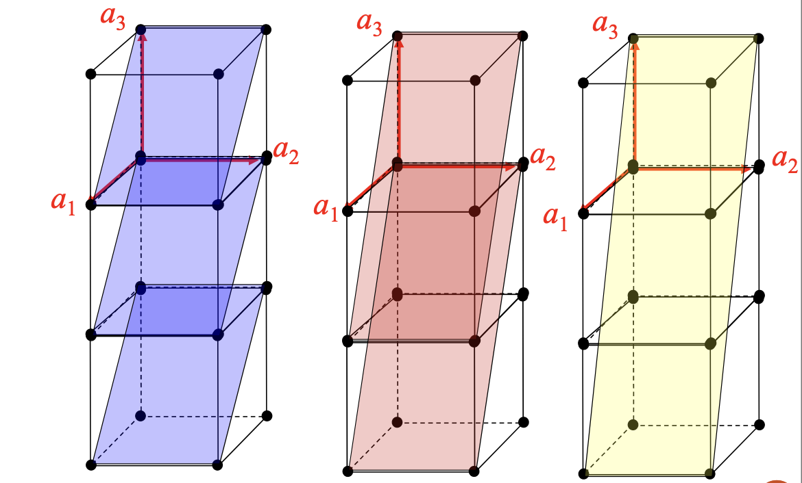
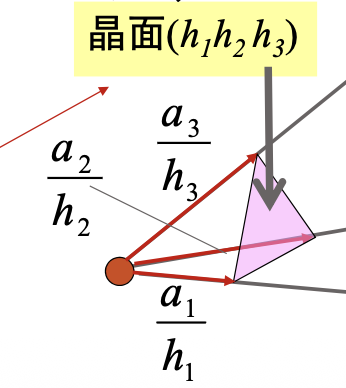
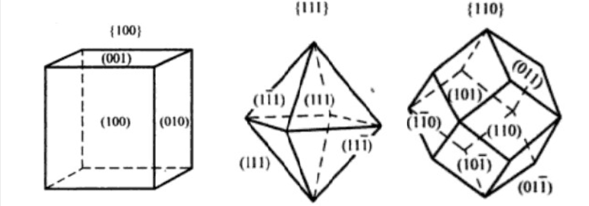
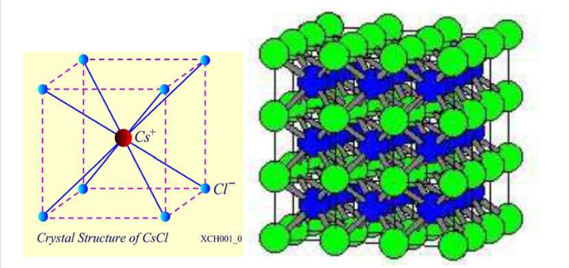
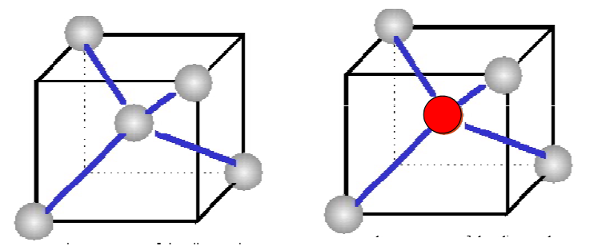
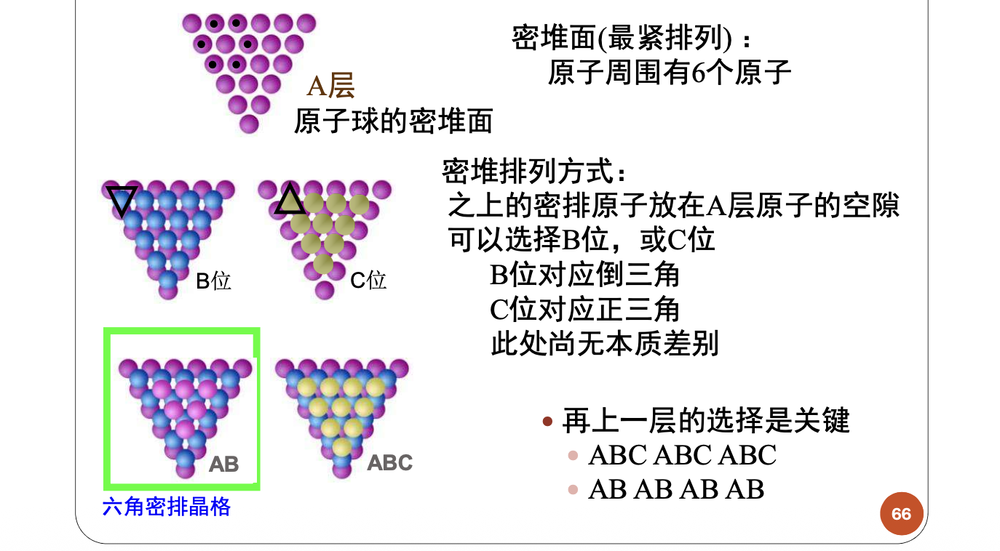
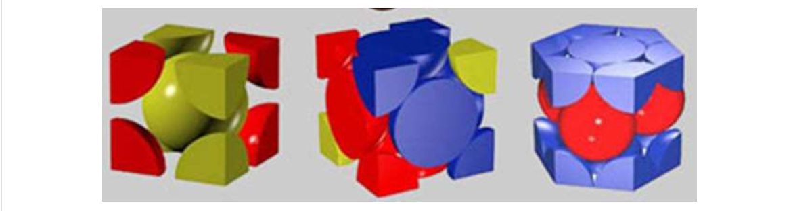
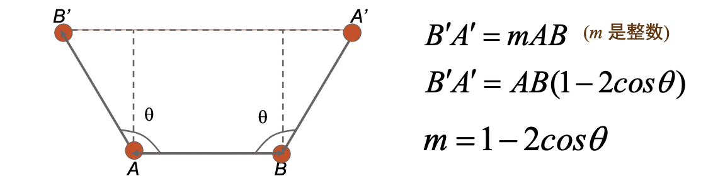
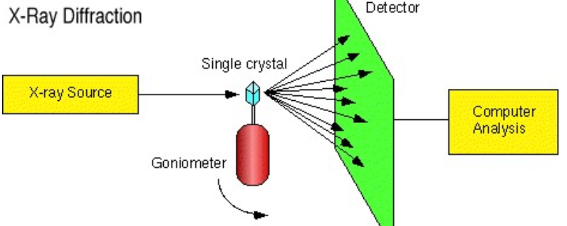
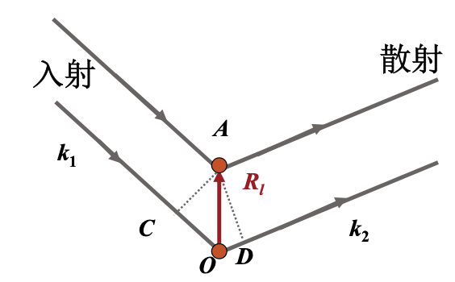

## 金属电子论

### 固体电子论的演化

1. 单个经典电子的运动
2. 假设大量电子服从经典热力学统计分布，得到**德鲁德经典电子理论**
3. 将经典电子处理成服从量子统计的Fermi子，得到**索末菲量子电子理论**
4. 引入周期性势场，得到**布洛赫电子理论**

### 德鲁德经典电子理论

德鲁德建立模型为**离子实+自由电子（价电子）**，将金属的热特性和电特性归因于自由电子的运动。

1. 孤立原子的满壳层电子（**芯电子**）仍然被束缚
2. 芯电子与原子核构成了离子实
3. 壳层外电子（**价电子**）可自由移动形成自由电子

没有碰撞时，忽略电子-电子和电子-离子间的相互作用。

* 独立电子近似——忽略**电子与电子**之间相互作用
* 自由电子近似——忽略**电子与离子**之间相互作用
* 独立自由电子近似——总能量=动能

无外场时，每个电子作匀速直线运动；存在外场时，服从牛顿定律。

假定电子与周围环境的热平衡是通过碰撞实现，碰撞前后电子速度无关，方向随机，速率由温度决定（即假设理想电子气体遵循Boltzmann统计规律）；认为**碰撞是电子突然改变的瞬时事件**，由**电子碰撞离子实**造成，忽略电子-电子碰撞。

定义了{==弛豫时间==}$\tau$,表示电子发生碰撞的平均时间间隔。单位时间内**电子发生碰撞的概率为**$\dfrac{1}{\tau}$。弛豫时间**与电子位置、速度无关**.

#### 德鲁德模型的电流密度方程

金属的直流电导定义为（Ohm定律）：

$$
\mathbf{J}=\sigma \mathbf{E}
$$

其中$\mathbf{J}$是电流密度，$\sigma$是电导率，$\mathbf{E}$是电场强度。

假定{==单位体积==}内的电子数为$n$，每个电子的电荷为$-e$，则电流密度为：

$$
\mathbf{J}=-ne\mathbf{v}_A
$$

其中$\mathbf{v}_A$是电子的平均漂移速度。

德鲁德模型认为，在$\mathrm dt$时间内，电子获得加速的概率为$1-\dfrac{\mathrm dt}{\tau}$，发生碰撞的概率为$\dfrac{\mathrm dt}{\tau}$。因此，电子的平均漂移速度满足以下方程：

$$
\mathbf{p}_A(t+\mathrm dt) = \left(1-\dfrac{\mathrm dt}{\tau}\right)\left[\mathbf{p}_A(t)-e\mathbf{E}\mathrm dt\right]+\dfrac{\mathrm dt}{\tau}\cdot 0
$$

忽略二阶小量$\mathrm d^2t$，得到：

$$
\frac{\mathrm d\mathbf{p}_A}{\mathrm dt}=-e\mathbf{E}-\dfrac{\mathbf{p}_A}{\tau}
$$

这是个一阶ODE，解得

$$
\mathbf{p}_A(t)=-e\mathbf{E}\tau+\left[\mathbf{p}_A(0)+e\mathbf{E}\tau\right]e^{-\frac{t}{\tau}}
$$

考虑稳态时，$t\to\infty$，得到：

$$
\mathbf{p}_A=-e\mathbf{E}\tau
$$

因此{==弛豫时间实际就是电场对自由电子的加速时间==},同时得到电流密度方程

$$
\mathbf{J}=\sigma \mathbf{E}=\dfrac{ne^2\tau}{m}\mathbf{E}
$$

#### 德鲁德模型的讨论

**弛豫时间由{==电子的散射*机制*==}**决定。

* 理想晶体中，没有散射。
* 真实晶体中，存在杂质、晶格缺陷等，导致电子发生散射。
    * 晶格散射：$\tau_L$与温度有关，高温下起主要作用
    * 杂质散射：$\tau_I$与温度无关，低温下起主要作用

总散射几率为二者之和，即

$$
\frac{1}{\tau}=\frac{1}{\tau_L}+\frac{1}{\tau_I}
$$

得鲁德模型取得了相当大的成功，特别是对金属。但它也存在一些问题，即大大高估了金属的电子热容。

### 索末菲电子理论

#### 量子力学基本概念

**薛定谔方程**

$$
i\hbar \frac{\partial}{\partial t}\psi(\mathbf{r},t) = \left(-\frac{\hbar^2}{2m}\nabla^2 + U(\mathbf{r})\right)\psi(\mathbf{r},t)
$$

**费米狄拉克分布**

$$
f(E) = \frac{1}{e^{\frac{E-E_F}{k_B T}} + 1}
$$

费米能级$E_F$由系统中电子总数$N$决定：

$$
\sum_{E_i}f(E_i) = N
$$

对系统所有本征态叠加。对于一维自由电子，有$E(k) = \frac{\hbar^2 k^2}{2m}$

#### 波恩卡门条件

在无穷大空间中$E$连续分布，有无穷个取值无法确定$E_F$，因此引入**周期性边界条件**，使得$k$离散化：(波恩-卡门条件)：

$$
\psi(x+Na) = \psi(x)
$$

波恩-卡门条件是{==忽略边界影响的边界条件==}。代入得到

$$
\frac{1}{\sqrt{Na}}\exp(ik_x(x+Na)) = \frac{1}{\sqrt{Na}}\exp(ik_x x)
$$

因此

$$
k_x = \frac{2\pi}{Na}n, n=0\,,1\,,2\,,\cdots
$$

**成立的条件**:{==忽略了边界的影响，对于大量原子的情况是很好的近似==}

三维情况下，类比得到

$$
k_{x,y,z} = \frac{2\pi}{L_{x,y,z}}n_{x,y,z},\quad n_{x,y,z}=0\,,1\,,2\,,\cdots
$$

在3个坐标轴方向上两个相邻波矢状态的间隔为：

$$
\Delta k_x = \frac{2\pi}{L_x},\quad \Delta k_y = \frac{2\pi}{L_y},\quad \Delta k_z = \frac{2\pi}{L_z}
$$

因此每个波矢状态（k状态）占据的体积为：

$$
\Delta k_x \Delta k_y \Delta k_z = \frac{(2\pi)^3}{V}
$$

#### 基态填充

当$T=0K$，系统的能量最低。 由于**电子的填充必须遵从Pauli原理**，即使在T＝0K时电子也不可能全部填充在能量最低的能态上。如能量最低的能态已经填有电子，其他电子就必须填到能量较高的能态上。

**自由电子的E-k关系**：

$$
E=\frac{\hbar^2}{2m}(k_x^2+k_y^2+k_z^2)
$$

**三维情况下的E-k关系——费米球**: 每个量子态对应波矢空间的一点。在k空间中，电子从能量最低的原点开始填起，能量由低到高逐层向外填充，其**等能面为球面**，一直到所有电子都填完为止。

**利用波恩-卡门条件计算费米能级**

引入态密度函数$g(E)$，则

$$
N=\int_0^{\infty}f(E) g(E) \mathrm d E
$$

壮态密度函数$g(E)$表示能量为$E$的量子态数目，也就是简并度。在能量为$E$的球体中，波矢k允许取值的总数为

$$
k\text{空间的密度}\times\text{球体的体积} = g_k\cdot\frac{4\pi}3k^3
$$

每个k取值对应一个电子能级，考虑电子自旋，每个能级可以填充自旋相反的两个电子，在能量为$E$的球体中，电子能态数目为

$$
\begin{aligned}
N(E)&=2\cdot g_k\cdot\frac{4\pi}3k^3\\
&=2\cdot\frac{V}{8\pi^3}\cdot\frac{4\pi}{3}\frac{(2m)^{3/2}}{\hbar^3}\cdot E^{3/2}\\
&=\boxed{\frac{V(2m)^{\frac{3}{2}}}{3\pi^2\hbar^3}E^{\frac{3}{2}}}
\end{aligned}
$$

进而

$$
\begin{aligned}
\mathrm dN&=\frac{V}{2\pi^2}\left(\frac{2m}{\hbar^2}\right)^{3/2}E^{1/2}\mathrm dE\\
&=g(E)\mathrm dE\\
\Rightarrow g(E)&=\frac{\mathrm dN}{\mathrm dE}=\boxed{\frac{V}{2\pi^2}\left(\frac{2m}{\hbar^2}\right)^{3/2}E^{1/2}}
\end{aligned}
$$

能量标度下的态密度 $g(E)$ ，一般简称态密度.电子的能态密度并不是均匀分布的，电子能量越高，能态密度就越大。

!!! warning "注意"
    $g_k$没有考虑自旋，但$g(E)$考虑了自旋。本课程中的同一规定：**波矢状态（k空间状态）不考虑自旋，量子态或者电子的运动状态需要考虑自旋。**

在零温下，可计算电子总数

$$
N=\int_0^{E_F^0}g(E)\mathrm dE=\frac{V}{3\pi^2}\left(\frac{2m}{\hbar^2}\right)^{3/2}(E_F^0)^{3/2}
$$

进而导出**费米能量**：

$$
E_F^0 = \frac{\hbar^2}{2m}\left(3\pi^2\frac{N}{V}\right)^{2/3}=\frac{\hbar^2}{2m}\left(3\pi^2 n\right)^{2/3}\sim 1\mathrm{eV}
$$

**费米动量**：

$$
P_F=\hbar k_F\,, E_F^0=\frac{\hbar}{2m}(3\pi^2 n)^{2/3}=\frac{\hbar^2k_F^2}{2m}
$$

**费米温度**：

$$
T_F^0 = \frac{E_F^0}{k_B} \sim 10^4\mathrm{K}
$$

!!! danger "注意"
    费米温度不是真实的温度,而是费米能量（0K时的费米能级）对应的等效温度！

$g(E)$的物理实质就是$\dfrac{\mathrm dN}{\mathrm dE}$。假设单个电子具有某个物理量$x(E)$,则0K时对应电子气系综的宏观物理量$X$可以计算为

$$
X=\int_0^{E_F^0}x(E)g(E)\mathrm dE
$$

#### 高温情形

当$T>0$时，电子热运动能量$\sim k_BT\ll E_F$。因此只有费米面附近的电子才能被激发到高能态，即只有$E－E_F= \sim k_BT$的电子才能被热激发，而能量比EF低几个kBT的电子则仍被Pauli原理所束缚，其分布与$T＝0$时相同。

能量在$E\sim E＋\mathrm dE$之间的电子数为

$$
\mathrm dN = f(E)g(E)\mathrm dE
$$

可以证明[^1]此时有

$$
E_F\approx E_F^0\left[1-\frac{\pi^2}{12}\left(\frac{k_BT}{E_F^0}\right)^2\right]
$$

#### 利用索末菲展开计算宏观物理量

**索末菲展开**：计算**自由电子费米气体**对应微观物理量$x(E)$的宏观物理量$X$的近似表达式：

$$
\begin{aligned}
X&=\int_0^{\infty}x(E)f(E)g(E)\mathrm dE\\
&=\int_0^\infty \mathrm dE\left(\frac{\mathrm df}{\mathrm dE}\right)y(E),\quad \frac{\mathrm dy(E)}{\mathrm dE}=x(E)g(E)\\
&=y(E)+\sum_{m=1}^\infty a_m(E)\frac{\mathrm d^{2m}}{\mathrm dE^{2m}}y(E)\bigg|_{E^0_F}(k_BT)^{2m}\,,a_1=\frac{\pi^2}{6}
\end{aligned}
$$

[^1]: 证明需要用到索末菲展开。参见我写的[这个博客](https://www.weitao-jiang.cn/blog_viewer.html?id=18)。

如内能

$$
U=\frac{3}{5}NE_F^0+\frac{\pi^2}{6}g(E_F^0)(k_BT)^2\,,g(E_F^0)=\frac{3}{2}\frac{N}{E_F^0}
$$

比热容

$$
c_V=\frac{\mathrm dU}{\mathrm dT}=\frac{\pi^2}{2}N\frac{k_B^2T}{E_F^0}
$$

对比经典比热容

$$
c_V^{\text{经典}} = \frac{3}{2}Nk_B
$$

可见量子统计获得的比热容比经典结果小得多，源于**泡利不相容**原理和**基态填充**。

#### 对索末菲模型的评价

索末菲模型很好的解释了多个物理量的**变化趋势**，但是仍与实验结果有偏差，主要的偏差在于

1. 电子态密度偏大
2. 比热容偏小
3. 不能真正解释电子长平均自由程、电阻与温度等问题。

| 物理量 | 经典力学 | 量子力学 |
|---|---|---|
| 能量 | $E(p)=\dfrac{p^2}{2m}$ | $E(k)=\dfrac{\hbar^2 k^2}{2m}$ |
| 电子质量 | $\dfrac{1}{m}=\dfrac{d^2E}{dp^2}$ | $\dfrac{1}{m}=\dfrac{1}{\hbar^2}\dfrac{d^2E}{dk^2}$ |
| 电子速度 | $v=\dfrac{p}{m}=\dfrac{dE}{dp}$ | $v=\dfrac{1}{\hbar}\dfrac{dE}{dk}$ |

## 晶体结构

晶体内的原子(或分子)排列是严格有序的，最基本的特征是周期结构。

研究晶体时的假设：固体表面、原子振动和缺陷对于固体性质影响很小，可以忽略

### 晶格的几何描述

* 格点：基元
* 格点排布的几何图形：晶格/点阵
* 周期性重复单元：晶胞
* 可{==完全平移==}覆盖点阵的最小单元:原胞

原胞中只包含一个格点！！

### 重要晶体结构

**简单立方**

**体心立方**

**面心立方**

**六角密排**

**简单晶格**：所有院子完全等价，{==每个格点代表一个原子==}

**复式晶格**：原子之间不等价，每个格点对应多个原子，每一种等价原子形成一个简单晶格，不同等价原子形成的简单晶格是相同的。

!!! note
    同一种原子构成的晶体，也可以是复式晶体(如金刚石)

### 惯用晶胞

**单胞**是点阵中产生完全评议覆盖并能提现旋转对称性的常用单元。原胞的选取是不唯一的，只要是最小周期性单元都可以，但实际上各种晶体结构已有习惯的原胞选取方式。

体心立方的原胞和基矢：

$$
\begin{cases}
\vec{\alpha}_1&=\dfrac{a}{2}\left(-\vec i+\vec j+\vec k\right)\\
\vec{\alpha}_2&=\dfrac{a}{2}\left(\vec i-\vec j+\vec k\right)\\
\vec{\alpha}_3&=\dfrac{a}{2}\left(\vec i+\vec j-\vec k\right)\\
\end{cases}
$$

面心立方的原胞和基矢

$$
\begin{cases}
\vec{\alpha}_1&=\dfrac{a}{2}\left(\vec j+\vec k\right)\\
\vec{\alpha}_2&=\dfrac{a}{2}\left(\vec i+\vec k\right)\\
\vec{\alpha}_3&=\dfrac{a}{2}\left(\vec i+\vec j\right)\\
\end{cases}
$$

### 晶向

微观上晶格中基元（原子或原子团）分列在一系列直线系上，这些直线都相互平行1组平行直线称为1个晶列。

晶列的方向称为晶向，不同的晶列有不同的晶向。

从一个格点沿晶向到{==最近邻格点==}的位移矢量

$$
l_1\vec{a}_1+l_2\vec{a}_2+l_3\vec{a}_3
$$

则晶向用$[l_1\,l_2\,l_3]$表示，注意用的方括号。对于负数，使用指数上加横杠的方式，如$[\bar{1}\,0\,0]$

### 等效晶向

由于对称的晶向在性质上没有区别，因此用同一个符号表示对称的几个，称为等效晶向。例如立方晶格中

* 立方边，统称$\left<1\,0\,0\right>$
* 对角线，统称$\left<1\,1\,1\right>$
* 面对角线，统称$\left<1\,1\,0\right>$

### 晶面

格子可以看作分列在平行等距的平面系上，这些平行的平面系称为晶面系（族）。

晶面的特点：

1. 晶面族一经划定，所有的格点全部包含在晶面族中无遗漏。
2. 一族晶面平行且两两等距，这是晶格周期性的必然结果。
3. 同一个格子可以有无穷多方向不同的晶面系

#### 晶面的Miller指数

以惯用晶胞为参照系分析一组晶面。所有格点都在晶面系上，所以必有一晶面通过原点，其它晶面既然相互等距，将均匀切割各坐标轴。

惯用晶胞的基矢$a_1\,,a_2\,,a_3$必定是晶面在该方向上截距的整数倍。第一个离开原点的晶面与单胞基矢轴的截距，必定是单胞基矢长的$1/h$ ($h$为整数)

$(h_1\,h_2\,h_3)$称为Miller 指数。上图中分别为

$$
\color{blue}{(1\,0\,1)}\quad\color{red}{(2\,0\,1)}\quad\color{yellow}{(3\,0\,1)}
$$

在晶体内凡晶面间距和晶面上原子的分布完全相同，只是空间位向不同的晶面可以归并为同一晶面族，以$\{h\,k\,l\}$表示，它代表由对称性相联系的若干组等效晶面的总和.

!!! warning
    晶向用方括号,等效晶向用尖括号,晶面用圆括号,晶面族用大括号。

### 布拉菲点阵中格点的讨论

**格点不一定只对应一个原子**。没有实际晶体的原子排布具有简单立方晶格的结构。

CsCl晶体对应的布拉菲格子是**简单立方**而不是体心立方

#### 四面体结构

* **金刚石晶格**：中心原子在密堆4个原子构成的4面体（球）的中心上。
* **闪锌矿晶格**：B原子在密堆4个原子构成的4面体（球）的中心上。

### 密堆描述

把原子看成是刚性的小球（**原子球**），原子球的规则堆积构成了晶体堆积

**堆积比（致密度）**：原子体积占总体积的百分数。

若以一个惯用晶胞来计算，就是晶胞中原子体积与晶胞体积之比，即 

$$
k=\frac{nv}{V}\,,v=\frac{4\pi r^3}{3}\text{为单个原子体积}
$$

### 对称素与点群

晶体的宏观对称性来源于点阵的对称性。布拉菲点阵按对三维点阵对称性进行分类，包括**七个晶系，十四种点阵**。点阵对称性是由一系列晶格对称变换来体现。

**对称变换**是某一正交变换(距离不变的变换)后整个点阵保持不变。对称变换可以由一个或多个基本对称变换组合而成。**对称素**即对称操作，由对称素组成的对称操作群称为**点群**。点阵的基本对称变换只有3种：**平移、旋转、镜反射**。

晶格的根本特性造成有限的平移对称性；同时旋转对称性也是有限的。

从而

$$
\theta=\frac{2\pi}{n}\in\{0^\circ\,,60^\circ\,,90^\circ\,,120^\circ\,,180^\circ\}
$$

其中$n=1\,,2\,,3\,,4\,,6$对应$C_1\,,C_2\,,C_3\,,C_4\,,C_6$对称素。由于对称素有限，且组合时受到的严格限制，**只能组成32个不相同的点群**。

| 晶系 | 对称性特征 | 晶胞参数 | 所属点群 | Bravais格子 |
|-----|-------------|-----------|-----------|--------------|
| 三斜 | 只有 $C_1$ 或 $C_i$ | $a\ne b\ne c$    $\alpha\ne\beta\ne\gamma$ | $C_1$, $C_i$ | 简单三斜 |
| 单斜 | 唯一 $C_2$ 或 $C_s$ | $a\ne b\ne c$   $\alpha=\gamma=90^\circ\ne\beta$ | $C_2$, $C_s$, $C_{2h}$ | 简单 / 底心 三斜 |
| 正交 | 三个 $C_2$ 或 $C_s$ | $a\ne b\ne c$   $\alpha=\beta=\gamma=90^\circ$ | $D_2$, $C_{2v}$, $D_{2h}$ | 简单 / 底心 / 体心 / 面心 正交 |
| 三方 | 唯一 $C_3$ 或 $S_6$ | $a=b=c$   $\alpha=\beta=\gamma\ne90^\circ$ | $C_3$, $S_6$, $D_3$, $C_{3v}$, $D_{3d}$ | 三角 |
| 四方 | 唯一 $C_4$ 或 $S_4$ | $a=b\ne c$   $\alpha=\beta=\gamma=90^\circ$ | $C_4$, $S_4$, $C_{4h}$, $D_4$, $C_{4v}$, $D_{2d}$, $D_{4h}$ | 简单 / 体心 四方 |
| 六方 | 唯一 $C_6$ 或 $S_3$ | $a=b\ne c$   $\alpha=\beta=90^\circ,\ \gamma=120^\circ$ | $C_6$, $C_{3h}$, $C_{6h}$, $D_6$, $C_{6v}$, $D_{3h}$, $D_{6h}$ | 六角 |
| 立方 | 四个 $C_3$ | $a=b=c$   $\alpha=\beta=\gamma=90^\circ$ | $T$, $T_h$, $T_d$, $O$, $O_h$ | 简单 / 体心 / 面心 立方 |

## 倒易点阵和布里渊区

### 晶体结构的观测手段：晶格衍射

固体中原子的周期性排列，必然使波的传播与点阵的对称性有关。

### 衍射过程的基本模型

忽略具体的散射无力机制，只讨论不同格点处散射波之间的干涉。

以O为原点，A为晶格中任一格点，其位矢为：

$$
\vec{R_l}=l_1\vec{\alpha}_1+l_2\vec{\alpha}_2+l_3\vec{\alpha}_3
$$

其中$\alpha_i$为**晶格基矢**。入射光与散射光的波矢分别为

$$
\vec k_1 = \frac{2\pi}{\lambda}\hat k_1\,,\quad\vec k_2 = \frac{2\pi}{\lambda}\hat k_2
$$

两相邻格点（A和O）的散射光程差为CO+OD，则**衍射极大条件**：

$$
\vec{R_l}\cdot(\hat k_2-\hat k_1)=n\lambda\Rightarrow\boxed{\vec{R_l}\cdot(\vec k_2-\vec k_1)=2n\pi}
$$

$n$为衍射级数，此方程为**劳厄衍射方程**。

对于晶体的空间周期结构，利用周期性

$$
F(\vec r+\vec R_n)=F(\vec r)\,,\vec{R}_n=n_1\vec{\alpha}_1+n_2\vec{\alpha}_2+n_3\vec{\alpha}_3
$$

作Fourier变换得到

$$
F(\vec{r})=\sum_k A(\vec k)\exp(\mathrm{i}\vec{k}\cdot\vec{r})
$$

其中系数

$$
A(\vec k)=\frac{1}{\Omega}\int_\Omega F(\vec r)\exp(-\mathrm i\vec k\cdot \vec r)\mathrm dr
$$

因此

$$
\begin{aligned}
A(\vec k)&=\frac{1}{\Omega}\int_\Omega F(\vec r+\vec R_n)\exp(-\mathrm i\vec k\cdot \vec r)\mathrm dr\\
&\underbrace{=}_{\vec r'=\vec r+\vec R_n}\frac{1}{\Omega}\int_\Omega F(\vec r')\exp(-\mathrm i\vec k\cdot \vec r')\mathrm dr'\exp(\mathrm i\vec k\cdot \vec R_n)\\
&=A(\vec k)\exp(\mathrm i\vec k\cdot \vec R_n)\Rightarrow \boxed{\exp(\mathrm i\vec k\cdot \vec R_n)=1}
\end{aligned}
$$

令满足上述的$\vec k$记为$\vec G_h$，全部$\vec G_h$的集合构成该布拉菲格子的**倒格子**。$\vec G_h$满足

$$
\boxed{\vec{G}_h\cdot \vec{R}_n=2\pi m\,,m\in\mathbb{Z}}
$$

**倒格子是波矢$k$空间（倒易空间）的格子。**正格子中的一族晶面$(h_1\,h_2\,h_3)$垂直与倒格矢

$$
\vec G_h = h_1\vec b_1+h_2\vec b_2+h_3\vec b_3
$$

如果正格子晶面系的面间距为$d$，则$G_h$的长度为$\dfrac{2\pi}d$.在倒格子空间，劳厄衍射方程转化为

$$
\vec{R_l}\cdot(\vec{k}_2-\vec{k}_1)=2n\pi\Rightarrow\boxed{\vec{k}_2-\vec{k}_1=n\vec{G}_h}
$$

晶格的周期性在此体现为

$$
\vec k_2 = \vec k_1 + n\vec G_h
$$

在弹性散射中，认为能量守恒

$$
\left|\vec k_2\right|=\left|\vec k_1\right|
$$

利用几何关系得到

$$
k_1\sin\theta =\frac{n}{2} G_h
$$

