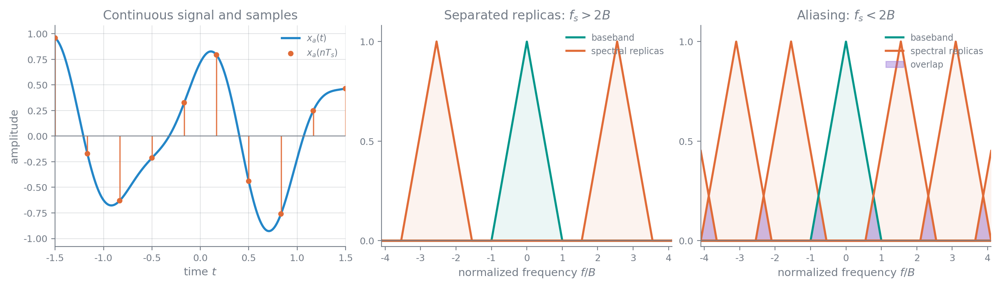

# 从连续信号到离散序列

数字信号可能直接来自离散事件的累计，例如每小时通过路口的车辆数、逐年观测的太阳黑子数；更常见的来源是对连续信号进行采样和量化。典型处理链为模拟信号 $x_a(t)$ 经 ADC 变成数字序列 $x_q[n]$，由数字处理器处理，再经 DAC 恢复为连续信号。

### 采样、量化与时间尺度

周期采样在 $t_n=nT_s$ 处读取连续信号：

$$
x[n]=x_a(nT_s),\qquad f_s=\frac{1}{T_s},\qquad \Omega_s=2\pi f_s
$$

严格来说，采样结果是数对序列 $\{(t_n,x_a(t_n))\}$。写成标量序列 $x[n]$ 时省略了 $T_s$，相当于把时间尺度归一化。序列本身只是一串数；把离散频率、时延等量还原到实际物理量时，必须重新带上采样间隔。两个频率相差很大的连续信号，在不同 $T_s$ 下可能得到完全相同的序列。

例如

$$
x_{c1}(t)=\sin(10\pi t)+2\cos(20\pi t),\qquad T_1=\frac1{100}
$$

与

$$
x_{c2}(t)=\sin(5000\pi t)+2\cos(10000\pi t),\qquad T_2=\frac1{50000}
$$

都会产生

$$
x[n]=\sin(0.1\pi n)+2\cos(0.2\pi n)
$$

这说明脱离 $T_s$ 后，序列不能唯一说明原连续信号的物理频率。实际 ADC 可用并行比较器构成 flash 结构，在一个转换周期内同时判断样本落入的量化区间。

连续角频率 $\Omega$、连续频率 $f$ 与离散角频率 $\omega$ 的对应关系为

$$
\omega=\Omega T_s=2\pi\frac{f}{f_s},\qquad \Omega=\frac{\omega}{T_s}
$$

离散复指数关于频率以 $2\pi$ 为周期：

$$
e^{j(\omega+2\pi k)n}=e^{j\omega n},\qquad k\in\mathbb Z
$$

因此常取 $\omega\in[-\pi,\pi)$ 或 $[0,2\pi)$ 为主值区间，$|\omega|=\pi$ 对应可分辨的最高振荡频率。

混叠也可直接从样本看到。例如 $s_a(t)=\sin(0.9\pi t)$ 以 $T_s=2.4\,\mathrm{s}$ 采样后，

$$
s[n]=\sin(2.16\pi n)=\sin(0.16\pi n)
$$

样本看起来只含较低的离散频率。经过这些样点的连续曲线不止一条，单凭序列无法判断原来是哪一个连续频率。

量化把样本幅值映射到有限离散集合，常用截尾或舍入。它必然丢失信息，通常写成

$$
x_q[n]=x[n]+e[n]
$$

其中 $e[n]$ 为量化误差。量化后的有限电平还要编码为二进制字，才成为处理器中的数字数据。采样在满足带限条件时可以无损，量化则一般只能用随机过程模型分析。电话语音常用每秒 8000 个样本，这一数值对应约 $4\,\mathrm{kHz}$ 的语音带宽。

### 理想冲激采样与频谱复制

这里反复用到的连续时间傅里叶变换关系包括

$$
x(t)\delta(t-t_0)=x(t_0)\delta(t-t_0),\qquad x(t)*\delta(t-t_0)=x(t-t_0)
$$

$$
e^{j\Omega_0t}\quad\overset{\mathrm{FT}}{\longleftrightarrow}\quad2\pi\delta(\Omega-\Omega_0)
$$

以及时域相乘对应频域卷积：

$$
x(t)y(t)\quad\overset{\mathrm{FT}}{\longleftrightarrow}\quad\frac{1}{2\pi}X(j\Omega)*Y(j\Omega)
$$

若 $x_p(t)$ 以 $T_0$ 为周期，傅里叶级数系数与线谱为

$$
a_k=\frac{1}{T_0}\int_{T_0}x_p(t)e^{-jk\Omega_0t}\,\mathrm dt,\qquad
X_p(j\Omega)=2\pi\sum_{k=-\infty}^{\infty}a_k\delta(\Omega-k\Omega_0)
$$

理想采样可分为“连续信号乘冲激串”和“加权冲激串转为序列”两步。周期单位冲激串及其傅里叶变换为

$$
s(t)=\sum_{n=-\infty}^{\infty}\delta(t-nT_s)
\quad\overset{\mathrm{FT}}{\longleftrightarrow}\quad
S(j\Omega)=\frac{2\pi}{T_s}\sum_{k=-\infty}^{\infty}\delta(\Omega-k\Omega_s)
$$

其中用到了冲激筛选、冲激卷积、复指数的傅里叶变换和时域相乘对应频域卷积。加权冲激串

$$
x_s(t)=x_a(t)s(t)=\sum_{n=-\infty}^{\infty}x_a(nT_s)\delta(t-nT_s)
$$

的频谱为

$$
X_s(j\Omega)=\frac{1}{T_s}\sum_{k=-\infty}^{\infty}X_a\!\left[j(\Omega-k\Omega_s)\right]
$$

而离散序列的 DTFT 与加权冲激串的频谱满足

$$
X(e^{j\omega})=X_s(j\Omega)\bigg|_{\Omega=\omega/T_s}
=\frac{1}{T_s}\sum_{k=-\infty}^{\infty}X_a\!\left[j\left(\frac{\omega}{T_s}-k\Omega_s\right)\right]
$$

采样的本质是把连续频谱以 $\Omega_s$ 为周期复制，再把频率轴按 $T_s$ 归一化，并把幅度乘以 $1/T_s$。副本重叠就是混叠；一旦发生，通常不能由样本唯一确定原信号。

### Nyquist 采样定理与重构

若连续信号带限于 $\Omega_H$，即

$$
X_a(j\Omega)=0,\qquad |\Omega|>\Omega_H
$$

则当

$$
\Omega_s=\frac{2\pi}{T_s}\ge 2\Omega_H
$$

时，$x_a(t)$ 可由 $x[n]=x_a(nT_s)$ 唯一确定。等号只有在频谱边界不会因复制而产生歧义时才能取；实际工程还要为抗混叠滤波器和采样时钟的不理想性留余量，课件给出的经验是常取 $f_s>2.5f_H$。

定理有两种直接用法：已知 $f_H$ 时确定最低采样率；已知 $f_s$ 时，在 ADC 前用抗混叠滤波器把输入限制在 $f_s/2$ 以内。例如语音主要集中在 $4\ \mathrm{kHz}$ 以下时，采样率取到 $10\ \mathrm{kHz}$ 以上即可留出余量。

理想重构先把序列变成加权冲激串，再通过理想低通滤波器。若重构通带取 $|\Omega|\le\Omega_H$，则

$$
H_r(j\Omega)=
\begin{cases}
T_s,&|\Omega|\le\Omega_H\\
0,&|\Omega|>\Omega_H
\end{cases}
$$

其冲激响应与重构公式为

$$
h_r(t)=\frac{T_s\Omega_H}{\pi}\operatorname{Sa}(\Omega_H t)
$$

这里 $\operatorname{Sa}(x)=\sin x/x$，并约定 $\operatorname{Sa}(0)=1$。

$$
x_a(t)=\frac{T_s\Omega_H}{\pi}\sum_{n=-\infty}^{\infty}x[n]\operatorname{Sa}\!\left[\Omega_H(t-nT_s)\right]
$$

在临界采样 $\Omega_H=\pi/T_s$ 时就是 sinc 插值。理想插值不可直接实现；零阶保持使用矩形插值核，一阶保持使用三角形插值核，更高阶插值继续在失真与实现复杂度之间折中。保持电路造成的频率响应下垂可用低通补偿，其通带形状取插值核傅里叶变换的倒数。精度要求还应与链路其他环节的误差一并衡量。

### 带通采样

带通信号只在 $[\Omega_L,\Omega_H]$ 及其负频带非零，带宽 $B=f_H-f_L$，中心频率 $f_c=(f_H+f_L)/2$。利用频谱空隙可以把采样率降到 $2f_H$ 以下。令第 $m$、$m+1$ 个复制频谱恰好不重叠，需满足

$$
f_L\ge mf_s-f_L,\qquad f_H\le(m+1)f_s-f_H
$$

当 $m=0$ 时是普通低通采样范围 $f_s\geq2f_H$。对

$$
m=1,2,\ldots,\left\lfloor\frac{f_L}{B}\right\rfloor
$$

无混叠采样率范围为

$$
\frac{2f_H}{m+1}\leq f_s\leq\frac{2f_L}{m}
$$

课件中的 $f_c=20\ \mathrm{MHz}$、$B=5\ \mathrm{MHz}$ 例子有 $f_L=17.5\ \mathrm{MHz}$、$f_H=22.5\ \mathrm{MHz}$，可用区间依次为 $[45,\infty)$、$[22.5,35]$、$[15,17.5]$ 和 $[11.25,11.66]\ \mathrm{MHz}$。最低范围明显小于普通 Nyquist 采样率。

以

$$
R\triangleq\frac{f_c}{B}+\frac12=\frac{f_H}{B}
$$

和归一化采样率 $f_s/B$ 作图时，工程上取严格边界

$$
\frac{2R}{m+1}<\frac{f_s}{B}<\frac{2(R-1)}m
$$

可选区域是一系列楔形尖角。实际频点不能贴着边界选择：模拟抗混叠滤波器的截止误差、保护频带以及采样时钟容差都会压缩可用区间。课件的窄带例取 $B=25\ \mathrm{kHz}$、$f_L=10702.5\ \mathrm{kHz}$，理论最低值为 $50.0117\ \mathrm{kHz}$；两侧各留 $2.5\ \mathrm{kHz}$ 保护带后，有效带宽增至 $30\ \mathrm{kHz}$，可接受范围缩为

$$
60.1120\ \mathrm{kHz}\leq f_s\leq60.1124\ \mathrm{kHz}
$$

若掌握更强先验信息，还可继续采用压缩感知等低于传统采样界的方案。

### 连续系统与离散系统的等效关系

考虑连续输入经过理想 A/D、离散系统 $H(e^{j\omega})$ 和理想 D/A 的链路。输入严格满足采样定理时，等效连续系统为

$$
H_{\mathrm{eff}}(j\Omega)=
\begin{cases}
H(e^{j\Omega T_s}),&|\Omega|<\pi/T_s\\
0,&\text{其他}
\end{cases}
$$

反过来，若希望实现带限模拟响应 $H_a(j\Omega)$，离散系统在主值区间应取

$$
H(e^{j\omega})=H_a\!\left(j\frac{\omega}{T_s}\right),\qquad |\omega|<\pi
$$

将它延拓到整个频率轴可写为

$$
H(e^{j\omega})=\sum_{k=-\infty}^{\infty}H_a\!\left[j\left(\frac{\omega}{T_s}-\frac{2\pi k}{T_s}\right)\right]
$$

对应的单位冲激响应满足冲激响应不变关系

$$
h[n]=T_s h_a(nT_s)
$$
