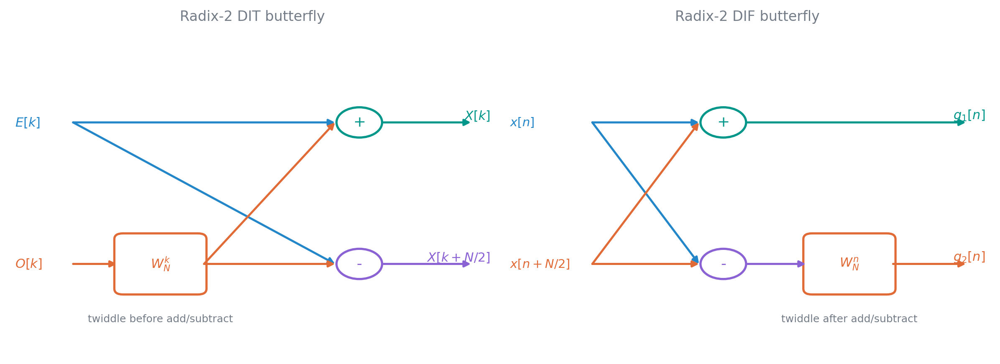
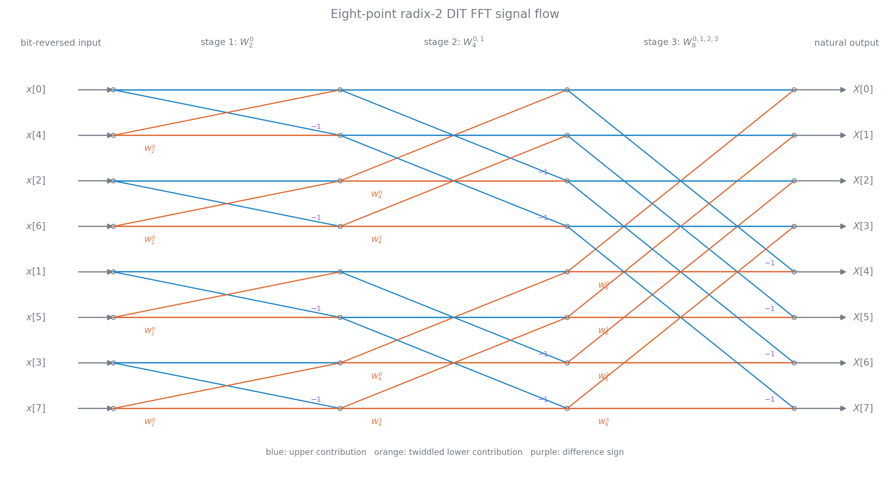

# DFT 的快速计算

### 旋转因子与基 2 分解

直接计算 $N$ 点 DFT 约需 $N^2$ 次复乘和 $N(N-1)$ 次复加。FFT 并不是另一种变换，而是利用旋转因子的周期性和对称性减少重复计算：

若一律把复乘拆成四次实乘、两次实加，直接法共约需 $4N^2$ 次实乘和 $4N^2-2N$ 次实加；$N=1024$ 时实乘已超过 400 万次。DFT 系数也可写为向量内积 $X[k]=\langle x[n],W_N^{-kn}\rangle$，其幅度受 Cauchy–Schwarz 上界约束，表示输入与第 $k$ 个简谐基的相似程度。

$$
W_N^{k+N}=W_N^k,\qquad W_N^{k+N/2}=-W_N^k,\qquad W_N^{2k}=W_{N/2}^k
$$

几个直接可用的特值和共轭关系为

$$
W_N^0=W_N^{kN}=1,\qquad W_N^{N/2}=-1,\qquad W_N^{N/4}=-j,\qquad W_N^{3N/4}=j,\qquad (W_N^k)^*=W_N^{-k}
$$

当 $N=2^m$ 时，按时间下标奇偶拆分可得基 2 时间抽取形式：

$$
X[k]=E[k]+W_N^kO[k]
$$

$$
X[k+N/2]=E[k]-W_N^kO[k],\qquad 0\leq k<N/2
$$

$E[k]$、$O[k]$ 分别是偶下标和奇下标子序列的 $N/2$ 点 DFT。不断二分直到 2 点变换，形成蝶形运算

$$
(a,b)\longmapsto(a+Wb,\ a-Wb)
$$

最末级的 2 点 DFT 就是

$$
X[0]=x[0]+x[1],\qquad X[1]=x[0]-x[1]
$$

它不需要乘法，只需两次复加减。

时间抽取的原位迭代实现通常以位倒序输入、自然顺序输出。若 $n$ 的 $m$ 位二进制表示为 $b_{m-1}\cdots b_1b_0$，位倒序下标就是 $b_0b_1\cdots b_{m-1}$。

$N=8$ 时自然序 $0,1,2,3,4,5,6,7$ 的位倒序为 $0,4,2,6,1,5,3,7$；$N=16$ 时为 $0,8,4,12,2,10,6,14,1,9,5,13,3,11,7,15$。

按频率下标奇偶拆分则得到基 2 频率抽取：

$$
X[2r]=\sum_{n=0}^{N/2-1}\bigl(x[n]+x[n+N/2]\bigr)W_{N/2}^{nr}
$$

$$
X[2r+1]=\sum_{n=0}^{N/2-1}\bigl(x[n]-x[n+N/2]\bigr)W_N^nW_{N/2}^{nr}
$$

频率抽取通常自然顺序输入、位倒序输出。时间抽取和频率抽取的信号流图互为转置，计算量相同。原位计算要求每个蝶形的两个输出能安全覆盖其两个输入，并且旧值此后不再使用；按这种数据依赖排列只需 $N$ 个存储单元，交叉依赖的等价流图则可能需要至少 $2N$，并非任意画法都可直接同址覆盖。

基 2 FFT 有 $m=\log_2N$ 层，每层 $N/2$ 个蝶形，因此复乘量约为

$$
\frac{N}{2}\log_2N
$$

复加量为

$$
N\log_2N
$$

实际实现中 $W=1,-1,\pm j$ 的乘法可化为符号和实虚部交换，运算数还会进一步减少。

例如 $N=1024$ 时，粗略复乘数由直接法的 $1{,}048{,}576$ 降到 5120，约提高 204.8 倍。

### 混合基数、基 4 与分裂基

$N$ 不必是 2 的整数次幂。若 $N=r_1r_2$，可令

$$
n=r_2n_1+n_0,\qquad k=r_1k_1+k_0
$$

先做 $r_2$ 个 $r_1$ 点 DFT，乘连接两级的 $W_N^{n_0k_0}$，再做 $r_1$ 个 $r_2$ 点 DFT并按 $k$ 整序。继续因式分解便得到混合基 FFT；相应的数据重排是混合基数的数字倒序，而不再只是二进制位倒序。以 $N=3\times5$ 为例，数字和基数都要反转：$(11)_{3\times5}=6$ 变成 $(11)_{5\times3}=4$，$(02)_{3\times5}=2$ 变成 $(20)_{5\times3}=6$。

一般地，若 $N=r_1r_2\cdots r_s$，混合基数字可写为

$$
n=d_1r_2r_3\cdots r_s+d_2r_3\cdots r_s+\cdots+d_{s-1}r_s+d_s,\qquad 0\leq d_i<r_i
$$

数字倒序同时反转数字次序和基数次序，不能只把通常的二进制位串翻转。

若两个质因子仍直接计算，粗略复乘和复加数分别为

$$
N(r_1+r_2+1),\qquad N(r_1+r_2-2)
$$

$N=5\times7=35$ 时，相对直接 DFT 的复乘、复加加速约为 2.7 和 3.4 倍。若 $N$ 含有较大的素因子，直接处理该因子会降低效率，因此工程库通常会根据长度选择分解策略。

基 4 一次把序列拆为四组，可用 $W_N^{4k}=W_{N/4}^k$ 合并更多层。经过简化，复乘量约为

$$
\frac{3}{8}N\log_2N
$$

复加量可保持在约 $N\log_2N$；未经优化的基 4 蝶形加法量则约为 $\frac32N\log_2N$。单个基 4 蝶形的直接组织需要 3 次非平凡复乘和 12 次复加，复用两两和、差后可降到 8 次复加；相较两层基 2 分解，复乘数约减少 $25\%$。

分裂基 FFT 同时使用基 2 与基 4 分解，复乘量进一步接近

$$
\frac13N\log_2N
$$

加法量仍约为 $N\log_2N$。分裂基把输入拆为一个 $N/2$ 点偶序列和两个 $N/4$ 点奇序列：

$$
x_1[r]=x[2r],\qquad x_2[l]=x[4l+1],\qquad x_3[l]=x[4l+3]
$$

令相应变换为 $X_1,X_2,X_3$，$0\leq k<N/4$ 时四个输出由

$$
X[k]=X_1[k]+W_N^kX_2[k]+W_N^{3k}X_3[k]
$$

$$
X[k+N/2]=X_1[k]-W_N^kX_2[k]-W_N^{3k}X_3[k]
$$

$$
X[k+N/4]=X_1[k+N/4]-j[W_N^kX_2[k]-W_N^{3k}X_3[k]]
$$

$$
X[k+3N/4]=X_1[k+N/4]+j[W_N^kX_2[k]-W_N^{3k}X_3[k]]
$$

组合。其 DIT 与 DIF 流图仍可由转置得到。最低算术次数并不一定带来最快程序，缓存访问、旋转因子存储、乘加指令、位倒序寻址、向量化和 VLSI 规整度同样重要。FFTW 一类库会按机器的缓存、内存与寄存器条件自动选择合适分解。

### 线性调频 Z 变换

DFT 只在单位圆上等间隔取样。线性调频 Z 变换（CZT）沿复平面上的螺旋轨迹

$$
z_k=AW^{-k},\qquad 0\leq k<M
$$

取 $Z$ 变换样本：

$$
X_{\mathrm{CZT}}[k]=\sum_{n=0}^{N-1}x[n]z_k^{-n}=\sum_{n=0}^{N-1}x[n]A^{-n}W^{nk}
$$

$A=A_0e^{j\theta_0}$ 决定起点，$W=W_0e^{-j\phi_0}$ 的模决定半径逐点变化，辐角决定采样角间隔。$W_0>1$ 时 $|z_k|=A_0W_0^{-k}$ 向内螺旋，$W_0<1$ 时向外螺旋；取 $|A|=|W|=1$ 时，轨迹是单位圆上的任意起点、任意角间隔的一段弧，因此适合放大观察窄频带。

利用

$$
nk=\frac{n^2+k^2-(k-n)^2}{2}
$$

可将 CZT 化为卷积：

$$
f[n]=x[n]A^{-n}W^{n^2/2},\quad 0\leq n<N
$$

$$
h[n]=W^{-n^2/2},\quad -(N-1)\leq n\leq M-1
$$

$$
X_{\mathrm{CZT}}[k]=W^{k^2/2}(f*h)[k]
$$

卷积补零到 $L\geq N+M-1$ 后即可用 FFT 计算。构造 $L$ 点 FFT 数组时，$h[n]$ 的负下标部分周期搬到数组尾端，中间未使用位置补零。粗略复乘量为

$$
m_{\mathrm{CZT}}=L(\log_2L+1)+M+N
$$

课件中的例子取 $N=150$，从 $\pi/4$ 起按 $2\pi/2048$ 的步长分析 $M=128$ 点，末点略低于 $3\pi/8$。若先做 2048 点 FFT 约需 11264 次复乘；CZT 的线性卷积最短为 277，取 $L=512$ 后约需 5398 次，窄带分辨率相同但无需计算无关频段。
