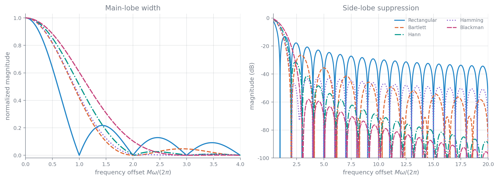
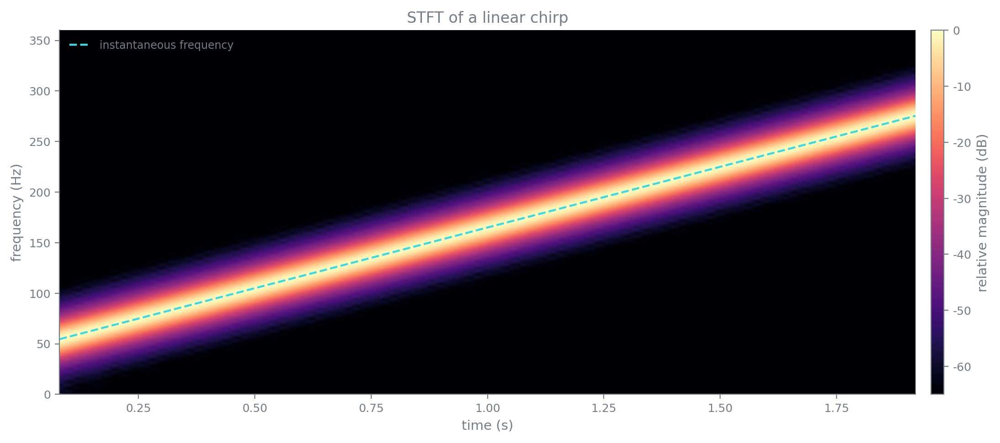

# DFT 的应用

### 用 FFT 完成长序列滤波

长度为 $L$ 的数据与长度为 $M$ 的 FIR 滤波器直接卷积，需要约 $LM$ 次乘法。把两者补零到

$$
N\geq L+M-1
$$

后，可用一次 FFT、一次逐点相乘和一次 IFFT 得到同样的线性卷积。对实数据粗略计数，FFT 方法的运算量约为

$$
4N(\log_2N+1)
$$

整体信号流安排得当时，前向 FFT 的位倒序输出可直接接后续逐点乘法和相应次序的 IFFT，数据重排可相互抵消。

小规模时直接卷积更省，序列或滤波器较长后 FFT 才占优。几个对比数据如下：

| $L$ | $M$ | FFT 长度 $N$ | 直接卷积 | FFT 卷积 |
|---:|---:|---:|---:|---:|
| 80 | 33 | 128 | 2640 | 4096 |
| 180 | 49 | 256 | 8820 | 9216 |
| 450 | 61 | 512 | 27450 | 20480 |
| 850 | 149 | 1024 | 126650 | 45056 |

FFT 长度还影响缓存、存储和等待整块数据的延迟，不能只按乘法次数选择。

对于无限长或很长的数据流，整段补零并不现实。重叠相加法把输入分成互不重叠的 $L$ 点块，每块与滤波器分别补零到 $N\geq L+M-1$，做循环卷积后，相邻输出块在 $M-1$ 点重叠区相加。设第 $r$ 块为 $x_r[n]$，则

$$
y[n]=\sum_r(x_r*h)[n-rL]
$$

重叠保留法则每次取 $N$ 点输入，相邻块重叠 $M-1$ 点。每块做 $N$ 点循环卷积后，前 $M-1$ 点受到上一周期折叠污染，直接丢弃；余下 $N-M+1$ 点就是连续的有效线性卷积输出。第一块缺少的历史样本补零。重叠相加法在输出端处理重叠，重叠保留法在输入端保留重叠，两者本质上都在控制循环卷积的时域混叠。

### 用 DFT 观察连续信号频谱

实际频谱分析链路通常包含模拟抗混叠滤波、采样与量化、截取有限记录、加窗、补零、FFT，以及把归一化频率换回物理频率。典型应用包括语音合成与识别、雷达定位、机械故障诊断和地质勘探。DTMF 电话按键把一个行频率与一个列频率叠加：行频为 $697,770,852,941\,\mathrm{Hz}$，列频为 $1209,1336,1477,1633\,\mathrm{Hz}$，同时检出一行一列即可确定按键。简单语音识别也可比较 “yes” 与 “no” 的功率谱特征，但仅凭全局谱无法描述发音的时间顺序。

若有限记录写成

$$
x_M[n]=x[n]w[n],\qquad 0\leq n<M
$$

补零到 $N$ 点后，DFT 采样对应的模拟角频率为

$$
\Omega_k=\frac{2\pi k}{NT_s}
$$

在无混叠且采用理想冲激采样的条件下，主值频带内还有幅度关系

$$
X_a(j\Omega_k)=T_sX[k]
$$

对 $k>N/2$ 的频点，应按负频率 $k-N$ 解释。只画单边幅度谱时，除直流和 Nyquist 点外，正频率幅度通常还要合并负频率一侧，具体缩放取决于所用 DFT 归一化。

例如 $f_s=10\,\mathrm{kHz}$、$N=1000$ 时，$X[57]$ 和 $X[943]$ 都对应 $\pm570\,\mathrm{Hz}$；即便两点幅度同为 432，有限记录和非栅格频率仍可能使峰值位置、峰高偏离真实正弦参数。

有限记录等于时域乘窗，所以频域是原谱与窗频谱的周期卷积。矩形窗

$$
w_R[n]=R_M[n]
$$

的频响为

$$
W_R(e^{j\omega})=e^{-j(M-1)\omega/2}\frac{\sin(M\omega/2)}{\sin(\omega/2)}
$$

主瓣两侧第一零点在 $\pm2\pi/M$，零点间宽度为 $4\pi/M$。有限窗把理想线谱展宽为窗频谱形状，旁瓣又把强分量泄漏到远处，称为频谱泄漏。信号频率未落在 DFT 栅格上时，最大谱线可能落在两个频点之间，造成栅栏效应和幅度偏低；补零把频点间隔从 $2\pi/M$ 降为 $2\pi/N$，最大频率读数误差约降到 $\pi/N$，但主瓣宽度仍由 $M$ 决定，因此不会提高真正的分辨能力。

对长度 $N$ 的单频余弦，若 $\omega_0=2\pi k_0/N$，DFT 只有 $k_0$ 与 $N-k_0$ 两条谱线：

$$
X[k]=\frac N2\delta[k-k_0]+\frac N2\delta[k-N+k_0]
$$

非栅格频率时则为两个移位 Dirichlet 核之和：

$$
\begin{aligned}
X[k]={}&\frac12e^{-j\frac{N-1}{2}(\frac{2\pi k}{N}-\omega_0)}\frac{\sin(\pi k-N\omega_0/2)}{\sin(\pi k/N-\omega_0/2)}\\
&+\frac12e^{-j\frac{N-1}{2}(\frac{2\pi k}{N}+\omega_0)}\frac{\sin(\pi k+N\omega_0/2)}{\sin(\pi k/N+\omega_0/2)}
\end{aligned}
$$

这说明“能量扩散到全部 DFT 点”完全来自有限窗与采样栅格，并不是信号真的产生了新频率。

常用窗的典型零点间主瓣宽度和最高旁瓣为：

| 窗 | 主瓣宽度 | 最高旁瓣 |
|---|---:|---:|
| 矩形窗 | $4\pi/M$ | $-13\,\mathrm{dB}$ |
| Bartlett 窗 | $8\pi/M$ | $-25\,\mathrm{dB}$ |
| Hann 窗 | $8\pi/M$ | $-31\,\mathrm{dB}$ |
| Hamming 窗 | $8\pi/M$ | $-41\,\mathrm{dB}$ |
| Blackman 窗 | $12\pi/M$ | $-57\,\mathrm{dB}$ |

主瓣窄有利于分开相邻谱线，旁瓣低有利于从强分量旁边看见弱分量，两者不能同时任意改善。实际所需记录长度常按

$$
\Delta\omega_{\mathrm{res}}\approx\frac{2\pi}{M}
$$

估算，再按窗的主瓣宽度和安全余量加长。

若最高分析频率为 $500\,\mathrm{kHz}$，按 $1\,\mathrm{MHz}$ 采样并要求约 $0.5\,\mathrm{kHz}$ 分辨率，需要 $M=2000$，即观察 $2\,\mathrm{ms}$。另一个补零例中，$f_s=1\,\mathrm{Hz}$、实际数据只有 400 点，补到 512 或 2048 点后真实分辨率仍为 $1/400\,\mathrm{Hz}$，但直接取最大点的频率误差分别可降到 $0.5/512\,\mathrm{Hz}$ 和 $0.5/2048\,\mathrm{Hz}$。

雷达示例的采样率为 $0.25\,\mathrm{MHz}$，记录 $4\,\mathrm{ms}$，所以 $M=1000$。三个多普勒分量位于 $20$、$20.47$ 和 $21.33\,\mathrm{kHz}$，第三个比主分量低 $23\,\mathrm{dB}$。矩形窗主瓣较窄，前两个分量更容易分开，但高旁瓣可能埋住第三个弱分量；Hamming 窗显著压低旁瓣，在约第 85 个频点、即 $21.25\,\mathrm{kHz}$ 附近能显出弱目标，却可能因主瓣变宽而合并前两个近邻分量。窗的选择取决于“近邻分辨”和“大动态范围检出”哪一个更重要。

### DFT 滤波器组与短时傅里叶变换

把加窗 DFT 展开为

$$
X[k]=\sum_nx[n]w[n]e^{-j2\pi kn/N}
$$

若连续信号表示为

$$
s(t)=\frac1{2\pi}\int_{-\infty}^{\infty}S(j\Omega)e^{j\Omega t}\,\mathrm d\Omega
$$

对其截取 $M$ 点并补到 $N$ 点，定义

$$
\theta_k=\Omega T_s-\frac{2\pi k}{N}=T_s(\Omega-\Omega_k)
$$

$$
\varphi_M(\theta)=\sum_{n=0}^{M-1}e^{j\theta n}=e^{j(M-1)\theta/2}\frac{\sin(M\theta/2)}{\sin(\theta/2)}
$$

则

$$
X[k]=\frac1{2\pi}\int_{-\infty}^{\infty}S(j\Omega)\varphi_M(\theta_k)\,\mathrm d\Omega
$$

因此每个 DFT 样本都等价于一个以 $\Omega_k=2\pi k/(NT_s)$ 为中心、响应形状由窗决定的带通分析滤波器输出，而不只是对一条曲线的读数。若数据窗长为 $M$、DFT 长度为 $N$，滤波器中心间隔为

$$
\frac{2\pi}{NT_s}
$$

而矩形窗分析滤波器的主瓣宽度约为

$$
\frac{4\pi}{MT_s}
$$

通常 $M\leq N$，相邻通道必有一定重叠。增大 $N$ 只是加密通道中心；增大 $M$ 才真正缩窄每个分析滤波器。

这也是经典周期图方法的固有限制。若需要突破短记录的主瓣分辨率，可利用 AR 参数模型或子空间法等现代谱估计，但它们引入了额外模型假设。

非平稳信号不能只用一张全局频谱描述。连续形式的短时傅里叶变换为

$$
X(t,j\Omega)=\int_{-\infty}^{\infty}x(\tau)w^*(\tau-t)e^{-j\Omega\tau}\,\mathrm d\tau
$$

离散实现通常写成

$$
X[m,k]=\sum_nx[n]w[n-mR]e^{-j2\pi kn/N}
$$

$R$ 是相邻帧的步长。$|X[m,k]|$ 或其对数值随时间、频率排列后得到谱图。

分段正弦示例在 $0$–$300\,\mathrm{ms}$、$300$–$600\,\mathrm{ms}$、$600$–$800\,\mathrm{ms}$、$800$–$1000\,\mathrm{ms}$ 依次为 75、50、25、10 Hz。窗长从 256 增到 512、1024、2048 时，频率线逐渐变细，但切换时刻越来越模糊。两个极端也很直观：$w(t)=1$ 时 STFT 退化为全局 FT；$w(t)=\delta(t)$ 时只剩 $x(t')e^{-j\Omega t'}$，时间位置精确，却没有局部频率分辨率。

课件中的离散 chirp 例为

$$
x[n]=\cos\!\left[\frac{2\pi}{80000}(n+1000)^2\right],\qquad 0\leq n<16000
$$

在开始、中间和结束位置各取 128 点局部 FFT，便能看到瞬时频率逐段升高。

短窗定位时间变化更准，但分析滤波器主瓣较宽；长窗频率分辨率更高，却把时刻变化平均在较长区间内。两者受时频不确定关系限制：

$$
\Delta t\,\Delta\Omega\geq\frac12
$$

音乐分析的例子中，采样率为 $8\,\mathrm{kHz}$。从 C 到 B 的一组音高约为 262、277、294、311、330、349、370、392、415、440、466、494 Hz，相邻最小间隔只有约 $15\,\mathrm{Hz}$。长度 256 的 Hamming 窗频率尺度约为 $62.5\,\mathrm{Hz}$，长度 1024 时约为 $15.6\,\mathrm{Hz}$；前者能更清楚地看到音符起止，后者更容易分辨音高。课件以 Jimi Hendrix 的《Hey Joe》片段作例，相应地采用约 200 点或 1000 点重叠，使帧间变化保持连续。[ScoreCloud](http://scorecloud.com/) 与 [Music Piano Roll Spectrograph](http://www.hotpaw.com/rhn/hotpaw/) 一类工具，本质上也在时频分析结果上继续做音高与节拍估计；前者的参考页署名为 Royal College of Music Stockholm 的 Dr. Sven Ahlback。
