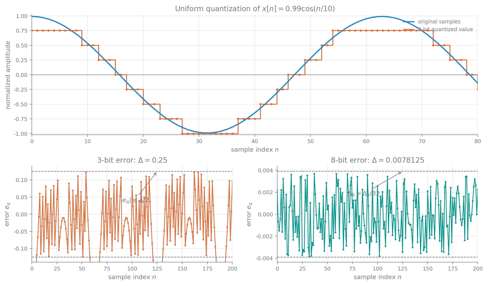

# 有限字长效应

### 数的表示与补码运算

理想离散系统与实际数字系统的主要差别是量化：输入输出数据、滤波器系数和乘法中间结果都只有有限位。误差来源包括 A/D 量化、系数量化、乘积截尾或舍入、为防止加法溢出而作的缩放，以及反馈中非线性引起的极限环。分析方法分为精确的非线性确定性模型和把误差等效为随机噪声的线性化统计模型。

$L$ 位无符号整数表示为

$$
[n_{L-1}\cdots n_0]_2=\sum_{i=0}^{L-1}n_i2^i
$$

例如 $(101101)_2=45$。定点数的小数点位置固定，硬件简单、动态范围有限；浮点数把符号、阶码和尾数分开，动态范围大但运算复杂、分辨率随量级改变。IEEE 754 单精度由 1 位符号、8 位阶码和 23 位小数组成，普通规格化数写成

$$
x=(-1)^S2^{c-127}(1.f)_2
$$

以下主要采用定点纯小数补码。

对一个符号位和 $B$ 个小数位、满幅尺度 $V_m$ 的实数，三种常见编码为：

$$
x_{\mathrm{SM}}=V_m(-1)^{b_0}\sum_{i=1}^{B}b_i2^{-i}
$$

原码直观，乘除方便，但加减前要判断符号，并有正零和负零。反码为

$$
x_{\mathrm{OC}}=V_m\left[-b_0(1-2^{-B})+\sum_{i=1}^{B}b_i2^{-i}\right]
$$

负数由正幅值逐位取反，进位需回卷到最低位，也有两个零。补码为

$$
x_{\mathrm{TC}}=V_m\left[-b_0+\sum_{i=1}^{B}b_i2^{-i}\right]
$$

负数由幅值逐位取反再加 1，加减统一为模加法，零只有一种，因而使用最广。以 6 位为例，$+0.8125$ 的原码为 $011010$，$-0.8125$ 的原码、反码、补码分别为 $111010$、$100101$、$100110$。

纯小数补码可先理解为模 2 编码：

$$
[x]_{\mathrm{补}}=\begin{cases}|x|,&0\leq x<1\\2-|x|,&-1\leq x<0\end{cases}
$$

无限位串 $(b_0\triangle b_1b_2\cdots)$ 对应实际数值

$$
x=-b_0+\sum_{i=1}^{\infty}b_i2^{-i}
$$

保留 $B$ 个小数位时，量化间隔为

$$
q=2^{-B}
$$

可表示范围是 $-1\leq x\leq1-q$。

补码加法由符号位一起参加，最高进位丢弃，本质是模 2 运算。例如 $0\triangle111+0\triangle001=1\triangle000$，即 $7/8+1/8$ 环绕为 $-1$。若最终结果在范围内，采用正常环绕溢出时，中间部分和即使暂时溢出，最终模结果仍正确：

$$
f(\cdots f(f(x_1)+x_2)\cdots+x_N)=f(x_1+\cdots+x_N)
$$

补码乘法先按符号确定结果，负数绝对值用逐位取反加 1 获得。两个 $B$ 位小数相乘产生约双倍字长，缩回单字长要截尾或舍入。截尾误差具有非零均值，可能引入直流和频谱偏差，通常更偏向舍入。例如

$$
\left(-\frac58\right)\left(-\frac38\right)=\frac{15}{64}\longrightarrow\frac28
$$

舍入误差为 $1/64$；而

$$
\left(-\frac68\right)\left(\frac28\right)=-\frac{12}{64}\longrightarrow-\frac18
$$

误差为 $1/16$。

### 随机过程与噪声通过 LTI 系统

离散随机信号是一族按随机试验索引的离散序列。完整统计描述需要所有时刻的单个和联合概率密度；实际分析多使用一、二阶矩：

$$
\mu_x[n]=\operatorname E\{x[n]\}
$$

$$
\sigma_x^2[n]=\operatorname E\{|x[n]-\mu_x[n]|^2\}=\operatorname E\{|x[n]|^2\}-|\mu_x[n]|^2
$$

$$
\phi_{xx}[n,m]=\operatorname E\{x[n]x^*[m]\}
$$

$$
\gamma_{xx}[n,m]=\operatorname E\{(x[n]-\mu_x[n])(x[m]-\mu_x[m])^*\}=\phi_{xx}[n,m]-\mu_x[n]\mu_x^*[m]
$$

严平稳要求任意阶联合分布对时间平移不变。宽平稳只要求均值为常数、方差为常数，相关只依赖时差：

$$
\phi_{xx}[n+m,n]=\phi_{xx}[m]
$$

均方有限的严平稳过程一定宽平稳，反向不一定成立。各态历经过程可用一条足够长的记录估计总体统计量，例如

$$
\widehat\mu_x=\frac1L\sum_{n=0}^{L-1}x[n]
$$

$$
\widehat\sigma_x^2=\frac1L\sum_{n=0}^{L-1}|x[n]-\widehat\mu_x|^2
$$

$$
\widehat\phi_{xx}[m]=\frac1L\sum_nx[n+m]x^*[n]
$$

宽平稳相关具有

$$
\gamma_{xx}[m]=\phi_{xx}[m]-|\mu_x|^2,\qquad \phi_{xx}[-m]=\phi_{xx}^*[m]
$$

并满足

$$
|\phi_{xx}[m]|\leq\phi_{xx}[0],\qquad |\gamma_{xx}[m]|\leq\gamma_{xx}[0]
$$

相关函数的 DTFT 是功率谱密度：

$$
\Phi_{xx}(e^{j\omega})=\sum_m\phi_{xx}[m]e^{-j\omega m}
$$

自协方差谱相应定义为

$$
\Gamma_{xx}(e^{j\omega})=\sum_m\gamma_{xx}[m]e^{-j\omega m}
$$

由于自相关和自协方差具有共轭对称性，$\Phi_{xx}$ 与 $\Gamma_{xx}$ 都是实函数；作为功率谱，它们还应非负。

零均值白噪声在不同时刻不相关：

$$
\phi_{xx}[m]=\gamma_{xx}[m]=\sigma_x^2\delta[m],\qquad \Phi_{xx}(e^{j\omega})=\sigma_x^2
$$

宽平稳输入经过稳定 LTI 系统后仍宽平稳，并有

$$
\phi_{yy}[m]=h[m]*h^*[-m]*\phi_{xx}[m]
$$

$$
\Phi_{yy}(e^{j\omega})=|H(e^{j\omega})|^2\Phi_{xx}(e^{j\omega})
$$

协方差的 Z 域形式为

$$
\Gamma_{yy}(z)=H(z)H^*(1/z^*)\Gamma_{xx}(z)
$$

对白噪声输入，输出噪声方差为系统的噪声功率增益：

$$
\sigma_y^2=\sigma_x^2\sum_n|h[n]|^2=\frac{\sigma_x^2}{2\pi}\int_{-\pi}^{\pi}|H(e^{j\omega})|^2\,\mathrm d\omega
$$

若稳定因果严格真有理系统为

$$
H(z)=A\frac{\prod_{m=1}^{M}(1-c_mz^{-1})}{\prod_{k=1}^{N}(1-d_kz^{-1})},\qquad \max_k|d_k|<1
$$

并取 $M<N$，便可直接按极点作下面的部分分式展开；$M\geq N$ 时还要先分离直接项。

白噪声输出协方差变换为

$$
\Gamma_{yy}(z)=\sigma_x^2H(z)H^*(1/z^*)
$$

其 ROC 是

$$
\max_k|d_k|<|z|<\min_k\frac1{|d_k|}
$$

将它按单位圆内、外极点配对作部分分式展开，可从 $\gamma_{yy}[0]$ 直接得到方差。

若极点均单重，令

$$
A_k=\left[H(z)H^*(1/z^*)(1-d_kz^{-1})\right]_{z=d_k}
$$

则

$$
\Gamma_{yy}(z)=\sigma_x^2\sum_{k=1}^{N}\left[\frac{A_k}{1-d_kz^{-1}}-\frac{A_k^*}{1-(d_k^*)^{-1}z^{-1}}\right]
$$

$$
\gamma_{yy}[n]=\sigma_x^2\sum_{k=1}^{N}\left[A_kd_k^nu[n]+A_k^*(d_k^*)^{-n}u[-n-1]\right]
$$

因而 $\sigma_y^2=\gamma_{yy}[0]=\sigma_x^2\sum_kA_k$。对二阶系统

$$
H(z)=\frac{1}{(1-re^{j\theta}z^{-1})(1-re^{-j\theta}z^{-1})}
$$

对白噪声的输出方差为

$$
\sigma_y^2=\sigma_x^2\frac{1+r^2}{(1-r^2)[1-2r^2\cos(2\theta)+r^4]}
$$

这种 Z 域做法比直接对 $h^2[n]$ 求和或对 $|H|^2$ 积分更容易得到闭式。

若系统内有相互不相关的误差源 $e_i[n]$，从第 $i$ 个误差点到输出的传函为 $G_i(z)$，则总方差可直接相加：

$$
\sigma_y^2=\sum_i\sigma_{e_i}^2\sum_n|g_i[n]|^2
$$

这是一套统一的有限字长噪声分析方法。

### A/D 量化噪声

一个符号位和 $B$ 个小数位、满幅 $X_m$ 的补码量化器输出为

$$
\widehat x=Q_B(x)=X_m\left(-b_0+\sum_{i=1}^{B}b_i2^{-i}\right)
$$

量化步长和范围为

$$
\Delta=X_m2^{-B},\qquad -X_m\leq\widehat x<X_m
$$

舍入时误差 $e=\widehat x-x$ 满足

$$
-\frac\Delta2<e\leq\frac\Delta2
$$

课件的数值例取

$$
x[n]=0.99\cos\frac n{10}
$$

分别作 3 bit 和 8 bit 量化。字长增加 5 位后，台阶和误差幅度都会显著缩小。

线性噪声模型写成 $\widehat x[n]=x[n]+e[n]$。当输入变化足够复杂、位数足够高且没有过载时，通常近似认为 $e[n]$ 是与输入不相关的平稳白噪声，在 $[-\Delta/2,\Delta/2]$ 上均匀分布。量化误差与输入并非严格独立，这一模型也不适用于小幅周期输入、过载或极限环。

模型给出

$$
\mu_e=0,\qquad \sigma_e^2=\frac{\Delta^2}{12}=\frac{2^{-2B}X_m^2}{12}
$$

一般输入的信噪比为

$$
\operatorname{SNR}=10\log_{10}\frac{\sigma_x^2}{\sigma_e^2}=6.02B+10.79-20\log_{10}\frac{X_m}{\sigma_x}\quad\mathrm{dB}
$$

每增加 1 位约提高 $6\,\mathrm{dB}$。对 $x=A\sin(2\pi ft)$，$\sigma_x=A/\sqrt2$，

$$
\operatorname{SNR}_{\sin}=6.02B+7.78-20\log_{10}\frac{X_m}{A}\quad\mathrm{dB}
$$

不发生过载时，提高输入幅度可改善 SNR。量化误差再通过滤波器后，若 $f=e*h$，则

$$
\mu_f=\mu_e\sum_nh[n],\qquad \sigma_f^2=\sigma_e^2\sum_n|h[n]|^2
$$

输出 SNR 应按滤波后的信号功率和这项噪声功率重新计算。

### 乘法舍入噪声与结构相关性

归一化为一个符号位和 $B$ 个小数位时，每次实乘后的舍入误差近似为独立均匀白噪声：

$$
\sigma_e^2=\frac{2^{-2B}}{12}
$$

$M$ 阶 FIR 直接型有 $M+1$ 个乘法支路，各误差直接进入输出，因此

$$
\sigma_y^2=(M+1)\sigma_e^2
$$

线性相位对称实现把共用系数的样本先相加，再作一次乘法，乘法器和舍入噪声源都约减半。

令 IIR 分母为

$$
A(z)=1-\sum_{k=1}^{N}a_kz^{-k}
$$

直接 I 型中 $N+M+1$ 个乘法误差在输出加法点汇合，并经反馈系统 $1/A(z)$ 传播：

$$
\sigma_y^2=(N+M+1)\sigma_e^2\sum_n\left|\mathcal Z^{-1}\left\{\frac1{A(z)}\right\}[n]\right|^2
$$

直接 II 型中，分母侧 $N$ 个误差经完整系统 $H(z)$，分子侧 $M+1$ 个误差直接到输出：

$$
\sigma_y^2=N\sigma_e^2\sum_n|h[n]|^2+(M+1)\sigma_e^2
$$

同一传函的不同结构因误差注入位置不同，输出噪声并不相同。课件的二阶直接 II 例在 A 点有两个误差源，其输出响应能量为 $3/7$；B 点两个误差源直接输出，响应能量为 1，故

$$
\sigma_y^2=2\sigma_e^2\frac37+2\sigma_e^2=\frac{20}{7}\sigma_e^2=\frac5{21}2^{-2B}
$$

并联 $K$ 个子系统时，设每支路滤波前、后误差方差为 $\sigma_{A_i}^2$、$\sigma_{C_i}^2$，则

$$
\sigma_f^2=\sum_{i=1}^{K}\left[\sigma_{A_i}^2\sum_n|h_i[n]|^2+\sigma_{C_i}^2\right]
$$

级联 $K$ 节时，前级误差要通过后续所有节。若第 $m$ 节为 $H_m$，则

$$
\begin{aligned}
\sigma_f^2={}&\sigma_{A_1}^2\frac1{2\pi}\int_{-\pi}^{\pi}\prod_{i=1}^{K}|H_i|^2\,\mathrm d\omega+\sigma_{C_K}^2\\
&+\sum_{m=2}^{K}(\sigma_{A_m}^2+\sigma_{C_{m-1}}^2)\frac1{2\pi}\int_{-\pi}^{\pi}\prod_{i=m}^{K}|H_i|^2\,\mathrm d\omega
\end{aligned}
$$

靠近单位圆的极点会放大舍入噪声，邻近零点可抑制它，所以级联时通常把相近零极点配成同一节。把功率增益最大的节放在前面可减少后续噪声的相对影响，却更容易使内部节点溢出，节次排序需同时考虑噪声和动态范围。

### 系数量化与零极点灵敏度

设实现系数有误差

$$
\widehat a_k=a_k+\Delta a_k,\qquad \widehat b_k=b_k+\Delta b_k
$$

把 $H=B/A$ 代入可得

$$
\widehat H=\frac{B+\Delta B}{A+\Delta A}\approx H+\frac{\Delta B}{A}-H\frac{\Delta A}{A}
$$

因此系数量化等价于在理想系统旁并联一个小误差系统，会改变频率响应；对 IIR 更重要的是极点可能移动到单位圆外。课件的 12 阶 IIR 带通在直接型系数只保留 16 位后便出现极点越过单位圆、系统失稳，说明“系数位数看起来很多”并不保证高阶直接型安全。

若

$$
A(z)=1-\sum_{n=1}^{N}a_nz^{-n}=\prod_{k=1}^{N}(1-p_kz^{-1})
$$

第 $j$ 个极点的一阶扰动为

$$
\Delta p_j=\sum_{n=1}^{N}\frac{p_j^{N-n}}{\prod_{k\neq j}(p_j-p_k)}\Delta a_n
$$

极点越密集，分母越小，灵敏度越高。高阶直接型把所有极点放在一个多项式中，级联或并联的一、二阶节能显著降低局部密度。对共轭二阶节

$$
H(z)=\frac1{1-2r\cos\theta\,z^{-1}+r^2z^{-2}}
$$

课件用 4 bit 系数量化画出可实现极点网格。系数均匀量化映射到极点平面后，实轴附近的可实现网格较稀、虚轴附近较密，因此低通和高通极点通常比带通极点敏感。改用二阶对偶等结构可形成更接近直角坐标的极点网格，说明可实现零极点集合不仅取决于字长，也取决于结构。

### 溢出、缩放与极限环

补码加法溢出有两种常见处理：正常溢出按模数环绕，饱和运算则把结果夹在最大或最小可表示值。环绕会产生很大的符号翻转，饱和不会翻转但仍是非线性；反馈系统中两者都可能造成错误或不稳定。

若内部节点

$$
w[n]=f[n]*x[n]
$$

且 $|x[n]|\leq x_{\max}$，则

$$
|w[n]|\leq x_{\max}\sum_m|f[m]|
$$

保证峰值不溢出的尺度由

$$
\beta_1=\|f\|_1=\sum_m|f[m]|
$$

给出。若只知道输入能量不超过 1，Cauchy–Schwarz 给出较宽松的

$$
\beta_2=\|f\|_2=\sqrt{\sum_m|f[m]|^2}=\sqrt{\frac1{2\pi}\int_{-\pi}^{\pi}|F(e^{j\omega})|^2\,\mathrm d\omega}
$$

且 $\beta_2\leq\beta_1$。实际信号常按 $5\beta_2$ 留峰均比余量。只需检查加法节点和增益可能大于 1 的关键节点；在正常环绕运算下，若最终加法结果不溢出，部分和节点可以暂时环绕而不影响模结果。

集中式缩放在系统输入乘 $1/\beta_{\max}$，输出再乘 $\beta_{\max}$，其中 $\beta_{\max}$ 是所有关键节点所需因子的最大值。它简单，却会让大多数节点被过度衰减，输出恢复时又放大内部噪声。分布式缩放在进入每个节点的支路乘相应 $1/\beta_i$，离开时补乘 $\beta_i$；总传函不变，信噪比通常更好，但系数和结构更复杂。相邻缩放系数可以合并，例如某支路原有系数与 $\beta_i/\beta_j$ 相乘后恰为 1，可直接消去乘法器。

课件的二阶结构例按 $5\|f\|_2$ 估计两个关键节点，得到

$$
\beta_A\approx8.53,\qquad \beta_C\approx10.92
$$

不缩放时输出噪声约为

$$
\sigma_f^2\approx0.48\cdot2^{-2B}
$$

集中式按 $\beta_C$ 缩放后，输入衰减和输出恢复使噪声上升到

$$
\sigma_f^2\approx106.3\cdot2^{-2B}
$$

分布式缩放约为

$$
\sigma_f^2\approx77.8\cdot2^{-2B}
$$

分布式优于集中式，但两者都以避免溢出为代价显著降低了信噪比。总结页另一组缩放例给出 $\beta_1=5\sqrt{15/14}$、$\beta_2=2\beta_1$、$\beta_3=5\sqrt{12/7}$，并通过合并 $2\beta_1/\beta_2=1$ 消掉一个乘法，说明缩放后的结构还应继续作系数化简。

稳定 IIR 在无限精度且输入最终为零时，输出应衰减到零。有限精度反馈中的舍入和溢出可能让系统停留在非零周期轨道，形成零输入极限环；FIR 没有反馈，不会出现这类极限环。它是确定性的非线性现象，不能用白噪声线性模型解释。对策包括采用 FIR、选择无极限环结构，或增加数据和计算字长。

### DFT 与 FFT 的有限字长

设 $N=2^m$，数据为一个符号位加 $B$ 个小数位。一次复乘含四次实乘，复乘舍入噪声方差为

$$
\sigma_B^2=4\sigma_e^2=\frac{2^{-2B}}3
$$

直接 DFT 的每个输出累加 $N$ 次复乘，故

$$
\sigma_{\mathrm{DFT}}^2=N\sigma_B^2=\frac{2^m2^{-2B}}3
$$

又因

$$
|X[k]|\leq\sum_{n=0}^{N-1}|x[n]|
$$

要保证输出不溢出，最保守的做法是在输入一次缩放 $1/N$。

FFT 每个输出所关联的蝶形误差源总数为

$$
1+2+\cdots+2^{m-1}=N-1\approx N
$$

未逐级缩放时，

$$
\sigma_{\mathrm{FFT}}^2\approx N\sigma_B^2
$$

所以 FFT 减少的是计算量，不会自动降低输出舍入噪声。蝶形输出幅度满足

$$
\max(|a|,|b|)\leq\max(|a+Wb|,|a-Wb|)\leq2\max(|a|,|b|)
$$

可在输入一次乘 $1/N$，也可在每一级蝶形前乘 $1/2$。逐级缩放时，一个蝶形含两条缩放舍入和一次复乘，误差方差为

$$
\sigma_{BI}^2=2\sigma_e^2+4\sigma_e^2=\frac{2^{-2B}}2
$$

早一级误差通过下一次 $1/2$ 缩放后方差乘 $1/4$，同时误差源数乘 2，于是

$$
\sigma_{\mathrm{FFT}}^2=\sigma_{BI}^2\sum_{r=0}^{m-1}\left(\frac12\right)^r=\left[2-\left(\frac12\right)^{m-1}\right]\sigma_{BI}^2\approx2^{-2B}
$$

它与 $N$ 近似无关；相对输入一次缩放的 DFT 或 FFT，输出 SNR 约提高 $N/3$ 倍。
