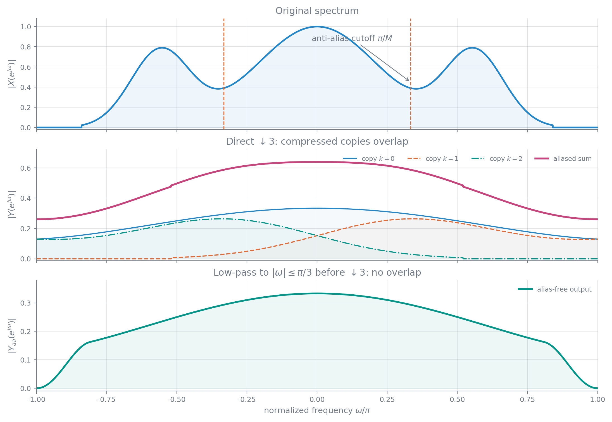
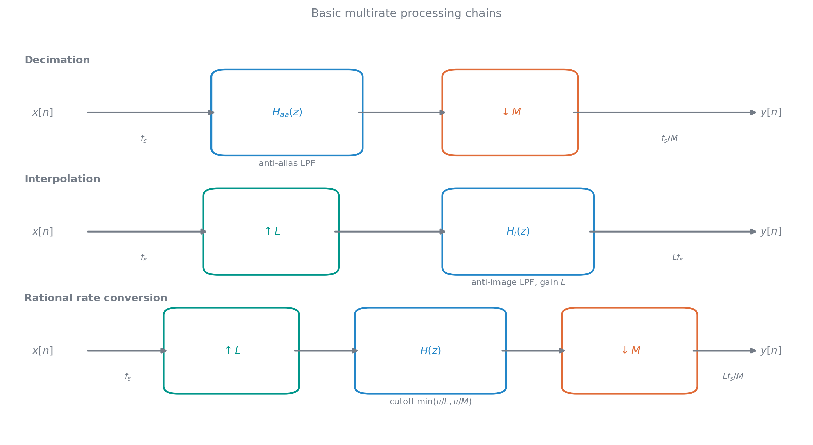
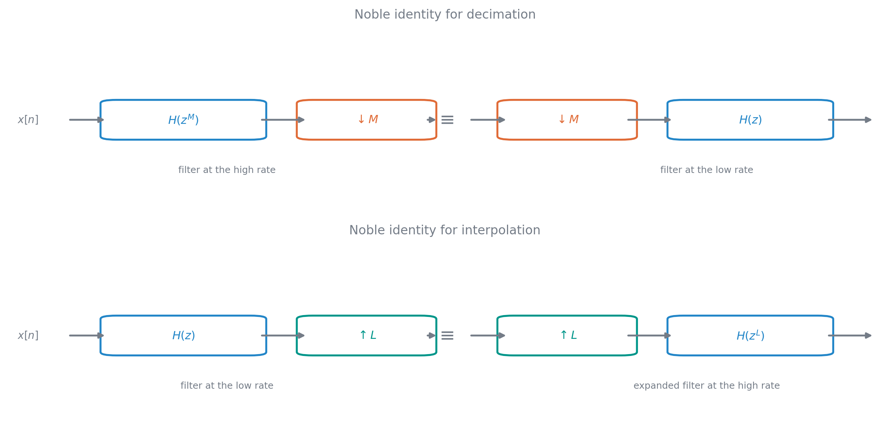
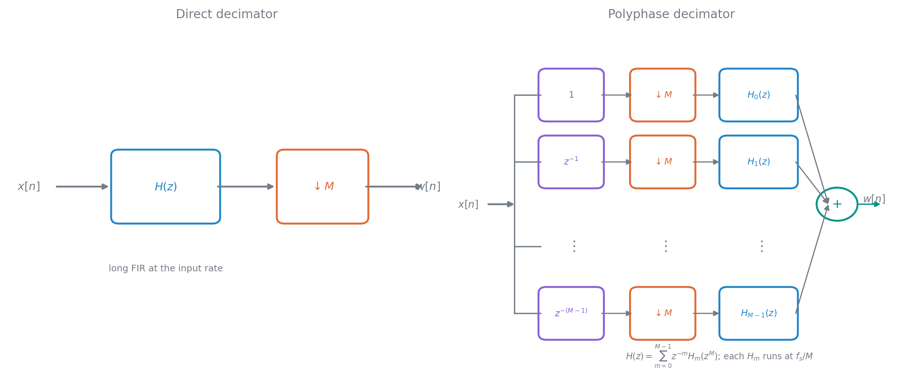
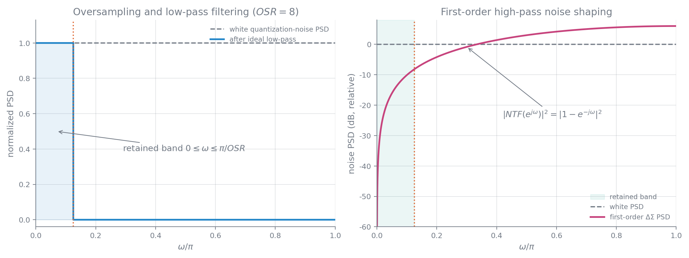

# 多采样率信号处理

### 抽取与内插

多采样率系统在处理过程中改变采样率，用于融合不同采样源、放松模拟抗混叠与重构滤波器、实现高效滤波器组，以及用过采样和噪声成型提高 A/D、D/A 的有效精度。基本操作包括整数倍降采样、整数倍升采样和 $L/M$ 有理倍转换。虽然也能先还原模拟信号再按新频率采样，直接在数字域完成通常更准确、高效。

$M$ 倍抽取保留每 $M$ 个样本中的一个：

$$
y[n]=x[Mn]
$$

在抽取前把保留位置表示为冲激串相乘：

$$
x'[n]=x[n]\sum_m\delta[n-Mm]=\frac1M\sum_{k=0}^{M-1}x[n]e^{j2\pi kn/M}
$$

因此输出频谱为

$$
Y(e^{j\omega})=\frac1M\sum_{k=0}^{M-1}X\!\left(e^{j(\omega-2\pi k)/M}\right)
$$

相同关系在 Z 域写为

$$
Y(z)=\frac1M\sum_{k=0}^{M-1}X\!\left(e^{-j2\pi k/M}z^{1/M}\right)
$$

$z^{1/M}$ 的各分支正好对应这 $M$ 个谱副本。

原谱沿频率轴扩展 $M$ 倍，$M$ 个移位副本在一个 $2\pi$ 周期内叠加，幅度乘 $1/M$。若原谱不限制在 $|\omega|\leq\pi/M$，副本相交而产生不可逆混叠；抽取前需用截止约为 $\pi/M$ 的低通滤波器。

抽取是线性的，但一般不是时不变的：输入移一位后被保留的样本集合改变，输出不等于简单移位；只有与 $M$ 对齐的移位才有特殊等价关系。

$L$ 倍内插先在相邻输入样本之间插入 $L-1$ 个零：

$$
x_L[n]=\begin{cases}x[n/L],&n=Lk\\0,&\text{其他}
\end{cases}
$$

其频谱为

$$
X_L(e^{j\omega})=X(e^{jL\omega})
$$

原谱压缩 $L$ 倍，并在 $[-\pi,\pi]$ 内出现 $L$ 个镜像。随后使用增益为 $L$、截止为 $\pi/L$ 的低通插值滤波器抑制镜像：

$$
X_i(z)=H(z)X(z^L)
$$

$$
x_i[n]=\sum_kh[n-kL]x[k]
$$

简单线性插值满足

$$
y[Lk]=x[k]
$$

$$
y[Lk+m]=\frac{L-m}{L}x[k]+\frac mLx[k+1],\qquad 1\leq m<L
$$

等效冲激响应是非因果对称三角序列

$$
h_{\mathrm{lin}}[m]=\begin{cases}1-|m|/L,&|m|<L\\0,&\text{其他}
\end{cases}
$$

频响近似为 $\operatorname{sinc}^2$，在 $2\pi/L$ 的整数倍处有零点，但镜像抑制远不如近似理想低通，不适合高精度转换。

### 过采样 D/A 与有理倍转换

传统 CD 播放链路把 $44.1\,\mathrm{kHz}$ 数据直接送入 D/A 和零阶保持，再用模拟低通重构。对双边带宽约 $40\,\mathrm{kHz}$ 的音频，模拟滤波器需在 $20$ 到 $22.05\,\mathrm{kHz}$ 的极窄过渡带内快速衰减，在约 $24\,\mathrm{kHz}$ 外达到 $80\,\mathrm{dB}$ 抑制，还要补偿零阶保持的 sinc 下垂、保持低群延迟并控制成本，实现困难。

先作 4 倍数字内插到 $176.4\,\mathrm{kHz}$，用数字低通去除镜像，再 D/A，可把零阶保持主瓣拓宽 4 倍。模拟滤波器的过渡范围约可放宽为 $44.1\,\mathrm{kHz}$ 到 $176.4\,\mathrm{kHz}$，不再承担陡峭选择和明显的通带反 sinc 补偿，硬件要求大幅降低。

$L/M$ 有理倍转换应先升采样 $L$ 倍，再滤波，最后降采样 $M$ 倍。内插和抗混叠低通可合并为

$$
H(e^{j\omega})=\begin{cases}L,&|\omega|\leq\min(\pi/L,\pi/M)\\0,&\text{其他}
\end{cases}
$$

升、降采样都是线性时变操作，不能任意交换。以 $3/2$ 转换且输入谱铺满 $[-\pi,\pi]$ 为例，先 $\uparrow3$、滤到 $\pi/3$、再 $\downarrow2$，最终谱可到 $2\pi/3$；若先 $\downarrow2$，为防混叠必须先滤到 $\pi/2$，随后再升采样，最终只到 $\pi/3$，两条链路丢失的信息不同。

### 交换恒等式、多级与多相实现

延迟与变采样满足

$$
z^{-M}\longrightarrow\downarrow M\quad\equiv\quad\downarrow M\longrightarrow z^{-1}
$$

$$
\uparrow L\longrightarrow z^{-L}\quad\equiv\quad z^{-1}\longrightarrow\uparrow L
$$

由此得到 Noble 恒等式：

$$
H(z^M)\longrightarrow\downarrow M\quad\equiv\quad\downarrow M\longrightarrow H(z)
$$

$$
H(z)\longrightarrow\uparrow L\quad\equiv\quad\uparrow L\longrightarrow H(z^L)
$$

它们把昂贵滤波搬到低采样率一侧。

若总抽取率分解为

$$
M=M_1M_2\cdots M_K
$$

多级结构 $G_1\to\downarrow M_1\to G_2\to\cdots\to G_K\to\downarrow M_K$ 的等效滤波器为

$$
H(z)=G_1(z)G_2(z^{M_1})G_3(z^{M_1M_2})\cdots G_K(z^{M_1\cdots M_{K-1}})
$$

因后级在低速下运行，每一级的相对过渡带通常也更宽。把 $8\,\mathrm{kHz}$ 降为 $800\,\mathrm{Hz}$ 的例子中，单级按 $\omega_p=0.9\pi/10$、$\omega_s=\pi/10$、$\delta_p=0.004$、$\delta_s=0.002$ 设计 Kaiser FIR，需要约 641 阶；分为 $5\times2$ 后，第二级自身过渡为 $0.9\pi/2$ 到 $\pi/2$，第一级可放宽为 $0.9\pi/10$ 到 $3\pi/10$，总计算量明显下降。

任意序列可按模 $M$ 的下标分成 $M$ 个相位。定义

$$
e_m[n]=x[nM+m],\qquad 0\leq m<M
$$

则

$$
X(z)=\sum_{m=0}^{M-1}z^{-m}E_m(z^M)
$$

滤波器同样可分解为

$$
H(z)=\sum_{m=0}^{M-1}z^{-m}H_m(z^M)
$$

课件相应页面把分解因子一处写成 $L$、框图和前后文写成 $M$，这里统一按实际抽取因子 $M$。

在抽取器中，先把 $H$ 分成 $M$ 个相位，再用 Noble 恒等式把每个子滤波器移到抽取后，便得到低速率多相结构。若原 FIR 长度为 $N$、输入速率为 $R$，直接滤波约需 $NR$ 次乘法每秒；多相结构有 $M$ 个约 $N/M$ 长的子滤波器，每个以 $R/M$ 的速率处理，总量约为

$$
\frac{NR}{M}
$$

整数倍内插也可按同样方式在低速侧计算各个相位，只生成实际需要的非零输出，而不对插入的零作无用乘法。

### 过采样量化与噪声成型

设模拟信号带宽只占过采样后 Nyquist 带宽的 $1/M$。量化后先用截止 $\pi/M$ 的数字低通，再抽取 $M$ 倍。对宽平稳信号，采样和无混叠降采样只重新标定 PSD 的频率和幅度，不改变其面积，因而信号功率保持不变。

连续宽平稳过程采样后有

$$
\phi_{xx}[m]=\phi_{x_ax_a}(mT_s),\qquad \operatorname E\{|x[n]|^2\}=\operatorname E\{|x_a(t)|^2\}
$$

无混叠抽取前后的功率也可由 PSD 面积直接比较：

$$
\frac{1}{2\pi}\int_{-\pi}^{\pi}\Phi_{yy}(e^{j\omega})\,\mathrm d\omega
=\frac{1}{2\pi}\int_{-\pi}^{\pi}\Phi_{xx}(e^{j\omega})\,\mathrm d\omega
$$

白量化噪声的 PSD 在 $[-\pi,\pi]$ 为常数 $\sigma_e^2$。低通只保留其中 $1/M$ 的频带，所以输出噪声功率为

$$
\sigma_{e,\mathrm{out}}^2=\frac1{2\pi}\int_{-\pi/M}^{\pi/M}\sigma_e^2\,\mathrm d\omega=\frac{\sigma_e^2}{M}=\frac1{12M}\left(\frac{X_m}{2^B}\right)^2
$$

信号功率不变而噪声降为 $1/M$，SNR 提高 $10\log_{10}M\,\mathrm{dB}$。过采样率每增加 4 倍约等效增加 1 位；仅靠过采样把 16 位量化器降为 12 位，需要 $M=4^4=256$，代价很高。

一阶 $\Delta$–$\Sigma$ 结构用累加器、量化器和一拍反馈构成。在线性化模型中，信号传函和量化噪声传函分别为

$$
H_{xy}(z)=1,\qquad H_{ey}(z)=1-z^{-1}
$$

信号全通，量化噪声则被高通整形：

$$
\Phi_{\widehat e\widehat e}(e^{j\omega})=\sigma_e^2|1-e^{-j\omega}|^2=4\sigma_e^2\sin^2\frac\omega2
$$

低频信号带中的噪声被推向高频，再由抽取前低通滤除。降采样后的带内噪声谱写成

$$
\Phi_{e_de_d}(e^{j\omega})=\frac{4\sigma_e^2}{M}\sin^2\frac{\omega}{2M}
$$

课件原式在 $|H_{ey}|$ 外漏了平方，但右侧 $4\sin^2(\omega/2)$ 与标准推导都表明应为模平方。相对于 $M=1$，简单过采样与一阶噪声成型的等效位数提升为：

| $M$ | 4 | 8 | 16 | 32 | 64 |
|---:|---:|---:|---:|---:|---:|
| 简单过采样 | 1 | 1.5 | 2 | 2.5 | 3 |
| 一阶噪声成型 | 2.2 | 3.7 | 5.1 | 6.6 | 8.1 |

噪声成型依赖反馈量化器的非线性稳定性，线性白噪声模型只解释其基本频谱机制。
