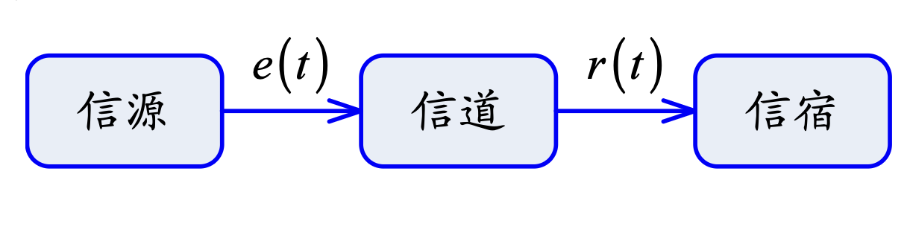
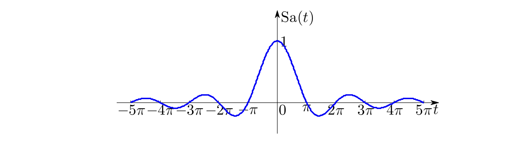

# 基本概念

信号指一切运动或状态的变化，可抽象为函数$f(t)$。系统指由若干相互作用相互依赖的事物组合而成的、具有特定功能的整体。

通信系统的结构：

**复指数信号**：定义为

$$
f(t) = Ke^{st}=Ke^{\sigma t}\cos(\omega t)+jKe^{\sigma t}\sin(\omega t)
$$ 

**Sa信号（抽样信号）**定义为：

$$
\mathrm{Sa}(t)=\frac{\sin t}{t}\,,\mathrm{sinc}(t)=\frac{\sin(\pi t)}{\pi t}=\mathrm{Sa}(\pi t)
$$

性质：

$$
\mathrm{Sa}(0)=1\,,\mathrm{Sa}(n\pi)=0\,,\int_0^\infty\mathrm{Sa}(t)dt=\frac{\pi}{2}
$$

系统的分类：

- 线性系统-非线性系统
- 时变系统-时不变系统
- 因果系统-非因果系统
- 稳定系统-不稳定系统
- 连续时间系统-离散时间系统

**稳定系统**：常用BIBO判别，对于任意有界输入$e(t)$，输出$r(t)$也是有界的。

**线性系统**：满足叠加性（输入相加则响应相加）和齐次性（输入数乘则输出数乘）。

**时不变性**：系统的特性不随时间改变，即输入信号的时间平移会导致输出信号同样的时间平移。

**因果性**：若系统在$\forall t_0$时刻的输出仅与输入在$t\leq t_0$时刻的值有关，则称系统是因果的。==可以通过延时将非因果系统转化为因果系统==。
