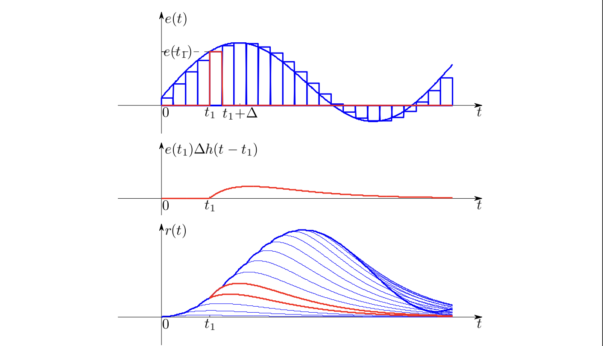
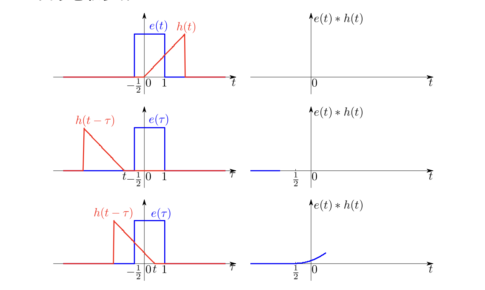
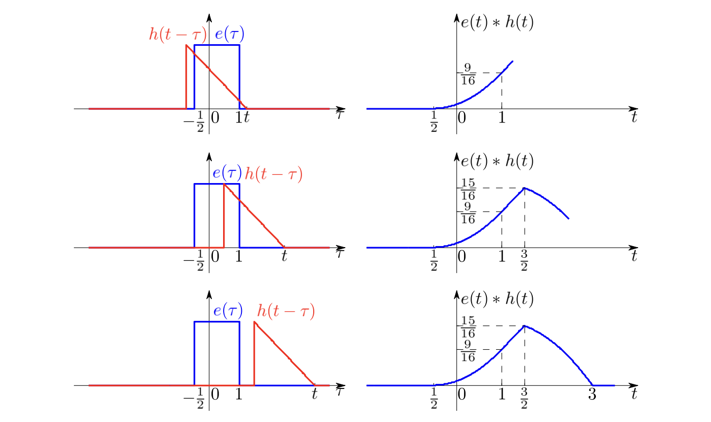

# LTI系统的时域分析

时域方法通过直接求解微分（积分）方程，利用时间作为变量进行分析。

### 系统的数学模型在时域的表示
**端口描述**：系统的输入输出关系可以用端口描述，即输入信号$e(t)$和输出信号$r(t)$之间的关系。

$$
\sum_{i=0}^nC_i\frac{\mathrm d}{\mathrm dt^i}r(t)=\sum_{j=0}^mE_j\frac{\mathrm d}{\mathrm dt^j}e(t)
$$

**状态方程描述**：引入状态向量$\mathbf s(t)$，描述系统的内部状态变化

$$
\begin{cases}
\dfrac{\mathrm{d}}{\mathrm{d}t}\mathbf s(t)=\mathbf A\mathbf s(t)+\mathbf Be(t)\\
r(t)=\mathbf C\mathbf s(t)+\mathbf D e(t)
\end{cases}
$$

**算子符号**p：定义为$\mathrm p=\frac{\mathrm d}{\mathrm dt}$，则系统的输入输出关系可以表示为：

$$
\frac{C_n\mathrm p^n+C_{n-1}\mathrm p^{n-1}+\cdots+C_0}{E_m\mathrm p^m+E_{m-1}\mathrm p^{m-1}+\cdots+E_0}r(t)=e(t)
$$

### 时域经典法求解微分方程

==略==

### 冲激响应和阶跃响应

信号可分解为冲激 (阶跃) 信号之和，根据 LTI 系统的特点，可以将冲激 (阶跃) 响应组合后得到原信号的零状态响应。

冲激信号$\delta(t)$在$t\geq 0_+$为0，因此冲激响应为齐次解

$$
h(t)=A_1e^{\alpha_1t}+A_2e^{\alpha_2t}+\cdots+A_ne^{\alpha_nt}\,,t\geq 0_+
$$

也可能出现冲激项及其各阶导数

$$
h(t)=A_1e^{\alpha_1t}+A_2e^{\alpha_2t}+\cdots+A_ne^{\alpha_nt}+D_0\delta(t)+D_1\delta'(t)+\cdots+D_{k}\delta^{(k)}(t)
$$

一般情况下$k=0$,即没有高阶导数。

**零状态响应是激励信号和冲激响应的卷积**，即

$$
r(t)=e(t)\ast h(t)=\int_{-\infty}^\infty e(\tau)h(t-\tau)\mathrm d\tau
$$

**卷积的步骤：**

1. **反褶**：将$h(\tau)$反转得到$h(-\tau)$,$\tau$为变量
1. **平移**：将$h(-\tau)$右移$t$得到$h(t-\tau)$,$t$为常量
1. **乘积**：将$e(\tau)$和$h(t-\tau)$相乘得到$e(\tau)h(t-\tau)$
1. **积分**：对**乘积**在$\tau\in(-\infty,\infty)$积分得到卷积结果$r(t)$,改变$t$的值可以取遍感兴趣的区间

若以$e^{st}$为输入，输出为

$$
\begin{aligned}
r(t)&=e^{st}\ast h(t)=\int_{-\infty}^\infty e^{s\tau}h(t-\tau)\mathrm d\tau\\
&=e^{st}\int_{-\infty}^\infty e^{-s(t-\tau)}h(t-\tau)\mathrm d\tau\\
&=e^{st}\int_{-\infty}^\infty e^{-s\tau}h(\tau)\mathrm d\tau\\
&=e^{st}H(s)\\
\text{其中}H(s)&=\int_{-\infty}^\infty e^{-s\tau}h(\tau)\mathrm d\tau
\end{aligned}
$$

可见$e^{st}$是系统的**特征函数**，对应的输出为$H(s)e^{st}$，其中$H(s)$是系统的**特征值**。

### 卷积性质

$$
f_1(t)\ast f_2(t)=\int_{-\infty}^\infty f_1(\tau)f_2(t-\tau)\mathrm d\tau
$$

**代数性质**：

1. **交换律：**$f_1\ast f_2=f_2\ast f_1$
1. **结合律**：$(f_1\ast f_2)\ast f_3=f_1\ast(f_2\ast f_3)$
1. **分配律**：

$$
f_1\ast(f_2+f_3)=f_1\ast f_2+f_1\ast f_3
$$

**拓扑性质**

1. **微分性质**：$\dfrac{\mathrm d}{\mathrm dt}(f_1(t)\ast f_2(t))=\dfrac{\mathrm df_1(t)}{\mathrm dt}\ast f_2(t)$
1. **积分性质**：$\displaystyle\int_{-\infty}^t f_1(\tau)\ast f_2(\tau)\mathrm d\tau=\int_{-\infty}^t f_1(\tau)\mathrm d\tau\ast f_2(t)$

**位移性质**：若$f_1(t)\ast f_2(t)=c(t)$，则

$$
f_1(t-T_1)\ast f_2(t-T_2)=c(t-T_1-T_2)
$$

**筛选特性**：$f(t)\ast\delta(t-t_0)=f(t-t_0)$
