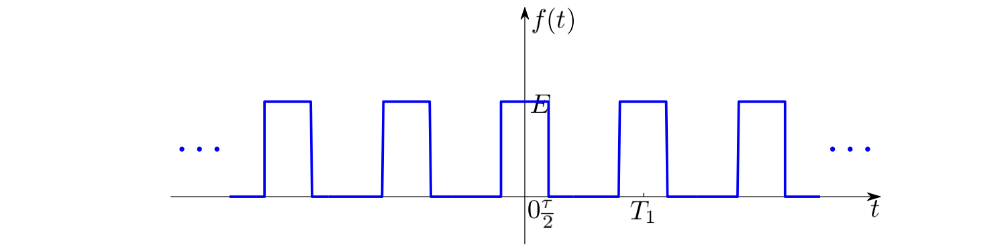
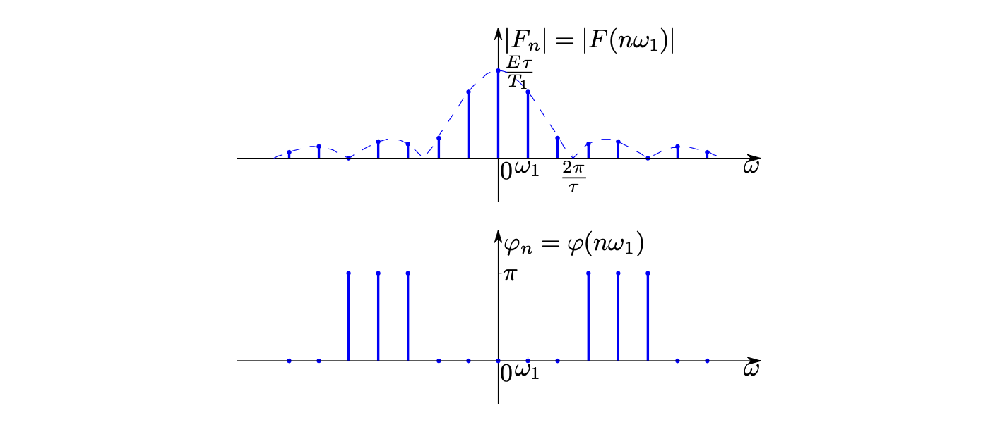
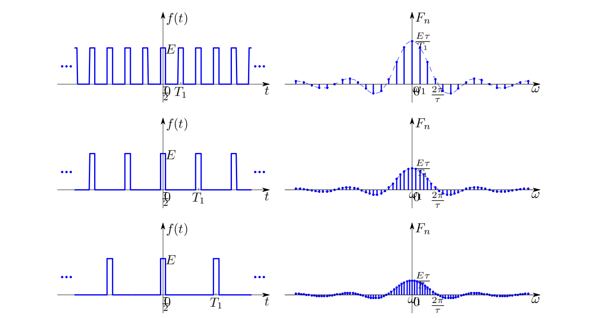
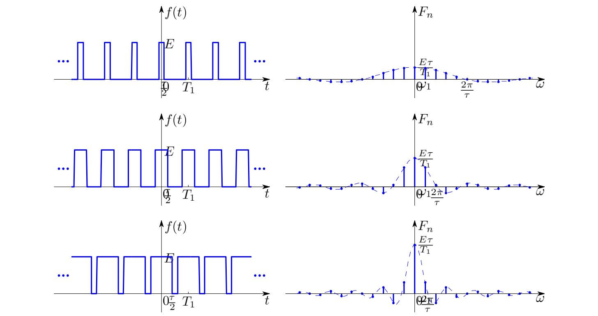
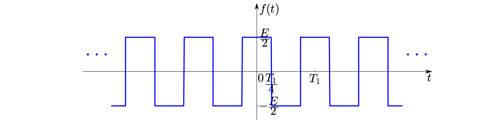
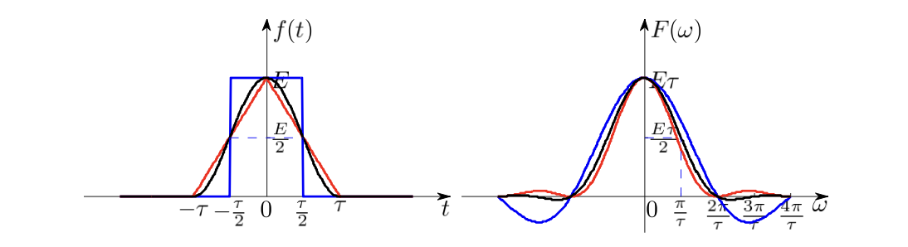

# Fourier 变换

当代通信系统和信号处理技术的发展处处伴随着傅里叶变换的精心应用。作为一种变换方法，傅里叶变换启发引领了一系列变换方法的产生：陆续出现了短时傅里叶变换、Gabor 展开、Wigner-Wille 分布、小波变换、子带编码等众多研究课题。

### 傅立叶级数
周期信号可以表示为一系列三角函数的叠加，即傅立叶级数：

$$
f(t)=a_0+\sum_{n=1}^\infty\left[a_n\cos\left(\frac{2\pi nt}{T}\right)+b_n\sin\left(\frac{2\pi nt}{T}\right)\right]
$$

其中系数

$$
\begin{aligned}
a_0&=\frac{1}{T}\int_{t_0}^{t_0+T}f(t)\mathrm dt\\
a_n&=\frac{2}{T}\int_{t_0}^{t_0+T}f(t)\cos\left(\frac{2\pi nt}{T}\right)\mathrm dt\\
b_n&=\frac{2}{T}\int_{t_0}^{t_0+T}f(t)\sin\left(\frac{2\pi nt}{T}\right)\mathrm dt
\end{aligned}
$$

傅立叶级数展开有 ==充分不必要条件== *Dirichlet条件*，即在一个周期内

1. 间断点有限
1. 极值点有限
1. 绝对可积，即 $\displaystyle \int_{t_0}^{t_0+T}|f(t)|\mathrm dt<\infty$

傅立叶级数的另一种形式：

$$
f(t)=\sum_{n=1}^\infty c_n \cos\left(\frac{2\pi nt}{T}+\varphi_n\right)+c_0
$$

其中$c_0=a_0$，$c_n=\sqrt{a_n^2+b_n^2}$，$\tan\varphi_n=\dfrac{b_n}{a_n}$。

复指数形式：

$$
f(t)=\sum_{n=-\infty}^\infty F_n e^{j\frac{2\pi nt}{T}}
$$

其中

$$
F_n=\frac{1}{T}\int_{t_0}^{t_0+T}f(t)e^{-j\frac{2\pi nt}{T}}\mathrm dt
$$

#### 对称性与傅立叶系数的关系

| 信号的对称性 | $a_n$ | $b_n$ |
|--------------|-------|-------|
| 偶对称 $f(t)=f(-t)$ | 非零  | 零    |
| 奇对称 $f(t)=-f(-t)$ | 零    | 非零  |
| 奇谐对称 $f(t)=-f(t\pm\frac{T_1}{2})$ | $a_{2n}=0$ | $b_{2n}=0$ |

#### 周期矩形脉冲信号

对应傅立叶级数

$$
F_n=\frac{E\tau}{T_1}\mathrm{Sa}\left(\frac{n\pi\tau}{T_1}\right)
$$

其谱线密度和$T_1$成反比

包络形状和$\tau$有关：

**频谱的性质**

1. 周期信号的频谱**离散**，谱线间隔$\omega_1=\dfrac{2\pi}{T_1}$。周期越大，谱线越密**变成非周期信号则谱线连续**。
1. 直流分量、基波分量和各个谐波分量的大小正比于脉幅$E$，反比于周期$T_1$。
1. 有无穷多个谱线，主要集中于第一零点以内$\omega<\dfrac{2\pi}{\tau}$。定义为频带宽度$B_\omega=\dfrac{2\pi}{\tau}$，或者$B_f=\dfrac{1}{\tau}$。

#### 方波信号

方波的波形如下：

1. 偶对称，因此只有正弦项，即只有奇次谐波分量。
1. 正负交替，没有直流分量
1. 奇谐对称，没有偶谐分量

其傅立叶级数相当于周期矩形波去掉偶次谐波分量和直流分量。

### 傅立叶变换

傅立叶变换定义为

$$
\mathscr{F}\{f(t)\}=F(\omega)=\int_{-\infty}^\infty f(t)e^{-j\omega t}\mathrm dt
$$

逆变换为

$$
\mathscr{F}^{-1}\{F(\omega)\}=f(t)=\frac{1}{2\pi}\int_{-\infty}^\infty F(\omega)e^{j\omega t}\mathrm d\omega
$$

$F(\omega)$是$f(t)$的频域表示，称为$f(t)$的频谱。$|F(\omega)|$称为幅度谱，$\varphi(\omega)=\arg F(\omega)$称为相位谱。

非周期信号包含了所有从零到无限高连续的频谱分量；各分量的幅度趋于无限小，只能用密度函数表示。周期信号的能量集中于某些频点 (谐波分量)，是离散频谱。

**傅立叶变换存在的充分非必要条件是Dirichlet条件**，即$f(t)$在全空间绝对可积。

借助奇异函数，周期信号、阶跃信号和符号函数等许多不满足绝对可积条件的信号也存在傅里叶变换。

#### 傅立叶变换的性质

**可逆性**：$\mathscr{F}^{-1}\{\mathscr{F}\{f(t)\}\}=f(t)$

**对称性**：$\mathscr{F}\{\mathscr{F}\{f(t)\}\}=2\pi f(-t)$，$\mathscr{F}^{-1}\{\mathscr{F}^{-1}\{F(\omega)\}\}=\dfrac{1}{2\pi}F(-\omega)$

**线性**：$\mathscr{F}\{a_1f_1(t)+a_2f_2(t)\}=a_1F_1(\omega)+a_2F_2(\omega)$

**衰减速率**：时域波形增加一阶可导，傅里叶变换包络的衰减速度增加$\omega^{-1}$.例如

|波形|时域性质|频谱包络|
|---------|-----|-----|
|矩形波|$f(t)$不连续| $\omega^{-1}$ |
|三角波|$f'(t)$不连续| $\omega^{-2}$ |
|升余弦波|$f''(t)$不连续| $\omega^{-3}$ |

