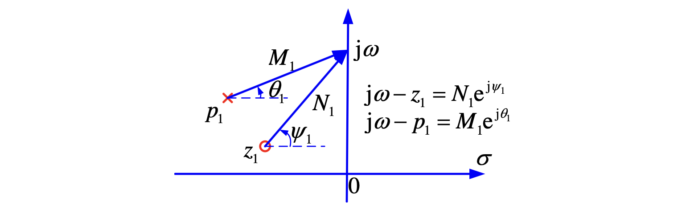
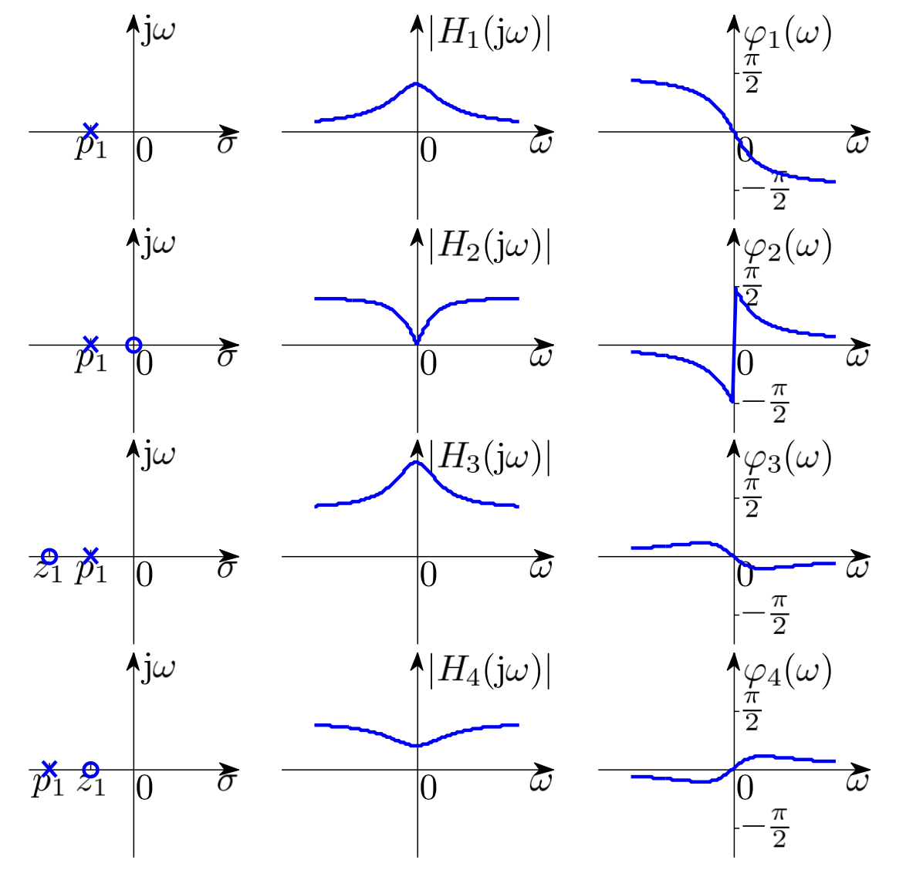
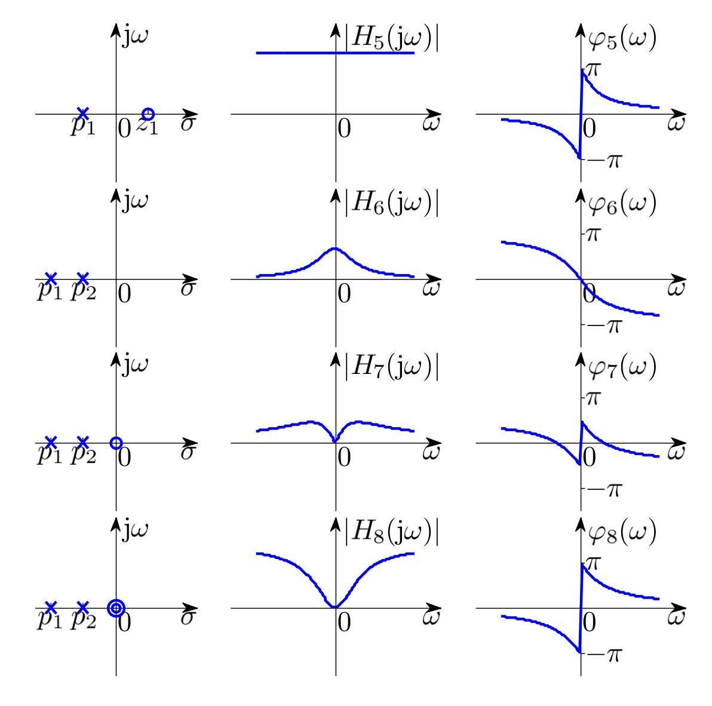
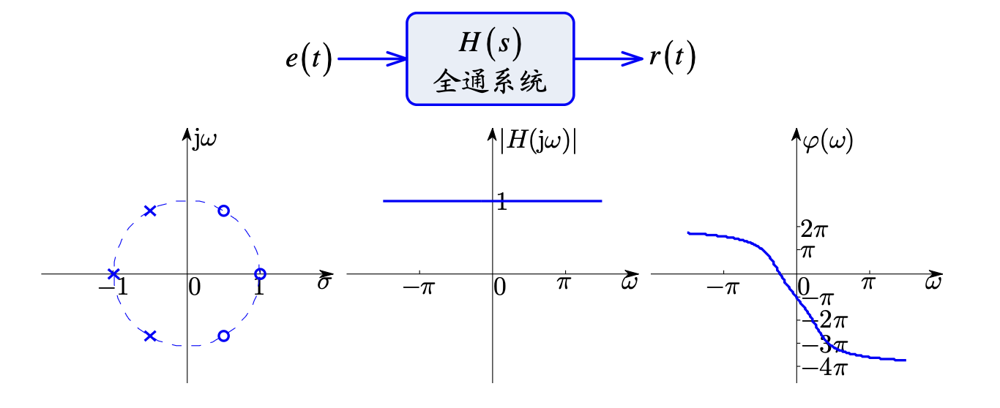
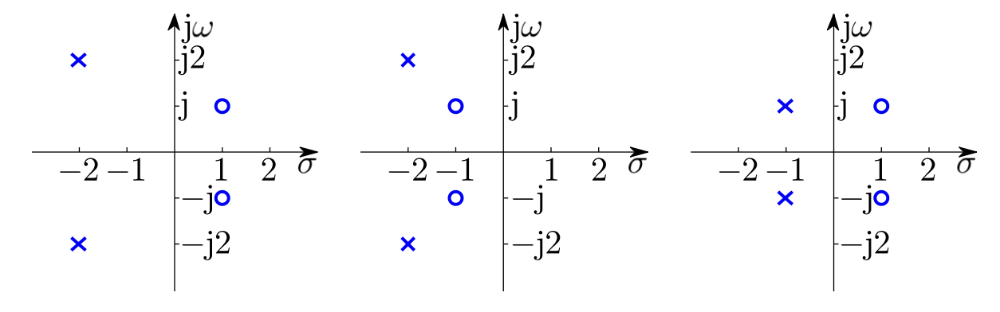

# Laplace变换

Laplace变换即$f(t)e^{-\sigma t}$的傅里叶变换，其中$f(t)$为因果信号。

$$
F(s)=\int_{0-}^\infty f(t)e^{-st}\mathrm dt=\int_{0-}^\infty f(t)e^{-\sigma t}e^{-\mathrm j\omega t}\mathrm dt
$$

Laplace变换存在的条件：原函数 ==分段连续== 且为 ==指数阶函数== 。

??? tip "指数阶函数"
    对于给定$f(t)$，若存在$\sigma_0$满足
    
    $$
    \lim_{t\to\infty}f(t)\mathrm e^{-\sigma t}=0\,\quad\forall \sigma>\sigma_0
    $$

    则称$f(t)$为指数阶函数。

### Laplace 变换的性质

**线性:** 若$\mathscr{L}[f_1(t)]=F_1(s)$,$\mathscr{L}[f_2(t)]=F_2(s)$，对常数$K_1\,,K_2$有

$$
\mathscr{L}[K_1f_1(t)+K_2f_2(t)]=K_1F_1(s)+K_2F_2(s)
$$

---

**微分、积分性质:** $\mathscr{L}\left[\dfrac{\mathrm df(t)}{\mathrm dt}\right]=sF(s)-f(0-)$，对高阶有

$$
\displaystyle\mathscr{L}\left[\dfrac{\mathrm d^nf(t)}{\mathrm dt^n}\right]=s^nF(s)-\sum_{r=0}^{n-1}s^{n-r-1}f^{(r)}(0-)
$$

$$
\mathscr{L}\left[\int_{-\infty}^tf(\tau)\mathrm{d}\tau\right]=\frac{F(s)}{s}+\frac{\displaystyle\int_{-\infty}^{0-}f(\tau)\mathrm d\tau}{s}
$$

---

**延时 (时域平移) 性质:** $\mathscr{L}[f(t-t_0)u(t-t_0)]=e^{-st_0}F(s)\,,t_0>0$

注意有$u(t-t_0)$,就是只取$t\ge t_0$的部分。

**频移（s域平移）性质:** $\mathscr{L}[f(t)e^{-at}]=F(s+a)$

---

**尺度变换性质:** $\mathscr{L}[f(at)]=\dfrac{1}{a}F\left(\dfrac{s}{a}\right)\,,a>0$。

---

**s域微分、积分性质**

$$
\frac{\mathrm{d}F(s)}{\mathrm{d}s}=\mathscr{L}[-tf(t)]
$$

$$
\int_s^\infty F(\xi)\mathrm d\xi=\mathscr{L}{\frac{f(t)}t}
$$

---

**初值定理**

$$
\lim_{t\to 0_+}f(t)=f(0_+)=\lim_{s\to \infty}sF(s)
$$

要求$f(t)\,,f'(t)$的Laplace变换存在。

**终值定理**

$$
\lim_{t\to\infty}f(t)=\lim_{s\to0}sF(s)
$$

!!! warning "终值定理应用条件"
    1. **时域**：$\displaystyle\lim_{t\to\infty}f(t)$存在
    1. **频域**：极点必须在左半平面。

??? tip "例-锁相环分析"
    锁相环是通信接收机的重要单元，用于频率恢复和解调。现在想研究$F(s)$的特性。
    
    不妨假设鉴相器理想，即

    $$
    g\left(\theta(t)-\hat{\theta}(t)\right)=K_p\left(\theta(t)-\hat{\theta}(t)\right)
    $$

    

    相位估计误差和输入相位的关系为

    $$
    \Theta_e(s)=\frac{s}{s+K_0K_pF(s)}\Theta(s)
    $$

    当输入相位为恒定值时，即$\theta(t)=\Delta\theta u(t)$时

    $$
    \Theta_e(s)=\frac{s}{s+K_0K_pF(s)}\cdot\frac{\Delta\theta}{s}=\frac{\Delta\theta}{s+K_0K_pF(s)}
    $$

    应用终值定理得到

    $$
    \lim_{t\to\infty}\theta_e(t)=\lim_{s\to 0}\Theta_e(s)=\lim_{s\to 0}\frac{s\Delta\theta}{s+K_0K_pF(s)}=0\,,\forall F(0)\neq 0
    $$

    因此前向增益$F(s)$一定要能通过直流。

---

**卷积定理**

$$
\begin{aligned}
\text{时域}:&\mathscr{L}[f_1(t)\ast f_2(t)]=F_1(s)F_2(s)\\
\text{频域}:&\mathscr{L}[f_1(t)\cdot f_2(t)]=\boxed{\frac{1}{2\pi\mathrm{j}}}F_1(s)\ast F_2(s)
\end{aligned}
$$

### Laplace 逆变换

Laplace 的一般表达式可以写为

$$
F(s)=\frac{B(s)}{A(s)}=\frac{\displaystyle b_m\prod_{j=1}^{m}(s-z_j)}{\displaystyle a_n\prod_{i=1}^{m}(s-p_i)}
$$

!!! tip "非有理函数怎么办"
    对于连续非有理函数$F(s)$,可以用 ==伯恩斯坦多项式== 近似。若$f(x)\in\mathbb{C}[0,1]$，则其n阶伯恩斯坦多项式定义为
    
    $$
    B_n(x)=\sum_{k=0}^nf\left(\frac{x}{n}\right)C_n^kx^k(1-x)^{n-k}
    $$

    对于函数$|x|$，可以采用 ==Newman近似== ：

    $$
    r_n(x)=\frac{x\left(p_n(x)-p_n(-x)\right)}{p_n(x)+p_n(-x)}\,,p_n(x)=\sum_{k=1}^{n-1}(x+a^k)
    $$

    其中系数$a=\exp\left(-\frac{1}{\sqrt{\pi}}\right)$，$n\geq 5$时有$||x|-r_n(x)|\leq 3\exp\left(-\sqrt{n}\right)$

Laplace 逆变换可以采用部分分式分解法和留数定理求解。

#### 部分分式分解法

对于有理函数形式，假设$n>m$，即$F(s)$为真分式。

$$
\begin{aligned}
F(s)&=\frac{B(s)}{(s-p_1)(s-p_2)\cdots(s-p_n)}\\
&=\frac{K_1}{s-p_1}+\frac{K_2}{s-p_2}+\cdots+\frac{K_n}{s-p_n}
\end{aligned}
$$

其中$\left.K_i=(s-p_i)F(s)\right|_{s=p_i}$

**单根** 若$K_i\in \mathbb{R}$, 则

$$
\mathscr{L}^{-1}\left[\frac{K_i}{s-p_i}\right]=K_i\exp(p_i t)u(t)
$$

**共轭复根** 若有一堆共轭复数根$-\alpha\pm\mathrm{j}\beta$,即

$$
\begin{aligned}
F(s)&=\frac{1}{(s+\alpha-\mathrm j\beta)\cdot(s+\alpha+\mathrm j\beta)}\cdot F_1(s)\\
&=\frac{K_1}{s+\alpha-\mathrm j\beta}+\frac{K_2}{s+\alpha+\mathrm j\beta}+\cdots
\end{aligned}
$$

其中

$$
\begin{cases}
K_1=(s+\alpha-\mathrm{j}\beta)F(-\alpha+j\beta)=\frac{F_1(-\alpha+j\beta)}{2\mathrm j\beta}\\
K_2=(s+\alpha+\mathrm{j}\beta)F(-\alpha-j\beta)=\frac{F_1(-\alpha-j\beta)}{-2\mathrm j\beta}\\
\end{cases}
$$

即$K_2=K_1^\ast$。令$K_1=A+\mathrm jB$,则

$$
\begin{aligned}
\mathscr{L}^{-1}&\left[\frac{K_1}{s+\alpha-\mathrm j\beta}+\frac{K_2}{s+\alpha+\mathrm j\beta}\right]\\
&=2\exp(-\alpha t)\left(A\cos\beta t-B\sin\beta t\right)u(t)
\end{aligned}
$$

**多重根** 假设$F(s)$有一个$k$阶极点$p_1$，即

$$
\begin{aligned}
F(s)&=\frac{F_1(s)}{(s-p_1)^k}\\
&=\frac{K_{11}}{(s-p_1)^k}+\frac{K_{12}}{(s-p_1)^{k-1}}+\cdots+\frac{K_{1k}}{s-p_1}+\cdots
\end{aligned}
$$

其中$K_{11}=(s-p_1)^k F(s)\big{|}_{s=p_1}=F_1(p_1)$。为了确定$K_{12}$，考察$F_1(s)$并对其求导数：

$$
\begin{aligned}
F_1(s)&=K_{11}(s)+K_{12}(s-p_1)+\cdots+K_{1k}(s-p_1)^{k-1}+\cdots\\
\frac{\mathrm d}{\mathrm ds}F_1(s)&=0+K_{12}+\cdots+(k-1)K_{1k}(s-p_1)^{k-2}+\cdots
\end{aligned}
$$

因此$\displaystyle K_{12}=\frac{\mathrm d}{\mathrm ds}F_1(s)\big|_{s=p_1}=F_1'(p_1)$. 同理可以得到:

$$
K_{1i}=\left.\frac{1}{(i-1)!}\frac{\mathrm d^{i-1}}{\mathrm d s^{i-1}}F_1(s)\right|_{s=p_1}=\frac{1}{(i-1)!}F_1^{(i-1)}(p_1)
$$

又由于

$$
\mathscr{L}\left[t^n u(t)\right]=\frac{n!}{s^{n+1}}\Rightarrow\mathscr{L}\left[\frac{t^{n-1}\mathrm e^{p_1t}}{(n-1)!}u(t)\right]=\frac{1}{(s-p_1)^n}
$$

因此

$$
f(t)=\sum_{i=1}^{k}\frac{F_1^{(i-1)}(p_1)}{(i-1)!(k-i)!}t^{k-i}\mathrm{e}^{p_1t}u(t)+\cdots
$$

#### 留数定理法

??? note "留数的概念"
    设函数 $f(z)$ 在区域 $0<|z-z_0|<R$ 内解析。选取 $r$，使 $0<r<R$，并且作圆 $C:|z-z_0|=r$。如果 $z_0$ 是 $f(z)$ 的孤立奇点，定义函数 $f(z)$ 在孤立奇点 $z_0$ 的留数为

    $$
    \operatorname{Res}(f,z_0)=\frac{1}{2\pi j}\int_C f(z)dz
    $$

    设 $D$ 是在复平面上的一个有界区域，其边界是一条或有限条简单闭曲线 $C$。设函数 $f(z)$ 在 $D$ 内除去孤立奇点 $z_1,z_2,\cdots,z_n$ 外，在每一点都解析，并且它在 $C$ 上的每一点也解析，那么有

    $$
    \int_C f(z)dz=2\pi j\sum_{i=1}^{n}\operatorname{Res}(f,z_i)
    $$

    其中沿 $C$ 的积分取为关于区域 $D$ 的正向。
    留数的计算公式如下。
    对函数 $f(z)$ 的一阶极点 $z_0$，有

    $$
    \operatorname{Res}(f,z_0)=\lim_{z\to z_0}(z-z_0)f(z)
    $$

    对函数 $f(z)$ 的 $k(k>1)$ 阶极点 $z_0$，则有

    $$
    \operatorname{Res}(f,z_0)=\frac{1}{(k-1)!}\lim_{z\to z_0}\frac{d^{k-1}[(z-z_0)^kf(z)]}{dz^{k-1}}
    $$

考虑逆变换式和留数的关系：

$$
\begin{aligned}
f(t)&=\frac{1}{2\pi j}\int_{\sigma-j\infty}^{\sigma+j\infty}F(s)e^{st}ds\\
&=\frac{1}{2\pi j}\int_C F(s)e^{st}ds-\frac{1}{2\pi j}\int_{C_R}F(s)e^{st}ds
\end{aligned}
$$

其中 $C_R$ 是半径为无穷大的圆弧，$C$ 是 $C_R$ 和拉氏逆变换积分路径构成的闭合曲线。
根据留数定理有

$$
\frac{1}{2\pi j}\int_C F(s)e^{st}ds=\sum_{i=1}^{n}\operatorname{Res}[F(s)e^{st},z_i]
$$

若满足对 $C_R$ 上任意 $s$，有 $|F(s)|\le M_R$，且 $\lim_{R\to\infty}M_R=0$，有

$$
\lim_{R\to\infty}\left|\int_{C_R}F(s)e^{st}ds\right|=0
$$

最终得到

$$
f(t)=\sum_{i=1}^{n}\operatorname{Res}[F(s)e^{st},z_i]
$$

一阶极点情况：

$$
\begin{aligned}
F(s)&=\sum_{i=1}^{n}\frac{K_i}{s-p_i}\\
K_i&=(s-p_i)F(s)|_{s=p_i}\\
f(t)&=\sum_{i=1}^{n}K_ie^{p_it}\\
&=\sum_{i=1}^{n}(s-p_i)F(p_i)e^{p_it}
\end{aligned}
$$

用留数法有

$$
\begin{aligned}
f(t)&=\sum_{i=1}^{n}\operatorname{Res}[F(s)e^{st},p_i]\\
&=\sum_{i=1}^{n}\lim_{s\to p_i}(s-p_i)F(s)e^{st}\\
&=\sum_{i=1}^{n}(s-p_i)F(p_i)e^{p_it}
\end{aligned}
$$

高阶极点情况，假设只在 $p_1$ 处有一个 $k$ 阶极点：

$$
\begin{aligned}
F(s)&=\frac{F_1(s)}{(s-p_1)^k}\\
f(t)&=\operatorname{Res}[F(s)e^{st},p_1]\\
&=\frac{1}{(k-1)!}\lim_{s\to p_1}\frac{d^{k-1}[(s-p_1)^kF(s)e^{st}]}{ds^{k-1}}\\
&=\frac{1}{(k-1)!}\lim_{s\to p_1}\sum_{i=0}^{k-1}C_{k-1}^{i}F_1^{(i)}(s)(e^{st})^{(k-1-i)}\\
&=\frac{1}{(k-1)!}\lim_{s\to p_1}\sum_{i=1}^{k}C_{k-1}^{i-1}F_1^{(i-1)}(s)(e^{st})^{(k-i)}\\
&=\sum_{i=1}^{k}\frac{F_1^{(i-1)}(p_1)}{(i-1)!(k-i)!}t^{k-i}e^{p_1t}u(t)
\end{aligned}
$$

### S域元件模型与电路分析

!!! danger "说明"
    具体见[《电子电路与系统基础》](../../电路组/fundamentals-of-electronic-circuits/00-课程说明.md).
    
把网络中每个元件都用 s 域模型代替，串联、并联和分压分流性质都可利用，从而直接写变换式.s 域模型也称为运算阻抗,用 s 域模型时，交、直流电路的各种性质，如戴维南等效、诺顿等效都可使用。

### 系统函数

系统零状态响应的拉氏变换与激励的拉氏变换之比称为“系统函数”(或网络函数)，以 $H(s)$表示.

$E(s)\,,R(s)$可能是电压或者电流，因而 $H(s)$ 可能为阻抗、导纳或者比值.如果$E(s)$和$R(s)$在同一端口，则$H(s)$称为策动点函数(Driving point function)；否则称为转移函数或传递函数(Transfer function).

### 零极点分布与时频特性

拉氏变换建立起时域和频域的对应关系。拉氏变换将不同的电路 (系统) 统一，即不同电路可以完成同样的功能，具有相同的性质。

#### $H(s)$零极点分布与$h(t)$波形特征的对应

设$H(s)$由$n$个子系统$H_i(s)$并联而成，每个子系统又唯一一阶极点$p_i$，即

$$
H(s)=\sum_{i=1}^{n}H_i(s)=\sum_{i=1}^{n}\frac{K_i}{s-p_i}
$$

其冲激响应：

$$
h(t)=\mathscr L^{-1}[H(s)]=\sum_{i=1}^n K_i\mathrm e^{p_it}u(t)
$$

**一阶极点位置与原函数波形的对应关系**

**一阶共轭极点位置与原函数波形的对应关系**

若$p_i$是个二阶极点，即

$$
H_i(s)=\frac{K_i}{(s-p_i)^2}=K_i\frac{1}{s=p_i}\frac{1}{s-p_i}
$$

因此

$$
\begin{aligned}
h_i(t)&=K_i\mathscr L^{-1}\left[\frac{1}{s-p_i}\right]\ast\mathscr L^{-1}\left[\frac{1}{s-p_i}\right]\\
&=K_i\left[\mathrm e^{p_it}u(t)\right]\ast\left[\mathrm e^{p_it}u(t)\right]\\
&=K_iu(t)\int_0^t\mathrm e^{p_i\tau}\mathrm e^{p_i(t-\tau)}\mathrm d\tau\\
&=K_it\mathrm e^{p_it}u(t)
\end{aligned}
$$

**二阶极点位置与原函数波形的对应关系**

!!! tip "结论"
    若$H(s)$极点位于左半平面，则$h(t)$波形为衰减形式；若一阶极点且位于虚轴上，则为等幅 (常量或振荡)；其他情况(位于右半平面或二阶虚轴上) 则为增长形式.

    $H(s)$极点分布和时域波形形式有明确的对应关系，但 ==零点分布不会对时域波形发生实质影响== 。例子：

    $$
    \begin{cases}
    \mathscr L^{-1}\left[\dfrac{s+a}{(s+a)^2+\omega^2}\right]=\mathrm e^{-at}\cos\omega t\\
    \mathscr L^{-1}\left[\dfrac{s}{(s+a)^2+\omega^2}\right]=\mathrm e^{-at}\left(\cos\omega t-\dfrac{a}{\omega}\sin\omega t\right)
    \end{cases}
    $$

    衰减趋势和振荡频率都不变，只是 ==幅度和相位有些变化==

    

#### 系统对激励的响应

考虑系统输出的Laplace变换

已知系统函数和激励信号的Laplace变换

$$
H(s)=\frac{\displaystyle \prod^{m}_{j=1}(s-z_j)}{\displaystyle \prod^{n}_{i=1}(s-p_i)}\,,E(s)=\frac{\displaystyle \prod^{u}_{l=1}(s-b_l)}{\displaystyle \prod^{v}_{k=1}(s-a_k)}
$$

其中$n+v>m+u$. 可见响应$R(s)$的极点分别来自系统$H(s)$和激励源$E(s)$。

$$
R(s)=H(s)E(s)=\sum_{i=1}^n \frac{K_i}{s-p_i} + \sum_{k=1}^v\frac{W_k}{s-a_k}
$$

根据 ==极点的来源== 可以分解为自由响应 (Natural Response) 和强迫响应 (Forced Response)

$$
r(t)=\underbrace{\sum_{i=1}^nK_i\mathrm e^{p_it}}_{\text{自由响应}}+\underbrace{\sum_{k=1}^vW_k\mathrm e^{a_kt}}_{\text{强迫响应}}
$$

- 自由响应的形式只与系统函数$H(s)$, 即极点$p_i$有关
- 强迫响应的形式只与激励信号$E(s)$, 即极点$a_k$有关
- 两部分响应的系数$K_i$,$C_k$与$H(s)$,$E(s)$都有关
- 两部分的极点$p_i$和$a_k$相同时，自由响应和强迫响应不能完全分开

对于非零起始状态，有

$$
R(s)=\underbrace{\frac{C(s)}{A(s)}}_{\text{零输入响应}}+\underbrace{\frac{B(s)}{A(s)}E(s)}_{\text{零状态响应}}=\underbrace{\sum_{i=1}^n \frac{L_i}{s-p_i}}_\text{零输入响应}+\underbrace{\sum_{i=1}^n \frac{K_i}{s-p_i} + \sum_{k=1}^v\frac{W_k}{s-a_k}}_{\text{零状态响应}}
$$

$$
r(t)=\underbrace{\sum_{k=1}^nA_k\mathrm e^{\alpha_k t}}_{\text{自由响应/齐次解}}+\underbrace{r_P(t)}_{\text{强迫响应/特解}}=\underbrace{\sum_{i=1}^nL_i\mathrm e^{p_it}}_{\text{零输入响应}}+\underbrace{\sum_{i=1}^nK_i\mathrm e^{p_it}+\sum_{k=1}^vW_k\mathrm e^{a_kt}}_{\text{零状态响应}}
$$

系统特征方程的行列式$\Delta$的根为系统的**固有频率**。但有时候，有某些因子被消去，如

$$
H(s)=\frac{s+1}{(s+1)\cdot(s+2)}=\frac{1}{s+2}
$$

因此$H(s)$的极点属于固有频率，但不一定全（$H(s)$并不能表征系统的完全特性）

#### 零极点图的几何解释

利用$H(s)$写出$H(j\omega)$：

$$
H(s)=K\frac{\prod^m_{j=1}(s-z_j)}{\prod^n_{i=1}(s-p_i)}\Rightarrow H(\mathrm j\omega)=K\frac{\prod_{j=1}^m\mathrm j\omega-z_j}{\prod_{i=1}^n\mathrm j\omega-p_i}
$$

则$\displaystyle\begin{matrix}(\mathrm j\omega-z_j)\\(\mathrm j\omega-p_i)\end{matrix}$表示从$\displaystyle\begin{matrix}z_j\\p_i\end{matrix}$到虚轴某点的矢量，以$\displaystyle\begin{matrix}N_j\mathrm e^{\mathrm j\psi_j}\\M_i\mathrm e^{\mathrm j\theta_i}\end{matrix}$表示。

该代换要求收敛域包括虚轴，（对单边 LT）极点在左半平面。于是

$$
H(\mathrm j\omega)=K\frac{N_1\cdots N_m}{M_1\cdots M_n}\mathrm e^{\mathrm j(\psi_1+\cdots+\psi_m-\theta_1-\cdots-\theta_n)}=\left|H(\mathrm j\omega)\right|\mathrm e^{\mathrm{j}\varphi(\omega)}
$$

因此

$$
\begin{cases}
\left|H(\mathrm j\omega)\right|=\frac{N_1\cdots N_m}{M_1\cdots M_n}\\
\varphi(\omega)=\psi_1+\cdots+\psi_m-\theta_1-\cdots-\theta_n
\end{cases}
$$

当$\omega$沿虚轴移动时，各复数因子的模和辐角随之改变，从
而绘出频响曲线,由零、极点分布可判断出频响特性 (表明特征、区分类型).

#### 全通函数与最小相移函数的零、极点分布

**全通函数**：若$H(s)$的极点位于左半平面，零点位于右半平面，且零点与极点关于虚轴对称，则为全通函数。全通函数的幅频特性为水平线，$|H(\mathrm j\omega)|=K$, {==相频特性为单调减==}。

全通函数不影响信号的幅频特性，只会改变相频特性。在传输系统中，常常用于{==相位校正==},如**相位均衡器**或**移相器**。

**最小相移系统**：零点仅位于左半平面或虚轴的系统函数称为最小相移函数，该系统称为最小相移系统。如果某系统函数在右半平面有一个或多个零点，则称为非最小相移函数。

非最小相移函数可表示为最小相移函数与全通函数的级联。

**特性**

- 相同幅频响应下，相位延迟最小；对应于通信系统的低时延，实时处理关键
- 因果系统的幅频响应和相频响应相互确定，互为希尔伯特变换，可简化设计
- 系统和逆系统均稳定

**应用**

- 群延迟最小，信号失真小，应用于宽带通信
- 冲激响应的能量集中前端，响应速度快，应用于机器人和实时控制
- 结合全通函数，分解灵活，系统设计自由度高

#### 系统稳定性

稳定性是系统自身的性质，**是否稳定与激励源无关**。根据研究问题的类型和角度，稳定性的定义有多种形式，涉及内容相当丰富。

**BIBO稳定性** 如果某系统对每一个有界输入必然产生有界输出，则称该系统为 BIBO(Bounded Input Bounded Output) 稳定系统。这是针对系统的外部稳定性定义，是在**零状态给出的条件。**

BIBO稳定的充要条件是:

$$
\int_{-\infty}^\infty |h(t)|\mathrm dt<M
$$

在s域，可以根据极点位置判断。

- 极点**全在左平面**为稳定系统
- **右半平面有极点**或**虚轴有高阶极点**为不稳定系统
- **虚轴上有一阶极点**为临界稳定系统（不满足 BIBO 稳定）

利用$\displaystyle \lim_{s\to\infty}H(s)$，假设$H(s)$分子、分母阶数为$m\,,n$,则稳定性要求$m\geq n+1$(必要非充分条件)

| $H(s)$ | $h(t)$ | $m$ 和 $n$ | 稳定性和功能 |
|---|---|---|---|
| $s$ | $\delta'(t)$ | $m=n+1$ | 临界稳定，一阶极点在虚轴无穷远，微分 |
| $1$ | $\delta(t)$ | $m=n$ | 稳定，无极点，直通 |
| $\dfrac{1}{s}$ | $u(t)$ | $m<n$ | 临界稳定，极点在虚轴上，积分（严格意义） |
| $\dfrac{1}{s+a}$ | $e^{-at}u(t)$ | $m<n$ | 稳定，极点在左半平面，低通，积分 |
| $\dfrac{1}{s^2}$ | $tu(t)$ | $m<n$ | 不稳定，二阶极点在虚轴上，积分 |
| $\dfrac{1}{(s+a)^2}$ | $te^{-at}u(t)$ | $m<n$ | 稳定，极点在左半平面，低通，积分 |

#### 双边Laplace变换

$$
\mathcal L_B [f(t)]=F_B(s)=\int_{-\infty}^{\infty}\mathrm e^{-st}\mathrm dt
$$

$$
\mathcal L^{-1} [F_B(s)]=f(t)=\frac{1}{2\pi\mathrm j}\int_{\sigma-\mathrm j\infty}^{\sigma+\mathrm j\infty}F_B(s)\mathrm e^{st}\mathrm dt
$$

双边拉氏变换的性质与单边相同，但**没有初值定理**。所以双边变换适合计算非因果信号的响应，单边变换适合计算因果信号激励有起始状态的系统的响应。
