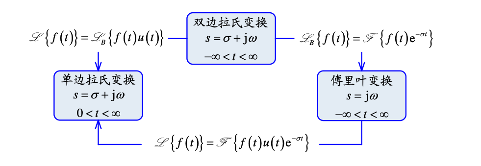

# Laplace变换与Fourier变换的关系

一般而言，若

$$
F(s)=F_a(s)+\sum_{n=1}^N \frac{K_n}{s-\mathrm j\omega_n}
$$

其中$F_a(s)$的极点全部位于左半平面，$\omega_n$是虚轴上的极点。作逆变换得到：

$$
f(t)=f_a(t)+\sum_{n=1}^N K_n\mathrm e^{\mathrm j\omega_nt}u(t)
$$

对上述作傅立叶变换，有

$$
\mathscr F[f(t)]=F_a(\omega)+\mathscr F\left[\sum_{n=1}^N K_n\mathrm e^{\mathrm j\omega_n t}\right]
$$

其中$\mathscr F[f_a(t)]=F_a(\omega)$

$$
\begin{aligned}
\mathscr F[f(t)]&=F_a{\omega}=\sum_{n=1}^NK_n\delta(\omega-\omega_n)\ast \left(\pi\delta(\omega)+\frac{1}{\mathrm j\omega}\right)\\
&=F_a(\omega)+\sum_{n=1}^N\frac{K_n}{\mathrm j\omega -\mathrm j\omega_n} +\sum_{n=1}^N K_n\pi\delta(\omega-\omega_n)\\
&=\left.\begin{matrix}F(s)\end{matrix}\right|_{s=\mathrm j\omega}+\sum_{n=1}^N K_n\pi\delta(\omega-\omega_n)
\end{aligned}
$$

即若虚轴上有极点，原函数的傅里叶变换中有与之对应的冲激函数;如果虚轴上有多重极点，对应的傅里叶变换中会出现冲激函数的各阶导数项。

|变换|Laplace变换 | Fourier变换|
|---|---|---|
|求逆|容易！|困难（可能有$\delta(\cdot)$）|
|电路应用|$H(s)$好用|$H(\mathrm j\omega)$不方便|
|意义|零极点概念用于时域分析、频率响应、稳定性、电路分析和反馈系统|主要用来说明信号传输或通信系统的构成原理，而不是求解具体的响应。|
