# Laplace变换与Fourier变换的应用

### 无失真传输
**失真** 包括线性失真和非线性失真。线性失真包括幅度失真和香味失真。

**全通函数**的幅度没有失真，只有相位发生失真。

**线性系统的无失真传输条件**：要求响应和激励的形状相同，幅度可以变化，延时可以增加。

$$
r(t)=K\cdot e(t-t_0)\,,R(\mathrm j\omega)=K\cdot E(\mathrm j\omega)\mathrm e^{-\mathrm j\omega t_0}=H(\mathrm j\omega)E(\mathrm j\omega)
$$

从而一定有$H(\mathrm j\omega)=K\cdot\mathrm e^{-\mathrm j\omega t_0}$, 即

$$
\begin{cases}
\left|H(\mathrm j\omega)\right|=K\\
\varphi(\omega)=-\omega t_0
\end{cases}\,, h(t)=\delta(t-t_0)
$$

#### 群时延

定义为
$$
\tau(\omega)=-\frac{\mathrm d\varphi(\omega)}{\mathrm d\omega}
$$

意义：

- 若幅频响应和群时延都是常数，则系统无失真，且有延时$\tau$
- $\tau(\omega)$易测量，$\varphi(\omega)$不易测量，故实际设备指标都用$\tau(\omega)$

#### 利用失真形成特定波形

**模拟法**：设计一个系统让他频率响应$H(\mathrm j\omega)=R(\mathrm j\omega)\mathrm e^{-\mathrm j\omega t_0}$并输入$e(t)=\delta(t)$

**数字法**：使用移位寄存器配合加法器、低通滤波器实现

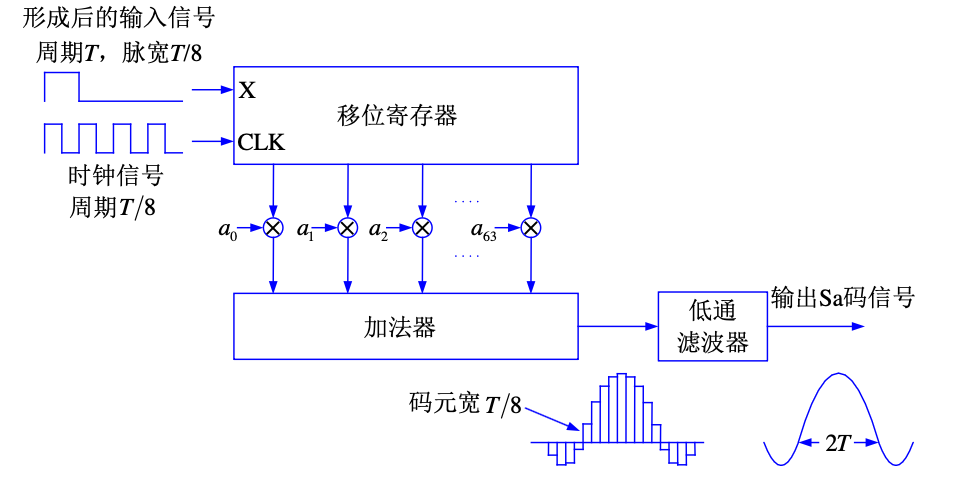

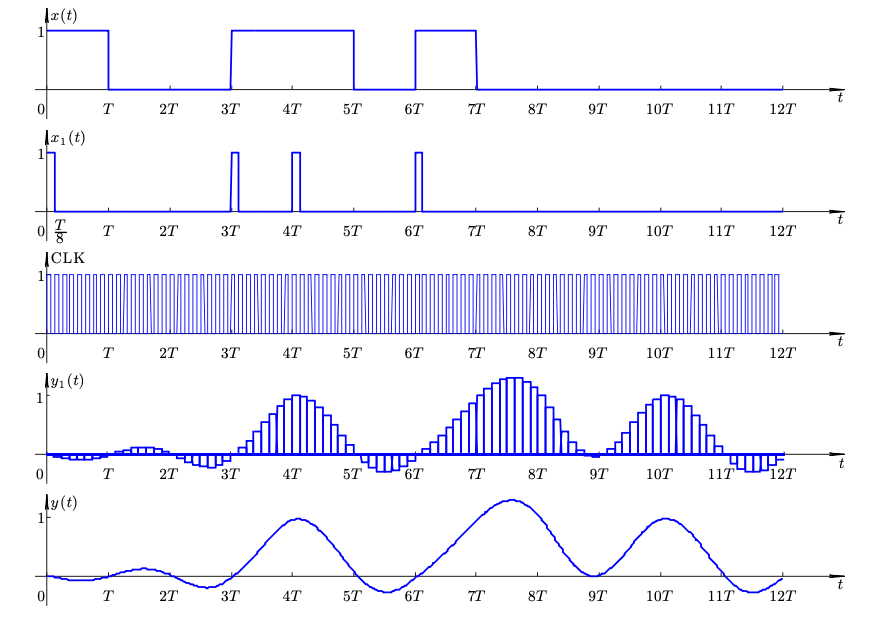
#### 理想低通滤波器

理想低通滤波器：$H(\mathrm j\omega)={H(\mathrm j\omega)\mathrm e^{\mathrm j\varphi(\omega)}}$

其中

$$
|H(\mathrm j\omega)|=\begin{cases}
1,|\omega|<\omega_c;\\
0,\text{elsewhere}
\end{cases}\,,\varphi(\omega)=-\omega{t_0}
$$

这系统可以无失真地传输$[-\omega_c,\omega_c]$之间的信号。

$$
\mathscr F^{-1}\left[H(\mathrm j\omega)\right]=\frac{\omega_c}{\pi}\mathrm{Sa}[\omega_c(t-t_0)]
$$

因此理想低通滤波器是非因果系统（信号到来之前就有响应出现），因此不可实现。

### 系统可实现性、佩里维纳准则

可实现系统要求因果性，因此无法实现理想低通滤波器等非因果系统。可以通过增大阶数（引入更多元件）改善系统性能。

频域角度，可实现性要求 ==幅度函数== $|H(j\omega)|$==满足平方可积==，即

$$
\int_{-\infty}^\infty|H(j\omega)|^2\mathrm d\omega<\infty
$$

因此根据Parsevel定理，系统 ==单位脉冲响应== $h(t)$==也是平方可积的==，即

$$
\int_{-\infty}^\infty|h(t)|^2\mathrm dt<\infty
$$

#### 佩里维纳准则
对于系统的频率响应$H(j\omega)$，如果不满足以下条件，则系统是不可实现的：

$$
\int_{-\infty}^\infty\frac{\left|\ln|H(j\omega)|\right|}{1+\omega^2}\mathrm d\omega<\infty
$$

1. $|H(j\omega)|$不能在连续区间上为零，否则$\ln|H(j\omega)|$在该区间上为负无穷，导致积分发散。
1. $\omega\to\infty$时，$|H(j\omega)|\to 0$的衰减速度受限。如高斯函数的频率响应为$H(j\omega)=e^{-\omega^2}$，则$\ln|H(j\omega)|=-\omega^2$，导致积分发散，因此不可实现。

!!! note  "注意"
    1. 佩里维纳准则是系统可实现性的必要条件，但不是充分条件。
    1. 佩里维纳准则只约束幅度，==不约束相位==
    1. 只有 ==多项式类型== 的函数和 ==双曲函数== 的频率响应满足佩里维纳准则。

#### 希尔伯特变换

佩里维纳准则约束了幅频响应，对于相位（即实虚部的相互约束），需要采用希尔伯特变换。对于因果系统

$$
h(t)=h(t)u(t)=h(t)\mathrm{sgn}(t)
$$

由于稳定性，其傅立叶变换存在

$$
H(j\omega)=\mathscr{F}\{h(t)\}=\int_{-\infty}^\infty h(t)e^{-j\omega t}\mathrm dt=R(\omega)+\mathrm jX(\omega)
$$

根据卷积定理

$$
H(j\omega)=\frac{1}{2\pi}H(j\omega)\ast \mathscr{F}\{\mathrm{sgn}(t)\}
$$

因此

$$
\begin{aligned}
R(\omega)&=\dfrac{1}{\pi}\int_{-\infty}^\infty\frac{X(\omega')}{\omega-\omega'}\mathrm d\omega'\\
X(\omega)&=-\dfrac{1}{\pi}\int_{-\infty}^\infty\frac{R(\omega')}{\omega-\omega'}\mathrm d\omega'
\end{aligned}
$$

即**实部是虚部的希尔伯特变换，虚部是实部的希尔伯特逆变换**。

**希尔伯特变换**定义为：

$$
\hat f(t)=\mathscr{H}\{f(t)\}=\frac{1}{\pi}\int_{-\infty}^\infty\frac{f(\tau)}{t-\tau}\mathrm d\tau=\boxed{f(t)\ast\frac{1}{\pi t}}
$$

逆变换

$$
f(t)=\mathscr{H}^{-1}\{\hat f(t)\}=-\frac{1}{\pi}\int_{-\infty}^\infty\frac{\hat f(\tau)}{t-\tau}\mathrm d\tau=\boxed{\hat f(t)\ast\left(-\frac{1}{\pi t}\right)}
$$

!!! note
    可逆性可以由

    $$
    \frac{1}{\pi t}\ast\left(-\frac{1}{\pi t}\right)=\delta(t)
    $$

    验证。频域上，由于

    $$
    \mathscr{F}\left\{\frac{1}{\pi t}\right\}=-j\mathrm{sgn}(\omega)\,,\mathscr{F}\left\{-\frac{1}{\pi t}\right\}=j\mathrm{sgn}(\omega)
    $$

    得到

    $$
    \mathscr{F}\{\frac{1}{\pi t}\ast\left(-\frac{1}{\pi t}\right)\}=\mathscr{F}\left\{\frac{1}{\pi t}\right\}\cdot\mathscr{F}\left\{-\frac{1}{\pi t}\right\}=-j\mathrm{sgn}(\omega)\cdot j\mathrm{sgn}(\omega)=1
    $$

### 调制解调

调制解调器 (Modem，猫) 指用电话线传送计算机数据的设备。==现代无线系统需要调制解调的原因：==

1. 大气对音频衰减严重，为传输更远将音频调到更高频带
1. 天线尺寸**与信号波长成正比**(至少十分之一)，为降低成本和
体积提高工作频段
1. 多路复用：利用同一介质传输多个信号，例如分割电台
1. 由于**零点漂移**问题，**直流放大器**难以实现

#### 抑制载波调幅（SC-AM）

**调制过程：**通过乘以载波信号$\cos(\omega_c t)$将基带信号调制到高频上

$$
F(\omega)=\frac{1}{2}\left[G(\omega-\omega_c)+G(\omega+\omega_c)\right]
$$

**解调过程：**乘以载波信号$\cos(\omega_c t)$，把信号搬回原来的位置，然后低通滤波拿到基带信号。

$$
\begin{aligned}
g_0(t)&=f(t)\cos(\omega_c t)\\
G_0(\omega)&=\frac{1}{4}\left[G(\omega-2\omega_c)+G(\omega+2\omega_c)\right]+\boxed{\frac{1}{2}G(\omega)}
\end{aligned}
$$

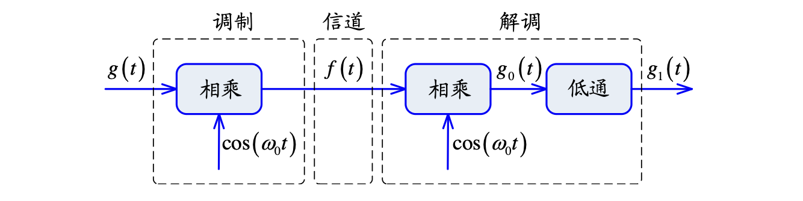

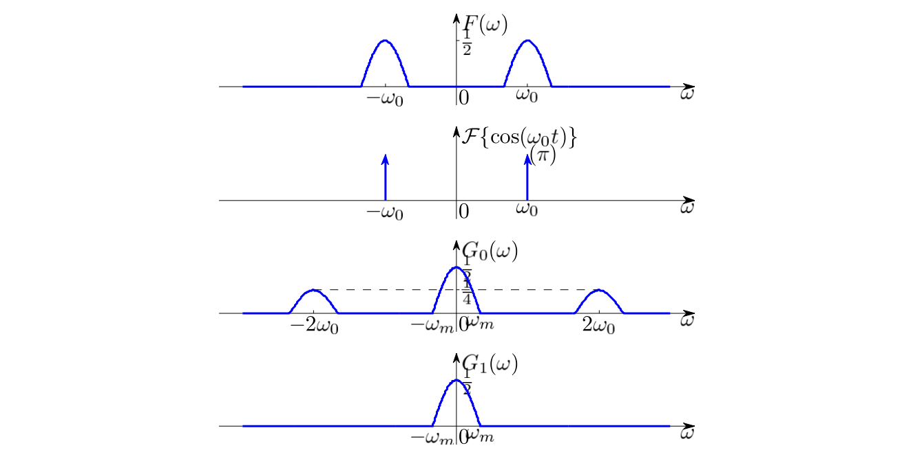

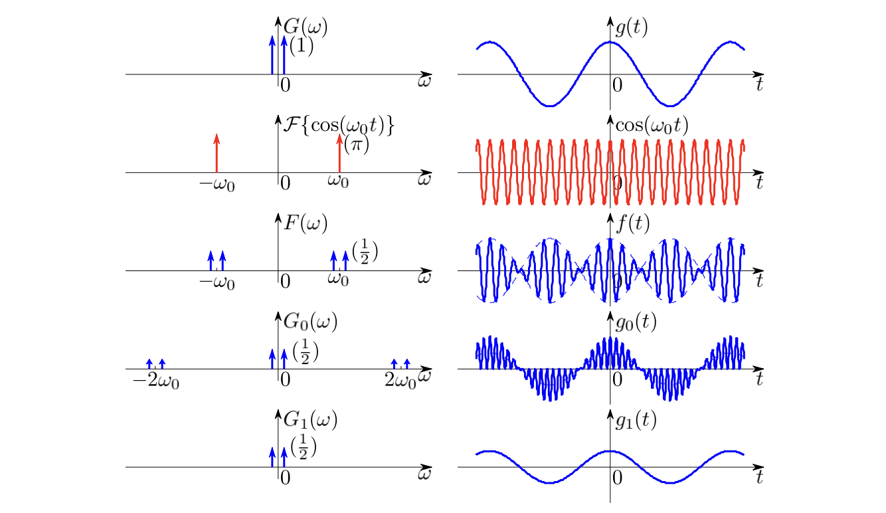

#### 调幅（AM）

由于SC- AM不发送载波，因此需要本地载波，实现复杂。

**调制过程：**AM在发的时候加一个直流，即发送

$$
f(t)=A[1+kg(t)]\cos(\omega_c t)
$$

其中$k=1/A$为调制深度。**AM 的包络体现调制信号，SC-AM 波形不体现。**

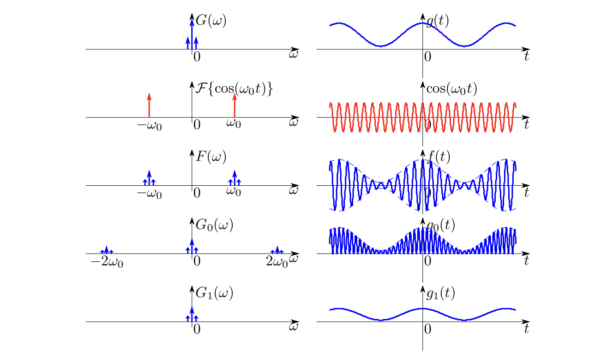

**解调过程：**直接包络检波解调，省去本地载波。

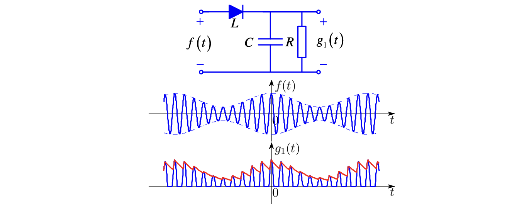

意义：==用更大载波功率换简单接收机==。

|        | SC-AM | AM |
|--------:|:-------:|:-----:|
| **时域** | $f(t)=g(t)\cos(\omega_0 t)$ | $f(t)=[A+g(t)]\cos(\omega_0 t)$ |
| **波形特点** | 包络不是 $g(t)$ | 包络是 $g(t)$ |
| **频域** | $G(\omega \pm \omega_0)$ ，不含 $\delta(\omega)$，无载波成分 | $G(\omega \pm \omega_0)$ ，$\delta(\omega \pm \omega_0)$，保留载波 |
| **解调** | 同步解调： 乘以 $\cos(\omega_0 t)$ 后低通滤波 | 包络检波：不需要载波 |
| **特点** | 优点：节省发射功率 缺点：接收机复杂 | 缺点：浪费发射功率 优点：接收机简单 |
| **典型应用** | 卫星通信 | 广播收音机 |

#### 单边带（SSB）
为了节省频带，只发半个边带，不影响恢复，多用于短波通信、跳频电台等。

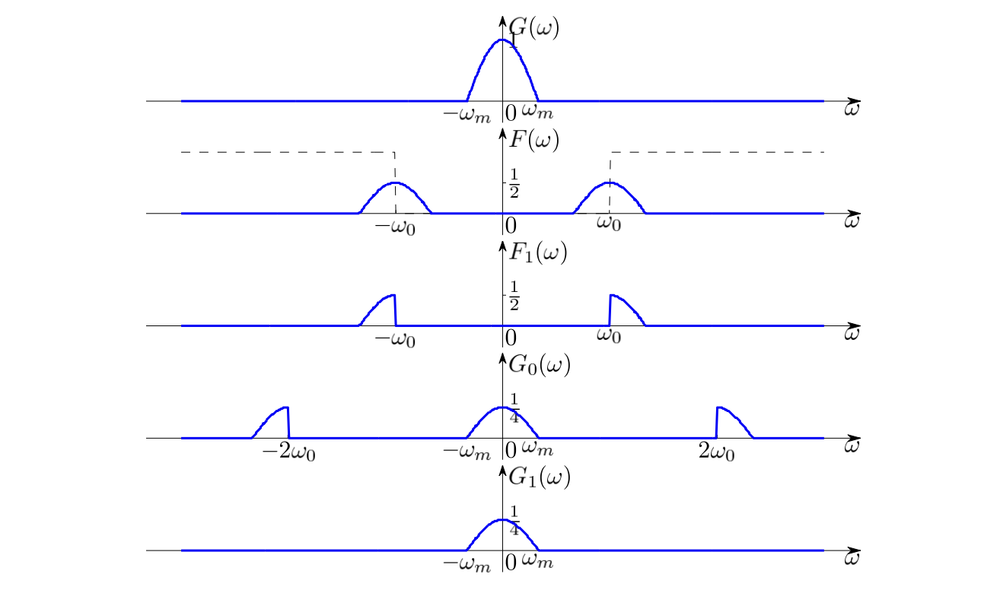

**优点：**节省频带和发射功率

**缺点：**陡峭滤波器难以设计，所以适用于信号中无直流成分且缺少一段低频成分，此时对边带滤波器的要求放宽

#### 残留边带（VSB）
为了降低滤波器设计难度，保留部分边带，常用于电视广播。

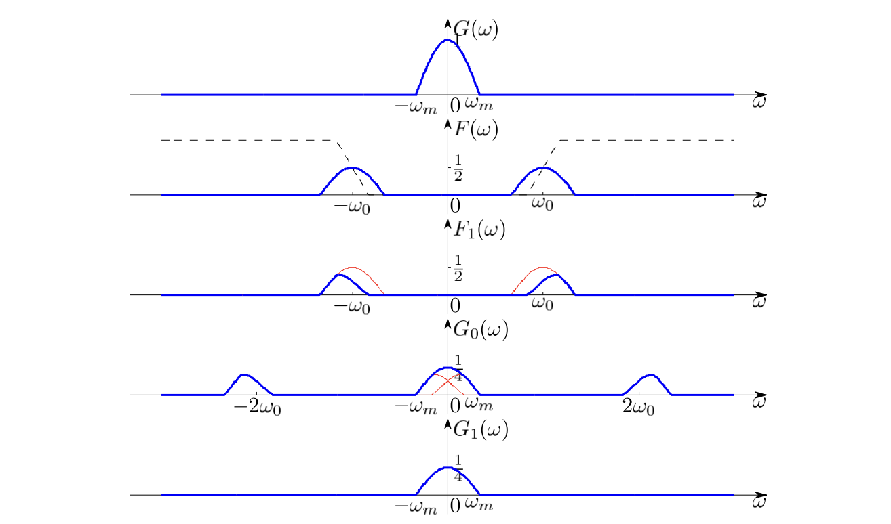

为了保证能恢复，需要边带滤波器在$\omega_c$左右斜对称，即频率特性有

$$
H(\omega_c+\Delta\omega)+H(\omega_c-\Delta\omega)=const.
$$

VSB 是 DSB 和 SSB 的折衷，频带节省了不到一半，但是
滤波器容易实现。实例：==电视图像信号==

#### 调频（FM）和调相（PM）
**调制过程：**

* 调相是以调制信号控制载波的相位

$$
f(t)=A\cos[\omega_c t+g(t)]
$$

* 调频是以调制信号控制载波的频率

$$
f(t)=A\cos\left[\omega_c t+\int_{-\infty}^t g(\tau)\mathrm d\tau\right]
$$

**用**$g(t)$**调频即用**$\displaystyle{\int_{-\infty}^t g(\tau)\mathrm d\tau}$**调相，用**$g(t)$**调相即用**$\displaystyle{\frac{\mathrm d}{\mathrm dt}g(t)}$**调频。**

**解调过程：**以解调频为例，首先求导

$$
\frac{\mathrm d}{\mathrm dt}f(t)=-A\sin\left[\omega_c t+\int_{-\infty}^t g(\tau)\mathrm d\tau\right]\cdot\left[\omega_c+\boxed{g(t)}\right]
$$

得到一个可变频率的AM信号，经过**包络检波器**即可得到调制信号。 也可用**鉴频器或鉴相器**直接提取出频率或相位变化。

**优点**

1. 和 AM 相比，已调信号幅度保持不变，保证发射机工作在峰值功率状态
1. 信道中的加性噪声和衰落引发的幅度变化将直接加在 AM的调制信号上，但对 PM 和 FM 信号，能在很大程度上被接收机消除

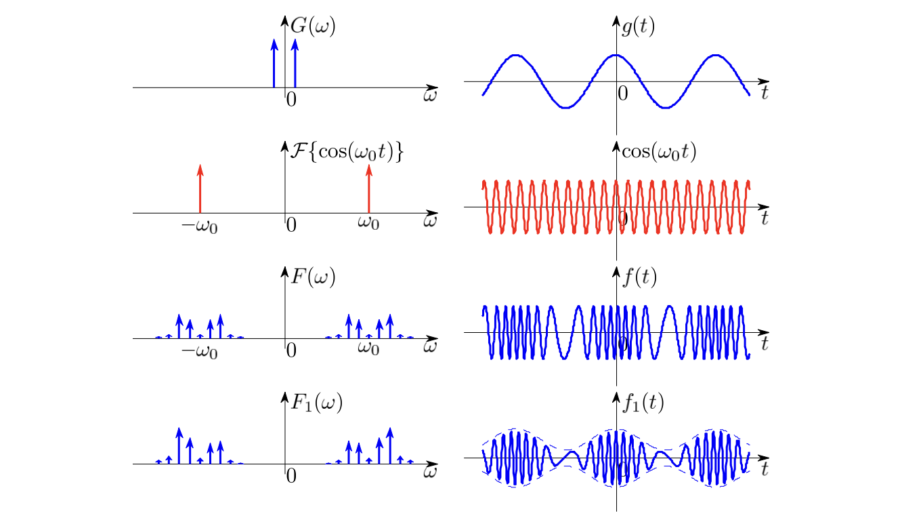

#### 复用
**频分复用（FDM）**：将不同信号调制到不同载波上，利用频带分割实现多路复用。

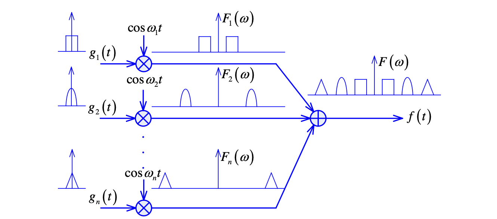

**解复用**：通过带通滤波器提取出对应频段的信号，然后解调得到原始信号。

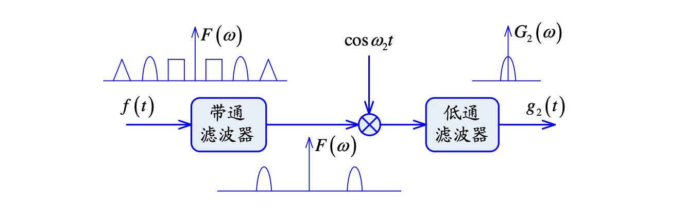
