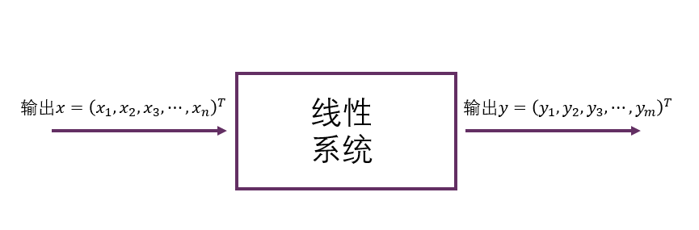
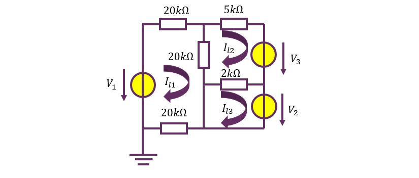
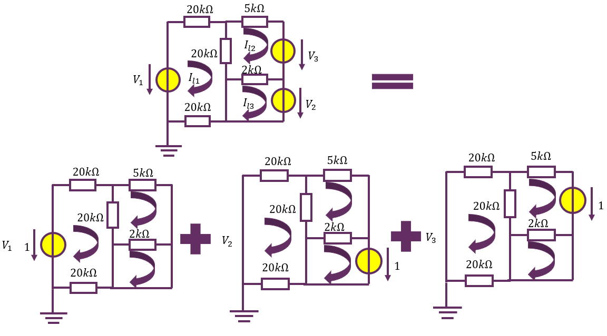

# 0	前言

<!-- ### 0.0	往年题考点汇总表（2019-2023）

|      | 2019             | 2020                 | 2021                 | 2022                   | 2023                   |
| ---- | ---------------- | -------------------- | -------------------- | ---------------------- | ---------------------- |
| 1    | 行变换           | 线性方程组           | 矩阵乘法             | 线性方程组             | 矩阵乘法               |
| 2    | 矩阵的逆         | 矩阵的逆、矩阵乘法   | 矩阵的逆             | 线性方程组             | 线性方程组             |
| 3    | 矩阵的逆         | 线性方程组           | LU分解、矩阵的逆     | 线性方程组             | 线性方程组             |
| 4    | 矩阵乘法、线性性 | 线性方程组           | 子空间与基           | 四大空间、子空间与基   | 线性方程组             |
| 5    | 线性方程组       | 四大空间、行变换     | 线性方程组           | 线性方程组             | 线性方程组             |
| 6    | 四大空间、行变换 | 四大空间             | 四大空间、子空间与基 | LU分解                 | LU分解                 |
| 7    | 线性方程组       | **矩阵方程**         | **幂0矩阵**          | 矩阵的逆、四大空间     | **矩阵乘法、线性变换** |
| 8    | 矩阵的逆、LU分解 | **LU分解、矩阵的逆** |                      | 矩阵的秩、线性方程组   | 四大空间、子空间与基   |
| 9    | 秩一分解         |                      |                      | **矩阵的逆**           | 子空间与基             |
| 10   | 矩阵的交换       |                      |                      | **矩阵方程、矩阵的秩** | **子空间与基**         |
| 11   | 矩阵的转置       |                      |                      |                        |                        |
| 12   | **矩阵方程**     |                      |                      |                        |                        |

!!! warning
    由于今年《线性代数》课程改革，教学顺序发生了完全的改变，因此上述内容仅作参考！！！ -->

###	0.1	什么是vector：*向量*，*矢量*，`std::vector`

不同的专业的学生（数学系的，计算机系的，和物理系的）对**向量**有三种不同理解：

1. **代数理解**：定义了加法、数乘的“玩意”
2. **应用理解**：有序的一串数据
3. **几何理解**：空间中的有向线段

这三种解释是对同一事物的不同看法，做题采用三种不同理解有时会有不同的收获。比如对于我们常见的

$$
\mathbf {Ax}=\mathbf b
$$

这一形式，三位学生分别会理解成：

1. **代数理解**：向量$\mathbf x$在线性映射$f(\mathbf x)=\mathbf{Ax}$作用下的像为$\mathbf b$

2. **应用理解**：变元$x_1,x_2,x_3\cdots x_n$满足方程组

 $$
   \begin{cases}
   a_{11}x_1+a_{12}x_2+\cdots+a_{1n}x_n&=b_1\\
   a_{21}x_1+a_{22}x_2+\cdots+a_{2n}x_n&=b_2\\
   \vdots\quad\\
   a_{m1}x_1+a_{m2}x_2+\cdots+a_{mn}x_n&=b_m\\
   \end{cases}
 $$

3. **几何理解**：某组线性变换（下半学期会学到，可以处理成旋转——伸缩——旋转的三部曲等等）将点$\mathbf x$变换到点$\mathbf b$

而事实上，这三种理解对于解决这个问题而言是等价的，这也就提供了不同的解决方案：找逆映射（求$\mathbf A^{-1}$)作用于$\mathbf b$上，解多元线性方程组，以及找到线性变换的容易handle的分解方法（比如相似对角化等等）。

### 0.2	线性系统：如如不动之美

{: style="display: block; margin: auto; width: 60%;" }

关于线性系统，重点理解何为“叠加定理”。

> 线性系统是指，这个系统的输入与输出符合叠加原理，即如下两条性质：输入放大或缩小某一倍数，则产生的输出也放大或缩小相同的倍数，称为**齐次性**，两组输入产生的输出是两者分别产生的独立输出之和，称为**可加性**。

!!! example	
    线性电路中，有若干源（电流源，电压源）视为输入，将各回路电流作为输出，则可视为线性系统。

    {: style="display: block; margin: auto; width: 60%;" }

    所谓**叠加性**，在此例中体现为：对于总输入（电路问题中也称为**激励**）$\mathbf x = [V_1\quad V_2\quad V_3]^T$ ,总输出（电路问题中也称为**响应**）$\mathbf y=[I_{l1}\quad I_{l2}\quad I_{l3}]^T$总等于输入的各个分量单独作用产生的输出(称为**分响应**)之和。

    {: style="display: block; margin: auto; width: 60%;" }

    因此倘若求出了三个**单位输入**（$[1\quad 0\quad 0]^T$，$[0\quad 1\quad 0]^T$，$[0\quad 0\quad 1]^T$对应的响应$\mathbf {\alpha_1,\alpha_2,\alpha_3}$，也就是后面*表示矩阵*部分讲到的标准正交基对应的函数值）就可以对任意的$\mathbf x = [V_1\quad V_2\quad V_3]^T$求得总响应为：

    $$
    \mathbf y=\begin{bmatrix}
    I_{l1}\\
    I_{l2}\\
    I_{l3}\\
    \end{bmatrix}=\begin{bmatrix}
    \mathbf \alpha_1&\mathbf \alpha_2 & \mathbf \alpha_3
    \end{bmatrix}\begin{bmatrix}
    V_{1}\\
    V_{2}\\
    V_3
    \end{bmatrix}
    =\begin{bmatrix}
    a_{11}&a_{12}&a_{13}\\
    a_{21}&a_{22}&a_{23}\\
    a_{31}&a_{32}&a_{33}\\
    \end{bmatrix}\begin{bmatrix}
    V_{1}\\
    V_{2}\\
    V_3
    \end{bmatrix}= A \mathbf x
    $$

    $$
    \mathbf y = A\mathbf x
    $$

为了和《线性代数》对齐，此处的记号和电子学通用的记号稍有不同。下个学期的**《电子电路与系统基础》**中会详细介绍利用线性代数工具分析电路的各种技巧。这里仅仅作为一个引子，说明线性代数在工科的广泛应用和解释“线性系统”的意义。

通过这个例子可以理解：线性系统就是“每个输入的输出可以单独拎出来”的系统。对于我们工科学生而言，《线性代数》的一大重点就在于**线性变换**的理解。
