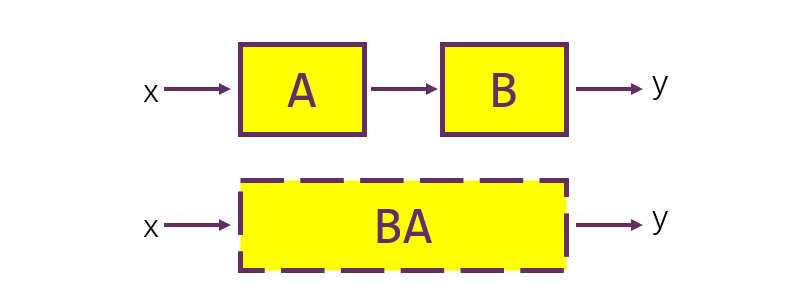

# 1	知识梳理

### 1.1	线性映射及其描述：一路向前

#### 线性空间：线性映射的作用域

设$V$为定义了$\cdot$（**数**乘），$+$（加法）两种**封闭**运算的集合，若其满足

$$
\begin{aligned}
	\alpha+\beta&=\beta+\alpha&\textcolor{purple}{(加法交换律)}\\
	(\alpha+\beta)+\gamma &=\alpha+(\beta+\gamma)&\textcolor{purple}{(加法结合律)}\\
	\exists\theta\in V,\forall \alpha\in V,&\alpha+\theta=\alpha&\textcolor{purple}{(加法有幺元)}\\
	\forall \alpha\in V,\exists-\alpha\in V,&\alpha+(-\alpha)=\theta&\textcolor{purple}{(加法有逆元)}\\
	\exists 1\in \mathbb F,&1\alpha=\alpha&\textcolor{red}{(数乘有幺元)}\\
	\forall k,l\in \mathbb F,&k(l\alpha)=(kl)\alpha&\textcolor{red}{(数乘结合律)}\\
	k(\alpha+\beta)&=k\alpha+k\beta&\textcolor{green}{(数乘分配律)}\\
	(k+l)\alpha&=k\alpha+l\alpha&\textcolor{green}{(数乘分配律)}
\end{aligned}
$$

八条性质，则称$V$是数域$\mathbb F$上的线性空间。

若$V$上定义了内积运算，满足

$$
\begin{aligned}
\alpha \cdot \alpha &\ge 0 &\textcolor{purple}{(正定性)}\\
\alpha \cdot \beta &= \beta \cdot \alpha &\textcolor{purple}{(交换律)}\\
(k_1\alpha_1+k_2\alpha_2)\cdot\beta&=k_1\alpha_1\cdot\beta+k_2\alpha_2\cdot\beta & \textcolor{purple}{(线性性)}\\
\end{aligned}
$$

则称之为**欧氏空间**。可以定义**范数**（俗称模长，长度）：

$$
||\alpha||:=\sqrt{\alpha\cdot\alpha}
$$

欧氏空间的性质：*Cauchy*不等式（三角不等式）

$$
||\alpha+\beta||\le ||\alpha||+||\beta||
$$

#### 向量及其运算: 线性映射的作用对象

向量之间可以定义**点积**（内积）、**叉积**（外积）等运算。

**内积**表示投影长度，为$V\times V\to \mathbb{R}$ 的实值运算。**叉积**表示有向面积，为$V\times V\to V$ 的向量值运算。

#### 向量组及其线性组合：向量世界的建构

向量组是一组向量。我们一般研究如下问题：

1. 能否用一个向量组线性表出另一个向量、另一个向量组？
2. 如何得到极大线性无关组？
3. 极大线性无关组的向量数（秩、维数）

**线性组合**	对一个向量组$\alpha_1,\alpha_2,\cdots\alpha_r$和向量$v$，若存在数$k_1,k_2,\cdots k_r$使得

$$
v=\sum_{i=1}^rk_i\alpha_i
$$

则称$v$可被$\alpha_1,\alpha_2,\cdots\alpha_r$线性表出。右侧的求和式称为向量$\alpha_1\cdots\alpha_r$的**线性组合**.

**生成子空间**	由一个向量组内向量的所有线性组合构成的空间，维数等于向量组的秩。

记作

$$
V=span(\alpha_1,\alpha_2,\cdots)
$$

显然，$\mathbf 0\in V$

**线性相关**	若向量组$\alpha_1,\alpha_2,\cdots\alpha_r$存在一个**非平凡的**线性组合其值为$0$，则称该向量组**线性相关**。否则，若该向量组的**全部非平凡**线性组合值都非0，则称该向量组**线性无关**。

线性相关意味着（等价于）向量组内某个/某几个向量可被其他向量线性表出。一个向量组的元素最多的线性无关的子集称为其**极大线性无关组**（极大：再加一个都会线性相关），一个向量组的**极大线性无关组**的元素个数称为其**秩**，记作$rank$一个向量组的生成子空间的**维数**定义为其**极大线性无关组**的元素个数，记作$\dim$；这线性无关组称为一组**基**.

**矩阵与线性组合**	通过列向量的线性组合，将矩阵定义为“一排列向量”：

$$
A:=\begin{bmatrix}
\mathbf \alpha_1&\mathbf \alpha_2&\mathbf \alpha_3&\cdots&\mathbf \alpha_r
\end{bmatrix}\\
=\begin{bmatrix}
a_{11}&a_{12}&\cdots&a_{1r}\\
a_{21}&a_{22}&\cdots&a_{2r}\\
\vdots&\vdots&\ddots&\vdots\\
a_{m1}&a_{m2}&\cdots&a_{mr}\\
\end{bmatrix}
$$

矩阵右乘向量定义为其列向量的线性组合：

$$
A\mathbf x =\sum_{i=1}^rx_i\mathbf \alpha = x_1\mathbf \alpha_1+x_2\mathbf \alpha_2+\cdots+x_r\mathbf \alpha_r
$$

#### 线性映射及其表示矩阵：用分响应刻画全响应

**线性映射**是指对线性组合满足交换律的映射。即：自变量的线性组合results in因变量的线性组合。写成严谨的数学语言就是：

$$
\begin{cases}
f(x_1+x_2) &= f(x_1)+f(x_2)\quad 保加法\\
f(kx) &= kf(x)\quad 保数乘
\end{cases}
$$

也可以概括为：

$$
f(\alpha x_1+\beta x_2)=\alpha f(x_1)+\beta f(x_2), \alpha,\beta \in\mathbb{R}
$$

保加法和保数乘，共同构成*叠加定理*。即，分响应之叠加即为各激励叠加之总响应。

假设$f:\mathbb{R}^n\to\mathbb{R}^m$是线性映射，对于向量组$e_1,e_2,\cdots e_n\in\mathbb{R}^n$,若其各自的像（响应，输出）为$\alpha_1,\alpha_2,\cdots\alpha_m\in\mathbb{R}^m$,对于新的向量$x \in span(e_1\cdots e_n)$总能表示为

$$
x=x_1e_1+x_2e_2+\cdots+x_ne_n
$$

这样的形式，且根据叠加定理，有

$$
\begin{aligned}
f(\mathbf x)&=f(x_1e_1+x_2e_2+\cdots+x_ne_n)\\
&=x_1f(e_1)+x_2f(e_2)+\cdots x_nf(e_n)&叠加原理\\
&=x_1\alpha_1+x_2\alpha_2+\cdots+x_n\alpha_n&\\
&=\begin{bmatrix}
\alpha_1&\alpha_2&\cdots&\cdots\alpha_n
\end{bmatrix}\begin{bmatrix}
x_1\\x_2\\\vdots\\x_n
\end{bmatrix}
=A\mathbf x
\end{aligned}
$$

这里我们又定义了**矩阵乘向量**的含义：分响应的线性组合为总响应。

为了能够完整地表现$f(\cdot)$的作用效果，我们一般取$e_1,e_2\cdots e_n$为$\mathbb{R}^n$一组基，即令$span(e_1,e_2,\cdots e_n)=\mathbb{R}^n$.因此，可以定义映射$f(\cdot)$在基$e_1\cdots e_n$上的表示矩阵为

$$
A:=\begin{bmatrix}
f(e_1)&f(e_2)&\cdots&f(e_n)
\end{bmatrix}
$$

古人有诗赞曰：

>一个线性映射的行为由他在基上的行为完全确定。

**线性映射的复合与矩阵乘法**	若有线性映射

$$
\begin{aligned}
f:\mathbb{R}^n&\to\mathbb{R}^k\quad g:\mathbb{R}^k\to\mathbb{R}^m\\
\mathbf x&\mapsto A\mathbf x\quad\quad\mathbf y\mapsto B\mathbf y
\end{aligned}
$$

定义线性映射的复合为

$$
g\circ f(\cdot):=g(f(\cdot))
$$

根据我们的定义，有

$$
g\circ f(\mathbf x)=B(A\mathbf x)=(BA)\mathbf x
$$

这里最后一步依赖于矩阵乘法的结合律。可见：

> 矩阵的乘法对应线性变换的复合。

{: style="display: block; margin: auto; width: 60%;" }

**$\mathbb{R}^n$的自然基**	为了好算，我们一般取

$$
e_1=\begin{bmatrix}
1\\0\\\vdots\\0
\end{bmatrix},e_2=\begin{bmatrix}
0\\1\\\vdots\\0
\end{bmatrix},\cdots,e_n=\begin{bmatrix}
0\\0\\\vdots\\n
\end{bmatrix}
$$

作为$\mathbb{R}^n$的基进行表示矩阵的书写与计算。

**初等变换**	初等变换是一类特殊的变换。

1. 对换变换$P_{ij}$：互换两行（列）位置
2. 倍乘变换$E_{i}(k)$：把第$i$行（列）同乘一个非零常数$k$
3. 倍加变换$E_{ij}(k)$：把第$i$行（列）的$k$倍加到第$j$行（列）上。

其表示矩阵分别为

$$
\begin{aligned}
\mathbf P_{ij}& = \begin{bmatrix}
1 & & & &\\
& 0 & &1&\\
& & \ddots &&\\
& 1&&0&\\
& & & &1
\end{bmatrix}\quad(\mathbf I_n互换i，j行)\\
\mathbf E_i(k)&=\begin{bmatrix}
1 & & & &\\
& 1 & &&\\
& & \ddots &&\\
& &&k&\\
& & & &1
\end{bmatrix}\quad(\mathbf I_n第i行1变成k)\\
\mathbf E_{ij}(k)&=\begin{bmatrix}
1 & & & &\\
& 1 & &k&\\
& & \ddots &&\\
& &&1&\\
& & & &1
\end{bmatrix}\quad(\mathbf I_n(j,i)元素0变成k)\\
\end{aligned}
$$

#### 秩与行列式：线性映射的参数

**列空间**	列空间$R(A)$定义为矩阵$A$全部列向量张成的线性空间。

##### 秩

**矩阵的秩**刻画了线性映射在维度上的表现。矩阵的秩（可以证明，行秩等于列秩）定义为其所有列作为向量构成的向量组的秩（极大线性无关组大小）。即

$$
rank(A)=rank(\alpha_1,\cdots,\alpha_n)=\dim span(\alpha_1,\alpha_2,\cdots,\alpha_n)=\dim R(A)
$$

由于线性映射$f(\mathbf x)=A\mathbf x$的值域即$A$的列向量全部线性组合$span(\alpha_1,\alpha_2,\cdots,\alpha_n)$,因此矩阵$A$的秩就是映射$f(\cdot)$的值域的维数。

**满秩矩阵**	若$A\in M_{m\times n}(\mathbb{R})$ ，$rank(A)=m$，则称$A$是**行满秩的**。若$rank(A)=n$，则称$A$是**列满秩的**。表示矩阵行满秩的线性映射，其值域为$\mathbb{R}^m$.

特别对于方阵$A\in M_n(\mathbb{R})$：

- 矩阵$A$满秩说明映射$f(\mathbf x)=A\mathbf x$ 的像覆盖整个空间$\mathbb{R}^n$,对于每个$\mathbf y\in \mathbb{R}^n$,总能找到$\mathbf x\in \mathbb{R}^n$, $\mathbf y = A\mathbf x$。此时，映射$f$为一一映射（双射、可逆映射）。
- 矩阵$A$不满秩说明映射$f$的像只能覆盖$\mathbb{R}^n$的一个低维子空间$R(A)$，可以形象理解为映射$f$将$\mathbb{R}^n$*压缩*到了低维空间$R(A)$.压缩过程伴随着一些维度的信息丢失，因此无法通过映射$f$的像复原出$\mathbf x$的值。此时，$f$不可逆。

矩阵的秩具有如下性质。这些性质可以用*分块矩阵*的方法证明，之后我们回过头再来看。

**基础公式**

$$
\begin{aligned}
rank (A)=rank(A^T)=rank(A^TA)\\
rank(kA)=rank(A)\quad,k\ne 0\\
rank(A+B)\le  rank(A)+rank(B)\\
rank(AB)\le  \min\\{rank(A),rank(B)\\}\\
A可逆\Rightarrow rank(AB)=rank(B)=rank(A)\\
\end{aligned}
$$

**Sylvester不等式**	设$A\in M_{m\times s}(\mathbb{R}),\quad B\in M_{s\times n}(\mathbb{R}).$则

$$
rank(A)+rank(B)-s\le rank(AB)\le \min\\{rank(A),
rank(B)\\}
$$

**Frobenius不等式**	设乘积$ABC$有意义，则

$$
rank(ABC)\ge rank(AB)+rank(BC)-rank(B)
$$

**第一降阶定理**	设$A$可逆，则

$$
rank\begin{bmatrix}
A & B\\
C & D
\end{bmatrix}=rank(A)+rank(D-CA^{-1}B)
$$

**第二降阶定理**	设$A,D\in M_{r\times s}(\mathbb{R})$可逆，$B\in M_{r\times s}(\mathbb{R}),\quad C\in M_{s\times r}(\mathbb{R})$,则：

$$
rank(D-CA^{-1}B)=rank(D)-rank(A)+rank(A-BD^{-1}C)
$$

##### 行列式

表示矩阵的**行列式**刻画了映射在（有向）体积上的作用。我们以这样的方式重新认识行列式：定义行列式为某空间区域所有点经过这一映射后得到的新的空间区域，其**有向**体积与映射前之比为$\det A$。

那么，行列式自然具有这样的特性：

- 若$A$不满秩，则变换$A$将高维图形投影成低维图形，从而体积比为$0$.因此，不满秩矩阵的行列式为$0$。
- 根据同底等高不改变体积的原理，*错切变换*不改变体积，因此错切变换的行列式为$1$.
- 将图形沿着某个方向压缩或拉伸至$k$倍，体积应当变成$k$倍。因此单个维度的拉伸变换其行列式为$k$.
- 将图形的两个维度对换，“有向”体积应当区分这两者，因此对换两个维度的变换其行列式为$-1$.
- 将图形经过多次连续的线性变换，体积的总变化是每次变化比例之积，因此行列式也应当是每次变换的行列式之乘积。
- 如如不动的变换（学名恒同变换）其不改变体积，因此$\det I_n = 1$.

这种定义方法并不是非常数学，但可以直观的理解一些事情。写成数学，就是行列式具有这样的特性：

- 列多线性。对每个列向量都线性：对任意$i=1,2,\cdots,n$,有

$$
  \det\begin{bmatrix}
  \cdots&k\alpha_i+k'\alpha_i'&\cdots
  \end{bmatrix}\\=k\det\begin{bmatrix}
  \cdots&\alpha_i&\cdots
  \end{bmatrix}+k'\det\begin{bmatrix}
  \cdots&\alpha_i'&\cdots
  \end{bmatrix}
$$

- 列反对称性。对任意$i,j=1,2\cdots,n$,$i<j$，有

$$
  \det[\cdots,\alpha_i,\cdots,\alpha_j,\cdots]=-\det[\cdots,\alpha_j,\cdots,\alpha_i,\cdots]
$$

- 单位化。$\det I_n=1$

可以证明这个函数$\det$ 是唯一的。

**行列式的计算方法**

对于二三阶矩阵，行列式可以直接计算(主对角-副对角）。

$$
\det\begin{bmatrix}
a_{11} & a_{12}\\
a_{21} & a_{22}
\end{bmatrix}=a_{11}a_{22}-a_{12}a_{21}
$$

$$
\det\begin{bmatrix}
a_{11} & a_{12} & a_{13}\\
a_{21} & a_{22} & a_{23}\\
a_{31} & a_{32} & a_{33}\\
\end{bmatrix}=a_{11}a_{22}a_{33}+a_{12}a_{23}a_{31}+a_{13}a_{21}a_{32}\\-a_{13}a_{22}a_{31}-a_{12}a_{21}a_{33}-a_{11}a_{23}a_{32}
$$

以上两式之正确性可以通过带入$\det$函数的性质并结合$\det$ 函数的唯一性证明，留给同学们自行完成。

对于高阶矩阵，直接计算将会耗费大量的时间，还会因为记错公式造成错误。所以我们常常这么干：

1. 化成对角阵/上三角阵。这类矩阵的行列式直接就是主对角线的乘积。
2. 化成$0$尽量多的形式，然后作*Laplace*展开。
3. 用数学归纳法。比如求解*Vandermonde*行列式。

还有更多方法，将在例题选讲中提到。这里，我们回归主线。

### 1.2	线性方程组：退步原来是向前

线性方程组的求解本质是回答这样的问题：我有一个线性映射，而且我知道$f(\mathbf x)$的值，怎么根据输出找到输入呢？

#### 像与原像

对于映射

$$
y = f(x)
$$

称$y$为$x$的像，$x$为$y$的原像。解方程实际上就是给定一个$y$,求解$x$的过程。因此如果有一个函数$f^{-1}(y)=x$,就可以很方便的求出$x$来了。

对于一个线性方程组

$$
\begin{cases}
a_{11}x_1+a_{12}x_2+\cdots+a_{1n}x_n&=b_1\\
a_{21}x_1+a_{22}x_2+\cdots+a_{2n}x_n&=b_2\\
\vdots\quad\\
a_{m1}x_1+a_{m2}x_2+\cdots+a_{mn}x_n&=b_m\\
\end{cases}
$$

我们用矩阵记号将其改写为

$$
A\mathbf x = \mathbf b
$$

我们称下列三种变换为线性方程组的**初等变换**：

1. 对换变换：互换两条方程的位置
2. 倍乘变换：把某方程的两边同乘一个非零常数$k$
3. 倍加变换：把某个方程的$k$倍加到另一个方程上。

很显然，**初等变换不会改变线性方程组的解**。

#### 齐次线性方程组的解的形式与零空间

齐次线性方程组定义为

$$
A\mathbf x = \mathbf 0
$$

型的线性方程组，表示$\mathbf x$的像落在*原点*上。

若齐次线性方程组有非平凡解$x_0\ne 0$，则说明$kx_0$都是其解，类似的若齐次线性方程组有多个非平凡解，则其线性组合都是其解。这些解构成了一个线性子空间，记作$N(A)$.齐次线性方程组有非平凡解，说明$N(A)$非$\\{\mathbf 0\\}$,从而该映射将高维空间$N(A)$投射到低维空间$\\{\mathbf 0\\}$,因此$A$为行不满秩矩阵。

若齐次线性方程组只有平凡解$0$,则等价于映射$f(x)=Ax$可逆.

因此，齐次线性方程组的解就是其零空间$N(A)$.

#### 非齐次线性方程组的解的形式

非齐次线性方程组定义为

$$
A\mathbf x=\mathbf b
$$

若找到一个**特解**$x_0$，满足$Ax_0 = b$，那么任何其他的解$x$,都满足

$$
A(x-x_0)=b-b=0\\
x-x_0 \in N(A)
$$

若找不到，则没有解。

从而非齐次线性方程组的解的形式为：

$$
\left\\{
\begin{aligned}
\\{x|x=x_0+v,v\in N(A)\\},&\quad \exists x_0,Ax_0=b\\
\\{x_0\\},&\quad \exists x_0,Ax_0=b且N(A)=\\{0\\}\\
\emptyset ,&\quad \nexists x_0,Ax_0=b\\
\end{aligned}
\right.
$$

分别对应方程有无穷个、一个、零个解三种情形。

#### 线性方程组的解法

根据前面的分析，我们不难想到大致思路：先解决齐次方程组，求得矩阵$A$的零空间$N(A)$的一组基；再解决非齐次方程组,找到一组特解。

零空间$N(A)$的一组基称为**基础解系**。

**高斯消元法**	

对于线性方程组

$$
\begin{cases}
a_{11}x_1+a_{12}x_2+\cdots+a_{1n}x_n&=b_1\\
a_{21}x_1+a_{22}x_2+\cdots+a_{2n}x_n&=b_2\\
\vdots\quad\\
a_{m1}x_1+a_{m2}x_2+\cdots+a_{mn}x_n&=b_m\\
\end{cases}
$$

我们将他写成增广矩阵

$$
[A | b ]
$$

形式，再通过**初等行变换**将其左侧转化为**行简化阶梯型**。

$$
\left[
\begin{array}{c|c}
\begin{matrix}
0 &\cdots&0&1&\cdots&0&\cdots&0\\
0 & &\cdots&0&\cdots&1&\cdots&0\\
\vdots&&&&&&\vdots\\
0 & & & \cdots & & 0 & 1&0\\
0 &&&\cdots&&&0&0\\
0 &&&\cdots&&&0&0\\
\vdots&&&&&&\vdots\\
\end{matrix}&
\begin{matrix}
\tilde b_1\\
\tilde b_2\\
\vdots\\
\tilde b_r\\
\tilde b_{r+1}\\
\vdots\\
\vdots\\
\end{matrix}
\end{array}
\right]
$$

此时，$\tilde A$ 非零行数目即为$rank A = r$,做讨论：

- 若$\exists s \gt r$,$\tilde b_s \ne 0$,则方程组无解。
- 若$r=m$, 则$\tilde A$行满秩，从而$A$ 行满秩，进而有唯一解。此时的$\tilde b$即为解。
- 若$r\lt m$, 则$\tilde b$对应主元的特解，通过将$\tilde A$的每个0列（自由元）对应的$x$依次置$1$得到基础解系,进而合成出解。

#### $LU$分解

将矩阵分解为

$$
A=LU
$$

其中$L$为**单位**下三角矩阵，$U$为上三角矩阵的方式称为$LU$分解。**$LU$分解存在当且仅当$A$的前$rank A$阶顺序主子阵可逆。**

!!! warning
    注意：**不可逆的矩阵也可以存在LU分解**。下面即一个例子。

$LU$分解的方法：先U后L。首先进行行倍加变换把$A$变成上三角矩阵$U$,每次倍加记录下一个产生的主列的信息（这里主元标红，将变成$0$的元标紫色）

$$
A=\begin{bmatrix}
\textcolor{red}2 & -4 & -2 & 3 \\
\textcolor{purple}6 & -9 & -5 & 8\\
\textcolor{purple}2 & -7 & -3 & 9\\
\textcolor{purple}4 & -2 & -2 & -1\\
\end{bmatrix}\sim\begin{bmatrix}
2 & -4 & -2 & 3 \\
0 & \textcolor{red}3 & 1 & -1\\
0 & \textcolor{purple} {-3} & -1 & 6\\
0 & \textcolor{purple}6 & 2 & -7\\
\end{bmatrix}\\\sim\begin{bmatrix}
2 & -4 & -2 & 3 \\
0 & 3 & 1 & -1\\
0 & 0 & 0 & \textcolor{red}5\\
0 & 0 & 0 & \textcolor{purple}{-5}\\
\end{bmatrix}\sim\begin{bmatrix}
2 & -4 & -2 & 3 \\
0 & 3 & 1 & -1\\
0 & 0 & 0 & 5\\
0 & 0 & 0 & 0\\
\end{bmatrix}=U\\
$$

而后把紫色除以红色构成L的下半部分，对角线全1得到：

$$
L = \begin{bmatrix}
1 &  &  &  \\
\textcolor{purple}6/\textcolor{red}2 & 1 & &\\
\textcolor{purple}2/\textcolor{red}2 & \textcolor{purple}{-3}/\textcolor{red}3 &1&\\
\textcolor{purple}4/\textcolor{red}2 & \textcolor{purple}6/\textcolor{red}3&\textcolor{purple}{-5}/\textcolor{red}5&1\\
\end{bmatrix}= \begin{bmatrix}
1 &  &  &  \\
3 & 1 & &\\
1 & -1 &1&\\
2 & 2&-1&1\\
\end{bmatrix}
$$

还有种分解称为$LDU$分解，要求$U$为**单位**上三角矩阵。

通过$LU$分解，可以方便地求矩阵的行列式和线性方程组的解。

#### 矩阵的逆

我们知道给定一组基后，矩阵即可表示一种线性映射。有的线性映射是可逆的，这些映射的逆映射也可以找到表示矩阵。

我们知道：

$$
f\circ f^{-1}=id
$$

因此

$$
AA^{-1}=I_n
$$

即只要找到一个矩阵，它与原矩阵$A$相乘得到单位阵$I_n$，就找到了矩阵的逆。

现在我们来回顾线性方程组

$$
A\mathbf x = \mathbf b
$$

从映射的角度来看，它表示向量$\mathbf x$ 经过线性变换$A$打到向量$\mathbf b$，而我们现在已知$\mathbf b$和$A$,想要求出$\mathbf x$.那么只需要知道$A^{-1}$的值就可以通过

$$
\mathbf x = A^{-1}\mathbf b
$$

求出$\mathbf x$的值。那么，如何求$A^{-1}$呢？根据叠加原理，只要求出$A^{-1}e_1,A^{-1}e_2,\cdots$即可得到$A^{-1}$矩阵。这也就是在解$n$个线性非齐次方程组$A\mathbf x_1=e_1,A\mathbf x_2=e_2,\cdots$.

由于我们使用*Gauss*消元法时候没有用到右侧的列向量的信息，因此我们可以把$e_1,e_2\cdots$ 合并成单位矩阵$I_n$放在右边。由于$A$可逆，其秩为$n$,其行简化阶梯型也为$n$.因此只要对增广矩阵$[A|I]$ 作高斯消元，变成$[I|A^{-1}]$就可以得到$A^{-1}$.

对高斯消元法正确性的这种解释看似合情合理，但其实有种循环论证的美。为了更好的解释，我们引入——

#### 相抵及其标准型

前面提到，有三种初等矩阵：

$$
\begin{aligned}
\mathbf P_{ij}& = \begin{bmatrix}
1 & & & &\\
& 0 & &1&\\
& & \ddots &&\\
& 1&&0&\\
& & & &1
\end{bmatrix}\quad(\mathbf I_n互换i，j行)\\
\mathbf E_i(k)&=\begin{bmatrix}
1 & & & &\\
& 1 & &&\\
& & \ddots &&\\
& &&k&\\
& & & &1
\end{bmatrix}\quad(\mathbf I_n第i行1变成k)\\
\mathbf E_{ij}(k)&=\begin{bmatrix}
1 & & & &\\
& 1 & &k&\\
& & \ddots &&\\
& &&1&\\
& & & &1
\end{bmatrix}\quad(\mathbf I_n(j,i)元素0变成k)\\
\end{aligned}
$$

分别对应三种基本行（列）变换。对一个矩阵进行初等行变换，本质上是依次左乘一系列初等矩阵。

$$
A\to P_k P_{k-1}\cdots P_2P_1A
$$

同样的，对矩阵进行初等列变换，本质上就是右乘一系列初等矩阵。

$$
A\to AQ_1Q_2\cdots Q_{l-1}Q_l
$$

可以证明，所有的初等矩阵都可逆，因此初等矩阵的乘积也是可逆矩阵。也可以证明，任何可逆矩阵都可以用若干初等矩阵的乘积得到。因此，我们定义**相抵**这一概念：

若矩阵$B$可由矩阵$A$经过一系列初等行列变换得到，则称$A$与$B$是**相抵**的（也称**等价**的），记作$A\simeq B$.

不难证明相抵关系是等价关系。因此可以定义相抵等价类，其中最简单的代表就是**相抵标准型**。同样也不难证明，任何一个矩阵$A$都与形如

$$
\begin{bmatrix}
I_r & O\\
O & O\\
\end{bmatrix}
$$

的矩阵相抵，称为**相抵标准型**。即：

$$
\forall A,\exists可逆矩阵P,Q,s.t.\\
PAQ=\begin{bmatrix}
I_r&O\\
O&O
\end{bmatrix}
$$

其中$r=rank A$.因此不难知道，$A$可逆等价于$A\simeq I$.

当然，我们也可以定义**左相抵**和**右相抵**。若矩阵$B=PA$，其中$P$可逆，则称$A,B$**左相抵**。我们也可以定义“**左相抵标准型**”，即行简化阶梯型。由于不能进行列变换，因此行简化阶梯型允许0列提前出现。这里我们重新思考求解线性方程组

$$
A\mathbf x = \mathbf b
$$

的过程。我们知道，如果求得了$A$的行简化阶梯型矩阵$\tilde A=rref(A)$，那么方程就变成了

$$
\begin{cases}
x_{m_1}&=\tilde b_1\\
x_{m_2}&=\tilde b_2\\
\vdots\\
x_{m_r}&=\tilde b_r\\
0&=\tilde b_{r+1}\\
\vdots
\end{cases}
$$

这是十分好解决的。因此我们希望对线性方程组

$$
A\mathbf x = \mathbf b
$$

的左侧左乘一系列初等矩阵，变成

$$
\tilde A\mathbf x =PA\mathbf x= P\mathbf b=\tilde{\mathbf b}
$$

也就是对左右两边同时作行变换。这也就是为什么将它写成增广矩阵后进行行变换的原因。对于求逆的过程，也可以这样理解：假定$A$可逆，则其逆$A^{-1}$也是可逆的，可以通过一系列初等行变换得到。因此

$$
A^{-1} A=I_n\Rightarrow A^{-1}[A | I]=[I|A^{-1}]
$$

就得到了利用Gauss消元法求逆的方法。相抵标准型在做一些涉及矩阵乘法的题目很有用，后面会再次提及。

#### 伴随矩阵及其性质：克拉姆法则求逆

伴随矩阵定义为

$$
A^*=\begin{bmatrix}
A_{11}&A_{21}&\cdots&A_{n1}\\
A_{12}&A_{22}&\cdots&A_{n2}\\
\vdots&\vdots&\ddots&\vdots\\
A_{1n}&A_{2n}&\cdots&A_{nn}\\
\end{bmatrix}
$$

其中$A_{ij}=(-1)^{i+j}M_{ij}$称为**代数余子式**。余子式$M_{ij}$即为$A$去掉第$i$行和第$j$列剩下的行列式。由此可以得到一个~~快速~~麻烦的求逆公式

$$
A^{-1}=\frac{A^*}{|A|}
$$

我们一般不这么求逆。但对于二阶矩阵，使用如下导出公式也挺快的：

$$
\begin{bmatrix}
a & b\\
c & d\\
\end{bmatrix}^{-1}=\frac{1}{ad-bc}\begin{bmatrix}
d&-b\\
-c & a\\
\end{bmatrix}
$$

速记：“主对调，副变号”。这个公式在下个学期的《电子电路与系统基础（1）》课程中常用，大家可以记一下。

#### 分块矩阵

将矩阵分为任意大小的块，分块矩阵的乘法和转置的运算法则和针对元素的法则类似，分块矩阵的转置的块也要转置。分块矩阵有利于简化问题。

**分块矩阵的初等变换**	这一部分的内容需要熟记，非常有用。

$$
\begin{aligned}
&(1) \begin{bmatrix}
P & 0\\
0 & I
\end{bmatrix} \begin{bmatrix}
A & B\\
C & D
\end{bmatrix}= \begin{bmatrix}
PA & PB\\
C & D
\end{bmatrix}
\\
&(2)\begin{bmatrix}
I & 0\\
Q & I
\end{bmatrix} \begin{bmatrix}
A & B\\
C & D
\end{bmatrix}= \begin{bmatrix}
A & B\\
QA+C & QB+D
\end{bmatrix}\\
&(3)\begin{bmatrix}
0 & I\\
I & 0
\end{bmatrix} \begin{bmatrix}
A & B\\
C & D
\end{bmatrix}= \begin{bmatrix}
C & D\\
A & B
\end{bmatrix}
\end{aligned}
$$

通过初等变换，可以在分块矩阵中“打”出来很多$O$，从而使矩阵变成好算的形式。比如，打成分块上三角矩阵

$$
\begin{bmatrix}
A & B\\
O & C\\
\end{bmatrix}
$$

则其行列式就是$\det A\cdot \det C$.由此可以证明一些常见的式子比如

**Schur补及其逆**

对于分块矩阵

$$
M=\begin{bmatrix}
A & B\\
C & D
\end{bmatrix}
$$

$A$关于$M$的Schur补为$D-CA^{-1}B$; $D$关于$M$的Schur补为$A-BD^{-1}C$

$A$及其补可逆、$D$及其补可逆、$M$可逆三者等价。并且我们有

$$
\det M=\det A\cdot\det(D-CA^{-1}B)
$$

**Sherman-Morrison公式**	对可逆矩阵$A\in M_n(\mathbb{R})，u,v\in R^n$,则$A+uv^T$可逆当且仅当

$$
1+v^TA^{-1}u\ne0
$$

此时有

$$
(A+uv^T)^{-1}=A^{-1}-\frac{A^{-1}uv^TA^{-1}}{1+v^TA^{-1}u}
$$

特别令$A=I$,那么有

$$
(I+uv^T)^{-1}=I-\frac{uv^T}{1+v^Tu}
$$

特特别令$u=v$,则$I+uu^T$总可逆。
