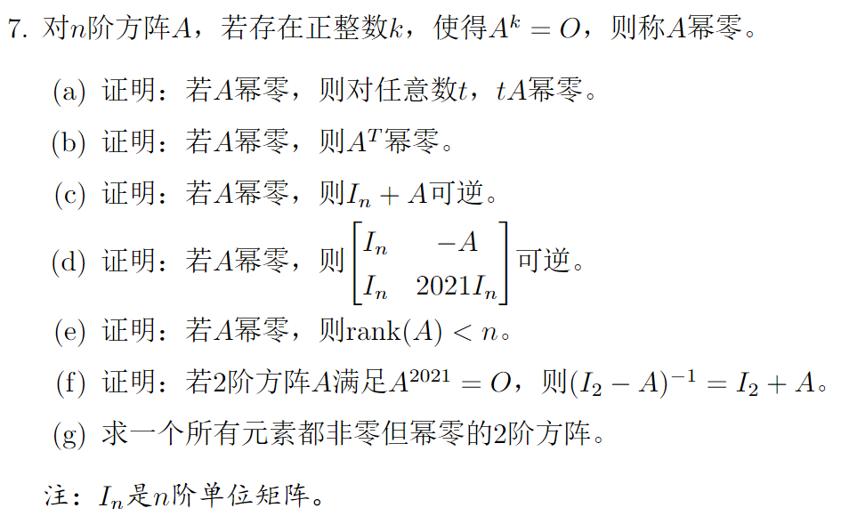
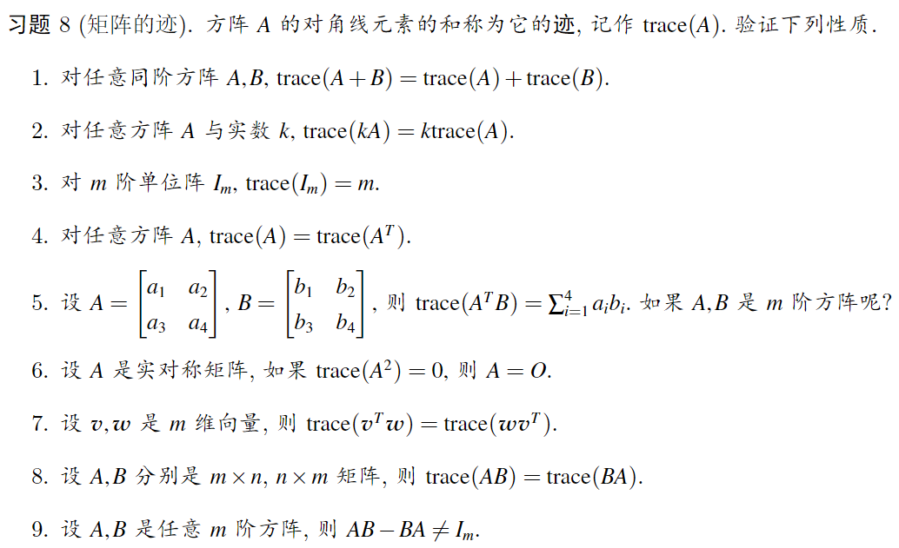

# 3	难题选讲

### 3.1	矩阵可逆相关

**如何证明可逆：**

1. 证明齐次线性方程组只有平凡解
2. 找到逆乘出来$I_n$
3. ~~行列式（还没学）~~
4. 二级结论：
   1. *Schur*补
   2. 对角占优

**题1**	已知$I_m - BA$可逆，求证$I_n-AB$可逆（$A,B$尺寸保证两式均有意义）

**提示1**	泰勒展开$\frac{1}{1-x} = 1+x + x^2 +\cdots$

**提示2**	*Schur*补

**提示3**	线性方程组$(I_m-BA)x=0$有什么性质？

**题2（2020期中）**	令

$$
X_\varepsilon = \begin{bmatrix}
A & \varepsilon B_1\\
B_2	& C
\end{bmatrix},\varepsilon\in\mathbb{R},A=\begin{bmatrix}
1 & 2 & 3\\
2 &1 & 3\\
0 & 1 & 4\\
\end{bmatrix}.
$$

期中$C$为$n$阶对角占优方阵，$B_1$为任意给定$3\times n$矩阵，$B_2$ 为任意给定$n\times 3$ 矩阵.

1. 求$A$的$LU$分解（$5'$）
2. 求证$A$可逆，再找一个常数$\varepsilon_0>0$(依赖于$C,B_1,B_2$), 使得对$\forall |\varepsilon|\le \epsilon_0$，$X_\varepsilon$可逆。（$\textcolor{red}{5'}$)

**题3（2022期中）**	考察方阵$A$ ,试证：若$|\mathbf x^TA\mathbf x|<|\mathbf x^T\mathbf x|$ 有解，则$I-A^2$可逆。

**题4（2019期中）**	设$A，B\in M_n(\mathbb{R})$, 且$A^k=0$, 其中$k$是一个正整数。求证：

1. $I_n - A$可逆。
2. 若$AB+BA = B$, 则$B=O$.

**题5（习题课2，节选）**	**对称阵和反对称阵。**求证下列命题。

1. 若$A,B$是$n$阶实对称矩阵，则$A=B\Leftrightarrow \forall x\in\mathbb{R}^n,x^TAx=x^TBx$
2. $\forall A$为$n$阶反对称阵，求证$I_n-A$可逆

**题6（2022期中，书院）**	若$A,B,A+B$都是可逆矩阵，证明$A^{-1}+B^{-1}$可逆。	

### 3.2	矩阵方程

考虑通过左右乘一些矩阵把方程变得美观。

**题1（2022期中，<u>附加题</u>）**设$A,B,C$分别为$l\times m,n\times p,l\times p$ 矩阵。求证：

 1. 关于$p\times n$的矩阵$W$的方程$BWB=B$总有解。

 2. 利用1中结论，证明关于$m\times n$矩阵$X$的方程$AXB=C$有解，当且仅当

  $$
    rank(A)=rank([A\quad C])且rank(B)=rank(\begin{bmatrix}
    B\\mathbb{C}
    \end{bmatrix}
    ).
  $$

### 3.3	基和线性空间

**证明线性无关性**：“起手式”

> 不妨假设
>$$

> k_1\mathbf x_1+k_2\mathbf x_2+\cdots+k_m\mathbf x_m =0
>$$

> 则....

**题1（2023期中，节选）**	设$\mathbf a_1,\mathbf a_2,\mathbf a_3,\mathbf a_4$是$m\times n$矩阵$A$的零空间一组基。又设$\mathbb{R}^n$一组基为$\mathbf a_1,\mathbf a_2,\mathbf a_3,\mathbf a_4, \mathbf c_1,\mathbf c_2,\mathbf c_3,\cdots,\mathbf c_{n-4}$。求证：

$$
A\mathbf c_1,A\mathbf c_2,A\mathbf c_3,\cdots,A\mathbf c_{n-4}	
$$

线性无关。

**题2（2023期中）**	设 $\mathbf {a_1,a_2,a_3},\cdots,\mathbf a_n$为$\mathbb{R}^n$的一组坤。试证：若向量$\mathbf b$可以写成$\mathbf {a_1,a_2,\cdots,a_n}$中任意$n-1$个向量的线性组合，则$\mathbf b=0$.

**题3（2022期中，书院）**	设$A\in M_n$,若$\exists k\in \N$,使得$A^{k}\mathbf x=0$有解向量$\alpha$,且$A^{k-1}\alpha\ne 0$,求证：向量组$\alpha,A\alpha,\cdots A^{k-1}\alpha$线性无关。

###	3.4	综合题

**题1（2021期中）**

{: style="display: block; margin: auto; width: 60%;" }

**题2（习题课）**

{: style="display: block; margin: auto; width: 60%;" }
