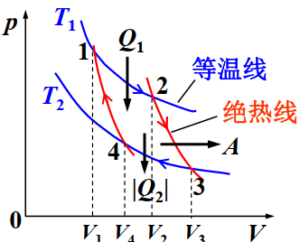

# 热力学第一定律

**关键词**	过程：体积功，热容；循环：效率

### 热一律

$$
\textcolor{blue}{Q}=\textcolor{purple}{\Delta E}+\textcolor{red}A\\
\textcolor{blue}{吸热}=\textcolor{purple}{内能增量}+\textcolor{red}{对外做功}\\
$$

**准静态过程**：进展无限缓慢（远大于*弛豫时间* ）的过程，认为时刻处于平衡状态

**体积功**

$$
dA=pdV
$$

**内能**

$$
E = \frac{i}{2}\nu RT
$$

**内能是状态量**，从而可以选择*等体+等温*过程方便地计算元过程的dE

$$
\begin{aligned}
dE&=dE_V+dE_T\\
&=dE_V\\
&=\nu C_{v,m}dT
\end{aligned}
$$

### 热容

**摩尔热容**

$$
C_m=\frac{dQ}{\nu dT}
$$

**摩尔定体热容**

$$
C_{V,m}=\frac{i}{2}R=\left.\frac{dQ}{dT}\right|_{V=V_0}
$$

**摩尔定压热容**(麦耶公式)

$$
C_{p,m}=\frac{i}{2}R+R=\left.\frac{dQ}{dT}\right|_{p=p_0}
$$

**热容比**

$$
\gamma := \frac{C_{p,m}}{C_{V,m}}=\frac{i+2}{i}
$$

**绝热过程**：热容正无穷

状态方程：(泊松公式)

$$
pV^\gamma=const.
$$

**多方过程**

$$
pV^n=const.
$$

n称为*多方指数*

### 循环

若循环的各个阶段为准静态过程，则循环过程可用*状态图* ，如p-V图上闭合曲线表示。循环过程中，系统和**一系列热源**交换热量，一周下来系统复原，内能不变。

**符号约定**

$$
\begin{aligned}
Q_1\quad &:吸收的热量\\
|Q_2|\quad &: 放出的热量\\
系统对外界作净功A&=Q_1-|Q_2|>0\\
&\textcolor{red}{=循环曲线面积}
\end{aligned}
$$

从而可以定义热机效率

$$
\eta = \frac {A}{Q_1} = 1-\frac{|Q_2|}{Q_1}
$$

**卡诺循环**：等温+绝热
{: style="display: block; margin: auto; width: 60%;" }

$$
\eta_c = 1-\frac{T_2}{T_1}
$$

**制冷循环**：反向循环

制冷系数$\omega = \frac{Q_2}{|A|}$,卡诺制冷机$\omega_c=\frac{T_2}{T_1-T_2}$
