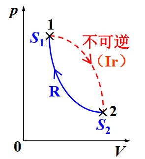
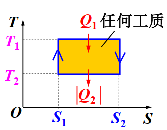
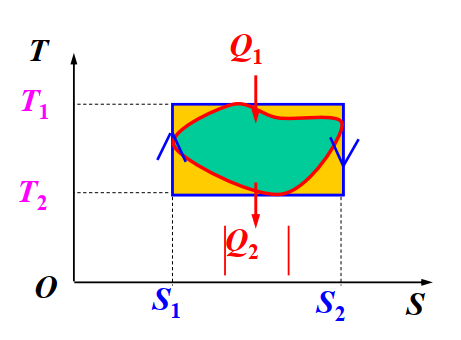

# 热力学第二定律

**关键词**  熵，可逆不可逆，卡诺定律，温熵图。
### 热力学第二定律的等价表述
- **开尔文表述**  *唯一*效果是热量全部转变为功的过程不可能。（*否定第二类永动机的存在* ）
- **克劳修斯表述**  热量不会自动从低温物体传向高温物体。（*制冷系数不可能无穷大* ）

### 卡诺定理
1. 温度相同的高温热源和温度相同的低温热源之间工作的一切热机，**可逆热机效率最大**。（$\eta_{可逆}>\eta_{不可逆}$）
1. 温度相同的高温热源和温度相同的低温热源之间工作的一切可逆热机，其效率都相等，与工作物质无关。(其循环必为卡诺循环，效率为卡诺热机效率$\eta_{可逆}=\eta_c=1-\frac{T_2}{T_1}$)

>**卡诺定理同样适用于制冷机**

**用卡诺循环定义热力学温标**

1. 规定水的三相点$T_3=273.16K$
1. 卡诺热机吸放热$\frac{|Q_2|}{Q_1}=\frac{T_2}{T_1}$

**任意可逆循环的效率**

可以拆成多个小卡诺循环，推导出

$$
\eta\leq 1-\frac {T_2}{T_1}
$$

### 克劳修斯熵公式
对可逆循环过程

$$
\oint_R \frac{dQ}{T}=0
$$

其中$\frac{dQ}{T}$称为热温比。

**熵$S$**

$$
\begin{aligned}
S:&=\int_R\frac{dQ}T\\
dS&=\frac{dQ}{T}\quad(可逆元过程)
\end{aligned}
$$

结合热力学第一定律，有

$$
TdS=dE+dA
$$

只考虑体积功：

$$
TdS=dE+pdV
$$

**理想气体熵公式**

$$
S(T,V)=\nu C_{V,m}\ln\frac{T}{T_0}+\nu R\ln\frac{V}{V_0}+S_0
$$

>由于熵是状态量，因此可以给定系统始末平衡态，**任意选取可逆过程**计算。

### 熵增加原理
**克劳修斯不等式**
对于一般循环：

$$
\oint\frac{dQ}{T}\leq 0
$$

其中可逆时取等号。

**熵增加原理**

若有循环

{: style="display: block; margin: auto; width: 60%;" }

则对该循环

$$
\oint\frac{dQ}{T}<0
$$

从而

$$
\int_{1,IR}^2\frac{dQ}{T}+\int_{2,R}^1\frac{dQ}{T}<0
$$

其中

$$
\int_{2,R}^1\frac{dQ}{T}=S_1-S_2
$$

因此

$$
\Delta S=S_2-S_1=\int_{1,R}^2\frac{dQ}{T}>\int_{IR,1}^{2}\frac{dQ}{T}
$$

而由于绝热过程，有$dQ=0$，从而

$$
\Delta S_{绝热}\geq 0
$$

其中可逆过程取“=”。
热力学系统经绝热过程熵不减少，可逆绝热过程熵不变，不可逆绝热过程熵增加。

由于孤立系统进行过程必然绝热，因此

$$
\Delta S_{孤立系统}\geq 0
$$

>孤立系统内一切过程熵都不会减少；**熵增加原理是热力学第二定律的数学表示**。
### 热力学第二定律的统计意义
**热力学概率**  任意宏观态对应的微观态数称为该宏观态的热力学概率，记作$\Omega$
- 平衡态$\Omega_{bal}=\Omega_{max}$
- 非平衡态$\Omega_{ibal}<\Omega_{bal}$

>一个孤立系统内部自发进行的过程，总是由热力学概率小的宏观态向热力学概率大的宏观态过渡

**玻尔兹曼熵公式**

$$
S=k\ln\Omega
$$

回忆：理想气体有

$$
\begin{aligned}
S(T,V)&=\textcolor{red}{\nu C_{V,m}\ln\frac{T}{T_0}}+\textcolor{blue}{\nu R\ln\frac{V}{V_0}}+\textcolor{purple}{S_0}\\
&=\textcolor{red}{速度熵}+\textcolor{blue}{位形熵}+\textcolor{purple}{S_0}
\end{aligned}
$$

无序性增加$\rightarrow$熵增加。
### 温熵图
用温熵图（T-S）反应过程中状态的关系，则由于

$$
Q=\int TdS
$$

因此循环中吸热为温商曲线*所围面积*。

{: style="display: block; margin: auto; width: 60%;" }

{: style="display: block; margin: auto; width: 60%;" }
