# 晶体结构

晶体内的原子(或分子)排列是严格有序的，最基本的特征是周期结构。

研究晶体时的假设：固体表面、原子振动和缺陷对于固体性质影响很小，可以忽略

### 晶格的几何描述

* 格点：基元
* 格点排布的几何图形：晶格/点阵
* 周期性重复单元：晶胞
* 可{==完全平移==}覆盖点阵的最小单元:原胞

原胞中只包含一个格点！！

### 重要晶体结构

**简单立方**

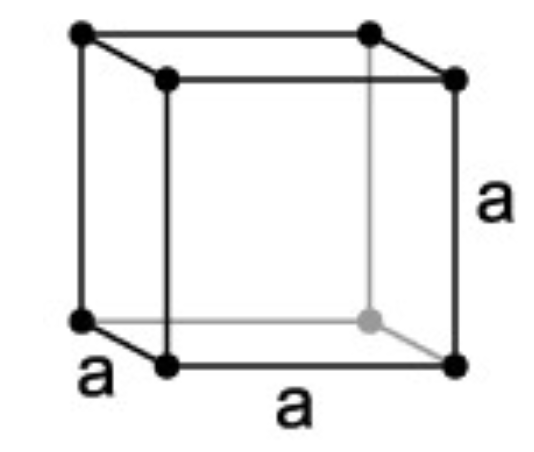

**体心立方**

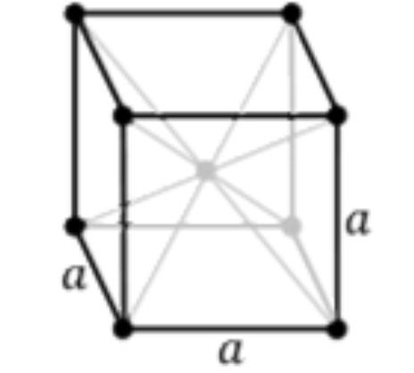

**面心立方**

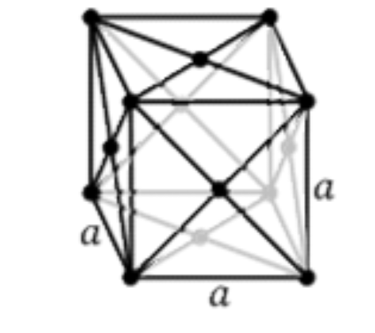

**六角密排**

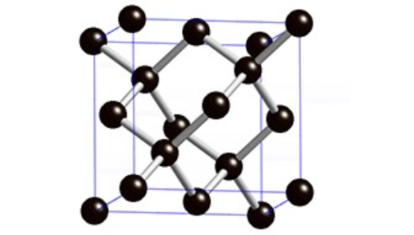

**简单晶格**：所有院子完全等价，{==每个格点代表一个原子==}

**复式晶格**：原子之间不等价，每个格点对应多个原子，每一种等价原子形成一个简单晶格，不同等价原子形成的简单晶格是相同的。

!!! note
    同一种原子构成的晶体，也可以是复式晶体(如金刚石)

### 惯用晶胞

**单胞**是点阵中产生完全评议覆盖并能提现旋转对称性的常用单元。原胞的选取是不唯一的，只要是最小周期性单元都可以，但实际上各种晶体结构已有习惯的原胞选取方式。

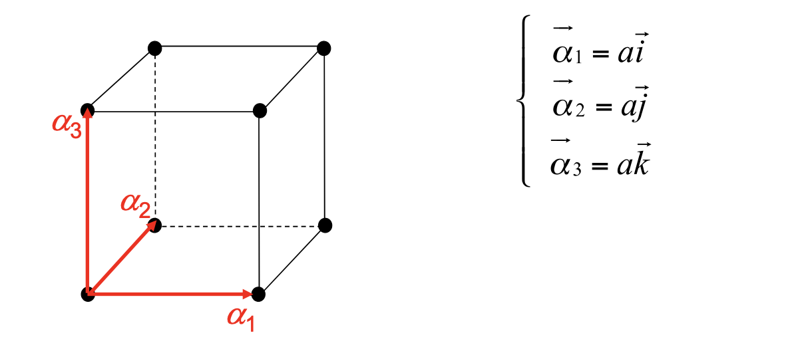

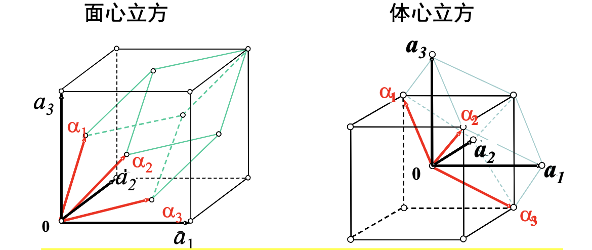

体心立方的原胞和基矢：

$$
\begin{cases}
\vec{\alpha}_1&=\dfrac{a}{2}\left(-\vec i+\vec j+\vec k\right)\\
\vec{\alpha}_2&=\dfrac{a}{2}\left(\vec i-\vec j+\vec k\right)\\
\vec{\alpha}_3&=\dfrac{a}{2}\left(\vec i+\vec j-\vec k\right)\\
\end{cases}
$$

面心立方的原胞和基矢

$$
\begin{cases}
\vec{\alpha}_1&=\dfrac{a}{2}\left(\vec j+\vec k\right)\\
\vec{\alpha}_2&=\dfrac{a}{2}\left(\vec i+\vec k\right)\\
\vec{\alpha}_3&=\dfrac{a}{2}\left(\vec i+\vec j\right)\\
\end{cases}
$$

### 晶向

微观上晶格中基元（原子或原子团）分列在一系列直线系上，这些直线都相互平行1组平行直线称为1个晶列。

晶列的方向称为晶向，不同的晶列有不同的晶向。

从一个格点沿晶向到{==最近邻格点==}的位移矢量

$$
l_1\vec{a}_1+l_2\vec{a}_2+l_3\vec{a}_3
$$

则晶向用$[l_1\,l_2\,l_3]$表示，注意用的方括号。对于负数，使用指数上加横杠的方式，如$[\bar{1}\,0\,0]$

### 等效晶向

由于对称的晶向在性质上没有区别，因此用同一个符号表示对称的几个，称为等效晶向。例如立方晶格中

* 立方边，统称$\left<1\,0\,0\right>$
* 对角线，统称$\left<1\,1\,1\right>$
* 面对角线，统称$\left<1\,1\,0\right>$

### 晶面

格子可以看作分列在平行等距的平面系上，这些平行的平面系称为晶面系（族）。

晶面的特点：

1. 晶面族一经划定，所有的格点全部包含在晶面族中无遗漏。
2. 一族晶面平行且两两等距，这是晶格周期性的必然结果。
3. 同一个格子可以有无穷多方向不同的晶面系

#### 晶面的Miller指数

以惯用晶胞为参照系分析一组晶面。所有格点都在晶面系上，所以必有一晶面通过原点，其它晶面既然相互等距，将均匀切割各坐标轴。

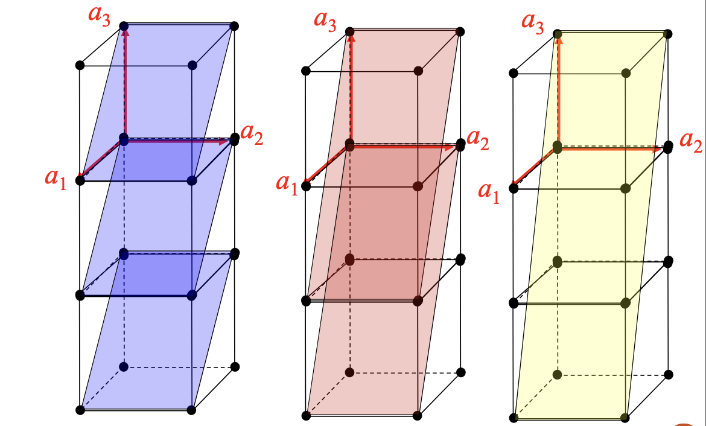

惯用晶胞的基矢$a_1\,,a_2\,,a_3$必定是晶面在该方向上截距的整数倍。第一个离开原点的晶面与单胞基矢轴的截距，必定是单胞基矢长的$1/h$ ($h$为整数)

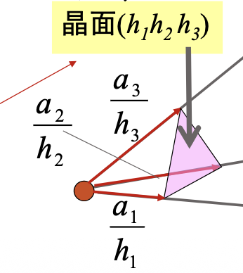

$(h_1\,h_2\,h_3)$称为Miller 指数。上图中分别为

$$
\color{blue}{(1\,0\,1)}\quad\color{red}{(2\,0\,1)}\quad\color{yellow}{(3\,0\,1)}
$$

在晶体内凡晶面间距和晶面上原子的分布完全相同，只是空间位向不同的晶面可以归并为同一晶面族，以$\{h\,k\,l\}$表示，它代表由对称性相联系的若干组等效晶面的总和.

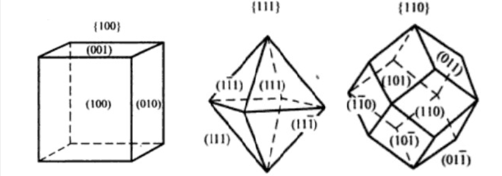

!!! warning
    晶向用方括号,等效晶向用尖括号,晶面用圆括号,晶面族用大括号。

### 布拉菲点阵中格点的讨论

**格点不一定只对应一个原子**。没有实际晶体的原子排布具有简单立方晶格的结构。

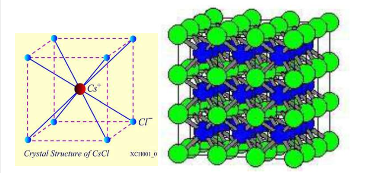

CsCl晶体对应的布拉菲格子是**简单立方**而不是体心立方

#### 四面体结构

* **金刚石晶格**：中心原子在密堆4个原子构成的4面体（球）的中心上。
* **闪锌矿晶格**：B原子在密堆4个原子构成的4面体（球）的中心上。

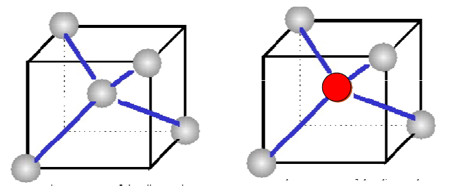

### 密堆描述

把原子看成是刚性的小球（**原子球**），原子球的规则堆积构成了晶体堆积

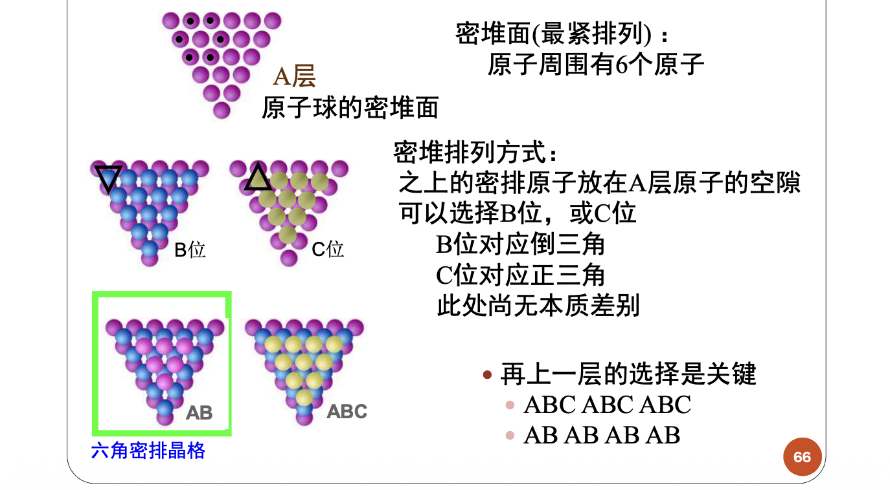

**堆积比（致密度）**：原子体积占总体积的百分数。

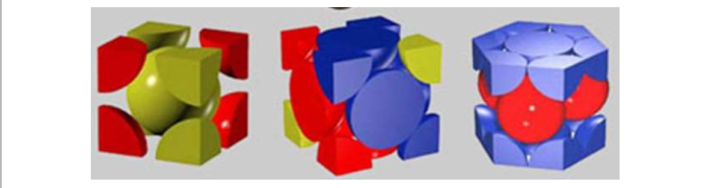

若以一个惯用晶胞来计算，就是晶胞中原子体积与晶胞体积之比，即 

$$
k=\frac{nv}{V}\,,v=\frac{4\pi r^3}{3}\text{为单个原子体积}
$$

### 对称素与点群

晶体的宏观对称性来源于点阵的对称性。布拉菲点阵按对三维点阵对称性进行分类，包括**七个晶系，十四种点阵**。点阵对称性是由一系列晶格对称变换来体现。

**对称变换**是某一正交变换(距离不变的变换)后整个点阵保持不变。对称变换可以由一个或多个基本对称变换组合而成。**对称素**即对称操作，由对称素组成的对称操作群称为**点群**。点阵的基本对称变换只有3种：**平移、旋转、镜反射**。

晶格的根本特性造成有限的平移对称性；同时旋转对称性也是有限的。

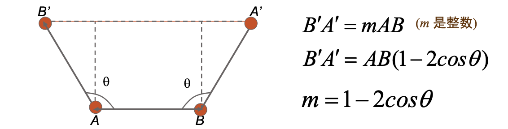

从而

$$
\theta=\frac{2\pi}{n}\in\{0^\circ\,,60^\circ\,,90^\circ\,,120^\circ\,,180^\circ\}
$$

其中$n=1\,,2\,,3\,,4\,,6$对应$C_1\,,C_2\,,C_3\,,C_4\,,C_6$对称素。由于对称素有限，且组合时受到的严格限制，**只能组成32个不相同的点群**。

| 晶系 | 对称性特征 | 晶胞参数 | 所属点群 | Bravais格子 |
|-----|-------------|-----------|-----------|--------------|
| 三斜 | 只有 $C_1$ 或 $C_i$ | $a\ne b\ne c$    $\alpha\ne\beta\ne\gamma$ | $C_1$, $C_i$ | 简单三斜 |
| 单斜 | 唯一 $C_2$ 或 $C_s$ | $a\ne b\ne c$   $\alpha=\gamma=90^\circ\ne\beta$ | $C_2$, $C_s$, $C_{2h}$ | 简单 / 底心 三斜 |
| 正交 | 三个 $C_2$ 或 $C_s$ | $a\ne b\ne c$   $\alpha=\beta=\gamma=90^\circ$ | $D_2$, $C_{2v}$, $D_{2h}$ | 简单 / 底心 / 体心 / 面心 正交 |
| 三方 | 唯一 $C_3$ 或 $S_6$ | $a=b=c$   $\alpha=\beta=\gamma\ne90^\circ$ | $C_3$, $S_6$, $D_3$, $C_{3v}$, $D_{3d}$ | 三角 |
| 四方 | 唯一 $C_4$ 或 $S_4$ | $a=b\ne c$   $\alpha=\beta=\gamma=90^\circ$ | $C_4$, $S_4$, $C_{4h}$, $D_4$, $C_{4v}$, $D_{2d}$, $D_{4h}$ | 简单 / 体心 四方 |
| 六方 | 唯一 $C_6$ 或 $S_3$ | $a=b\ne c$   $\alpha=\beta=90^\circ,\ \gamma=120^\circ$ | $C_6$, $C_{3h}$, $C_{6h}$, $D_6$, $C_{6v}$, $D_{3h}$, $D_{6h}$ | 六角 |
| 立方 | 四个 $C_3$ | $a=b=c$   $\alpha=\beta=\gamma=90^\circ$ | $T$, $T_h$, $T_d$, $O$, $O_h$ | 简单 / 体心 / 面心 立方 |
