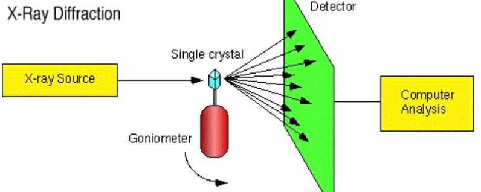
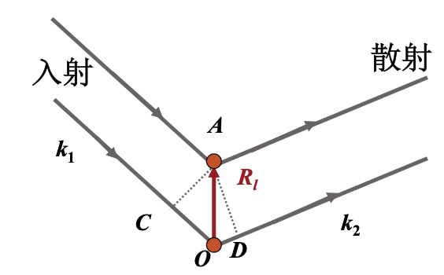

# 倒易点阵和布里渊区

### 晶体结构的观测手段：晶格衍射

固体中原子的周期性排列，必然使波的传播与点阵的对称性有关。

### 衍射过程的基本模型

忽略具体的散射无力机制，只讨论不同格点处散射波之间的干涉。

以O为原点，A为晶格中任一格点，其位矢为：

$$
\vec{R_l}=l_1\vec{\alpha}_1+l_2\vec{\alpha}_2+l_3\vec{\alpha}_3
$$

其中$\alpha_i$为**晶格基矢**。入射光与散射光的波矢分别为

$$
\vec k_1 = \frac{2\pi}{\lambda}\hat k_1\,,\quad\vec k_2 = \frac{2\pi}{\lambda}\hat k_2
$$

两相邻格点（A和O）的散射光程差为CO+OD，则**衍射极大条件**：

$$
\vec{R_l}\cdot(\hat k_2-\hat k_1)=n\lambda\Rightarrow\boxed{\vec{R_l}\cdot(\vec k_2-\vec k_1)=2n\pi}
$$

$n$为衍射级数，此方程为**劳厄衍射方程**。

对于晶体的空间周期结构，利用周期性

$$
F(\vec r+\vec R_n)=F(\vec r)\,,\vec{R}_n=n_1\vec{\alpha}_1+n_2\vec{\alpha}_2+n_3\vec{\alpha}_3
$$

作Fourier变换得到

$$
F(\vec{r})=\sum_k A(\vec k)\exp(\mathrm{i}\vec{k}\cdot\vec{r})
$$

其中系数

$$
A(\vec k)=\frac{1}{\Omega}\int_\Omega F(\vec r)\exp(-\mathrm i\vec k\cdot \vec r)\mathrm dr
$$

因此

$$
\begin{aligned}
A(\vec k)&=\frac{1}{\Omega}\int_\Omega F(\vec r+\vec R_n)\exp(-\mathrm i\vec k\cdot \vec r)\mathrm dr\\
&\underbrace{=}_{\vec r'=\vec r+\vec R_n}\frac{1}{\Omega}\int_\Omega F(\vec r')\exp(-\mathrm i\vec k\cdot \vec r')\mathrm dr'\exp(\mathrm i\vec k\cdot \vec R_n)\\
&=A(\vec k)\exp(\mathrm i\vec k\cdot \vec R_n)\Rightarrow \boxed{\exp(\mathrm i\vec k\cdot \vec R_n)=1}
\end{aligned}
$$

令满足上述的$\vec k$记为$\vec G_h$，全部$\vec G_h$的集合构成该布拉菲格子的**倒格子**。$\vec G_h$满足

$$
\boxed{\vec{G}_h\cdot \vec{R}_n=2\pi m\,,m\in\mathbb{Z}}
$$

**倒格子是波矢$k$空间（倒易空间）的格子。**正格子中的一族晶面$(h_1\,h_2\,h_3)$垂直与倒格矢

$$
\vec G_h = h_1\vec b_1+h_2\vec b_2+h_3\vec b_3
$$

如果正格子晶面系的面间距为$d$，则$G_h$的长度为$\dfrac{2\pi}d$.在倒格子空间，劳厄衍射方程转化为

$$
\vec{R_l}\cdot(\vec{k}_2-\vec{k}_1)=2n\pi\Rightarrow\boxed{\vec{k}_2-\vec{k}_1=n\vec{G}_h}
$$

晶格的周期性在此体现为

$$
\vec k_2 = \vec k_1 + n\vec G_h
$$

在弹性散射中，认为能量守恒

$$
\left|\vec k_2\right|=\left|\vec k_1\right|
$$

利用几何关系得到

$$
k_1\sin\theta =\frac{n}{2} G_h
$$
