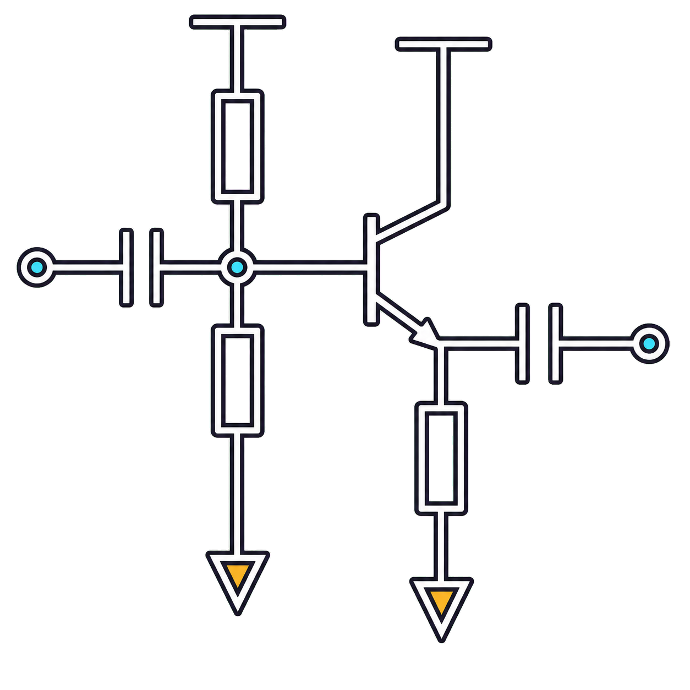
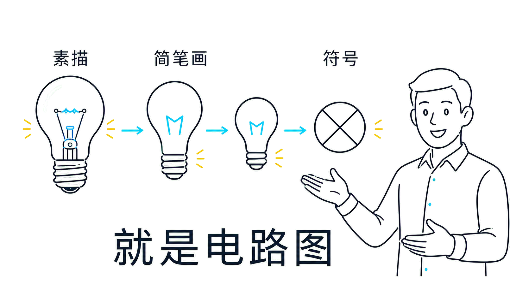
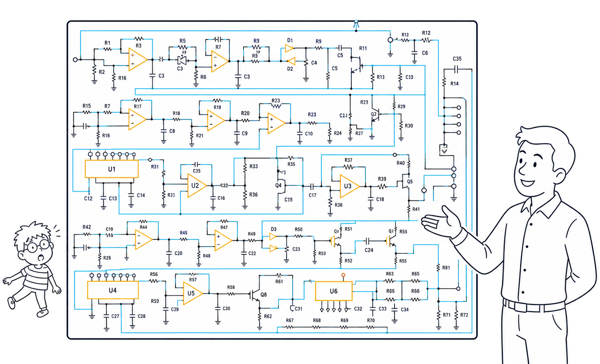

# 课程说明

!!! info  "说明"
    先开个坑（）放张最喜欢的单管放大器镇楼。后面应该会同步写一下CAD教程
    
    （很大程度上）参考了\ycgg/的小班辅导讲义，感谢！这篇文章大概会按照元件器件和方法工具两条主线完成，感觉电电确实就是这么个逻辑

!!! tips "建议"
    目前感觉这个课最有效的方法是背背背+直觉，在大脑里建立又大又快的L1-cache。我当时学（2）的时候把所有的PPT都抄了2遍，差不多背下来了，能80%默写正课内容的程度，感觉对于应试还是非常有效的。考试的时候就直接顺着写了，甚至富裕30分钟。当然还是要提倡先做大题（）

