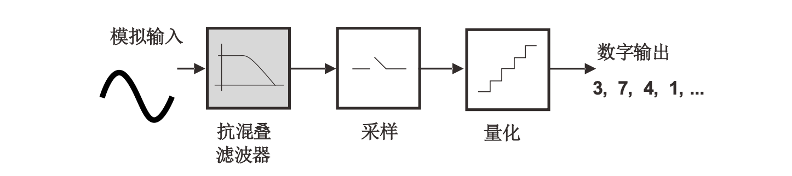
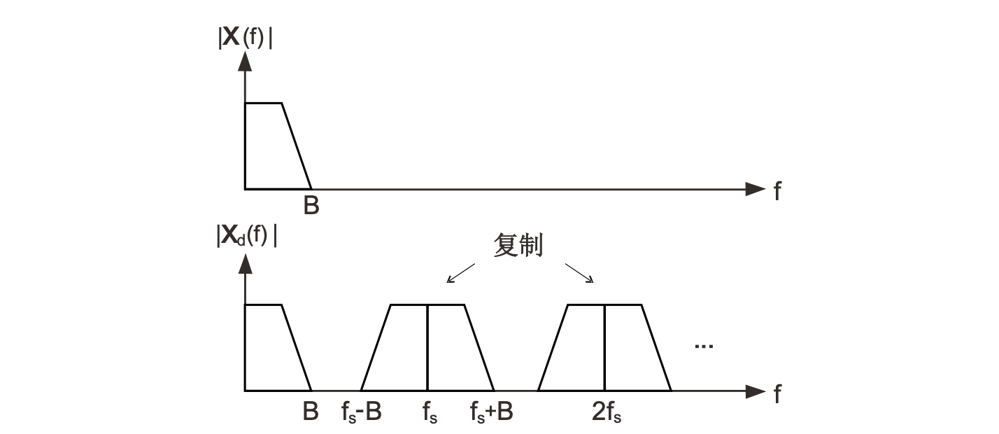
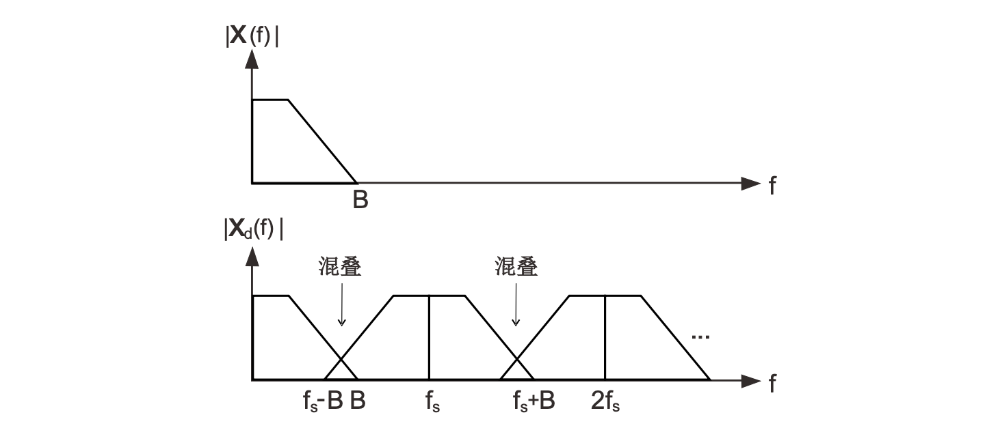
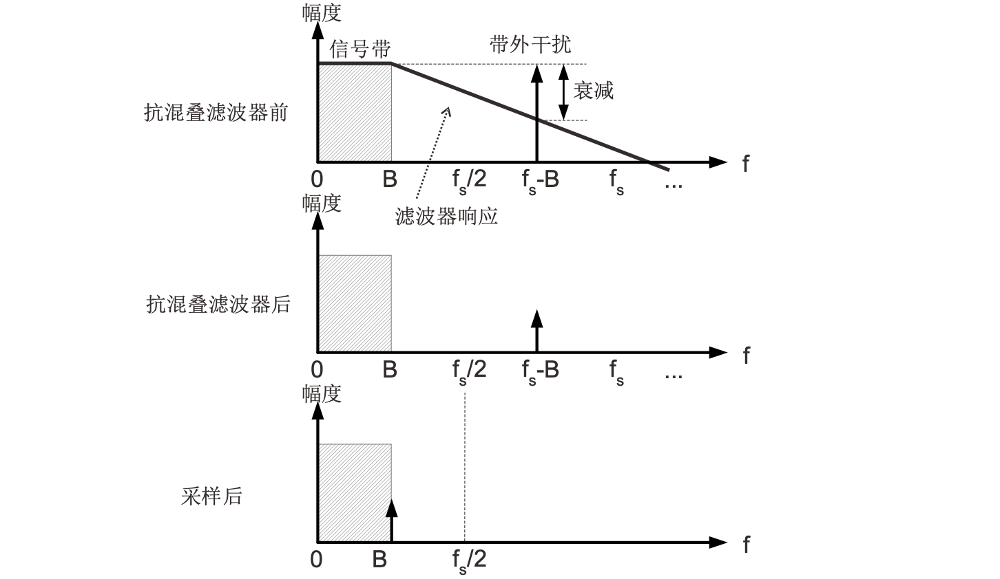
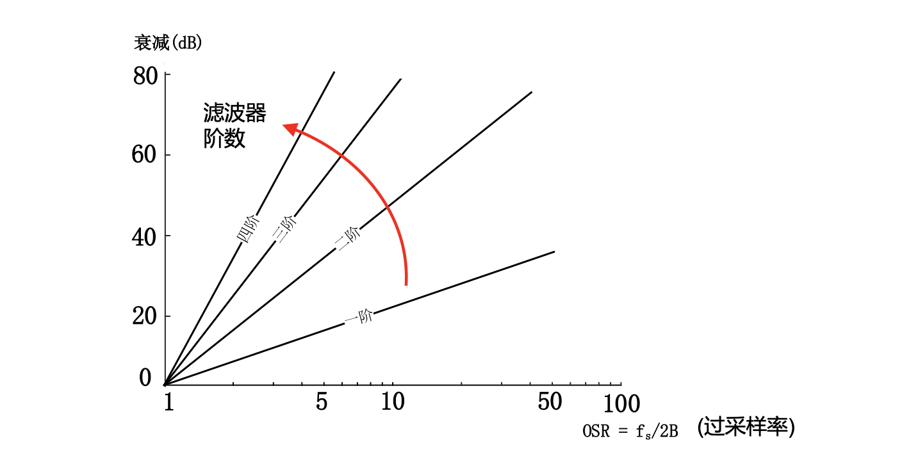
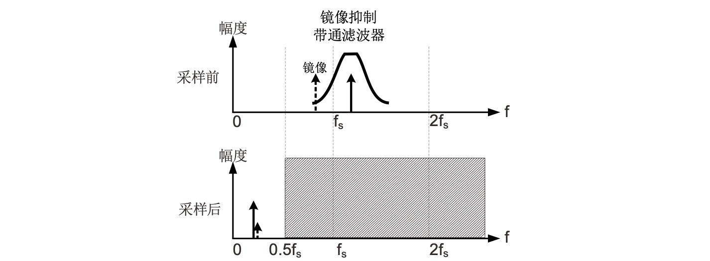
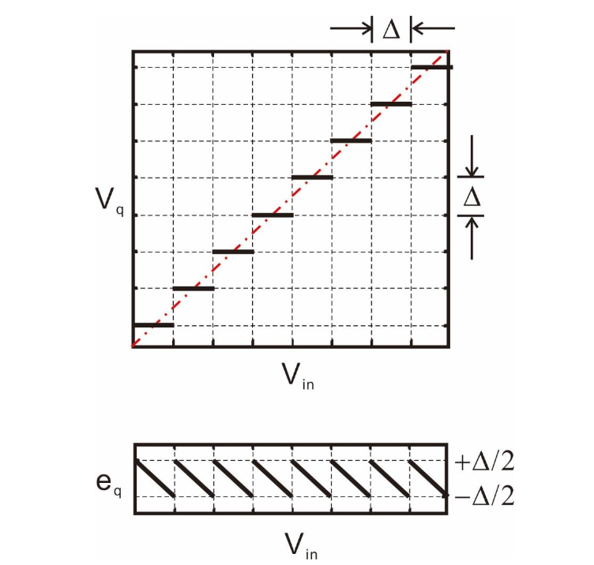
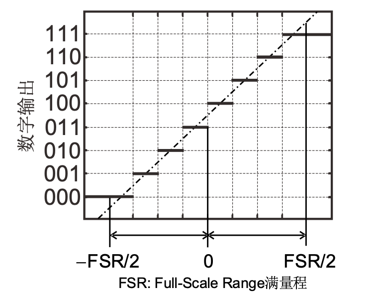

# 数据转换基本概念

### ADC与采样

模数转换：{==采样,量化,输出==}

理论上可以交换顺序，但实际上不这么干。

理想采样：

$$
x_d(t)=\sum_{n=-\infty}^{\infty} x(nT)\delta(t-nT_s)
$$

频域上等价于乘法，把$X(f)$复制搬移到$Nf_s$处

$$
X_d(f) = X(f) * \frac{1}{T_s}\sum_{n=-\infty}^{\infty} \delta(f-\frac{n}{T_s})
$$

当$f_s>2B$不会混叠，$f_s<2B$会混叠。采样率$2B$被称为Nyquist rate。如果存在带外干扰和噪声，则可以通过**增大**$f_s$让$[0,f_s/2]$覆盖大部分干扰和噪声，然后用滤波器限制B。

利用模拟滤波器可以抑制不想要的信号，即抗混叠滤波器。

增大带外衰减的方法：

1. 增大$f_s/B$(过采样率)
2. 增大滤波器阶数

!!! warning "注意"
    $f_s/B=2$的时候无法抗混叠滤波，即使提高滤波器阶数也没用！

采样的分类：

1. Nyquist采样：$f_s>2B$,作数据转换器，实际上会{==轻微过采样==}
1. 过采样：$f_s\gg 2B$。抗混叠滤波容易实现；同时可以降低量化噪声
1. 欠采样：$f_s<2B$，用于利用频谱混叠完成高频信号的下变频

利用欠采样进行高频信号下变频的原理如下：

需要使用高Q值带通滤波器防止噪声混叠

### 模拟信号的量化

* $V_q$: 量化电压
* $e_q$: 量化误差
* $e_q=V_q-V_{in}$

理想情况下具有无限大的输入范围和无限数量的量化电平，但实际中输入范围和量化电平都是有限的。超出转化码字边界时，量化误差会超出允许范围。当施加的输入信号超过FSR时，就会发生过载（overloading）。

**相关术语**

* LSB大小：与码字宽度$\Delta$等价
* 切换位置（Transition Level）：$T[k]$是码字$k-1$和$k$之间的边界位置
* 码宽（Code Width）：$W[k]=T[k+1]-T[k]$
