# 晶体管的长沟道模型

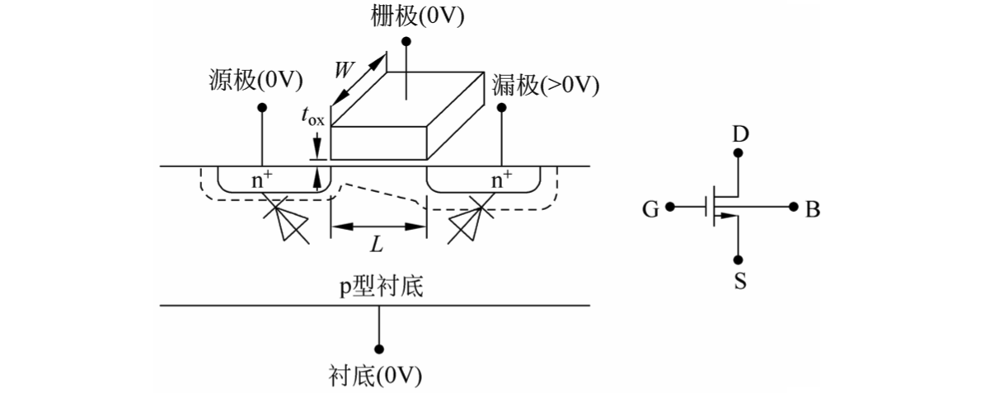

1. 栅极电压为零时，器件处于"关断"状态
2. $V_{GS}>0$时，电子被拉到作为**正极**的栅极；$V_{GS}>V_{t}$时形成导电的{==反型层==}
3. 此时若$V_{DS}>0$,漏极与源极之间将有电流产生。

### 一阶电流-电压特性

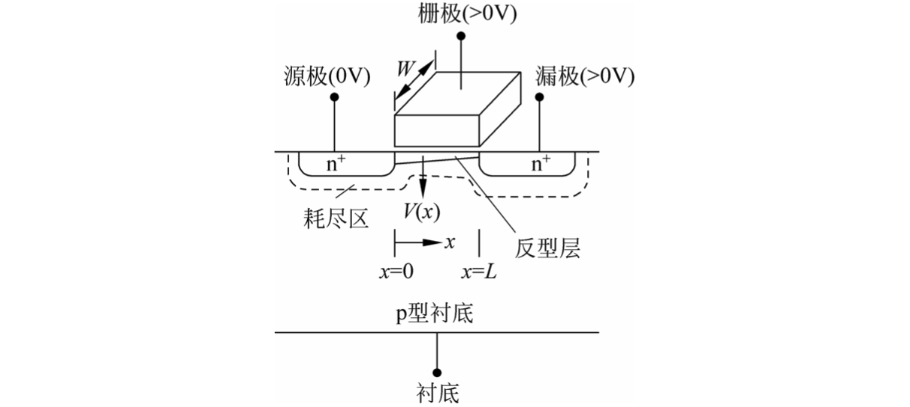

假定$Q_n(x)=C_{ox}[V_{GS}-V(x)-V_t]$, $I_D=Q_n\cdot v\cdot W$, $v=\mu E$。则

$$
I_D=C_{ox}\left[V_{GS}-V(x)-V_t\right]\cdot \mu \cdot \frac{\mathrm dV}{\mathrm dx}\cdot W
$$

利用$E=\mathrm dV/\mathrm dx$，得到

$$
\boxed{I_D=\mu C_{ox}\frac{W}{L}\left[(V_{GS}-V_t)-\frac{V_{DS}}{2}\right]\cdot V_{DS}}
$$

观察到$V_{DS}>V_{GS}-V_t$时图线异常下降，这是因为$V_{GD}=V_{GS}-V_{DS}<V_t$，时**沟道夹断**不能用这个模型。此时沟道电流**与$V_{DS}$无关**，称为饱和区。

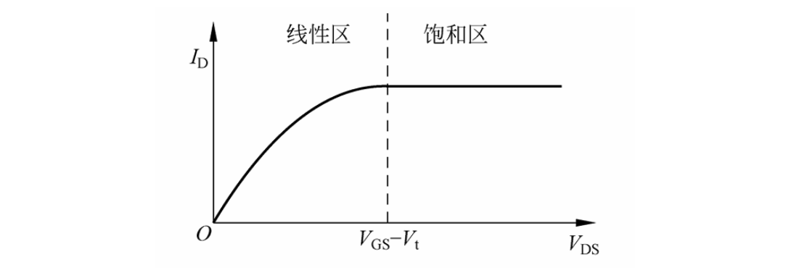

修正后的电流方程：

$$
\begin{aligned}
\text{线性区}\quad I_D&=\mu C_{ox}\frac{W}{L}\left[(V_{GS}-V_t)-\frac{V_{DS}}{2}\right]\cdot V_{DS}\\
\text{饱和区}\quad I_D&=\frac{1}{2}\mu C_{ox}\frac{W}{L}(V_{GS}-V_t)^2
\end{aligned}
$$

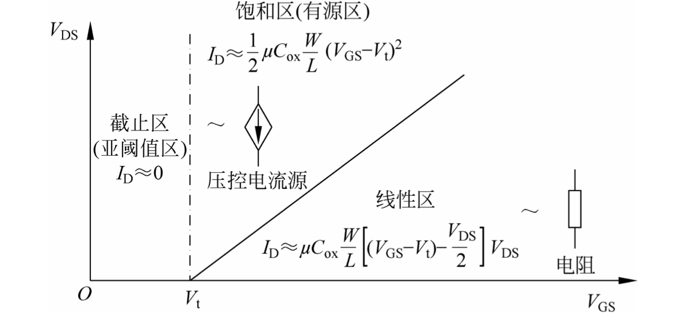

### 电容模型

| 电容 | 截止区 | 线性区 | 饱和区 |
|-----|-----|-----|-----|
| $C_{gs}$ | $0$ | $\dfrac{1}{2}WL C_{ox}$ | $\dfrac{2}{3}WL C_{ox}$ |
| $C_{gd}$ | $0$ | $\dfrac{1}{2}WL C_{ox}$ | $0$ |
| $C_{gb}$ | $\left(\dfrac{1}{C_{cb}}+\dfrac{1}{C_{gc}}\right)^{-1}$ | $0$ | $0$ |
| $C_{sb}$ | $C_{jsb}$ | $C_{jsb}+\frac{1}{2}C_{cb}$ | $C_{jsb}+\frac{2}{3}C_{cb}$ |
| $C_{db}$ | $C_{jdb}$ | $C_{jsb}+\frac{1}{2}C_{cb}$ | $C_{jdb}$ |

$$
C_{cb}=\frac{\varepsilon_{si}}{x_d}\cdot W\cdot L
$$

#### 线性区本征电容模型

栅极和导电沟道以栅氧化层为中间介质构成平行板电容器。电容值为$C_{gc}=C_{ox}\cdot W\cdot L$、$C_{gs}=C_{gd}=C_{gc}/2$。势垒电容$C_{cb}$ **增加了漏、源到衬底的电容**，但通常可以忽略不计。

#### 饱和区本征电容模型

$V_{GD}$ 对沟道电荷的控制能力较弱，而 $V_{GS}$ 对沟道电荷的控制能力较强。$C_{gs}=2/3WLC_{ox}$，$C_{gd}\approx 0$。

栅极看入是一接到衬底的电容，相当于栅氧电容和势垒电容的串联；如果栅极电压为负，耗尽区会缩小，栅极——衬底电容会增长。

#### 非本征电容模型

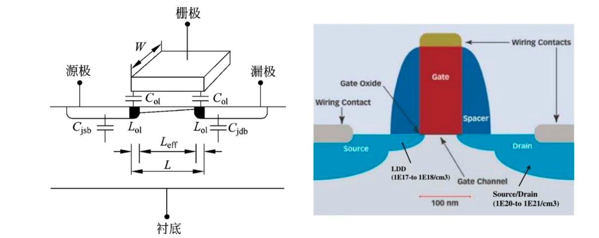

包括交叠电容（栅极到源极、栅极到漏极）和pn结电容（源极到衬底、漏极到衬底）。

交叠电容包括垂直方向的交叠电容$C_{ox}L_{oI}W$和侧壁交叠电容，**后者在现代工艺中不可忽略**，因为与其他特征尺寸相比，{==栅极厚度较大==}。可以使用简单的模型方程$C_{oI}=W\cdot C_{oI}'$，其中$C_{oI}'$是单位宽度的交叠电容。

### 衬底

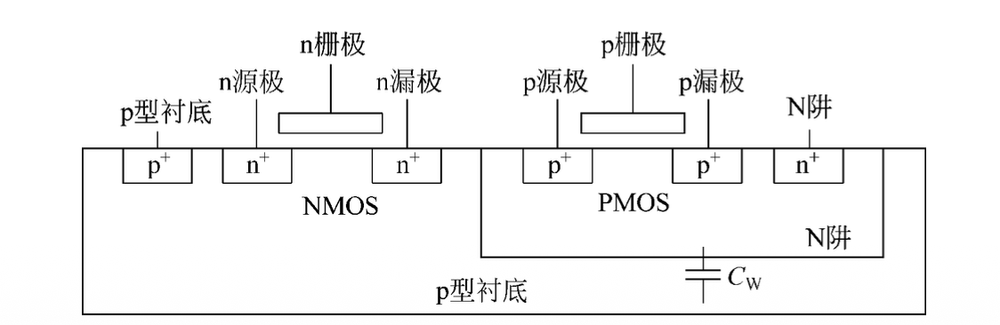

在 40nm CMOS（N 阱）工艺中,{==PMOS晶体管是五端器件==}（G、D、S、N阱、P衬底）。N 阱与衬底形成 PN 结，产生势垒电容 $C_W$。

* **当N阱=V_{DD}，衬底=GND时**，$C_W$被短路，不影响性能
* **当N阱与源极连接**，不会短路，产生$0.05fF/\mu m^2$的电容

#### 衬底工艺

低成本（N阱）工艺中，只有 PMOS 具有独立的衬底连接，NMOS的P衬底是一大块。

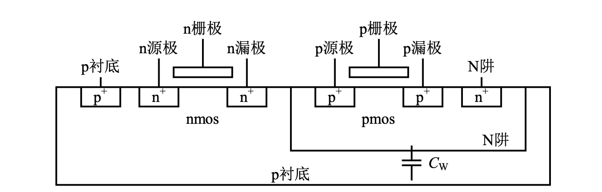

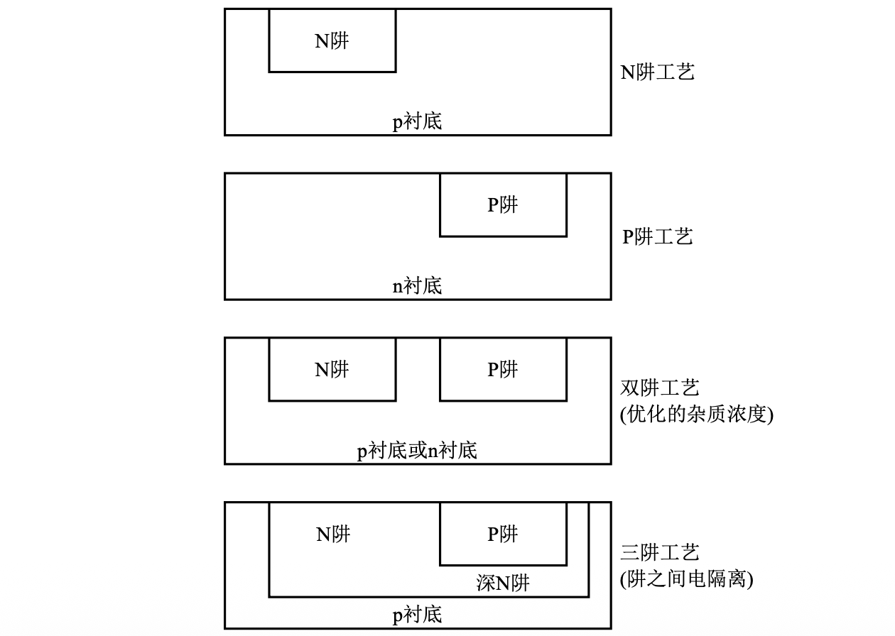

N阱工艺下衬底的连接接方案：（注意NMOS的P衬底全都接地了）

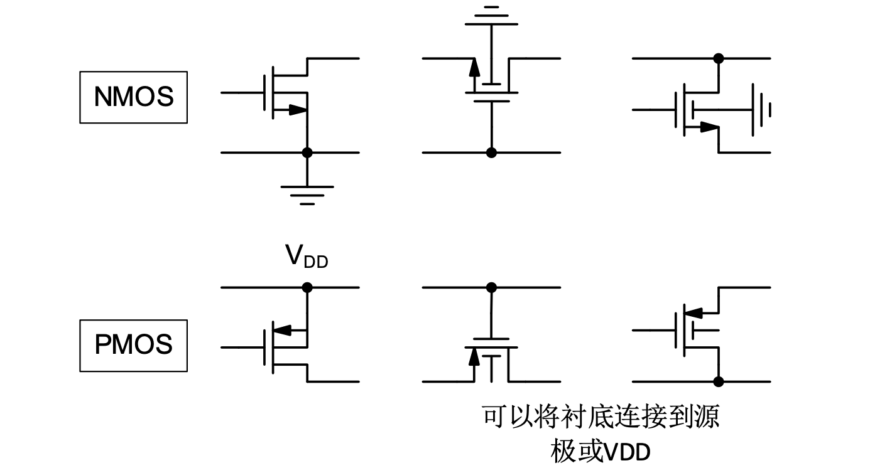

#### 背栅效应

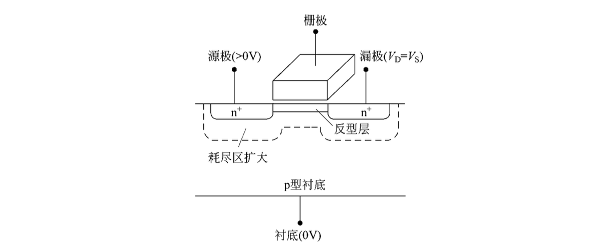

随着$V_{SB}$增加，源极周围耗尽区也随之扩大；耗尽区中的负电荷增加会排斥电子阻止其聚集到沟道。因此需要更大的$V_{GS}$来对抗这种影响，相当于$V_{t}$增加了。

$$
V_t = V_{t0} +\gamma\left(\sqrt{2\phi_f + V_{SB}}-\sqrt{2\phi_f}\right)
$$

$V_t$的变化也会影响漏极电流$I_D$,从而定义小信号下的背栅跨导

$$
g_{mb}=\frac{\partial I_D}{\partial V_{BS}}=-\frac{\partial I_D}{\partial V_{SB}}
$$

$$
\begin{aligned}
\frac{g_{mb}}{g_m} &= \frac{\partial V_t}{\partial V_{SB}}\cdot\underbrace{ \frac{\partial I_D}{\partial V_t}\cdot\frac{\partial V_{GS}}{\partial I_D}}_{-1}\\
&=\frac{\partial V_t}{\partial V_{SB}}=\boxed{\frac{\gamma}{2\sqrt{2\phi_f + V_{SB}}}}
\end{aligned}
$$

最终得到的小信号模型：（考虑了背栅效应和衬底电容）

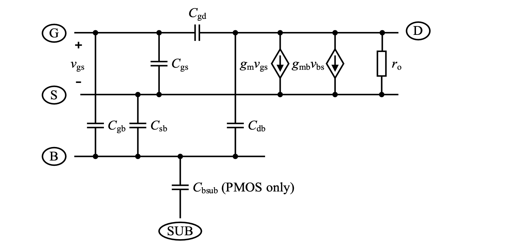
