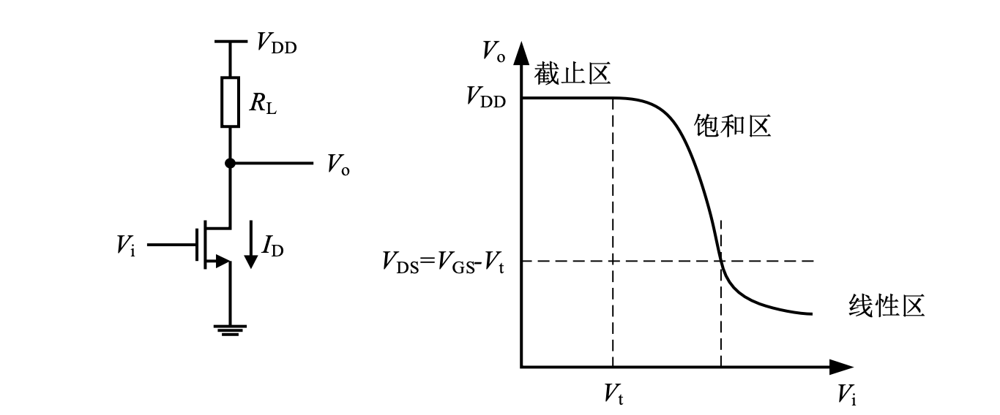
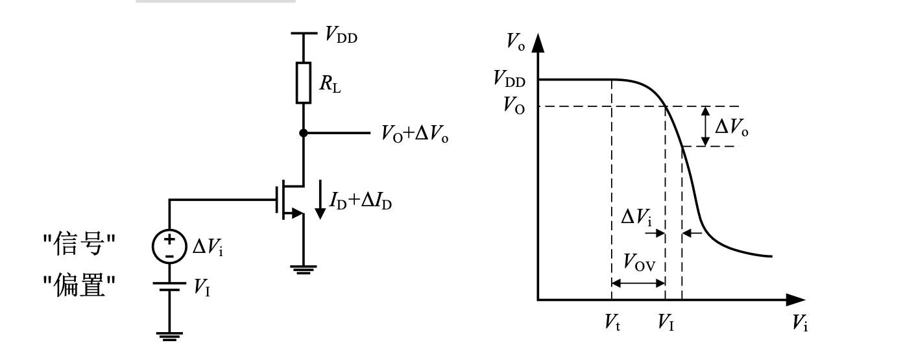
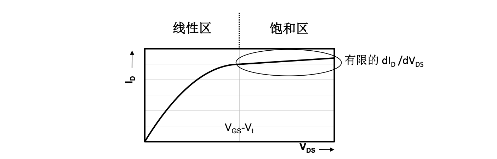
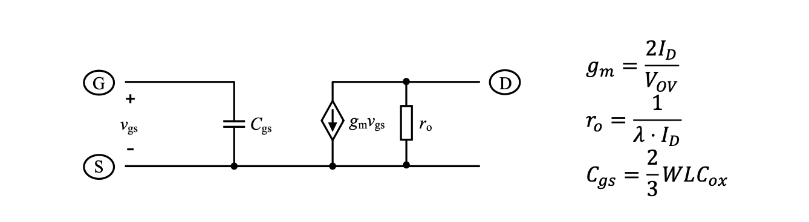
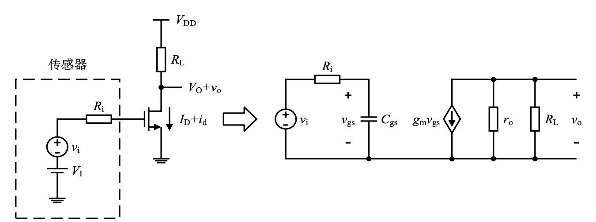
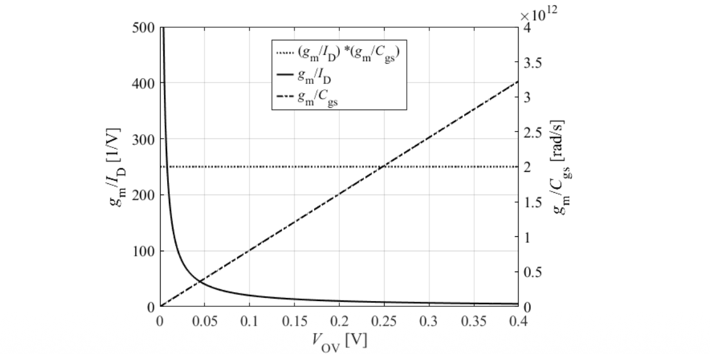

# 放大器的线性化分析

### MOS的小信号模型

放大器的基本原理是**利用压控压源（VCCS）将输入电压转化为电流，再用电阻将电流转化为输出电压**。

CS组态的MOS可以作为VCCS：

$$
I_D = \frac{1}{2}\mu C_{ox}\frac{W}{L}(V_{i}-V_t)^2
$$

$$
V_o=V_{DD}-I_D\cdot R_L
$$

为此需要通过偏置把输入电压带入合适的工作区。我们定义静态工作点栅极过驱动电压$V_{ov}=V_{I}-V_t$（无输入信号时$V_{ov}=V_{GS}-V_t$）。

$$
\begin{aligned}
V_o+\Delta V_o&=V_{DD}-\frac{1}{2}\mu C_{ox}\frac{W}{L}(V_{ov}+\Delta V_i)^2\cdot R\\
\Delta V_o&=-\frac{1}{2}\mu C_{ox}\frac{W}{L}R\left[(V_{ov}+\Delta V_i)^2-V_{ov}^2\right]\\
&=-\frac{1}{2}\mu C_{ox}\frac{W}{L}R\left[2V_{ov}\Delta V_i + (\Delta V_i)^2\right]\\
&=-\frac{2I_D}{V_{ov}}\cdot R\cdot \Delta V_i \cdot\left[1+\frac{\Delta V_i}{2V_{ov}}\right]
\end{aligned}
$$

假设$\Delta V_i\ll V_{ov}$，则

$$
\boxed{\Delta V_o=-\frac{2I_D}{V_{ov}}\cdot R\cdot \Delta V_i}
$$

定义跨导

$$
\boxed{g_m=\frac{\partial I_D}{\partial V_{GS}}=\frac{2I_D}{V_{ov}}}
$$

实际晶体管中，漏极电流与$V_{DS}$有弱相关性，进而

$$
I_D=\frac{1}{2}\mu C_{ox}\frac{W}{L}(V_{ov})^2\cdot \color{red}{(1+\lambda V_{DS})}
$$

因此从小新好看，有限的$\dfrac{\mathrm dI_D}{\mathrm dV_{DS}}$等效为与工作点有关的输出电导

$$
\begin{aligned}
g_{ds} &= \frac{\partial I_D}{\partial V_{DS}} = \lambda I_D \\
\end{aligned}
$$

### 性能指标

$$
H(s)=\frac{v_o(s)}{v_i(s)}=\frac{-g_mR}{1+sR_iC_{gs}}
$$

**直流电压增益**：$A_{DC}=-g_mR$，利用确定的$A_{DC}$和负载$R$求出需要的跨导$g_m$

**带宽**：$f_{3\mathrm{dB}}=\dfrac{1}{2\pi R_i C_{gs}}$，希望降低$C_{gs}$以提高带宽

**功耗**：$P=V_{DD}I_D$，希望降低$I_D$以降低功耗

因此从器件的角度，我们希望MOS提供$g_m$的情况下不产生很大的$I_D$和$C_{gs}$。因此可以定义“性能指标”

$$
\frac{g_m}{I_D}=\frac{2}{V_{ov}}\text{和} \frac{g_m}{C_{gs}}=\frac{3\mu V_{OV}}{2L^2}
$$

分别称为**跨导效率**和**特征频率**，它们都与过驱动电压$V_{ov}$有关。如果将其相乘，得到

$$
\frac{g_m}{I_D}\cdot \frac{g_m}{C_{gs}}=\frac{3\mu}{L^2}
$$

!!! note "工艺演进的影响"
    得益于“摩尔定律”，特征尺寸以及最小沟道长度不断缩小。$L_{min}$大约每 5 年减少 2 倍。1970 年时 Lmin=10μm ，2020 年时 Lmin=10nm。可以通过不同的方式{==利用工艺微缩==}：

    1. **面向高速应用**:构建更快的电路，利用更大的$g_m/C_{gs}$,同时保持跨导效率$g_m/I_D$不变
    2. **面向低功耗应用**:保持带宽$g_m/C_{gs}$不变，构建更高能效的电路($g_m/I_D$更大)。

### 特征指标

**特征频率**定义为共源电流增益为1的频率。忽略非本征电容得到

$$
\omega_T=\frac{g_m}{C_{gs}}=\frac{3\mu V_{OV}}{2L^2}
$$

**本征增益**定义为输出电导为零时（$R_L\to \infty$）基本共源级可实现最大电压增益。

$$
\begin{aligned}
\left|A_{DC}\right|&=g_mR=g_m\cdot\left(R_L\parallel r_o\right)\\
\left|A_{DC}\right|_{max} &= g_m\cdot r_o = \frac{g_m}{g_{ds}} \\
&\approx \frac{1}{\lambda V_{ov}}= \frac{2I_D}{\lambda I_DV_{ov}} 
\end{aligned}
$$

| 指标 | 定义| 长沟道模型结果 |
|------|------|------|
| 跨导效率 | $g_m / I_D$ | $2 / V_{OV}$ |
| 特征角频率 | $g_m / C_{gs}$ | $\dfrac{3}{2}\dfrac{\mu V_{OV}}{L^2}$ |
| 本征增益 | $g_m / g_{ds}$ | $\approx \dfrac{2}{\lambda V_{OV}}$ |
