# 晶体管的基本电路结构

晶体管有共源、共栅和共漏三种基本的连接模式。一个共源极就足以构建一个简单的放大器，栅极和共漏极可以作为有用的附加电路，用于构造“更好的”放大器。更复杂的模拟电路可以分解为上述三种基本连接方式的组合。

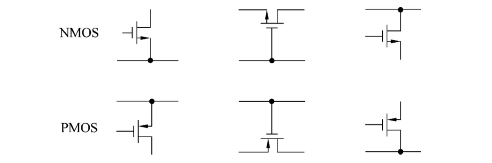

### 共源极

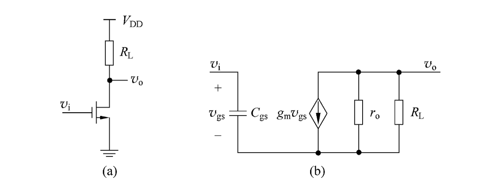

$$
H(s)=\frac{v_o(s)}{v_i(s)}=\frac{-g_mR}{1+sR_iC_{gs}}\,\quad R=R_L\parallel r_o
$$

共源极具有很高的输入输出阻抗，是很好的VCCS。
### 共栅极

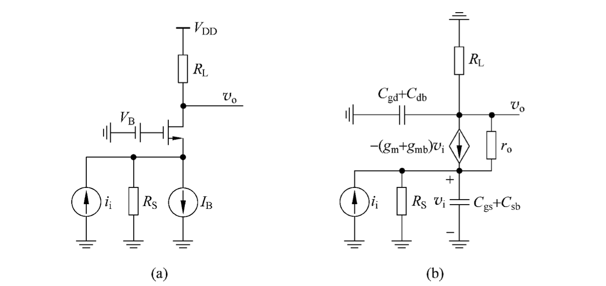

定义$C_s=C_{gs}+C_{sb}$，$g_m'=g_m+g_{mb}$，忽略$R_L$得到

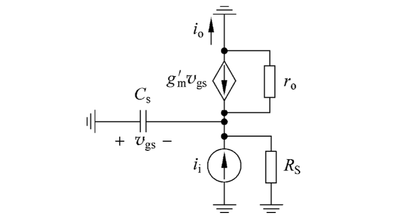

$$
\frac{i_o}{i_i}=\frac{1}{1+s\frac{C_S}{g'_m}}\,,g'_mR_s\gg 1
$$

共栅级是电流缓冲器，增益为1，带宽很高.

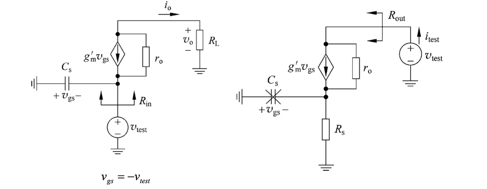

**求解输入阻抗：**

$$
\begin{cases}
\text{o点KCL: }&0=\dfrac{v_o}{R_L}+\dfrac{v_o-v_{test}}{r_o}-g'_mv_{test}\\
\text{test点KCL: }&i_{test}=g'_mv_{test}+\dfrac{v_{test}-v_o}{r_o}+sC_Sv_{test}
\end{cases}
$$

得到

$$
\begin{aligned}
Y_{in}&=\frac{i_{test}}{v_{test}}\approx\frac{g'_mr_o}{R_L+r_o}+sC_S\\
&=\boxed{\frac{g'_mr_o}{R_L+r_o}\left(1+sC_S\frac{R_L+r_o}{g'_mr_o}\right)}
\end{aligned}
$$

低频下

$$
\boxed{R_{in}=\frac{R_L+r_o}{g'_mr_o}}
$$

1. 当$R_L\ll r_o$时，$R_{in}\approx 1/g'_m$，输入阻抗较低
2. 当$R_L\gg r_o$时，$R_{in}\approx R_L/g'_m$，输入阻抗比未加入共栅级前降低**本征增益倍**

**求解输出阻抗：**

$$
i_{test}=\frac{v_{test}}{r_o}+\frac{v_{gs}}{r_o}+g'_mv_{gs}\,,v_{gs}=-i_{test}R_S
$$

得到

$$
\boxed{R_{out}=\frac{v_{test}}{i_{test}}\approx g'_m}
$$

输出阻抗比未加共栅级前的源阻抗$R_S$提升本征增益倍!

共栅极的电流增益在很宽的带宽内都接近1（大约到$f_T$），输入阻抗降低，输入阻抗升高可以作为电流缓冲器使用，可以利用这一点改进共源极VCCS。

### 共源共栅结构

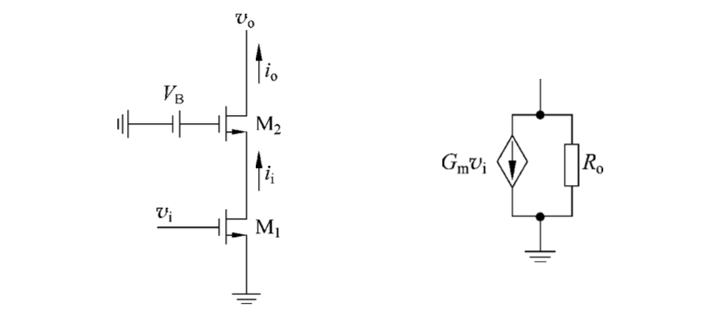

$$
G_m = g_{m1}\cdot\frac{i_o}{i_i}\approx g_{m1}\,,R_o\approx r_{o2}(1+g'_{m2}r_{o1})
$$

$$
\boxed{G_mR_o=g_{m1}r_{o2}(1+g'_{m2}r_{o1})\approx g_{m1}g_{m2}r_{o1}r_{o2}\sim (g_mr_o)^2}
$$

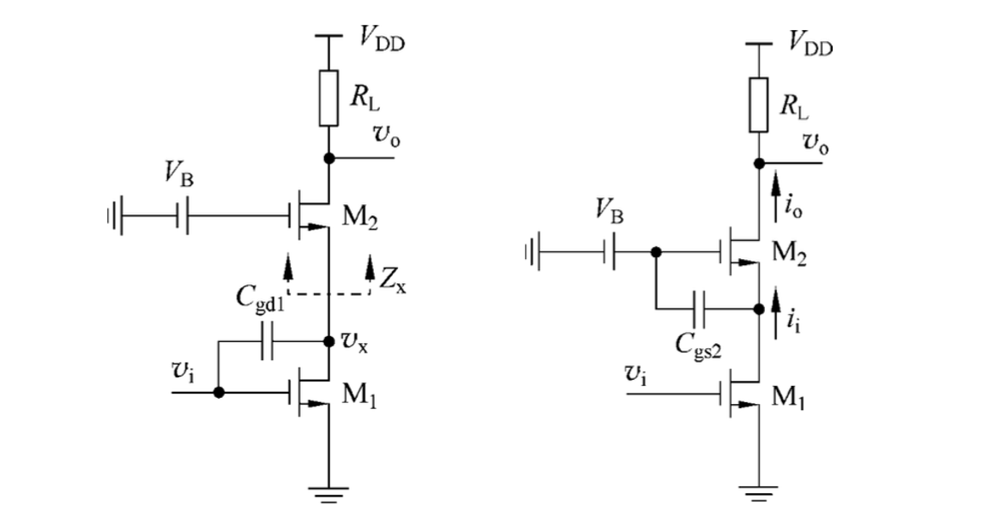

$$
\frac{v_x}{v_i}=g_{m1}Z_x\approx \frac{g_{m1}}{g'_{m2}}\left(1+\frac{R_L}{r_{o2}}\right)
$$

#### 性能
高频优势：

1. 增益较小，削减密勒倍增效应；即使 $R_L$ 较大，通常也会有一个负载电容提供低阻抗端接，帮助维持这一特性.
2. 共源共栅结构削弱了高频下从 Vi 到 Vo 的直接正向耦合

高频缺点：共源共栅结构引入了$f_T$附近的极点，可能会影响相位裕度和稳定性:

$$
\frac{i_o}{i_i}\approx\frac{1}{1+s\frac{C_{gs}+C_{sb}}{g'_m}}
$$

另一个问题是输出摆幅问题，增加共栅极会降低输出信号摆幅。先进工艺下（$V_DD<1\mathrm V$）会造成严重问题，因为通常需要$V_{DS}>150\mathrm{mV}$，损失动态范围。

#### 噪声

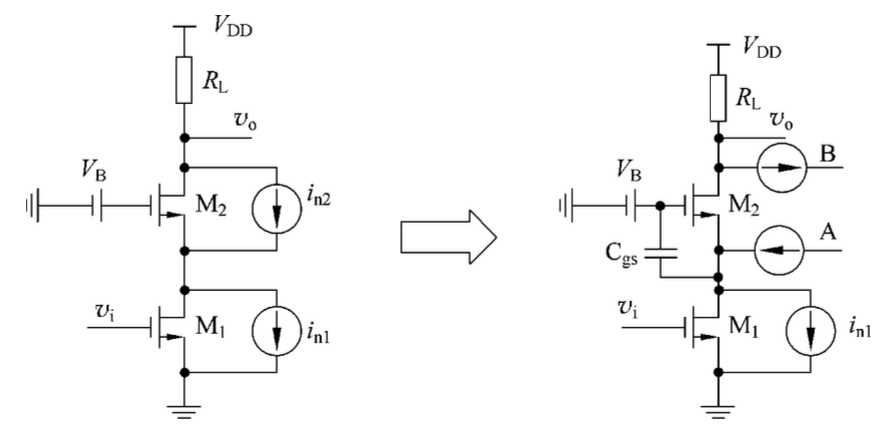

通常认为共栅极不会产生额外噪声。但，其在高频的时候会产生额外噪声：高频时噪声电流A和B不能抵消。

### 共漏极

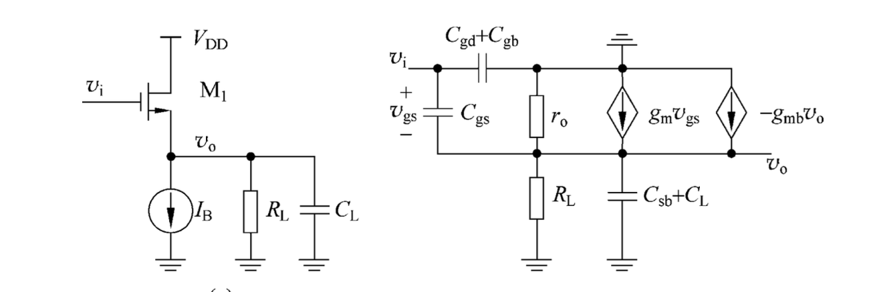

#### 电压传递函数和输入输出阻抗

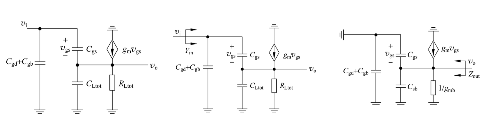

定义$C_{Ltot}=C_L+C_{sb}$, $R_{Ltot}=R_L\parallel \dfrac{1}{g_{mb}}\parallel r_o$, 则

$$
\begin{aligned}
0&=v_o\left(sC_{L_{tot}} + sC_{gs} + \frac{1}{R_{L_{tot}}}\right)
- v_i sC_{gs} - g_m (v_i - v_o) \\
\frac{v_o}{v_i}
&= \frac{g_m + sC_{gs}}
{g_m + sC_{gs} + sC_{L_{tot}} + \frac{1}{R_{L_{tot}}}} \\
&= \boxed{\frac{g_m}{g_m + \frac{1}{R_{L_{tot}}}}
\cdot
\frac{1 + \frac{sC_{gs}}{g_m}}
{1 + \frac{s(C_{gs}+C_{L_{tot}})}{g_m + \frac{1}{R_{L_{tot}}}}
}}
\end{aligned}
$$

**低频增益**

$$
a_{v0}=\frac{g_m}{g_m+\frac{1}{R_{Ltot}}}
$$

1. PMOS，源极接衬底作为理想电流源: $R_L\to\infty$, $r_o\to\infty$, $g_{mb}=0$从而 $a_{v0}=1$
2. NMOS做理想电流源：$R_L\to\infty$, $r_o\to\infty$, $g_{mb}\neq 0$从而 $a_{v0}=\dfrac{g_m}{g_m+g_{mb}}$ (一般0.8左右)
3. PMOS，源极与衬底相连作为负载电阻: $R_L<\infty$, $r_o\to\infty$, $g_{mb}\neq 0$,此时$a_{vo}=\dfrac{g_m}{g_m+\frac{1}{R_L}}$

**高频增益**

$$
a_v(s)=a_{v0}\cdot\frac{1-s/z}{1-s/p}
$$

其中

$$
z= -\frac{g_m}{C_{gs}}\,,p=-\frac{g_m+\frac{1}{R_{Ltot}}}{C_{gs}+C_{Ltot}}
$$

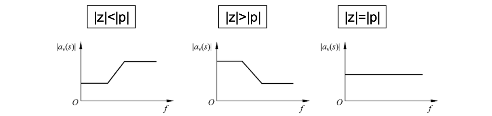

#### 输入阻抗

注意到

$$
Y_{in}=s(C_{gd}+C_{gb})+sC_{gs}(1-a_v(s))
$$

增益项 $a_v(s)$是实数，且在很宽的频率范围内都接近$1$，因此在一定频率范围内，可以忽略$C_{gs}$的影响。此时$Y_{in}=s(C_{gd}+C_{gb}),输入电容非常之小。

**衬底与源连接的PMOS共漏极**

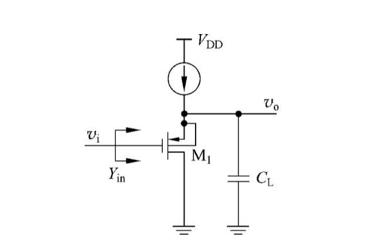

栅极与衬底间的电容与 $C_gs$ 并联, $g_{mb}$不起作用，低频增益接近1。输入电容$Y_{in}\approx sC_{gd}$极小。

**共漏极输入电容“自举”**

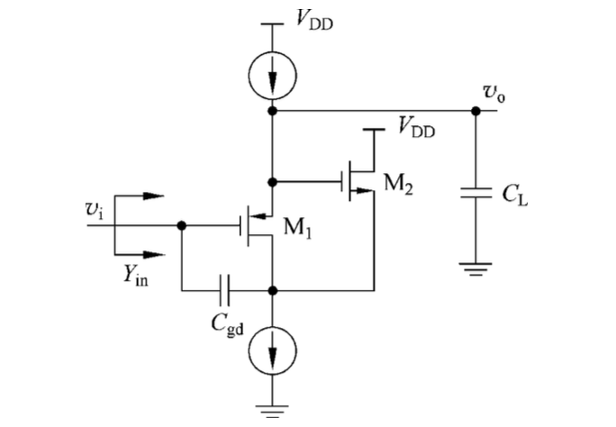

$v_i$经过两个共漏极到$C_{gd}$另一端

$$
Y_{in}\approx sC_{gd}\left(1-a_{vP}(s)a_{vN}(s)\right)
$$

#### 输出阻抗

**理想电压源驱动**：显然

$$
Z_{out}=\frac{1}{g_m+g_{mb}}\parallel \frac{1}{s(C_{gs}+C_{sb})}
$$

其输出阻抗较低，在很宽的频率范围内都呈现出阻性。

**有限输入源电阻**：

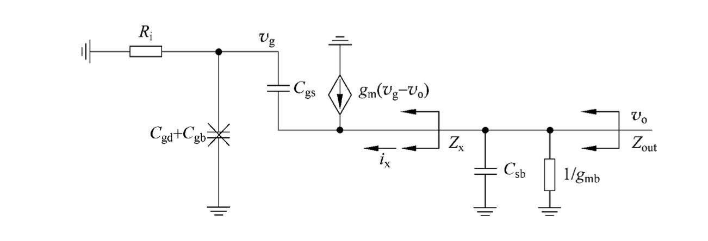

$$
Z_x=\frac{v_o}{i_x}\,,i_x=(v_o-v_g)(g_m+sC_{gs})=v_o\left(1-\frac{v_g}{v_o}\right)(g_m+sC_{gs})
$$

$$
\frac{v_g}{v_o}=\frac{R_i}{\frac{1}{sC_{gs}}+R_i}
$$

$$
\boxed{Z_x\approx\frac{1}{g_m}\frac{1+sR_iC_{gs}}{1+\frac{sC_{gs}}{g_m}}}
$$

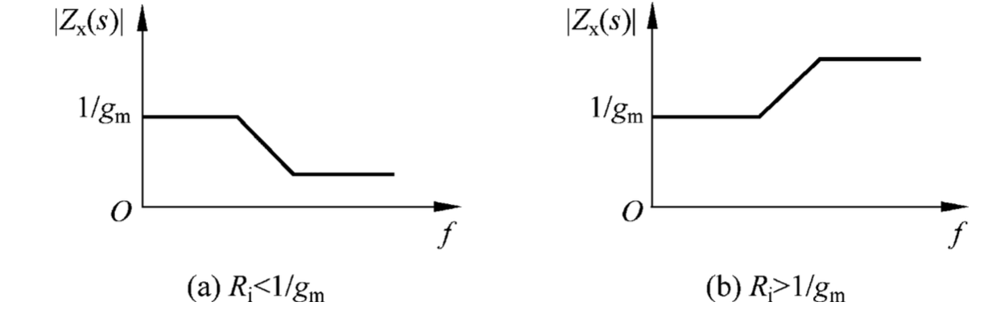

当$R_i>\frac{1}{g_m}$，产生了电感效应！此时电路容易振荡。

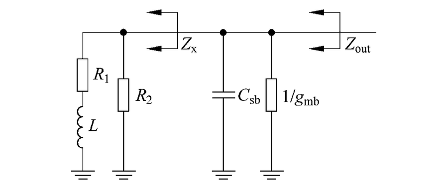

若不忽略$C_i=C_{gd}+C_{gb}$,则

$$
\boxed{Z_x=\frac{1}{g_m}\frac{1+sR_i(C_{gs}+C_i)}{\left(1+\dfrac{sC_{gs}}{g_m}\right)(1+sR_iC_i)}}
$$

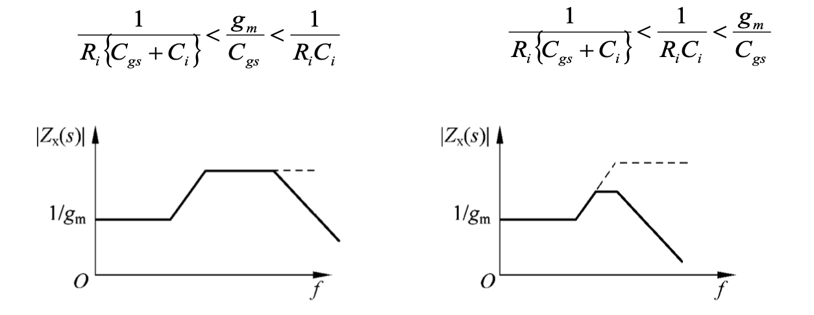

##### 应用

**电平转换器**：输出的静态工作点比输入低$V_t+V_{ov}$
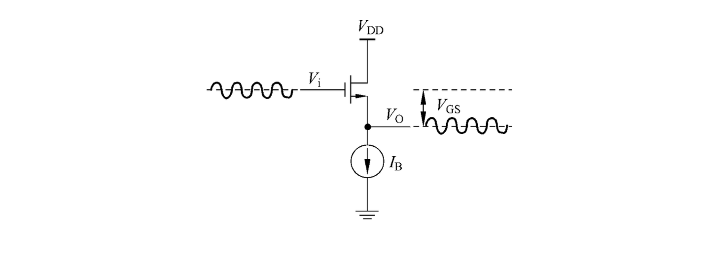

**驱动器**：隔离重负载$R_{small}$

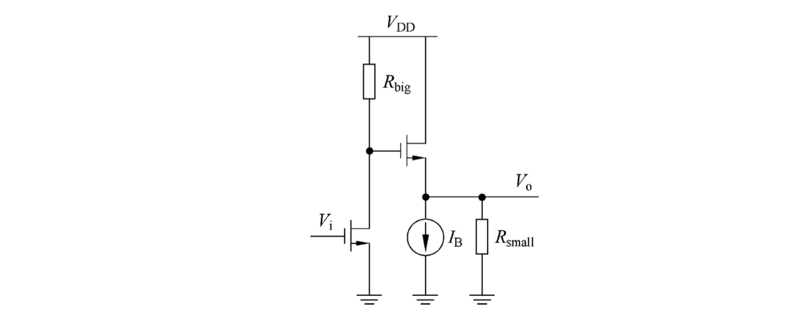

问题：

1. NMOS，源极与衬底不相连，$V_t$随$V_o$变化
2. $R_L$不大的时候，$I_D$和$V_{ov}$随$V_o$变化
3. 输入和输出电压摆幅受限（$V_{GS}$分走大部分）

**有源负载**

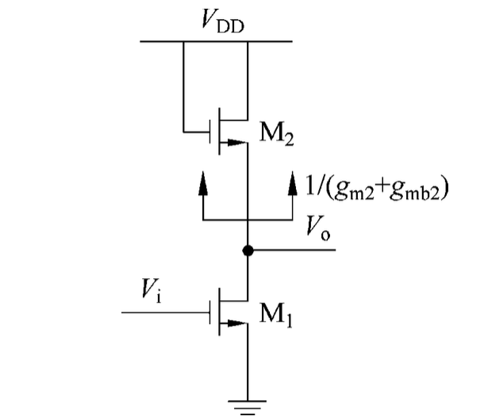

优势：

1. 增益取决于同量纲物理量的比值，PVT稳定
2. 一阶非线性抵消

劣势：摆幅降低

### 单管电路总结

| 组态 | 特性 | 用途 |
| --- | --- | --- |
| 共源极 | 压控电流源；当输出为高阻时可形成较好的电压放大器 | 电压放大 |
| 共栅极 | 低输入阻抗，高输出阻抗 | 电流缓冲器 |
| 共栅极 | 可与共源级级联，提高整体本征电压增益 | 共源-共栅级（Cascode） |
| 共漏极 | 高输入阻抗，低输出阻抗 | 缓冲器（源极跟随器） |
| 共漏极 | 适合进行直流工作点的搬移 | 电平移动 |
| 共漏极 | 当摆幅与非线性要求不高时可作电压驱动器 | 电压驱动 |
### 电流镜

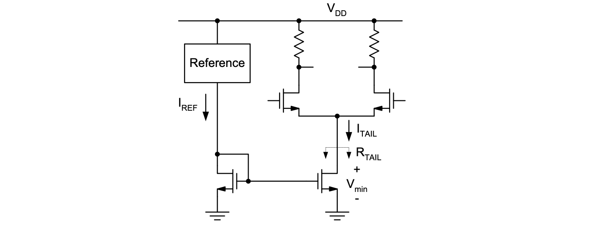

目标：

* 精确的景象比$I_{Tail}/I_Ref}$
* 大的$R_{Tail}$,用来获得好CMRR
* 小的$V_{min}$,最大化共模输入范围

#### 基本电流镜

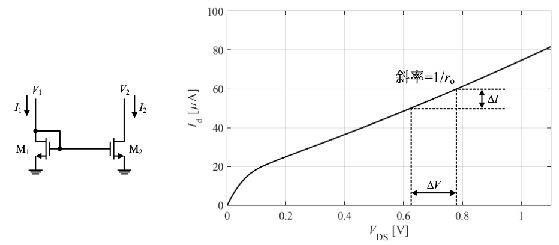

一般来说始终令$L_1=L_2$,并将$W_1/W_2$或者$W_2/W_1$设置为整数（从而并联使用单元器件）。

$$
\Delta I=I_1-I_2=\frac{\Delta V}{r_o}
$$

从而两种选择：

1. 用大输出电阻$r_o$的器件（加大$L$）
2. 令$V_1$尽量接近$V_2$.

#### 共源共栅电流镜

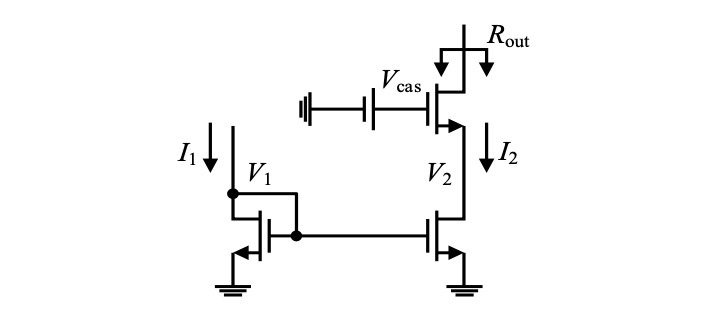

共源共栅结构有助于得到更高的输出电阻，可用于提高差分对的CMRR

$$
R_{out}\approx g_m r_o^2
$$

即使电流镜输出端的电阻很高，仍然希望$V_1=V_2$,这样尽量减少$I_2/I_1$的系统误差

**方案1** ref上也叠一个共栅管，坏处是$V_{OUTmin}$将会很高

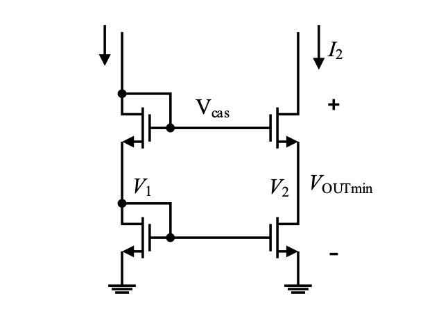

**方案2** 用电压源提供共源共栅管的栅极电位，让$V_{outmin}=2V_{ov}$(最小值）：（因为只需要$V_{DS}>V_{ov}$就可以，不需要大于$V_{GS}$)

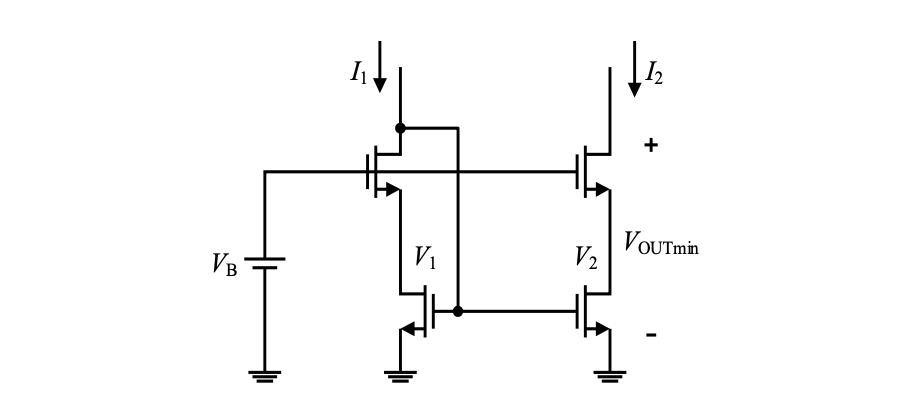

此时需要偏置电压$V_B=V_t+2V_{ov}$。
