# 学推计划报销

!!! tip "说明"
    本文仅适用于2026年电子系学推计划（第一、二批次）报销工作。有任何问题，请向江玮陶（18519135251,微信同号）提出。

!!! danger "注意"
    学校信息化水平实在堪忧啊
    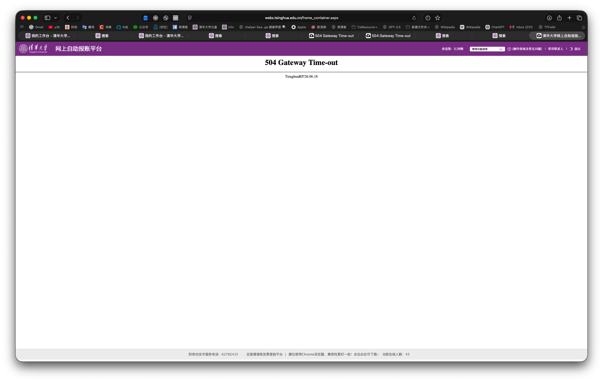

!!! warning "重要说明"
    每笔报销都必须填写登记表单，方便统计总花费[https://f.kdocs.cn/g/UzETnfkY/](https://f.kdocs.cn/g/UzETnfkY/)

### 表单链接速查

|用途|链接|
|---|---|
|登记报销单|[https://f.kdocs.cn/g/UzETnfkY/](https://f.kdocs.cn/g/UzETnfkY/)|
|查询限额|[https://365.kdocs.cn/wo/sl/v1311lZV](https://365.kdocs.cn/wo/sl/v1311lZV)|

### 物品购买类报销（1000元以内）
#### 开具发票
发票信息：

- 类型：**增值税普通发票**（简称“普票”）
- 抬头：清华大学
- 纳税人识别号：12100000400000624D

#### 上传发票

在info中输入“自助报账”

进入如下页面：

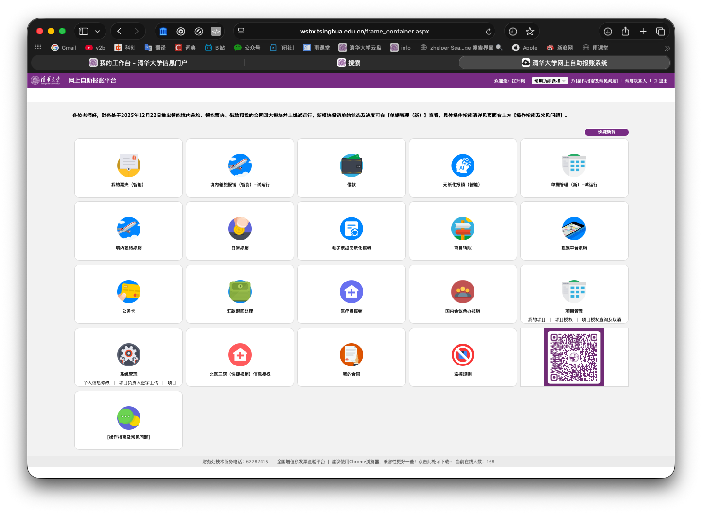

点击“我的票夹（智能）”：

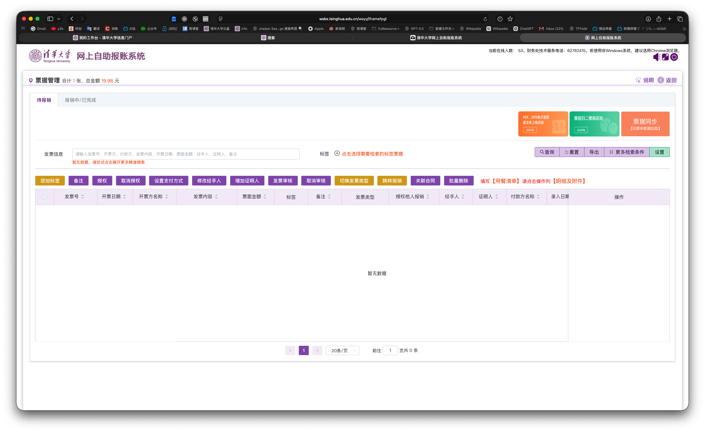

点击“PDF、OFD电子发票原文件上传识别“（右上角第一个$\textcolor{orange}{\text{橙色}}$按钮）

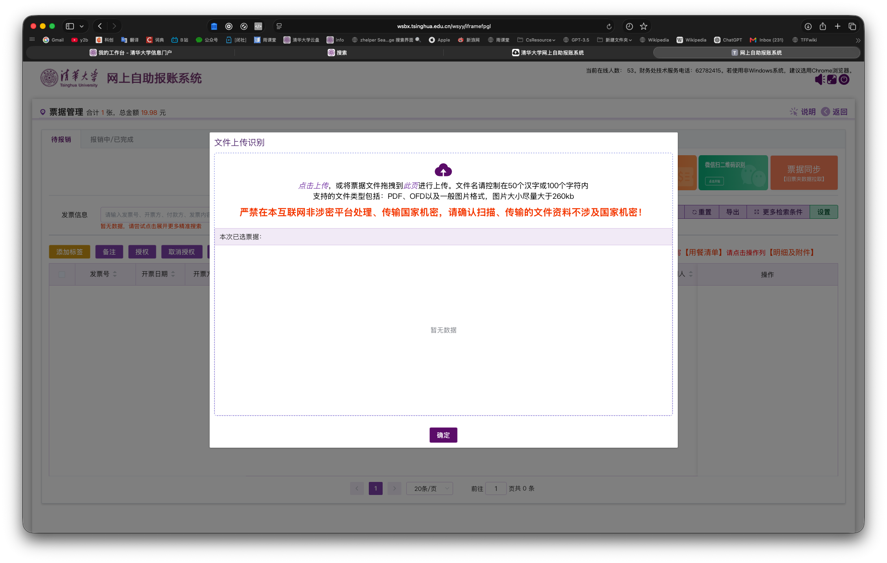

点击$\textcolor{purple}{\text{紫色}}$的“点击上传”后选择发票文件上传，然后点“确定”

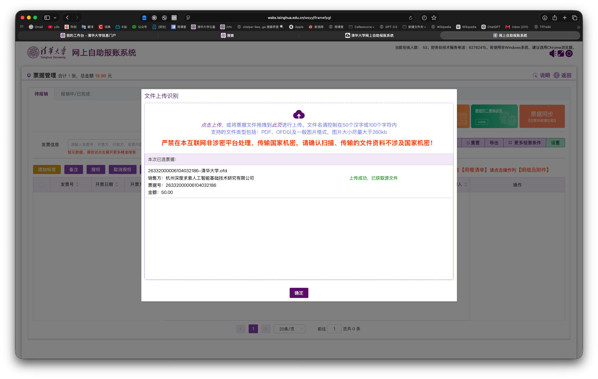

可以看到我们上传的发票信息：

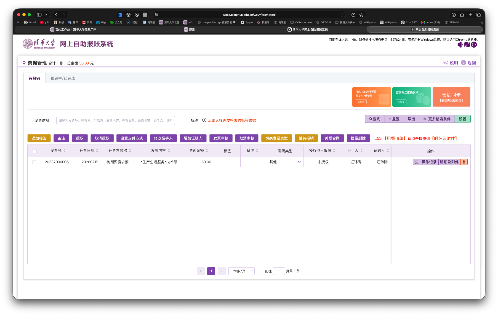

#### 提交报销单

在智能票夹中，左侧选中所有要报销的发票，点击$\textcolor{tan}{\text{黄色}}$按钮“跳转报销”

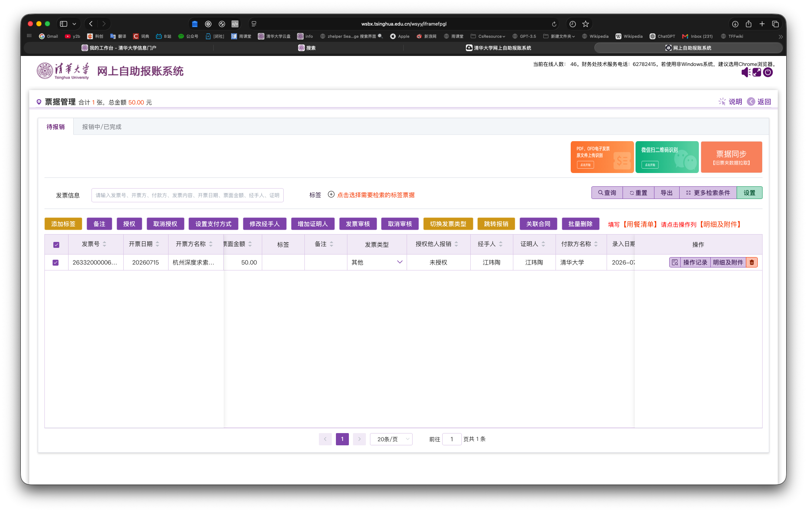

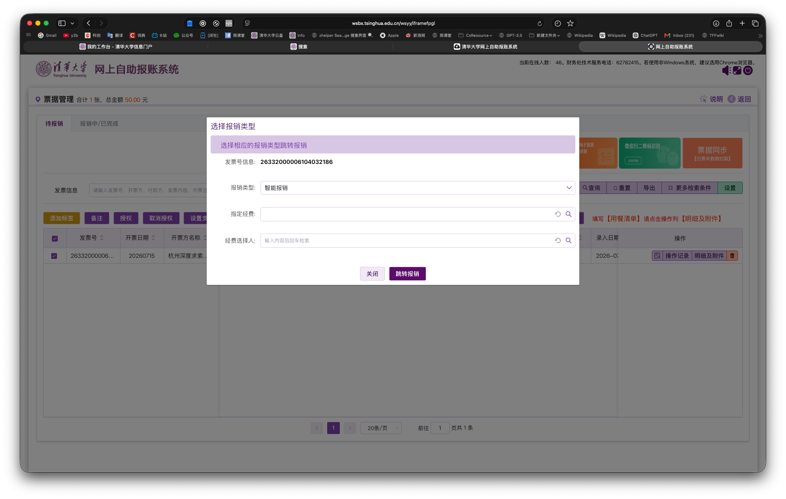

**报销类型**选择“智能报销”，**指定经费**点开选择“023-52300901526（电子系-20267020002自主科研-大学生学术研究推进计划）”

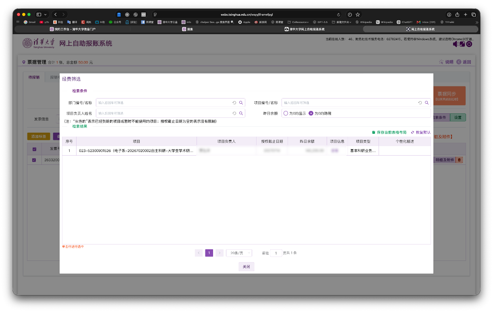

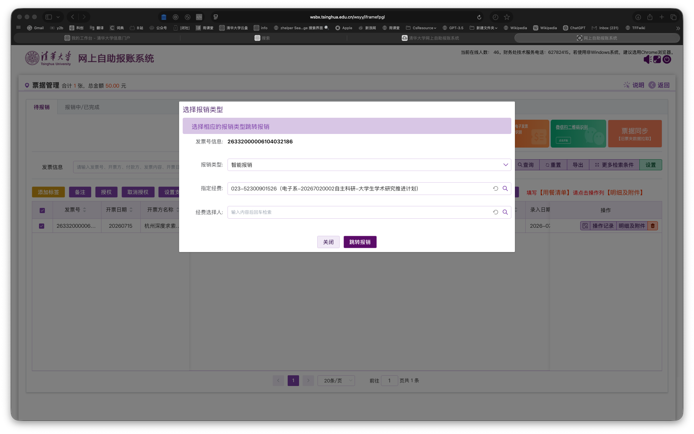

然后点击$\textcolor{purple}{\text{紫色}}$按钮“跳转报销”，填写信息

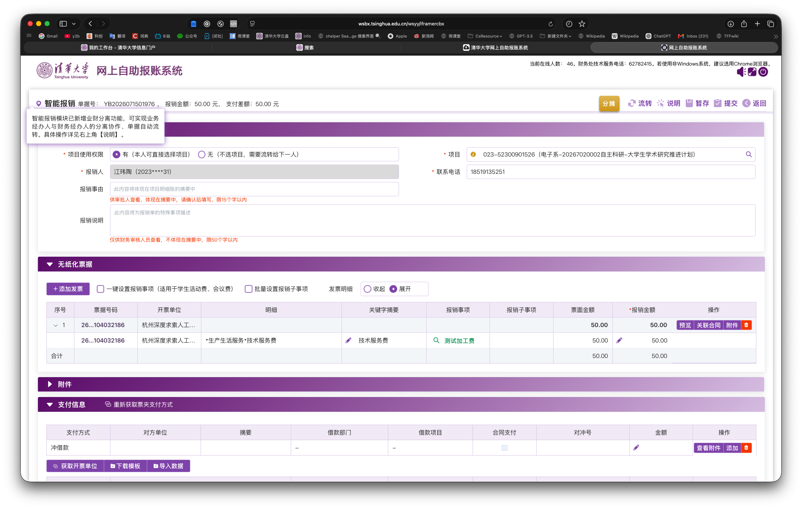

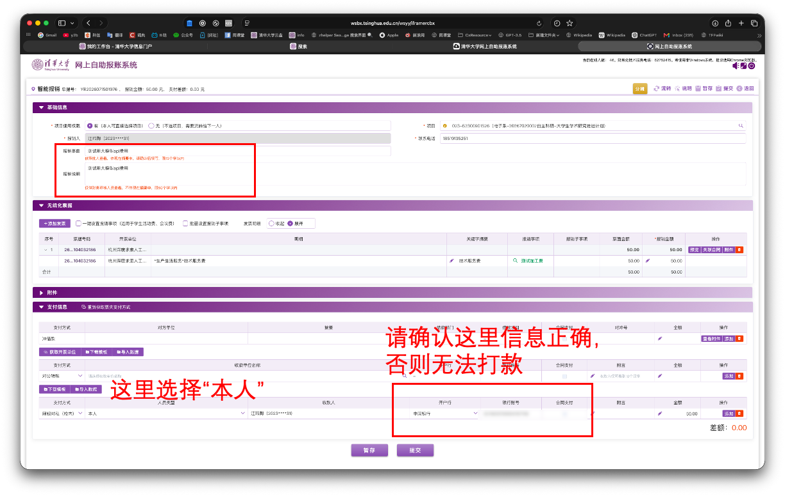

点击提交，弹窗中选择**线上审批、无纸化推送**

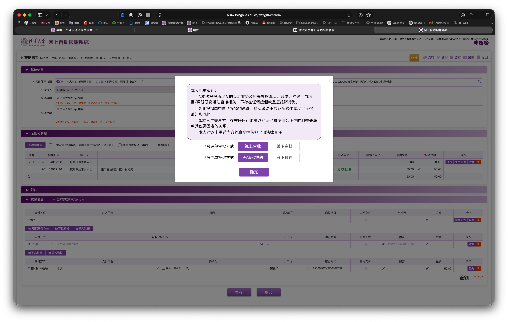

点“编辑审批流程“后，添加我（江玮陶，2023010631）**并将我的顺序改为1，贾老师顺序改为2后**，保存写好备注信息，点“提交报销单”即可提交

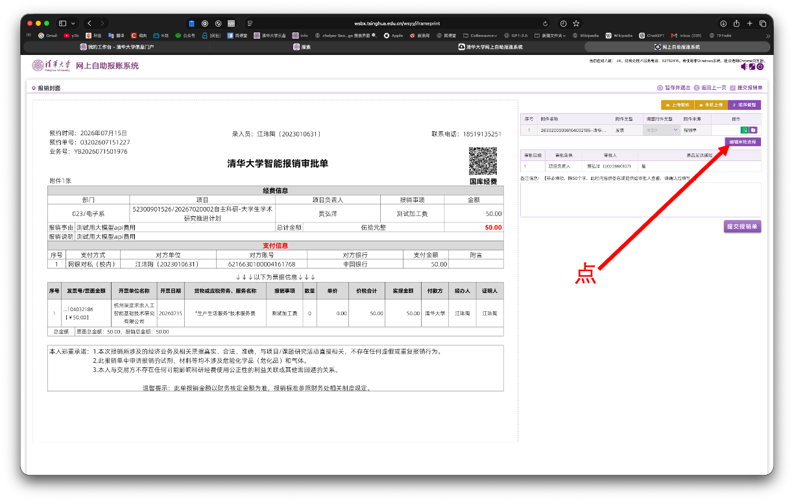

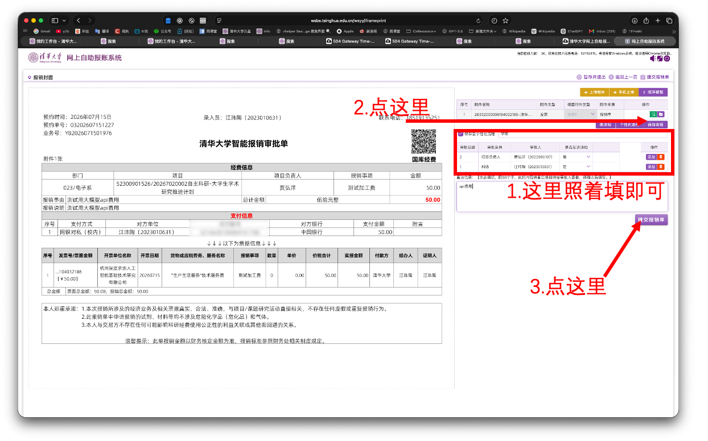

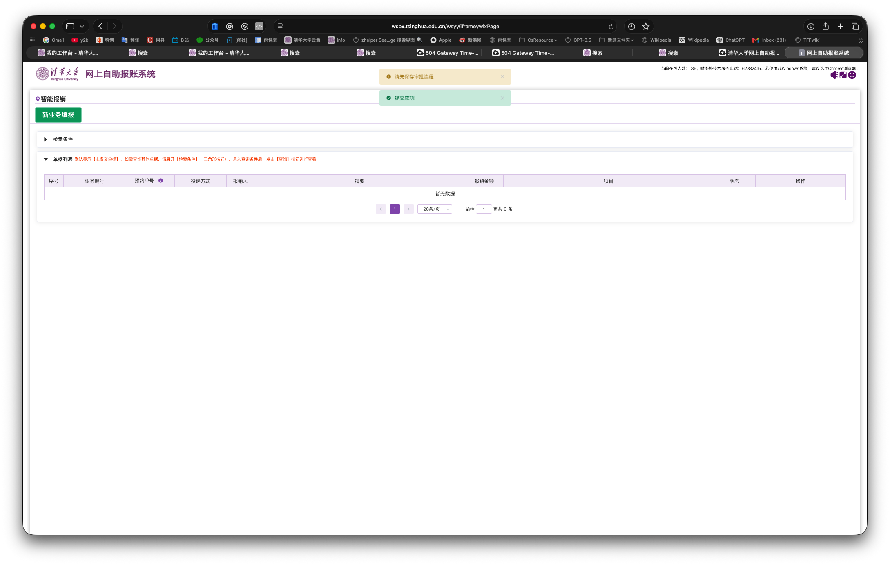

提交后，请填写下面链接表单登记： [https://f.kdocs.cn/g/UzETnfkY/](https://f.kdocs.cn/g/UzETnfkY/)后静等报销即可。

!!! warning "重要说明"
    每笔报销都必须填写登记表单，方便统计总花费[https://f.kdocs.cn/g/UzETnfkY/](https://f.kdocs.cn/g/UzETnfkY/)
