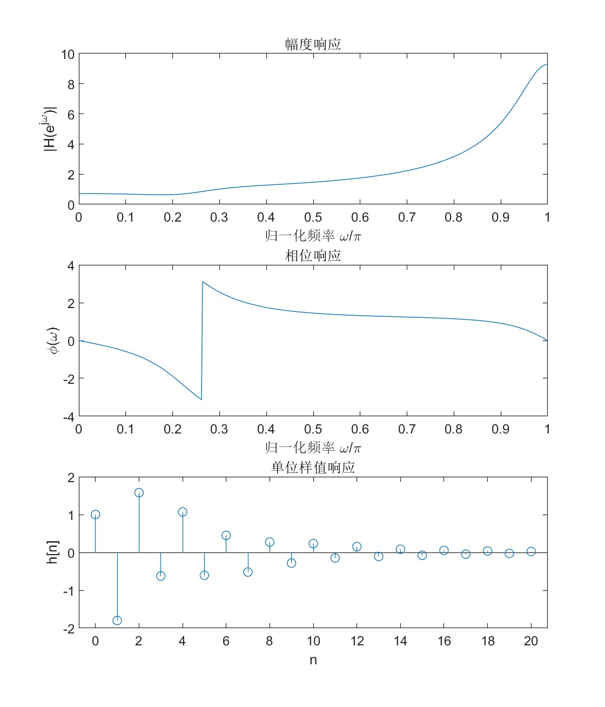

# 绘图相关

连续图（幅频相频/连续时域）用`plot(x,y)`画，离散响应用`stem(x,y)`画。使用`xlabel('xxx')`,`ylabel('xxx')`,`title('xxx')`画xy坐标轴和标题，支持latex语法。

子图定义：使用`subplot(m,n,p)`后，`plot`就能绘制$m\\times n$图的第$p$个子图。如2006年题依次使用`subplot(3,1,1)`, `subplot(3,1,2)`, `subplot(3,1,3)`绘制幅频、相频、样值响应：
 
