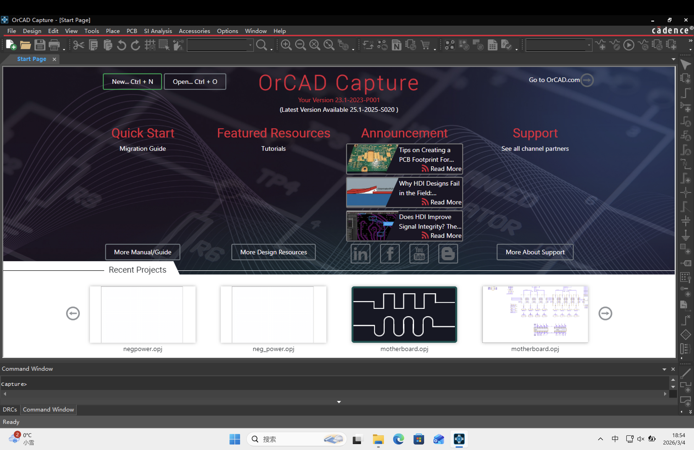
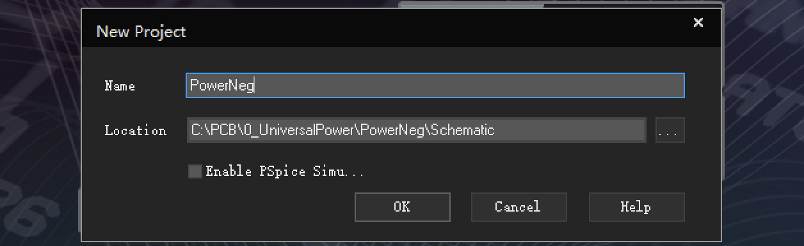
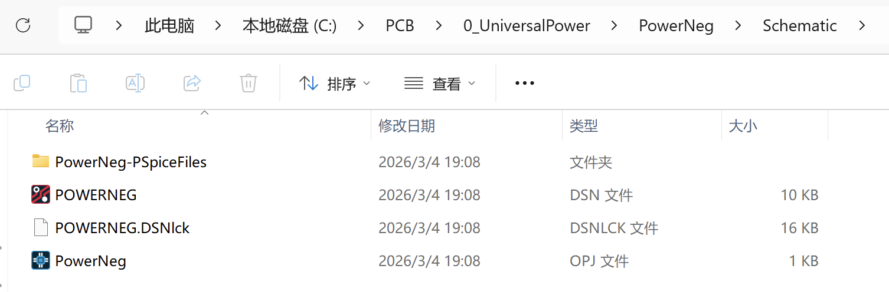

# 新建项目

先把这堆文件复制过来，清空Layout和Schemetic文件夹

打开Capture CIS

选择new

在Schemetic文件夹下新建项目

现在的文件结构：

| 文件后缀 | 说明 |
|----------|------|
| `.DSN`   | PSpice 原理图设计文件，包含电路元件、连线和网名等信息 |
| `.DSNLCK`| 设计锁文件，用于防止同一个工程被多实例修改，通常不需要手动操作 |
| `.OPJ`   | OrCAD 项目文件，记录整个工程的原理图、仿真设置和库路径，双击即可打开整个项目 |
| 文件夹（PSpiceFiles） | 仿真生成的文件存放目录，包括输出结果、波形文件、netlist 等 |
