# 版图绘制

### 修改封装
Edit-Browser-Parts

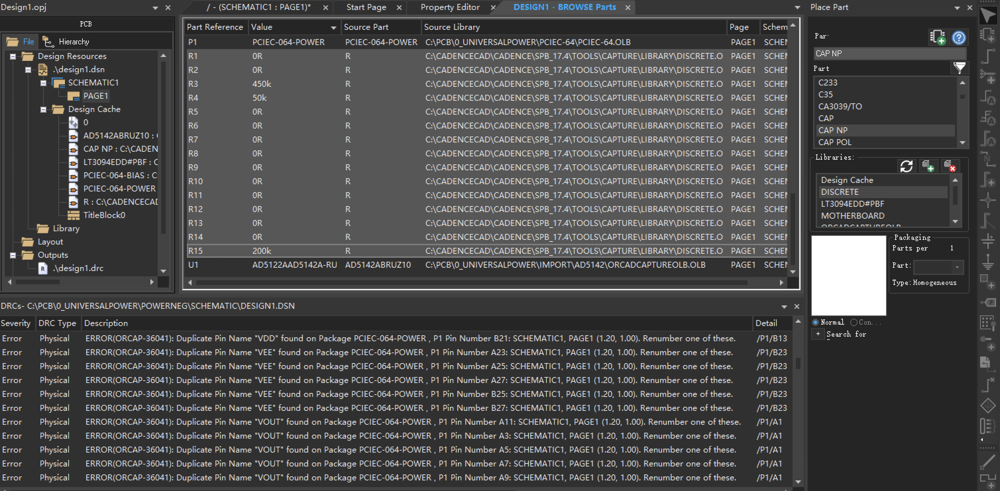

全选，Edit-Properties（ctrl+E）

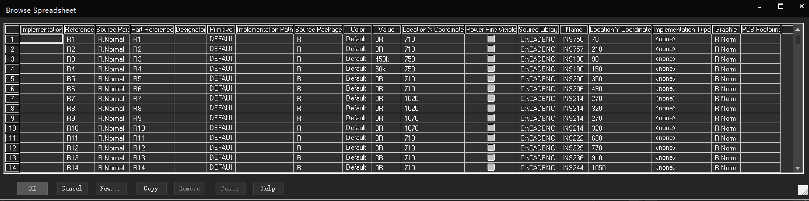

修改PCB Footprint

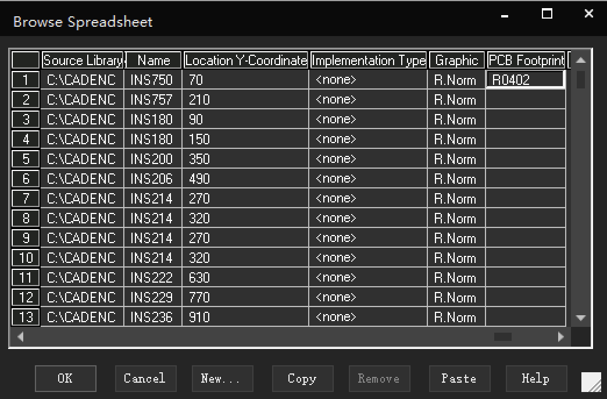

改好一个点Copy，点列头全选整列，然后Paste

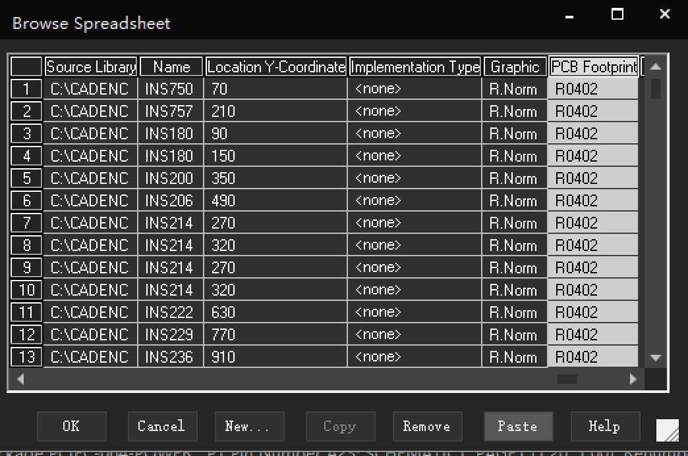

### 新建版图

首先完成DRC检查，确保原理图没有错误。然后PCB-New Layout

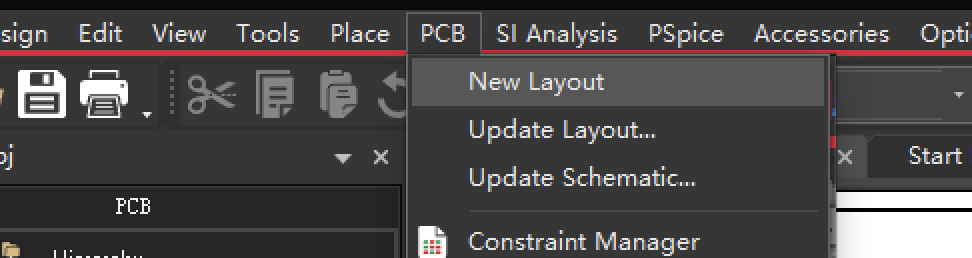

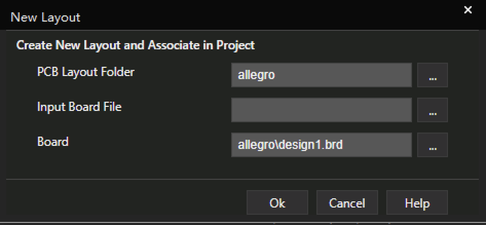

成功进入allegro界面。

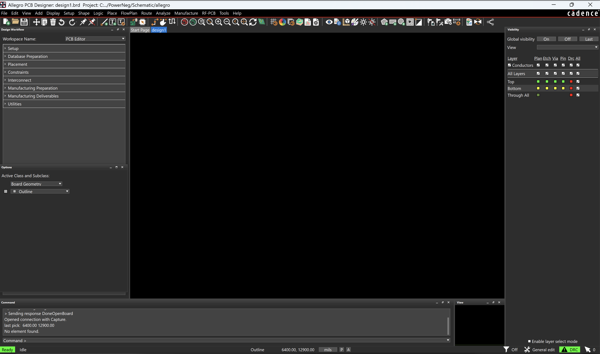

### 放置元件

Place-Manual手动放置

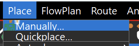

选好元件就可以放。

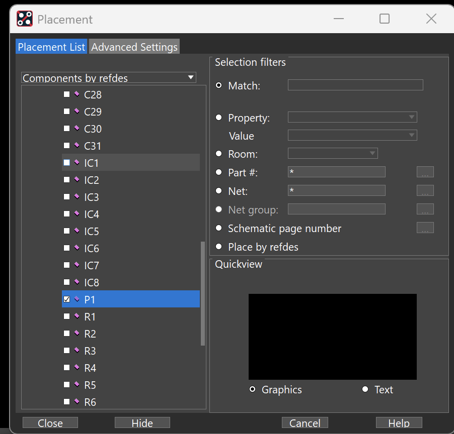

第一次放可能出现`Cannot load symbol 'xxxx'`报错。需要导入元件封装库：

#### 导入封装库

顶部菜单Setup-User Preferences

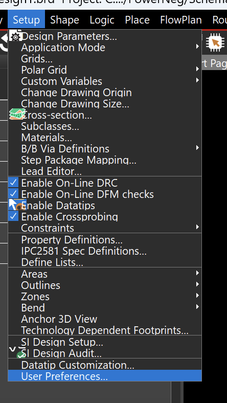

左侧菜单找Paths/Library

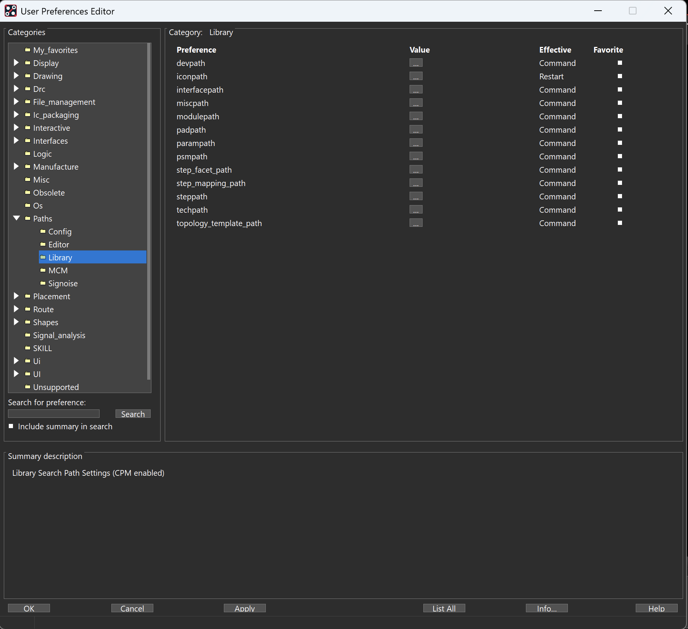

添加以下目录：

1. `devpath`：`../PcbLibrary/device`
1. `padpath`：`../PcbLibrary/pads`
1. `psmpath`:`../PcbLibrary/psm`

然后ok，重新放置元件就不会报错了。

### 画边框

add-Rectangle

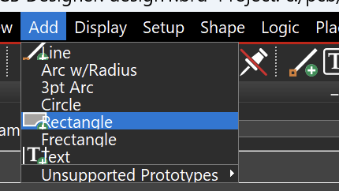

选择`Board Geometry`和`Design_Outline`，画出边框。
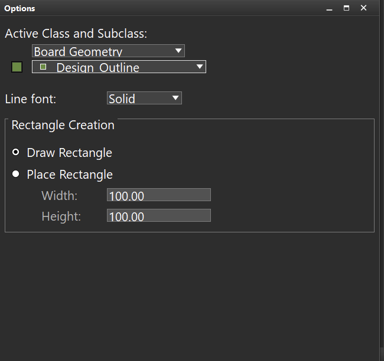
