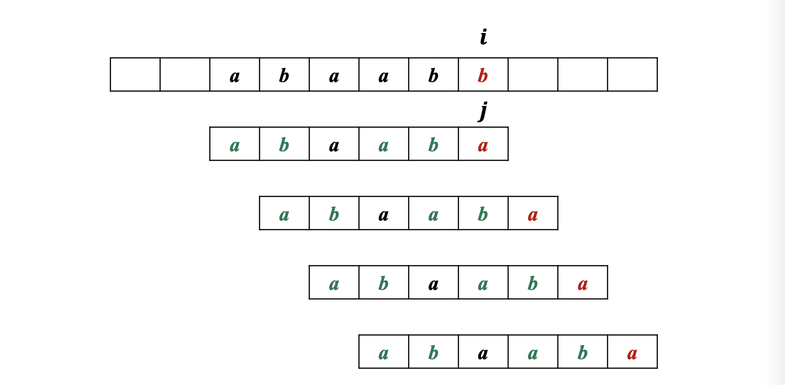
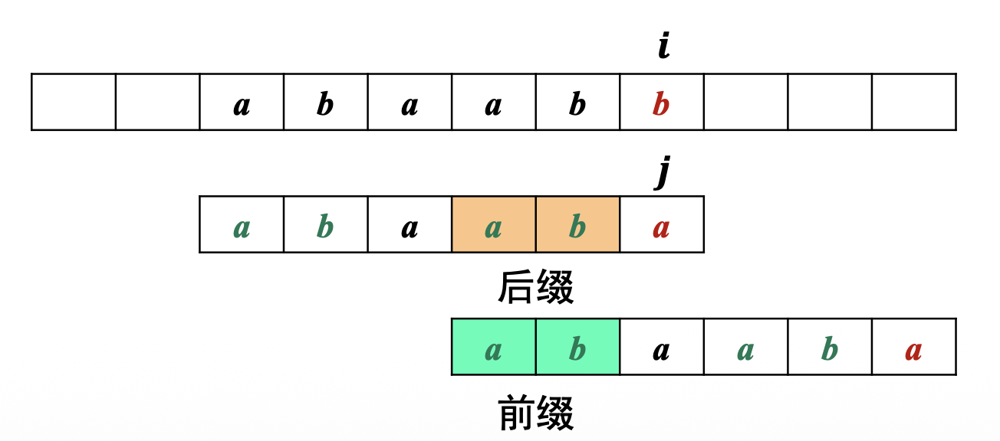
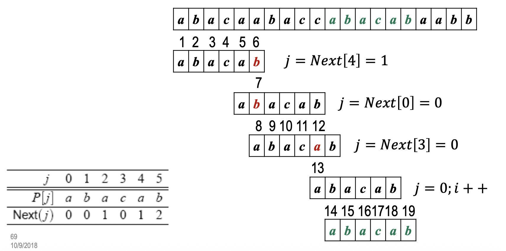
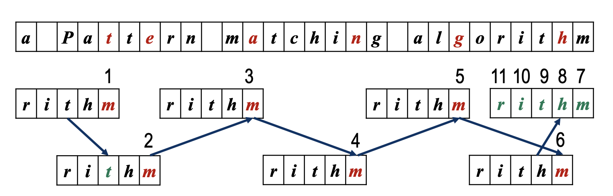
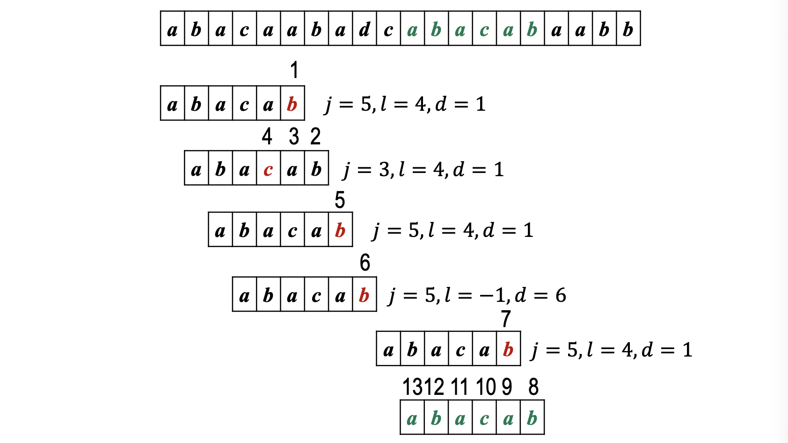
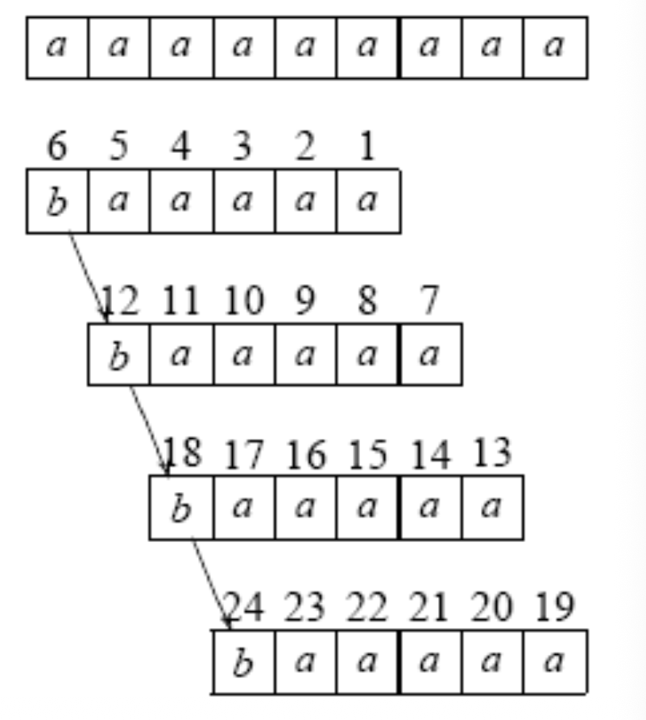

# 基础数据结构

### 二元关系与抽象数据类型

二元关系是描述数据之间关系的数学工具。它利用集合论中的符号体系，将各种数据集中数据元素之间的关系用集合的语言精确描述出来。

**集合的笛卡尔积**：给定两个集合 A 和 B，它们的笛卡尔积记作 A × B，定义为所有有序对 (a, b) 的集合，其中 a ∈ A 且 b ∈ B。形式化表示为：

$$
A \times B = \{(a, b) \mid a \in A, b \in B\}
$$

**二元关系**：在集合 $A$ 和 $B$ 上的二元关系 $R$ 是 $A \times B$ 的子集。换句话说，$R$ 是由 $A$ 和 $B$ 中元素组成的有序对的集合。

**二元关系的性质**：设 $R\subseteq M\times M$。常见性质为：

1. 自反性：$\forall a\in M,(a,a)\in R$；
2. 反自反性：$\forall a\in M,(a,a)\notin R$；
3. 对称性：$\forall a,b\in M,(a,b)\in R\Rightarrow(b,a)\in R$；
4. 传递性：$\forall a,b,c\in M,(a,b),(b,c)\in R\Rightarrow(a,c)\in R$；
5. 反对称性：$\forall a,b\in M,(a,b),(b,a)\in R\Rightarrow a=b$。

**等价关系**：满足自反性、对称性和传递性($=$)

**偏序关系**：满足自反性、反对称性和传递性($\leq$)

**拟序关系**：课件沿用“反自反、反对称、传递”的定义，以 $<$ 为例。现代教材中的 quasi-order 常指“自反且传递”，课件这里实际更接近严格偏序，阅读其他资料时要留意术语差异。

**全序关系**：$R$ 是偏序关系，并且对任意 $a,b\in M$，都有 $aRb$ 或 $bRa$。

### 数据的存储结构

数据与算法都不依赖计算机存在，计算机的出现为数据的处理和算法的实现提供了目前为止最好的平台和工具。数据的存储结构是指数据在计算机中的组织方式。

**顺序存储**：数据元素在存储器中的相对位置表示元素间的逻辑关系；数据元素的存储相对位置和元素间的逻辑关系是一致的。

**链式存储**：通过元素存储地址的附加指针来表示元素之间的逻辑关系。数据元素的存储相对位置和元素间的逻辑关系没有必然联系，数据元素之间的逻辑关系靠附加指针来维护

不同的数据逻辑结构，在计算机中都可以采用顺序存储或者链式存储，这两种存储方式对数据结构的设计和程序的实现会带来很大的影响，各有优缺点。

### 数据类型

数据类型是一个值的集合以及定义在该集合上的一组操作。ADT 进一步只规定逻辑模型与接口，不暴露具体的存储方式和实现细节。

**抽象数据类型（ADT）**：是指一个数学模型以及定义在此数学模型上的一组操作。 ==数据抽象== 描述实体的本质，功能及外部的用户接口； ==数据封装== 将实体的外部特性和内部实现细节分离，隐藏内部实现细节，使用和实现分离。

**抽象数据类型的基本操作**包括：

1. 构造型操作
1. 销毁型操作
1. 引用型操作
1. 加工型操作
1. 遍历

### 线性表

一种“有序”结构，即在数据元素的非空有限集合中存在唯一的“第一个”和“最后一个”元素，分别没有前驱和后继。除首元素外，每个元素都有唯一的直接前驱；除尾元素外，每个元素都有唯一的直接后继。


线性表中元素的个数为线性表的长度。

线性表中的元素可以是各种各样的，如整型、浮点型、字符型，也可以是用户自己定义的数据类型，但同一线性表中的元素必定具有相同特性。

采用顺序存储的线性表可以{==按下标随机访问==}，但插入和删除往往要移动大量元素；链式存储并不具备随机访问能力。

### 链表

链表是线性表的链式存储。逻辑上相邻的数据元素在**存储地址**上不必相邻，依托附加指针连接起来。每个数据元素包含数据和指针。


#### 单向链表

=== "链表节点定义"

    ```cpp linenums="1"
    typedef struct node {
        int data;
        struct node *next;
    } NODE;
    ```

=== "ADT实现"

    ```cpp linenums="1"
    class LinkList{
        private:
            NODE *head; //单向链表的头指针
        public:
            LinkList() {head = NULL;} //构造单向链表
            ~LinkList(); //销毁单向链表
            bool ClearList(); //清空单向链表
            bool IsEmpty() {return head == NULL;} //判断单向链表表长是否为0
            int Length(); //求单向链表的表长
            bool GetElem(int i, int *e) ; //取单向链表的元素
            int LocateElem(int e); //定位链表中的元素位置
            bool PriorElem(int cur_e, int *pre_e); //取上一个元素
            bool NextElem(int cur_e, int *next_e); //取下一个元素
            bool Insert(int i, int e); //向单向链表中插入元素
            bool Delete(int i, int &e); //删除单向链表中的元素
            bool Traverse(bool (*visit)(int e)); //遍历单向链表
    };
    ```

**插入操作**


=== "核心部分"
    ```cpp
    s->next = p->next;
    p->next = s;
    ```

=== "完整实现"
    ```cpp linenums="1" hl_lines="3 4 5 6 7 8 9"
    bool LinkList::Insert(int i, int e){
        NODE *p = head, *s; int j = 0;
        if(i < 0) return false;
        if(i == 0) { //在表头插入（空表也适用）
            s = new NODE; //为新结点分配内存
            s->data = e; //给新结点赋值
            s->next = p; //插入结点
            head = s;
            return true;
        }
        while(p && j < i - 1){
            p = p->next; 
            j++;
        } //判断不是空表并定位插入位置
        if(!p ) return false; //找不到位置，返回错误
        s = new NODE; //为新结点分配内存
        s->data = e; //插入值赋给新元素
        s->next = p->next; p->next = s; //插入结点
        return true;
    }
    ```
**删除节点**


=== "核心代码"
    ```cpp
    p->next = q->next;
    delete q; //注意销毁
    ```

=== "完整实现"
    ```cpp linenums="1"
    bool LinkList::Delete(int i, int &e){
        NODE *p = head, *q; int j = 0;
        if(i < 0 || !p) return false; //位序非法或空表
        if(i == 0){ //当前头结点删除
            head = head->next; //新的头结点
            e = p->data; delete p; p = NULL; //取出元素，并删除结点
            return true;
        }
        while(p->next && j < i - 1){p = p->next; j++;} //定位删除位置
        if(!(p->next) || j > i-1) return false; //未找到位置，返回错误
        q = p->next; //取出待删除结点
        p->next = q->next; //删除
        e = q->data; delete q; q = NULL; //取出元素，并销毁结点
        return true;
    } 
    ```

还可以额外引入不保存表中数据的哨兵头结点，`head` 始终指向它，空表也保留这个哨兵。这样首部和中间位置的插入、删除可以使用同一套链接操作。

| 基本操作 | 功能 | 顺序表 | 单链表 |
|---|---|---|---|
| `InitList(&L);` | 构造 | $O(1)$ | $O(1)$ |
| `DestroyList(&L);` | 销毁 | $O(1)$ | $O(n)$ |
| `IsEmpty(L);` | 判空 | $O(1)$ | $O(1)$ |
| `ListLength(L);` | 求长度 | $O(1)$ | $O(n)$ |
| `GetElem(L,i,&e);` | 按位序取元素 | $O(1)$ | $O(n)$ |
| `LocateElem(L,e,compare());` | 定位元素 | $O(n)$ | $O(n)$ |
| `PriorElem(L,cur_e,&pre_e);` | 求前驱 | $O(n)$ | $O(n)$ |
| `NextElem(L,cur_e,&next_e);` | 求后继 | $O(n)$ | $O(n)$ |
| `ListInsert(&L,i,e)` | 按位序插入 | $O(n)$ | $O(n)$ |
| `ListDelete(&L,i,&e)` | 按位序删除 | $O(n)$ | $O(n)$ |
| `ClearList(&L);` | 清空 | $O(1)$ | $O(n)$ |
| `ListTraverse(L,visit());` | 遍历 | $O(n)$ | $O(n)$ |

单向链表的特点：

- 总是从前驱结点指向后继结点，访问后继结点容易，前驱结点难
- 获取表尾指针需要遍历整个链表，获得表长信息也是
- 插入或者删除元素时，需要在链表中依序寻找操作位置
- 元素的“位序”概念淡化，结点的“位置”概念强化

改进方法：

- 增加“表长”、“表尾指针”和“当前位置的指针”三个数据域

#### 双向循环链表


```cpp linenums="1"
typedef struct node {
    int data;
    struct node *next;
    struct node *prev;
} NODE;
```

=== "插入操作"
    

    ```cpp
    s->prev = p->prev;
    p->prev->next = s;
    s->next = p;
    p->prev = s;
    ```

=== "删除操作"

    

    ```cpp
    p->prev->next = p->next;
    p->next->prev = p->prev;
    delete p;
    ```

#### 顺序表与链表的取舍

顺序表把元素连续存放。若每个元素占 $l$ 个存储单元，首元素地址为 $\operatorname{LOC}(a_0)$，则

$$
\operatorname{LOC}(a_i)=\operatorname{LOC}(a_0)+i\,l,
$$

所以按下标访问是 $O(1)$。代价是插入和删除要搬动后续元素：在各位置等可能时，插入平均移动 $n/2$ 个元素，删除平均移动 $(n-1)/2$ 个元素。

链表把这部分代价换成了指针和定位开销。已知结点指针时，插入、删除本身是 $O(1)$；若只给位序，仍须先花 $O(n)$ 找到位置。选择时可以记住一句话：**顺序表适合频繁随机访问，链表适合位置已知时的频繁增删。**

两个递增表可以用双指针保序归并：比较当前元素，把较小者接入结果表，某一表耗尽后接上另一表的余项。若表长分别为 $m,n$，时间为 $O(m+n)$。

#### 约瑟夫问题

$n$ 个人围成一圈，从指定位置起每次数到 $m$ 的人退出，再从下一人继续。循环链表能直接模拟这个过程；若只关心最后留下者，则可用递推避免逐个删除。采用从 $0$ 开始的编号时

$$
f(1)=0,\qquad f(k)=\bigl(f(k-1)+m\bigr)\bmod k,
$$

最后换回从 $1$ 开始的编号，答案为 $f(n)+1$。模拟法直观，递推法只需 $O(n)$ 时间和 $O(1)$ 额外空间。

### 栈和队列

#### 栈


栈是一种线性结构，只允许在一端进行插入
和删除操作，数据元素的个数就是栈
的长度。

若所有元素先依次入栈、再一次性全部出栈，出栈序列才与入栈序列逆序。允许入栈、出栈交错时，合法出栈序列并不唯一，后文的栈混洗正是研究这一问题。

- 先进后出(FILO): First In Last Out
- 后进先出(LIFO): Last In First Out

**顺序栈**：基于顺序存储实现


```cpp
class STACK{
    private:
        Item *m_arStack;
        int m_iDepth;
        int m_iCapacity;
    public:
        STACK(int maxLen)
            : m_arStack(new Item[maxLen]), m_iDepth(0), m_iCapacity(maxLen) {}
        ~STACK() { delete[] m_arStack; }
        bool IsEmpty() const { return m_iDepth == 0; }
        void ClearStack() { m_iDepth = 0; }
        int StackLen() const { return m_iDepth; }
        bool push(const Item &e) {
            if (m_iDepth == m_iCapacity) return false;
            m_arStack[m_iDepth++] = e;
            return true;
        }
        bool pop(Item &e) {
            if (IsEmpty()) return false;
            e = m_arStack[--m_iDepth];
            return true;
        }
        bool getTop(Item &e) const {
            if (IsEmpty()) return false;
            e = m_arStack[m_iDepth - 1];
            return true;
        }
}; 
```

- 进栈和出栈的时间复杂度都是O(1)
- 如果栈元素是简单数据类型，则构造和销毁函数也是O(1)时间的
- {==空间利用效率低==}

**链式栈**：基于链表存储。


链式栈一般选择链表头为栈顶、链表尾为栈底。
=== "节点实现"
    ```cpp
    struct node{
        Item item;
        node* next;
        node(Item x, node* t) {item = x; next = t; }
    };
    typedef struct node* link;
    ```

=== "数据类实现"
    ```cpp
    class STACK {
        private:
            link m_head;
            int m_length;
        public:
            STACK() : m_head(NULL), m_length(0) {}
            ~STACK() { ClearStack(); }

            bool IsEmpty() const { return m_head == NULL; }
            int StackLength() const { return m_length; }

            void push(const Item& e) {
                m_head = new node(e, m_head);
                ++m_length;
            }

            bool pop(Item& e) {
                if (IsEmpty()) return false;
                link old = m_head;
                e = old->item;
                m_head = old->next;
                delete old;
                --m_length;
                return true;
            }

            bool getTop(Item& e) const {
                if (IsEmpty()) return false;
                e = m_head->item;
                return true;
            }

            void ClearStack() {
                Item ignored;
                while (pop(ignored)) {}
            }
    };
    ```

|  | 顺序栈 | 链式栈 |
|---|---|---|
| 物理存储方式 | 地址连续 | 地址任意 |
| 栈的规模 | 初始化栈时确定 | 不需要事先确定 |
| 栈溢出 | 存在溢出可能（要处理） | 一般不会溢出 |
| 操作时间复杂度 | 进栈/出栈：$O(1)$<br>清空栈：$O(1)$ | 进栈/出栈：$O(1)$<br>销毁和清空栈：$O(n)$ |
| 栈占用空间 | 初始化栈确定的栈的规模，空间利用效率较低 | 栈中实际元素的数目，空间利用效率很高 |

**栈的应用**

- 括号匹配，表达式求值，迷宫求解（回溯法）
- Graham扫描法：计算点集的凸包
- 浏览器中的“前进”和“后退”
- 函数调用，递归
- 系统栈，内存管理

??? tip "Graham扫描法"

    先选纵坐标最小（并以横坐标打破平局）的点 $p_0$，再把其余点按相对 $p_0$ 的极角排序。扫描时用栈保存当前凸包；新点使栈顶两条边右转时，弹出中间点，直到重新成为左转，再压入新点。

    三点 $A,B,C$ 的转向由叉积判断：

    $$
    (B-A)\times(C-A)
    =
    (x_B-x_A)(y_C-y_A)-(y_B-y_A)(x_C-x_A)
    $$

    正值为左转，负值为右转，零表示共线。主要开销是极角排序，所以总时间为 $O(n\log n)$。

    ```text
    GrahamScan(points):
        p0 = 最低且最靠左的点
        按相对 p0 的极角排序其余点
        stack = [p0, points[1]]
        for p in points[2..]:
            while stack 至少有两点且与 p 构成右转:
                stack.pop()
            stack.push(p)
        return stack
    ```

**括号匹配**：逢左括弧进栈，逢右括弧，将对应的左括弧出栈；若无对应的左括弧，则为语法错误，字符串结束，检查栈是否为空，得到括号配对检查结果。

**算术表达式**：包括中缀、前缀、后缀。栈用于后缀表达式求值（逆波兰式）。自左向右扫描后缀表达式，然后：

- 遇到操作数进栈
- 遇到操作符，两个操作数出栈进行计算，结果进栈
- 栈顶元素就是后缀表达式求值的结果

进制转换也利用了同样的“逆序”性质。反复计算 $N\bmod d$ 并把余数入栈，再逆序弹出即可得到 $d$ 进制表示。例如

$$
461_{10}=715_8.
$$

后缀求值时，减法和除法的操作数次序不能写反：先弹出的是右操作数 `rhs`，后弹出的是左操作数 `lhs`，计算 `lhs op rhs`。多位十进制数要在读到分隔符前按 `value = 10*value + digit` 累积。扫描结束时栈中应恰好剩一个数，否则表达式缺少或多出操作数。


#### 队列

队列是限定在表的一端进行插入，而在另一端进行删除的**线性结构**

在队列中，允许插入的一端称为队尾（rear），允许删除的一端称为队头（front），插入操作称为入队（enqueue），删除操作称为出队（dequeue）。

循环队列的判空判满：

1. 设置一个空位
1. 设置一个标志(出队还是入队造成`front==rear`)
1. 设置队列长度变量

若采用“空出一个位置”的方案，容量为 $M$ 的数组最多保存 $M-1$ 个元素：

$$
\text{empty}:\ front=rear,
\qquad
\text{full}:\ (rear+1)\bmod M=front,
$$

$$
\text{length}=(rear-front+M)\bmod M.
$$

入队时把元素写到 `rear` 后再令 `rear=(rear+1)%M`；出队时读出 `front` 后再令 `front=(front+1)%M`。两种操作都是 $O(1)$。

链式队列通常同时保存头、尾指针。入队把新结点接到尾部，出队删除头结点；最后一个元素出队后，必须让头、尾指针同时回到空状态。链式队列按需分配空间，顺序循环队列则少了结点指针和频繁分配的开销。

队列的应用：构建缓冲区，处理不同设备之间的速度差异。

缓冲区本质上把生产者与消费者解耦。键盘输入、打印任务、网络分组和操作系统任务调度都可以按到达顺序排队；图的广度优先遍历也依靠队列保存“已经发现但还没展开”的顶点。


### 串

串是有限字符序列，也是元素类型限定为字符的线性表。空串长度为 $0$，而只含空格的串并不是空串；字符 `'a'` 与长度为 $1$ 的串 `"a"` 也不是同一类型。子串必须由主串中一段连续字符组成，串相等要求长度相同且对应字符逐一相等。

String ADT 的基本操作包括赋值、判空、清空、比较、求长度、复制、连接、取子串、定位、替换、插入和删除。赋值、复制、比较、求长、连接、取子串可以作为一组基础操作，其余操作由它们组合得到。

串的存储方式与一般线性表的存储方式类似。

**定长顺序存储**：顺序存储在一个指定大小的存储区域，预先分配了固定大小的存储区域。串的序列长度超过指定区域大小时，必须截断。

**变长顺序存储**：根据实际长度动态分配或扩充存储区域，因此不必像定长存储那样截断，也能减少空闲空间。若沿用 C 风格字符串，还会额外用终结符（如 `\0`）标记串尾。

**链式存储（块链存储）**：与一般的单链表类似，一个结点可以存储多个字符，通常把一个结点存储的字符个数称为结点大小。

#### 串的模式匹配（String Matching）

已知目标串T和模式串P，模式匹配就是要在目标串T中找到一个与模式串P相等的子串（子串定位）。如果能够找到，匹配成功，返回模式串P在目标串T中位置；否则匹配失败。

**蛮力法**：依次把 $T$ 中的每个可行位置当作起点，与模式串 $P$ 从左到右比较。某一起点完全匹配便返回位置；所有 $0\le i\le n-m$ 的起点都失败后返回未找到。

```cpp
int BruteForceMatch(char *T, char *P){
    int n = strlen(T);          //求目标串T的长度
    int m = strlen(P);          //求模式串P的长度
    int i, j;
    for(i=0; i <= n-m; i ++){   //逐个试探目标串的位置
        j = 0;
        while(j < m && T[i+j] == P[j]) j++; 
        if(j == m)              //与模式串比较
            return i;           //在i处匹配成功

    }
    return -1;                  //匹配失败
}
```

假设目标串T的长度为n，模式串P的长度为m，蛮力法最坏情况
下的时间复杂度为$O(n\times m)$。

!!! tip "Brute-Force 最坏情况"
    形如：
    ```cpp
        T = "aaaaaaa...aaaah";
        P = "aaah"
    ```
    这种情况很可能出现在数字图像信号或DNA序列中，一般不会出现在自然语言文本。

蛮力法简单粗暴但效率低，原因是{==并没有考虑在比较过程中得到的信息==}。

**KMP 算法**复用失配前已经匹配的字符，不让正文指针回退。



- 步骤 1：预处理模式串 $P$，得到前缀函数；
- 步骤 2：失配时，把已经匹配部分的最长真后缀与同样的模式前缀对齐。



本笔记采用的 `N[j]` 表示 $P[0..j]$ 的最长相等真前缀、真后缀长度。对 `abacab`，结果是 `[0,0,1,0,1,2]`。

```c++
void BuildPrefix(const char *P, int N[]) {
    int m = strlen(P);
    if (m == 0) return;
    N[0] = 0;
    for (int i = 1, j = 0; i < m; ++i) {
        while (j > 0 && P[i] != P[j]) j = N[j - 1];
        if (P[i] == P[j]) ++j;
        N[i] = j;
    }
}
```

```cpp
int KMPMatch(const char *T, const char *P) {
    int n = strlen(T), m = strlen(P);
    if (m == 0) return 0;
    std::vector<int> N(m);
    BuildPrefix(P, N.data());
    for (int i = 0, j = 0; i < n; ++i) {
        while (j > 0 && T[i] != P[j]) j = N[j - 1];
        if (T[i] == P[j]) ++j;
        if (j == m) {
            return i - m + 1;
        }
    }
    return -1;
}
```



前缀表建立为 $O(m)$，匹配为 $O(n)$，总时间 $O(m+n)$，额外空间 $O(m)$。不同教材中的 `next`、`failure`、`LPS` 数组可能采用不同下标定义，建表和回退语句必须成套使用。


**Horspool 与坏字符启发式**



匹配从模式串右端向左进行。先根据 $P$ 计算字母表的 Last-Occurrence 函数 $L:\Sigma\rightarrow\mathbb Z$：

$$
L(\xi)=
\begin{cases}
\max\{i:P[i]=\xi\}, & \xi\in P,\\
-1, & \xi\notin P.
\end{cases}
$$

沿用课件的下标约定，若在模式位置 $j$ 与正文字符 $c$ 失配，令 $l=L(c)$，则安全移动距离为

$$
d=
\begin{cases}
j-l,&l<j,\\
1,&l\ge j.
\end{cases}
$$

字符不在模式中时 $l=-1$，可直接移动 $j+1$ 位。预处理需 $O(m+|\Sigma|)$，最坏匹配仍为 $O(nm)$，但自然语言文本中经常能一次跳过多位。

!!! note
    课件把上述 Last-Occurrence 坏字符规则放在 Horspool 名下。标准 Horspool 常按“与模式末位对齐的正文字符”查 shift 表，并通常只预处理模式的前 $m-1$ 位；两种写法的下标和移动公式不要混用。

    完整 Boyer-Moore 还使用好后缀规则：若已经匹配的后缀在模式中另有一次出现，就把两者对齐；否则找这个后缀的最长后缀，使它同时也是模式前缀并作对齐；若仍不存在，就把已匹配部分整体跨过。实际移动取坏字符与好后缀两种安全位移中的较大者。



!!! tip "Horspool 最坏情况"
    例如

    ```cpp
    T = "aaaaaaaaa";
    P = "baaa";
    ```

    每轮都比较到模式首位才失配，之后又只能移动一位，因而总复杂度为 $O(nm+|\Sigma|)$。

    


### 树与二叉树

#### 树的定义与性质

树是由一对多关系定义的层次结构。空树不含结点；非空树有且只有一个根，其余结点被划分为若干互不相交的子树。除根外，每个结点恰有一个直接前驱，因此从根到任一结点的路径唯一，树中也不会出现回路。

常用术语如下：

- 结点的**度**是它的子树数，树的度是所有结点度数的最大值；
- 度为 $0$ 的结点叫叶子，其余结点叫分支结点；
- 同一双亲的孩子互为兄弟；从根到某结点路径上的结点是它的祖先；
- 根在第 $1$ 层，树的深度（高度）是最大层数；
- 删去一棵树的根以后，各子树构成森林。

若树有 $n$ 个结点，则边数为 $n-1$，也就是

$$
n=1+\sum_{v\in V}\deg(v).
$$

对非空且度不超过 $k\ge2$ 的树，第 $i$ 层至多有 $k^{i-1}$ 个结点；深度为 $h$ 时至多有

$$
1+k+\cdots+k^{h-1}=\frac{k^h-1}{k-1}
$$

个结点。因此 $n$ 个结点的 $k$ 叉树最小深度为

$$
h_{\min}=\left\lceil\log_k\bigl(n(k-1)+1\bigr)\right\rceil.
$$

一般树可以采用“孩子链表”存储：每个结点保存数据和一个孩子链表，既不浪费不存在的分支，也保留了孩子的次序。

#### 二叉树

二叉树的左右子树有次序，不能随意互换；即使只有一个孩子，也要区分左孩子和右孩子。对非空二叉树，设度为 $0,1,2$ 的结点数分别为 $n_0,n_1,n_2$，由边数的两种计数方式可得

$$
n_0=n_2+1.
$$

其余常用性质：

- 第 $i$ 层至多有 $2^{i-1}$ 个结点；
- 深度为 $h$ 的二叉树至多有 $2^h-1$ 个结点，达到上界时称为满二叉树；
- 完全二叉树除最后一层外均已填满，最后一层的结点从左向右连续；
- $n$ 个结点的完全二叉树深度为 $\lfloor\log_2 n\rfloor+1$。

完全二叉树适合顺序存储。若按 $0,1,\ldots,n-1$ 编号，则非根结点 $i>0$ 的父结点，以及任一结点的孩子位置为

$$
\operatorname{parent}(i)=\left\lfloor\frac{i-1}{2}\right\rfloor,
\quad
\operatorname{left}(i)=2i+1,
\quad
\operatorname{right}(i)=2i+2.
$$

孩子下标只有小于 $n$ 时才有效。一般二叉树若也按满二叉树留空位，单支树会浪费指数级空间，因此通常改用二叉链表：

```cpp
struct TreeNode {
    ElemType data;
    TreeNode *left;
    TreeNode *right;
};
```

若操作经常要向上访问，可再增加 `parent` 指针，形成三叉链表。

#### 二叉树遍历

三种深度优先遍历只差访问根的位置：

```text
Preorder(T):                 Inorder(T):
    if T is null: return         if T is null: return
    visit(T)                     Inorder(T.left)
    Preorder(T.left)             visit(T)
    Preorder(T.right)            Inorder(T.right)

Postorder(T):
    if T is null: return
    Postorder(T.left)
    Postorder(T.right)
    visit(T)
```

| 次序 | 访问顺序 | 典型用途 |
|---|---|---|
| 前序 | 根、左、右 | 复制树，表达式的前缀形式 |
| 中序 | 左、根、右 | 二叉搜索树按关键字递增输出，中缀表达式 |
| 后序 | 左、右、根 | 删除整棵树，计算目录大小，后缀表达式 |
| 层序 | 逐层从左到右 | 依靠队列做广度优先访问 |

所有遍历都访问每个结点一次，时间为 $O(n)$。递归实现使用系统调用栈；非递归前序、中序用显式栈即可，后序还要记录右子树是否已经处理。层序遍历则把根入队，每次出队访问并将其非空孩子依次入队。

树高和清空操作正好体现了遍历次序：

$$
H(T)=
\begin{cases}
0,&T=\varnothing,\\
1+\max\{H(T_L),H(T_R)\},&T\ne\varnothing.
\end{cases}
$$

清空时必须先清空左右子树再释放根，即采用后序。建立二叉树时，**前序加中序**或**后序加中序**可以唯一确定一棵无重复结点的二叉树；仅有前序和后序通常不能唯一确定。

表达式树中，叶子是操作数，内部结点是运算符。对它作前序、中序、后序遍历，分别得到前缀、中缀和后缀表达式；中序输出时需要适当加括号，才能保留原运算次序。

#### 二叉搜索树

二叉搜索树（BST）满足：任一结点左子树中的关键字都小于它，右子树中的关键字都大于它，两棵子树也分别是 BST。若允许重复关键字，必须固定策略，例如统一放到右子树，或在结点中保存出现次数。查找和插入都沿一条根到叶的路径完成：

```text
Search(T, key):
    while T is not null and T.key != key:
        if key < T.key: T = T.left
        else:           T = T.right
    return T
```

插入时沿同样路径找到空指针，再把新结点接上。时间取决于树高 $h$，均为 $O(h)$；树较平衡时约为 $O(\log n)$，若关键字按已有次序插入而退化成单链，最坏为 $O(n)$。中序遍历 BST 可得到递增序列。

#### 霍夫曼树与编码

设叶子 $i$ 的权值为 $w_i$、从根到该叶的边数为 $l_i$，树的带权路径长度为

$$
\operatorname{WPL}=\sum_i w_i l_i.
$$

在给定叶子权值的所有二叉树中，使 WPL 最小的树称为霍夫曼树。构造过程每次取当前权值最小的两棵树合并，新根权值为两者之和，再把新树放回集合，直到只剩一棵树。用最小堆维护候选树时，总时间为 $O(n\log n)$。

给左边标 `0`、右边标 `1`，从根到每个叶子的路径就是该字符的编码。字符只出现在叶子上，因此任何码字都不是另一码字的前缀，可以从左到右无歧义解码。高频字符路径短，平均码长达到这组频率下的最优值。

霍夫曼编码的实际代价也要算进去：编码前要统计频率，解码端还要拿到频率表或编码树；若数据很短，附加信息可能抵消压缩收益。频率固定的静态编码通常需要扫描两遍数据。

#### 优先级队列与堆

普通队列按到达顺序出队，优先级队列每次取优先级最高的元素。不同实现的代价不同：

| 实现 | 插入 | 查看最高优先级 | 删除最高优先级 | 修改优先级 |
|---|---:|---:|---:|---:|
| 无序顺序表/链表 | $O(1)$ | $O(n)$ | $O(n)$ | $O(1)$ |
| 有序顺序表（高优先级在表头） | $O(n)$ | $O(1)$ | $O(n)$ | $O(n)$ |
| 有序链表 | $O(n)$ | $O(1)$ | $O(1)$ | $O(n)$ |
| 二叉堆 | $O(\log n)$ | $O(1)$ | $O(\log n)$ | $O(\log n)$ |

“修改优先级”的复杂度默认已经拿到数组下标或结点句柄；若接口只给关键字，定位元素本身仍可能要 $O(n)$。堆中优先级增大时向上堆化，减小时向下堆化。

二叉堆是满足堆序的完全二叉树。最大堆中每个结点都不小于孩子，根因而是最大值；最小堆反之。它采用数组存储，父子下标与完全二叉树相同。

- **向上堆化**：新元素放在数组末尾，只要它比父结点更符合堆序，就与父结点交换；
- **向下堆化**：根被修改或移走后，每次与更合适的孩子交换，直到堆序恢复；
- **插入**：尾部加入后向上堆化，$O(\log n)$；
- **删除堆顶**：末元素补到根，缩短数组，再向下堆化，$O(\log n)$。

逐个插入建堆要 $O(n\log n)$。更好的办法是把数组先看作完全二叉树，再从最后一个非叶结点 $\lfloor n/2\rfloor-1$ 起逆序向下堆化。底层结点数量多、移动距离短，总工作量为 $O(n)$。

堆适合“反复取极值”，但只保证父子间的偏序，查找任意关键字仍可能要 $O(n)$。

### 图

#### 基本概念与存储

图记作 $G=(V,E)$。$V$ 是非空顶点集，$E$ 是边集；有向边写作 $\langle u,v\rangle$，无向边写作 $(u,v)$。边还可以带权。常用概念包括：

- 无向图中顶点的度是关联边数，且 $\sum_v\deg(v)=2|E|$；
- 有向图中分入度、出度，并有 $\sum_v\deg^-(v)=\sum_v\deg^+(v)=|E|$；
- 顶点序列中每对相邻顶点之间都有边时，该序列构成路径；首尾相同的是回路，不重复顶点的是简单路径；
- 无向图任意两点可达时称为连通图，极大连通子图是连通分量；
- 有向图任意两点互相可达时称为强连通图；
- 遍历每条边一次的是欧拉路径，遍历每个顶点一次的是 Hamilton 路径，两者不可混淆。

含 $n$ 个顶点的简单无向完全图有 $n(n-1)/2$ 条边，有向完全图有 $n(n-1)$ 条弧；简单无向图的可能边各自取“有/无”，所以共有 $2^{n(n-1)/2}$ 种。握手定理还推出奇度顶点数必为偶数，例如一组人的“相识人数”之和不可能是奇数。

忽略孤立点后，连通无向图存在欧拉回路，当且仅当所有顶点度数都是偶数；存在起点、终点不同的欧拉路径，当且仅当恰有两个奇度顶点。柯尼斯堡七桥图有四个奇度顶点，所以无法一次走遍每座桥。欧拉路径允许重复经过顶点，限制的是每条边恰好一次。

**邻接矩阵**用 $n\times n$ 数组记录边。无向图的矩阵对称，顶点 $i$ 的度可由第 $i$ 行求和；带权图通常用 $\infty$ 表示无边。它占 $O(|V|^2)$ 空间，判断一条边是否存在只需 $O(1)$，适合稠密图。

**邻接表**为每个顶点保存邻接点链表，占 $O(|V|+|E|)$ 空间，适合稀疏图。无向边会在两个表中各出现一次；有向图的邻接表直接给出出边，若经常访问入边可另建逆邻接表。十字链表、邻接多重表等表示法是在复杂更新场景下对这些信息的进一步组织。

#### 深度与广度优先遍历

深度优先搜索（DFS）访问顶点后，沿一个尚未访问的邻接点继续深入，走不通时回退；递归调用栈天然保存回退路径。广度优先搜索（BFS）则把已发现顶点放入队列，按发现次序逐层展开。

```text
DFS(u):                         BFS(s):
    visited[u] = true               visited[s] = true
    visit(u)                        enqueue(s)
    for each v adjacent to u:       while queue not empty:
        if not visited[v]:              u = dequeue()
            DFS(v)                      visit(u)
                                        for each v adjacent to u:
                                            if not visited[v]:
                                                visited[v] = true
                                                enqueue(v)
```

标记应在“发现”顶点时设置，尤其 BFS 不能等到出队才标记，否则同一顶点可能重复入队。对非连通图，还要从每个未访问顶点重新开始一次搜索，得到 DFS/BFS 森林。

邻接表下，两种遍历都是 $O(|V|+|E|)$；邻接矩阵下需要逐行扫描，时间为 $O(|V|^2)$。用 DFS 找简单路径时，可以维护一张“当前路径”表，进入顶点时加入、回溯时删去末项。BFS 在无权图中按边数逐层推进；为每个首次发现的顶点记录前驱，搜索结束后便能从终点反向恢复最短路径。

#### 生成树与最小生成树

连通无向图的生成树包含全部 $|V|$ 个顶点和恰好 $|V|-1$ 条边；再加一条非树边必成环，少一条树边必不连通。带权图中总权值最小的生成树称为最小生成树（MST）。

**Prim 算法**维护已经纳入树的顶点集合 $S$。从任意顶点开始，每次选取一条跨越割 $(S,V-S)$ 的最小权边，把新顶点和该边加入树，直到 $S=V$。邻接矩阵的朴素实现为 $O(V^2)$；邻接表配二叉堆为 $O(E\log V)$。

**Kruskal 算法**先把边按权值递增排序，再依次考察：若一条边连接两个不同连通分量，就把它加入 MST 并合并分量；若会形成环则跳过。环检测由并查集完成，主要开销是排序，时间为 $O(E\log E)$。

两者都依赖割性质：对任意割，跨越该割的最轻边可以安全地进入某棵 MST。所有边权互异可保证 MST 唯一；出现相同权值并不必然意味着有多棵 MST。图不连通时，Kruskal 会自然得到最小生成森林；Prim 则要在每个尚未覆盖的连通分量重新启动。

#### 最短路径

无权图可直接用 BFS 求按边数计的最短路。带非负权的图可用 Dijkstra 算法：维护源点 $s$ 到各点的当前最短估计 $d[v]$，每次固定尚未确定且 $d$ 最小的顶点 $u$，再松弛它的出边

$$
d[v]\leftarrow\min\{d[v],\ d[u]+w(u,v)\}.
$$

一旦顶点被固定，其距离不再改变；这个结论依赖**边权非负**。数组实现为 $O(V^2)$，邻接表加最小堆为 $O((V+E)\log V)$。同时保存前驱 `prev[v]`，就能从终点反向恢复具体路径。

Floyd 算法求所有顶点对之间的最短距离。令 $D^{(k)}[i][j]$ 表示只允许编号不大于 $k$ 的顶点作为中间点时，$i$ 到 $j$ 的最短距离，则

$$
D^{(k)}[i][j]
=\min\left\{D^{(k-1)}[i][j],\
D^{(k-1)}[i][k]+D^{(k-1)}[k][j]\right\}.
$$

把 $k$ 放在最外层循环即可原地更新距离矩阵。时间为 $O(V^3)$、空间为 $O(V^2)$；再维护中间点或后继矩阵可以恢复路径。Floyd 可以处理负边，但若最终出现 $D[i][i]<0$，说明存在负权回路。只有能够到达该负环、并能从负环继续到达终点的点对，其最短距离才没有有限下界。

#### 桥、关节点与其他图问题

删去某条边后连通分量增加，这条边叫桥；删去某个顶点及其关联边后连通分量增加，该顶点叫关节点。对连通无向图而言，“没有桥”等价于删去任意一条边后仍连通，也称二边连通；“没有关节点”对应二顶点连通（重连通或双连通）。在至少含三个顶点的图中，二顶点连通还等价于任意两点之间存在两条内部顶点不相交的路径。桥和关节点反映网络中的单点故障位置，可在 DFS 树上根据发现时间与回边信息在线性时间求出。

课件最后还列出最大流和匹配，作为后续图算法方向。这些问题共享图的表示与遍历基础，但目标和求解方法不同。

### 栈混洗、Catalan 数与并查集

#### 栈混洗与 Catalan 数

固定入栈序列 $1,2,\ldots,n$，在任意时刻选择入栈或出栈，可能得到不同的出栈序列，这称为栈混洗。把入栈记为 `(`，出栈记为 `)`，合法操作序列满足：任一前缀中的出栈数不超过入栈数，并且最后两者相等。因此它与合式括号序列、有 $n$ 个结点的有序二叉树形状等对象一一对应。

长度为 $2n$ 的合法序列数是第 $n$ 个 Catalan 数

$$
C_n=\frac{1}{n+1}\binom{2n}{n}
=\binom{2n}{n}-\binom{2n}{n+1},
$$

并满足

$$
C_0=1,\qquad
C_{n+1}=\sum_{i=0}^{n}C_iC_{n-i}
=\frac{2(2n+1)}{n+2}C_n.
$$

前几项为 $1,1,2,5,14,42,\ldots$。递推式的含义是：按根划分一棵有 $n+1$ 个结点的有序二叉树，若左子树有 $i$ 个结点，右子树就有 $n-i$ 个结点，两边方案数相乘后再对 $i$ 求和。

由 Stirling 公式还能得到

$$
C_n\sim\frac{4^n}{\sqrt{\pi}\,n^{3/2}}.
$$

例如 $C_6=132$，$C_{10}=16796$。这说明合法栈混洗虽比全部 $n!$ 个排列少，数量仍增长很快。

#### 并查集

并查集维护一组互不相交的集合，只提供三类核心操作：

- `MakeSet(x)`：建立只含 $x$ 的集合；
- `Find(x)`：返回 $x$ 所属集合的代表；
- `Union(x,y)`：合并两个代表不同的集合。

直接用标志数组时，`Find` 是 $O(1)$，但 `Union` 要扫描并改写一个集合中的全部标志。若每次只给较小集合改名，一个元素每次被改名后，所在集合的大小至少翻倍，所以每个元素至多改名 $\lfloor\log_2 n\rfloor$ 次；从 $n$ 个单元素集合合并到一个集合，总改名次数为 $O(n\log n)$。树形实现令每个结点指向父结点，根作为代表。未经优化时，反复把高树接到低树下仍会退化成链。

两项优化要一起使用：

1. **按秩/按大小合并**：总把较矮或较小的树接到较大树的根下；
2. **路径压缩**：执行 `Find` 时，把访问路径上的结点直接改指向根。

```text
Find(x):
    if parent[x] != x:
        parent[x] = Find(parent[x])
    return parent[x]

Union(x, y):
    rx = Find(x); ry = Find(y)
    if rx == ry: return
    if rank[rx] < rank[ry]: swap(rx, ry)
    parent[ry] = rx
    if rank[rx] == rank[ry]: rank[rx]++
```

两种优化同时采用时，$m$ 次操作的总时间为 $O(m\alpha(n))$，$\alpha$ 是增长极慢的反 Ackermann 函数，实践中几乎可看作常数。Kruskal 的环检测、动态连通性和等价类合并都是典型应用。
