# 手搓电磁炮概论

!!! note "发布说明"
    本文已在公众号"无限之声"发表，作者江玮陶。
    
!!! warning "免责声明"
    本文内容具有一定危险性，请同学在实践尝试前学习相应专业知识，并不要超出学习研究的用途，更不能用于从事违反《中华人民共和国刑法》等的行为。充分预估风险，采取防范措施，杜绝盲目冒进，是任何科学技术实验都应该遵守的原则。内容仅适用于科学实验，严禁用于不正当用途，所有读者必须独立承担可能的后果。

!!! note "先修要求"
    **《电子电路与系统基础》（1）**(或类似课程)

## 引言

[硬设决赛](https://mp.weixin.qq.com/s/2FpoenbarvH-pFYUdGP3Xw)结束后，想必很多同学对出场的两台电磁炮印象十分深刻，并对其原理十分感兴趣呢？又或者是看了《某科学的超电磁炮》后，想用所学的 **《电子电路与系统基础》** 知识复刻炮姐的“名场面”？本文将简要介绍**电磁炮**的原理，相信读完本文后都会有所收获。
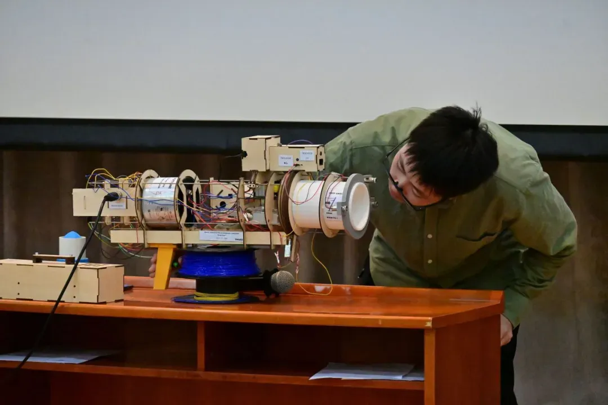{: style="display: block; margin: auto; width: 60%;" }
从远古时期的标枪、弓箭到近代的枪械，大多利用弹丸的动能毁伤目标，统称动能武器。发明了动能武器，现代智人才得以高效获取生存和迁徙的资源。成为“万兽之王”以后，人类群体之间的斗争对动能武器提出了紧迫的需求。随着电气时代拉开巨幕，用电磁力为弹丸提供动能，取代延续数百年的化学动力武器，进入了人们的想象空间。

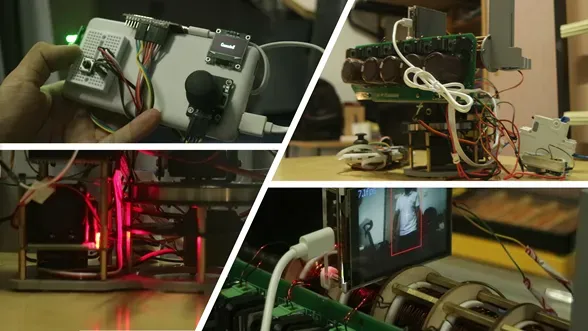{: style="display: block; margin: auto; width: 60%;" }

电磁炮是一个**宽口径、厚基础**的领域。制作一台可以发射弹丸的模型很容易——只需要一卷漆包线，一只锂电池，一截铁棒就能验证它的原理。但是要想达到先进水平很难。一部可以称为“作品”的电磁炮，几乎囊括了工科的一半专业。

## 概要 | 什么是电磁炮？

顾名思义，电磁炮就是利用电磁力推动物体加速的一种装置。按照形态，电磁炮可以分为**轨道式**和**线圈式**两种。前者原理较为简单，即利用**安培力**$\vec F=I\vec{l}\times \vec B$ 将电枢加速。而后者根据动力的来源又可以分为**磁阻式**和**感应式**。磁阻式加速器类似一串级联的电磁铁，通过控制其通断时序，加速一个小铁棒；而感应式则利用**楞次定律**产生斥力推走被加速物。

前文提到的**TUOMF**同学的电磁炮就属于感应式，而笔者才疏学浅，本文将仅仅围绕**磁阻式**电磁炮展开。

## 理论分析

我们知道，一个内外径分别为 $r_1$,$r_2$，厚度 $a$ 的线圈，其轴线处磁场强度为：

{: style="display: block; margin: auto; width: 60%;" }

而空间某点的磁能密度可以表示为：

$$
\omega=\frac{1}{2}\cdot \vec B\cdot \vec H
$$

从而根据虚功原理，结合我使用的钢销饱和磁感应强度大约为 $1T$ 不难得出其受力为：

$$
\begin{aligned}
F&=\frac{\partial W_磁}{\partial z}\\
&=\frac{\partial \iiint_V \omega dV}{\partial z}\\
&\approx \frac{\pi r^2 B_m(H_{front}-H_{rear})}{2}
\end{aligned}
$$

{: style="display: block; margin: auto; width: 60%;" }

结合上述两式，列写一段简单的 python 代码可以画出磁场-位置和受力-位置曲线：

```python
import math
from scipy.interpolate import interp1d
import numpy as np
import pandas as pd

from scipy.optimize import curve_fit
import matplotlib.pyplot as plt

bullet_len_mm = 22
bullet_rad_mm = 8/2
class Coil:
    def __init__(self, location, length, N, innerRadius, outerRadius):
        self.length = length
        self.innerRadius = innerRadius
        self.outerRadius = outerRadius
        self.N = N
        self.μ0 = 4 * math.pi * 1e-7
    def HFieldCoil3(self, current, z):
        L=self.length
        a=L/2
        r2=self.outerRadius
        r1=self.innerRadius
        R=r2-r1
        def logarithm(pos):
            return pos * math.log((math.sqrt(pos ** 2 + r2 ** 2) + r2) /
                                  (math.sqrt(pos ** 2 + r1 ** 2) + r1))

        return ( self.N*current/(2*L*R) ) * (logarithm(z+a)-logarithm(z-a))
coil = Coil(0, 23.4*1e-3, 200, 0.5*12.4*1e-3, 0.5*40*1e-3)
current = 200
plt.figure(figsize=(10,10))
xx=[ pos for pos in np.arange(-30,30,0.1)]
yy=[ coil.HFieldCoil3( current, x*1e-3)   for x in xx]
Fyy = []
for i in range (0,len(xx)):
    Fyy.append((coil.HFieldCoil3( current, (xx[i]+bullet_len_mm/2)*1e-3)
                -coil.HFieldCoil3( current, (xx[i]-bullet_len_mm/2)*1e-3))
               *(bullet_rad_mm*1e-3)**2*math.pi)
plt.subplot(1,2,1)
plt.plot(xx, yy, color='red', label=' H field')
plt.xlabel('x (mm)')
plt.ylabel('H (A/m)')
plt.legend()
plt.subplot(1,2,2)
plt.plot(xx, Fyy, color='blue', label=' force')
plt.xlabel('x (mm)')
plt.ylabel('F (N)')
plt.legend()
plt.show()
```

绘图效果：

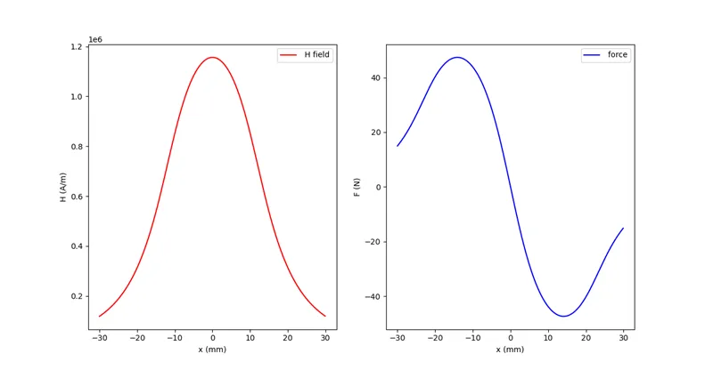{: style="display: block; margin: auto; width: 60%;" }

因此，为了尽量提高加速度，只要巧妙控制各级线圈的通断时间，使得线圈导通期间炮弹恰好位于加速度最大的“峰”上。
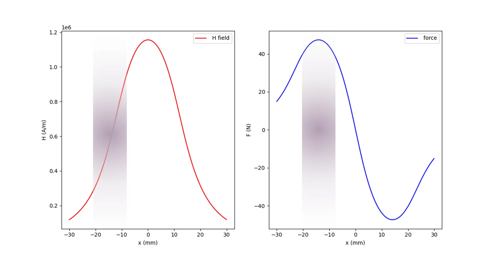{: style="display: block; margin: auto; width: 60%;" }
_略过上述内容并不会对我们后续的学习产生太大影响_ ，下面我们简单介绍如何组成一台具体的电磁炮。

## 组成原理

制作一台电磁炮需要哪些部件和模块呢？首先，可以将电气结构拆解为**功率回路**和**充电回路**。

### 功率回路

功率回路的主要功能为使用脉冲电源为线圈供电。因此，不难想到使用**电容放电**作为这一脉冲电源，通过一个开关为线圈供电：

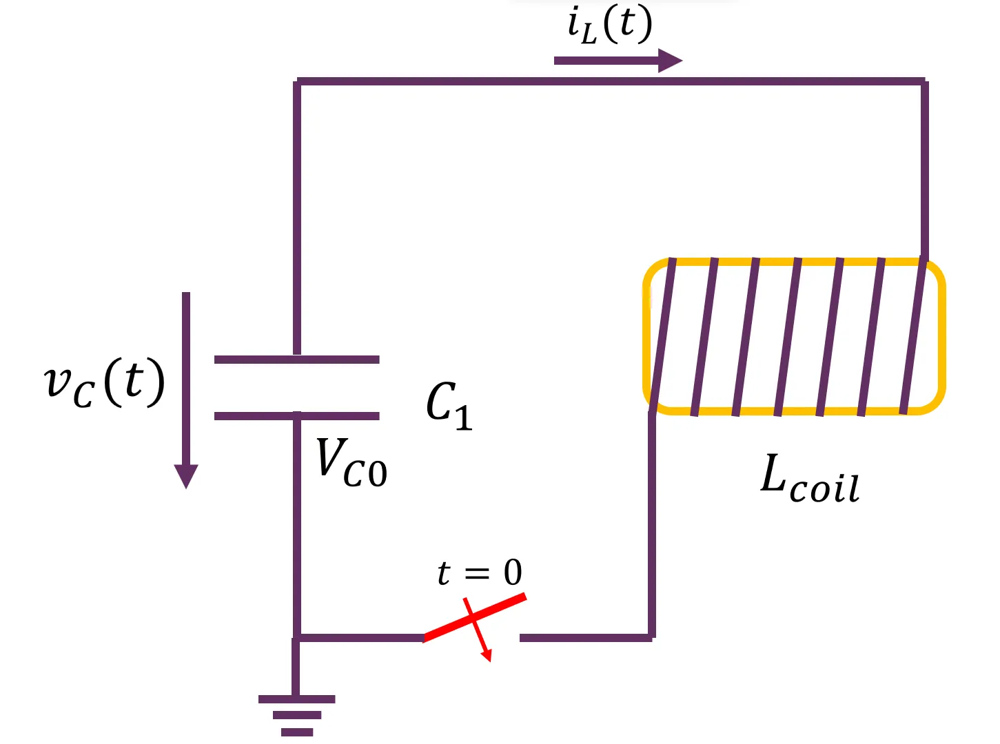{: style="display: block; margin: auto; width: 60%;" }

开关闭合后，电容的电能将通过导线对线圈放电，进而产生磁力拉动炮弹。随着放电继续，电容电压逐渐衰减到 $ 0 $,而炮弹也被发射出去了。

因此，我们便知道了功率回路主要由以下元件组成：

- 储能元件，比如电容
- 开关元件
- 线圈

#### 储能元件

储能元件相对容易解决，只要打开淘宝购买一个指标足够的电容即可。

#### 线圈

线圈也很好获得，在炮管上徒手绕制即可。

#### 开关元件

这是限制电磁炮性能的关键。一般而言，可以分为机械和电子两类。机械开关，如石墨触点、空气开关等等，往往可以承受很高的电流，但不能够实现自动控制；而电子开关主要为各种晶体管的开关抽象（如**MOSFET**和**IGBT**等），~~详情请移步 **《电子电路与系统基础》** 课堂~~。

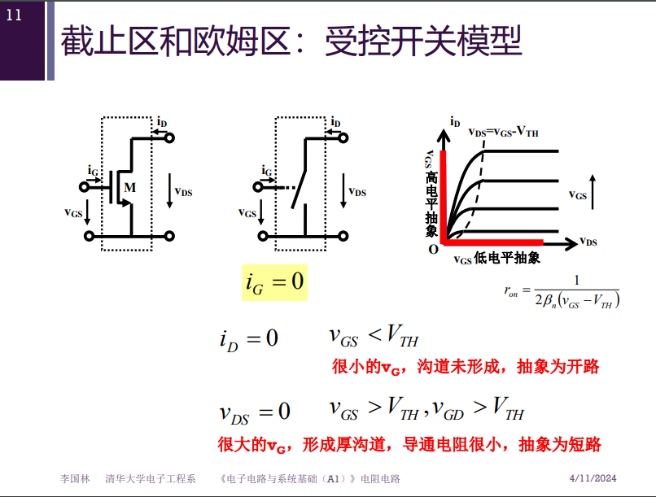{: style="display: block; margin: auto; width: 60%;" }

在各大电商平台可以以相对划算的价格购买到大功率管子，以下为笔者常用的几款管子，供读者参考：

| 型号 | 类型 | 最大电流/kA | 最大电压/kV | 参考单价|
|---|----|---|---|---|
|70TPS16|SCR|1.4|1.6|6.50|
|70TPS12|SCR|1.4|1.2|5.00|
|AUIRGPS4070D|IGBT|0.4|0.6|15.00|

需要注意的是，使用**SCR**作为开关管可能会出现无法关断的问题，也就是在开关导通后电流会一直存在直至衰减到零，此时电路相当于一个具有初值的二阶 RLC 电路，~~可以使用我最喜欢的五要素法进行分析~~。

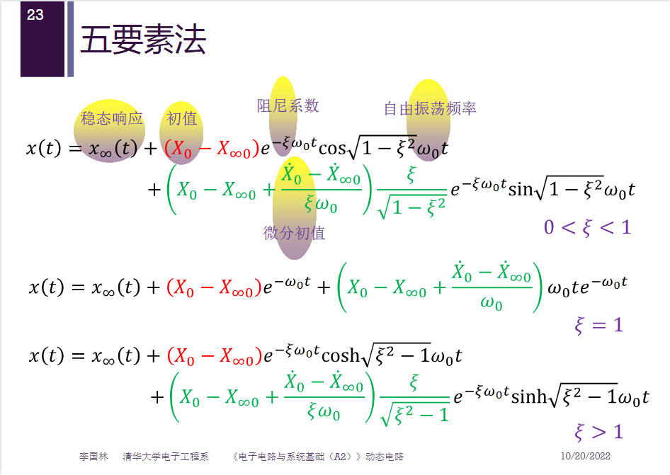{: style="display: block; margin: auto; width: 60%;" }

这样的电路实现固然方便，但可能会出现这样一个问题：炮弹经过了线圈的中心，但还是导通着，导致受力变为负数，也就是出现了反拉现象。

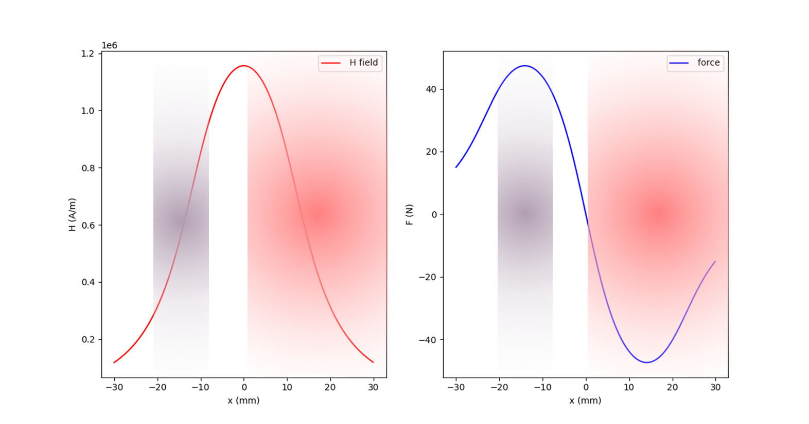{: style="display: block; margin: auto; width: 60%;" }

如何解决呢？方法一是从选型上改善，也就是通过计算 RLC 电路的元件参数，设计出一个恰好在合适时机衰减到零的组合，但是这对于 **《电子电路与系统基础》** 学得不好的笔者显然是太难了。因此笔者决定采用方法二：想办法把开关断开。

#### 关断与半桥

如何实现关断呢？如果仅仅是把开关断开，由于线圈具有电感，会存储磁能，当断开开关后会造成一个冲激电压，损坏电路中的极性元件。回忆**《电子电路与系统基础》**课，不难想起好的解决方案：

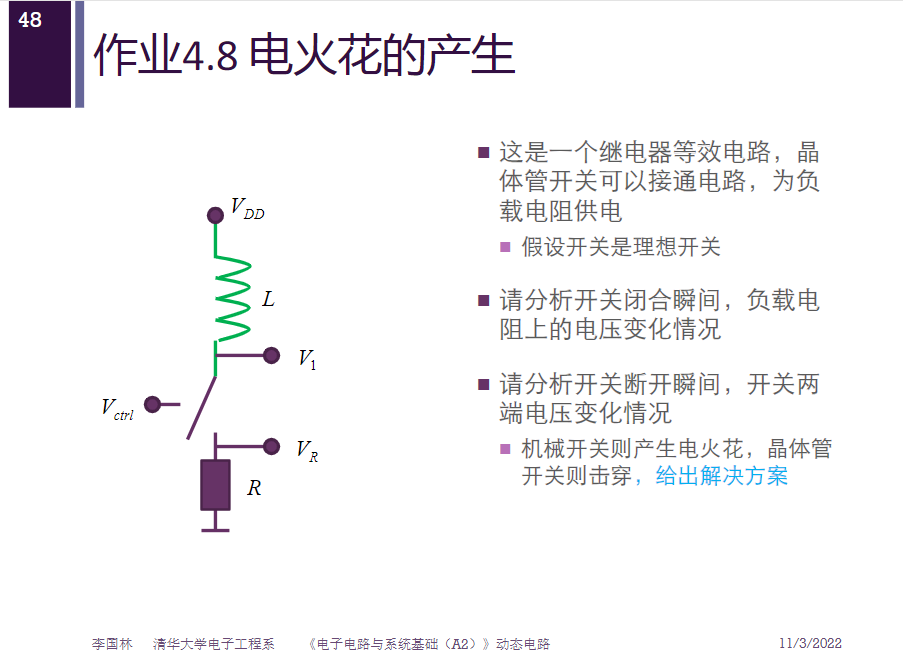{: style="display: block; margin: auto; width: 60%;" }

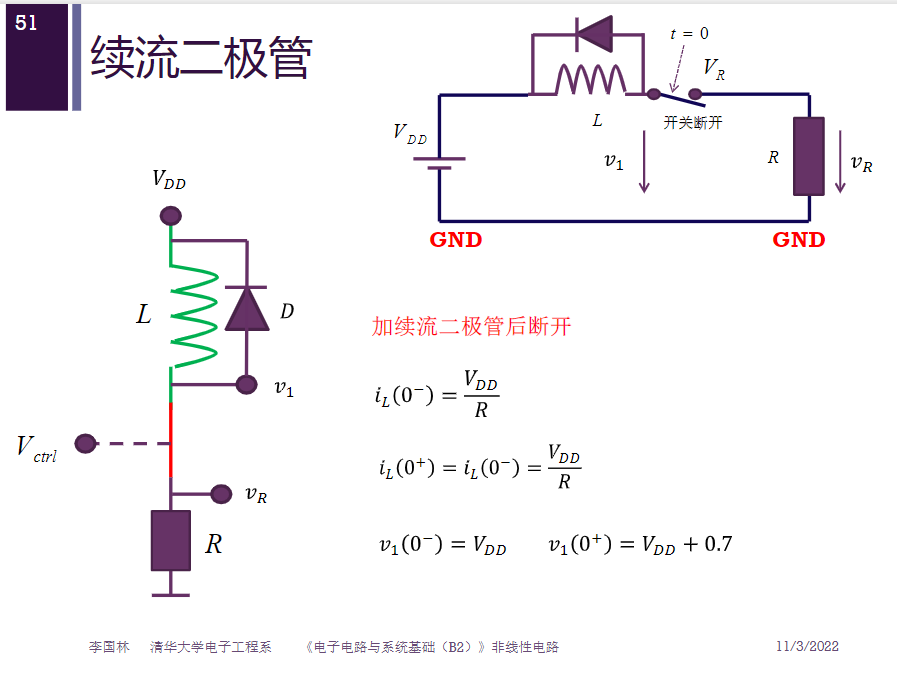{: style="display: block; margin: auto; width: 60%;" }

只要使用一个续流二极管，就可以使得开关断开后产生的感生电动势被吸收。我们的电路图变成了：

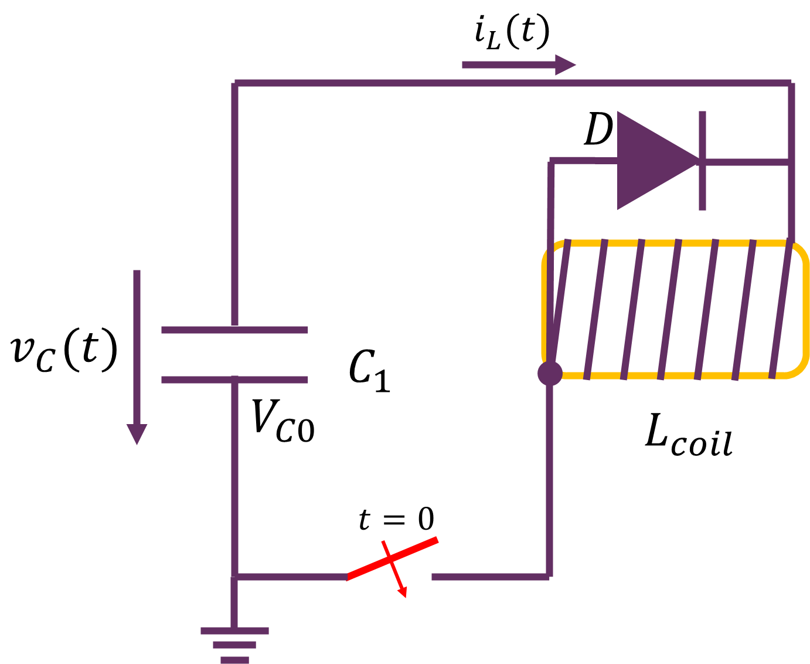{: style="display: block; margin: auto; width: 60%;" }

开关断开后，电感与二极管组成回路，电感具有初值 $I_{L0}$,二极管具有整流近似 $v_D=0.7V$。我们类比**《电子电路与系统基础》**课程所学，进行分析发现：开关断开瞬间，电感电流全部加载到二极管上，形成放磁电压 $-v_D$，该电压对电感放磁，短时内电感电流线性下降，放磁电压为 $-v_D$ 不变，放磁速率（斜率）不变，电感电流呈现出线性衰减规律。

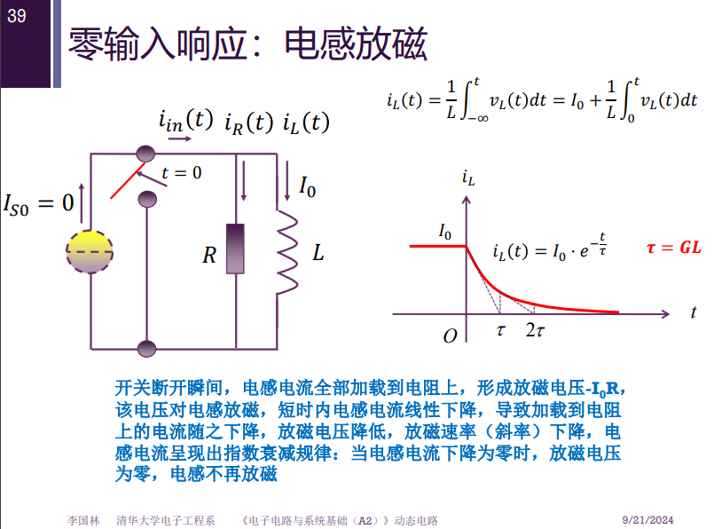{: style="display: block; margin: auto; width: 60%;" }

计算可得电流下降的规律：

$$
\begin{aligned}
i_L(t)&=\frac 1 L \int_{-\infty}^tv_L(\tau)d\tau\\
&=I_0+\frac 1 L \int_0^t-v_Dd\tau\\
&=I_0-\frac{v_D}{L}t
\end{aligned}
$$

从而当经过了 $t_0=\frac{LI_0}{v_D}$ 时间后，电流衰减到 0，关断完成。

那么有的同学就会问了，这磁能直接这么放掉太可惜了，有没有办法回收利用呢？答案是当然有，只要想办法让电流重新流进电容就可以了。这就要引入我最喜欢的半桥电路：

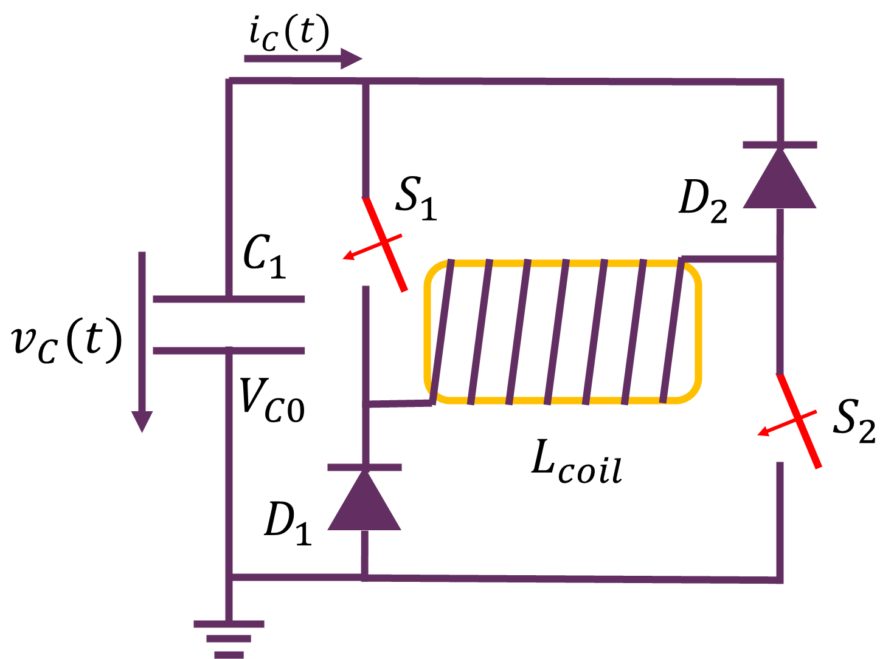{: style="display: block; margin: auto; width: 60%;" }

电路工作主要有如下两个阶段：

**导通阶段**，$S_1$ 与 $S_2$ 同时导通，此时电容放电为电感充电；

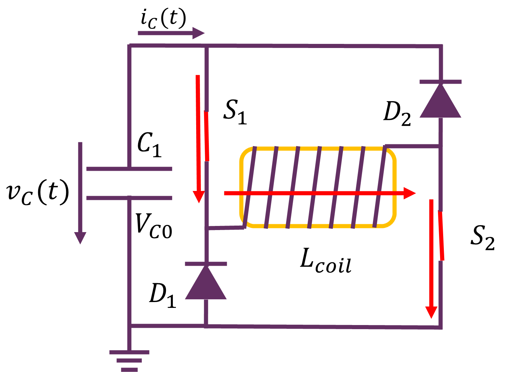{: style="display: block; margin: auto; width: 60%;" }

**续流阶段**，$S_1$ 与 $S_2$ 同时关断，此时电感放电为电容充电；

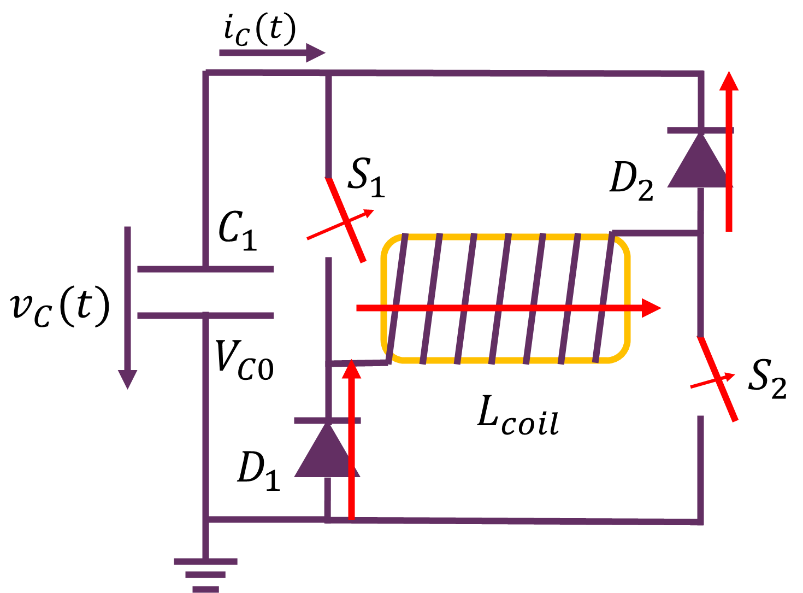{: style="display: block; margin: auto; width: 60%;" }

这样设计电路，优势在于电感储存的磁能得以回收，提高了效率；而劣势在于，这样每级线圈便需要多一只管子，成本更高。实际应用中，本方案和上一种单管的方案都很常见。

至此，我们利用**《电子电路与系统基础》**知识设计出了功率回路的拓扑结构。下面我们来研究充电回路。

### 充电回路

为了提高我们制作的电磁炮的性能，拥有一个相对高的电压源是必要的。基于**《电子电路与系统基础》**课程所学，使用恒压源为电容充电时满足的规律为：

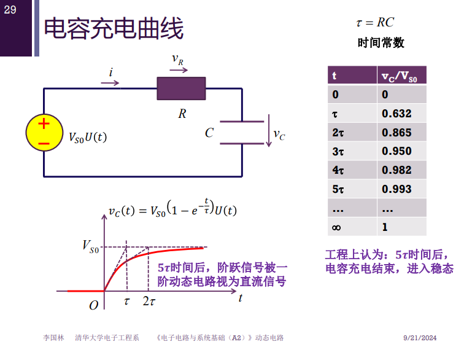{: style="display: block; margin: auto; width: 60%;" }

不妨认为达到 $3\tau$ 即为电容充满。

#### 限流电阻的选择

电压源的一个重要参数即为最大输出功率.这决定了限流电阻 $R$ 的选择

$$
\begin{aligned}
  P_{s,out}(t)&=V_{S0}\cdot i(t)\\
  &= V_{S0}\cdot \frac{V_{S0}-v_c(t)}{R}\\
  &\leq \frac{V_{S0}^2}{R}
\end{aligned}
$$

比方说我们的输入为 12V、20A 的电源，输出为 350V，那么就需要

$$
\begin{aligned}
R&\geq \frac{1}{\eta}\cdot\frac{V_{S0}^2}{V_{in}I_{in,max}}\\
&\approx 1k\Omega
\end{aligned}
$$

#### 高压源的获取

提到这个两三百伏的电压源，很多同学会想到利用**《电子电路与系统基础》**课程中学到的*全桥整流器* 将插座里的 220V 交流电变为直流电打到电容里面。然而，这是极其危险和不负责任的做法；如果在宿舍这么做，还可能以后再也上不了**《电子电路与系统基础》**了。

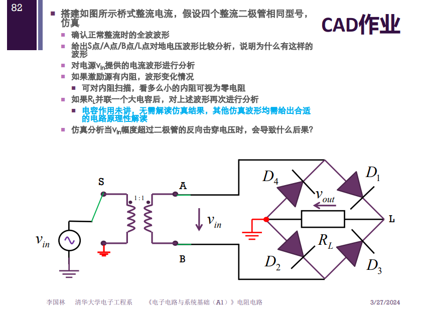{: style="display: block; margin: auto; width: 60%;" }

因此我们需要一种把直流电转换为交流电的逆变电路，再通过变压和整流转换为直流电输进电容即可。这里推荐大家直接在淘宝购买成品的升压模块，当然学有余力的同学也可以尝试这样自己做：

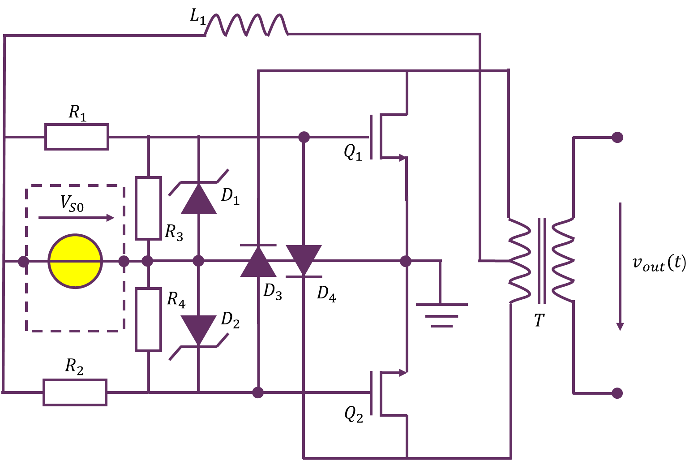{: style="display: block; margin: auto; width: 60%;" }

如图为一个常见的逆变器，其中 $V_{S0}=12V$, $R_1=R_2=470\Omega$,$R_3=R_4=10k\Omega$,$L_1=100\mu H$, $D_3,D_4$ 为快恢复二极管, $D_1,D_2$ 为 12V 稳压二极管，$Q_1 , Q_2$ 为 IRFP250 型 NMOS，$T$ 为初级 $3T+3T$,次级 $600T$ 变压器。具体原理想必读到这里的读者是十分熟悉的，便不再赘述。

当然，我们自然希望能通过弱电控制这个逆变器提供电压，因此可以简单拓展如下：

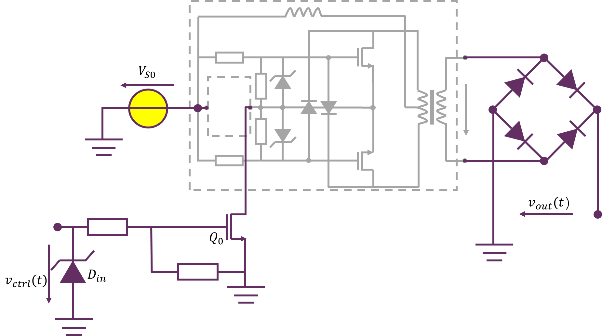{: style="display: block; margin: auto; width: 60%;" }

我们简单上电测试一下，就能看到十分优美的输出波形：

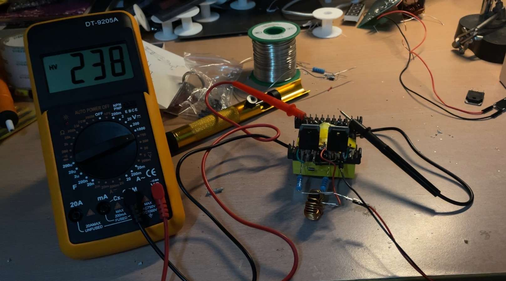{: style="display: block; margin: auto; width: 60%;" }

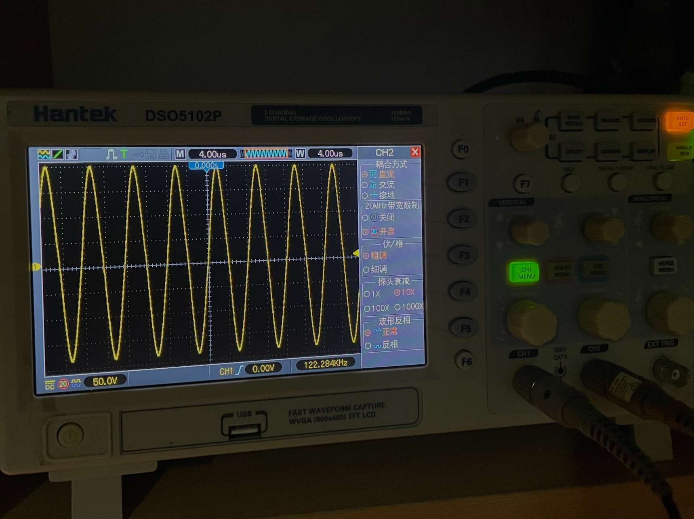{: style="display: block; margin: auto; width: 60%;" }

这样，就可以把 $v_{ctrl}$ 接到单片机的 GPIO 上控制了。

_略过上述内容并不会对我们后续学习产生太大影响_，如今具有升压功能的模块在电商平台上比比皆是，直接购买有时不失为更加省事也更加安全的方案。

至此，我们已经可以做出一台极其简易的电磁炮 demo 了！

## 简易组装

这里演示一台**单级**、**带关断**的手动磁阻炮的制作。

我们的电路图为：

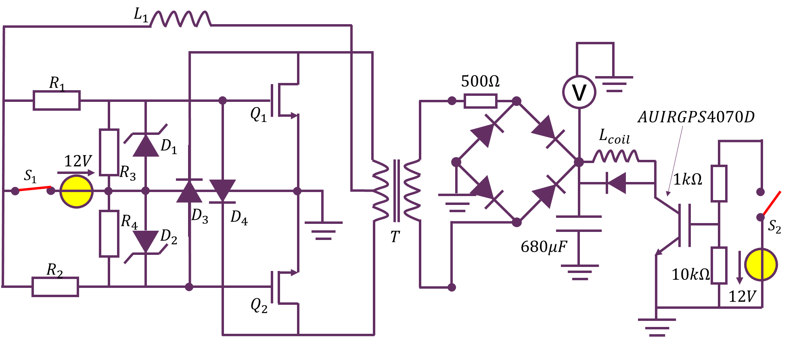{: style="display: block; margin: auto; width: 60%;" }

连接电路，并测试。先接通 $S_1$,待电容充满后，断开 $S_1$, 确保炮口没有任何人或易碎品后，放入一枚炮弹，短暂接通 $S_2$。若电路连接顺利，则此时炮弹就可以发射啦！

## 多级磁阻炮

我们刚才制作的单级炮虽然顺利完成了任务，但实在效果堪忧。那么就有人想到，如果我把多个线圈级联起来，依次控制通断，不就能达到更好的性能了么？欸，于是你就发明了多级磁阻炮。

多级磁阻炮的结构大概如下图，其技术点无非在于通断时机的控制上。

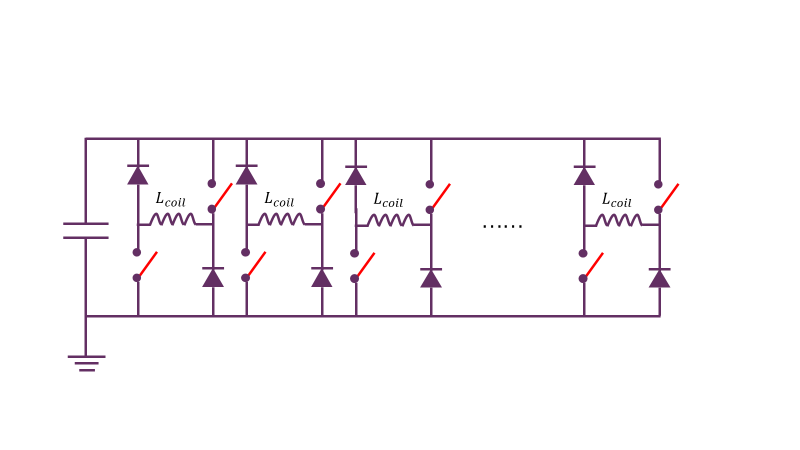{: style="display: block; margin: auto; width: 60%;" }

怎么知道什么时候导通、什么时候关断呢？有的同学可能提出了**基于光电传感器的多级磁阻式电磁炮。**，使用红外对管检测炮膛内子弹是否经过，一旦检测到经过，则导通。每一级的大致原理为：

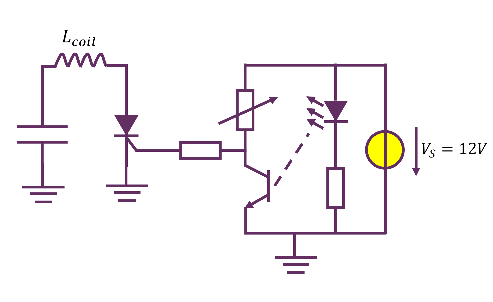{: style="display: block; margin: auto; width: 60%;" }

当有炮弹经过时候，会遮挡光电管，拉高可控硅电压，从而导致可控硅（抽象为开关）“导通”，进而线圈通电。

除此之外，也可以采用单片机对各级开关进行时序控制，从而达到依次接通的效果。

最后祝同学们实验顺利！

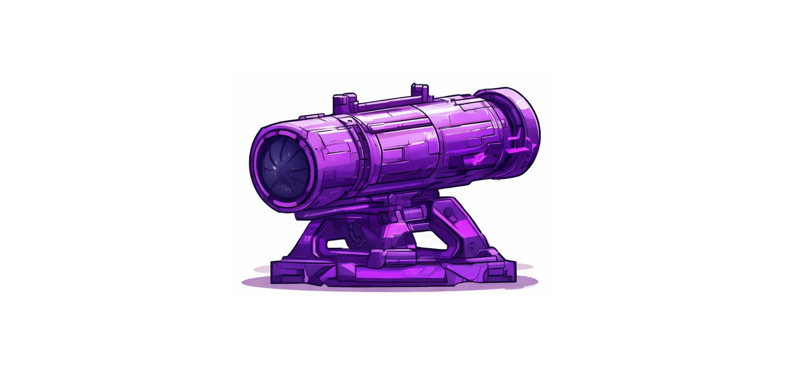{: style="display: block; margin: auto; width: 60%;" }
