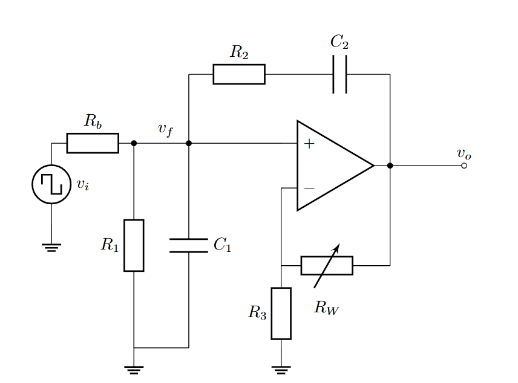
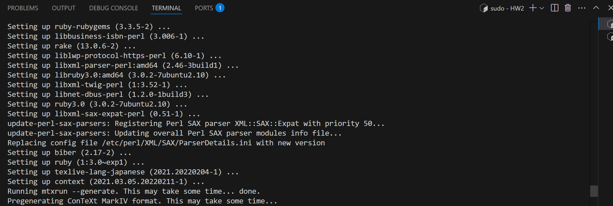
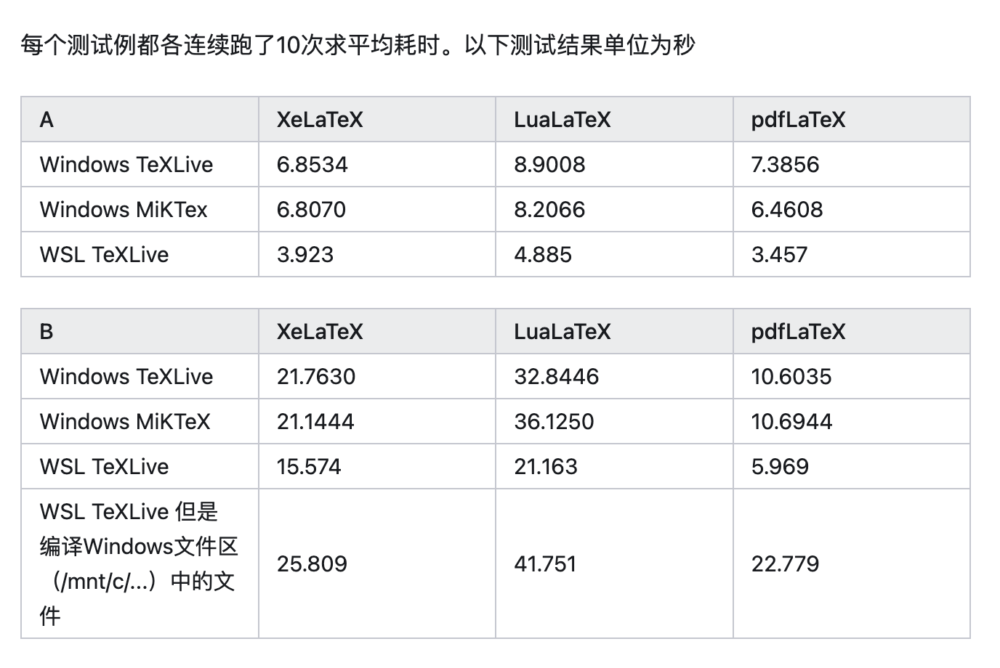
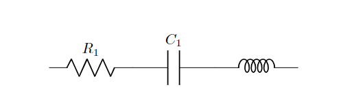
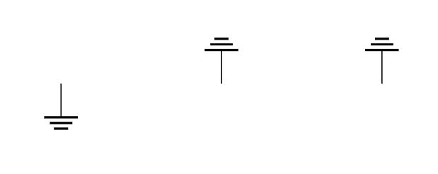
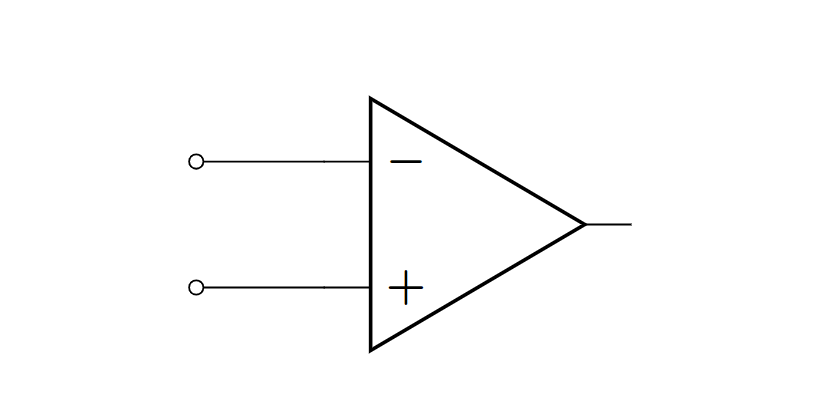
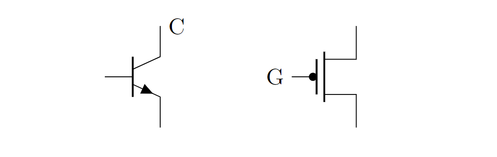
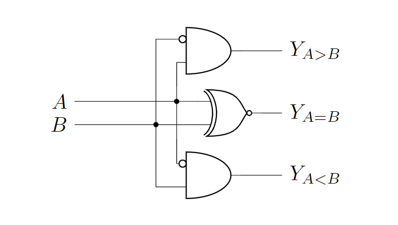

# Circuitikz入门指南：用LaTeX绘制精美电路图

!!! note "发布说明"
    本文已在公众号"无限之声"发表，作者江玮陶。

## 前言：当LaTeX遇见电路图

在电子工程领域，电路图的绘制是基本功。传统工具如Altium Designer或Visio虽然强大，但学术写作中常需要与LaTeX完美兼容的解决方案。这就是`circuitikz`的用武之地——它是`TikZ`的电路绘制扩展包，允许用户直接在LaTeX文档中用代码生成出版级质量的电路图。与位图相比，矢量图形可以无限缩放且公式字体与正文完全一致，特别适合学术论文和技术文档。


{: style="display: block; margin: auto; width: 60%;" }

## 零、如何开始使用LaTeX

LaTeX作为学术排版的首选工具，主要有三种使用方式，适合不同需求的用户：

1. **Overleaf在线编辑**  
   无需安装任何软件，在清华自己的overleaf站点上(overleaf.tsinghua.edu.cn)注册后即可使用。平台提供各种期刊模板，支持实时协作和版本控制，适合快速入门和团队合作。编译通过点击"Recompile"按钮完成，PDF结果即时显示在右侧面板。

2. **Windows本地安装TeX Live+VSCode**  
   - 下载Texlive（https://mirrors.tuna.tsinghua.edu.cn/CTAN/systems/texlive/Images/，约4GB），挂载后运行`install-tl-windows.bat`安装
   - VSCode安装"LaTeX Workshop"插件，在`settings.json`中添加编译链配置（需指定xelatex/pdflatex路径）

3. **WSL环境安装TeX Live+VSCode**  
   - 启用WSL后安装Ubuntu，通过`sudo apt install texlive-full`或挂载Windows本地的TeX Live ISO安装
   - VSCode安装"Remote - WSL"插件连接到wsl即可使用
   
安装时可能会遇到在这个页面卡住的现象：

{: style="display: block; margin: auto; width: 60%;" }

这里其实是程序在等待某种输入，只要多按几次`Enter`就可以了（x


WSL上的Latex编译速度比原生Windows快3-5倍，特别适合大型文档。

{: style="display: block; margin: auto; width: 60%;" }


三种方式中，Overleaf最适合协作场景，Windows本地安装适合单机稳定使用，而WSL方案在保持Windows生态的同时获得Linux编译性能优势。关于具体的Latex用法，可以参考sast weekly的其他文章。需要注意的是，若想要使用circuitikz绘制电路，则需要在引言区添加
```latex
\usepackage{circuitikz}
```
并在正文中添加
```
\begin{figure}[htbp]
  \centering
  \begin{circuitikz}
    %<circuitikz代码>
  \end{circuitikz}
\end{figure}
```
## 一、从双端元件开始

电路图的基本构件是两端元件，如电阻、电容和电感。circuitikz使用直观的命名规则：

```latex
\begin{circuitikz}
    \draw (0,0) to[R=$R_1$] (2,0);  % 带标签的电阻
    \draw (2,0) to[C,l=$C_1$] (4,0); % 另一种标签写法
    \draw (4,0) to[L] (6,0);        % 无标签电感
\end{circuitikz}
```

{: style="display: block; margin: auto; width: 60%;" }

关键语法解析：
- `to`表示连接路径
- 方括号内指定元件类型（R/C/L分别对应电阻/电容/电感）
- `l=`或`=$...$`添加元件标签
- 坐标点如(2,0)确定元件位置

circuitikz提供了丰富的元件，参见下表：

| 元件类型   | 语法示例                  | 
|------------|---------------------------|
| 电阻       | `to[R=$R_1$]`             | 
| 电容       | `to[C=$C_1$]`             | 
| 电感       | `to[L=$L_1$]`             |
| 二极管     | `to[D=$D_1$]`             | 
| 电压源 | `to[vsource=$V_1$]` |
| 电流源 | `to[isource=$I_1$]` |

只要通过
```
\draw (x1,y1) to[<元件名称>=<元件标签>,<参数1>=..,...] (x2,y2);
```
就可以绘制。
## 二、节点元件实战

### 1. 接地符号
接地是电路中的参考点，circuitikz提供多种接地符号：

```latex
\draw (0,0) node[ground]{};       % 标准接地
\draw (2,0) node[ground,rotate=180]{}; % 倒置接地
\draw (4,0) node[ground,yscale=-1]{};  % 镜像接地
```

{: style="display: block; margin: auto; width: 60%;" }

### 2. 运算放大器
运放是模拟电路的核心元件：

```latex
    \draw (0,0) node[op amp] (opamp) {};
    \draw (opamp.+) to[short,-o] ++(-1,0); % 连到同相端
    \draw (opamp.-) to[short,-o] ++(-1,0); % 反相端
```

{: style="display: block; margin: auto; width: 60%;" }

### 3. 晶体管
BJT和MOS管均可绘制：

```latex
\draw (0,0) node[npn] (npn1) {};
\draw (3,0) node[pmos] (mos1) {};
\node[right] at (npn1.collector) {C};
\node[left] at (mos1.gate) {G};
```

{: style="display: block; margin: auto; width: 60%;" }

### 4. 逻辑门
数字电路的基本单元：

```latex
\draw (0,0) node[and port] (and1) {};
\draw (3,0) node[xor port] (xor1) {};
\draw (and1.out) -- (xor1.in 1);
```

{: style="display: block; margin: auto; width: 60%;" }


## 三、坐标系统的魔法

circuitikz继承了TikZ强大的坐标系统：

```latex
\draw (2,0) -- (4,0);          % 绝对坐标
\draw (5,0) -- ++(2,2);         % 相对坐标
\draw (8,0) |- (10,2);           % 先水平后垂直
\draw (11,2) -| (13,0);           % 先垂直后水平
```

{: style="display: block; margin: auto; width: 60%;" }

特殊坐标操作符：
- `|-` 或 `-|`：直角连线
- `++(dx,dy)`：相对位移
- `node.anchor`：连接元件特定锚点

使用这些操作符，即可绘制一些简单的电路，比如下面的比较器：
```latex
\draw (3,5.5) node[and port, anchor=out] (and1) {};
\draw (3.5,4) node[xnor port, anchor=out] (xor1) {};
\draw (3,2.5) node[and port, anchor=out] (and2) {};
\draw (and1.bin 1) node[notcirc,left] {};
\draw (and2.bin 1) node[notcirc,left] {};
\draw (and2.in 1) |- (and1.in 2);
\draw (and1.in 1) -- ++(-0.5,0) |- (and2.in 2);
\draw let \p1=(xor1.in 1),\p2=(and1.in 1) in (\x1,\y1) to[short,-*] (\x2,\y1) node (a) {};
\draw let \p1=(xor1.in 2),\p2=(and2.in 1) in (\x1,\y1) to[short,-*] ({\x2-0.5cm},\y1) node (b) {};
\draw let \p1=(a) in (\x1,\y1) -- (-1,\y1) node[left,scale={1/0.7}] {$A$};
\draw let \p1=(b) in (\x1,\y1) -- (-1,\y1) node[left,scale={1/0.7}] {$B$};
\draw let \p1=(and1.out) in (\x1,\y1) -- (4,\y1) node[right,scale={1/0.7}] {$Y_{A>B}$};
\draw let \p1=(xor1.out) in (\x1,\y1) -- (4,\y1) node[right,scale={1/0.7}] {$Y_{A=B}$};
\draw let \p1=(and2.out) in (\x1,\y1) -- (4,\y1) node[right,scale={1/0.7}] {$Y_{A<B}$};
```

{: style="display: block; margin: auto; width: 60%;" }


## 结语


虽然circuitikz的学习曲线相对陡峭，但一旦掌握，它将成为你在LaTeX中绘制电路图的强大工具。通过代码生成电路图不仅能够确保与文档整体风格完美统一，还能实现传统绘图软件难以企及的灵活性和精确度。所有元件标签的数学公式都会自动匹配正文的字体和格式，真正实现学术排版的严谨性。  

使用circuitikz的另一大优势在于其与版本控制系统的天然兼容性。由于电路图完全由代码定义，你可以像管理程序源代码一样，用Git等工具追踪每一次修改，方便团队协作和版本回溯。此外，通过定义自定义宏和样式模板，你可以建立自己的电路元件库，实现常用模块的快速复用，大幅提升绘图效率。    

现在，只需在LaTeX文档的导言区加入`\usepackage{circuitikz}`，你就可以开始用代码绘制专业级电路图了。从简单的RC电路起步，逐步挑战运放电路、数字逻辑系统，最终你也能成为LaTeX电路绘制的高手，让每一份实验报告和学术论文都拥有出版级质量的电路插图！

