# 使用Arduino优雅地完成你的万花尺大作业

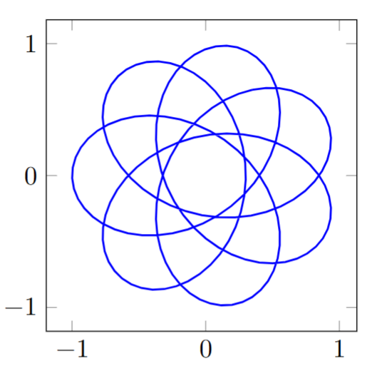{: style="display: block; margin: auto; width: 60%;" }

这两天当硬设助教，拿了块Arduino UNO单片机，打算整点小活。之前上谷老师的《信号与系统》听了关于Z变换和数字自激振荡器的讲解，就想实现一回基于数字振荡器的万花尺，致敬一下传奇《电电实验2》。
## Arduino能跑多快？
`Arduino`用的`ATMega328`芯片号称主频能跑到10多M（远远不能逼近最喜欢的曲水流觞大作业x）。但是具体我写端口能写多快还得看`digitalWrite()`要多快。于是写了一个简单程序：
```cpp
void setup(){
}
void loop(){
  digitalWrite(7,HIGH);
  digitalWrite(7,LOW);
}
```

然后拿示波器抓一下`7`引脚的电平：


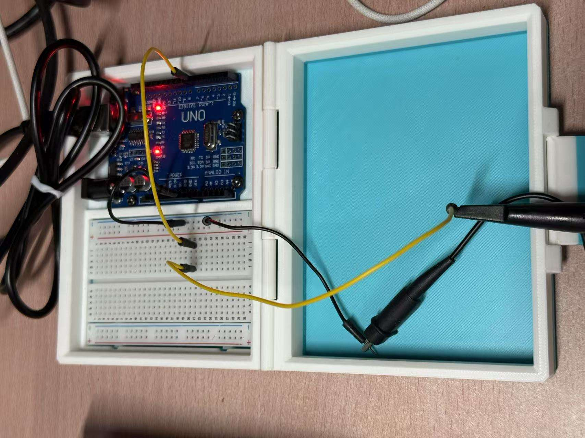{: style="display: block; margin: auto; width: 60%;" }


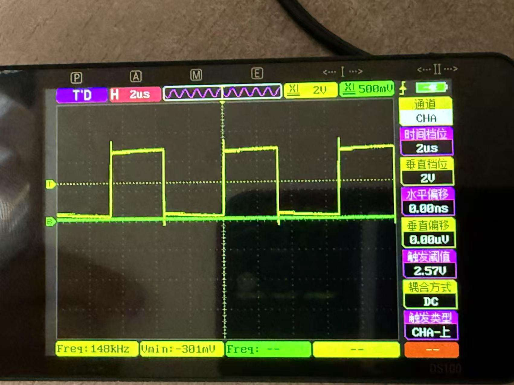{: style="display: block; margin: auto; width: 60%;" }

得到这玩意频率在`148k`。看起来也够用了。

## DAC怎么搞？
众所周知`Arduino`的模拟输出其实输出的是`PWM`波而不是模拟电平。因此，需要想办法搞一个DAC出来。然而如果真的搞一个DAC模块，首先等快递就要一段时间，我等不及；其次这种成品DAC又贵又慢（因为通常都是用`I2C`之类的协议串行通信的，我倒是不需要连个管脚都这么扣扣嗖嗖）。因此我直接使用最喜欢的电阻分压进行DAC。

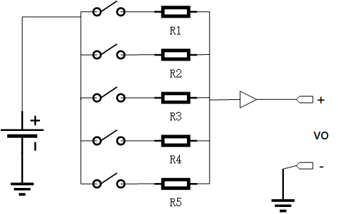{: style="display: block; margin: auto; width: 60%;" }
只要取$R_1=1k\Omega\,,R_2=2k\Omega\,,\cdots R_5=16k\Omega\,,$就得到了一个很简单的(近似的）5bit并行DAC。于是我火速下楼拿了一盒电电实验kit并硬凑出了两路DAC。

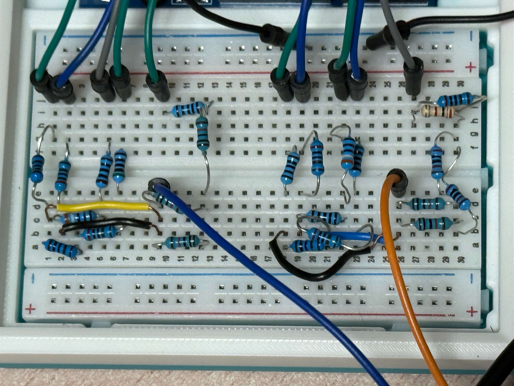{: style="display: block; margin: auto; width: 60%;" }

于是便搞定了“模拟输出”的问题

## 信号怎么搞？
考虑下面这个系统

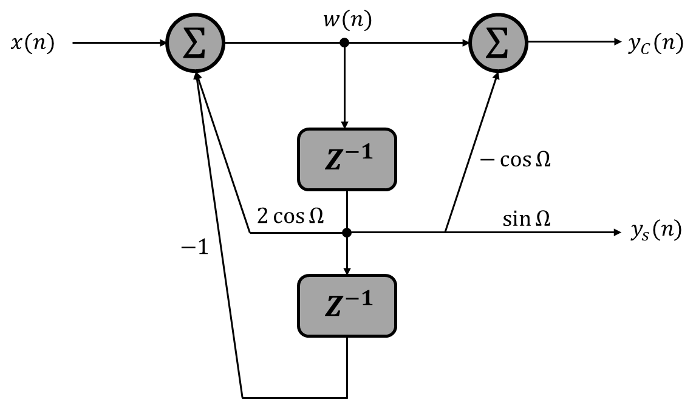{: style="display: block; margin: auto; width: 60%;" }

容易写出$y_C(n)\,,y_S(n)$的传递函数
$$
H_C(z)=\frac{1-z^{-1}\cos\Omega}{1-2z^{-1}\cos\Omega+z^{-2}}
$$
$$
H_S(z)=\frac{z^{-1}\sin\Omega}{1-2z^{-1}\cos\Omega+z^{-2}}
$$

结合部分分式法即可逆z变换得到两个单位样值响应
$$
h_C(z)=\cos(n\Omega)\,,h_S(z)=\sin(n\Omega)
$$
于是为了得到我们想要的波形
$$
\begin{cases}
    x(t)=(1-d)\cos(2\pi f_1t)+d\sin(2\pi f_2t)\\
    y(t)=(1-d)\sin(2\pi f_1t)+d\cos(2\pi f_2t)\\
\end{cases}
$$
离散化为
$$
\begin{cases}
    y_A(n)=(1-d)\cos(n\Omega_1)+d\sin(n\Omega_2)\\
    y_B(n)=(1-d)\sin(n\Omega_1)+d\cos(n\Omega_2)\\
\end{cases}
$$
同时考虑到我们的DAC只能输出正的，因此把电平抬高即可。只需要构造系统为

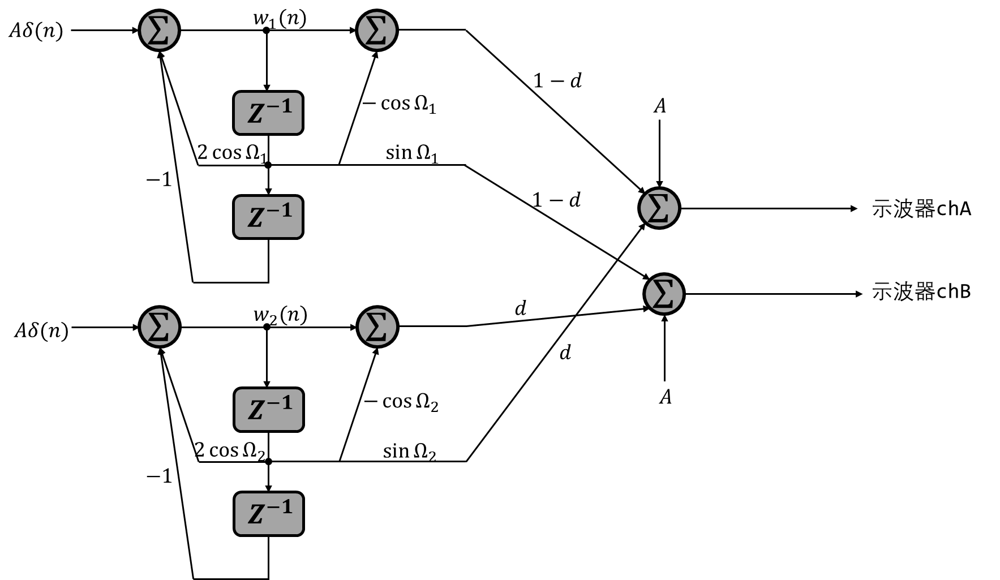{: style="display: block; margin: auto; width: 60%;" }
即可得到万花尺。使用的代码可见文末。
## 与“模拟”方案的对比
之前上《电电实验2》做了一个数字分频-模拟滤波的版本如下

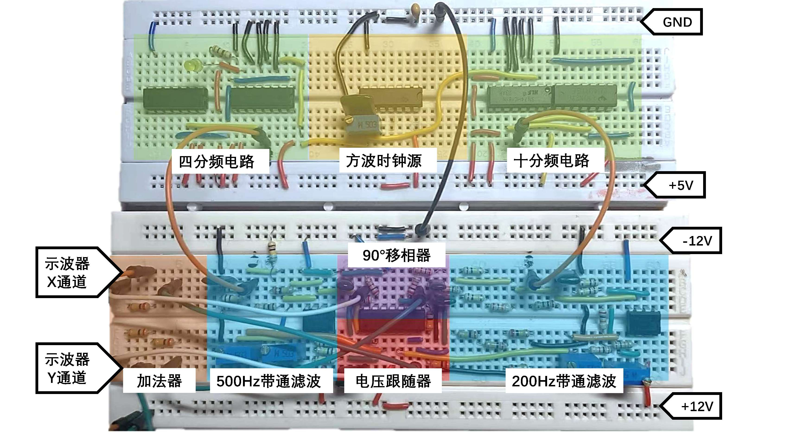{: style="display: block; margin: auto; width: 60%;" }

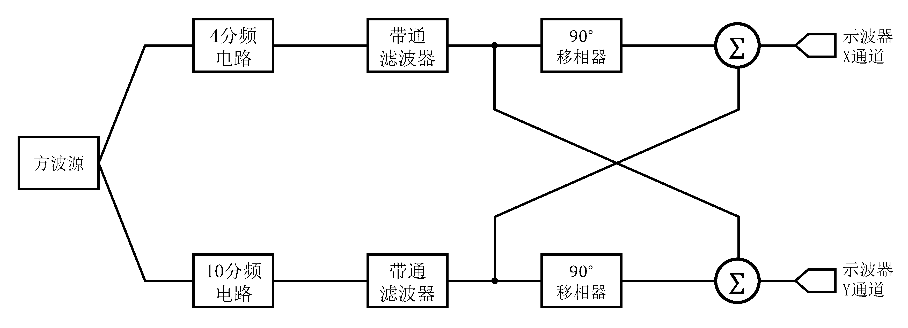{: style="display: block; margin: auto; width: 60%;" }

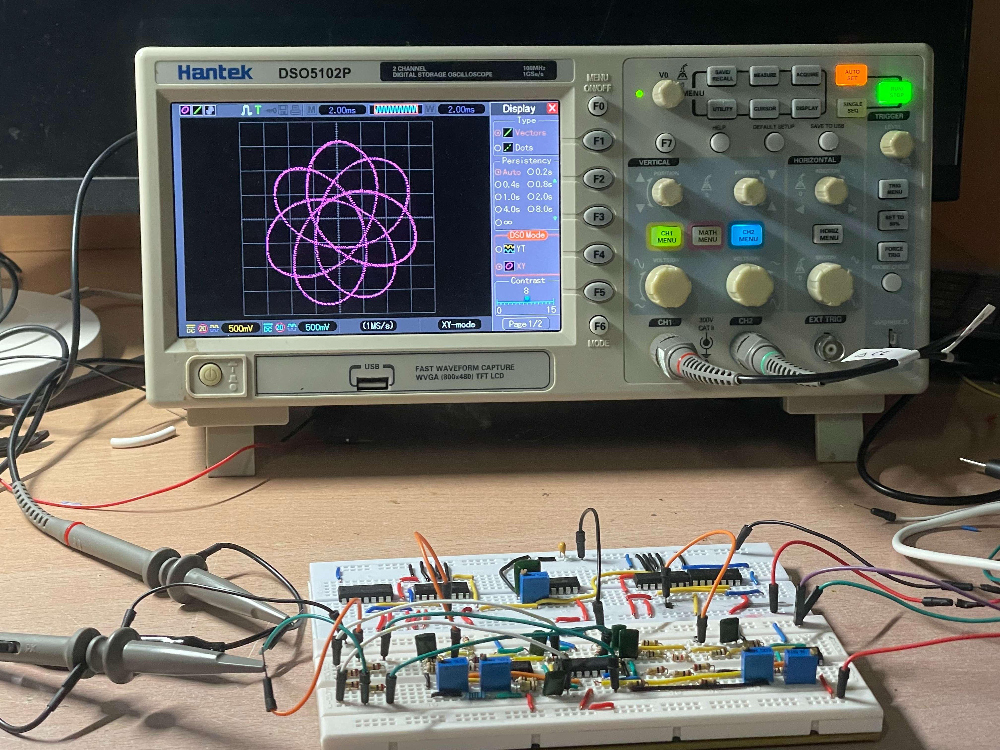{: style="display: block; margin: auto; width: 60%;" }

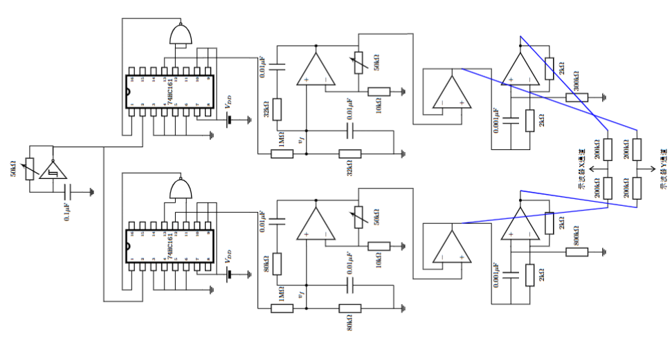{: style="display: block; margin: auto; width: 60%;" }

对比下来纯写代码还是更“干净”更好调试，换一组数据只需要重新compile一下就可以了。当然问题也多，比如说数字版的最后频率只有5Hz左右，而模拟版的好像工作在几k左右。
## 效果展示
最后附上一组展示。首先是实验课同款的$\Omega_1:\Omega_2=2:5\,,d=0.6$:

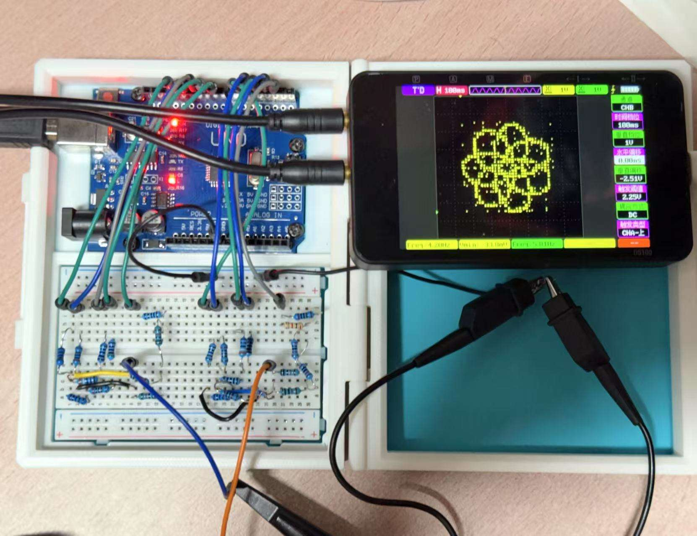{: style="display: block; margin: auto; width: 60%;" }

改变d值可以改变图形的胖瘦，比如取$\Omega_1:\Omega_2=2:5\,,d=0.5$:

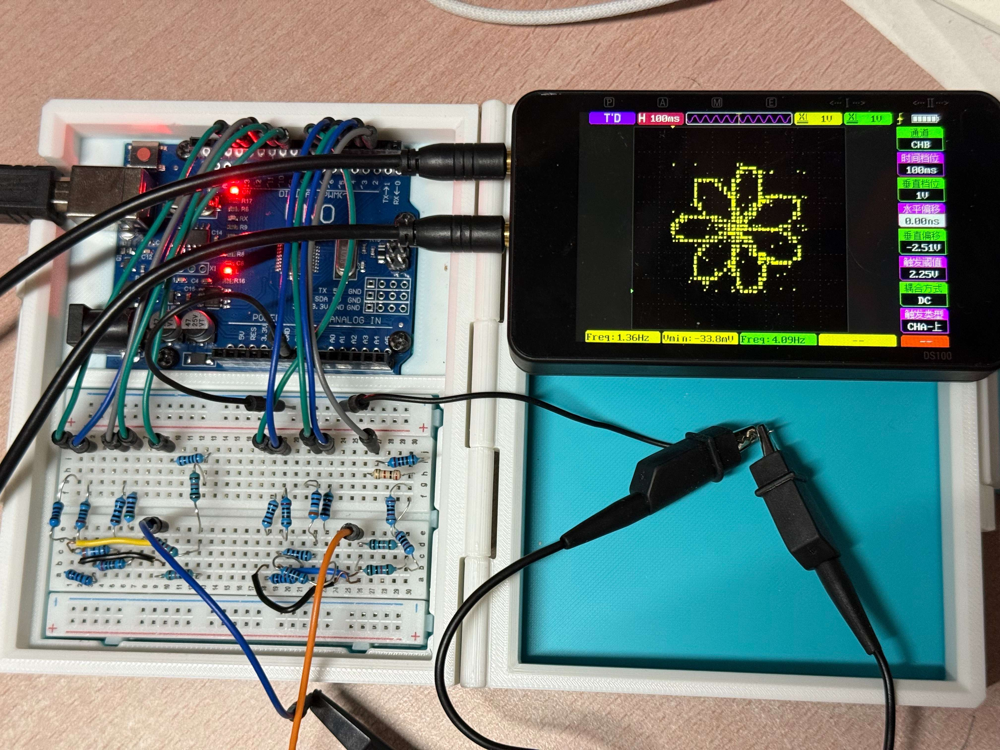{: style="display: block; margin: auto; width: 60%;" }

$\Omega_1:\Omega_2=2:5\,,d=0.3$:

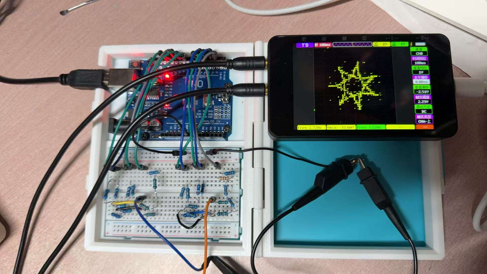{: style="display: block; margin: auto; width: 60%;" }

改变频率比可以改变图形的瓣数。比如$\Omega_1:\Omega_2=3:5\,,d=0.5$可以观察到8片：


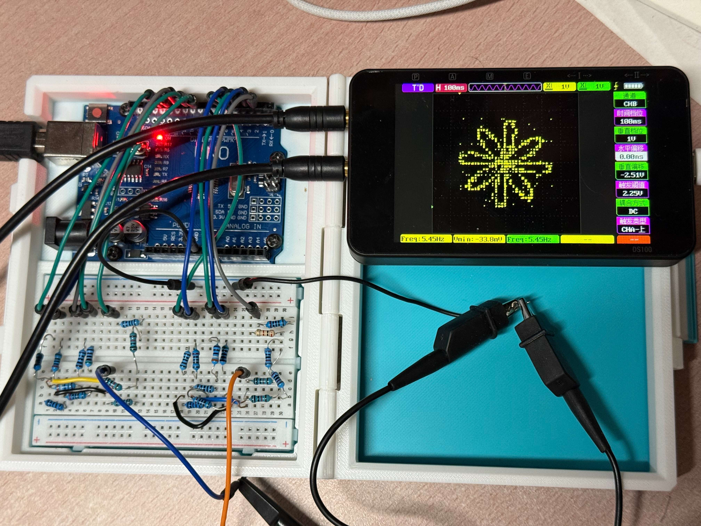{: style="display: block; margin: auto; width: 60%;" }

而$\Omega_1:\Omega_2=2:3\,,d=0.5$可以观察到5片：

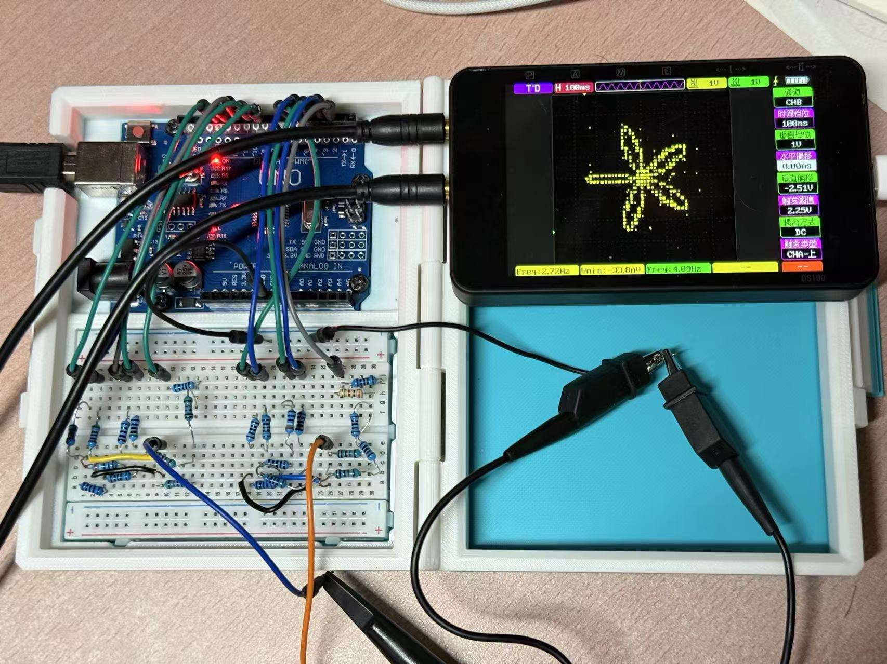{: style="display: block; margin: auto; width: 60%;" }

修改为$\Omega_1:\Omega_2=2:3\,,d=0.3$就变成五角星：

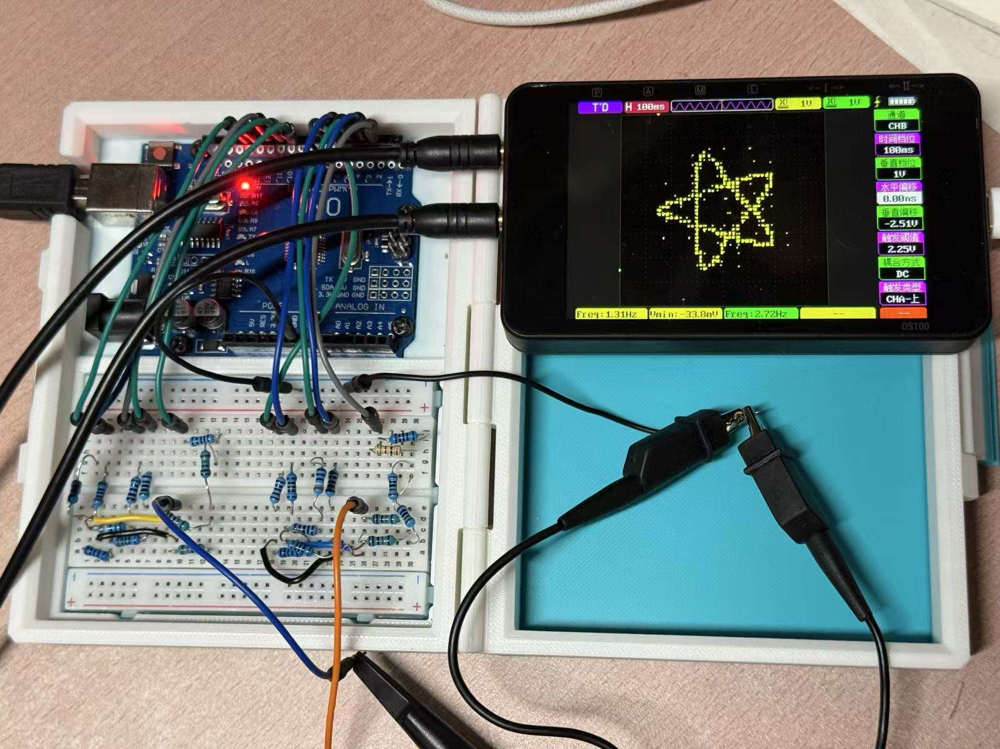{: style="display: block; margin: auto; width: 60%;" }

令$d=0$又可以得到一个圆圈：


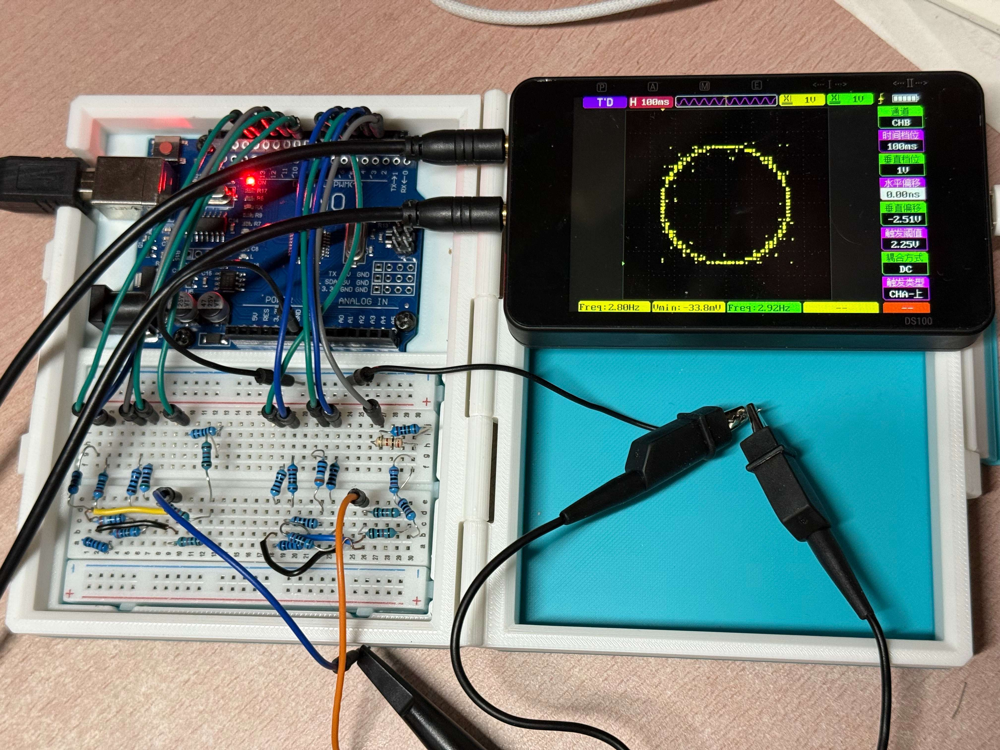{: style="display: block; margin: auto; width: 60%;" }

~~最后，这个如果拿去验收电电实验疑似可以得到102分，因为实现了105分，但用了额外的元件扣最多3分~~

最后感谢谷老师和《信号与系统》，**信号与系统真的很有趣！**
## 源代码
附上Arduino用的源代码，直接粘进IDE即可：
```c++
#define TESTPIN 7
#define  PI      3.14159265358979323846
#define  AMP     15.8
#define  OMEGA_1 (PI/60/5)* 2
#define  OMEGA_2 (PI/60/5)* 3
#define  COEF    0.3                    // d


const double COEF_1 = 1-COEF;
const double COEF_2 = COEF;       

const double C1_COS_OMEGA_1=COEF_1*cos(OMEGA_1);
const double DOUBLE_COS_OMEGA_1=2*cos(OMEGA_1);
const double SIN_OMEGA_1=sin(OMEGA_1);
const double C1_SIN_OMEGA_1=COEF_1*sin(OMEGA_1);

const double C2_COS_OMEGA_2=COEF_2*cos(OMEGA_2);
const double DOUBLE_COS_OMEGA_2=2*cos(OMEGA_2);
const double SIN_OMEGA_2=sin(OMEGA_2);
const double C2_SIN_OMEGA_2=COEF_2*sin(OMEGA_2);

double w1   = AMP;
double w1_1 = 0;
double w1_2 = 0;

double w2   = AMP;
double w2_1 = 0;
double w2_2 = 0;


int CHA_PINS[]={13,12,11,10,9};
int CHB_PINS[]={6,5,4,3,2};

int y_A = 0 ;
int y_B = 0 ;

int MASK[]= {16,8,4,2,1};

int bit = 0;
int BIT = 0;
void setup() {
  // put your setup code here, to run once:
  for(int i=0;i<5;i++){
    pinMode(CHA_PINS[i],OUTPUT);
    pinMode(CHB_PINS[i],OUTPUT);
  }
}


void loop() {
  /* 更新w */
  w1_2 = w1_1;
  w1_1 = w1;
  w1 = DOUBLE_COS_OMEGA_1 * w1_1 - w1_2;

  w2_2 = w2_1;
  w2_1 = w2;
  w2 = DOUBLE_COS_OMEGA_2 * w2_1 - w2_2;

  /* 更新Y */

  y_A =int( COEF_1 * w1 - C1_COS_OMEGA_1 * w1_1 + C2_SIN_OMEGA_2 * w2_1)+AMP;
  y_B =int( COEF_2 * w2 - C2_COS_OMEGA_2 * w2_1 + C1_SIN_OMEGA_1 * w1_1)+AMP;

  /* digitalWrite */

  for ( int i=0;i<5; i++){
    BIT = (y_A&MASK[i])==0? LOW: HIGH;
    digitalWrite(CHA_PINS[i],BIT);
    BIT = (y_B&MASK[i])==0? LOW: HIGH;
    digitalWrite(CHB_PINS[i],BIT);
  }
  delayMicroseconds(1000);
}

```