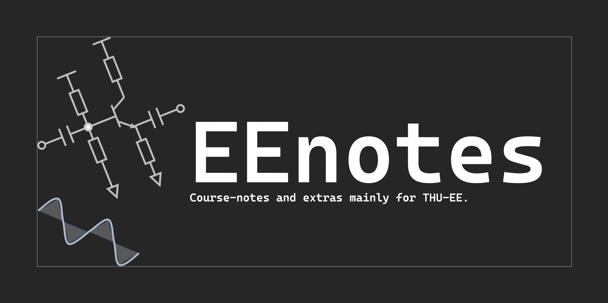
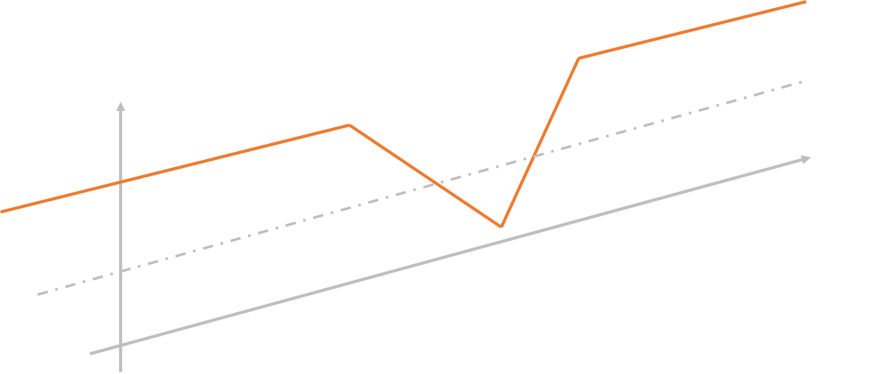

# CBDT的笔记——序
{: style="display: block; margin: auto; width: 100%;" }
## 前言
之前帮群友整理[数算习题](https://mp.weixin.qq.com/s/8955NVjGqlI13u3zvh2H1g)的时候，我曾经留下一段话：

!!!quote
    拥有更加完备的复习资料不会让任何“高手”因此失去原本应得的成绩，也不会在本质上改变一些体系对于能力的衡量。它只会让同学的备考减少一些“无所适从”的焦虑，让大家真正“心态更放松的去获得比较好的成绩”。然而，如今的很多课程拒绝提供往年题等等资料，还有同学坚信“零和博弈”的逻辑，将材料以“小福利”的名义限制在小的圈子里面，并明令禁止传播。从版权而言，自己写的笔记如此做自然是无可厚非。不过~学生**为学生~，若是能将好的材料用来缓解所有人的这种迷茫的话，也不失为一种大功德。

现在看来确实颇有些过激了。但是，我依然希望能给同学带来更好的、更广谱的学习体验的提升，希望这个笔记网站可以做到这一点。
## 美好的愿景
不幸的是我本人并不能学会所有的课程。我曾经和同学打趣说，在电子系的培养方案上，我是一个带阻系统，具体阻在了数算和处理器的这一块。虽然高中时候学过一点编程（我都不好意思说自己打过竞赛），但确实对这一块提不起兴趣，因此就学不好。
{: style="display: block; margin: auto; width: 60%;" }
不过我还是希望能够把自己学到的一点东西保留下来让大家看到。目前施工计划如下：

- [ ] 高等微积分1
- [ ] 高等微积分2
- [ ] 大物1
- [x] 大物2
- [x] 线性代数1（期中前）
- [x] 线性代数2（期中后）
- [x] 电磁场与波
- [ ] 电电
- [ ] 数逻期中前
- [ ] 程设
- [ ] ss
- [ ] 媒体与认知

希望毕业或者我忘掉这些东西之前能够尽可能多地写完吧！
## 站点说明
[timeline center alternate(./assets/timeline1.yaml)]

-   :material-fish-off:{ .lg .middle } __课程笔记__

    ---

    努力更完清华电子系必修课

    [:octicons-arrow-right-24: notes](notes/)

-   :material-tools:{ .lg .middle } __其他文档__

    ---

    以及写其他一些有趣的文章

    [:octicons-arrow-right-24: documents](documents)

## github合作说明与致谢
一个人难免有错漏之处，还请不吝赐教！如果有问题可以在[此仓库](https://github.com/CBDT-JWT/EEnotes)提出，万分感激！