# 《电子电路与系统基础》学习参考
!!! info  "说明"
    先开个坑（）放张最喜欢的单管放大器镇楼。后面应该会同步写一下CAD教程
    
    （很大程度上）参考了\ycgg/的小班辅导讲义，感谢！这篇文章大概会按照元件器件和方法工具两条主线完成，感觉电电确实就是这么个逻辑

!!! tips "建议"
    目前感觉这个课最有效的方法是背背背+直觉，在大脑里建立又大又快的L1-cache。我当时学（2）的时候把所有的PPT都抄了2遍，差不多背下来了，能80%默写正课内容的程度，感觉对于应试还是非常有效的。考试的时候就直接顺着写了，甚至富裕30分钟。当然还是要提倡先做大题（）

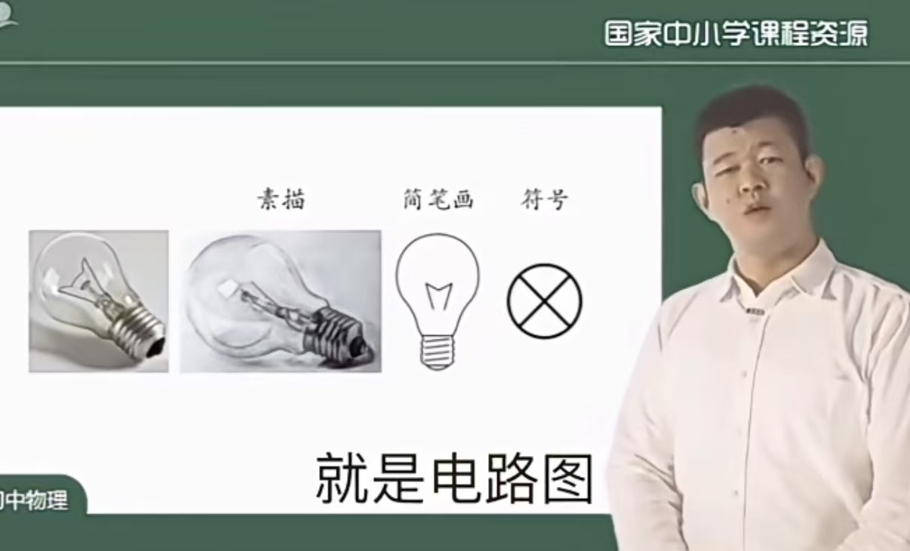
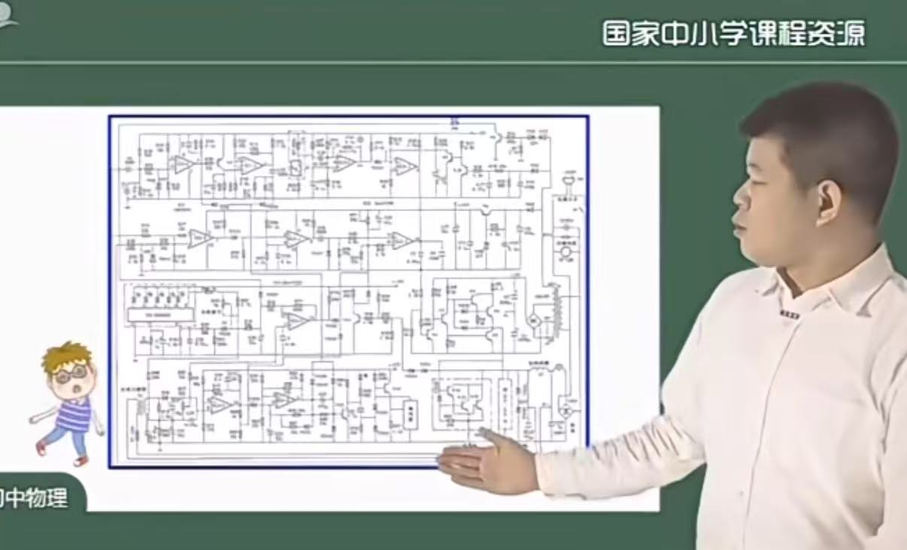

## 前言

参考\ycgg/的小班辅导对电电进行了粗浅的梳理，私以为大致有这样两个主线。其一是从局部变换到模块分析到系统分析的{==分析方法==}线：
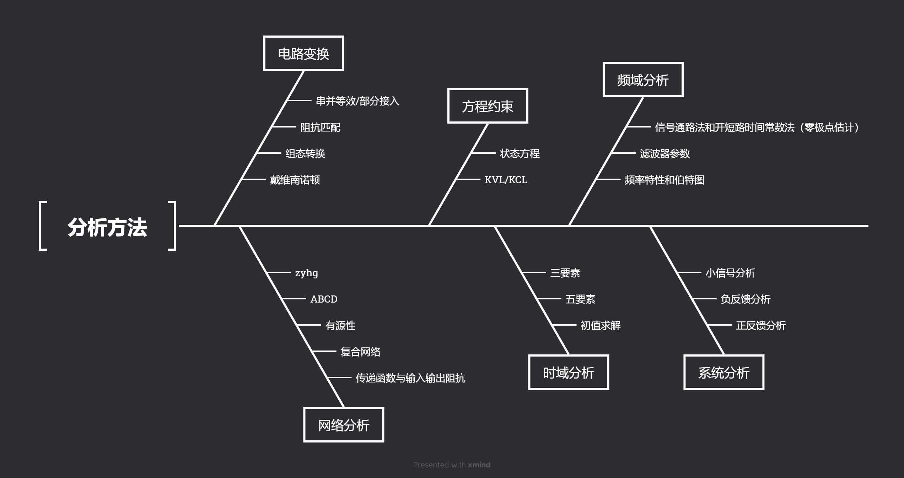
另一条则是从简单的阻容感到受控源到晶体管再到单元电路的{==元件器件==}线：
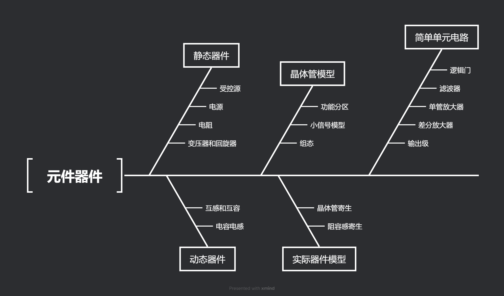
【没写完】
## 元件与器件
《电电》涉及的元件器件主要有

1. 电阻电容电感，电流电压源，受控源
2. 二极管，运放
3. BJT，MOSFETS
## 方法与工具
方法和工具主要包括网络参量“小矩阵”（静态分析），三/五要素法（时域分析）和频域分析三个大类。
### 电路变换
电电课不同于信号与系统的一大关键在于**电路变换**技巧的应用。电路变换本质上是把数学过程形象化了；但我们往往不需要关注背后的数学过程，善于运用相关的变换（“电路直觉”）往往可以给我们的学习和应试带来很大的好处。
#### 戴维南-诺顿
戴维南诺顿定理是电电课最常用的电路变换方法之一，也是最简单的之一。我们只要知道一个线性含源的单端口网络可以等效为电压源串电阻和电流源并电阻的形式就可以了。其中电阻的求法是{==独立源置0端口加流求压/加压求流==}，电压源和电流源的大小分别通过开路电压/短路电流求取。

戴维南-诺顿最大的好处是可以在列些KCL/KVL矩阵方程的时候帮我们减少节点数（诺顿）和回路数（戴维南），进而减少方程的阶数。
#### 组态转换
以BJT为例。CE组态的管子其小信号模型很好画：
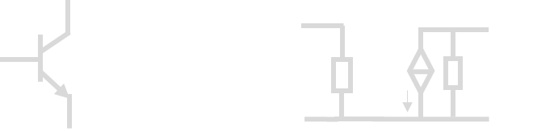
但是对于CB组态，其小信号模型长成这样
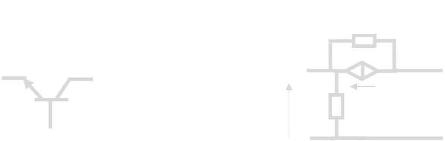
不够直观。怎么办呢？这里就要用一些电路变换的技巧，我将其成为组态转换，因为我也不知道叫什么名字好。或许可以叫“借流还流法”？总之，我们将$c\to e$的受控源拆开，拆成$c\to b$和$b\to e$两个，看起来像是从b节点借了$g_mv_be$又还了$g_mv_be$, 不会影响电路的功能。得到

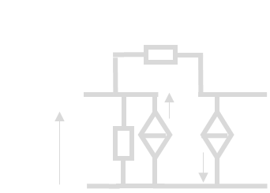
更进一步观察到左边的受控源的控制电压就是自己的电压，于是这个源就是一个电导$g_m$，从而进一步化简

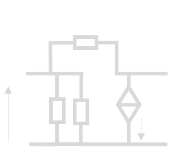

最后考虑理想晶体管
$$
r_{be}\,,r_{ce}=\infty
$$
得到

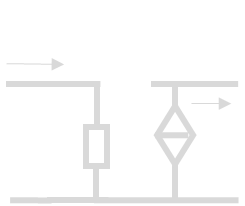
因此CB组态的BJT为一个电流buffer。对于CC组态而言，也是一样：考虑其小信号模型

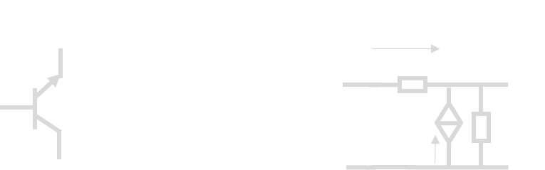

这里采用拆压法，将控制电压$v_{be}$拆成$v_{bc}+v_{ce}$, 电路上意味着将受控源拆开成$g_mv_{bc}+g_mv_{ce}$：
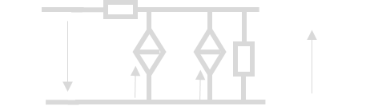
这时候右边又变成电阻了。于是
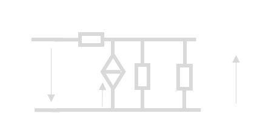
进一步理想化得到
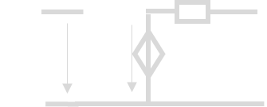
得到了一个电压buffer。类似的原理应用很广泛，可以有效处理受控源的控制关系不直观的问题。
#### 阻抗匹配
阻抗匹配是通过{==双向无损网络==}实现源和负载之间最大功率传输的方式，方法为共轭匹配
$$
Z_L=Z_S^*
$$
阻抗匹配的参数通过**并大串小$Q$相等**获得。设计中要求$R$大的一侧并联东西，$R$小的一侧串联东西；并保证

$$
Q = \underbrace{\frac{\text{串联电抗}}{\text{串联电阻}}
    = \frac{\text{并联电纳}}{\text{并联电导}}}_{\text{局部}}
    = \underbrace{\sqrt{\frac{R_p}{R_s} - 1}}_{\text{整体}}
$$

#### 串并等效与部分接入法
串并等效是指，当$Q\gg 1$时，近似认为下面的电路等效：
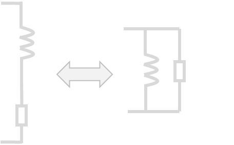

**不论是并联还是串联，都可以通过$\times Q^2$把$R$“翻上去”。**

部分接入法是指，当$Q\gg 1$时，近似认为下面电路等效：
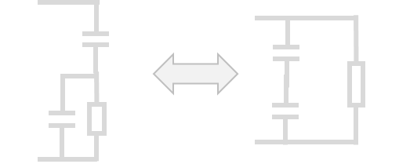
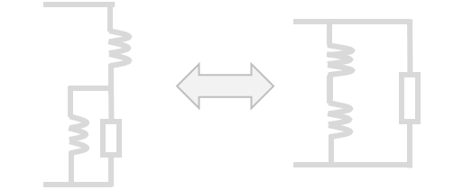
其中$p=\frac{C_1}{C_1+C_2}=\frac{L_2}{L_1+L_2}$称为**接入系数**，注意电容和电感是反过来的。本质上就是先并转串，然后再整体串转并。

### 网络参量

#### 网络参量矩阵的定义
首先是$zyhg$ 矩阵：

$$
\begin{bmatrix}
v_1 \\\\
v_2
\end{bmatrix}=\begin{bmatrix}
z_{11}&z_{12} \\\\
z_{21}&z_{22}
\end{bmatrix}\begin{bmatrix}
i_1\\\\
i_2
\end{bmatrix}\quad\begin{bmatrix}
i_1 \\\\
i_2
\end{bmatrix}=\begin{bmatrix}
y_{11}&y_{12} \\\\
y_{21}&y_{22}
\end{bmatrix}\begin{bmatrix}
v_1\\\\
v_2
\end{bmatrix}
$$

$$
\begin{bmatrix}
v_1 \\\\
\textcolor{cyan}{i_2}
\end{bmatrix}=\begin{bmatrix}
h_{11}&h_{12} \\\\
\textcolor{cyan}{h_{21}}&h_{22}
\end{bmatrix}\begin{bmatrix}
\textcolor{cyan}{i_1}\\\\
v_2
\end{bmatrix}\quad\begin{bmatrix}
i_1 \\\\
v_2
\end{bmatrix}=\begin{bmatrix}
g_{11}&g_{12} \\\\
g_{21}&g_{22}
\end{bmatrix}\begin{bmatrix}
v_1\\\\
i_2
\end{bmatrix}
$$

其中$z$和$y$两个矩阵是容易记忆的，和我们熟悉的**欧姆定律**是一致的；$h$和$g$比较难以记忆。

!!!tip "记忆方法"
    如上公式中$\textcolor{cyan}{青色}$标注。只要记住**$P_{ij}$元素对应着$i$端口受到$j$端口的作用**，如$\textcolor{cyan}{h_{21}}$表示$2$端口受到$1$端口的作用，从而对应着“放大器”。而$h$矩阵是**混**合矩阵，由于**混**是**氵**旁，和电流的**流**一样，所以**混**合矩阵对应着**电流**放大器，自然$\textcolor{cyan}{h_{21}}$就对应着**电流放大系数**，即$\textcolor{cyan}{i_2}$受到$\textcolor{cyan}{i_1}$的作用。当然，也可以用**hi**和**gv**两个词来记住这两个矩阵，原理是类似的。**hi**是打招呼的意思，**gv**我也不知道是什么（x

然后是ABCD矩阵：

$$
\begin{bmatrix}
v_1 \\\\
i_1
\end{bmatrix}=\begin{bmatrix}
A&B \\\\
C&D
\end{bmatrix}\begin{bmatrix}
v_2\\\\
\textcolor{yellow}{-i_2}
\end{bmatrix}
$$
这里又有一个初学难以理解的点：这个$\textcolor{yellow}{-i_2}$的负号如何理解。

正如这张图所示，zyhg矩阵研究的是$\{v_1\,,v_2\,,i_1\,,i_2\}$之间的关系，而ABCD矩阵研究的则是$\{v_{in}\,,i_{in}\,,v_{out}\,,i_{out}\}$之间的关系。根据图中定义不难发现$i_{out}=\textcolor{yellow}{-i_2}$。也就是说，**ABCD矩阵本质的定义其实是**

$$
\begin{bmatrix}
v_{in} \\\\
i_{in}
\end{bmatrix}=\begin{bmatrix}
A&B \\\\
C&D
\end{bmatrix}\begin{bmatrix}
v_{out}\\\\
i_{out}
\end{bmatrix}
$$
#### 复合网络的参量矩阵
这样定义的好处是，如果我们考虑两个级联的系统，那么就有**“级联ABCD相乘”**。

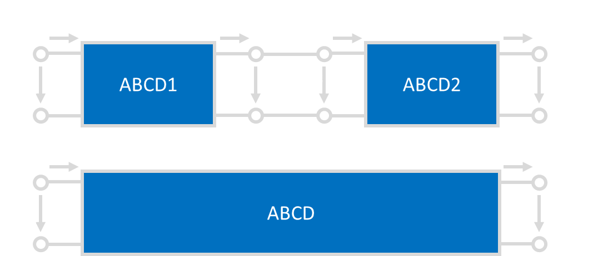
$$
\begin{aligned}
\begin{bmatrix}
v_{in} \\\\
i_{in}
\end{bmatrix}&=\begin{bmatrix}
A_1&B_1 \\\\
C_1&D_1
\end{bmatrix}\begin{bmatrix}
v_{out1}\\\\
i_{out1}
\end{bmatrix}\\\\&=\begin{bmatrix}
A_1&B_1 \\\\
C_1&D_1
\end{bmatrix}\begin{bmatrix}
v_{in2}\\\\
i_{in2}
\end{bmatrix}\\\\
&=\begin{bmatrix}
A_1&B_1 \\\\
C_1&D_1
\end{bmatrix}\begin{bmatrix}
A_2&B_2 \\\\
C_2&D_2
\end{bmatrix}\begin{bmatrix}
v_{out}\\\\
i_{out}
\end{bmatrix}
\end{aligned}
$$
因此
$$
\begin{bmatrix}
A&B \\\\
C&D
\end{bmatrix}=\begin{bmatrix}
A_1&B_1 \\\\
C_1&D_1
\end{bmatrix}\begin{bmatrix}
A_2&B_2 \\\\
C_2&D_2
\end{bmatrix}
$$

用类似的方法可以推导经典的口诀：**“串串相连z相加，并并相连y相加，串并相连h相加，并串相连g相加”。**
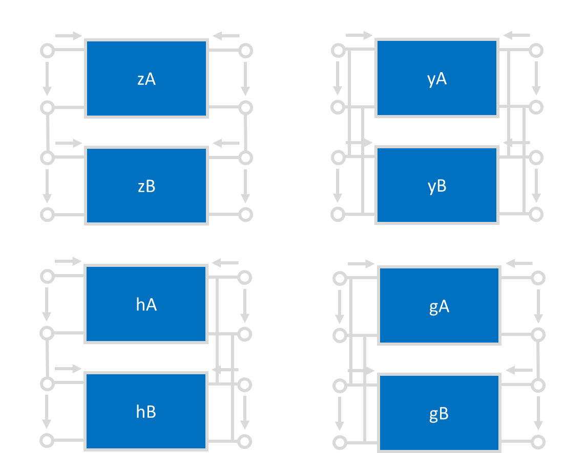
以h矩阵为例，上图中不难发现
$$
i_{1A}=i_{1B}\,,v_{2A}=v_{2B}\,,
$$
同时又有
$$
v_1=v_{1A}+v_{1B}\,,i_2=i_{2A}+i_{2B}\,,
$$
所以
$$
\begin{aligned}
\begin{bmatrix}
v_1\\\\ i_2
\end{bmatrix}&=
\begin{bmatrix}
v_{1A}\\\\ i_{2A}
\end{bmatrix}+\begin{bmatrix}
v_{1B}\\\\ i_{2B}
\end{bmatrix}
\\\\
&=\begin{bmatrix}
h_{11A}&h_{12A}\\\\
h_{21A}&h_{22A}
\end{bmatrix}\begin{bmatrix}
i_1\\\\ v_2
\end{bmatrix}
+\begin{bmatrix}
h_{11B}&h_{12B}\\\\
h_{21B}&h_{22B}
\end{bmatrix}\begin{bmatrix}
i_1\\\\ v_2
\end{bmatrix}\\\\
&=\begin{bmatrix}
h_{11A}+h_{11B}&h_{12A}+h_{12B}\\\\
h_{21A}+h_{21B}&h_{22A}+h_{22B}
\end{bmatrix}\begin{bmatrix}
i_1\\\\ v_2
\end{bmatrix}
\end{aligned}
$$
进而$h=h_A+h_B\,.$用类似方法不难证明剩下三种情况，在此略过。
#### 常用网络的参量矩阵
首先是常用的串臂电阻和并臂电导，也就是挂在嘴边的"1z01, 10y1"。如下图：
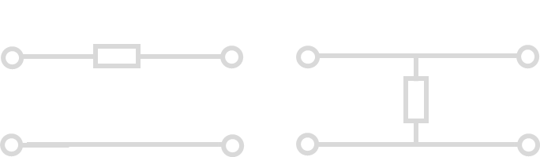
两个电路的ABCD参量分别为
$$
ABCD_\text{串臂}=\begin{bmatrix}
1 & Z\\\\
0 & 1
\end{bmatrix}\,,ABCD_\text{并臂}=\begin{bmatrix}
1 & 0\\\\
Y & 1
\end{bmatrix}
$$
记住这一点结合之前提到的**“级联ABCD相乘”**，可以快速计算梯形网络的ABCD矩阵，进而得到很多性质。这两个网络的zyhg矩阵也很重要,应当记忆。
$$
Z_\text{串臂}=\begin{bmatrix}
Z & Z\\\\
Z & Z
\end{bmatrix}\,,Z_\text{并臂}不存在\,;
$$
$$
Y_\text{串臂}不存在\,,Y_\text{并臂}=\begin{bmatrix}
Y & Y\\\\
Y & Y
\end{bmatrix}\,;
$$

然后是同样常见的线性受控源模型。利用戴维南-诺顿定理不难证明下列电路的等价性。

#### 网络参量的物理意义
直接观察矩阵的形式不利于初学者理解网络参量各个元素的物理意义，因此我们不妨把矩阵展开。以h参量为例：
$$
\begin{bmatrix}
v_1\\\\ i_2
\end{bmatrix}=
\begin{bmatrix}
h_{11} & h_{12}\\\\
h_{21} & h_{22}
\end{bmatrix}
\begin{bmatrix}
i_1\\\\ v_2
\end{bmatrix}
$$
展开得到
$$
\begin{cases}
v_1=h_{11}i_1+h_{12}v_2\\\\
i_2=h_{21}i_1+h_{22}v_2
\end{cases}
$$
从而

$$
\begin{cases}
h_{11}=\frac{v_1}{i_1} \big |_{v_2=0}\quad v_2置0时的输入阻抗\\\\
h_{22}=\frac{i_2}{v_1} \big |_{i_1=0}\quad i_1置0时的输出导纳\\\\
h_{21}=\frac{i_2}{i_1} \big |_{v_2=0}\quad v_2置0时的电流放大系数\\\\
h_{22}=\frac{i_2}{v_2} \big |_{i_1=0}\quad i_1置0时的电压反馈系数
\end{cases}
$$

对于剩下三个矩阵也是类似的原理：11元素是输入xx，22元素是输出xx，21元素是xx放大系数，12元素是xx反馈系数。常见用途是**输入输出阻抗公式**：
$$
\begin{cases}
w_{in}=p_{11}-\frac{p_{12}p_{21}}{p_{22}+w_L}\\\\
w_{out}=p_{22}-\frac{p_{21}p_{12}}{p_{11}+w_S}
\end{cases}
$$
这里$p\in\{z,y,h,g\}$, $w$根据量纲为对应的阻抗或导纳。注意输入输出阻抗的定义如下图：

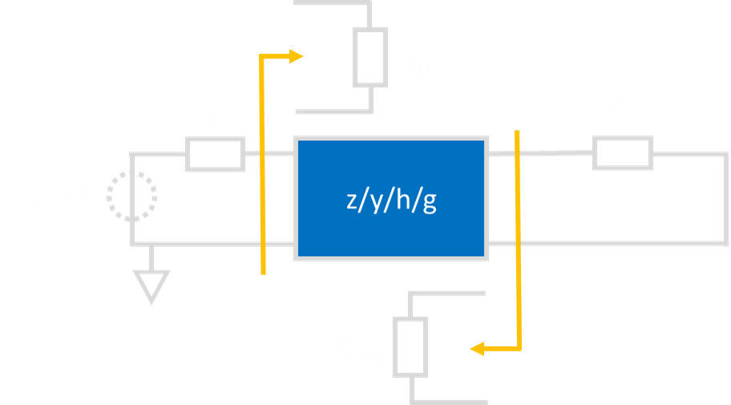

有了这一点之后可以记忆一个也很常用的公式：**基于zyhg矩阵给出传递函数。**

首先对于单向网络$p_{12}=0$,传递函数是容易写出的。还是以h矩阵为例，考虑这样的电路：

那么上图中的传递函数可以简单写成
$$
\begin{aligned}
H_{单向}=\frac{v_L}{v_S}&=\textcolor{yellow}{\frac{i_{in}}{v_S}}\cdot
\textcolor{cyan}{\frac{i_{out}}{i_{in}}}\cdot\textcolor{pink}{\frac{v_L}{i_{out}}}\\\\
&=\textcolor{yellow}{\frac{1}{R_S+h_{11}}}\cdot\textcolor{cyan}{-h_{21}}\cdot\textcolor{pink}{\frac{1}{h_{22}+G_L}}\\\\
&=\frac{-h_{21}}{(R_S+h_{11})(h_{22}+G_{L})}
\end{aligned}
$$
然后记住**双向化方法**，对于每一种矩阵，处理方法都是**在分母上减去$p_{12}p_{21}$**。即此例中
$$
H_{双向}=\frac{-h_{21}}{(R_S+h_{11})(h_{22}+G_{L})\textcolor{cyan}{-h_{12}h_{21}}}
$$
就可以随手推公式了。
??? note "为什么是分母上减去$p_{12}p_{21}$?"
    只需要画出信号流图就可以轻松解释。考虑如下系统：
    $$
    \begin{bmatrix}
    Y_1\\\\
    Y_2
    \end{bmatrix}
    =\begin{bmatrix}
    p_{11}&p_{12}\\\\
    p_{21}&p_{22}
    \end{bmatrix}\begin{bmatrix}
    X_1\\\\
    X_2
    \end{bmatrix}
    $$
    同时有来自testbench的约束

    $$
    \begin{cases}
    X_1+w_SY_1=x\\\\
    X_2+w_LY_2=0
    \end{cases}
    $$

    即

    $$
    \begin{cases}
    X_1=-w_SY_1+x\\\\
    X_2=-w_LY_2
    \end{cases}
    $$

    以$X_1\,,X_2\,,Y_1\,,Y_2$为中间变量，对应的信号流图就是

    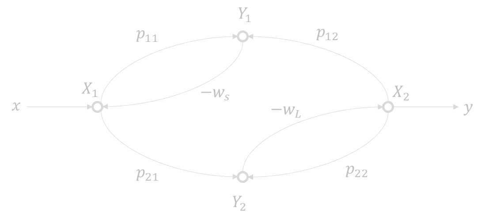
    不难写出其行列式为

    $$
    \begin{aligned}
    \Delta &= 1 - (-w_Sp_{11}) - (-w_Lp_{22})\\\\
    &\textcolor{red}{-p_{12}p_{21}w_Sw_L} + p_{11}p_{22}w_Sw_L
    \end{aligned}
    $$

    而单向化后的信号流图如下

    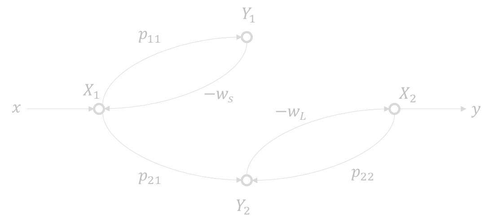

    其行列式为

    $$
    \Delta = 1 - (-w_Sp_{11}) - (-w_Lp_{22})+ p_{11}p_{22}w_Sw_L
    $$

    可知，$p_12$带来的贡献就是图中青色的这个回路。

    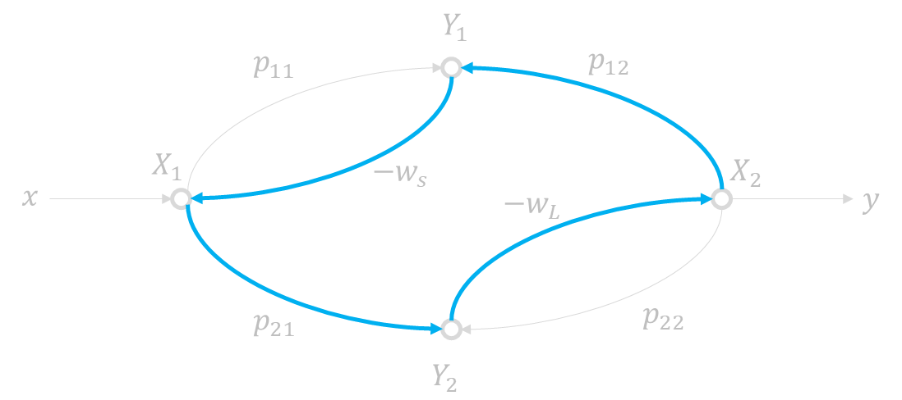

    该回路与其余两个回路都接触，和唯一的前向通路也接触，且此边不参与任何前向通路。因此根据Mason公式

    $$
    H=\frac{1}{\Delta}\sum_k g_k\Delta_k
    $$

    该边不影响分子，只改变分母.

    这也就解释了为什么求出单向网络传函之后只需要分母减去$p_{12}p_{21}$即可得到双向网络传递函数。
之前提到ABCD矩阵也有其意义，我们不妨同样地进行展开。
$$
\begin{bmatrix}
v_{in}\\\\ i_{in}
\end{bmatrix}
=\begin{bmatrix}
A & B\\\\
C & D
\end{bmatrix}\begin{bmatrix}
v_{out}\\\\ i_{out}
\end{bmatrix}
$$

$$
\begin{cases}
v_{in}=Av_{out}+Bi_{out}\\\\
i_{in}=Cv_{out}+Di_{out}
\end{cases}
$$

于是

$$
\begin{cases}
\frac{1}{A}=\frac{v_{out}}{v_{in}}\big |_{i_{out}=0}\quad本征电压增益A_{v0}=g_{21}\\\\
\frac{1}{D}=\frac{i_{out}}{v_{in}}\big |_{v_{out}=0}\quad本征电流增益A_{i0}=-h_{21}\\\\
\frac{1}{C}=\frac{v_{out}}{i_{in}}\big |_{i_{out}=0}\quad本征跨阻增益R_{m0}=z_{21}\\\\
\frac{1}{B}=\frac{i_{out}}{i_{in}}\big |_{v_{out}=0}\quad本征跨导增益G_{m0}=-y_{21}
\end{cases}
$$

!!! question "ABCD参量求传函"
    这里一个小方法就是利用ABCD参量求梯形网络的传递函数，利用上面提到串臂并臂网络的ABCD参数结合电压增益$A_v=\frac 1 A$就可以轻松求得。例如下图中
    
??? success "Answers"
    可以轻松获得ABCD参量（注意我们只关心A元素）为
    $$
    \begin{aligned}
        \begin{bmatrix}
        A & B \\\\
        C & D
        \end{bmatrix}
        &=\begin{bmatrix}
        1 & \frac{1}{sC_1}\\\\
        0 & 1
        \end{bmatrix}\begin{bmatrix}
        1 & 0\\\\
        \frac{1}{R_1} & 1
        \end{bmatrix}\begin{bmatrix}
        1 & R_2\\\\
        0 & 1
        \end{bmatrix}\begin{bmatrix}
        1 & 0\\\\
        sC_2 & 1
        \end{bmatrix}\\\\
        &=\begin{bmatrix}
        1+\frac{1}{sC_1R_1} & \frac{1}{sC_1}\\\\
        \star & \star
        \end{bmatrix}\begin{bmatrix}
        1+sC_2R_2 & \star \\\\
        sC_2 & \star
        \end{bmatrix}\\\\
        &=\begin{bmatrix}
        1+\frac{C_2R_2}{C_1R_1}+\frac{1}{sC_1R_1}+sC_2R_2+\frac{C_2}{C_1} & \star \\\\
        \star & \star
        \end{bmatrix}
    \end{aligned}
    $$
    进而电压传递函数
    $$
    \begin{aligned}
    H&=A_v=\frac{1}{A}\\\\
    &=\frac{1}{ 1+\frac{C_2R_2}{C_1R_1}+\frac{1}{sC_1R_1}+sC_2R_2+\frac{C_2}{C_1}}\,.
    \end{aligned}
    $$
    比KCL/KVL要快很多。
### 时域分析与三/五要素法
!!!tip "说明"
    电电重点分析1阶和2阶系统，主要是由于**代数基本定理**，即在实数范围内任何一个多项式都可以分解成若干一阶、二阶式之积的形式；对应到系统函数，则意味着一个高阶系统的表现其实可以看做若干一阶（指数衰减）和二阶（正弦振荡）系统之组合（“模式”），因此只需要弄懂了这两种情况，在此向上提高阶数并不会带来本质的提升。

由于是电子电路与系统{==基础==}，因此这一部分主要记忆公式为主，比如三五要素法。相较于通过Laplace变换强硬求解的信号与系统，电电更强调电路直觉和几个“要素”的求解。

#### 传函和冲激响应
!!!tip "注意"
    原则上这里属于[《信号与系统》](https://www.jiangwt.org/docs-html/notes/ss/)的内容，《电电》课不需要掌握。我可能也写不完，反正先放在这。

一个系统的冲激响应和其传递函数互为Laplace变换对。如何理解呢？
这是因为在时域中，单位冲激函数 $\delta(t)$ 作用于系统后，输出就是系统的冲激响应 $h(t)$，所以系统的输入输出关系为：

$$
y(t) = h(t) * \delta(t) = h(t)
$$
对两边取拉普拉斯变换：

$$
Y(s) = H(s) \cdot \mathcal{L}\{\delta(t)\} = H(s) \cdot 1 = H(s)
$$
因此，系统对冲激函数的响应 $ h(t) $ 与传递函数 $ H(s) $ 满足：

$$
H(s) = \mathcal{L}\{h(t)\}
\quad \text{以及} \quad
h(t) = \mathcal{L}^{-1}\{H(s)\}
$$

#### 状态方程法
列状态方程的通用方法：用恒压源替代电容，恒流源替代电感，求电容电流和电感电压。此后根据

$$
\frac{\text{d}}{\text{d}t}\begin{bmatrix}
v_C\\\\
i_L
\end{bmatrix}=\begin{bmatrix}
\frac{1}{C}i_C\\\\
\frac{1}{L}v_L
\end{bmatrix}=A\begin{bmatrix}
v_C\\\\
i_L
\end{bmatrix}+B
$$

求解即可。考试一般要求矩阵$A$和向量$B$，这里都通过电路方法（第二个等号）来求就可以了。

!!! question "状态方程列写"
    列出求解下面的电路所用的状态方程。
    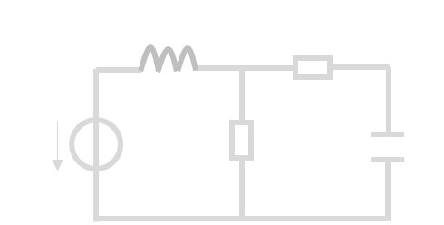
    
??? success "答案"
    首先利用戴维南-诺顿轻松写出$i_C\,,v_L$关于$v_C\,,i_L$的表达式
    $$
    \begin{cases}
    i_C=\frac{i_LR_1-v_C}{R_1+R_2}\\\\
    v_L=V_S-(v_c\frac{R_1}{R_1+R_2}-i_L(R_1\parallel R_2))
    \end{cases}
    $$
    整理为

    $$
    \begin{aligned}
    \frac{\text{d}}{\text{d}t}\begin{bmatrix}
        v_C\\\\
        i_L
    \end{bmatrix}&=\begin{bmatrix}
    \frac{1}{C}i_C\\\\
    \frac{1}{L}v_L
    \end{bmatrix}\\\\
    &=\frac{1}{R_1+R_2}\begin{bmatrix}
    \frac{-1}{C} & \frac{R_1}{C} \\\\
    \frac{-R_1}{L} & \frac{R_1R_2}{L}
    \end{bmatrix}\begin{bmatrix}
    v_C\\\\
    i_L
    \end{bmatrix}+\begin{bmatrix}
    0\\\\
    V_S - \frac{R_1}{R_1+R_2}
    \end{bmatrix}
    \end{aligned}
    $$

#### 三要素法
一阶系统的传递函数表达式总是为
$$
X(j\omega)=\frac{\cdots}{1+\omega\tau}
$$
的形式，其对应的时域表达式必然为【由于未学ss，此处不必深究】
$$
x(t)=\left(\textcolor{yellow}{x(0)}-\textcolor{yellow}{x_\infty(0)}\right)\exp\left(-\frac{t}{\textcolor{cyan}{\tau}}\right)+x_\infty(t)
$$
其中需要关注

|物理量|意义|
|---|---|
|$\textcolor{cyan}{\tau}$|时间常数，来自传函或RC/GL|
|$\textcolor{yellow}{x(0)}$|初值|
|$\textcolor{yellow}{x_\infty(t)}$|稳态响应|

注意这里$\textcolor{cyan}{\tau}$一般可以通过RC和GL来求，其中R就是电容“看到”的电阻，G就是电感“看到”的电导。

#### 五要素法

对于二阶系统应当采用五要素法。五要素法的形式比较难背，长成这样：

**欠阻尼情形**$\xi<1$

$$
\begin{aligned}
x(t)&=x_\infty(t)+\left(x(0)-x_\infty(0)\right)\exp\left(-\xi\omega_0t\right)\cos\left(\sqrt{1-\xi^2}\omega_0t\right)\\\\
&+\left(x(0)-x_\infty(0)+\frac{\dot{x}(0)-\dot{x_\infty}(0)}{\xi\omega_0}\right)\\\\
&\cdot\frac{\xi}{\sqrt{1-\xi^2}}\exp\left(-\xi\omega_0t\right)\sin\left(\sqrt{1-\xi^2}\omega_0t\right)
\end{aligned}
$$

**临界阻尼**$\xi=1$

$$
\begin{aligned}
x(t)&=x_\infty(t)+\left(x(0)-x_\infty(0)\right)\exp\left(-\omega_0t\right)\\\\
&+\left(x(0)-x_\infty(0)+\frac{\dot{x}(0)-\dot{x_\infty}(0)}{\omega_0}\right)\exp\left(-\omega_0t\right)\omega_0t
\end{aligned}
$$

**过阻尼**$\xi>1$

$$
\begin{aligned}
x(t)&=x_\infty(t)+\left(x(0)-x_\infty(0)\right)\exp\left(-\xi\omega_0t\right)\cosh\left(\sqrt{\xi^2-1}\omega_0t\right)\\\\
&+\left(x(0)-x_\infty(0)+\frac{\dot{x}(0)-\dot{x_\infty}(0)}{\xi\omega_0}\right)\\\\
&\cdot\frac{\xi}{\sqrt{1-\xi^2}}\exp\left(-\xi\omega_0t\right)\sinh\left(\sqrt{\xi^2-1}\omega_0t\right)
\end{aligned}
$$

!!!tip "记忆方法"
    看似很难其实记忆难度一般。首先式子都很规律，$\exp$后面跟的都是$-\xi\omega_0t$, (反)三教函数后面都是$\sqrt{1-\xi^2}$。前面括弧里边的东西都是**初值-稳态初值**，$\sin$前面的多一个微分的。每天默念几遍即可背诵。

特别对于过阻尼情形，我们需要把他编成**长寿+短寿**的形式
$$
x(t)=x_\infty(t)+A\exp-\lambda_1 t + B\exp-\lambda_2 t
$$
其中

$$
\begin{cases}
A=\frac{\lambda_2}{\lambda_2-\lambda_1}(x(0)-x_\infty(0))-\frac{1}{\lambda_2-\lambda_1}(\dot{x}(0)-\dot{x}_\infty(0))\\\\
B=\frac{\lambda_1}{\lambda_1-\lambda_2}(x(0)-x_\infty(0))-\frac{1}{\lambda_1-\lambda_2}(\dot{x}(0)-\dot{x}_\infty(0))\\\\
\lambda_{1\,,2}=(-\xi\pm\sqrt{\xi^2-1})\omega_0
\end{cases}
$$

而五要素就是指

| 阻尼系数 | 自由震荡频率 | 初值 | 微分初值 | 稳态响应 |
|-------|------------|------|------|------|
| $\xi$ | $\omega_0$ | $x(0)$ | $\dot{x_0}$ | $x_\infty(t)$ |

其中$\xi$和$\omega_0$由传递函数给出。随便写电路中两个离得远一点的量作为输入输出写一个传递函数，就可以得到
$$
H=\frac{*}{s^2+2\xi\omega_0s+\omega_0^2}
$$
这里边就可以得到上述两要素。稳态响应$x_\infty(t)$由输入的性质（冲激/阶跃激励的响应是直流，正弦的响应是改了相位和幅度的正弦）得到。有人曰：
!!! quote "稳态响应"
    人生的稳态响应是一盒灰

三要素法和五要素法的公式都是简单的，但用起来最难求的也是最“值钱”的就是**初值和微分初值**，需要在$0-\to 0+$时刻进行精细的分析。例如下面这个例子。

!!! question "三五要素法例题"
    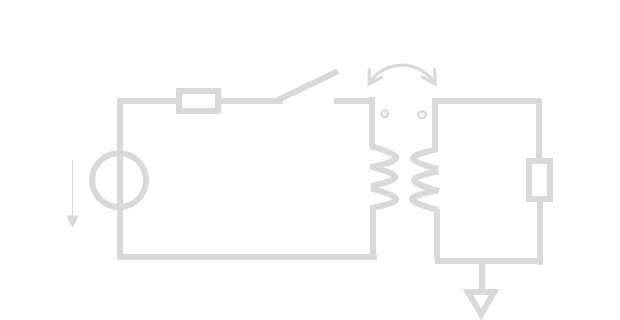已知互感变压器的$k<1$, $L_1=1\mu H$, $L_2=4\mu H$, $M=0.8\mu H$, $R_L = 1k\Omega$, $R_S = 100\Omega$, $V_{S0}=5V$.试求$v_0(t)$, 若

    1. $t<0$时开关闭合且电路稳定，$t=0$时断开开关。
    2. $t<0$时开关断开且电路稳定，$t=0$时闭合开关。
    
??? success "**第1问**答案"

    由互感变压器的h参量等效模型（漏磁-励磁模型）将电路等效为

    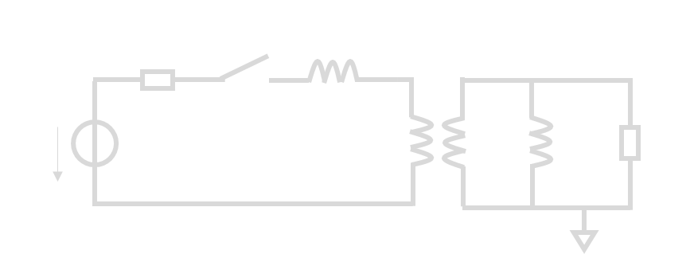

    然后利用阻抗变换将右侧甩到左侧

    $$
    \begin{cases}
        L_2'=\left(\frac{M}{L_2}\right)^2L_2=\frac{M^2}{L_2}\\\\
        R_L'=\left(\frac{M}{L_2}\right)^2R_L=\frac{M^2}{L_2^2}R_L
    \end{cases}
    $$

    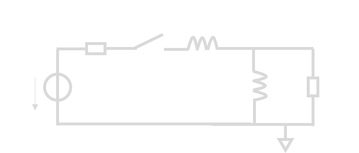

    断开开关后实际上有效的只有右侧的$R_L'\,,L_2'$，电路为二阶电路。因此不难得到三要素

    $$
    \begin{cases}
    v_o'=-\frac{V_{S0}}{R_S}R_L'=-\frac{M^2V_{S0}}{R_SL_2'}R_L\\\\
    v'_{o\infty}(t)=0\\\\
    \tau=GL=\frac{L_2'}{R_L'}=\frac{L_2}{R_L}
    \end{cases}
    $$

    带入三要素法公式结合$v_o=\frac{L_2}{M}v_o'$得到

    $$
    v_o(t)=-10V\cdot\exp\left(-\frac{t}{4\times 10^{-9}s}\right)
    $$

??? success "**第二问**答案"

    强行令两侧共地并带入互感变压器的Z参量模型（T型模型）等效。得到电路为
    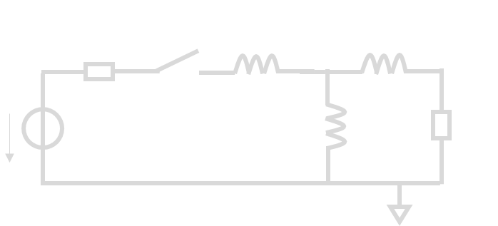

    这时看起来电路为三阶。但由于三个电感的带内容有耦合关系
    $$
    i_A=i_B+i_C
    $$
    因此电路实际为二阶。我们求解其五要素。首先利用梯形网络计算$V_s\to v_o$的传递函数以获得系统参数。我们采用之前的ABCD方法。

    $$
    \begin{aligned}
    ABCD&=\begin{bmatrix}
    1 & R_S \\\\
    0 & 1
    \end{bmatrix}\begin{bmatrix}
    1 & s(L_1-M)\\\\
    0 & 1
    \end{bmatrix}
    \begin{bmatrix}
    1 & 0 \\\\
    \frac{1}{sM} & 1
    \end{bmatrix}
    \begin{bmatrix}
    1 & s(L_2-M) \\\\
    0 & 1
    \end{bmatrix}
    \begin{bmatrix}
    1 & 0 \\\\
    \frac{1}{R_L} & 1
    \end{bmatrix}\\\\
    &=\cdots (数学运算略去，打矩阵太麻烦了。)\\\\
    &=\begin{bmatrix}
    1.25+1.25\times 10^8s^{-1} & 100+2\times10^{-7}s \\\\
    * & *
    \end{bmatrix}\begin{bmatrix}
    1+3.2\times 10^{-9}s & * \\\\
    10^{-3} & *
    \end{bmatrix}\\\\
    &=\begin{bmatrix}
    1.75+4.2\times 10^{-9}s+1.25\times 10^8s^{-1} & * \\\\
    * & *
    \end{bmatrix}
    \end{aligned}
    $$ 

    于是得到
    $$
    H_v = \frac{*}{s^2 + 4.17\times 10^{8}s + 2.98\times 10^{16}}
    $$

    进而
    $$
    \omega_0=1.73\times 10^8 S^{-1}\quad,\,\xi = 1.21
    $$
    可知此系统为**过阻尼**系统。从而得到
    $$
    \lambda_1=-9.17\times 10^7\,,\lambda_2=-3.27\times 10^8
    $$
    先放着。我们接下来根据电路的物理特性求剩下的参数。显然有$v_o(0)=0$和$v_{o\infty}(0)=0$。本题的难点在于求$\dot{v}_o(0)$.我们注意到**基尔霍夫定律对于微分后的电路依然适用**，因此

    $$
    \begin{aligned}
    \dot{v}_o(0)&=\dot{i}_C(0)R_L\\\\
    &=(\dot{i}_A(0)-\dot{i}_B(0))R_L\quad(KCL)\\\\
    &=\left(\frac{V_{S0}}{L_1-M}-\frac{0}{M}\right)R_L\\\\
    &=2.5\times 10^{10}V/S
    \end{aligned}
    $$

    进而利用

    $$
    \begin{cases}
    A=\frac{\lambda_2}{\lambda_2-\lambda_1}(x(0)-x_\infty(0))-\frac{1}{\lambda_2-\lambda_1}(\dot{x}(0)-\dot{x}_\infty(0))\\\\
    B=\frac{\lambda_1}{\lambda_1-\lambda_2}(x(0)-x_\infty(0))-\frac{1}{\lambda_1-\lambda_2}(\dot{x}(0)-\dot{x}_\infty(0))
    \end{cases}
    $$

    得到

    $$
    \begin{cases}
    A=106.3\\\\
    B=-106.3
    \end{cases}
    $$

    从而

    $$
    \begin{aligned}
    v_o(t)&=106.3V\cdot\exp\left(-9.17\times10^{-7}s^{-1}t\right)\\\\
    &-106.3V\cdot\exp\left(-3.27\times10^{-8}s^{-1}t\right)
    \end{aligned}
    $$

### 频域分析
#### 伯特图画法
伯特图是对数对数坐标下近似的幅频特性和相频特性图，属于必考但送分的内容。方法如下。

**第一步**：求出传递函数并因式分解。得到形如
$$
H(s)=A_0\frac{(s+\omega_{z1})(s+\omega_{z2})\cdots(s+\omega_{zm})}{(s+\omega_{p1})(s+\omega_{p2})\cdots(s+\omega_{pn})}
$$
的形式。其中$s_z=-\omega_{z1}\,,\cdots\,,-\omega_{zm}$称之为零点，可在整个复平面；$s_p=-\omega_{p1}\,,\cdots\,,-\omega_{pn}$称之为极点，要求{==必须在左半平面==},否则系统将自激震荡或不收敛。最后得到
$$
H(j\omega)=H_0\frac{\left(1+\frac{j\omega}{\omega_{z1}}\right)\left(1+\frac{j\omega}{\omega_{z2}}\right)\cdots\left(1+\frac{j\omega}{\omega_{zm}}\right)}{\left(1+\frac{j\omega}{\omega_{p1}}\right)\left(1+\frac{j\omega}{\omega_{p2}}\right)\cdots\left(1+\frac{j\omega}{\omega_{pn}}\right)}
$$
这里用到了求频率特性时的代换$s=j\omega$。

**第二步**：将零极点按照大小排序，然后按照频率从$0$开始往右走。依据如下口诀作图：
- 幅频：碰到极点$-20$(dB/10倍频程)，碰到零点$+20$(dB/10倍频程).
- 相频：极点滞后$90^\circ$，零点看左右，左超右滞$90^\circ$.作图的时候认为$\varphi$关于$\log\omega$在$0.1\omega\to10\omega$范围内线性完成超前/滞后。

!!! question "伯特图例题"
    已知$H(j\omega)=-10^6\frac{j\omega+5\times 10^9}{(j\omega+5\times 10^6)(j\omega + 1\times 10^8)}$,作出伯特图。

??? success "答案"

    $$
    \begin{aligned}
    H(j\omega)&=-10^6\frac{1+\frac{j\omega}{5\times 10^4}}{\left(1+\frac{j\omega}{5\times10^6}\right)\left(1+\frac{j\omega}{1\times10^8}\right)}\cdot\frac{5\times 10^9}{5\times 10^6\cdot 1\times 10^8}\\\\
    &=(-10)\frac{1+\frac{j\omega}{5\times 10^4}}{\left(1+\frac{j\omega}{5\times10^6}\right)\left(1+\frac{j\omega}{1\times10^8}\right)}
    \end{aligned}
    $$

    列出零极点为

    $$
    \begin{cases}
    零点\quad -5\times 10^9\\\\
    极点\quad -5\times 10^6\,,-1\times10^8
    \end{cases}
    $$

    进而绘制幅频相频特性为

    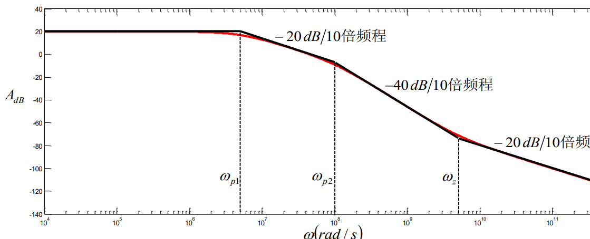
    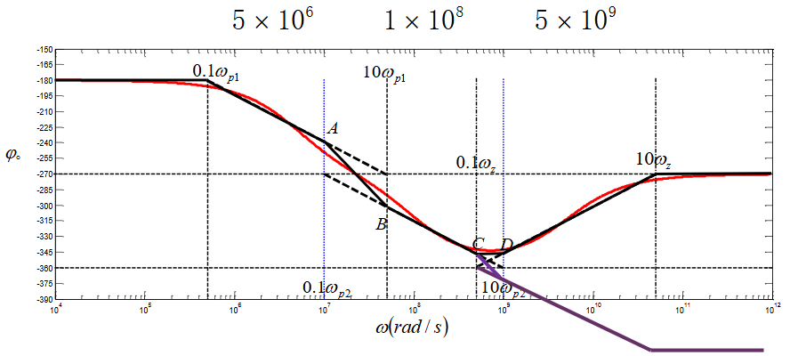

#### 滤波器特性分析

这一部分首先要掌握3dB的概念。3dB即为$H(s)=\frac{H_0}{\sqrt 2}$，对应可以定义3dB频点、3dB带宽等概念。

一阶系统的3dB频点是$\frac{1}{\tau}$，其中$\tau$是时间常数。

二阶系统一般关注3dB点、平坦性质和谐振峰特性。

**3dB频点**

低通系统：

$$
\omega_{3dB}=\begin{cases}
\omega_0\,,\xi=0.707\\\\
\frac{1}{2\xi}\,,\xi\gg1\quad(\frac{1}{\tau_{RC}}=\frac{1}{RC})\\\\
\sqrt{1+\sqrt 2}\omega_0=1.554\omega_0\,,\xi\ll1
\end{cases}
$$

高通系统：

$$
\omega_{3dB}=\begin{cases}
\omega_0\,,\xi=0.707\\\\
2\xi\,,\xi\gg1\quad(\frac{1}{\tau_{GL}}=\frac{R}{L})\\\\
\frac{\omega_0}{1.554}\,,\xi\ll1
\end{cases}
$$

带通（带阻）系统：

$$
\begin{cases}
BW_{3dB}=f_2-f_1=\frac{f_0}{Q}\\\\
f_0 = \sqrt{f_1f_2}=\frac{\omega_0}{2\pi}
\end{cases}
$$

其中
$$
Q=\frac{1}{2\xi}=\frac{Z_0}{R}=\frac{Y_0}{G}
$$

**平坦性质**(最优二阶系统)

|$\xi$|平坦性质|
|----|----|
| 0.707 | 幅度最大平坦【巴特沃斯】|
|0.866 | 群延时最大平坦 【贝塞尔】|
|0.707~1|最有二阶高低通系统，较快阶跃响应|

**谐振峰** 

谐振现象在时域体现为**振铃**现象，经过Q个周期，振铃幅度衰减为4.3%以下；经过1.5Q个周期，振铃幅度衰减为1%以下；经过2.2Q个周期，振铃幅度衰减为0.1%以下。一般认为振铃时间就是1.5QT。

对于低通系统，其谐振频点
$$
\omega_e=\sqrt{1-2\xi^2}\omega_0\approx\omega_0\quad(\xi\ll0.707)
$$
峰高度
$$
A(\omega_e)=\frac{1}{2\xi\sqrt{1-\xi^2}}>1\quad(\xi<0.707)
$$
特别对于$\xi\ll0.707$有$A(\omega_e)\approx Q$.

对于低通系统，其谐振频点
$$
\omega_e= \frac{1}{\sqrt{1-2\xi^2}}\omega_0\approx\omega_0\quad(\xi\ll0.707)
$$
峰高度
$$
A(\omega_e)=\frac{1}{2\xi\sqrt{1-\xi^2}}>1\quad(\xi<0.707)
$$
特别对于$\xi\ll0.707$有$A(\omega_e)\approx Q$.

当发生谐振时，$Z$和$Y$为实数，即$\Im [Z]=0\,,\Im[Y]=0$。此时并联LC等效为开路，串联LC等效为短路。

#### 信号通路法和开短路时间常数法
信号通路法是估计零点的方法。当两条不同属性的路径到达输出端时会产生零点，类似于增透增反膜。如下面这个例子
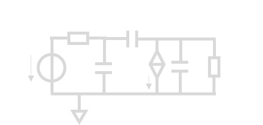
其中存在两条路径：

1. 输入-$g_m$-$R_L$(主通路)
2. 输入-$C_{bc}$-$R_L$

而路径1为反相，路径2为同相。两条路径的gm分别为
$$
g_{m1}=-g_m\,,g_{m2}=y_{21,C_{bc}}=sC_{bc}
$$
因此当$sC_{bc}=g_m$的时候会造成一个零点，此时$s=\frac{g_m}{C_{bc}}$.

开短路时间常数法用于估计极点。需要记住口诀
!!! important "口诀"
    高通开路频点法，低通短路时间法

开短路时间常数发用来近似分析比较复杂（阶数较高）的电路的截止频率。

- 低端3dB频点由{==高通电容==}（耦合电容和旁路电容）决定，使用开路时间常数法。此时有近似

$$
f_{l,3dB}=f_{o1}+f_{o2}+\cdots=\frac{1}{2\pi}\left(\frac{1}{C_1R_1}+\frac{1}{C_2R_2}+\cdots\right)
$$

- 高端3dB频点由{==低通电容==}（寄生电容）决定，使用短路时间常数法。此时有近似

$$
f_{h,3dB}=\frac{1}{2\pi(\tau_{s1}+\tau_{s2}+\cdots)}=\frac{1}{2\pi\left(R_1C_1+R_2C_2\cdots\right)}
$$

两种方法都是对应的量相差得越多，估计越准确。开路/短路的意思是，对每个“决定电容”（低端的高通和高端的低通），依次按住不动，开路/短路剩下所有的电容，将该电容大小$C_i$和{==该电容**看到**的电阻大小==}$R_i$带入上式中去。

### 系统分析
#### 小信号分析
小信号分析的本质就是利用**叠加原理**，分别考虑直流偏置和小信号的作用。也即利用Taylor展开
$$
f(x+\delta)=f(x)+\delta f'(x)+\cdots
$$
将所有的电路对小信号$\delta$的响应看成是一次的。式中$x$为所有的直流偏置源。《电电》课的小信号分析非常程式化，流程如下：

1. 分析直流偏置；
2. 将小信号模型带入分析小信号。

因此只要掌握常见元件如BJT，MOS的小信号模型就可以轻松拿捏。分析直流偏置的时候，应当保留大信号控制关系

$$
\begin{cases}
\beta I_B=I_C\\\\
v_{be}=0.7V\,or\,I_B=(\exp\frac{V_{be}}{V_T}-1)I_{S0}
\end{cases}\quad(BJT)\,,
\begin{cases}
g_m = 0\\\\
I_D = \beta_n V_{od}^2
\end{cases}(MOS)
$$

然后分析小信号模型使用小信号控制关系

$$
\begin{cases}
g_m = \frac{I_C}{v_T}\\\\
r_{be}=\frac{\beta}{g_m}\\\\
r_{ce}=\frac{V_A}{I_C}
\end{cases}\quad(BJT)\,,
\begin{cases}
g_m = \frac {2I_D}{V_{od}}=2\beta_n V_{od}{1+\frac{V_DS}{V_A}}\\\\
r_{ds} = \frac{V_A}{I_D}
\end{cases}(MOS)
$$

带入电路即可分析。注意分析小信号时，直流源要{==置0==}。

#### 负反馈分析

《电电》要求掌握分析负反馈的电路流程。首先**分析连接方式**：反馈网络直接连到放大网络的输入输出则为并联，否则为串联。然后**求开环放大器参量**，方法为*反馈网络画两边，放大网络画一遍*，然后输入端反馈源置0，输出端反馈负载置零（输出电压则开路，输出电流则短路）。然后**求反馈系数**（对反馈网络加x求y），最后带入$A=\frac{A_0}{1+T}$, $w_{in,c}=(1+T)w_{in,o}$, $w_{out,c}=(1+T)w_{out,o}$求出放大器的剩余参量即可。参考下面的例题。

!!! question "2024年T5"
    已知运放电压放大倍数$A_{v0}$和晶体管T的跨导$g_m$，计算该放大器的输入输出电阻和增益（认为晶体管T理想，$r_{bc}\,,r_{ce}$\to\infty$.）
    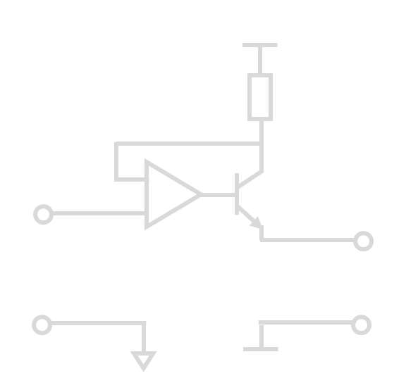

??? success "答案"
    首先分析该电路的连接方式。将其进行变形得到（注意$V_{CC}\,,V_{EE}$都是交流地）
    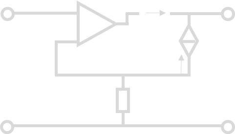

    因此这显然是一个**串串连接**，进而建模为**压控流源**。进一步分析开环放大器参数，使用*反馈网络画两边，放大网络画一遍*的方法并将输入侧反馈源置零，输出侧反馈载置零得到

    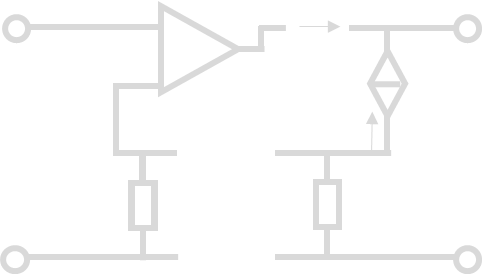

    计算输出阻抗时将输入电压置0，输出端加电压$v_{test}$得到

    

    此时运放被掐死了，因此电路等效为

    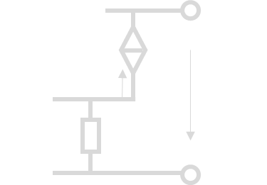

    进而$I_{test} = g_m v_{test}$, $r_{out,o}=\frac{1}{g_m}$.分析输入阻抗和跨导放大倍数时，短路输出，输入端加电压得到

    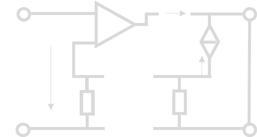

    不难算出$i_{out,o}=-g_mv_{in}A_{v0}$, 且$r_{in,o}=\infty$. 因此开环跨导$G_{m,o}=-g_mA_{v0}$.

    然后分析反馈网络，注意这是压控流源，因此反馈系数应当是跨阻$F=R_c$. 进而得到环路增益$T=-g_mR_cA_{v0}$.

    最后代入得到
    
    $$
    \begin{cases}
    R_{in,c}=(1+T)r_{in}=\infty\\\\
    R_{out,c}=(1+T)r_{out}=(1-g_mR_cA_{v0})\frac{1}{g_m}=A_{v0}R_C\\\\
    G_m = \frac{A_{v0}}{1+T}=-\frac{1}{R_C}
    \end{cases}
    $$

