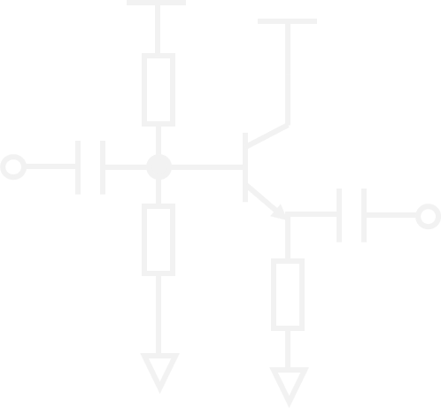
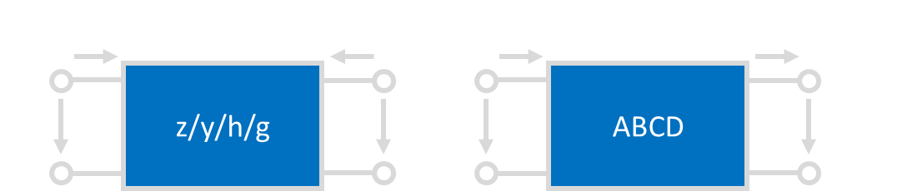
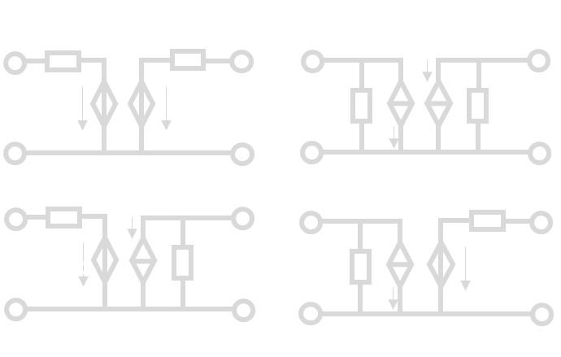

# 《电子电路与系统基础》学习参考
!!! info  "说明"
    先开个坑（）放张最喜欢的单管放大器镇楼。后面应该会同步写一下CAD教程
    {: style="display: block; margin: auto; width: 60%;" }
    （很大程度上）参考了\ycgg/的小班辅导讲义，感谢！这篇文章大概会按照元件器件和方法工具两条主线完成，感觉电电确实就是这么个逻辑

!!! tips "建议"
    目前感觉这个课最有效的方法是背背背+直觉，在大脑里建立又大又快的L1-cache。我当时学（2）的时候把所有的PPT都抄了2遍，差不多背下来了，能80%默写正课内容的程度，感觉对于应试还是非常有效的。考试的时候就直接顺着写了，甚至富裕30分钟。当然还是要提倡先做大题（）

## 元件与器件
《电电》涉及的元件器件主要有

1. 电阻电容电感，电流电压源，受控源
2. 二极管，运放
3. BJT，MOSFETS
## 方法与工具
方法和工具主要包括网络参量“小矩阵”（静态分析），三/五要素法（时域分析）和频域分析三个大类。
### 网络参量

#### 网络参量矩阵的定义
首先是$zyhg$ 矩阵：

$$
\begin{bmatrix}
v_1 \\\\
v_2
\end{bmatrix}=\begin{bmatrix}
z_{11}&z_{12} \\\\
z_{21}&z_{22}
\end{bmatrix}\begin{bmatrix}
i_1\\\\
i_2
\end{bmatrix}\quad\begin{bmatrix}
i_1 \\\\
i_2
\end{bmatrix}=\begin{bmatrix}
y_{11}&y_{12} \\\\
y_{21}&y_{22}
\end{bmatrix}\begin{bmatrix}
v_1\\\\
v_2
\end{bmatrix}
$$

$$
\begin{bmatrix}
v_1 \\\\
\textcolor{cyan}{i_2}
\end{bmatrix}=\begin{bmatrix}
h_{11}&h_{12} \\\\
\textcolor{cyan}{h_{21}}&h_{22}
\end{bmatrix}\begin{bmatrix}
\textcolor{cyan}{i_1}\\\\
v_2
\end{bmatrix}\quad\begin{bmatrix}
i_1 \\\\
v_2
\end{bmatrix}=\begin{bmatrix}
g_{11}&g_{12} \\\\
g_{21}&g_{22}
\end{bmatrix}\begin{bmatrix}
v_1\\\\
i_2
\end{bmatrix}
$$

其中$z$和$y$两个矩阵是容易记忆的，和我们熟悉的**欧姆定律**是一致的；$h$和$g$比较难以记忆。

!!!tip "记忆方法"
    如上公式中$\textcolor{cyan}{青色}$标注。只要记住**$P_{ij}$元素对应着$i$端口受到$j$端口的作用**，如$\textcolor{cyan}{h_{21}}$表示$2$端口受到$1$端口的作用，从而对应着“放大器”。而$h$矩阵是**混**合矩阵，由于**混**是**氵**旁，和电流的**流**一样，所以**混**合矩阵对应着**电流**放大器，自然$\textcolor{cyan}{h_{21}}$就对应着**电流放大系数**，即$\textcolor{cyan}{i_2}$受到$\textcolor{cyan}{i_1}$的作用。当然，也可以用**hi**和**gv**两个词来记住这两个矩阵，原理是类似的。**hi**是打招呼的意思，**gv**我也不知道是什么（x

然后是ABCD矩阵：

$$
\begin{bmatrix}
v_1 \\\\
i_1
\end{bmatrix}=\begin{bmatrix}
A&B \\\\
C&D
\end{bmatrix}\begin{bmatrix}
v_2\\\\
\textcolor{yellow}{-i_2}
\end{bmatrix}
$$
这里又有一个初学难以理解的点：这个$\textcolor{yellow}{-i_2}$的负号如何理解。
{: style="display: block; margin: auto; width: 60%;" }
正如这张图所示，zyhg矩阵研究的是$\{v_1\,,v_2\,,i_1\,,i_2\}$之间的关系，而ABCD矩阵研究的则是$\{v_{in}\,,i_{in}\,,v_{out}\,,i_{out}\}$之间的关系。根据图中定义不难发现$i_{out}=\textcolor{yellow}{-i_2}$。也就是说，**ABCD矩阵本质的定义其实是**

$$
\begin{bmatrix}
v_{in} \\\\
i_{in}
\end{bmatrix}=\begin{bmatrix}
A&B \\\\
C&D
\end{bmatrix}\begin{bmatrix}
v_{out}\\\\
i_{out}
\end{bmatrix}
$$
#### 复合网络的参量矩阵
这样定义的好处是，如果我们考虑两个级联的系统，那么就有**“级联ABCD相乘”**。

{: style="display: block; margin: auto; width: 60%;" }
$$
\begin{aligned}
\begin{bmatrix}
v_{in} \\\\
i_{in}
\end{bmatrix}&=\begin{bmatrix}
A_1&B_1 \\\\
C_1&D_1
\end{bmatrix}\begin{bmatrix}
v_{out1}\\\\
i_{out1}
\end{bmatrix}\\\\&=\begin{bmatrix}
A_1&B_1 \\\\
C_1&D_1
\end{bmatrix}\begin{bmatrix}
v_{in2}\\\\
i_{in2}
\end{bmatrix}\\\\
&=\begin{bmatrix}
A_1&B_1 \\\\
C_1&D_1
\end{bmatrix}\begin{bmatrix}
A_2&B_2 \\\\
C_2&D_2
\end{bmatrix}\begin{bmatrix}
v_{out}\\\\
i_{out}
\end{bmatrix}
\end{aligned}
$$
因此
$$
\begin{bmatrix}
A&B \\\\
C&D
\end{bmatrix}=\begin{bmatrix}
A_1&B_1 \\\\
C_1&D_1
\end{bmatrix}\begin{bmatrix}
A_2&B_2 \\\\
C_2&D_2
\end{bmatrix}
$$

用类似的方法可以推导经典的口诀：**“串串相连z相加，并并相连y相加，串并相连h相加，并串相连g相加”。**
{: style="display: block; margin: auto; width: 60%;" }
以h矩阵为例，上图中不难发现
$$
i_{1A}=i_{1B}\,,v_{2A}=v_{2B}\,,
$$
同时又有
$$
v_1=v_{1A}+v_{1B}\,,i_2=i_{2A}+i_{2B}\,,
$$
所以
$$
\begin{aligned}
\begin{bmatrix}
v_1\\\\ i_2
\end{bmatrix}&=
\begin{bmatrix}
v_{1A}\\\\ i_{2A}
\end{bmatrix}+\begin{bmatrix}
v_{1B}\\\\ i_{2B}
\end{bmatrix}
\\\\
&=\begin{bmatrix}
h_{11A}&h_{12A}\\\\
h_{21A}&h_{22A}
\end{bmatrix}\begin{bmatrix}
i_1\\\\ v_2
\end{bmatrix}
+\begin{bmatrix}
h_{11B}&h_{12B}\\\\
h_{21B}&h_{22B}
\end{bmatrix}\begin{bmatrix}
i_1\\\\ v_2
\end{bmatrix}\\\\
&=\begin{bmatrix}
h_{11A}+h_{11B}&h_{12A}+h_{12B}\\\\
h_{21A}+h_{21B}&h_{22A}+h_{22B}
\end{bmatrix}\begin{bmatrix}
i_1\\\\ v_2
\end{bmatrix}
\end{aligned}
$$
进而$h=h_A+h_B\,.$用类似方法不难证明剩下三种情况，在此略过。
#### 常用网络的参量矩阵
首先是常用的串臂电阻和并臂电导，也就是挂在嘴边的"1z01, 10y1"。如下图：
{: style="display: block; margin: auto; width: 60%;" }
两个电路的ABCD参量分别为
$$
ABCD_\text{串臂}=\begin{bmatrix}
1 & Z\\\\
0 & 1
\end{bmatrix}\,,ABCD_\text{并臂}=\begin{bmatrix}
1 & 0\\\\
Y & 1
\end{bmatrix}
$$
记住这一点结合之前提到的**“级联ABCD相乘”**，可以快速计算梯形网络的ABCD矩阵，进而得到很多性质。这两个网络的zyhg矩阵也很重要,应当记忆。
$$
Z_\text{串臂}=\begin{bmatrix}
Z & Z\\\\
Z & Z
\end{bmatrix}\,,Z_\text{并臂}不存在\,;
$$
$$
Y_\text{串臂}不存在\,,Y_\text{并臂}=\begin{bmatrix}
Y & Y\\\\
Y & Y
\end{bmatrix}\,;
$$

然后是同样常见的线性受控源模型。利用戴维南-诺顿定理不难证明下列电路的等价性。
{: style="display: block; margin: auto; width: 60%;" }
#### 网络参量的物理意义
直接观察矩阵的形式不利于初学者理解网络参量各个元素的物理意义，因此我们不妨把矩阵展开。以h参量为例：
$$
\begin{bmatrix}
v_1\\\\ i_2
\end{bmatrix}=
\begin{bmatrix}
h_{11} & h_{12}\\\\
h_{21} & h_{22}
\end{bmatrix}
\begin{bmatrix}
i_1\\\\ v_2
\end{bmatrix}
$$
展开得到
$$
\begin{cases}
v_1=h_{11}i_1+h_{12}v_2\\\\
i_2=h_{21}i_1+h_{22}v_2
\end{cases}
$$
从而

$$
\begin{cases}
h_{11}=\frac{v_1}{i_1} \big |_{v_2=0}\quad v_2置0时的输入阻抗\\\\
h_{22}=\frac{i_2}{v_1} \big |_{i_1=0}\quad i_1置0时的输出导纳\\\\
h_{21}=\frac{i_2}{i_1} \big |_{v_2=0}\quad v_2置0时的电流放大系数\\\\
h_{22}=\frac{i_2}{v_2} \big |_{i_1=0}\quad i_1置0时的电压反馈系数
\end{cases}
$$

对于剩下三个矩阵也是类似的原理：11元素是输入xx，22元素是输出xx，21元素是xx放大系数，12元素是xx反馈系数。有了这一点之后可以记忆一个也很常用的公式：**基于zyhg矩阵给出传递函数。**

首先对于单向网络$p_{12}=0$,传递函数是容易写出的。还是以h矩阵为例，考虑这样的电路：

{: style="display: block; margin: auto; width: 60%;" }

那么上图中的传递函数可以简单写成
$$
\begin{aligned}
H_{单向}=\frac{v_L}{v_S}&=\textcolor{yellow}{\frac{i_{in}}{v_S}}\cdot
\textcolor{cyan}{\frac{i_{out}}{i_{in}}}\cdot\textcolor{pink}{\frac{v_L}{i_{out}}}\\\\
&=\textcolor{yellow}{\frac{1}{R_S+h_{11}}}\cdot\textcolor{cyan}{-h_{21}}\cdot\textcolor{pink}{\frac{1}{h_{22}+G_L}}\\\\
&=\frac{-h_{21}}{(R_S+h_{11})(h_{22}+G_{L})}
\end{aligned}
$$
然后记住**双向化方法**，对于每一种矩阵，处理方法都是**在分母上减去$p_{12}p_{21}$**。即此例中
$$
H_{双向}=\frac{-h_{21}}{(R_S+h_{11})(h_{22}+G_{L})\textcolor{cyan}{-h_{12}h_{21}}}
$$
就可以随手推公式了。

之前提到ABCD矩阵也有其意义，我们不妨同样地进行展开。
$$
\begin{bmatrix}
v_{in}\\\\ i_{in}
\end{bmatrix}
=\begin{bmatrix}
A & B\\\\
C & D
\end{bmatrix}\begin{bmatrix}
v_{out}\\\\ i_{out}
\end{bmatrix}
$$

$$
\begin{cases}
v_{in}=Av_{out}+Bi_{out}\\\\
i_{in}=Cv_{out}+Di_{out}
\end{cases}
$$

于是

$$
\begin{cases}
\frac{1}{A}=\frac{v_{out}}{v_{in}}\big |_{i_{out}=0}\quad本征电压增益A_{v0}=g_{21}\\\\
\frac{1}{D}=\frac{i_{out}}{v_{in}}\big |_{v_{out}=0}\quad本征电流增益A_{i0}=-h_{21}\\\\
\frac{1}{C}=\frac{v_{out}}{i_{in}}\big |_{i_{out}=0}\quad本征跨阻增益R_{m0}=z_{21}\\\\
\frac{1}{B}=\frac{i_{out}}{i_{in}}\big |_{v_{out}=0}\quad本征跨导增益G_{m0}=-y_{21}
\end{cases}
$$

!!! important "ABCD参量求传函"
    这里一个小方法就是利用ABCD参量求梯形网络的传递函数，利用上面提到串臂并臂网络的ABCD参数结合电压增益$A_v=\frac 1 A$就可以轻松求得。例如下图中
    {: style="display: block; margin: auto; width: 60%;" }

    可以轻松获得ABCD参量（注意我们只关心A元素）为
    $$
    \begin{aligned}
        \begin{bmatrix}
        A & B \\\\
        C & D
        \end{bmatrix}
        &=\begin{bmatrix}
        1 & \frac{1}{sC_1}\\\\
        0 & 1
        \end{bmatrix}\begin{bmatrix}
        1 & 0\\\\
        \frac{1}{R_1} & 1
        \end{bmatrix}\begin{bmatrix}
        1 & R_2\\\\
        0 & 1
        \end{bmatrix}\begin{bmatrix}
        1 & 0\\\\
        sC_2 & 1
        \end{bmatrix}\\\\
        &=\begin{bmatrix}
        1+\frac{1}{sC_1R_1} & \frac{1}{sC_1}\\\\
        \star & \star
        \end{bmatrix}\begin{bmatrix}
        1+sC_2R_2 & \star \\\\
        sC_2 & \star
        \end{bmatrix}\\\\
        &=\begin{bmatrix}
        1+\frac{C_2R_2}{C_1R_1}+\frac{1}{sC_1R_1}+sC_2R_2+\frac{C_2}{C_1} & \star \\\\
        \star & \star
        \end{bmatrix}
    \end{aligned}
    $$
    进而电压传递函数
    $$
    \begin{aligned}
    H&=A_v=\frac{1}{A}\\\\
    &=\frac{1}{ 1+\frac{C_2R_2}{C_1R_1}+\frac{1}{sC_1R_1}+sC_2R_2+\frac{C_2}{C_1}}\,.
    \end{aligned}
    $$
    比KCL/KVL要快很多。
