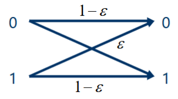
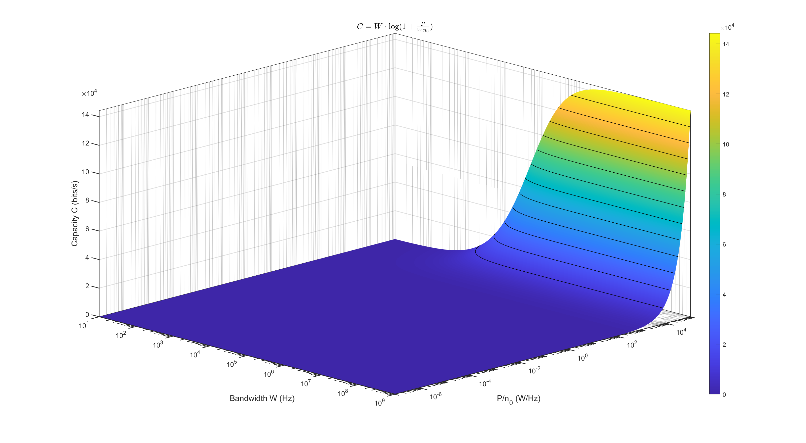
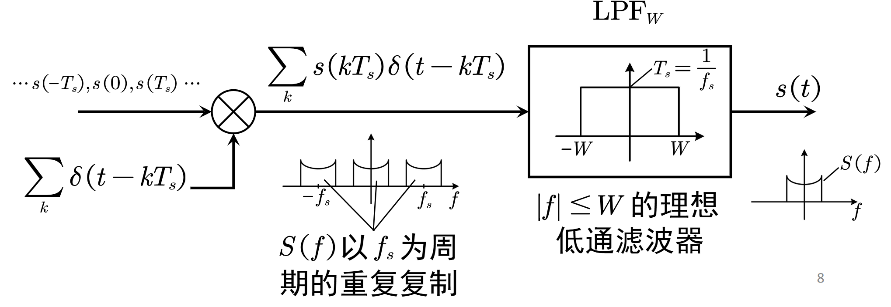
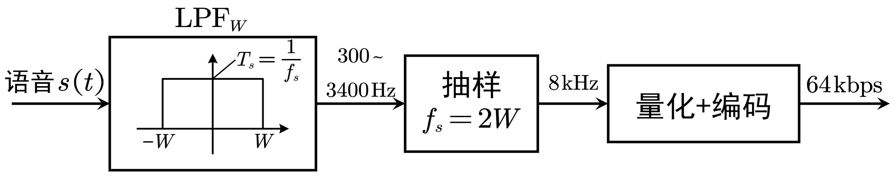

## 信息论基础
- 信息：消除不确定性
- 信息论中关注随机性带来的不确定性，使用随机变量描述不确定的事物。

### 熵

$$
H(X=x_i) = -\log p_i
$$

$$
H(X)=\mathbb E[H(X=x_i)] = -\sum_ip_i\log p_i
$$

熵是描述随机变量的二进制序列的**最短平均**长度（Huffman 编码）。Huffman编码为**前缀码**，前缀码任何码字不是其他码字的前缀（*唯一可译码*），可以使用二叉树上的叶子节点表示。

$H(X)$称信源$X$的熵，描述“典型”的信源输出序列的数量。对于长度$n$的信源符号序列，$x_i$出现的“典型”次数$\approx np_i$。个数为

$$
\#\approx\frac{n!}{(np_1)!(np_2)!\cdots}
$$

采用$nL$ 个bit组成的串描述$\#$个序列，则每个信源符号对应$L=\frac{1}{n}\log\#$个bit。根据

$$
\left(n\over e\right)^n\le n!\le n\left(n\over e\right)^n\quad\text{(Stirling 公式)}
$$

我们估计出

$$
\begin{aligned}
\frac{1}{n}\log\# &\le \frac{1}{n}\left(\log n\left(\frac{n}{e}\right)^n-\sum_{i=1}^M\log\left(\frac{np_i}{e}\right)^{np_i}\right)\\\\
&=\frac{1}{n}\log n-\sum_{i=1}^M\frac{np_i}{n}\log\frac{np_i}{n}\\\\
&\to -\sum_{i=1}^Mp_i\log p_i = H(X)\quad(n\to\infty)
\end{aligned}
$$

同时

$$
\begin{aligned}
\frac{1}{n}\log\# &\ge \frac{1}{n}\left(\log \left(\frac{n}{e}\right)^n-\sum_{i=1}^M\log\left(np_i\frac{np_i}{e}\right)^{np_i}\right)\\\\
&=\frac{1}{n}\log (n^Mp_1p_2\cdots p_M)-\sum_{i=1}^M\log\frac{np_i}{n}\\\\
&\to -\sum_{i=1}^Mp_i\log p_i = H(X)\quad(n\to\infty)
\end{aligned}
$$

因此$L=H(X)$. 进而离散随机变量的最大熵

$$
\max_{p_i}H(X)=\log|S|
$$

其中$S$为#$X$取值集合。

### 联合熵、条件熵与互信息

**联合熵**描述两个随机变量的联合不确定度，即观测两个随机事件结果带来的信息。

$$
H(XY)=-\sum_i\sum_jp_{i\,,j}\log p_{i\,,j}
$$

**条件熵**描述给定一个随机变量下，另一个随机变量*残存*的不确定度。

$$
H(X|Y)=-\sum_i \sum_j p_{i,j}\log p_{i|j}
$$

**链式法则**：两个随机变量的联合不确定性=一个的不确定性+知道这个之后剩下一个的不确定性

$$
H(XY)=H(X)+H(Y|X)=H(Y)+H(X|Y)
$$

**互信息**：观察一个随机变量带来的关于另一个随机变量的信息

$$
\begin{aligned}
I(X;Y)&=H(X)+H(Y)-H(XY)\\\\
&=H(X)-H(X|Y)\\\\
&=H(Y)-H(Y|X)
\end{aligned}
$$

若$X\,,Y$独立，则$I(X;Y)=0$, 观测一个随机变量完全无助于了解另一个随机变量，记为$X\perp Y$。此时$H(XY)=H(X)+H(Y)$。

若$X=f(Y)$, 则

$$
    p_{i|j}=\begin{cases}
    1\,, x_i=f(\alpha_j)\\\\
    0\,, x_i\ne f(\alpha_j)
    \end{cases}
$$

从而$H(X|Y)=0$, $H(XY)=H(Y)$。

### 连续随机变量的熵

**微分熵**为连续分布的**相对**不确定性：

$$
h(X)=-\int_{-\infty}^\infty p(x)\log p(x)\mathrm dx
$$

**微分联合熵**：

$$
h(XY)=-\int_{-\infty}^\infty p(x,y)\log p(x,y)\mathrm dx\mathrm dy
$$

**微分条件熵**：

$$
h(Y|X)=-\int_{-\infty}^\infty p(x,y)\log p(y|x)\mathrm dx\mathrm dy
$$

**互信息**为绝对值。定义为

$$
\begin{aligned}
I(X;Y)&=h(X)+h(Y)-h(XY)\\\\
&=h(X)-h(Y|X)\\\\
&=h(Y)-h(Y|X)
\end{aligned}
$$

给定**峰值约束**$|X|\le A$下最大熵分布为均匀分布

$$
p(x)=\frac{1}{2A}
$$

给定**方差约束**$\int_{-\infty}^\infty p(x)x^2\mathrm dx=\sigma^2$\,则最大微分熵分布为正态分布，熵为
$$
h(X)=\frac{1}{2}\log2\pi\mathrm e\sigma^2
$$

若随机向量由映射关系

$$
\mathbf Y=f(\mathbf X)
$$

则

$$
p_\mathbf{Y}(\mathbf{y})=p_\mathbf{X}(\mathbf{x})\det J
$$

$$
h(\mathbf Y)=h(\mathbf X)-\log\det J
$$

### 信道模型

信道对于输入符号$X$施加随机扰动得到观测到的结果$Y$，本质上可以使用一组条件概率表示。信宿通过观测$Y$得到关于$X$的信息量为$I(X;Y)$。因此，通信中希望**最大化互信息**，可以通过选择$X$的概率分布决定。即优化问题

$$
p_i^\ast=\argmax_{\sum_ip_i=1\,,p_i\ge 0} I(X;Y)
$$

**信道容量**: 表示平均每个信道符号最大的信息量（即单位时间内信道传达的最大信息量）

$$
C=\max_{\sum_ip_i=1\,,p_i\ge 0} I(X;Y)
$$

优化问题的表达式为

$$
p_i^\ast=\argmax_{\sum_ip_i=1\,,p_i\ge 0} \left\{-\sum_i\sum_{j|i}\log\frac{\sum_ip_ip_{j|i}}{p_{j|i}}\right\}
$$

#### 对称二进制信道

基本模型： 每个码字有$\varepsilon$概率出错变成另一个。

根据

$$
\begin{aligned}
I(X;Y)&=H(Y)-H(Y|X)\\\\
&=H(Y)-\sum_ip_i\left(-\sum_jp_{j|i}\log p_{j|i}\right)\\\\
&=H(Y)-\left(-\varepsilon\log\varepsilon-(1-\varepsilon)\log(1-\varepsilon)\right)
\end{aligned}
$$

注意到$\left(-\varepsilon\log\varepsilon-(1-\varepsilon)\log(1-\varepsilon)\right)$为常数，因此应当最大化$H(Y)$

$$
H(Y)\le 1\Leftrightarrow Y\sim\begin{pmatrix}
0 & 1\\\\
1/2 & 1/2
\end{pmatrix}\Leftrightarrow X\sim\begin{pmatrix}
0 & 1\\\\
1/2 & 1/2
\end{pmatrix}
$$

此时

$$
C=1+\varepsilon\log\varepsilon+(1-\varepsilon)\log(1-\varepsilon)
$$

#### 高斯信道

高斯信道为加性信道，认为观测到的结果为信源加上一个高斯噪声(由接收机热噪声引起)。

$$
Y=X+N,\quad f_N(n)=\frac{1}{\sqrt{2\pi\sigma^2}}\exp\left(-\frac{n^2}{2\sigma^2}\right)
$$

则信道的转移条件概率为

$$
f_{Y|X}(y|x)=\frac{1}{\sqrt{2\pi\sigma^2}}\exp\left(-\frac{(y-x)^2}{2\sigma^2}\right)
$$

互信息为

$$
\begin{aligned}
I(X;Y)&=h(Y)-h(Y|X)\\\\
&=h(Y)-h(X+N|X)\\\\
&=h(Y)-h(N)
\end{aligned}
$$

从而

$$
\begin{aligned}
C&=\max_{p(x)}I(X;Y)\\\\
&=\max_{p(x)}h(X+N)-h(N)\\\\
&=\max_{p(x)}h(X+N)-\frac{1}{2}\log 2\pi\mathrm e\sigma^2\\\\
\end{aligned}
$$

而

$$
\mathbb{E}(X+N)^2=\mathbb{E}X^2+\mathbb{E}N^2\le P+\sigma^2
$$

其中$P$为发射功率，认为与$X^2$的均值相关。所以

$$
\max_{p(x)}h(X+N)=\frac{1}{2}\log 2\pi\mathrm{e}(P+\sigma^2)
$$

因此高斯信道的信道容量为

$$
\begin{aligned}
C&=\max_{p(x)}h(X+N)-\frac{1}{2}\log 2\pi\mathrm e \sigma^2\\\\
&=\frac{1}{2}\log 2\pi\mathrm e (P+\sigma^2)-\frac{1}{2}\log 2\pi\mathrm e \sigma^2\\\\
&=\boxed{\frac{1}{2}\log\left(1+\frac{P}{\sigma^2}\right)}
\end{aligned}
$$

称为Shannon公式。

考虑带宽$W$, 加性白高斯噪声单边功率谱密度$n_0$。根据Nyquist采样定理单位时间内最多获得$2W$个独立采样。因此信道容量（单位时间最大互信息量）为

$$
\begin{aligned}
C&=\frac{1}{2}\log\left(1+\frac{P}{Wn_0}\right)\cdot2W\\\\
&=\boxed{W\log\left(1+\frac{P}{Wn_0}\right)}
\end{aligned}
$$

可见信道容量随着带宽$W$和信噪比$\frac{P}{n_0}$的增加而增加。在信噪比较低的情形下，根据Taylor展开

$$
\ln(1+x)=x+o(x)
$$

我们有近似

$$
C\dot=1.44\frac{P}{n_0}
$$

同样在高信噪比条件下

$$
C\dot=0.33W\mathrm{SNR}_\mathrm{dB}
$$

## 模拟信源的数字化

### 信源编码

信源编码的目的是将**时间连续、幅度连续**的**模拟信源**编码为比特串

$$
s(t)\mapsto 01\cdots 011
$$

其结构一般包括**抽样**、**量化**和**编码**三个步骤：

$$
s(t)-\boxed{\text{抽样}}\to x[k]=s(kT_s)-\boxed{\text{量化}}\to\hat x=Q(x)-\boxed{\text{编码}}\to 0\cdots10
$$

解码端则依次经过**译码**、**重建**和**内插**三个步骤，分别是**编码**、**量化**和**抽样**的逆过程。抽样和内插、编码和译码互为逆过程，具有无损性；但量化和重建是有损的。在一些实际系统（如语音的PCM（Pulse Coded Modulation））编码中，量化和编码同步完成。

$$
s(t)-\boxed{\text{抽样}}\to s(kT_s)-\boxed{\text{量化+编码}}\to 0\cdots10
$$

$$
\text{速率}R=\text{抽样频率}f_s=\frac{1}{T_s}\text{Samples/S}\times\text{平均量化编码长度}b\,\text{bit/Sample}
$$

### 抽样定理
抽样定理是指：对于带限于$|f|\leq W$的低通信号$s(t)$, 当抽样频率$f_s\geq 2W$就可以无失真恢复信号$s(t)$.

抽样过程可以表述为

$$
s(kT_s)=s(t)\ast\delta(t-kT_s)
$$

频域上即为$S(f)$以周期$f_s$复制。恢复时只需要通过截止频点为$W$的低通滤波器即可实现恢复。

该恢复过程在时域上体现为**内插**：(本质上就是卷一个sinc)

$$
s(t)=\sum_ks(kT_s)\frac{\sin 2\pi W(t-kT_s)}{\pi (tf_s-k)}
$$

对于最小抽样频率$f_s^{\min}=2W$ 带入内插公式得到

$$
s(t)=\sum_ks(\frac{k}{2W})\mathrm{sinc}(2Wt-k)
$$

为了确保信源的低通性，因此使用低通滤波进行预处理以保留其主要能量（特征）部分（对于语音信号主要集中于300-3400Hz）。低通滤波后使用$f_s=8k\mathrm{Hz}$频率采样并量化至8bit，PCM速率为$R=f_sb=64\mathrm {kbps}$。

### 量化Basics

量化是使用离散集合中的取值近似连续值$X$，同时确保近似误差尽可能小：

$$
Q(x)=y_i\,,\quad x_i<x\le x_{i+1}
$$

$I_i=(x_i,x_{i+1}]$表示第$i$个量化区间，$\Delta_i=x_{i+1}-x_i$为量化间隔，若$\Delta_i\equiv\Delta$则称为均匀量化，否则为非均匀量化。

量化是**多对一映射**，因而存在损失和误差。定义量化误差

$$
e(x)=x-Q(x)
$$

由于$x$是r.v., 因此$e(x)$为一个随机噪声，我们关注其统计特性。量化均方误差为（其实相当于噪声功率）

$$
\begin{aligned}
\sigma^2&=\int_{-\infty}^\infty [x-Q(x)]^2p(x)\mathrm{d}x\\\\
&=\sum_{i=1}^L\int_{x_i}^{x_{i+1}}(x-y_i)^2p(x)\mathrm{d}x
\end{aligned}
$$

定义量化信噪比为

$$
\mathrm{SNR}_q=\frac{\displaystyle\int_{-\infty}^\infty x^2p(x)\mathrm{d}x}{\displaystyle{\sum_{i=1}^L\int_{x_i}^{x_{i+1}}(x-y_i)^2p(x)\mathrm{d}x}}=\frac{\text{信号功率}}{\text{噪声功率}}
$$

若我们利用$Q(X)$精细设计编码器，则压缩后一个抽样的平均bit数最少为

$$
H(Q(X))=-\sum_{i=1}^{L}\int_{x_i}^{x_{i+1}}p(x)\mathrm{d}x\log\int_{x_i}^{x_{i+1}}p(x)\mathrm{d}x
$$

### 均匀量化

对于电平限制在$[x_{min}\,,x_{max}]$的抽样$x$， 使用$n$个bit进行均匀量化。则