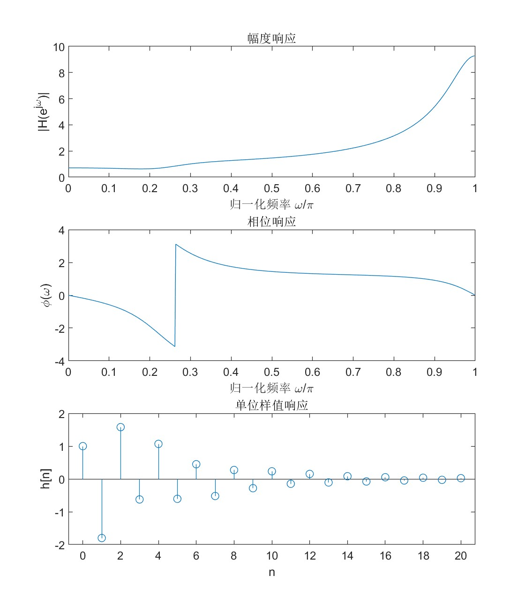

# MATLAB 常用函数总结
| 功能/响应类型     | 连续系统 (Continuous) | 离散系统 (Discrete) |
|-------------------|------------------------|----------------------|
| 定义系统          | `tf(b,a)` 或 `zpk(z,p,k)` | `tf(b,a,-1)` 或 `zp2tf(z,p,k)` |
| 冲激响应          | `impulse(sys)`         | `impz(b,a,N)`        |
| 阶跃响应          | `step(sys)`            | `stepz(b,a,N)`       |
| 任意输入响应      | `lsim(sys,x,t)`        | `filter(b,a,x)` 或 `conv(x,h)` |
| 频率响应 (幅频/相频) | `bode(sys)` 或 `freqresp(sys)` | `freqz(b,a,N)`       |
## 绘图相关
连续图（幅频相频/连续时域）用`plot(x,y)`画，离散响应用`stem(x,y)`画。使用`xlabel('xxx')`,`ylabel('xxx')`,`title('xxx')`画xy坐标轴和标题，支持latex语法。

子图定义：使用`subplot(m,n,p)`后，`plot`就能绘制$m\times n$图的第$p$个子图。如2006年题依次使用`subplot(3,1,1)`, `subplot(3,1,2)`, `subplot(3,1,3)`绘制幅频、相频、样值响应：
 
## 离散系统相关
### 得到系统函数
已知系统零点$\{z_1\,,z_2\,,\cdots\}$极点$\{p_1\,,p_2\,,\cdots\}$，即系统函数
$$
H(z)=k\cdot \frac{(z-z_1)\cdot(z-z_2)\cdots}{(z-p_1)\cdot(z-p_2)\cdots}
$$
使用`zp2tf`
```matlab
z = [z1;z2;...];   % 零点
p = [p1;p2;...];   % 极点
k = 1;       % 系统增益，可以调整
[b,a] = zp2tf(z,p,k);   % 转成分子分母多项式
``` 
即可得到系统函数$H(z)=B(z)/A(z)$。如果已知条件是差分方程
$$
a_0y[n]+a_1y[n-1]+\cdots+a_py[n-p]=b_0x[n]+b_1x[n-1]+\cdots+b_qx[n-q]
$$
则直接令
```matlab
b = [b0,b1,b2...bq];
a = [a0,a1,a2...ap];
```
即可。
### 画频率响应
频率响应即
$$
H(\exp(j\omega))=H(z){|} _{z=\exp(j\omega)}
$$
使用函数`freqz`得到频率响应（复数形式）
```matlab
[H,w] = freqz(b,a,512);
```
然后使用`abs`和`angle`得到模和相位, 使用`plot`画图。
```matlab
subplot(2,1,1)
plot(w/pi, abs(H));
xlabel('归一化频率 \omega/\pi');
ylabel('|H(e^{j\omega})|');
title('幅度响应');
subplot(2,1,2);
plot(w/pi, angle(H));
xlabel('归一化频率 \omega/\pi');
ylabel('\phi(\omega)');
title('相位响应')
```
### 画时域响应
#### 初值
```matlab
yPast = [y(-1), y(-2), ...];
xPast = [x(-1), x(-2), ...];
zi = filtic(b,a,yPast,xPast);
```
得到初值`zi`,然后`filter(b,a,x,zi)`即可。
#### 样值和阶跃
分别使用`impz`和`stepz`绘制。如
```matlab
h = impz(b,a,20);   % 前20个冲激响应
stem(0:19,h);
xlabel('n'); ylabel('h[n]');
title('单位样值响应');
```
#### 一般信号的响应
对于已知的$x[n]$, 只需要令
$$
y[n]=x[n]*h[n]
$$
即可得到其响应。matlab种使用函数`conv(x,h)`即可，其中`h`由`impz`得到。同样也可以利用`filter`函数得到
```matlab
y = filter(b,a,x);
```
其中系数矩阵`[b,a]=zp2tf(z,p,k);`对应
$$
H(z)=\frac{B(z)}{A(z)}
$$

$x[n]$可以通过对`(0:N)`作逐元素运算得到。这里`(0:N)`表示矩阵$[\,0\,,1\,,2\,,\cdots\,,N\,]$