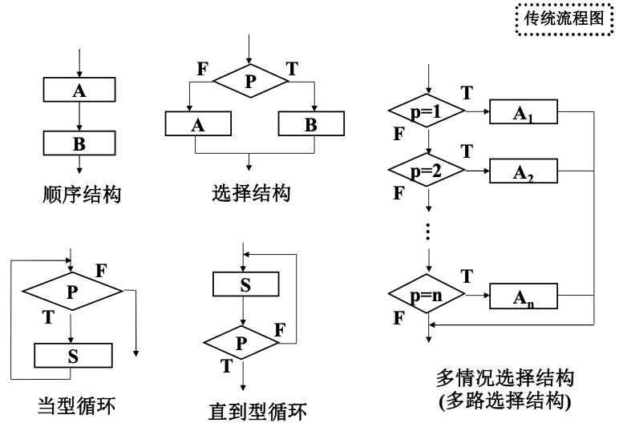

# 计算机程序设计基础
## C部分（计算机程序设计基础（1））
### 绪论

算法是指**解题方案的准确而完整的描述**。从程序角度来看，也可以说**算法是一个有限条指令的集合**，这些指令确定了解决某一特定类型问题的运算序列。在进行问题分析时，要建立数学模型或对常用
的方法进行分析比较，这就是算法设计。

#### 流程的描述

**流程图**是用图形描述处理流程的工具。一般分为**传统流程图**和**结构化流程图（即NS图）**

**传统流程图**如下



传统流程图的主要缺点：

* 本质上不是逐步求精的好工具，它会使程序员过早地考虑程序的控制流程，而不去考虑程序的全局结构。
* 不易表示层次结构。
* 不易表示数据结构和模块调用关系等重要信息。
* 用箭头代表控制流，因此，程序员不受任何约束，可以完全不顾结构程序设计的思想，随意进行转移控制。

**结构化流程图**要求把计算机程序的结构限制为**顺序、选择和循环**三种基本结构，以提高可读性。特点：

* 以控制结构为单位，只有一个入口和一个出口，使各单位之间的
接口比较简单，每个单位也容易被人们所理解。
* 缩小了程序的静态结构与动态执行之间的差异，使人们能方便、
正确地理解程序的功能。

**NS图**是一种不允许破坏结构化原则的图形算法描述工具，又称盒图。在NS图中，去掉了传统流程图中容易引起麻烦的流程线，全部算法都写在一个框内，每一种基本结构也是一个框。


NS图基本特点:

* 功能域比较明确，可以从框图中直接反映出来
* 不可能任意转移控制，符合结构化原则
* 很容易确定局部和全局数据的作用域
* 很容仪表示嵌套关系和表示模块的层次结构


**自然语言**：用自然语言描述算法流程没有统一模式，随意性太强，
表达不严格，不建议采用。

**算法描述语言**：例如
```pascal
输入 x, y
IF (x=0) THEN
    输出 错误信息
ELSE
{ 
    z=y/x
    输出 z
}
```
用算法描述语言描述算法流程，相对来讲表达严格，可
以采用。
```C
#include <stdio.h>
main( )
{ 
    float x, y, z;
    printf("input x, y:"); scanf("%f%f", &x, &y); /* 输入提示 */
    /* 读入x与y的值 */
    if (x==0)
        printf("error! x=0\n"); /* 若x=0，则输出错误信息 */
    else /* 否则计算并输出结果 */
    { 
        z=y/x;
        printf("z=%f\n"，z);
    }
}
```
#### 调试与运行
**测试**是指通过一些典型例子，尽可能多地发现程序中的错误。因此，测试的目的是**为了发现程序中的错误**，而**不是为了证明程序正确。**

**调试**是指找出程序中错误的具体位置，并改正错误。因此，调试又称查错（debug）。

#### 程序设计语言
程序设计语言是用户用来编写程序的语言，它是人与计算机之间交换信息的工具。是计算机软件系统的重要组成部分，而相应的各种语言处理程序属于系统软件。计算机语言可以分为：**机器语言**、**汇编语言**和**高级语言**。

用任何一种高级语言编写的程序(称为源程序)都要通过**编译程序**翻译成机器语言程序(称为目标程序)后计算机才能执行，或者通过**解释程序**边解释边执行(Basic、Python等)。

#### C语言入门
C语言程序的组成：
```
宏定义, 定义常量N，定义宏函数
文件引用，引用系统文件，引用用户文件
外部变量（全局变量，文件局部变量）
函数向前引用说明
主函数，带命令行参数
{
    函数向前引用说明
    局部变量（静态局部变量）
    调用函数
    分配动态内存
    调用宏定义函数
    文件操作
    输入输出，格式问题
}
```
### C语言基本数据类型
#### 计算机记数制
通常称某个固定位置上的计数单位为**位权**。计算机是由电子器件组成的，考虑到**经济、可靠、容易实现、运算简便、节省器件**等因素，在计算机中的数都用二进制表示而不用十进制表示。

十进制整数转换成二进制整数: 除2取余法

$$
\begin{array}{rcll}
2 \,|\, \underline{97} & & & \\
2 \,|\, \underline{48} & & \text{余数为1，即 } a_0 = 1 & \\  
2 \,|\, \underline{24} & & \text{余数为0，即 } a_1 = 0 & \\
2 \,|\, \underline{12} & & \text{余数为0，即 } a_2 = 0 & \\
2 \,|\, \underline{6}  & & \text{余数为0，即 } a_3 = 0 & \\
2 \,|\, \underline{3}  & & \text{余数为0，即 } a_4 = 0 & \\
2 \,|\, \underline{1}  & & \text{余数为1，即 } a_5 = 1 & \\
0                      & & \text{余数为1，即 } a_6 = 1 & \\
\end{array}
\Rightarrow (97)_{10}=(a_6a_5\cdots a_0)_2=(1100001)_2
$$

十进制整数转换成二进制整数:直接求和

十进制小数转换成二进制小数：乘2取整法。一个十进制小数不一定能完全准确地转换成二进制小数。

$$
\begin{array}{rcll}
\phantom{0}0.32 \\
\underline{\times\phantom{0.0}2} \\
0.64 & \quad \text{整数部分为0，即 } a_{-1}=0 \\
\phantom{0}0.64 \\
\underline{\times\phantom{0.0}2} \\
1.28 & \quad \text{整数部分为1，即 } a_{-2}=1 \\
\phantom{0}0.28 & \quad \text{余下的小数部分} \\
\phantom{0}0.28 \\
\underline{\times\phantom{0.0}2} \\
0.56 & \quad \text{整数部分为0，即 } a_{-3}=0 \\
\phantom{0}0.56 \\
\underline{\times\phantom{0.0}2} \\
1.12 & \quad \text{整数部分为1，即 } a_{-4}=1 \\
\phantom{0}0.12 & \quad \text{余下的小数部分} \\
\phantom{0}0.12 \\
\underline{\times\phantom{0.0}2} \\
0.24 & \quad \text{整数部分为0，即 } a_{-5}=0 \\
\cdots\cdots
\end{array}
$$

其他进制（16/8/2）都同理。

|        | 十进制 | 二进制 | 八进制 | 十六进制 |
|--------|--------|--------|--------|----------|
| 基数   | 10     | 2      | 8      | 16       |
| 位权   | 10^K   | 2^K    | 8^K    | 16^K     |
| 数字符号 | 0~9   | 0, 1   | 0~7    | 0~9 与 A~F |

**整数**：在计算机中，一个数的正、负号也是用一个二进制位来表示。一般将整个二进制数的最高位定为二进制数的符号位。符号位为“0” 时表示正数，符号位为“1”时表示负数。

| 位数 | 有符号范围 | 无符号范围 |
| ---- | -------- | -------- |
| 8 | $2^8-1=255$ | $-127\sim127$ |
| 16 | $2^{16}-1=65535$ | $-32767\sim32767$ |
| 32 | $2^{32}-1=4294967295$ | $-2147483647\sim2147483647$ |

使用的二进制位数越多，则能表示的数值的范围就越大。

**定点数**：指小数点位置固定的数

**定点整数**中，一个数的最高二进制位是符号位，用
以表示数的符号；而小数点的位置默认为在最低(即最右边)
的二进制位的后面，但小数点不单独占一个二进制位。

**定点小数**中，一个数的最高二进制位是符号位，用以表示数的符号；而小数点的位置默认为在符号位的后面，它也不单独占一个二进制位。因此，在一个定点小数中，符号位右边的所有二进制位数表示的是一个纯小数。

**原码、反码、补码与偏移码**：

* 原码是上述二进制定点数表示
* 反码是正数的原码、负数原码除符号位外其余各位都取反( 即将0变为1，1变为0 )
* 正数补码和原码相同，负数的补码是在该数的反码的最后(即最右边)一位上加1。补码比原码表示可以多一个负数；补码的补码是原码；补码加减法不用考虑符号。
* 补码的符号位取反即是偏移码

在二进制定点数的四种表示中，原码比较直观，但不能用于具体运算；补码与偏移码可用于具体运算；反码只起到由原码转换为补码或偏移码的中介作用。

#### 常量与变量
**C语言中的基本数据类型**有以下4种：

1. 整型：包括{有符号、无符号}{长，短，标准，超长}整型；一般编译器中，长整型=基本整型。
1. 实型：包括单精度、双精度；
1. 字符型：分为有符号、无符号字符；
1. 空类型。

C语言中同时有**枚举、构造、指针**等复合数据类型。

### 数据的输入输出
数据的输入输出包括以下几项：

1. 用于输入或输出的设备
1. 输入或输出数据的格式
1. 输入或输出的具体内容

¥
C语言中，提供了用于输入与输出的函数，在这些函数中，键盘是标准输入设备(stdin)，显示器是标准输出设备(stdout)。

#### 格式输出函数
基本的格式输出语句为
```c
printf("格式控制",输出列表);
```
格式说明符总是以%开头，后面紧跟的是具体的格式。格式说明符与输出列表中的量是一一对应的，类型要一致，个数应该相同。常用格式说明符包括：

**整型格式说明符**：

| 进制 | 说明 |
|------|------|
| 十进制 | `%d`,`%md`用于`int`,`%ld`,`%mld `用于long长整型,`%hd`, `%mhd` 用于short短整型`%u`, `%mu` 用于无符号int整型,`%lld`, `%mlld` 用于long long超长整型 |
| 八进制 | `%o`, `%mo` 用于int整型,`%lo`, `%mlo` 用于long长整型,`%llo`, `%mllo` 用于long long超长整型 |
| 十六进制 |`%x`, `%mx` 用于int整型, `%lx`, `%mlx` 用于long长整型, `%llx`, `%mllx` 用于long long超长整型 |

其中m表示输出的整型数据所占总宽度（即列数），当实际数据的位数不到m位时，数据前面将用空格补满。如果在格式说明符中说明了宽度m，但实际输出的数据位数大于m，则**以输出数据的实际位数进行输出，自动突破场宽限制。**

**实型格式说明符**：十进制形式`%f`,`%m.nf`;指数形式`%e`,`%m.ne`，`%E`,`%m.nE`;m表示**整个数据**所占的宽度，n表示小数点后面所占的位数。如果省略了m和n，那么`%f`, `%e`或`%E`都将输出**6位小数**。

**字符型格式说明符**：格式说明符为`%c`或`%mc`.

C语言默认所有浮点常数是double类型，以尽可能的最大精度存储数据。因此形如
```c
float x;
x = 2.5;
```
会出现警告`“=”: 从“double”到“float”截断`。而改为
```c
float x;
x = 2.5f;
```
就不会出现警告。

**格式输出函数的执行过程**如下：

1. 在计算机内存中开辟一个**输出缓冲区**，用于存放输出项目表中各项目数据。
1. 依次**计算项目表中各项目（常量或变量或表达式）的值**，并按各项目数据类型应占的字节数依次将它们存入输出缓冲区中。
1. 根据“格式控制”字符串中的各格式说明符依次从输出缓冲区中取出若干字节的数据（如果是非格式说明符，则将按原字符输出），转换成对应的十进制或指定的进制数据进行输出。

尽量不要在输出语句中改变输出变量的值，因为可能会造成输出结果的不确定性。这被称为C语言国际标准中的undefined behavior。

`printf`函数有返回值，返回值是**本次调用输出字符的个数**，包括回车等控制符。

#### 格式输入函数

基本的格式输入语句为
```c
scanf("格式控制",内存地址表);
```

与格式输出一样，在格式控制中，用于说明输入数据格式的格式说明符总是以`%`开头，后面紧跟的是具体的格式。格式说明符与上面输出部分类似。需要注意：==在用于输入时，无论是单精度实型还是双精度实型，都不能用`m.n`来指定输入的宽度和小数点后的位数,但整数则可以用`m`表示输入宽度==

在格式输入中，内存地址表中的各项目必须是变量地址，而不能是变量名，且彼此间用`,`分隔。为此，C语言专门提供了一个取地址运算符`&`。例如，`&a`表示变量`a`在内存中的地址。

当用于输入整型数据的格式说明符中没有宽度说明时，则在具体输入数据时分为以下两种情况.

1. 如果各格式说明符之间没有其他字符，则在输入数据时，两个数据之间用"空格"、或"Tab"、或"回车"来分隔。
1. 如果各格式说明符之间包含其他字符，则在输入数据时，应输入与这些字符相同的字符作为间隔。

当整型或字符型格式说明符中有宽度说明时，按宽度说明截取数据。

为了便于程序执行过程中从键盘输入数据，在一个C程序**开始执行**时，系统就在计算机内存中开辟了一个输入缓冲区，用于暂存从键盘输入的数据。开始时该输入缓冲区是空的。当执行到一个输入函数时，就**检查输入缓冲区中是否有数据**。

1. 如果输入缓冲区中已经有数据（上一个输入函数读剩下的），则依次按照“格式控制”中的格式说明符从输入缓冲区中取出数据转换成计算机中的表示形式（二进制），最后存放到内存地址表中指出的对应地址的内存中。
1. 如果输入缓冲区中没有数据（即输入缓冲区为空），则等待用户从键盘输入数据并依次存放到输入缓冲区中。当输入一个`回车`或`换行`符后，将依次按照“格式控制”中还未用过的格式说明符从输入缓冲区中取出数据转换成计算机中的表示形式（二进制），最后存放到内存地址表中指出的对应地址中。