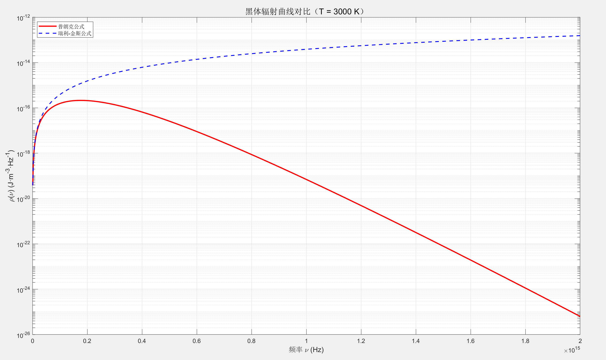

## 早期量子理论
### 光的波粒二象性与早期量子理论
#### 黑体辐射
**黑体**指完全吸收**所有频率**的光的物体。可以通过空腔实现黑体。实际物体不是真正的黑体，但可以将恒星、白炽灯等近似为黑体。黑体辐射**仅和温度$T$有关**。对黑体辐射**单位体积单位频率内能量**的刻画有以下：
- 瑞丽-金斯公式：使用经典理论算出，在高频发散（认为驻波平均能量为$kT$）

$$
\rho(\nu)=\frac{8\pi\nu^2}{c^3}kT
$$

- 普朗克公式：全波段符合实验结果

$$
\rho(\nu)=\frac{8\pi\nu^2}{c^3}\cdot\frac{h\nu}{\exp(h\nu/kT)-1}
$$

#### 光电效应

光照使电子逃逸，光电子能量至于光的频率有关，且没有时间延迟，因此波动说不能解释光电效应。爱因斯坦解释为：

$$
K_e = h\nu - W_0
$$

其中$K_e$电子动能，$W_0$使电子再金属中的逸出功，$h\nu$为**光子能量**。根据相对论, 由于光子没有静质量，$m_0=0$，从而

$$
E^2=m_0^2c^4+p^2c^2=p^2c^2\Rightarrow E=pc
$$

因此

$$
p=\frac{E}{c}=\frac{h}{\lambda}
$$

#### Compton 效应（证明光的粒子性）

Compton实验于1923年证明：光在自由电子上发生散射（碰撞），散射光频率与散射角度有关。