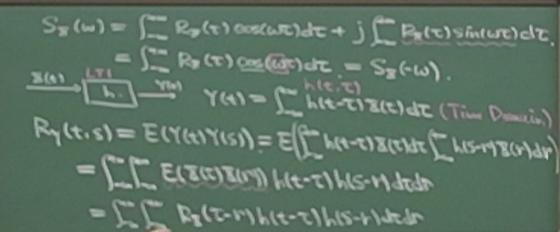
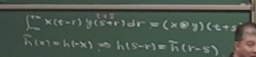

!!! "note"
    从第三节课开始，之前的慢慢补（）
## Correlation Function and Positive Definite Functions

### Correlation Function

The correlation function \( R_X(t, s) \) for a random process \( X(t) \) is defined as:

$$
E[X(t) X(s)] = R_X(t, s)
$$

For wide-sense stationary (W.S.S.) processes, we have:

$$
R_X(t, s) = R_X(t - s)
$$

### Positive Definite Function

A function \( f(x) \) is positive definite (p.d.) if the following condition holds:

$$
f(x) \text{ is p.d.} \iff \sum_{i,j=1}^n \lambda_i \lambda_j \left( f(t_i - t_j) \right) \geq 0, \quad \forall \, \lambda_1, \lambda_2, \dots, \lambda_n
$$

In matrix notation, for a matrix \( A \):

$$
A \text{ is p.d.} \iff X^T A X \geq 0 \quad \text{for all} \, X \in \mathbb{R}^n
$$

And for symmetric matrices:

$$
\frac{1}{2} X^T (A + A^T) X = X^T A X \geq 0
$$

### Complex Case

For the complex case, the correlation function becomes:

$$
R_X(t, s) = E[X(t) X^*(s)]
$$

The correlation matrix is:

$$
R = E[X X^H], \quad X^H R X \neq 0
$$

Where \( X = (X(t_1), \dots, X(t_n))^T \) and \( R_{ij} = E[X(t_i) X^*(t_j)] \).

### Fourier Transform and Power Spectrum

The Fourier transform \( \hat{X}(\omega) \) of a signal \( X(t) \) is defined as:

$$
\hat{X}(\omega) = \int_{-\infty}^{\infty} X(t) \exp(-j\omega t) \, dt
$$

The Power Spectrum Density \( S_X(\omega) \) is given by:

$$
S_X(\omega) = \lim_{T \to \infty} \frac{1}{2T} \int_{-T}^T X(t) \exp(-j\omega t) \, dt
$$

### White Noise

For white noise, the power spectrum density \( S_X(\omega) \) is constant, which implies:

$$
S_X(\omega) = C \quad \text{(constant)}
$$

In this case, the correlation function at lag 0 is:

$$
R_X(0) = E[X(t)^2]
$$

Thus, for white noise:

$$
S_X(\omega) = \int_{-\infty}^{\infty} R_X(t) \exp(-j\omega t) \, dt = R_X(0)
$$

### Relationship with Fourier Transforms

The Fourier transform of the correlation function can be expressed as:

$$
\hat{X}(\omega) = \int_{-\infty}^{\infty} X(t) \exp(-j\omega t) \, dt
$$

For the Power Spectrum Density:

$$
S_X(\omega) = \lim_{T \to \infty} \frac{1}{2T} \int_{-T}^T X(t) \exp(-j\omega t) \, dt
$$

And in the case of complex processes:

$$
S_X(\omega) = \int_{-\infty}^{\infty} R_X(t) \exp(-j\omega t) \, dt
$$

### Positive Definite Condition

For positive definiteness, the following condition must be satisfied for all \( \lambda_1, \lambda_2, \dots, \lambda_n \):

$$
\sum_{i,j=1}^n \lambda_i \lambda_j f(t_i - t_j) \geq 0
$$

Additionally:

$$
\frac{1}{2} X^T (A + A^T) X = X^T A X \geq 0
$$

This ensures that \( A \) is positive definite.

### Complex Process Analysis

For a complex process, the correlation function is given by:

$$
R_X(t, s) = E[X(t) X^*(s)]
$$

The correlation matrix is:

$$
R = E[X X^H]
$$

We also have:

$$
S_X(\omega) = \int_{-\infty}^{\infty} R_X(t) \exp(-j\omega t) \, dt
$$

## Spectrum of Stochastic Process

$$
X(t)\, w.s.s.,\quad \int_{-\infty}^{\infty}|X(t)|dt<\infty?\quad X(t)\to R_X(\tau)
$$
功率谱密度
$$
S_X(\omega)=\lim_{T\to\infty}\frac{1}{T}\mathbb{E}\left|\int_{-\frac{T}{2}}^{\frac{T}{2}}\exp(-j\omega t)dt\right|^2=\int_{-\infty}^{\infty}R_X(\tau)\exp(-j\omega \tau)d\tau
$$

$$
R_X(\tau)=\frac{1}{2\pi}\int_{-\infty}^{\infty}S_X(\omega)\exp(j\omega \tau)d\omega
$$

$$
\Rightarrow 2\pi R_X(0)=\int_{-\infty}^{\infty}S_X(\omega)d\omega
$$

$X(t)$ 是实数，$R_X(\tau)=\mathbb E(X(t)X(t+\tau))$ is Real.

$$

\begin{aligned}
\Rightarrow S_X(\omega)&=\int_{-\infty}^{\infty}R_X(\tau)\cos(\omega\tau)d\tau+j\int_{-\infty}^{\infty}R_X(\tau)\sin(\omega\tau)d\tau\\\\
&= \int_{-\infty}^{\infty}R_X(\tau)\cos(\omega\tau)d\tau=\S_X(-\omega)
\end{aligned}

$$
考虑LTI系统$Y(t)=\text{LTI}[X(t)]$

$$
Y(t)=\int_{-\infty}^\infty h(t-\tau)X(\tau)d\tau\quad\textcolor{cyan}{(Time Domain)}
$$

$$

\begin{aligned}
R_Y(t,s) &= \mathbb E(Y(t)Y(s))\\\\
&= \mathbb E(\int_{-\infty}^\infty h(t-\tau)X(\tau)d\tau\int_{-\infty}^\infty h(s-\tau)X(\tau)d\tau)\\\\
&= \int_{-\infty}^\infty\int_{-\infty}^\infty\mathbb E(X(\tau)X(r))h(t-\tau)h(s-\tau)d\tau dr\\\\
&= \int_{-\infty}^\infty\int_{-\infty}^\infty R_X(\tau-r)h(t-\tau)h(s-\tau)d\tau dr\\\\
\end{aligned}
$$

$$
\int_{-\infty}^{\infty}x(t-r)y(s+r)dr=(x\ast y)(t+s)
$$

$$
\tilde{h}(x)=h(-x)\Rightarrow h(s-r)=\tilde{h}(r-s)
$$

$$
\int_{-\infty}^{\infty}R_X(\tau-r)h(t-\tau)h(r-s)d\tau dr = R_X\ast h \ast \tilde h(t-s)
$$
$$
\Rightarrow \textcolor{cyan}{S_Y(\omega)}=\int_{-\infty}^{\infty} R_X\ast h \ast \tilde h(t)\exp(-j\omega t)dt = \textcolor{cyan}{\boxed{S_X(\omega) H(\omega) H^\ast(\omega)}}
$$
而
$$
\int_{-\infty}^{\infty}\tilde h(t)\exp(-j\omega t)dt=\int_{-\infty}^{\infty}h(-t)\exp(-j\omega t)dt=H^\ast(\omega)
$$
因此
$$
\textcolor{cyan}{S_Y(\omega) = \boxed{S_X(\omega) |H(\omega)|^2}}
$$